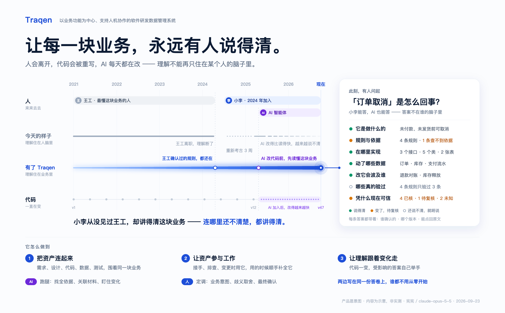
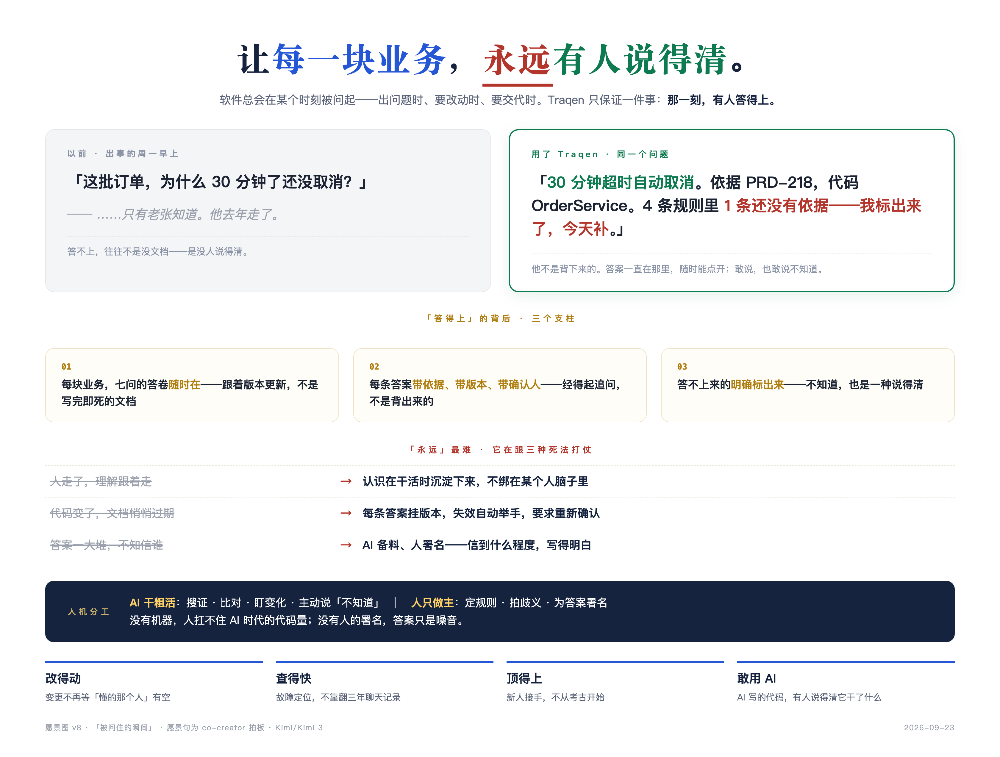

> 语言：**简体中文（当前产品介绍）** · [English（暂未同步本次愿景）](README.md)

# Traqen

**让每一块业务，永远有人说得清。**

Traqen 是一个**以业务功能为中心、支持人和 AI 协作的软件研发数据管理系统**。它把需求、设计、代码、SQL、配置、测试与运行证据关联到同一块业务，让这些资产不只是被保存，而是持续参与接手、排查、变更与验证。

人会更替，软件会演进，参与工作的智能体也会变化。Traqen 希望留下的，不只是一次回答，而是**后来的人和 AI 仍能弄明白这块业务、检查已有依据，并接着把工作做好的能力**。

它面向持续维护和演进的软件系统，包括历史遗留系统、新开发系统、AI 参与生成的系统，以及 Traqen 自身；不是仅面向老代码的逆向工具，也不是要求每个人天天签字的审计系统。

[快速启动](#快速启动) · [怎样使用](#怎样使用-traqen) · [功能与设计](#功能与设计现状) · [当前实现](#当前实现基线) · [文档导航](#文档导航)

> 项目仍在迭代。以下愿景与目标工作方式不等于全部能力已经交付；当前可运行入口、设计状态和实现边界分别说明，不以效果图或设计发布代替产品验收。

## 为什么需要 Traqen

“这块业务是怎么回事？”不应只能得到“要问当年写它的人”。

软件的业务认识分散在文档、实现、测试、配置和人的经验中。资料齐全也可能相互矛盾；测试通过，也不代表所有业务规则都被验证。每次换人、处理故障或修改需求，如果都要重新拼出这些关系，过去的研发投入就难以持续发挥作用。AI 可以参与调查和实现，但它的输出同样需要依据、适用范围和后续核查。

Traqen 要把三件事连成一个持续工作的过程：**理解能够接续，需要时能够查证，已有积累能够帮助下一次改变。**

### 三张图，同一个愿景

三张图分别呈现时间、使用时刻和工作延续三个视角，而不是三套产品：

| 视角 | 核心意思 | 希望带来的业务价值 |
| --- | --- | --- |
| 宪宪：理解不随人离开 | “永远有人”不是某个人永远在，而是认识、依据和未知能够被接续 | 接手不再完全依赖原作者，减少关键人依赖 |
| Kimi：需要时说得清 | 出问题、要改动、要交接时，能找到有依据的回答，也能明确说出不知道什么 | 缩短调查与澄清的过程，避免把猜测当成事实 |
| 砚砚：积累支撑下一次工作 | 人和 AI 使用同一块业务的资产，工作中的新认识再补回来 | 减少重复调查与返工，让软件更容易维护和演进 |

<details>
<summary>查看三张完整愿景图</summary>

#### 宪宪 · 人在更替，理解仍能接续



#### Kimi · 被问起的那一刻，依据和未知都说得清



#### 砚砚 · 把已有的积累，变成下一次改变的底气


三图保留各自的讨论表达，人物、时间线、规则数量与结果均为场景示意，不是实测收益或产品运行截图。图中的七问修订、人工署名等表达不自动成为功能合同：不是每项 Agent 分析都要人签字，也不能把“永远”理解为保证没有未知或遗漏。具体边界以本文与各功能的活动设计为准。

</details>

## “说得清”要回答什么

Traqen 从以下七个基础问题组织业务理解，而不是从文件目录或代码行数定义产品价值：

1. 这个功能是做什么的？
2. 有哪些业务规则、角色、状态和例外？
3. 它由哪些设计、代码、SQL 和配置实现？
4. 它会读取或改变哪些业务数据？
5. 哪些测试验证了哪些业务规则？
6. 当前结论对应哪个代码、配置、数据库和环境版本？
7. 为什么可以相信当前版本是正常的？

这不是填满七格就能判定“正常”的问卷。每条结论都应说明依据、适用范围、版本条件和当前状态；人工确认的结论还应保留确认来源。第七问需要展示支撑判断的证据，以及缺失、陈旧、冲突、失败和未验证部分，不能简化成一个综合绿灯。

在真实工作中，还要沿这些依据继续追问：**为什么采用这条规则？它与哪些业务相关？改它会影响什么，需要重新验证哪里？** 问题的拆分与展示方式由具体设计细化，README 不将讨论中的“七问／八问”改排冻结为新数据模型。

“永远有人说得清”并非承诺始终无所不知，而是让已有认识可继承、可检查，让变化后的适用性可以重新核查，让尚不清楚的地方明确可见、能够继续调查。

## Traqen 做好三件事

### 1. 把资产连起来

以稳定的业务功能身份组织需求、设计、实现、配置、业务数据、测试和运行证据。关系必须有依据并能够回到原材料，不是把文件放进同一个目录，也不是用 AI 摘要覆盖原文。

业务意图与实现观察分别保留：代码可以说明“实际怎样做”，不能单凭它推断“业务就应该这样”；人的解释也不能抹掉相反的实现证据。

### 2. 让资产参与工作

让人和 AI 在接手、排查、变更、测试与交付时共同使用这些资产。机器处理可提取的事实，Agent 调查与解释，人补充业务意图、处理歧义和作出必要取舍；新发现、纠正和验证结果再关联回业务。

按 [F003 的五档分流](docs/design/F003-traceability-graph/README.md#5-五档分流)，证据充分、条件明确且无未决冲突的结果可以自动收录为 **Agent 分析态**，不冒充人工确认。缺证据先继续调查，真正需要业务判断的问题才交给人；无法可靠解释的材料保留为未知。

### 3. 让理解跟着变化走

保留来源版本、结论依据、历史决定与实际验证记录。业务要求或实现发生变化后，定位需要重新调查、修正或验证的部分，避免沿用已经不适用的结论，也避免把整块业务一律推倒重来。

**这次弄明白的，成为下次的起点。** 维护理解仍然需要工作；目标是复用已有依据、聚焦变化，而不是宣称“一次确认永久正确”或“零维护”。

## 谁来用，为什么用

| 使用者与真实任务 | 希望获得的帮助 | 如何判断有价值 |
| --- | --- | --- |
| 业务／产品负责人澄清规则 | 对照设计、实现与验证，找到意图不一致或尚未决定的部分 | 少些反复解释，减少理解偏差造成的返工 |
| 研发或接手者排查、修改功能 | 找到规则依据、实现位置、业务关联与未知范围 | 缩短重复调查时间，降低对原作者的依赖 |
| 测试与质量人员制定回归范围 | 将规则、测试资产、实际执行与结果关联起来 | 说清哪些验过、哪些没验，减少漏验与无依据的覆盖声明 |
| 交付与运维人员核查当前版本 | 查看准确版本和环境下的证据、剩余问题及历史变化 | 缩短证据整理过程，更清楚地交接风险 |

同一个人可以承担多种工作；AI 是参与调查与执行辅助的协作者，不是自动拥有业务决定权的主体。归属记录帮助大家知道找谁澄清、谁参与过设计与实现，而不是把日常使用变成追责流程。

上述收益需要用真实任务验证。我们看接手与调查耗时、重复劳动、返工、验证缺口及结论可回查情况，不用图谱节点数、文档篇幅或扫描完成率冒充业务价值。

## 怎样使用 Traqen

以下是目标工作方式；当前可运行的本地参考流程见[快速启动](#快速启动)，不应把本节读成所有步骤已经端到端交付。

1. **带着一件真实工作进入。** 例如“接手订单取消”“排查超时订单没有取消”或“修改取消条件”。先明确业务范围与问题，不要求先把整个系统人工讲解一遍。
2. **固定本次使用的材料。** 选择工作空间和获准来源，保留精确版本、材料清单与缺口；文档、代码、SQL、配置和测试共同参与，而不是只分析代码。
3. **调查并核对。** 查看 Agent 解释及原文依据，区分事实、推断、人工确认与未知；对业务歧义提出具体问题，而不是要求人逐页批准整份报告。
4. **完成当前工作并留下依据。** 将补充的业务说明、选择理由、修正和真实验证结果关联到这块业务。测试文件存在不等于执行过，执行通过也只说明相应条件下的验证结果。
5. **下次继续，而不是重新开始。** 基于新材料版本比较变化、核查受影响认识、决定后续验证；历史依据保留，不静默覆盖。

例如“取消成功”可能指订单状态关闭，也可能包含退款完成。Traqen 的目标不是替业务方猜一个答案，而是把设计、实现与测试中的不同含义摆出来，帮助人和 AI 澄清、落实并验证。同一块业务以后再改变时，这次的决定及适用条件仍然能被找到。

首次接入、提取和核查有真实成本。“从一件事开始”是价值交付的组织方式，**不是已经支持首次局部扫描的声明**；当前参考分析首次运行仍为 `FULL`，不承诺固定分钟数或零配置成本。

## 功能与设计现状

下表描述设计职责和文档状态，不是功能完成清单。实现、部署与验收需要各自的证据。

| 功能 | 对共同愿景的贡献 | 当前设计入口与边界 |
| --- | --- | --- |
| F001 工作空间与来源快照 | 让结论有准确、可回查的材料基础 | [已确认设计](docs/design/F001-workspace-source-truth/README.md)；首期一个 Git 组件、一个目录组件或两者，显式创建版本；冻结不等于启动分析 |
| F002 确定性事实层 | 提供可引用的技术事实、关系与缺口 | [功能设计 V1.0](docs/design/F002-deterministic-facts/README.md)；接口、首期提取能力及部分技术合同仍待定 |
| F003 业务调查与追溯图谱 | 将原材料、技术事实、Agent 调查与人工判断组织成可共同使用的认识 | [功能 V2.0 与 UX](docs/design/F003-traceability-graph/README.md)；功能设计已发布，UX v0.2 仍待讨论；分析态不等于人工确认 |
| F004 变更影响分析 | 找到可能受影响的业务与重验证范围 | [Feature Spec](docs/features/F004-change-impact-analysis.zh-CN.md)；首版提供建议，不自动阻止合并或部署 |
| F005 整体布局与导航 | 让同一块业务的材料、解释与工作入口可理解、可操作 | [设计规范 V1.0](docs/design/F005-layout-navigation/README.md)；设计发布不代表所有页面已落地 |
| F006 工作空间能力配置 | 管理模型、Skill、团队、授权与生效配置 | [功能与 UX V1.0](docs/design/F006-workspace-capability-settings/README.md)；一个 Main、至少一个 Child；MCP 暂停，跨功能启动接线不因本页而视为完成 |

[F007 整体架构 v0.3.2](docs/design/F007-function-architecture/README.md)把这些能力放到业务、系统、应用、数据和部署五个视角中，**仍是讨论稿，不代表整体方案或首期范围已批准**。

## 当前实现基线

仓库已有领域内核、来源与事实处理、业务主张及决定、图谱与历史、变更影响、测试规格、受控执行和证据摄取等实现，以及 Web 工作台和合成参考试点。现在可以运行本地隔离参考流程、扫描本仓库、查看参考追溯链；这些不等同于完整愿景已实现。

已有连续保护代码支持 `ADVISORY`、`MANUAL_APPROVAL`、`ENFORCED`，默认是 `ADVISORY`。这是保留的实现基线，**不意味着 F004 首期目标自动启用强制门禁**。同样，多人审批、Runner 签名和 Evidence 生命周期等现有机制，不应被误写成每位用户体验愿景前必须完成的组织建设。

<details>
<summary>展开已有实现明细与适用边界</summary>

第一个可执行切片是框架中立域内核。它提供：

- 不可变的复合快照清单；
- 独立权威、一致性、验证、新鲜度、冲突状态；
- 确定性端到端追踪链评估；
- 显式 `TraceGap` 检测；
- 分层失效规则不会在代码更改时使业务意图失效；
- JSON 命令行界面和自动化测试。

PostgreSQL 存储片添加：

- 快照、功能、声明、决策、一致性、测试、证据和跟踪链的版本化表；
- 对事实、决策、执行、证据和追踪链历史的仅附加保护；
- 确定性、受校验和保护的迁移；
- 用于清单和跟踪链修订的存储端口和 PostgreSQL 适配器；
- 通过嵌入式仅供开发的数据库进行真正的 PostgreSQL 迁移测试。

最小的 API 切片添加：

- 框架中立的应用程序服务；
- API-仅限组织、租户、项目、主体和 Snapshot 引导程序，无需直接数据库设置；
- HTTP 用于评估、附加和查询跟踪链的端点；
- 稳定的错误包络、请求相关 ID、JSON 媒体检查和正文限制；
- OpenAPI 3.1 合同；
- 由内存中仅附加存储支持的开发服务器；
- PostgreSQL 生产流程，具有校验和保护的自动迁移、全局 API 令牌身份验证、TLS 策略和正常关闭。

治理切片添加：

- 仅附加 Feature、ClaimScope、Claim 和人类 Decision 记录；
- 编写用于构建受管业务基线的端点；
- Feature 基线查询，将原始声明、完整决策历史记录、最新决策和相关跟踪链保存在一起；
- 数据库强制执行决定不能取代其 Claim 的约束范围或跨越项目的租户边界；
- 当不可变 ID 或受控引用发生冲突时，稳定的冲突响应。

受治理的业务流程切片添加了：

- 不可变、Feature-版本绑定 Actor/Role、BusinessState、StateTransition、guard、异常和 DesignElement 记录；
- 对一个初始状态、最终结果、有效的 actor/state 引用、无自转换和无无法到达的状态进行结构检查；
- 经过身份验证的策略控制的人类权威，参与者身份和确认时间由服务器分配，而不是从客户端或 Skill 接受；
- 从转换和设计元素到现有确定性实现 Facts 的 Snapshot 绑定链接，拒绝缺失的 Facts 而不是发明映射；
- 预设有 `HAS_ROLE`、`HAS_STATE`、`HAS_TRANSITION`、`TRANSITIONS_TO`、`PERFORMS`、`DESIGNED_BY` 和 `IMPLEMENTED_BY` 关系的真实业务流程图；
- PostgreSQL 迁移 `0008_business_process_model`、内存奇偶校验、HTTP/OpenAPI 合约、UI 演示以及更改后的 Snapshots 的参考试点覆盖范围。

高风险 Decision-治理切片添加：

- 仅附加 Decision 审核 `SINGLE`、`DUAL`、`BUSINESS_COMPLIANCE` 和有界 `BREAK_GLASS` 批准模式的案例和事件；
- 提议者和批准者身份严格分离、不同人员计数、所需的 business/compliance 角色组、拒绝、撤销、争议以及通过新批准明确重新开放；
- 有时间限制的紧急例外、政策上限的有效性、指定的紧急原因、审查后截止日期以及可见的 `POST_REVIEW_OVERDUE` 状态；
- 仅在满足配置的批准规则后才原子发布正常的 Decision ，以及用于撤销和争议的仅附加 `DEPRECATED`/`DEFERRED` 权限记录；
- 用于 local/production 集成的多审阅者承载目录，同时将企业 SSO、授权目录和组织 ABAC 留给采用的身份边界；
- PostgreSQL 迁移 `0009_decision_governance`、HTTP/OpenAPI 合约和 memory/PostgreSQL 多人实现测试。

TestSpec 验证片添加：

- 一个不可变的、Feature- 和 Claim- 链接的 TestSpec v1alpha1 协议；
- 将授权端点 Claim 及其精确映射的端点 Fact 确定性转换为具有不可变来源的未经批准的 TestSpec 草案；
- 一个单独的经过身份验证、策略检查的批准工作流程，其参与者、角色、时间、基本原理和幂等性指纹由服务器分配；
- 确定性候选和存储规范验证端点；
- 单独的结构有效性和执行资格结果；
- 审批来源、租户约束的审批人、明确的操作安全级别；
- 拒绝字面秘密、令牌、凭证和授权值的存储；
- 消除因断言缺失、批准缺失、受控写入种子协议缺失和清理缺失造成的政策差距；
- Feature 业务基线中的最新 TestSpec 版本。

可信执行-摄取切片添加：

- 从保留的尝试和断言结果中得出确定性 TestExecution 状态；
- 经过证明的 Evidence 捆绑包绑定到确切的 TestSpec 版本、快照清单、部署和 Runner 版本；
- 规范 SHA-256 Evidence 哈希值和 HMAC-SHA256 Runner 证明验证；
- TestExecution 的原子仅附加持久性并经过验证 Evidence；
- 拒绝伪造状态、修改的 Evidence、未编辑的敏感值、错误部署和跨项目签名；
- Feature 基线和按需完整 Evidence 端点中的最新执行摘要。

Evidence-生命周期切片添加：

- 不可变的、版本化的保留策略，按数据分类和 Evidence 类型划分，具有单独的归档和保留期限；
- 仅附加存档、合法保留 placement/release、删除请求、删除证明、访问和导出事件；
- 明确 `DELETION_BLOCKED_LEGAL_HOLD` 和 `DELETION_DUE` 声明而不是默默删除或无限期保留内容；
- 角色过滤的 access/export 审计、生命周期治理授权，以及所需的不可逆外部对象删除证明，同时保留哈希值和审计历史记录；
- PostgreSQL 迁移 `0011_evidence_lifecycle`、内存奇偶校验、HTTP/OpenAPI 合约和 domain/API/PostgreSQL 测试。

受控的 Runner 切片添加：

- 签名的 Runner 任务具有最长五分钟的有效期窗口、抗重放随机数、本地策略哈希、目标 Runner 绑定和可注入随机数注册表；
- 明确的目标和路由白名单、响应大小限制、超时和重定向阻止；
- 仅本地 `secretRef` 解析，具有递归请求、响应、行、断言和错误编辑；
- 用于 GET/HEAD 的 SAFE_READ HTTP 执行器，加上用于有界 POST/PUT/PATCH 请求的明确允许的 CONTROLLED_WRITE 执行器；
- 只读数据库执行器，仅接受受信任的查询目录引用，从不接受 TestSpec SQL，同时将执行的规范化目录 SQL 保留在签名的 Evidence 中；
- 现有测试执行器，仅接受受信任的本地 `testRef` 目录条目，在没有 shell 或任务提供的环境的情况下运行，限制输出和时间，并保留退出 code/stdout/stderr 以确定性断言；
- 通过签名的装置目录选择可信的目标本地种子和清理处理程序，并单独保存 setup/cleanup 结果；
- 由签署的策略声明选择的可信目标本地 LOG、TRACE、COVERAGE、SCREENSHOT 或 OTHER 收集器，具有编辑和 Snapshot 绑定；
- 确定性行计数和字段断言，然后是带符号的 Evidence 捆绑包生成；
- 在设置、步骤或断言失败后保证清理，以及清理失败时的隔离和补偿元数据；
- 明显的产品故障、执行错误、Evidence 不足、跳过和取消状态；
- 签名任务、存储的 Snapshot 清单、运行目标和每个 Evidence 清单之间的确切源、构建、部署和运行时组件 identity/digest 匹配。

确定性事实基础切片添加：

- 具有稳定实体 ID 和快照特定事实 ID 的语言中立、不可变的 `FactNode`/`FactEdge`/`FactBundle` 合约；
- 用于模块、符号、状态 enums/transitions、条件和权限保护、异常路径、Express/Spring/JAX-RS 路由、OpenAPI JSON、PostgreSQL DDL 和文字查询、配置引用、依赖项和测试资产的有界 JavaScript/Node 与 Java AST 扫描器；
- 每个事实和关系的源工件、线路范围和 SHA-256 位置数据；
- 解析器失败、文件过大、源语言不受支持以及 OpenAPI 格式不受支持的显式不完整结果；
- 用作源 Snapshot 摘要的确定性源指纹 API；
- HMAC-SHA256 Scanner 证明加上准确的 Snapshot 清单、源组件 ID 和摄取前的源组件摘要绑定；
- 仅附加内存和 PostgreSQL 存储以及经过过滤的一跳事实图 API；
- 自扫描命令和签入的扫描仪验证报告。

分析 Agent 切片添加：

- 在同一不可变 Fact 图上运行的确定性模式和可配置 Hybrid 模型模式；
- 具有明确上下文预算、模型余量、有界证据包和逐单元检查点的图分区 WorkUnit；
- 异步启动、立即暂停、持久化续跑、首次全量与后续增量执行；
- 对模型和 Skill 输出执行严格证据边界校验，包括稳定节点引用；
- 稳定 Feature 对账：实现重映射和接近全量重扫时保留人工权威，业务语义变化时要求复核；
- 独立的最新业务/API 投影、不可变结果历史、退役事件和按 Feature 查询历史；
- PostgreSQL 检查点/结果存储，以及使用 IndexedDB 可续跑批次的浏览器本地确定性流程；
- 凭据只存在服务端环境变量中的可配置 OpenAI-compatible 模型适配器，以及有界参考 Skill 适配器。

Reverse Skill 框架切片添加：

- 已签名、版本化的 Skill 清单，具有声明的兼容性、结构化 input/output 类型、最低特权权限、模型配置文件、超时和输出上限；
- 仅附加 `ALLOWED`/`OBSERVE`/`BLOCKED` 供应链注册事件绑定到已安装的适配器工件摘要；
- 受控、可重复散列且受服务器大小限制的 Fact 输入包，其任务范围无法转义所选的 Snapshot 清单和源 Snapshot；
- 两个可替换的内置 Specone 和 GSD 兼容参考适配器，仅从确定性事实中发出候选实现知识；
- 通用 TEST_DESIGN 功能，可从端点 Facts 提出需要人工审核的 TestSpec 候选，而无需批准或执行它们；
- 超时、重试、取消信号、敏感输出、未声明输出、不完整事实、发布者、模型和策略检查；
- 规范的结构化候选输出，具有强制性事实来源和单独保存的原始输出；
- 精确的确定性重复数据删除，保留每个来源，加上范围感知的明确冲突和开放问题，而不是多数投票；
- 仅附加 PostgreSQL 运行事件、每次 Skill 尝试、原始和标准化输出、冲突和开放问题；
- APIs 用于 Skill registration/listing、同步有界反向运行以及选择持久异步作业。

异步反向运行切片添加：

- `Prefer: respond-async` 或 `?async=true` 立即提交 `202` 和可查询的工作预测；
- 仅追加 `QUEUED`、`STARTED`、`CANCEL_REQUESTED`、`COMPLETED`、`FAILED` 和 `CANCELLED` 事件，而不是覆盖任务行；
- 通过现有的 Skill 超时边界、终端状态冲突保护和确定性错误摘要主动取消 AbortSignal；
- 通过显式恢复操作持久恢复中断的非终端请求，同时保留每个先前的尝试事件；
- PostgreSQL 迁移 `0010_reverse_run_job`、内存奇偶校验、HTTP/OpenAPI 合约，以及有序持久性、取消、恢复和不可变作业历史记录的测试。

受管理的 Feature-可追溯性切片添加了：

- 经过验证、经过政策检查、声明级候选人审核，结果为 `CONFIRMED`、`EXCEPTION_RECORDED`、`REJECTED`、`INSUFFICIENT_EVIDENCE` 和 `DEFERRED`；
- 将已批准的候选实现原子转换为不同的人类编写的规范性Claim、绑定Scope、仅附加Decision、精确Fact映射和确定性一致性结果；
- 明确保护客户提供的审稿人身份、候选人重述、不相关的冲突确认、交叉Scope决策以及将Skill输出直接提升为业务真相；
- 服务器派生的 Feature 可追溯性视图，其权威性、一致性、验证性、新鲜度和冲突维度保持独立；
- 有界 Cytoscape Feature 图和最短路径 API 从同一可追溯源投影，具有类型断言、冲突、TraceGaps、出处、Snapshot 绑定和渐进扩展；
- 有序跟踪段涵盖Feature、Claim、Decision、Scope、一致性、实现Facts、TestSpec、执行和Evidence，具有显式`TraceGap`记录而不是复合绿色分数；
- 不可变的 Snapshot 至 Snapshot `ChangeSet`、影响、失效和语义连续性记录以及受影响的 Feature/Claim/TestSpec 选择、Scope、原因和建议的操作；
- 确定性地将未更改的 Fact 映射和一致性结转到新的 Snapshot 中，而更改后的实现仅使其派生层无效并保留规范性 Claims、业务 Decisions、历史 Facts、Evidence 和审核历史记录；
- 无外壳 Git Diff 分析器，仅接受完整提交哈希值，保留 add/delete/modify/rename 路径，并确定性地将更改的工件与 Snapshot Fact 更改相关联；
- 经过身份验证的实施再分析工作流程，将已审查的当前Snapshot反向候选者绑定回现有规范Claim，在不可变的一致性分析中记录审查者出处，并关闭过时的实施部分，而不创建替代业务Decision；
- 使用顺序不可变版本、版本绑定别名和拒绝悬空或循环边缘的人类归因的 merge/split 谱系来控制 Feature 演化；
- 通过 `0012_feature_evolution` 进行仅附加 PostgreSQL 迁移，以及等效的内存中行为和 HTTP/OpenAPI 合约。

产品界面切片添加：

- `web/` 下的响应式 Feature 可追溯性工作台，以“为什么当前部署值得信赖”而不是综合质量评分为主导；
- 独立权威、一致性、验证、新鲜度、冲突状态卡；
- 针对反向运行、Scanner 数量、测试执行、Evidence 和影响分析的实时平台操作观察，并明确显示不可用的外部遥测；
- 面向业务用户的五段式投影——功能描述、设计实现、配置、测试用例和测试结果——把功能说明和测试策略分别呈现为一个连续文档，而不是嵌套字段卡片；设计实现绑定仓库中的 Markdown 文件，并支持设计文档、原始 Markdown、业务代码块和完整源文件四种视图；同时提供 DEV/SIT/UAT/PROD 配置矩阵、可展开的版本化用例，以及按场景组织并支持失败下钻的执行结果；
- 参考 Apple 桌面显示风格、针对 27 英寸工作区优化的响应式视觉系统：放大字体、使用克制的系统色彩和舒适的文档行宽，并统一导航、面板、表单、图谱、审核、影响与指标页面的间距和层级；
- 稳定的未来 Agent 边界：Agent 只能消费已批准、版本固定的 TestSpec，并回传结构化步骤、断言、Evidence、Runner 身份与证明数据；Agent 不得改写业务确认，也不能自行决定最终可信状态；
- 明确的 TraceGap 所有权、经过验证的语句级人工审核流程以及 API 支持的 Snapshot 历史记录与变更影响修复指南的比较；
- 由本仓库真实设计、源码、配置契约、测试和结果支撑的 Traqen `SELF WORKSPACE` 投影，以及加载服务端派生 Feature 追溯 API 的连接面板；客户端不会重新解释可信状态；
- 仅保存在页面内存中并通过 `x-traqen-api-token` 发送的 API 令牌字段，使审阅者授权凭证保持独立；
- 用于将浏览器产品连接到 Traqen API 的显式 CORS 来源允许列表。

内置参考导频切片添加了：

- 一个可运行的合成订单平台，具有真正的 HTTP 端点、PostgreSQL 兼容状态、配置、角色和状态保护、幂等性、库存依赖性、事务回滚和同订单并发序列化；
- 一个命令扫描参考源，运行可替换的 Reverse Skills，执行授权语句审查，生成并批准受控写入 TestSpec，执行 API 加上数据库断言，存储签名的 Evidence，并证明完整的跟踪链；
- 由通用 Scanner 计算的源摘要、根据实际可运行模块文件计算的 Deployment/Build 摘要、根据有效 schema/config/inventory 上下文计算的运行时摘要以及从运行目标收集的 LOG/TRACE 遥测数据；
- 独立副本中的真实源修改、Snapshot 比较、受影响的Feature 失效、显式过时差距、授权实施重新分析、新部署上的回归执行以及完整链的恢复；
- 在 Snapshots 中重用未更改的批准的 TestSpec：其 `sourceSnapshotId` 保留生成来源，而签名的 Runner 任务和 Evidence 绑定实际执行 Snapshot 和部署。
- 有界端点实现上下文，通过审查、映射、更改影响、图形探索和修复保留 state/permission 防护、状态转换和异常路径 Facts，而不将它们视为业务权限。

连续保护切片添加：

- 服务器导出的回归计划，选择映射受影响的 TestSpecs 联合操作员配置的固定高风险集；
- 每当 Fact 比较不完整或发出警告时，保守的后备扩展；
- 明确的未解决的测试、每个Feature独立尺寸、TraceGaps、选择原因和所需的维修操作；
- 将 `PASS`、`BLOCKED` 和 `UNKNOWN` 评估与 `ADVISORY`、`MANUAL_APPROVAL` 和 `ENFORCED` 政策执行分开；
- API、CI 退出代码 CLI、产品门面板和垂直试点证明，在重新分析和当前部署执行后从更改后的阻止转变为通过。

产品有效性指标切片添加了 Snapshot 绑定仪表板和 API 用于高价值有效链率、Claim 确认、确认规则 TestSpec 覆盖范围、有意义的断言、Evidence 新鲜度、TraceGap type/severity/owner 和每 Feature 层的存在。每个比率都保留其分子和分母，每个 Feature 都保留其独立的信任维度，并且需要外部纵向、CI/CD 或缺陷数据的指标明确不可用，而不是估计。 `HIGH_VALUE_FEATURE_IDS` 可选择缩小北极星数量；如果没有它，所有受管理的 Features 都将包括在内。

开发服务器仍然仅限本地并使用内存存储。生产进程需要 PostgreSQL 和全局 API token。Decision 审核、候选审核、TestSpec 批准和业务流程确认路由在没有配置审核人身份时会失败关闭。可以使用旧式 `REVIEWER_ID`/`REVIEWER_ROLE` 和可选 `REVIEWER_BEARER_TOKEN`，也可以通过 `REVIEWER_IDENTITIES_JSON` 配置多个 token 绑定的参与者/角色身份；默认禁止直接创建 Decision，除非显式设置 `ALLOW_DIRECT_DECISIONS=true`，否则必须使用审核案例 API。Decision 提议人、批准人、业务、合规、Break-glass、生命周期角色和最大紧急时长均可独立配置。实现再分析具有独立的 `IMPLEMENTATION_REVIEWER_*` 边界。设置 `RUNNER_ID` 和 `RUNNER_SHARED_SECRET` 以接收匹配 Runner 的签名 Bundle，设置 `SCANNER_ID` 和 `SCANNER_SHARED_SECRET` 以接收 Scanner 签名 Fact Bundle，并设置 `SKILL_PUBLISHER=TRAQEN` 与 `SKILL_PUBLISHER_SHARED_SECRET` 以注册 Skill。HMAC 是本地 MVP 信任机制，不能替代企业工作负载身份和 mTLS。只有签名目标策略显式允许操作与路由、绑定全部 Snapshot 组件、指定可信 fixture 与 cleanup 协议，且 Runner 具有匹配本地处理器时，CONTROLLED_WRITE 才能启用。DELETE、破坏性执行、任务自带命令/SQL/fixture 代码、外部副作用和跨域重定向始终被阻止。已配置的分析 Agent 模型适配器只接收有界证据并通过服务端解析密钥；第三方 Skills、隔离 Skill Worker、更多确定性语言 AST 适配器与 OpenAPI YAML 提取仍在仓库控制的 MVP 范围之外。

</details>

## 快速启动

### 本地体验

完整的本地环境需要 Node.js 22.13 或更高版本。首次检出代码或锁文件发生变化后，只需安装一次根目录和 Web 依赖：

```bash
npm run setup
```

此后使用一个命令即可同时启动本地 API 和 Web 应用：

```bash
npm run dev
```

打开 `http://127.0.0.1:3000` 即可访问页面。该命令会在 `http://127.0.0.1:3100` 启动内存 API，自动配置精确的本地 CORS 来源，并在按下 `Ctrl+C` 时一起关闭两个进程。它不会启用生产凭据，也不会弱化任何治理边界。

干净启动的开发运行时是完全隔离且自包含的：它会注册无需密钥的 `traqen-local-reference-analyzer` 能力模板，将当前检出的仓库预填为允许访问的源码根目录，并把每次 Snapshot 存入新建的临时目录。在界面中创建 Workspace，保存并解析默认能力配置，然后注册预填的源码目录并启动分析；首次运行将以 `FULL` 模式完成全部七个阶段，并发布本地 Current Graph，无需外部模型凭据。

该参考分析器具有证据边界且结果确定，但它生成的审核与等价记录均标记为 `LOCAL_DEVELOPMENT_REFERENCE_ONLY`；这些记录不是生产证据，也不能通过环境变量启用。开发 API 使用内存存储，重启后不能依赖它保留工作空间与历史；重要工作应使用配置了持久化与备份的部署，而不是将演示状态当作长期资产。`npm run api:serve` 仍使用默认拒绝不完整证据的 PostgreSQL 生产引导，在发布前继续要求独立审核的测量与等价证据。

### 常用命令

按需要选择命令，不必为了阅读或修改文档运行完整测试。

| 目的 | 命令 |
| --- | --- |
| 查看参考追溯链评估 | `npm run example` |
| 对 Traqen 自身提取事实摘要（不是完整业务理解验收） | `npm run scan:self` |
| 运行只使用合成数据的订单参考试点 | `npm run pilot:order-submit` |
| 单独启动开发 API，默认 `127.0.0.1:3000` | `npm run api:dev` |
| 根目录与订单示例测试 | `npm test` |
| 存储迁移测试 | `npm run test:storage` |
| Web 构建与测试 | `npm run test:web` |
| 订单示例测试 | `npm run test:reference` |
| Web 构建 | `npm run web:build` |

单独开发 API 路径要求 Node.js 20 或更高版本；完整 Web 环境仍要求 22.13 或更高版本。单独 API 的默认端口与 Web 相同，不要同时按默认端口启动；需要两者时优先使用 `npm run dev`。

开发 API 仍然只绑定本机回环地址并使用内存存储。它不是生产认证边界，不得暴露到本地开发环境之外；除非配置了受信任的本地审核者，否则治理审核操作仍会安全失败。

### 持久化部署与高级接口

<details>
<summary>展开生产配置、质量门 CLI 与 API 导航</summary>

通过 `npm run api:serve` 启动生产 API，默认绑定到 `0.0.0.0:3000`，需要 `DATABASE_URL` 和 `API_BEARER_TOKEN`。先为目标部署配置隔离的数据存储、来源目录、备份和授权，不要把开发实验指向生产数据。默认 `POSTGRES_SSL=require` 会校验证书；`no-verify` 或 `disable` 仅适用于明确评估过风险的受控环境。`CORS_ALLOWED_ORIGINS` 是逗号分隔的精确来源允许列表。启动时，进程连接 PostgreSQL、验证并应用挂起迁移，因此不是无副作用的连接检查。

通过 `POST /v1/projects` 创建初始边界，通过 `POST /v1/projects/{projectId}/snapshots` 注册不可变执行上下文，并通过 `Authorization: Bearer ...` 或 `x-traqen-api-token` 发送 API 令牌。API 和产品 UI 可以通过 `GET /v1/projects/{projectId}/features` 和 `GET /v1/projects/{projectId}/snapshots` 发现资源；Snapshot 结果按最新优先排列。完整路径与字段见 [OpenAPI 合同](contracts/openapi.json)。

对已经存在的项目与 ChangeSet 查询质量门，将示例 ID 替换为实际 ID，并按下文配置凭据：

```bash
npm run quality-gate -- --base-url http://127.0.0.1:3100 --project PROJECT-001 --change-set CHANGESET-001
```

`QUALITY_GATE_MODE` 默认为 `ADVISORY`，可以设置为 `MANUAL_APPROVAL` 或 `ENFORCED`。 `HIGH_RISK_FEATURE_IDS`、`FIXED_HIGH_RISK_TEST_SPEC_IDS` 和 `CONSERVATIVE_REGRESSION_TEST_SPEC_IDS` 是逗号分隔的策略输入。质量门CLI从`TRAQEN_API_TOKEN`（或`API_BEARER_TOKEN`）读取其凭证，对于pass/advisory警告返回0，对于强制失败返回1，当需要手动批准时返回2，对于API/配置失败返回3。

评估另一个跟踪链输入：

```bash
node src/cli/evaluate-trace-chain.js path/to/input.json
```

发出完整签名的 Fact Bundle 以供摄取：

```bash
SCANNER_ID=javascript-node-scanner \
SCANNER_SHARED_SECRET=local-development-secret \
node src/cli/scan-facts.js --root . --project PROJECT-001 \
  --snapshot SNAPSHOT-MANIFEST-001 --source-component SOURCE-SNAPSHOT-001
```

Fact API 接受 `POST /v1/projects/{projectId}/fact-scans` 处的签名包，并从 `GET /v1/projects/{projectId}/facts` 返回过滤后的一跳图。其 `type`、`predicate`、`q`、`snapshotManifestId` 和 `limit` 查询参数是可选的。

通过 `/v1/workspaces` 创建并切换聚合根。服务端源码分析需要配置 `TRAQEN_ALLOWED_WORKSPACE_ROOTS`、`SOURCE_SNAPSHOT_ROOT` 与高熵的 `SOURCE_SLICE_WORKER_CREDENTIAL_SECRET`，先通过 `/source-registrations` 注册允许访问的根目录，再启动 `/workspace-analysis-jobs`。通过 HTTP 读取 SourceSlice 必须同时具备普通 API 身份与服务端为具体 Project、Snapshot、Run、WorkUnit、选定 Producer 和 Policy 签发的短时一次性 Worker 凭据；调用方自报的 Service Identity 不受信任。作业会持久化完整清单、不可变 Snapshot、静态 Facts、固定的 `WorkspaceExecutionProfileRevision`、发给一个或多个子槽位（默认两个）的相同密封批次、彼此隔离的子结果、固定 Main 对账结果、对账账本、经审核的评估、图谱修订以及原子当前头。生产发布默认拒绝不完整证据：需配置 `UNDERSTANDING_TRUTH_SET_PATH`、`UNDERSTANDING_TRUTH_SET_REVIEWER_ID`、`UNDERSTANDING_REVIEWED_MEASUREMENTS_PATH` 和 `UNDERSTANDING_EQUIVALENCE_EVIDENCE_PATH`。审核测量逐项标识被检查的 Anchor、Candidate、关系与 Gap，并绑定到精确的持久化语义输出摘要、生产输入、Snapshot、Run、Truth Set 和独立评审人。等价证据标识已持久化且终态完成的重放与 FULL Run、其不可变语义面记录、固定 Policy/Profile 以及不同的实现作者和 Runner；服务端重新加载、散列两个语义面后再比较。缺失、过期、自审、不存在、篡改或不等价的证据均不能移动 `CurrentGraphHead`。Web 产品现仅调用服务端 SourceRegistration、WorkspaceAnalysisJob 与 CurrentGraph 路径；旧本地 Scanner/Model 模块仅作为非权威兼容代码保留，不再被产品入口导入。详见 [F001](docs/features/F001-legacy-system-understanding.zh-CN.md) 与 [F006](docs/features/F006-workspace-capability-settings.zh-CN.md)。

`npm run pilot:order-submit` 是可复制的存储库内 MVP 证明。它仅使用合成数据以及真实飞行员使用的相同通用Scanner、Skill、审查、TestSpec、Runner、Evidence、影响和修复路径； Traqen 核心中不存在特定于订单的行为。

Reverse Skill 清单在 `POST/GET /v1/skills` 中注册和列出。有界运行按 ID 和确切版本固定每个 Skill，提交到 `POST /v1/reverse-runs`，并从 `GET /v1/projects/{projectId}/reverse-runs/{runId}` 查询。原始 Skill 输出永远不会被视为 Claim 或业务基线：运行在 `WAITING_REVIEW` 处停止，包含候选人、冲突和悬而未决的问题，直到单独的授权审核流程记录结果。

对于长时间运行的工作，请发送 `Prefer: respond-async` 或 `?async=true`。轮询相同的运行 URL；使用 `POST .../cancel` 取消，或在进程恢复后使用 `POST .../resume` 恢复持久的非终端作业。作业状态仅在 PostgreSQL 中追加。存储库并不声称这个单进程工作人员是分布式租赁协调员；多实例所有权和队列基础设施仍然是部署集成。

使用 `POST /v1/projects/{projectId}/reverse-runs/{runId}/candidates/{candidateId}/reviews` 审查一个候选者，然后从 `GET /v1/projects/{projectId}/features/{featureId}` 和 `GET /v1/projects/{projectId}/features/{featureId}/traceability?snapshotManifestId=...` 读取其受管理的基线和服务器派生的证明链。兼容性 `/baseline` 路线公开相同的受控基线。 Snapshot 绑定的冲突和链集合可在 `/features/{featureId}/conflicts` 和 `/features/{featureId}/trace-chains` 处获得；两者都是相同可追溯性计算的投影。授权 product/business 审阅者在 `POST/GET /v1/projects/{projectId}/features/{featureId}/process-model` 处附加或读取 Feature 状态机。通过 `GET /v1/projects/{projectId}/features/{featureId}/graph?snapshotManifestId=...&view=business` 和有界路径查询端点探索相同的数据。使用 `POST /v1/projects/{projectId}/change-sets` 比较两个清单；不可变的影响记录可在 `GET /v1/projects/{projectId}/change-sets/{changeSetId}/impact` 处找到。

使用 `POST /v1/projects/{projectId}/decision-review-cases` 创建高风险或紧急权限提案，在 `POST /v1/projects/{projectId}/decision-review-cases/{caseId}/events` 处附加独立的 approval/lifecycle 事件，并在 `GET /v1/projects/{projectId}/decision-review-cases/{caseId}` 处检查当前重播状态。在满足配置的角色和分离规则之前，不会发布 Decision。

从 `GET /v1/projects/{projectId}/change-sets/{changeSetId}/continuous-protection` 得出其增量回归和策略控制 CI 结果。此端点永远不会将不完整的影响转变为通过，也永远不会用一个综合分数替换单个 Feature 信任维度。

阅读 `GET /v1/projects/{projectId}/metrics/product-effectiveness?snapshotManifestId=...` 中当前 Snapshot 的产品有效性观点。响应有意没有综合分数。

使用 `POST /v1/projects/{projectId}/evidence-retention-policies` 控制 Evidence 保留，在 `POST /v1/projects/{projectId}/evidence/{evidenceId}/lifecycle-events` 处附加 archive/Legal Hold/deletion/access 事件，并从 `GET .../lifecycle?policyId=...` 读取重播状态。 `DELETED` 事件证明外部原始内容被删除；它永远不会删除不可变的哈希值和审计证明。采用企业仍然提供加密对象存储并执行物理对象操作。

在新的反向运行中分析更改的实现后，授权开发人员或架构师可以使用 `POST /v1/projects/{projectId}/features/{featureId}/claims/{claimId}/implementation-reanalyses` 修复过时的实现部分。这将为现有 Claim 和 Scope 创建新的 Snapshot 绑定映射和一致性记录；它从不编辑或替换规范的 Decision。

</details>

## 文档导航

- [文档真相源导航](docs/README.md)：活动文档、语言与基线规则。
- [已发布功能设计索引](docs/design/README.md)：F001–F006 的当前设计入口。
- [F007 整体架构讨论稿](docs/design/F007-function-architecture/README.md)：五视角与尚未定稿的范围、接口和取舍。
- [产品架构](docs/architecture/traqen-product-architecture.zh-CN.md)与[路线图](docs/ROADMAP.zh-CN.md)：架构背景、Feature 规格与实施轨道；与新功能设计存在差异时，按活动文档的适用范围核对。
- [Web 使用与开发](web/README.zh-CN.md)、[订单参考试点](examples/order-platform/README.zh-CN.md)、[OpenAPI 合同](contracts/openapi.json)。
- [开发流程](docs/SOP.zh-CN.md)与[分支审阅政策](docs/policies/branch-review-publication-policy.zh-CN.md)。

本文依据共同愿景及 2026-10-08 的中文 README 更新授权整理。三张愿景图保留原作者视角；英文 README 暂未同步，其他 Feature 设计、验收状态和接口合同不因本次整理而改变。
