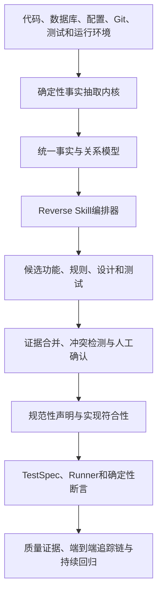

> Language: **English** · [简体中文](enterprise-traceable-quality-platform-design-v0.2.md)

# Enterprise Traceable Quality Platform — Detailed Design

> Version: v0.2.0
> Status: Baseline for the implementation vision, overall design, and core traceability model
> Date: 2026-07-14
> Applies to: Existing systems that lack trustworthy product, design, and test assets but have source code, databases, and runtime environments

## 0. Realize vision and product guardrails

### 0.1 Realizing the vision

For existing systems that lack trustworthy requirements, design, and test assets, build an enterprise traceable-quality platform that recovers candidate business knowledge from real code, databases, configurations, deployments, and runtime environments; forms a business baseline after confirmation by authorized people; and continuously verifies whether the current implementation conforms to business intent through real test evidence.

The platform must ultimately enable users to answer, starting from a product feature or a business rule, along a complete traceability chain:

```text
Business intent and applicable scope
→ Current implementation
→ Data, configuration and external dependencies
→ TestSpec and assertions that verify the rule
→ Test execution against the actual deployment
→ Locatable, verifiable execution evidence
→ Current conformance, verification status and change impact
```

The platform does not attempt to "guess the one true original requirement" for the enterprise. It manages unknowns, inferences, facts, authorized decisions, and verification results separately so that a previously unclear Feature becomes understandable, confirmable, verifiable, and sustainably traceable.

### 0.2 Non-deviable product guardrails

Subsequent product, architectural, and implementation decisions must meet the following guardrails:

1. **Do not degenerate into a document generator**: Content that cannot be returned to the original code, data or running evidence is only used as a draft and does not form a trusted baseline.
2. **Do not degenerate into a code search or graph display tool**: Relationship display must ultimately serve business understanding, manual confirmation, true verification, and change prevention.
3. **Do not degenerate into a test generator**: The number of tests is not a goal; each valid test must state which scoped rule is verified.
4. **Do not treat the current implementation as business truth**: Code facts describe "what is", authorized business statements describe "what should be", and the two must be connected through a compliance relationship.
5. **Do not regard manual confirmation as test passing**: Confirmation, achievement of compliance, execution results, evidence timeliness and conflict status are expressed separately.
6. **Don’t disguise AI inferences as deterministic facts**: AI can only propose candidate claims, connections, and explanations, and sources and uncertainties must be visible.
7. **Do not mask unknowns with a single green score**: Broken links must be shown explicitly when rules, mappings, tests, enforcement, or evidence are missing.
8. **Don’t sacrifice enterprise security for automation**: Data, keys, and execution permissions are always subject to enterprise perimeter, least privilege, and audit controls.
9. **Business rules will not be invalidated due to technical changes**: Code changes will cause implementation mapping and verification conclusions to be reviewed, but will not automatically overturn the still valid business intent.
10. **Not pursuing the generalization of the first version**: MVP gives priority to proving a true vertical closed loop, and then expands the language, framework and execution type.

### 0.3 North Star outcome

The platform's North Star is not "how many documents or tests were generated." It is this:

> For every governed high-value Feature, the platform can present an explainable traceability chain from confirmed business intent to Evidence from the current actual deployment. When any link in the chain changes, conflicts, fails, or is missing, the platform identifies the break, affected scope, responsible owner, and next action.

Any new capabilities that cannot improve the integrity, authenticity, verifiability, security or maintenance efficiency of the traceability chain will in principle not enter the core product scope.

## 1. Document Purpose

This document defines an enterprise traceable-quality platform centered on product Features and connecting product intent, design, code, data, configuration, tests, and runtime Evidence.

The Platform does not rely on any single LLM or reverse Skill as a source of truth. The platform builds its own deterministic code and environment fact layer, using Specone, GSD and other methods as pluggable Reverse Skill. After multi-source cross-validation and manual confirmation, a product function baseline and test protection network that can continue to evolve are formed.

The platform needs to continuously answer eight questions:

1. What does this function do?
2. What business rules, roles, states, and exceptions are there?
3. What design, code, SQL and configuration does it implement?
4. What business data does it read or change?
5. Which tests validate which business rules?
6. Which code, configuration, database and environment version does the current conclusion correspond to?
7. Why can the current version be trusted to be normal?
8. Where does the traceability chain from business intent to real evidence break, and what needs to be reconfirmed or verified after a change?

## 2. Product positioning

### 2.1 One sentence definition

A traceable-quality platform centered on product Features and built from deterministic Facts, AI-generated candidate conclusions, human Decisions, and real test Evidence.

### 2.2 Core values

| role| core value|
| --- | --- |
| business staff| Directly confirm whether the current implementation of the system meets business intent|
| product manager| Check whether the product description is consistent with the actual implementation|
| Developer| Quickly locate the code, SQL, configuration and dependencies involved in the function|
| tester| Clarify the rules, data and execution evidence for each test verification|
| Architect| View modules, data flows, dependencies, transactions and change impact|
| project manager| View feature trust status, unconfirmed rules, and high-risk gaps|
| Operation and maintenance personnel| Confirm the environment, configuration and running status corresponding to the test conclusion|
| auditor| Track who confirmed what conclusion in which version|

### 2.3 Product Principles

1. **Function is the central object**: documentation, code, and tests must all be associated with a stable Feature ID.
2. **Separation of facts and inferences**: Code facts, data facts, operating facts, AI inferences and artificial conclusions are stored and displayed separately.
3. **Conclusions must be traceable**: Any business rules and quality conclusions must be traceable back to the original evidence.
4. **Manual confirmation by statement**: Business personnel confirm the minimum business statement and do not review large AI documents.
5. **Tests must verify rules**: Tests without associated business rules, assertions, and evidence of execution cannot prove functionality.
6. **Status is expired by semantic layer**: Business Decision, implementation compliance, verification results, and evidence aging are versioned separately, and only the layers truly affected by the change are expired.
7. **LLM does not directly determine pass or failure**: the deterministic assertion engine is responsible for test determination, and LLM is responsible for interpretation and suggestions.
8. **Skills are pluggable**: Any Reverse Skill can be replaced, combined, disabled, and audited.
9. **Multiple Skills do not constitute a vote**: Skills supplement Evidence, discover omissions, and expose conflicts; a majority vote cannot manufacture truth.
10. **Production default read-only**: All write operations must be controlled by environment, permissions, approval and security policies.

## 3. Scope and non-targets

### 3.1 Scope of this issue

- Inventory code engineering scanning and incremental analysis
- Database Schema and limited data portrait
- Configuration items, API, SQL, calling relationships and extraction of existing test assets
- Reverse Skill registration, selection, combination, and execution
- Product functions, business rules, state machines and technology implementation mapping
- Statement-level manual validation and version invalidation
- Unify TestSpec generation, review and execution
- API, database assertions and existing automated test access
- Perform evidence archiving and change impact analysis
- Feature-focused traceability pages
- End-to-end traceability chain from business intention to reality Evidence, broken link prompts and historical comparison

### 3.2 Non-target

- Does not claim to be able to automatically recover unique and absolutely correct business requirements from code
- LLM is not allowed to directly gain unlimited shell, database or production environment permissions
- Do not use the number of automatically generated documents and the number of tests as core success indicators
- The first version does not seek to support all languages, frameworks, databases and test types
- The first version does not automatically repair business code or directly block production release.
- The first version does not rely on a specific reverse Skill, model, graph database or container platform

## 4. Core conceptual model

### 4.1 Fact: Facts

Structured records observed or extracted by deterministic tools and reproducibly verifiable, such as:

- There is a `OrderService.submit` method in a certain Commit
- `POST /orders/{id}/submit` maps to this method
- Call `OrderMapper.updateStatus` within the method
- SQL updated `orders.status`
- Test environment configuration`inventory.timeout=3000`
- The inventory service was actually called in a certain Trace

Facts only describe "what is currently observed" and do not directly indicate whether the business is correct.

### 4.2 Claim: Declaration with type and scope

Business, design, or quality conclusions based on facts, either by Reverse Skill or by humans, such as:

> Only orders in draft status are allowed to be submitted.

Claims must document the source of generation, evidence, claim type, scope, conflicts, versions, and validation status. The statement distinguishes at least:

- `NORMATIVE_REQUIREMENT`: "What should be" as expressed by business, regulatory or formal product justification.
- `IMPLEMENTATION_BEHAVIOR`: "What is going on" as observed in terms of code, configuration, and runtime behavior.
- `DESIGN_INTENT`: Design intent for architecture, transactions, exception handling, and dependencies.
- `QUALITY_EXPECTATION`: Performance, reliability, security, and operability expectations.

Manual confirmation `IMPLEMENTATION_BEHAVIOR` may not be used in place of `NORMATIVE_REQUIREMENT`. Code facts can support "this is how the current implementation is" but cannot alone prove "this is how the business should be".

### 4.3 ClaimScope: Declaration of applicable scope

The same business rule may only hold true in a specific context. ClaimScope is used for structured expression:

- Tenants, product versions, regions, channels and business domains
- Roles, resource ownership, account types, and authorization context
- Environment, deployment, Feature Flag and configuration combination
- Data preconditions, status, time window and quota range
- Effective time, expiration time, exceptions and priority

Conflict detection must first determine whether Scope overlaps. Two declarations with opposite text but non-overlapping Scope are not conflicts but business variants.

### 4.4 Evidence: Evidence

Locatable material used to support or refute a claim, including:

- Code location and content Hash
- API definition
- SQL and database constraints
- Configuration snapshot
- Logs, Traces and Metrics
- Test requests, responses, and database before and after status
- Formal business basis for manual input

### 4.5 Decision: Human decision-making

Human versioned conclusion of the statement:

- Confirm correct
- Confirm error
- Exceptions exist
- Insufficient evidence
- Confirmation on hold
- abandoned

Decision only adjudicates the business authority, scope of application, or disposition opinions of the statement. It does not directly indicate that the current implementation complies with the statement, nor does it directly indicate that the test has passed.

### 4.6 ImplementationConformance: Achieving Compliance

ImplementationConformance describes the relationship between an implementation snapshot and a normative statement:

- `UNKNOWN`: Not enough implementation mapping has been established yet
- `CONFORMS`: Current evidence indicates that the implementation conforms to the statement
- `DEVIATES`: Implementation is inconsistent with declaration
- `PARTIAL`: Only part of the path or Scope matches
- `CONFLICTED`: Conflicting evidence of implementation exists
- `STALE`: Recalculation required after implementation or dependency changes

Compliance conclusions must be bound to the statement version, implementation snapshot, Scope, analysis method and evidence.

### 4.7 VerificationResult: Verification results

VerificationResult describes the verification result of a certain statement or compliance conclusion by a certain TestExecution. It is separate from artificial Decision and includes at least `PASS`, `FAIL`, `ERROR`, `INCONCLUSIVE`, `SKIPPED`, and `CANCELLED`.

### 4.8 Feature: Product Features

Product function is the smallest business traceability unit of the platform, with a stable ID and associated rules, roles, status, design, code, data, configuration, testing, evidence and manual decision-making.

Feature needs to support cross-version renaming, merging, splitting, and aliasing, and preserve `PREDECESSOR_OF`, `SUCCESSOR_OF`, `MERGED_INTO`, and `SPLIT_INTO` lineage, and cannot rely solely on name or code location to remain stable.

### 4.9 TestSpec: Executable Test Specification

TestSpec is an intermediate agreement between natural language testing intent and specific testing frameworks. Reverse Skill can only generate candidate TestSpec, which must undergo Schema verification, security policy inspection and necessary manual approval before execution.

### 4.10 TraceChain: end-to-end tracing chain

TraceChain is an ordered projected view of underlying facts, claims, relationships, executions, and evidence to answer the complete path from business intent to proof of truth. TraceChain does not copy or create new facts; it saves query scopes, path selections, link status, and breakpoints, and references the underlying objects.

## 5. Overall architecture



### 5.1 Layered architecture

| level| responsibility| trust boundary|
| --- | --- | --- |
| access layer| Access code repository, database, configuration, test environment and telemetry| All input is considered untrustworthy|
| fact layer|AST, API, SQL, tables, configuration, Git, testing and Trace extraction| Must be reproducible|
| Skill layer| Specone, GSD, domain modeling, rule extraction, test design| Can only generate candidate conclusions|
| knowledge layer| Functions, rules, state machines, designs and relationships| Save sources, versions and conflicts|
| Authentication layer| Database verification, real execution, coverage and assertions| adjudicated by a deterministic procedure|
| Governance| Manual confirmation, permissions, versions, audits and quality gates| High-risk operations must be approved|
| Presentation layer| End-to-end traceability chain, function traceability page, risk dashboard, coverage matrix and evidence report| Don’t hide uncertainty and broken links|

### 5.2 Control Center and EnterpriseRunner

The platform adopts the "central control plane + execution node within the enterprise" model:

- The control center is responsible for projects, Skill, tasks, knowledge, approvals, reporting and auditing.
- Runner is deployed within a network perimeter that provides access to the code base, database, and test environment.
- Database credentials and environment keys are retained on the Runner side and are not sent to LLM.
- Runner Receives policy-constrained tasks from the control center and returns desensitization evidence.
- Runner supports deployment forms such as processes, virtual machines, or containers, and is not bound to a single operating mode.

## 6. Unified code fact model

### 6.1 Design goals

- Create a basic system map without relying on LLM
- Support different language scanners to output a unified structure
- Supports commit-level snapshots and incremental updates
- All facts can be traced back to source file, line number, SQL, configuration or run log
- Provide stable, low-ambiguity input to all Reverse Skill

### 6.2 Core fact entities

| Entity| Key content|
| --- | --- |
| Project | Project, repository, team and security boundaries|
| SourceSnapshot | Repository, Commit, Tree Hash, Branch Context and Submodule Version|
| BuildArtifact | CI Build, binary or image digest, dependency locks and SBOM|
| DeploymentSnapshot | Environment, deployment ID, actual running artifact, instance, and release time|
| RuntimeContext | Schema migration, configuration, Feature Flag, external dependencies and collection time window|
| SnapshotManifest | Combine the above component versions into an immutable manifest used by a single analysis or verification|
| Artifact | Source files, configuration files, documentation, logs and test reports|
| Module | Modules, packages, services and building units|
| CodeSymbol | Classes, methods, functions, fields, enumerations and annotations|
| Endpoint | REST, RPC, GraphQL, messaging and timing portals|
| DataObject | Tables, fields, views, indexes, constraints, stored procedures and triggers|
| Configuration | Configuration keys, default values, environment overrides and sensitivity levels|
| ExternalDependency | Downstream services, third parties API, messaging middleware and file systems|
| TestAsset | Existing unit, integration, API and UI tests|
| RuntimeOperation | Trace spans, log events, SQL execution and metrics|

### 6.3 Core relationship types

```text
Module CONTAINS CodeSymbol
Endpoint IMPLEMENTED_BY CodeSymbol
CodeSymbol CALLS CodeSymbol
CodeSymbol READS DataObject
CodeSymbol WRITES DataObject
CodeSymbol CONTROLLED_BY Configuration
CodeSymbol DEPENDS_ON ExternalDependency
TestAsset EXERCISES CodeSymbol
TestAsset CALLS Endpoint
RuntimeOperation OBSERVED_AT CodeSymbol
RuntimeOperation ACCESSES DataObject
```

### 6.4 Fact record structure

```json
{
  "fact_id": "FACT-01H...",
  "project_id": "PROJECT-001",
  "snapshot_manifest_id": "SNAPSHOT-MANIFEST-abc123",
  "fact_type": "endpoint_implemented_by",
  "subject": "POST /api/orders/{id}/submit",
  "predicate": "IMPLEMENTED_BY",
  "object": "OrderController.submit",
  "source": {
    "artifact": "src/main/java/.../OrderController.java",
    "start_line": 42,
    "end_line": 48,
    "content_hash": "sha256:..."
  },
  "extractor": {
    "id": "java-spring-scanner",
    "version": "0.1.0"
  },
  "observed_at": "2026-07-10T00:00:00Z",
  "valid_from": "2026-07-10T00:00:00Z",
  "valid_to": null
}
```

### 6.5 Stable identification and version strategy

- Project IDs are stable for the life of the project.
- SourceSnapshot, BuildArtifact, DeploymentSnapshot and RuntimeContext are versioned separately to avoid squeezing sources of independent changes into a blurry Snapshot.
- SnapshotManifest is generated using the Hash combination of the content of each component, and records the collection start/end time, source, completeness, failure items and signatures.
- The test execution must verify that the target Deployment actually runs the artifact Digest, rather than just recording the expected Commit.
- CodeSymbol uses "repository + language + fully qualified name + signature" as the natural key.
- Artifact saves the content Hash, and the file line number is only used as an auxiliary positioning.
- Feature ID does not change automatically when the code is renamed.
- Facts cannot be overwritten in place; new events are appended through `SUPERSEDES`, `RETRACTS` and the valid time, and `status`, which does not modify the old facts, creates pseudo-immutability.
- Fact records both `observed_at` and business validity time `valid_from/valid_to`; not scanning a certain relationship does not mean that the relationship does not exist.

### 6.6 First version scanning capability

The first version prioritizes supporting one main language and one mainstream web framework, at least extracting:

- Project modules, dependencies and build commands
- Controllers, routing and DTOs
- Service and method calls
- Repository, Mapper, SQL, tables and fields
- State enumeration and critical condition branches
- Permission annotations and exceptions
- Configuration keys and environment overrides
- Existing tests and their target code

Tree-sitter can be used as a cross-language syntax tree base; language-specific parsers are then used for key languages to improve the accuracy of type, symbol and call parsing.

## 7. Reverse Skill Framework

### 7.1 Skill positioning

Reverse Skill is a set of versionable reverse engineering methods, hints, tool constraints, and output protocols for generating candidate knowledge based on a unified fact model.

Specone, GSD and future domain reverse engineering, security analysis, state machine recovery and test design capabilities are all accessed through the same protocol. The platform does not assume that one Skill is necessarily better than another Skill.

### 7.2 Skill Capability Classification

| Ability| output|
| --- | --- |
| architecture_reverse | Modules, layers, dependencies and architecture candidates|
| feature_discovery | Product feature candidates|
| domain_modeling | Business entities, aggregations, and relationships|
| business_rule_mining | Business rules, preconditions and exceptions|
| state_machine_recovery | States, transitions, trigger conditions, and forbidden paths|
| permission_analysis | Role, resource and operation permission matrix|
| data_semantics | Business semantics of table, field and data changes|
| configuration_analysis | Configuration impact on business behavior|
| test_inventory_review | Candidate conclusions for the effectiveness of existing tests|
| test_design | Test scenarios and TestSpec candidates|
| runtime_correlation | Static code is associated with the real running path|
| change_impact | Changes impact functionality, rules, and testing|
| reverse_review | Check other Skill for omissions, contradictions and illusions|

### 7.3 Skill Manifest

```yaml
apiVersion: quality.example/v1alpha1
kind: ReverseSkill
metadata:
  id: specone-reverse
  name: Specone Reverse
  version: 1.0.0

capabilities:
  - architecture_reverse
  - feature_discovery
  - test_design

compatibility:
  languages: [java, javascript]
  frameworks: [spring-boot, react]
  fact_schema: ">=0.1 <0.2"

inputs:
  required:
    - project_snapshot
    - code_fact_bundle
  optional:
    - database_fact_bundle
    - existing_test_bundle
    - runtime_fact_bundle

outputs:
  schema: reverse-artifact-bundle/v1alpha1
  types:
    - candidate_feature
    - candidate_claim
    - candidate_test_spec
    - evidence_link
    - open_question

permissions:
  filesystem: read_only
  database: none
  network: none
  shell: none
  secrets: none

model:
  required: true
  allowed_profiles: [reasoning-large]
  context_strategy: indexed_retrieval

execution:
  timeout_minutes: 30
  cost_class: medium
  supports_incremental: true
```

### 7.4 Standard input packages

Skill does not roam the enterprise system directly, but receives controlled input packets generated by the platform:

- Snapshot Manifest: combined version of source code, build artifacts, deployment, Schema, configuration and external dependencies
- Code Fact Bundle: code symbols, API, calls, SQL and relationships
- Database Fact Bundle: Schema, constraints and desensitized data portraits
- Test Fact Bundle: Existing tests, assertions, and coverage
- Runtime Fact Bundle: desensitized logs, traces and indicators
- Task Scope: Modules, functions, files and time ranges allowed for analysis
- Policy Context: Data security, network, model and output restrictions

### 7.5 Standard output package

```yaml
apiVersion: quality.example/v1alpha1
kind: ReverseArtifactBundle

producer:
  skill_id: business-rule-mining
  skill_version: 0.1.0
  model_profile: reasoning-large
  prompt_version: rule-mining-v3

scope:
  project_id: PROJECT-001
  snapshot_manifest_id: SNAPSHOT-MANIFEST-abc123

claims:
  - local_id: claim-001
    type: business_rule
    statement: 只有DRAFT状态的订单允许提交
    confidence: medium
    evidence:
      - fact_id: FACT-001
        relation: supports
      - fact_id: FACT-002
        relation: supports
    open_questions:
      - 是否存在管理员强制提交的例外？

conflicts: []
warnings: []
```

Skill must not just return unsourced Markdown. Markdown can only be used as the rendering result of structured output.

### 7.6 Skill selection method

Platform support:

- Automatic recommendation: Recommend Skill combination based on technology stack, project scale, existing evidence and goals.
- Manual selection: The user selects one or more Skill in reverse stages.
- Default solutions: fast reverse, standard reverse, deep reverse, security specialization, test completion, change analysis.
- Policy selection: Enterprise administrators limit the scope of Skill, models, and data that are allowed to be used.

## 8. Multiple Skill arrangement and conflict handling

### 8.1 Orchestration process

```text
Create a reverse task
→ Fixed SnapshotManifest and analysis range
→ Perform a deterministic fact scan
→ Select Skill based on capabilities and strategies
→ Build minimum input package for each Skill
→ Isolate execution and verify outputSchema
→ Standardized claims, evidence and terminology
→ Merge duplicates and establish conflicting relationships
→ Generate functions and rules to be confirmed
→ Form a baseline after manual confirmation
```

### 8.2 Task status

```text
CREATED
→ FACT_SCANNING
→ SKILL_PLANNING
→ SKILL_RUNNING
→ NORMALIZING
→ CONFLICT_ANALYSIS
→ WAITING_REVIEW
→ BASELINED
→ COMPLETED
```

Each step should support timeouts, retries, cancellations, recovery, and auditing.

### 8.3 Deduplication rules

1. First perform deterministic matching with stable entity ID, code symbol and rule type.
2. Semantic similarity is then used to find "possible duplicates", but automatic merging is not possible.
3. All Skill sources, original text, and evidence are preserved when merging.
4. Statements with different terminology but different constraints must remain independent.
5. Manual merge or split claims must be logged Decision.

### 8.4 Conflict rules

The following situations form an explicit Conflict:

- Two declarations give opposite constraints on the same subject
- Business declarations are inconsistent with code facts
- Code facts are inconsistent with database facts
- Static analysis is inconsistent with runtime behavior
- Confirmed normative rules are inconsistent with implementation in new SnapshotManifest
- Test expectations are inconsistent with confirmed business rules

Example:

```text
Statement A: Approved orders cannot be withdrawn.
Statement B: Administrators can force the withdrawal of approved orders.

System processing:
No voting, no coverage, conflict establishment, and prompt that there may be "normal user restrictions + administrator exceptions".
```

### 8.5 Multidimensional Trusted State

The platform prohibits the use of a single L0 to L4 level to simultaneously express business authority, implementation compliance, and test status. Each function or traceability chain is shown separately at least:

| Dimensions| status example|Answered questions|
| --- | --- | --- |
| Claim source| AI candidate, code inference, formal basis, manual proposal| Where does this sentence come from? |
| business authority| Unreviewed, confirmed, exceptions exist, rejected, abandoned| Does the business agree that “it should be this way”? |
| Evidence support| No evidence, single source, multiple sources, counter-evidence, incomplete evidence| What material is there for or against? |
| achieve compliance| Unknown, consistent, partially consistent, deviation, conflict, expired| Does the current implementation comply with the rules? |
| Verification status| Not executed, passed, failed, error, uncertain, skipped| What does real-world testing prove? |
| Evidence limitation| Fresh, near expiration, expired, incomplete collection| Do the conclusions still correspond to current deployments? |

Quality gates are judged by versioned policies based on a combination of these dimensions. For example, high-risk strong access control can require "business confirmed + no unresolved counter-evidence + implementation compliance + current deployment verification passed + evidence fresh" instead of judging a comprehensive level.

When there are unknowns, conflicts, or data source collection failures in any dimension, the interface must display the reasons and cannot be overwritten by the high status of other dimensions.

## 9. Traceability model centered on product functions

### 9.1 Feature structure

```text
Feature
├── HAS_CLAIM → BusinessRule
├── APPLIES_IN → ClaimScope
├── ASSESSED_BY → ImplementationConformance
├── HAS_ROLE → Actor/Role
├── HAS_STATE → BusinessState
├── HAS_TRANSITION → StateTransition
├── DESIGNED_BY → DesignElement
├── EXPOSED_BY → Endpoint
├── IMPLEMENTED_BY → CodeSymbol
├── READS/WRITES → DataObject
├── CONTROLLED_BY → Configuration
├── DEPENDS_ON → ExternalDependency
├── VERIFIED_BY → TestSpec
├── HAS_RESULT → VerificationResult
├── PROVED_BY → Evidence
├── CONFIRMED_BY → Decision
└── HAS_GAP → TraceGap
```

### 9.2 Function page information architecture

#### Page header

- Feature ID, name and business domain
- Current deployment with SnapshotManifest
- Business confirmation status
- Implement traceability status
- test status
- Run verification status
- Evidence freshness
- Conflict and High Risk Alerts

Displaying just one composite green score is not recommended. Demonstrate at least six dimensions: business, implementation, testing, operation, timeliness and conflict.

#### Page tags

| label| content|
| --- | --- |
| Products| Functional goals, roles, preconditions, processes, and exceptions|
| rules| Minimum business statements, evidence, conflicts and confirmation records|
| design| Modules, timing, state machines, transactions and exception handling|
| code| API, classes, methods, branches, commits and code snippets|
| data| Tables, fields, SQL, pre- and post-execution status and constraints|
| Configuration| Configuration values, environmental differences, and behavioral impacts|
| test| TestSpec, rule coverage, data and assertions|
| evidence| Request response, SQL, log, Trace, screenshot and coverage|
| change| Code, Schema, configuration and traceability chain segment failure history|
| decision making| Who confirmed or refuted what statement in what version|

### 9.3 Declaration-level presentation

```text
[AI candidate][Business to be confirmed][Implementation evidence: single source][Verification: not implemented]
Only orders with DRAFT status are allowed to be submitted.

Supporting evidence:
✓ OrderService.submit status judgment

Facts that are relevant but do not constitute proof of the rule:
· orders.status data portrait exists DRAFT and SUBMITTED

Counter-evidence/conflict:
? AdminOrderService.forceSubmit may provide admin exceptions

Operation:
[Confirmed correct] [Exception exists] [Confirmed incorrect] [Insufficient evidence]
```

### 9.4 End-to-end traceability chain

The traceability chain is the core product view that the platform must deliver, not a simplified screenshot of the graph. It organizes the underlying relationships into ordered paths based on business issues, and displays them by default:

```text
[Feature: Submit order]
  → [Normative statement: Ordinary users can only submit DRAFT orders]
  → [Scope: Ordinary users / Standard orders / Switch on]
  → [Achieve compliance: CONFORMS]
  → [Endpoint：POST /orders/{id}/submit]
  → [Code：OrderService.submit]
  → [Data：orders.status DRAFT→SUBMITTED]
  → [Config：order.submit.enabled=true]
  → [TestSpec：TEST-ORDER-SUBMIT-001]
  → [Assertion: Response, Database, Trace]
  → [Execution: Deployment DEPLOY-20260710-01, PASS]
  → [Evidence: Request, SQL, Log and Trace Hash]
```

The product UI groups those underlying nodes into five business-readable blocks by default: `Feature description → design/implementation → configuration → test cases → test results`. Selecting a block must reveal its data, provenance, version, and state. Feature description expands Claim/Scope/Decision and business logic; design/implementation expands design elements, endpoints, and code Facts; configuration expands configuration and data constraints; test cases expand TestSpecs, steps, and assertions; test results expand Execution, Evidence, and freshness. This grouping is a presentation projection only and must not delete, merge, or hide the auditable underlying relationships.

The five detail views follow these constraints:

Feature narrative and test strategy each use one continuous document container. Headings, spacing, and dividers create the hierarchy; individual fields must not be wrapped in separate cards because that fragments reading on a wide display.

- **Feature description** is a complete versioned feature document, not a field summary. It covers at least purpose, business logic, permissions, prerequisites, dependencies, applicable scope, and exception boundaries. Human business-confirmation result, time, owner, and rationale are shown separately and may be edited as a draft; formal effect requires an authenticated server operation that appends an immutable Decision, so a browser edit cannot overwrite authority.
- **Design/implementation** binds a versioned Markdown design file in the repository and renders that file in a document reader by default, while also exposing the raw Markdown. Code views switch between business-logic blocks bound to Facts and the complete original source file. Every block binds its file, starting line, language, and Fact ID so an unlocatable summary cannot masquerade as implementation evidence.
- **Configuration** uses a DEV/SIT/UAT/PROD matrix containing each item, description, source, and environment-specific value. Sensitive items expose only secret references. Every value is bound to its environment Snapshot, and one environment must never be inferred from another.
- **Test cases** show the test-design strategy before versioned TestSpec entries. Selecting an entry reveals its objective, prerequisites, test data, executable steps, expectations, assertions, Fixture, Cleanup, operation level, and required capabilities.
- **Test results** group Executions by business scenario. Every result binds a TestSpec version, environment, deployment, and Evidence; failed or errored entries drill down to the failed step, expected and actual values, error code, and message. Historical failures remain visible and are explicitly labelled `HISTORICAL` so they cannot be confused with the current deployment result.

A stable versioned contract is reserved for future execution Agents. A request contains at least the TestSpec ID/version, Snapshot, deployment, environment, target policy, Fixture/Cleanup protocols, and required capabilities. A response contains at least the Execution ID, attempt, step results, assertion results, Evidence references, timestamps, Runner identity, and attestation. An Agent may consume only an approved immutable TestSpec version and return structured facts; it cannot edit test design, business confirmation, or declare the Feature trusted. The server remains responsible for identity, version and deployment binding, signatures, and final trust derivation. This phase defines and displays the contract but does not integrate external Agent scheduling.

Traceability chains support at least three directions:

1. **Forward proof chain**: from Feature or business rules to the current implementation, testing and evidence.
2. **Reverse Fault Chain**: Reverse TestSpec, rules, functions, code and responsible persons from failed assertions or running exceptions.
3. **Change Impact Chain**: From Commit, Schema, configuration or deployment changes to affected implementations, rules, validations and required regressions.

#### Tracking chain integrity

The traceability chain does not use simple percentages to replace the true state, but checks the necessary links:

```text
Business intent confirmed?
→ Is Scope clear?
→ Is there an implementation mapping for the current deployment?
→ Is implementation compliance calculated and conflict-free?
→ Is there a valid TestSpec for the validation rule with the business assertion?
→ Is it executed in the target deployment?
→ Is Evidence complete, fresh, and not tampered with?
```

`TraceGap` is formed when any required link is missing, documenting the type of gap, risks, causes, responsible roles and recommended actions. For example: `MISSING_AUTHORITY`, `SCOPE_UNKNOWN`, `IMPLEMENTATION_UNMAPPED`, `NO_ASSERTION`, `NOT_EXECUTED_ON_CURRENT_DEPLOYMENT`, `EVIDENCE_STALE`.

#### Link data model

TraceChain is a queried or saved path projection that contains at least:

```json
{
  "chain_id": "CHAIN-ORDER-SUBMIT-001",
  "root": "FEATURE-ORDER-001",
  "scope": "SCOPE-NORMAL-USER-001",
  "snapshot_manifest": "SNAPSHOT-MANIFEST-abc123",
  "deployment": "DEPLOY-20260710-01",
  "segments": [
    {
      "from": "CLAIM-ORDER-STATUS-001",
      "relation": "CONFORMED_BY",
      "to": "CODE-ORDER-SERVICE-SUBMIT",
      "provenance": "deterministic+reviewed",
      "status": "active"
    }
  ],
  "gaps": [],
  "conflicts": [],
  "computed_at": "2026-07-10T00:00:00Z"
}
```

The link itself does not copy the contents of Fact, Claim and Evidence; each segment references the underlying object and its version, and the link status is calculated by replayable rules.

#### Link page display

The page uses horizontal or vertical staged links by default instead of expanding all graph nodes at once:

```text
Business intent ─ Achieve compliance ─ Technical implementation ─ Test specifications ─ Actual implementation ─ Evidence
  Confirmed Matches 4 mappings 3 assertions PASS Fresh
```

- Each stage shows independent status, version, source, time and responsible role.
- Click a stage to expand the details of this layer; switch to the traceback map when you need to explore branches.
- Use clear gap cards for broken link locations, and provide actions such as "supplementary evidence, establishing mapping, generating tests, re-executing, and handling conflicts".
- Supports locking a rule to a Evidence path and exporting audit reports.
- Supports side-by-side comparison of current deployment and historical deployment, displaying new, deleted, changed and expired segments.
- Supports switching expressions by role: the business view hides low-level code noise, and the development and test views retain complete technical nodes.
- The linear link view and the graph view must come from the same underlying data and cannot form two sets of calibers.

### 9.5 Interactive traceability map

The map is not an accessory technical topology map, but one of the core interactions of the platform. The platform adopts dual main views of "function details + traceability map":

- Functional details are suitable for reading, confirming and viewing complete fields.
- Traceability maps are suitable for exploring relationships, understanding paths, identifying gaps, and analyzing the impact of changes.
- Both views share the same set of Feature, Claim, Fact, TestSpec, Evidence, and Decision data.
- Users can click on any related item on the details page to navigate to the map; click on a node on the map to open the details drawer or enter the complete details page.

#### Overall page layout

```text
┌──────────────────────────────────────────────────────────────────────────┐
│ Project / Deployment and Manifest / Environment / Search / View Mode / Version Comparison / Export │
├──────────────┬───────────────────────────────────────┬───────────────────┤
│ Node and relationship filtering │ │ Node details and operations │
│ │ Interactive traceable map canvas │ │
│ Features │ │ Summary │
│ Rules │ [Feature: Submit Order] │ Source and Version │
│ Design │ / | \ │ Evidence for/against │
│ API/code │ [Rule] [Code] [Test] │ Manual confirmation │
│ Data/Configuration │ │ Association Test │
│ Test/Evidence │ │ Expand and Jump │
├──────────────┴───────────────────────────────────────┴───────────────────┤
│ Path Breadcrumbs / Legend / Number of Nodes / Conflict Tips / Current Selection Set │
└──────────────────────────────────────────────────────────────────────────┘
```

### 9.6 Graph node types

| Node type| Description| Default display granularity|
| --- | --- | --- |
| Feature | Product features| always as central node|
| BusinessRule | Business rules and exceptions| Default display|
| ClaimScope | Declare applicable tenants, roles, conditions, times and business variants| Attached to rules by default and expanded as needed|
| ImplementationConformance | Conformity conclusions between normative statements and current implementations| Tracking chain default display status|
| Actor/Role | User roles and permission subjects| Default aggregation, expand on demand|
| BusinessState | Status and life cycle|State machine mode display|
| DesignElement | Module, timing, transaction and exception design| Default display summary|
| Endpoint | REST, RPC, message and task entry| Default display|
| CodeSymbol | Classes, methods, functions and key branches| Aggregated to classes or services by default, drill down method on demand|
| DataObject | Tables, fields, views and stored procedures| Display table by default, drill down fields as needed|
| Configuration | Configuration keys, function switches and environment values| Only display configurations that affect current functionality|
| ExternalDependency | Downstream services, messages and third-party dependencies| Display service level nodes by default|
| TestSpec | Executable test specifications| Test scenarios are displayed by default|
| TestExecution | A test execution| The default aggregation is the most recently valid execution|
| VerificationResult | Verification results of specific rules during a certain execution| Attached by default between execution and rule|
| Evidence | HTTP, SQL, logs, Trace and screenshots| Default aggregation, expand on demand|
| Decision | Manual confirmation and exception decision-making| Only current effective decisions are displayed, and history is expanded as needed.|
| ChangeSet | Commit, Schema or configuration change| Shown in change impact mode|
| Conflict | Conflicting statements or evidence| Always be visible|
| TraceGap | The traceability chain is missing necessary links or the current information is incomplete.| Always clearly identify and give recommended actions|

Node identification cannot rely solely on color, but must also use icons, shapes, type labels, and accessibility text. Failed nodes use a dotted border, conflicting nodes use a warning mark, and unconfirmed nodes display a pending confirmation icon.

### 9.7 Graph relationship types

| relationship| meaning|
| --- | --- |
| HAS_RULE | Features contain business rules|
| APPLIES_IN | Statement applies to specific Scope|
| HAS_ROLE | Function involves role|
| HAS_STATE / TRANSITIONS_TO | Functions include status and transitions|
| DESIGNED_BY | Functionality is described by design elements|
| EXPOSED_BY | Functionality is exposed through API, message or task entry|
| IMPLEMENTED_BY | Functions or rules are implemented by code|
| CONFORMS_TO / DEVIATES_FROM | The current implementation conforms to or deviates from normative statements|
| CALLS | Calls between code, services, or interfaces|
| READS / WRITES | Function or code reads and modifies data objects|
| CONTROLLED_BY | Functional behavior is controlled by configuration|
| DEPENDS_ON | Functionality depends on other services or infrastructure|
| VERIFIED_BY | Function or rule is verified by TestSpec|
| EXECUTED_AS | TestSpec corresponds to a certain execution|
| VERIFICATION_RESULT | Perform independent verification of claims|
| PROVED_BY / CONTRADICTED_BY | Statement is supported or refuted by evidence|
| CONFIRMED_BY | Statement confirmed by human Decision|
| AFFECTS | ChangeSet affects features, rules, or tests|
| CONFLICTS_WITH | Conflicting claims, implementations, tests, or evidence|

Each edge must save the direction, relationship type, source, SnapshotManifest, how it was generated, and valid status. AI inference relationships and deterministic fact relationships are displayed using different line types.

### 9.8 Core Map Mode

The platform provides at least five preset views to avoid all relationships being mixed in the same picture:

#### Product traceability chart

```text
Feature
→ BusinessRule
→ DesignElement
→ Endpoint / CodeSymbol / DataObject / Configuration
→ TestSpec
→ TestExecution
→ Evidence
```

Used to answer: "What is this feature, how is it implemented, how is it tested, and why is it trustworthy?"

#### business process diagram

```text
Actor
→ Feature
→ BusinessState
→ StateTransition
→ Next Feature
```

Used by business personnel to confirm roles, steps, status and exception paths.

#### Implement dependency graph

```text
Feature
→ Endpoint
→ CodeSymbol
→ DataObject / Configuration / ExternalDependency
```

Used by developers and architects to view implementation, data and dependencies.

#### test coverage map

```text
Feature
→ BusinessRule
→ TestSpec
→ Assertion
→ TestExecution
→ Evidence
```

Rules that are not connected to TestSpec, tests without assertions, and tests that lack evidence of valid execution should directly create visualization gaps.

#### Change Impact Diagram

```text
ChangeSet
→ CodeSymbol / DataObject / Configuration
→ Feature / BusinessRule
→ Decision / TestSpec
→ Required Regression
```

Used to answer: "Which functionality is affected by this change, which validations have expired, and what tests must be re-performed?"

### 9.9 Interaction rules

- Click on a node: Select it and display summary, source, version, evidence, and actions in the right drawer.
- Double-click the node: set the node as the new center and load its key relationship.
- Expand button: Selectively load the next layer according to the relationship type. The default is not to fully expand.
- Collapse button: Aggregate methods into classes, fields into tables, and executions into TestSpec.
- Hover relationship: Displays the relationship type, source, SnapshotManifest and whether it is AI inferred.
- Path locking: fix an end-to-end link and hide irrelevant nodes.
- Shortest path: Query the traceback path between two nodes.
- Reverse tracing: Back-checking tests, rules, functions and code from failure evidence.
- Multi-select comparison: Compare multiple features or multiple tests for common dependencies and differences.
- Node Jump: Enter full details of code, SQL, configuration, TestSpec, or evidence.
- Confirmation operation: Business personnel can directly confirm, reject or add exceptions in the rule node or details drawer.
- Snapshot switching: View graphs under different Commit, Schema and environments.
- Version comparison: New nodes have a green border, deleted nodes have a red strikethrough, and changed nodes have an orange border.

### 9.10 Graph query and filtering

Filter conditions include at least:

- Node types and relationship types
- Product domains, modules and services
- SourceSnapshot, Deployment, Manifest, Branch and Environment
- Business authority, evidence support, implementation compliance, verification status and evidence timeliness
- Confirmed, Pending Confirmation, Conflict, Invalid and Test Failure status
- risk level
- Last change time and last verification time
- Reverse Skill, model and Scanner sources
- Whether tests, valid assertions, and proof of operation exist

Support business-oriented path query:

```text
Displays all rules and tests associated with the "Submit Order" feature.
Shows confirmed rules without test coverage.
Displays the functions affected by this Commit and confirmed to be invalid.
Displays all high-risk functions controlled by configuration switches.
Check the corresponding code and business rules from the failed database assertion.
```

Natural language queries must first be converted into read-only graph query plans and the actual filter conditions and ranges displayed to the user. LLM cannot be allowed to directly perform arbitrary database write operations.

### 9.11 Prevent the graph from getting out of control

The full code map can easily form "balls of yarn", so progressive disclosure is adopted:

1. By default, it is centered on Feature and only loads one layer of business rules and key implementations.
2. It is recommended that the initial canvas be controlled within 30 visible nodes.
3. Methods are aggregated by class, package or service by default, and fields are aggregated by table by default.
4. Low-value DTOs, tool classes, and internal nodes of the framework are hidden by default.
5. The number of nodes to be added is displayed before the user expands it.
6. Switch to list, matrix, or grouped view when the threshold is exceeded instead of continuing to stack nodes.
7. Supports saving personal views and enterprise standard views, but does not change the underlying relationship facts.
8. Large graph queries must have depth, node count, time, and resource constraints.

### 9.12 Map and traceability chain data interface

```text
GET /features/{id}/graph?view=traceability&depth=1
GET /features/{id}/trace-chains?direction=forward&deployment={deploymentId}
GET /trace-chains/{id}
POST /trace-chains/query
GET /trace-chains/{id}/gaps
GET /trace-chains/{id}/changes?from={deploymentA}&to={deploymentB}
GET /graph/nodes/{id}/neighbors?relations=VERIFIED_BY,PROVED_BY
POST /graph/paths/query
POST /graph/impact/query
GET /graph/changes?from={snapshotA}&to={snapshotB}
GET /graph/gaps?type=unverified-rule
```

Standard return structure:

```json
{
  "center": "FEATURE-ORDER-001",
  "snapshot_manifest": "SNAPSHOT-MANIFEST-abc123",
  "nodes": [
    {
      "id": "FEATURE-ORDER-001",
      "type": "Feature",
      "label": "提交订单",
      "status": "confirmed",
      "risk": "high"
    }
  ],
  "edges": [
    {
      "id": "EDGE-001",
      "source": "FEATURE-ORDER-001",
      "target": "CLAIM-ORDER-001",
      "type": "HAS_RULE",
      "provenance": "reverse-skill",
      "status": "active"
    }
  ],
  "truncated": false,
  "available_expansions": []
}
```

### 9.13 Front-end technical suggestions

MVP recommends using React to implement the phased traceability chain view and working with Cytoscape.js to build the traceability map. Cytoscape.js provides interactive graphs, selector filtering, automatic layout, graph algorithms, zooming and panning, etc., and is suitable for relationship exploration and path analysis. If the page prefers editable workflow or manual drag-and-drop arrangement, you can evaluate React Flow; however, the core traceability graph will give priority to graph analysis-oriented components.

The backend MVP continues to use the node table and relationship table of PostgreSQL, and outputs the subgraph required by the front end through the restricted graph query service. The need for a graph on the page does not mean that Neo4j must be introduced in the first version; when multi-hop query, relationship scale and real-time path analysis reach clear bottlenecks, the graph database will be evaluated again.

## 10. Manual confirmation, compliance and version invalidation

### 10.1 Role and scope of confirmation

| role| Main confirmation content|
| --- | --- |
| Business/Products| Functional goals, business rules, roles, states, and exceptions|
| Development/Architecture| Code mapping, transactions, dependencies, data and configuration|
| Testing/Quality| Test scenarios, assertions, data, and coverage adequacy|
| Operation and maintenance| Environment, configuration, deployment and operational evidence|

### 10.2 Declaring a state machine

```text
CANDIDATE
→ EVIDENCE_PENDING
→ REVIEW_PENDING
→ CONFIRMED | REJECTED | EXCEPTION_RECORDED | INSUFFICIENT_EVIDENCE
→ SUPERSEDED | DEPRECATED
```

Once confirmed, a normative statement will not automatically become `STALE` simply due to a code change. When the authoritative business basis, Scope, or regulatory statute of limitations changes, create a new version and mark the old version as `SUPERSEDED` or `DEPRECATED`.

### 10.3 Decision structure

```json
{
  "decision_id": "DECISION-001",
  "claim_id": "CLAIM-001",
  "decision": "EXCEPTION_RECORDED",
  "content": "管理员可以在审批后24小时内强制撤回",
  "actor": "user-123",
  "role": "business-owner",
  "claim_version": 3,
  "scope_ref": "SCOPE-ORDER-NORMAL-USER",
  "evidence_refs": ["EVIDENCE-01"],
  "created_at": "2026-07-10T00:00:00Z"
}
```

### 10.4 Hierarchical failure rules

| change| remain valid| Requires invalidation or recalculation|
| --- | --- | --- |
| CodeSymbol, API, SQL or Schema changes| Normative Business Statement and Decision| Implementation mapping, ImplementationConformance, scope of influence|
| Configuration, Feature Flag or dependency version changes| Business statements that are not affected by this context| Corresponds to the compliance and verification results under Scope|
| TestSpec Step or assertion change| Business Statement and Implementation Facts| TestSpecApprovals, coverage relationships, and follow-upVerificationResult|
| Deploy artifacts or environment changes| Business Statement, HistoryEvidence| Validation status and evidence freshness of the current deployment|
| New operating evidence contradicts rules| Recorded HistoryDecision| Conformity is converted to `CONFLICTED` and a pending Conflict is created|
| Changes in formal business basis, regulations or Scope| Historical versions and audit records| Normative statements create new versions and re-decisions|

Failures must document the cause, triggering ChangeSet, affected Scope, and recommended actions. Only the truly affected link segments enter `STALE`, and the entire Feature is prohibited from being expired indiscriminately.

### 10.5 Confirm the separation of authority and responsibility

- Decision must be verified by the authorization policy of the project, business domain, claim type and risk level.
- High-risk business rules support double confirmation or joint confirmation of business and compliance.
- Separation of duties can be configured for making claims, implementing code, and approving strong-gating exceptions.
- Decision supports validity period, delegation, revocation, dispute and reopening, and retains complete audit records.
- Emergency bypasses must use a time-bound break-glass process that records the reason, approver, and re-examination deadline.

## 11. TestSpec design

### 11.1 Design goals

- Convert natural language test intent into a unified protocol that is verifiable and auditable
- Decoupled from specific testing frameworks
- Native associations Feature, Claim, and Evidence
- Supports API, database, message, UI and run-proof assertions
- Default environment permissions, security levels and cleanup strategies

### 11.2 TestSpec example

```yaml
apiVersion: quality.example/v1alpha1
kind: TestSpec

metadata:
  id: TEST-ORDER-SUBMIT-001
  name: 草稿订单正常提交
  version: 1
  risk: high

traceability:
  feature_id: FEATURE-ORDER-001
  verifies_claims:
    - CLAIM-ORDER-STATUS-001
  source_snapshot: SNAPSHOT-abc123

environment:
  target: sit
  write_policy: controlled_write

preconditions:
  - type: sql_query
    query_ref: order_by_id
    expect:
      status: DRAFT

data:
  setup:
    strategy: seed_api
    seed_ref: draft_order
  variables:
    order_id: "${seed.order.id}"
    token: "${account.normal_user.token}"

steps:
  - id: submit
    action: http
    method: POST
    path: "/api/orders/${order_id}/submit"
    headers:
      Authorization: "Bearer ${token}"

assertions:
  - type: http_status
    expected: 200
  - type: json_path
    expression: "$.data.status"
    expected: SUBMITTED
  - type: sql_query
    query_ref: order_by_id
    expected:
      status: SUBMITTED
  - type: trace_operation
    service: inventory-service
    operation: reserveInventory
    count:
      min: 1

cleanup:
  strategy: seed_reset

policy:
  destructive: false
  external_side_effect: false
  approval_required: true
```

### 11.3 Assertion types

- HTTP status code, Header, JSON Schema and JSONPath
- Database queries, row counts, fields, constraints and transaction rollback
- Business state migration and invariants
- Message sending, consumption and repeat processing
- Log events and error codes
- Trace service path and call times
- Permission isolation and resource ownership
- Idempotence and Concurrency Consistency
- Performance thresholds and resource usage
- UI visibility, interaction and screenshot differences

### 11.4 Operational safety level

| level| Example| Default policy|
| --- | --- | --- |
| SAFE_READ | GET, read-only SQL, metadata read| Automatic execution|
| CONTROLLED_WRITE | Create test environment and update test data| Seed and cleanup strategies are required|
| DESTRUCTIVE | Delete, batch update, Schema changes| Blocked by default, explicit approval|
| EXTERNAL_SIDE_EFFECT | Sending emails, deducting fees, real notifications, calling external production systems| Block by default|

## 12. Runner, actuator and evidence package

### 12.1 Runner Responsibilities

- Receive signed, policy-constrained execution tasks
- Execute within the scope of the specified project, environment and account
- Inject a local key but do not return the key to the control center
- Calls HTTP, database, existing tests and subsequent UI executors
- Collection results, coverage, logs and Trace
- Desensitize, compress and return Evidence Bundle
- Perform cleanup, rollback, and resource recycling

### 12.2 Actuator plugin

```text
executors/
├── http
├── database
├── existing-tests
├── junit
├── pytest
├── playwright
├── grpc
├── message
└── performance
```

MVP prioritizes implementation of HTTP, database read-only/assertions, and existing test executors.

### 12.3 Evidence Bundle

A test execution saves at least:

- TestSpec and version
- SourceSnapshot, build artifact, target deployment, RuntimeContext and Runner versions
- Requests, responses and time taken
- Database query results before and after execution
- Logs, Traces and CorrelationSQL
- code coverage relationship
- The result of each deterministic assertion
- Retries, timeouts, and cleanup results
- Desensitized records and content hashing
- LLM failure explanation and its model/Prompt version

LLM failure explanations must be kept separate from the deterministic test results.

### 12.4 Execution result semantics

TestExecution must be distinguished from each Assertion:

| Status| meaning|
| --- | --- |
| PASS | All required assertions are satisfied within the specified Scope and time window|
| FAIL | The system produces repeatable business or technical non-compliance results|
| ERROR | Runner, network, data preparation, actuator or environment failure, the correctness of the product cannot be determined|
| INCONCLUSIVE | Incomplete evidence, asynchronous result timeout, or insufficient observation capabilities|
| SKIPPED | Not executed due to policy, preconditions or explicit exclusions|
| CANCELLED | The user or system cancels and saves some of the evidence that has been generated.|

- Retries must be saved for each attempt and the first failure cannot be overwritten with a final pass.
- Asynchronous messages and eventual consistency assertions must declare polling intervals, total time budgets, ordering, and repetition policies.
- Concurrency tests must declare participants, synchronization barriers, isolated resources, and expected invariants.
- Setup, execution and Cleanup record results respectively; when Cleanup fails, test data is isolated and compensation tasks are created.
- Token, password and certificate can only be injected through `secretRef` and cannot be entered as ordinary variables into TestSpec or Evidence.
- `SAFE_READ` is judged based on the declared side effects and policies. Just because the HTTP method is GET or SQL is SELECT does not automatically mean it is risk-free.

### 12.5 Runner Trust and Communication Boundaries

- Runner uses corporate identity to register and pass mTLS two-way authentication with the control center, supporting certificate rotation and revocation.
- The task includes signature, Policy Hash, Nonce, validity period, idempotent key, and allowed target list. Runner locally performs permission determination again.
- RunnerReplay, expired, unauthorized, version incompatible and invalid signature tasks are rejected.
- Scanner and the build process are executed as untrusted code, network and host access are prohibited by default, and CPU, memory, process, disk and execution time are limited.
- Runner When the connection is lost, repeated collection, cancellation and execution are completed but the evidence upload fails, it will be restored through the lease and idempotent protocol, without repeated external side effects.
- Runner, Scanner, Skill and Executor artifacts verify signature, origin, version and compatibility matrix, and support emergency disabling.
- The policy issued by the control center cannot break through the hard boundary set by the enterprise administrator on the Runner side.

## 13. Impact of change and continuous regression

### 13.1 Handling links

```text
Git Diff / Schema Diff / Config Diff
→ Incrementally update the fact model
→ Find the changed CodeSymbol, DataObject and Configuration
→ Find affected Feature and Claim along the relationship diagram
→ Mark affected implementation mapping, compliance and verification results as STALE
→ Select association TestSpec
→ Expand regression range by risk
→ Execute and generate new Evidence
→ Recalculate the traceability chain, TraceGap and the trustworthy status of each dimension
```

### 13.2 Basis for regression selection

- Static calling relationship
- Historical dynamic coverage relationship
- API, SQL, table fields and configuration associations
- Traceability relationship between Feature and Claim
- Code complexity, frequency of changes, and historical defects
- Test stability and recent execution time
- business risk level

### 13.3 Prevent missing selections

- The static and dynamic scopes of influence are unioned, not just the intersection.
- Unresolvable reflection, dynamic SQL, and message paths expand regression scope.
- High-risk features retain fixed smoke versus the full regression set.
- Impact analysis is automatically downgraded to a wider range of tests when the confidence level is low.

## 14. Data storage design

### 14.1 MVP storage recommendations

- PostgreSQL: projects, portfolio snapshots, facts, claims, compliance, traceability chains, relationships, Skill, TestSpec, Decision and execution metadata
- Object storage or enterprise file storage: source documents, logs, traces, screenshots, and large test reports
- Full-text search: code, claims and evidence search
- Vector retrieval: only for candidate semantic retrieval, similar functions and possible duplicate claims

The first version does not mandate a graph database. Relational tables can satisfy MVP traceability, and graph databases can be evaluated only after the scale and query complexity reach bottlenecks.

### 14.2 Core data table

```text
project
source_snapshot
build_artifact
deployment_snapshot
runtime_context
snapshot_manifest
artifact
fact_node
fact_edge
reverse_skill
reverse_run
feature
feature_lineage
claim
claim_scope
claim_evidence
conflict
human_decision
implementation_conformance
test_spec
test_execution
assertion_result
verification_result
evidence
evidence_manifest
trace_chain_view
trace_gap
change_set
impact_relation
audit_event
organization
tenant
principal
role_binding
policy
runner
environment
```

### 14.3 Immutable and mutable data

- SnapshotManifest, original facts, execution evidence and artificial Decision are in principle immutable.
- Feature Name, description, etc. evolve through version records.
- The current state is a calculation of historical events, rather than overwriting history.
- The original Skill output must be retained, and the normalized results are stored separately from the original output.

## 15. CoreAPIDraft

```text
POST   /projects
POST   /projects/{id}/snapshots
POST   /projects/{id}/fact-scans
GET    /projects/{id}/facts

GET    /skills
POST   /reverse-runs
GET    /reverse-runs/{id}
POST   /reverse-runs/{id}/cancel

GET    /features
GET    /features/{id}
GET    /features/{id}/traceability
GET    /features/{id}/conflicts
GET    /features/{id}/trace-chains

GET    /trace-chains/{id}
POST   /trace-chains/query
GET    /trace-chains/{id}/gaps

POST   /claims/{id}/decisions
GET    /claims/{id}/evidence
GET    /claims/{id}/conformance

POST   /test-specs
POST   /test-specs/{id}/validate
POST   /test-executions
GET    /test-executions/{id}/evidence

POST   /change-sets
GET    /change-sets/{id}/impact
```

## 16. Security and Governance

### 16.1 Default security policy

- Production databases are read-only by default
- RunnerAccount minimum permissions
- Key exists only in Runner or Enterprise Key System
- SQL Template and limit query duration, row count, and resources
- Test targets, domain names, interfaces and databases are whitelisted
- High-risk write operations require manual approval
- Test data is uniquely identified and supports cleaning
- Sensitive field identification, masking and prohibiting model export
- Code, comments, logs, and page content are all considered potential sources of hint injection
- Skill Unable to expand task scope or authority on its own
- All Skill, models, prompts, tool calls and manual operations are written to the audit log
- Organization, tenant, project, environment, data classification and operation-level permissions are controlled using a combination of RBAC and ABAC
- Graph queries and traceability chain queries perform authorization filtering on each returned node with Evidence to prevent relationship side channel leakage
- Data transmission and static storage are encrypted, keys are managed by the enterprise KMS and support rotation
- Production environments must limit query cost, lock impact, export size, and sensitive fields even if they are read-only

### 16.2 Skill Supply Chain Governance

- SkillVerify source, version, hash and claim permissions before installation
- Double verification of manifest permissions and actual runtime permissions
- Skill Upgrades must re-perform compatibility and regression testing
- Enterprises can maintain three categories of allowed, observed and prohibited Skill lists
- External Skill runs in a read-only isolation environment by default
- Skill output must pass Schema and content security checks

### 16.3 Evidence Preservation and Life Cycle

- Each Evidence Bundle generates a standardized Manifest, records the content Hash, collector, Runner identity, trusted timestamp, deployment, Scope and desensitization process, and is signed by Runner.
- The original encrypted evidence is stored separately from the masked derived evidence used by the page/model; the derived evidence retains a verifiable reference to the original evidence.
- Set retention, Legal Hold, deletion, archiving and access audit policies by tenant, project, data classification and evidence type.
- When immutable auditing conflicts with privacy deletion, the irreversible digest and deletion certificate will be retained, and the identifiable original text will not be saved.
- EvidenceAccess uses short-term authorization, export and batch downloads are independently audited and controlled by data outgoing policies.
- Trace and log sampling rates, loss ranges, clock deviations, and desensitization must be considered for completeness of evidence, and unobserved data cannot be interpreted as non-occurrence.

## 17. Observability and Operational Metrics

### 17.1 Platform Observability

- Reverse task time consumption, failure, retry and token cost
- The input size and output quantity of each Scanner and Skill
- Runner Online status, queue depth and resource usage
- Test execution time, failure and instability rates
- Evidence upload, desensitization and storage status
- Change impact analysis time and regression selection scale

### 17.2 Product performance indicators

| indicator| Description|
| --- | --- |
| High value function to effectively track the chain rate| Proportion of high-value functions incorporated into governance from confirmed business intent to current deployment Evidence None critical TraceGap|
| Tracking chain breakpoint repair cycle| Time from discovery of key TraceGap to completion of evidence, mapping, testing or Evidence|
| Restore verification time after change| The time from the occurrence of the impacting change to the time the affected traceability chain regains valid verification results|
| Function traceability completeness| How the functionality relates to products, code, data, configurations, tests, and evidence|
| Statement confirmation rate| Proportion of candidate claims that have completed authorization confirmation|
| conflict resolution cycle| Time from discovery of conflict to formation of Decision|
| Rule test coverage| Confirmed rule is verified by valid TestSpec|
| effective assertion rate| Proportion of tests with clear business decisions rather than just checking for successful responses|
| Changes impact accuracy| Impact analysis results are accurate after manual and execution verification|
| Test stability rate| Repeatable pass situation after eliminating real defects|
| Defect escape rate| Defects that have been incorporated into protective functions but still enter subsequent environments or production|
| Evidence freshness| The most recent effective execution and confirmation time from the quality conclusion|
| AI conclusion acceptance rate| Distribution of artificially confirmed, modified, and rejected AI candidate claims|

Do not target global code coverage or the number of tests generated as a single quality goal.

Among them, "effective traceability chain rate of high-value functions" is the North Star health indicator, but it must be displayed simultaneously with breakpoint types, risks, and evidence timeliness, and cannot be recompressed into a comprehensive score that masks problems.

## 18. MVP Scope

### 18.1 Technical scope

- A backend language and a major web framework
- REST API
- a relational database
- A code repository and a testing environment
- Basic code scanner
- HTTP with database assertion executor
- Specone adapter
- GSD adapter or second replaceable Skill adapter
- A Common Business Rules/Test DesignSkill
- Manual confirmation page
- Function trace page
- End-to-end traceability chain, broken link prompts and historical version comparison
- Git Diff Incremental Impact Analysis

### 18.2 Business scope

- Select a mid-scale pilot system
- Choose 3 core business processes
- Build 10 to 20 product features
- Each feature restores key rules, code, tables, configurations and test relationships
- First run through a complete vertical closed loop of high-value functions

### 18.3 The first vertical closed loop

```text
Fixed Commit and environment snapshots
→ BasicScannerExtracting Code Facts
→ Select two Reverse Skill to analyze the same range
→ Merge function and rule candidates and show conflicts
→ Manually confirm the minimum business statement
→ Generate and approve TestSpec
→ Runner executes API and validates the database
→ Save request, response, SQL, log and Trace evidence
→ Show the complete traceability chain from business rules to current deploymentEvidence
→ Modify relevant code
→ Automatic identification of affected functionality, compliance and testing
→ Show traceability chain breakpoints and re-execute
→ Update the status of each dimension and traceability chain
```

### 18.4 Dual Data Set Strategy

The first version maintains two types of data at the same time to prevent platform development from relying on the company's real system, and also avoids self-certification only in idealized Mock projects:

#### Built-in Mock reference project

- Use "Order Submission" as the default example field.
- Covers state transitions, role permissions, API, database writing, configuration switches, external inventory dependencies, transaction rollback, idempotence and concurrency scenarios.
- Provide fixed code version, database Schema, Seed, configuration, existing tests, defective version and expected evidence.
- Used for platform development, self-test, demonstration, automatic regression and horizontal evaluation of different Reverse Skill.
- All data are synthetic data and do not contain the company's real business information.
- The reference project only verifies the platform mechanism and does not serve as the final proof of the effectiveness of the enterprise scenario.

#### Enterprise real pilot function

- Select a core function from the pilot system that is real, high-value and has controllable risks.
- Use real code, test environments, desensitized data, configuration and operation evidence to complete the vertical closed loop.
- Declaration confirmation completed by actual business, development and testing responsible persons.
- Used to verify code reverse accuracy, manual verification costs, TestSpec executability, database assertions, change impact, and ongoing regression effects.
- The acceptance results of the real pilot serve as the final basis for whether the MVP has corporate value.

The two sets of data use the same fact model, Reverse Skill protocol, function traceability model, TestSpec and Runner. It is prohibited to write special logic for the Mock reference project that only takes effect on the example.

## 19. Implementation phase

### Phase 0: Pilot preparation

Delivery:

- Pilot scope and safety boundary
- Project access image
- Three core business processes
- Test environment, read-only database and account
- Success Metrics and Manual Acknowledgment of Responsible Persons

### Stage 1: Fact Base

Delivery:

- SourceSnapshot, BuildArtifact, DeploymentSnapshot, RuntimeContext and SnapshotManifest
- API, code, SQL, tables, configuration and test asset list
- Basic call and data relationship diagram
- Scanner Accuracy Spot Check Report

### Stage 2: Skill Framework

Delivery:

- Skill Manifest and input and output Schema
- SkillRegistration, Selection, Execution and Audit
- Specone and second Skill adapter
- Multiple Skill merges, conflicts and open issues

### Stage 3: Function traceability and manual confirmation

Delivery:

- Feature, Claim, Evidence and Decision models
- Function trace page
- End-to-end traceability chain, TraceGap and version comparison page
- Declaration level confirmation process
- SnapshotManifestLayered failure and traceability chain recalculation after changes

### Phase 4: Test execution closed loop

Delivery:

- TestSpec Schema and validator
- HTTP and database executor
- Runner, Security Policy and Evidence Package
- Real execution of a core function end-to-end

### Phase 5: Continuous Protection

Delivery:

- Git, Schema, and Configuration Diff
- Change Impact Analysis
- Incremental regression selection
- Change impact traceability chain and breakpoint fix queue
- CI/CDInterface and quality access control
- Risk, coverage and evidence freshness dashboard

## 20. MVP acceptance criteria

An MVP must demonstrate the following capabilities:

1. Generates base code, API, SQL, tables and configuration facts without relying on any Reverse Skill.
2. It is possible to register and select at least two different Reverse Skill.
3. Skill Outputs can be unified into structured models and traced back to the original evidence.
4. Skill When the conclusion conflicts, it will not be overwritten, but will form a pending Conflict.
5. A Feature page can display products, rules, code, data, configurations, tests, and evidence.
6. Business personnel can confirm, reject, or add exceptions to the minimum statement.
7. Confirmed rules can be generated or converted into executable TestSpec.
8. Runner can execute API in a real test environment and verify the database results.
9. Each execution can save version, request, response, SQL and assertion evidence.
10. The code changes can be found affecting Feature, Claim and TestSpec.
11. Only the affected implementation compliance, verification results, and link segments are expired after the change and can be reanalyzed or executed.
12. The platform can explain "why it believes the feature currently works" rather than just showing that the test passed.
13. It is possible to show a complete traceability chain from confirmed business rules, Scope, implementation, data/configuration, TestSpec, assertions, current deployment execution to Evidence.
14. A traceability chain that is missing any required link clearly forms TraceGap and cannot be shown to be complete or trustworthy.
15. The code change only expires the affected implementation compliance and verification results and does not automatically obsolete the still valid normative business Decision.
16. Test execution can differentiate between product failures, execution errors, insufficient evidence, skips, and cancellations.
17. Be able to prove that test Evidence corresponds to the actual deployed artifact, not just a Git Commit tag.

## 21. Key risks and responses

| risk| influence| cope|
| --- | --- | --- |
| Solidify code errors into requirements| Generate error rules and tests| Distinguish between Fact and Claim, multi-source verification and manual confirmation|
| Product deviates from achieving vision| Reduced to documentation, diagrams, or test generation tools| Use end-to-end traceability chain and broken chain repair as the North Star and acceptance guardrail|
| SkillThe output is unstable| The same code produces different conclusions| Fixed SnapshotManifest, model, prompt and input hash, saving original output|
| There are many documents but cannot be executed| Platform degenerates into documentation generator| All rules associated with TestSpec and real evidence|
| Multiple Skill results are confusing| Conflicts are overwritten or flooded repeatedly| Standard Schema, deterministic deduplication, explicit Conflict|
| Dynamic call analysis missing| Change Impact and Test Missing| Combined with Trace, the regression range is expanded when the confidence level is low|
| Test data pollution| Results are not repeatable| Seed, unique identification, quarantine, snapshot and cleanup strategies|
| LLM obtained excessive permissions| Data breach or environmental damage| Input packages, least privileges, Runner quarantine and approval|
| Manual review is too burdensome| Confirmation process cannot be continued| Statement-level review, risk ranking, showing only changes and conflicts|
| Technological changes cause massive failures| Manual review burden is out of control| Business Decision, implementation of compliance and verification results layered failure|
| Chasing coverage numbers| Produce low value tests| Measure effectiveness in terms of rules, risks, mutations, and defect escapes|

## 22. Matters to be decided

Before entering technical implementation, you need to confirm:

1. The first languages, frameworks and databases supported by MVP.
2. How Specone and GSD actually operate, output samples, and licensing restrictions.
3. The models, deployment methods, and data outgoing boundaries allowed by the enterprise.
4. Whether the pilot system has an independent test environment, read-only database and log/Trace.
5. Who has business, technical and test validation responsibilities for the first version.
6. There are currently CI/CD, code warehouse and identity authentication access methods.
7. In the first stage of quality access control, prompts, manual approval, or automatic blocking are used.

## 23. Next version design plan

Subsequent detailed design suggestions continue to refine the following content:

1. Unified fact model JSON Schema and database ER design.
2. Reverse Skill Manifest, input package and output package complete Schema.
3. Multiple Skill merging and conflict detection algorithms.
4. End-to-end traceability chain, functional trace page information architecture and interaction prototype.
5. TestSpec complete Schema, verification rules and executor SPI.
6. Runner Communications, security policies, and task state machines.
7. Java/Spring pilot Scanner technical design or first target technology stack design.
8. Multi-tenant permissions, Evidence life cycle, platform SLO, backup recovery and RPO/RTO design.

## 24. Reference implementation and standards

- Tree-sitter：https://tree-sitter.github.io/
- OpenTelemetry semantic convention: https://opentelemetry.io/docs/concepts/semantic-conventions/
- OpenTelemetry Collector：https://opentelemetry.io/docs/collector/architecture/
- Open Policy Agent：https://openpolicyagent.org/docs
- Temporal persistence workflow: https://docs.temporal.io/evaluate/understanding-temporal
- Playwright Trace Viewer：https://playwright.dev/docs/trace-viewer
- Pact contract test: https://docs.pact.io/
- Schemathesis attribute API test: https://schemathesis.readthedocs.io/
- PIT mutation test: https://pitest.org/
- JaCoCo coverage counter: https://www.eclemma.org/jacoco/trunk/doc/counters.html
- Cytoscape.js interactive graph: https://js.cytoscape.org/
- React Flow node-based interface: https://reactflow.dev/learn
- Neo4j graph data modeling: https://neo4j.com/docs/getting-started/data-modeling/
