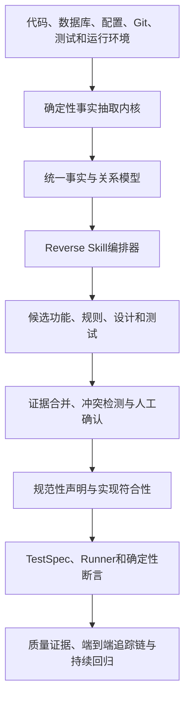

> 语言：**简体中文** · [English](enterprise-traceable-quality-platform-design-v0.2.en.md)

# 企业级可追溯质量平台详细设计

> 版本：v0.2.0
> 状态：实现愿景、总体设计与核心追踪模型基线
> 日期：2026-07-14
> 适用范围：缺少可信产品、设计与测试资产，但具备代码、数据库及运行环境的存量系统

## 0. 实现愿景与产品护栏

### 0.1 实现愿景

为缺少可信需求、设计和测试资产的存量系统，建立一个能够从真实代码、数据库、配置、部署和运行环境中恢复候选业务知识，经授权人员确认后形成业务基线，并通过真实测试证据持续验证当前实现是否符合业务意图的企业级可追溯质量平台。

平台最终必须使用户能够从一个产品功能或一条业务规则出发，沿完整追踪链回答：

```text
业务意图与适用范围
→ 当前实现
→ 数据、配置与外部依赖
→ 验证该规则的TestSpec和断言
→ 对应真实部署上的测试执行
→ 可定位、可校验的执行证据
→ 当前符合性、验证状态和变更影响
```

平台的目标不是替企业“猜出唯一正确的原始需求”，而是将未知、推断、事实、授权决策和验证结果分开管理，使一个过去说不清的功能变得可理解、可确认、可验证并可持续回归。

### 0.2 不可偏离的产品护栏

后续产品、架构和实现决策必须满足以下护栏：

1. **不退化为文档生成器**：不能回到原始代码、数据或运行证据的内容只作为草稿，不形成可信基线。
2. **不退化为代码搜索或图谱展示工具**：关系展示必须最终服务于业务理解、人工确认、真实验证和变更防护。
3. **不退化为测试生成器**：测试数量不是目标；每个有效测试必须说明验证了哪条有适用范围的规则。
4. **不把当前实现当成业务真相**：代码事实描述“现在怎样”，授权业务声明描述“应该怎样”，两者必须通过符合性关系连接。
5. **不把人工确认当成测试通过**：确认、实现符合性、执行结果、证据时效和冲突状态分别表达。
6. **不把AI推断伪装成确定性事实**：AI只能提出候选声明、关联和解释，来源与不确定性必须可见。
7. **不以单一绿色分数掩盖未知**：缺少规则、映射、测试、执行或证据时必须显式显示断链。
8. **不牺牲企业安全换取自动化**：数据、密钥和执行权限始终受企业边界、最小权限和审计控制。
9. **不因技术变化误废业务规则**：代码变化使实现映射和验证结论待复核，但不会自动推翻仍有效的业务意图。
10. **不追求第一版通用化**：MVP优先证明一条真实纵向闭环，再扩展语言、框架和执行类型。

### 0.3 北极星结果

平台的北极星不是“生成了多少文档或测试”，而是：

> 对任一纳入治理的高价值功能，平台能展示一条从已确认业务意图到当前真实执行证据的可解释追踪链；当链路任一环节变化、冲突、失败或缺失时，能够指出断点、影响范围、责任人和下一步动作。

任何新能力如果不能提高追踪链的完整性、真实性、可验证性、安全性或维护效率，原则上不进入核心产品范围。

## 1. 文档目的

本文定义一个以产品功能为中心，将产品、设计、代码、数据、配置、测试与运行证据连接起来的企业级可追溯质量平台。

平台不把任何单一LLM或逆向Skill作为事实来源。平台自建确定性的代码与环境事实层，将Specone、GSD及其他方法作为可插拔Reverse Skill，经过多源交叉验证和人工确认后，形成可以持续演进的产品功能基线与测试防护网。

平台需要持续回答八个问题：

1. 这个功能是做什么的？
2. 有哪些业务规则、角色、状态和例外？
3. 它由哪些设计、代码、SQL和配置实现？
4. 它会读取或改变哪些业务数据？
5. 哪些测试验证了哪些业务规则？
6. 当前结论对应哪个代码、配置、数据库和环境版本？
7. 为什么可以相信当前版本是正常的？
8. 从业务意图到真实证据的追踪链在哪里断开，变化后需要重新确认或验证什么？

## 2. 产品定位

### 2.1 一句话定义

以产品功能为中心，用确定性事实、AI候选结论、人工决策和真实测试证据共同构建的可追溯质量平台。

### 2.2 核心价值

| 角色 | 核心价值 |
| --- | --- |
| 业务人员 | 直接确认系统当前实现是否符合业务意图 |
| 产品经理 | 查看产品说明与真实实现是否一致 |
| 开发人员 | 快速定位功能涉及的代码、SQL、配置和依赖 |
| 测试人员 | 明确每条测试验证的规则、数据和执行证据 |
| 架构师 | 查看模块、数据流、依赖、事务和变更影响 |
| 项目经理 | 查看功能可信状态、未确认规则和高风险缺口 |
| 运维人员 | 确认测试结论对应的环境、配置和运行状态 |
| 审计人员 | 追踪谁在什么版本确认了什么结论 |

### 2.3 产品原则

1. **功能是中心对象**：文档、代码和测试都必须关联稳定的Feature ID。
2. **事实与推断分离**：代码事实、数据事实、运行事实、AI推断和人工结论分别存储与展示。
3. **结论必须可追溯**：任何业务规则和质量结论都必须能回到原始证据。
4. **人工按声明确认**：业务人员确认最小业务声明，不审核大篇幅AI文档。
5. **测试必须验证规则**：没有业务规则、断言和执行证据关联的测试不能证明功能正确。
6. **状态按语义分层失效**：业务Decision、实现符合性、验证结果和证据时效分别版本化，只使真正受变化影响的层次过期。
7. **LLM不直接裁决通过失败**：确定性断言引擎负责测试判定，LLM负责解释和建议。
8. **Skill可插拔**：任何Reverse Skill都可以被替换、组合、禁用和审计。
9. **多Skill不是投票**：多个Skill用于补充证据、发现遗漏和暴露冲突，不能以多数票制造真相。
10. **生产默认只读**：所有写操作必须经过环境、权限、审批和安全策略控制。

## 3. 范围与非目标

### 3.1 本期范围

- 存量代码工程扫描与增量分析
- 数据库Schema与有限数据画像
- 配置项、API、SQL、调用关系和现有测试资产提取
- Reverse Skill注册、选择、组合和执行
- 产品功能、业务规则、状态机与技术实现映射
- 声明级人工确认和版本失效
- 统一TestSpec生成、审核和执行
- API、数据库断言和现有自动化测试接入
- 执行证据归档与变更影响分析
- 以功能为中心的可追溯页面
- 从业务意图到真实Evidence的端到端追踪链、断链提示和历史对比

### 3.2 非目标

- 不宣称能够从代码自动恢复唯一、绝对正确的业务需求
- 不允许LLM直接获得无限制Shell、数据库或生产环境权限
- 不以自动生成文档数量和测试数量作为核心成功指标
- 第一版不追求支持所有语言、框架、数据库和测试类型
- 第一版不自动修复业务代码或直接阻断生产发布
- 第一版不依赖某个特定逆向Skill、模型、图数据库或容器平台

## 4. 核心概念模型

### 4.1 Fact：事实

由确定性工具观察或提取、可重复验证的结构化记录，例如：

- 某个Commit中存在`OrderService.submit`方法
- `POST /orders/{id}/submit`映射到该方法
- 方法内调用`OrderMapper.updateStatus`
- SQL更新`orders.status`
- 测试环境配置`inventory.timeout=3000`
- 某次Trace中实际调用了库存服务

事实只说明“当前观察到什么”，不直接说明业务是否正确。

### 4.2 Claim：带类型和适用范围的声明

由Reverse Skill或人工根据事实提出的业务、设计或质量结论，例如：

> 只有草稿状态的订单允许提交。

声明必须记录生成来源、证据、声明类型、适用范围、冲突、版本和确认状态。声明至少区分：

- `NORMATIVE_REQUIREMENT`：业务、法规或正式产品依据所表达的“应该怎样”。
- `IMPLEMENTATION_BEHAVIOR`：根据代码、配置和运行行为观察到的“当前怎样”。
- `DESIGN_INTENT`：架构、事务、异常处理和依赖方面的设计意图。
- `QUALITY_EXPECTATION`：性能、可靠性、安全性和可运维性方面的期望。

不得用人工确认`IMPLEMENTATION_BEHAVIOR`来替代`NORMATIVE_REQUIREMENT`。代码事实可以支持“当前实现如此”，但不能单独证明“业务本应如此”。

### 4.3 ClaimScope：声明适用范围

同一句业务规则可能只在特定上下文成立。ClaimScope用于结构化表达：

- 租户、产品版本、地区、渠道和业务域
- 角色、资源所有权、账号类型和授权上下文
- 环境、部署、Feature Flag和配置组合
- 数据前置条件、状态、时间窗和额度范围
- 生效时间、失效时间、例外和优先级

冲突检测必须先判断Scope是否重叠。两个文本相反但Scope不重叠的声明不是冲突，而是业务变体。

### 4.4 Evidence：证据

用于支持或反驳声明的可定位材料，包括：

- 代码位置和内容Hash
- API定义
- SQL与数据库约束
- 配置快照
- 日志、Trace和指标
- 测试请求、响应和数据库前后状态
- 人工输入的正式业务依据

### 4.5 Decision：人工决策

人工对声明做出的版本化结论：

- 确认正确
- 确认错误
- 存在例外
- 证据不足
- 暂缓确认
- 废弃

Decision只裁决声明的业务权威性、适用范围或处置意见，不直接表示当前实现符合该声明，也不直接表示测试已经通过。

### 4.6 ImplementationConformance：实现符合性

ImplementationConformance描述某个实现快照与规范性声明之间的关系：

- `UNKNOWN`：尚未建立足够实现映射
- `CONFORMS`：当前证据表明实现符合声明
- `DEVIATES`：实现与声明不一致
- `PARTIAL`：仅部分路径或Scope符合
- `CONFLICTED`：存在相互矛盾的实现证据
- `STALE`：实现或依赖变化后需要重新计算

符合性结论必须绑定声明版本、实现快照、Scope、分析方法和证据。

### 4.7 VerificationResult：验证结果

VerificationResult描述某次TestExecution对某条声明或符合性结论的验证结果。它与人工Decision分离，至少包括`PASS`、`FAIL`、`ERROR`、`INCONCLUSIVE`、`SKIPPED`和`CANCELLED`。

### 4.8 Feature：产品功能

产品功能是平台最小的业务追溯单元，具有稳定ID，并关联规则、角色、状态、设计、代码、数据、配置、测试、证据和人工决策。

Feature需要支持跨版本重命名、合并、拆分和别名，并保留`PREDECESSOR_OF`、`SUCCESSOR_OF`、`MERGED_INTO`和`SPLIT_INTO`血缘，不能仅依赖名称或代码位置保持稳定。

### 4.9 TestSpec：可执行测试规格

TestSpec是自然语言测试意图与具体测试框架之间的中间协议。Reverse Skill只能生成候选TestSpec，执行前必须经过Schema校验、安全策略检查和必要的人工审批。

### 4.10 TraceChain：端到端追踪链

TraceChain是对底层事实、声明、关系、执行和证据的有序投影视图，用于回答从业务意图到真实证明的完整路径。TraceChain不复制或制造新的事实；它保存查询范围、路径选择、链路状态和断点，并引用底层对象。

## 5. 总体架构



### 5.1 分层架构

| 层次 | 责任 | 可信边界 |
| --- | --- | --- |
| 接入层 | 接入代码仓、数据库、配置、测试环境和遥测 | 输入均视为不可信 |
| 事实层 | AST、API、SQL、表、配置、Git、测试和Trace提取 | 必须可重复验证 |
| Skill层 | Specone、GSD、领域建模、规则提取、测试设计 | 只能产生候选结论 |
| 知识层 | 功能、规则、状态机、设计和关联关系 | 保存来源、版本和冲突 |
| 验证层 | 数据库核验、真实执行、覆盖率和断言 | 由确定性程序裁决 |
| 治理层 | 人工确认、权限、版本、审计和质量门禁 | 高风险操作必须审批 |
| 展示层 | 端到端追踪链、功能追溯页、风险看板、覆盖矩阵和证据报告 | 不隐藏不确定性与断链 |

### 5.2 控制中心与企业Runner

平台采用“中心控制面 + 企业内执行节点”模式：

- 控制中心负责项目、Skill、任务、知识、审批、报告和审计。
- Runner部署在可访问代码库、数据库及测试环境的网络边界内。
- 数据库凭据和环境密钥保留在Runner侧，不发送给LLM。
- Runner从控制中心领取受策略约束的任务并返回脱敏证据。
- Runner支持进程、虚拟机或容器等部署形态，不绑定单一运行方式。

## 6. 统一代码事实模型

### 6.1 设计目标

- 不依赖LLM即可建立基础系统地图
- 支持不同语言扫描器输出统一结构
- 支持Commit级快照和增量更新
- 所有事实可以回到源文件、行号、SQL、配置或运行记录
- 为所有Reverse Skill提供稳定、低歧义的输入

### 6.2 核心事实实体

| 实体 | 关键内容 |
| --- | --- |
| Project | 项目、仓库、团队和安全边界 |
| SourceSnapshot | 仓库、Commit、Tree Hash、分支上下文和子模块版本 |
| BuildArtifact | CI Build、二进制或镜像Digest、依赖锁和SBOM |
| DeploymentSnapshot | 环境、部署ID、实际运行制品、实例和发布时间 |
| RuntimeContext | Schema迁移、配置、Feature Flag、外部依赖和采集时间窗 |
| SnapshotManifest | 将以上组件版本组合为一次分析或验证使用的不可变清单 |
| Artifact | 源文件、配置文件、文档、日志和测试报告 |
| Module | 模块、包、服务和构建单元 |
| CodeSymbol | 类、方法、函数、字段、枚举和注解 |
| Endpoint | REST、RPC、GraphQL、消息和定时入口 |
| DataObject | 表、字段、视图、索引、约束、存储过程和触发器 |
| Configuration | 配置键、默认值、环境覆盖和敏感级别 |
| ExternalDependency | 下游服务、第三方API、消息中间件和文件系统 |
| TestAsset | 已有单元、集成、API和UI测试 |
| RuntimeOperation | Trace Span、日志事件、SQL执行和指标 |

### 6.3 核心关系类型

```text
Module CONTAINS CodeSymbol
Endpoint IMPLEMENTED_BY CodeSymbol
CodeSymbol CALLS CodeSymbol
CodeSymbol READS DataObject
CodeSymbol WRITES DataObject
CodeSymbol CONTROLLED_BY Configuration
CodeSymbol DEPENDS_ON ExternalDependency
TestAsset EXERCISES CodeSymbol
TestAsset CALLS Endpoint
RuntimeOperation OBSERVED_AT CodeSymbol
RuntimeOperation ACCESSES DataObject
```

### 6.4 Fact记录结构

```json
{
  "fact_id": "FACT-01H...",
  "project_id": "PROJECT-001",
  "snapshot_manifest_id": "SNAPSHOT-MANIFEST-abc123",
  "fact_type": "endpoint_implemented_by",
  "subject": "POST /api/orders/{id}/submit",
  "predicate": "IMPLEMENTED_BY",
  "object": "OrderController.submit",
  "source": {
    "artifact": "src/main/java/.../OrderController.java",
    "start_line": 42,
    "end_line": 48,
    "content_hash": "sha256:..."
  },
  "extractor": {
    "id": "java-spring-scanner",
    "version": "0.1.0"
  },
  "observed_at": "2026-07-10T00:00:00Z",
  "valid_from": "2026-07-10T00:00:00Z",
  "valid_to": null
}
```

### 6.5 稳定标识与版本策略

- Project ID在项目生命周期内稳定。
- SourceSnapshot、BuildArtifact、DeploymentSnapshot和RuntimeContext分别版本化，避免把独立变化的来源压成一个模糊Snapshot。
- SnapshotManifest使用各组件内容Hash组合生成，记录采集开始/结束时间、来源、完整度、失败项和签名。
- 测试执行必须验证目标Deployment实际运行的制品Digest，而不能只记录期望Commit。
- CodeSymbol使用“仓库 + 语言 + 完全限定名 + 签名”作为自然键。
- Artifact保存内容Hash，文件行号只作为辅助定位。
- Feature ID不随代码重命名自动改变。
- 事实不能原地覆盖；通过`SUPERSEDES`、`RETRACTS`和有效时间追加新事件，不修改旧事实的`status`制造伪不可变性。
- Fact同时记录`observed_at`和业务有效时间`valid_from/valid_to`；未扫描到某关系不等于该关系不存在。

### 6.6 第一版扫描能力

第一版优先支持一种主语言和一种主流Web框架，至少提取：

- 项目模块、依赖和构建命令
- Controller、路由和DTO
- Service与方法调用
- Repository、Mapper、SQL、表和字段
- 状态枚举和关键条件分支
- 权限注解和异常
- 配置键和环境覆盖
- 已有测试及其目标代码

Tree-sitter可作为跨语言语法树底座；对重点语言再使用语言专用解析器提高类型、符号和调用解析准确率。

## 7. Reverse Skill Framework

### 7.1 Skill定位

Reverse Skill是一套可版本化的逆向方法、提示、工具约束和输出协议，用于基于统一事实模型生成候选知识。

Specone、GSD以及未来的领域逆向、安全分析、状态机恢复和测试设计能力，都通过同一协议接入。平台不预设某个Skill必然优于其他Skill。

### 7.2 Skill能力分类

| 能力 | 输出 |
| --- | --- |
| architecture_reverse | 模块、分层、依赖和架构候选 |
| feature_discovery | 产品功能候选 |
| domain_modeling | 业务实体、聚合和关系 |
| business_rule_mining | 业务规则、前置条件和例外 |
| state_machine_recovery | 状态、转换、触发条件和禁止路径 |
| permission_analysis | 角色、资源和操作权限矩阵 |
| data_semantics | 表、字段和数据变化的业务语义 |
| configuration_analysis | 配置对业务行为的影响 |
| test_inventory_review | 现有测试有效性候选结论 |
| test_design | 测试场景和TestSpec候选 |
| runtime_correlation | 静态代码与真实运行路径关联 |
| change_impact | 变更影响功能、规则和测试 |
| reverse_review | 检查其他Skill的遗漏、矛盾和幻觉 |

### 7.3 Skill Manifest

```yaml
apiVersion: quality.example/v1alpha1
kind: ReverseSkill
metadata:
  id: specone-reverse
  name: Specone Reverse
  version: 1.0.0

capabilities:
  - architecture_reverse
  - feature_discovery
  - test_design

compatibility:
  languages: [java, javascript]
  frameworks: [spring-boot, react]
  fact_schema: ">=0.1 <0.2"

inputs:
  required:
    - project_snapshot
    - code_fact_bundle
  optional:
    - database_fact_bundle
    - existing_test_bundle
    - runtime_fact_bundle

outputs:
  schema: reverse-artifact-bundle/v1alpha1
  types:
    - candidate_feature
    - candidate_claim
    - candidate_test_spec
    - evidence_link
    - open_question

permissions:
  filesystem: read_only
  database: none
  network: none
  shell: none
  secrets: none

model:
  required: true
  allowed_profiles: [reasoning-large]
  context_strategy: indexed_retrieval

execution:
  timeout_minutes: 30
  cost_class: medium
  supports_incremental: true
```

### 7.4 标准输入包

Skill不直接漫游企业系统，而是接收平台生成的受控输入包：

- Snapshot Manifest：源码、构建制品、部署、Schema、配置和外部依赖的组合版本
- Code Fact Bundle：代码符号、API、调用、SQL和关系
- Database Fact Bundle：Schema、约束和脱敏数据画像
- Test Fact Bundle：现有测试、断言和覆盖情况
- Runtime Fact Bundle：脱敏日志、Trace和指标
- Task Scope：允许分析的模块、功能、文件和时间范围
- Policy Context：数据安全、网络、模型和输出限制

### 7.5 标准输出包

```yaml
apiVersion: quality.example/v1alpha1
kind: ReverseArtifactBundle

producer:
  skill_id: business-rule-mining
  skill_version: 0.1.0
  model_profile: reasoning-large
  prompt_version: rule-mining-v3

scope:
  project_id: PROJECT-001
  snapshot_manifest_id: SNAPSHOT-MANIFEST-abc123

claims:
  - local_id: claim-001
    type: business_rule
    statement: 只有DRAFT状态的订单允许提交
    confidence: medium
    evidence:
      - fact_id: FACT-001
        relation: supports
      - fact_id: FACT-002
        relation: supports
    open_questions:
      - 是否存在管理员强制提交的例外？

conflicts: []
warnings: []
```

Skill不得只返回无来源的Markdown。Markdown只能作为结构化输出的渲染结果。

### 7.6 Skill选择方式

平台支持：

- 自动推荐：根据技术栈、项目规模、已有证据和目标推荐Skill组合。
- 手动选择：用户按逆向阶段选择一个或多个Skill。
- 预设方案：快速逆向、标准逆向、深度逆向、安全专项、测试补全、变更分析。
- 策略选择：企业管理员限定允许使用的Skill、模型和数据范围。

## 8. 多Skill编排与冲突处理

### 8.1 编排流程

```text
创建逆向任务
→ 固定SnapshotManifest和分析范围
→ 执行确定性事实扫描
→ 根据能力和策略选择Skill
→ 为每个Skill构建最小输入包
→ 隔离执行并校验输出Schema
→ 标准化声明、证据和术语
→ 合并重复项并建立冲突关系
→ 生成待确认功能与规则
→ 人工确认后形成基线
```

### 8.2 任务状态

```text
CREATED
→ FACT_SCANNING
→ SKILL_PLANNING
→ SKILL_RUNNING
→ NORMALIZING
→ CONFLICT_ANALYSIS
→ WAITING_REVIEW
→ BASELINED
→ COMPLETED
```

任一步骤都应支持超时、重试、取消、恢复和审计。

### 8.3 去重规则

1. 先以稳定实体ID、代码符号和规则类型进行确定性匹配。
2. 再使用语义相似度寻找“可能重复”，但不能自动合并。
3. 合并时保留所有Skill来源、原始文本和证据。
4. 术语不同但约束不同的声明必须保持独立。
5. 人工合并或拆分声明必须记录Decision。

### 8.4 冲突规则

以下情况形成显式Conflict：

- 两个声明对同一主体给出相反约束
- 业务声明与代码事实不一致
- 代码事实与数据库事实不一致
- 静态分析与运行行为不一致
- 已确认规范性规则与新SnapshotManifest中的实现不一致
- 测试预期与已确认业务规则不一致

示例：

```text
声明A：已审批订单不能撤回。
声明B：管理员可以强制撤回已审批订单。

系统处理：
不投票、不覆盖，建立冲突，并提示可能存在“普通用户限制 + 管理员例外”。
```

### 8.5 多维可信状态

平台禁止使用单一L0至L4等级同时表达业务权威、实现符合性和测试状态。每个功能或追踪链至少分别展示：

| 维度 | 状态示例 | 回答的问题 |
| --- | --- | --- |
| 声明来源 | AI候选、代码推断、正式依据、人工提出 | 这句话从哪里来？ |
| 业务权威性 | 未审核、已确认、存在例外、已驳回、已废弃 | 业务是否认可“应该这样”？ |
| 证据支持度 | 无证据、单源、多源、存在反证、证据不完整 | 有哪些材料支持或反对？ |
| 实现符合性 | 未知、符合、部分符合、偏离、冲突、过期 | 当前实现是否符合规则？ |
| 验证状态 | 未执行、通过、失败、错误、不确定、跳过 | 真实测试证明了什么？ |
| 证据时效 | 新鲜、临近过期、过期、采集不完整 | 结论是否仍对应当前部署？ |

质量门禁由版本化Policy基于这些维度组合判断。例如，高风险强门禁可以要求“业务已确认 + 无未解决反证 + 实现符合 + 当前部署验证通过 + 证据新鲜”，而不是判断一个综合等级。

任何维度存在未知、冲突或数据源采集失败时，界面必须显示原因，不能通过其他维度的高状态将其覆盖。

## 9. 以产品功能为中心的追溯模型

### 9.1 Feature结构

```text
Feature
├── HAS_CLAIM → BusinessRule
├── APPLIES_IN → ClaimScope
├── ASSESSED_BY → ImplementationConformance
├── HAS_ROLE → Actor/Role
├── HAS_STATE → BusinessState
├── HAS_TRANSITION → StateTransition
├── DESIGNED_BY → DesignElement
├── EXPOSED_BY → Endpoint
├── IMPLEMENTED_BY → CodeSymbol
├── READS/WRITES → DataObject
├── CONTROLLED_BY → Configuration
├── DEPENDS_ON → ExternalDependency
├── VERIFIED_BY → TestSpec
├── HAS_RESULT → VerificationResult
├── PROVED_BY → Evidence
├── CONFIRMED_BY → Decision
└── HAS_GAP → TraceGap
```

### 9.2 功能页面信息架构

#### 页面头部

- Feature ID、名称和所属业务域
- 当前部署与SnapshotManifest
- 业务确认状态
- 实现追溯状态
- 测试状态
- 运行验证状态
- 证据新鲜度
- 冲突和高风险提示

不建议只展示一个综合绿色分数。至少分别展示业务、实现、测试、运行、时效和冲突六个维度。

#### 页面标签

| 标签 | 内容 |
| --- | --- |
| 产品 | 功能目标、角色、前置条件、流程和例外 |
| 规则 | 最小业务声明、证据、冲突和确认记录 |
| 设计 | 模块、时序、状态机、事务和异常处理 |
| 代码 | API、类、方法、分支、Commit和代码片段 |
| 数据 | 表、字段、SQL、执行前后状态和约束 |
| 配置 | 配置值、环境差异和行为影响 |
| 测试 | TestSpec、规则覆盖、数据和断言 |
| 证据 | 请求响应、SQL、日志、Trace、截图和覆盖率 |
| 变更 | 代码、Schema、配置和追踪链segment失效历史 |
| 决策 | 谁在什么版本确认或驳回了什么声明 |

### 9.3 声明级展示

```text
[AI候选][业务待确认][实现证据：单源][验证：未执行]
只有DRAFT状态的订单允许提交。

支持证据：
✓ OrderService.submit状态判断

相关但不构成规则证明的事实：
· orders.status数据画像存在DRAFT和SUBMITTED

反证/冲突：
? AdminOrderService.forceSubmit可能提供管理员例外

操作：
[确认正确] [存在例外] [确认错误] [证据不足]
```

### 9.4 端到端追踪链

追踪链是平台必须交付的核心产品视图，不是图谱的简化截图。它将底层关系按业务问题组织成有序路径，默认展示：

```text
[Feature：提交订单]
  → [规范性声明：普通用户只能提交DRAFT订单]
  → [Scope：普通用户 / 标准订单 / 开关开启]
  → [实现符合性：CONFORMS]
  → [Endpoint：POST /orders/{id}/submit]
  → [Code：OrderService.submit]
  → [Data：orders.status DRAFT→SUBMITTED]
  → [Config：order.submit.enabled=true]
  → [TestSpec：TEST-ORDER-SUBMIT-001]
  → [Assertion：响应、数据库、Trace]
  → [Execution：部署DEPLOY-20260710-01，PASS]
  → [Evidence：请求、SQL、日志和Trace Hash]
```

产品界面默认将上述底层节点聚合为五个业务可读块：`功能描述 → 设计实现 → 配置 → 测试用例 → 测试结果`。点击任一块必须展示该块对应的数据、来源、版本和状态；功能描述展开 Claim/Scope/Decision 与业务逻辑，设计实现展开设计元素、接口和代码 Fact，配置展开配置与数据约束，测试用例展开 TestSpec、步骤与断言，测试结果展开 Execution、Evidence 和新鲜度。该聚合仅是展示投影，不得删除、合并或掩盖底层可审计关系。

五块详情遵循以下约束：

- **功能描述**不是字段摘要，而是一份完整、版本化的功能说明文档，至少覆盖目标、业务逻辑、权限、前置条件、依赖、适用范围及例外边界。业务人工确认结果、时间、负责人和说明单独展示并允许编辑草稿；正式生效必须由服务端鉴权后追加不可变 Decision，客户端编辑不能覆盖权威事实。
- **设计实现**同时展示版本化设计文档、处理流程、关键设计决策和可定位的具体代码块。每个代码块绑定文件、起始行、语言和 Fact ID，避免把无法定位的概述当成实现证据。
- **配置**采用 DEV/SIT/UAT/PROD 跨环境矩阵，显示配置项、说明、来源及各环境值。敏感项只展示密钥引用；任何环境值都必须绑定对应 Snapshot，不能用某一环境推断另一环境。
- **测试用例**先展示测试设计策略，再展示版本化 TestSpec 条目。点击条目可查看目标、前置条件、测试数据、执行步骤、期望、断言、Fixture、Cleanup、操作级别及所需能力。
- **测试结果**按业务场景组织 Execution。每条结果绑定 TestSpec 版本、环境、部署和 Evidence；失败或错误条目可下钻到具体失败步骤、期望值、实际值、错误码和错误信息。历史失败必须保留并明确标为 `HISTORICAL`，不能与当前部署结果混淆。

为后续执行 Agent 预留稳定的版本化契约。执行请求至少包含 TestSpec ID/版本、Snapshot、部署、环境、目标策略、Fixture/Cleanup 协议和所需能力；回传至少包含 Execution ID、attempt、步骤结果、断言结果、Evidence 引用、起止时间、Runner 身份和证明。Agent 只能消费已批准且版本固定的 TestSpec，并回传结构化事实；不能修改测试设计、业务确认或自行宣布功能可信。服务端仍负责身份、版本、部署绑定、签名和最终可信状态校验。本阶段只定义并展示该契约，不接入外部 Agent 调度。

追踪链至少支持三种方向：

1. **正向证明链**：从Feature或业务规则追到当前实现、测试和证据。
2. **反向故障链**：从失败断言或运行异常反查TestSpec、规则、功能、代码和责任人。
3. **变更影响链**：从Commit、Schema、配置或部署变化追到受影响实现、规则、验证和必需回归。

#### 追踪链完整度

追踪链不使用简单百分比代替真实状态，而是检查必要环节：

```text
业务意图已确认？
→ Scope是否明确？
→ 是否存在当前部署的实现映射？
→ 实现符合性是否已计算且无冲突？
→ 是否存在验证规则的有效TestSpec与业务断言？
→ 是否在目标部署执行？
→ Evidence是否完整、新鲜、未被篡改？
```

缺少任一必要环节时形成`TraceGap`，记录缺口类型、风险、原因、责任角色和建议动作。例如：`MISSING_AUTHORITY`、`SCOPE_UNKNOWN`、`IMPLEMENTATION_UNMAPPED`、`NO_ASSERTION`、`NOT_EXECUTED_ON_CURRENT_DEPLOYMENT`、`EVIDENCE_STALE`。

#### 链路数据模型

TraceChain是查询或保存的路径投影，至少包含：

```json
{
  "chain_id": "CHAIN-ORDER-SUBMIT-001",
  "root": "FEATURE-ORDER-001",
  "scope": "SCOPE-NORMAL-USER-001",
  "snapshot_manifest": "SNAPSHOT-MANIFEST-abc123",
  "deployment": "DEPLOY-20260710-01",
  "segments": [
    {
      "from": "CLAIM-ORDER-STATUS-001",
      "relation": "CONFORMED_BY",
      "to": "CODE-ORDER-SERVICE-SUBMIT",
      "provenance": "deterministic+reviewed",
      "status": "active"
    }
  ],
  "gaps": [],
  "conflicts": [],
  "computed_at": "2026-07-10T00:00:00Z"
}
```

链路本身不复制Fact、Claim和Evidence内容；每个segment引用底层对象及其版本，链路状态由可重放规则计算。

#### 链路页面展示

页面默认使用横向或纵向分阶段链路，而不是一次展开全部图节点：

```text
业务意图 ── 实现符合性 ── 技术实现 ── 测试规格 ── 真实执行 ── 证据
  已确认       符合           4项映射       3条断言       PASS       新鲜
```

- 每一阶段展示独立状态、版本、来源、时间和责任角色。
- 单击阶段展开本层细节；需要探索分支时切换到追溯图谱。
- 断链位置使用明确缺口卡片，并提供“补充依据、建立映射、生成测试、重新执行、处理冲突”等动作。
- 支持锁定一条规则到一条Evidence的路径并导出审计报告。
- 支持当前部署与历史部署并排比较，显示新增、删除、变化和过期segment。
- 支持按角色切换表达：业务视图隐藏低层代码噪声，开发和测试视图保留完整技术节点。
- 线性链路视图和图谱视图必须来自同一底层数据，不能形成两套口径。

### 9.5 可交互追溯图谱

图谱不是附属的技术拓扑图，而是平台核心交互之一。平台采用“功能详情 + 追溯图谱”双主视图：

- 功能详情适合阅读、确认和查看完整字段。
- 追溯图谱适合探索关联、理解路径、发现缺口和分析变更影响。
- 两种视图共享同一套Feature、Claim、Fact、TestSpec、Evidence和Decision数据。
- 用户在详情页点击任何关联项都可以定位到图谱；在图谱点击节点可以打开详情抽屉或进入完整详情页。

#### 页面整体布局

```text
┌──────────────────────────────────────────────────────────────────────────┐
│ 项目 / 部署与Manifest / 环境 / 搜索 / 视图模式 / 版本对比 / 导出       │
├──────────────┬───────────────────────────────────────┬───────────────────┤
│ 节点与关系过滤 │                                       │ 节点详情与操作     │
│              │           可交互追溯图谱画布           │                   │
│ 功能          │                                       │ 摘要              │
│ 规则          │        [Feature：提交订单]             │ 来源与版本         │
│ 设计          │           /    |    \                 │ 支持/反对证据      │
│ API/代码      │      [规则] [代码] [测试]              │ 人工确认           │
│ 数据/配置     │                                       │ 关联测试           │
│ 测试/证据     │                                       │ 展开与跳转         │
├──────────────┴───────────────────────────────────────┴───────────────────┤
│ 路径面包屑 / 图例 / 节点数量 / 冲突提示 / 当前选择集                     │
└──────────────────────────────────────────────────────────────────────────┘
```

### 9.6 图谱节点类型

| 节点类型 | 说明 | 默认展示粒度 |
| --- | --- | --- |
| Feature | 产品功能 | 始终作为中心节点 |
| BusinessRule | 业务规则和例外 | 默认展示 |
| ClaimScope | 声明适用的租户、角色、条件、时间和业务变体 | 默认附着在规则上，按需展开 |
| ImplementationConformance | 规范性声明与当前实现的符合性结论 | 追踪链默认展示状态 |
| Actor/Role | 用户角色和权限主体 | 默认聚合，按需展开 |
| BusinessState | 状态及生命周期 | 状态机模式展示 |
| DesignElement | 模块、时序、事务和异常设计 | 默认展示概要 |
| Endpoint | REST、RPC、消息和任务入口 | 默认展示 |
| CodeSymbol | 类、方法、函数和关键分支 | 默认聚合到类或服务，按需下钻方法 |
| DataObject | 表、字段、视图和存储过程 | 默认展示表，按需下钻字段 |
| Configuration | 配置键、功能开关和环境值 | 只展示影响当前功能的配置 |
| ExternalDependency | 下游服务、消息和第三方依赖 | 默认展示服务级节点 |
| TestSpec | 可执行测试规格 | 默认展示测试场景 |
| TestExecution | 某次测试执行 | 默认聚合为最近有效执行 |
| VerificationResult | 某次执行对具体规则的验证结果 | 默认附着在执行与规则之间 |
| Evidence | HTTP、SQL、日志、Trace和截图 | 默认聚合，按需展开 |
| Decision | 人工确认和例外决策 | 只展示当前有效决策，历史按需展开 |
| ChangeSet | Commit、Schema或配置变更 | 在变更影响模式展示 |
| Conflict | 相互矛盾的声明或证据 | 始终醒目标识 |
| TraceGap | 追踪链缺少必要环节或当前信息不完整 | 始终醒目标识并给出建议动作 |

节点识别不能只依赖颜色，还必须使用图标、形状、类型标签和可访问性文本。失效节点使用虚线边框，冲突节点使用警示标识，未确认节点显示待确认角标。

### 9.7 图谱关系类型

| 关系 | 含义 |
| --- | --- |
| HAS_RULE | 功能包含业务规则 |
| APPLIES_IN | 声明适用于特定Scope |
| HAS_ROLE | 功能涉及角色 |
| HAS_STATE / TRANSITIONS_TO | 功能包含状态及转换 |
| DESIGNED_BY | 功能由设计元素描述 |
| EXPOSED_BY | 功能通过API、消息或任务入口暴露 |
| IMPLEMENTED_BY | 功能或规则由代码实现 |
| CONFORMS_TO / DEVIATES_FROM | 当前实现符合或偏离规范性声明 |
| CALLS | 代码、服务或接口之间的调用 |
| READS / WRITES | 功能或代码读取、修改数据对象 |
| CONTROLLED_BY | 功能行为受配置控制 |
| DEPENDS_ON | 功能依赖其他服务或基础设施 |
| VERIFIED_BY | 功能或规则被TestSpec验证 |
| EXECUTED_AS | TestSpec对应某次执行 |
| VERIFICATION_RESULT | 执行对声明产生独立的验证结果 |
| PROVED_BY / CONTRADICTED_BY | 声明被证据支持或反驳 |
| CONFIRMED_BY | 声明被人工Decision确认 |
| AFFECTS | ChangeSet影响功能、规则或测试 |
| CONFLICTS_WITH | 声明、实现、测试或证据相互冲突 |

每条边必须保存方向、关系类型、来源、SnapshotManifest、生成方式和有效状态。AI推断关系与确定性事实关系使用不同线型展示。

### 9.8 核心图谱模式

平台至少提供五种预设视图，避免所有关系混在同一张图中：

#### 产品追溯图

```text
Feature
→ BusinessRule
→ DesignElement
→ Endpoint / CodeSymbol / DataObject / Configuration
→ TestSpec
→ TestExecution
→ Evidence
```

用于回答：“这个功能是什么、如何实现、如何测试、为什么可信？”

#### 业务流程图

```text
Actor
→ Feature
→ BusinessState
→ StateTransition
→ Next Feature
```

用于业务人员确认角色、步骤、状态和例外路径。

#### 实现依赖图

```text
Feature
→ Endpoint
→ CodeSymbol
→ DataObject / Configuration / ExternalDependency
```

用于开发和架构人员查看实现、数据和依赖。

#### 测试覆盖图

```text
Feature
→ BusinessRule
→ TestSpec
→ Assertion
→ TestExecution
→ Evidence
```

未连接TestSpec的规则、无断言的测试以及缺少有效执行证据的测试应直接形成可视化缺口。

#### 变更影响图

```text
ChangeSet
→ CodeSymbol / DataObject / Configuration
→ Feature / BusinessRule
→ Decision / TestSpec
→ Required Regression
```

用于回答：“这次变化影响哪些功能、哪些确认已经过期、必须重新执行什么测试？”

### 9.9 交互规则

- 单击节点：选中并在右侧抽屉显示摘要、来源、版本、证据和操作。
- 双击节点：将该节点设为新的中心，加载其一层关键关系。
- 展开按钮：按关系类型选择性加载下一层，默认不全量展开。
- 折叠按钮：将方法聚合为类、将字段聚合为表、将执行聚合为TestSpec。
- 悬停关系：显示关系类型、来源、SnapshotManifest和是否为AI推断。
- 路径锁定：固定一条端到端链路，隐藏无关节点。
- 最短路径：查询两个节点之间的追溯路径。
- 反向追溯：从失败证据反查测试、规则、功能和代码。
- 多选比较：比较多个功能或多个测试的共同依赖和差异。
- 节点跳转：进入代码、SQL、配置、TestSpec或证据的完整详情。
- 确认操作：业务人员可直接在规则节点或详情抽屉确认、驳回或补充例外。
- 快照切换：查看不同Commit、Schema和环境下的图谱。
- 版本对比：新增节点为绿色边框、删除节点为红色删除线、变化节点为橙色边框。

### 9.10 图谱查询与过滤

过滤条件至少包括：

- 节点类型和关系类型
- 产品域、模块和服务
- SourceSnapshot、部署、Manifest、分支和环境
- 业务权威性、证据支持度、实现符合性、验证状态和证据时效
- 已确认、待确认、冲突、失效和测试失败状态
- 风险等级
- 最近变更时间和最近验证时间
- Reverse Skill、模型和Scanner来源
- 是否存在测试、有效断言和运行证据

支持面向业务的路径查询：

```text
显示“提交订单”功能关联的全部规则和测试。
显示没有测试覆盖的已确认规则。
显示受本次Commit影响且确认已失效的功能。
显示所有通过配置开关控制的高风险功能。
从失败的数据库断言反查对应代码和业务规则。
```

自然语言查询必须先转换为只读图查询计划，并向用户显示实际过滤条件和范围，不能让LLM直接执行任意数据库写操作。

### 9.11 防止图谱失控

全量代码图极易形成“毛线团”，因此采用渐进披露：

1. 默认以Feature为中心，只加载一层业务规则和关键实现。
2. 初始画布建议控制在30个可见节点以内。
3. 方法默认按类、包或服务聚合，字段默认按表聚合。
4. 低价值DTO、工具类和框架内部节点默认隐藏。
5. 用户展开前先显示将新增的节点数量。
6. 超过阈值时切换为列表、矩阵或分组视图，而不是继续堆叠节点。
7. 支持保存个人视图和企业标准视图，但不改变底层关系事实。
8. 大型图查询必须具备深度、节点数、时间和资源限制。

### 9.12 图谱与追踪链数据接口

```text
GET /features/{id}/graph?view=traceability&depth=1
GET /features/{id}/trace-chains?direction=forward&deployment={deploymentId}
GET /trace-chains/{id}
POST /trace-chains/query
GET /trace-chains/{id}/gaps
GET /trace-chains/{id}/changes?from={deploymentA}&to={deploymentB}
GET /graph/nodes/{id}/neighbors?relations=VERIFIED_BY,PROVED_BY
POST /graph/paths/query
POST /graph/impact/query
GET /graph/changes?from={snapshotA}&to={snapshotB}
GET /graph/gaps?type=unverified-rule
```

标准返回结构：

```json
{
  "center": "FEATURE-ORDER-001",
  "snapshot_manifest": "SNAPSHOT-MANIFEST-abc123",
  "nodes": [
    {
      "id": "FEATURE-ORDER-001",
      "type": "Feature",
      "label": "提交订单",
      "status": "confirmed",
      "risk": "high"
    }
  ],
  "edges": [
    {
      "id": "EDGE-001",
      "source": "FEATURE-ORDER-001",
      "target": "CLAIM-ORDER-001",
      "type": "HAS_RULE",
      "provenance": "reverse-skill",
      "status": "active"
    }
  ],
  "truncated": false,
  "available_expansions": []
}
```

### 9.13 前端技术建议

MVP建议采用React实现分阶段追踪链视图，并配合Cytoscape.js构建追溯图谱。Cytoscape.js提供交互式图谱、选择器过滤、自动布局、图算法、缩放和平移等能力，适合关系探索和路径分析。若页面更偏向可编辑工作流或人工拖拽编排，可评估React Flow；但核心追溯图谱优先采用面向图分析的组件。

后端MVP继续使用PostgreSQL的节点表和关系表，通过受限的图查询服务输出前端所需子图。页面需要图谱不等于第一版必须引入Neo4j；当多跳查询、关系规模和实时路径分析达到明确瓶颈后，再评估图数据库。

## 10. 人工确认、符合性与版本失效

### 10.1 角色与确认范围

| 角色 | 主要确认内容 |
| --- | --- |
| 业务/产品 | 功能目标、业务规则、角色、状态和例外 |
| 开发/架构 | 代码映射、事务、依赖、数据和配置 |
| 测试/质量 | 测试场景、断言、数据和覆盖充分性 |
| 运维 | 环境、配置、部署和运行证据 |

### 10.2 声明状态机

```text
CANDIDATE
→ EVIDENCE_PENDING
→ REVIEW_PENDING
→ CONFIRMED | REJECTED | EXCEPTION_RECORDED | INSUFFICIENT_EVIDENCE
→ SUPERSEDED | DEPRECATED
```

规范性声明确认后不会仅因代码变化自动变为`STALE`。当权威业务依据、Scope或法规时效变化时，创建新版本并将旧版本标记为`SUPERSEDED`或`DEPRECATED`。

### 10.3 Decision结构

```json
{
  "decision_id": "DECISION-001",
  "claim_id": "CLAIM-001",
  "decision": "EXCEPTION_RECORDED",
  "content": "管理员可以在审批后24小时内强制撤回",
  "actor": "user-123",
  "role": "business-owner",
  "claim_version": 3,
  "scope_ref": "SCOPE-ORDER-NORMAL-USER",
  "evidence_refs": ["EVIDENCE-01"],
  "created_at": "2026-07-10T00:00:00Z"
}
```

### 10.4 分层失效规则

| 变化 | 保持有效 | 需要失效或重算 |
| --- | --- | --- |
| CodeSymbol、API、SQL或Schema变化 | 规范性业务声明与Decision | 实现映射、ImplementationConformance、影响范围 |
| 配置、Feature Flag或依赖版本变化 | 不受该上下文影响的业务声明 | 对应Scope下的符合性与验证结果 |
| TestSpec步骤或断言变化 | 业务声明与实现事实 | TestSpec审批、覆盖关系和后续VerificationResult |
| 部署制品或环境变化 | 业务声明、历史Evidence | 当前部署的验证状态和证据新鲜度 |
| 新运行证据与规则矛盾 | 已记录的历史Decision | 符合性转为`CONFLICTED`并创建待处理Conflict |
| 正式业务依据、法规或Scope变化 | 历史版本和审计记录 | 规范性声明创建新版本并重新决策 |

失效必须记录原因、触发ChangeSet、受影响Scope和推荐动作。只有真正受影响的链路segment进入`STALE`，禁止把整个Feature无差别置为过期。

### 10.5 确认权限与职责分离

- Decision必须经过项目、业务域、声明类型和风险级别的授权策略校验。
- 高风险业务规则支持双人确认或业务与合规联合确认。
- 提出声明、实现代码和批准强门禁例外可以配置职责分离。
- Decision支持有效期、委托、撤销、争议和重新开启，并保留完整审计记录。
- 紧急绕过必须使用有时限的Break-glass流程，记录原因、批准人和补审期限。

## 11. TestSpec设计

### 11.1 设计目标

- 将自然语言测试意图转换为可校验、可审核的统一协议
- 与具体测试框架解耦
- 原生关联Feature、Claim和Evidence
- 支持API、数据库、消息、UI和运行证据断言
- 默认具备环境权限、安全等级和清理策略

### 11.2 TestSpec示例

```yaml
apiVersion: quality.example/v1alpha1
kind: TestSpec

metadata:
  id: TEST-ORDER-SUBMIT-001
  name: 草稿订单正常提交
  version: 1
  risk: high

traceability:
  feature_id: FEATURE-ORDER-001
  verifies_claims:
    - CLAIM-ORDER-STATUS-001
  source_snapshot: SNAPSHOT-abc123

environment:
  target: sit
  write_policy: controlled_write

preconditions:
  - type: sql_query
    query_ref: order_by_id
    expect:
      status: DRAFT

data:
  setup:
    strategy: seed_api
    seed_ref: draft_order
  variables:
    order_id: "${seed.order.id}"
    token: "${account.normal_user.token}"

steps:
  - id: submit
    action: http
    method: POST
    path: "/api/orders/${order_id}/submit"
    headers:
      Authorization: "Bearer ${token}"

assertions:
  - type: http_status
    expected: 200
  - type: json_path
    expression: "$.data.status"
    expected: SUBMITTED
  - type: sql_query
    query_ref: order_by_id
    expected:
      status: SUBMITTED
  - type: trace_operation
    service: inventory-service
    operation: reserveInventory
    count:
      min: 1

cleanup:
  strategy: seed_reset

policy:
  destructive: false
  external_side_effect: false
  approval_required: true
```

### 11.3 断言类型

- HTTP状态码、Header、JSON Schema和JSONPath
- 数据库查询、行数、字段、约束和事务回滚
- 业务状态迁移和不变量
- 消息发送、消费和重复处理
- 日志事件和错误码
- Trace服务路径和调用次数
- 权限隔离和资源归属
- 幂等性和并发一致性
- 性能阈值和资源使用
- UI可见性、交互和截图差异

### 11.4 操作安全等级

| 等级 | 示例 | 默认策略 |
| --- | --- | --- |
| SAFE_READ | GET、只读SQL、元数据读取 | 自动执行 |
| CONTROLLED_WRITE | 测试环境创建、更新测试数据 | 需Seed与清理策略 |
| DESTRUCTIVE | 删除、批量更新、Schema变化 | 默认阻止，显式审批 |
| EXTERNAL_SIDE_EFFECT | 发邮件、扣费、真实通知、调用外部生产系统 | 默认阻止 |

## 12. Runner、执行器与证据包

### 12.1 Runner职责

- 接收受签名、受策略约束的执行任务
- 在指定项目、环境和账号范围内执行
- 注入本地密钥但不将密钥返回控制中心
- 调用HTTP、数据库、现有测试和后续UI执行器
- 采集结果、覆盖率、日志和Trace
- 脱敏、压缩并返回Evidence Bundle
- 执行清理、回滚和资源回收

### 12.2 执行器插件

```text
executors/
├── http
├── database
├── existing-tests
├── junit
├── pytest
├── playwright
├── grpc
├── message
└── performance
```

MVP优先实现HTTP、数据库只读/断言和现有测试执行器。

### 12.3 Evidence Bundle

一次测试执行至少保存：

- TestSpec及版本
- SourceSnapshot、构建制品、目标部署、RuntimeContext与Runner版本
- 请求、响应和耗时
- 执行前后数据库查询结果
- 日志、Trace和关联SQL
- 代码覆盖关系
- 每条确定性断言结果
- 重试、超时和清理结果
- 脱敏记录和内容Hash
- LLM失败解释及其模型/Prompt版本

LLM失败解释必须与确定性测试结果分开保存。

### 12.4 执行结果语义

TestExecution与每个Assertion必须区分：

| 状态 | 含义 |
| --- | --- |
| PASS | 所有必需断言在规定Scope与时间窗内满足 |
| FAIL | 系统产生了可重复的业务或技术不符合结果 |
| ERROR | Runner、网络、数据准备、执行器或环境故障，不能判定产品正确性 |
| INCONCLUSIVE | 证据不完整、异步结果超时或观测能力不足 |
| SKIPPED | 因策略、前置条件或明确排除未执行 |
| CANCELLED | 用户或系统取消，保存已产生的部分证据 |

- 重试必须保存每次尝试，不能用最终通过覆盖首次失败。
- 异步消息和最终一致性断言必须声明轮询间隔、总时间预算、顺序和重复策略。
- 并发测试必须声明参与者、同步屏障、隔离资源和期望不变量。
- Setup、执行和Cleanup分别记录结果；Cleanup失败时隔离测试数据并创建补偿任务。
- Token、密码和证书只能通过`secretRef`注入，不得作为普通变量进入TestSpec或Evidence。
- `SAFE_READ`依据已声明副作用和策略判断，不能仅因HTTP方法为GET或SQL为SELECT就自动视为无风险。

### 12.5 Runner信任与通信边界

- Runner使用企业身份注册并通过mTLS与控制中心双向认证，支持证书轮换和吊销。
- 任务包含签名、Policy Hash、Nonce、有效期、幂等键和允许的目标清单，Runner本地再次做权限裁决。
- Runner拒绝重放、过期、越权、版本不兼容和签名无效任务。
- Scanner与构建过程按不可信代码执行，默认禁止网络和宿主机访问，并限制CPU、内存、进程、磁盘和执行时间。
- Runner失联、重复领取、取消和执行完成但证据上传失败时，通过租约与幂等协议恢复，不重复产生外部副作用。
- Runner、Scanner、Skill和Executor制品验证签名、来源、版本和兼容矩阵，并支持紧急禁用。
- 控制中心下发策略不能突破Runner侧企业管理员设置的硬边界。

## 13. 变更影响与持续回归

### 13.1 处理链路

```text
Git Diff / Schema Diff / Config Diff
→ 增量更新事实模型
→ 找到变化的CodeSymbol、DataObject和Configuration
→ 沿关系图找到受影响Feature与Claim
→ 将受影响实现映射、符合性和验证结果标记为STALE
→ 选择关联TestSpec
→ 按风险扩展回归范围
→ 执行并生成新Evidence
→ 重算追踪链、TraceGap和各维可信状态
```

### 13.2 回归选择依据

- 静态调用关系
- 历史动态覆盖关系
- API、SQL、表字段和配置关联
- Feature与Claim追溯关系
- 代码复杂度、变更频率和历史缺陷
- 测试稳定性与最近执行时间
- 业务风险等级

### 13.3 防止漏选

- 静态与动态影响范围取并集，而不是仅取交集。
- 无法解析的反射、动态SQL和消息路径扩大回归范围。
- 高风险功能保留固定冒烟与完整回归集。
- 影响分析低置信度时自动降级为更大范围测试。

## 14. 数据存储设计

### 14.1 MVP存储建议

- PostgreSQL：项目、组合快照、事实、声明、符合性、追踪链、关系、Skill、TestSpec、Decision和执行元数据
- 对象存储或企业文件存储：源文档、日志、Trace、截图和大型测试报告
- 全文检索：代码、声明和证据搜索
- 向量检索：仅用于候选语义检索、相似功能和可能重复声明

第一版不强制图数据库。关系表可以满足MVP追溯，规模和查询复杂度达到瓶颈后再评估图数据库。

### 14.2 核心数据表

```text
project
source_snapshot
build_artifact
deployment_snapshot
runtime_context
snapshot_manifest
artifact
fact_node
fact_edge
reverse_skill
reverse_run
feature
feature_lineage
claim
claim_scope
claim_evidence
conflict
human_decision
implementation_conformance
test_spec
test_execution
assertion_result
verification_result
evidence
evidence_manifest
trace_chain_view
trace_gap
change_set
impact_relation
audit_event
organization
tenant
principal
role_binding
policy
runner
environment
```

### 14.3 不可变与可变数据

- SnapshotManifest、原始事实、执行证据和人工Decision原则上不可变。
- Feature名称、描述等通过版本记录演进。
- 当前状态是历史事件的计算结果，而不是覆盖历史记录。
- 原始Skill输出必须保留，标准化结果与原始输出分别存储。

## 15. 核心API草案

```text
POST   /projects
POST   /projects/{id}/snapshots
POST   /projects/{id}/fact-scans
GET    /projects/{id}/facts

GET    /skills
POST   /reverse-runs
GET    /reverse-runs/{id}
POST   /reverse-runs/{id}/cancel

GET    /features
GET    /features/{id}
GET    /features/{id}/traceability
GET    /features/{id}/conflicts
GET    /features/{id}/trace-chains

GET    /trace-chains/{id}
POST   /trace-chains/query
GET    /trace-chains/{id}/gaps

POST   /claims/{id}/decisions
GET    /claims/{id}/evidence
GET    /claims/{id}/conformance

POST   /test-specs
POST   /test-specs/{id}/validate
POST   /test-executions
GET    /test-executions/{id}/evidence

POST   /change-sets
GET    /change-sets/{id}/impact
```

## 16. 安全与治理

### 16.1 默认安全策略

- 生产数据库默认只读
- Runner账号最小权限
- 密钥只存在于Runner或企业密钥系统
- SQL模板化并限制查询时长、行数和资源
- 测试目标、域名、接口和数据库采用白名单
- 高风险写操作需要人工审批
- 测试数据带唯一标识并支持清理
- 敏感字段识别、遮蔽和禁止模型外发
- 代码、注释、日志和页面内容均视为潜在提示注入来源
- Skill不能自行扩大任务范围或权限
- 所有Skill、模型、Prompt、工具调用和人工操作写入审计日志
- 组织、租户、项目、环境、数据分类和操作级权限使用RBAC与ABAC组合控制
- 图查询和追踪链查询对每个返回节点与Evidence执行授权过滤，防止关系侧信道泄露
- 数据传输与静态存储加密，密钥由企业KMS管理并支持轮换
- 生产环境即使只读也必须限制查询成本、锁影响、导出规模和敏感字段

### 16.2 Skill供应链治理

- Skill安装前验证来源、版本、Hash和声明权限
- Manifest权限与运行时实际权限双重校验
- Skill升级必须重新执行兼容性与回归测试
- 企业可维护允许、观察和禁止三类Skill清单
- 外部Skill默认在只读隔离环境中运行
- Skill输出必须通过Schema和内容安全检查

### 16.3 Evidence保全与生命周期

- 每个Evidence Bundle生成规范化Manifest，记录内容Hash、采集者、Runner身份、可信时间戳、部署、Scope和脱敏过程，并由Runner签名。
- 原始加密证据与供页面/模型使用的脱敏派生证据分离存储；派生证据保留到原始证据的可验证引用。
- 按租户、项目、数据分类和证据类型设置保留期、Legal Hold、删除、归档和访问审计策略。
- 不可变审计与隐私删除冲突时，保留不可逆摘要和删除证明，不继续保存可识别原文。
- Evidence访问使用短期授权，导出和批量下载单独审计并受数据外发策略控制。
- Trace和日志采样率、丢失范围、时钟偏差和脱敏删减必须进入证据完整度，不能把未观测到解释为未发生。

## 17. 可观测性与运营指标

### 17.1 平台可观测性

- 逆向任务耗时、失败、重试和Token成本
- 各Scanner与Skill的输入规模和输出数量
- Runner在线状态、队列深度和资源占用
- 测试执行时长、失败和不稳定率
- 证据上传、脱敏和存储状态
- 变更影响分析耗时和回归选择规模

### 17.2 产品效果指标

| 指标 | 说明 |
| --- | --- |
| 高价值功能有效追踪链率 | 纳入治理的高价值功能中，从已确认业务意图到当前部署Evidence无关键TraceGap的比例 |
| 追踪链断点修复周期 | 从发现关键TraceGap到补齐依据、映射、测试或Evidence的时间 |
| 变更后恢复验证时间 | 从影响变更发生到受影响追踪链重新获得有效验证结果的时间 |
| 功能追溯完整度 | 功能关联产品、代码、数据、配置、测试和证据的情况 |
| 声明确认率 | 候选声明中已完成授权确认的比例 |
| 冲突解决周期 | 从发现冲突到形成Decision的时间 |
| 规则测试覆盖率 | 已确认规则被有效TestSpec验证的情况 |
| 有效断言率 | 具有明确业务判定而非仅检查成功响应的测试比例 |
| 变更影响准确率 | 影响分析结果经人工和执行验证后的准确情况 |
| 测试稳定率 | 排除真实缺陷后的可重复通过情况 |
| 缺陷逃逸率 | 已纳入防护功能仍进入后续环境或生产的缺陷 |
| 证据新鲜度 | 质量结论距离最近有效执行和确认的时间 |
| AI结论接受率 | AI候选声明经人工确认、修改和驳回的分布 |

不以全局代码覆盖率或生成测试数量作为单一质量目标。

其中“高价值功能有效追踪链率”是北极星健康指标，但必须与断点类型、风险和证据时效同时展示，不能重新压缩成一个掩盖问题的综合分数。

## 18. MVP范围

### 18.1 技术范围

- 一种后端语言和一个主流Web框架
- REST API
- 一种关系型数据库
- 一个代码仓库和一个测试环境
- 基础代码扫描器
- HTTP与数据库断言执行器
- Specone适配器
- GSD适配器或第二个可替换Skill适配器
- 一个通用业务规则/测试设计Skill
- 人工确认页面
- 功能追溯页面
- 端到端追踪链、断链提示和历史版本对比
- Git Diff增量影响分析

### 18.2 业务范围

- 选择一个中等规模试点系统
- 选择3条核心业务流程
- 建立10至20个产品功能
- 每个功能恢复关键规则、代码、表、配置和测试关系
- 先跑通一个高价值功能的完整纵向闭环

### 18.3 第一条纵向闭环

```text
固定Commit和环境快照
→ 基础Scanner提取代码事实
→ 选择两个Reverse Skill分析同一范围
→ 合并功能与规则候选并展示冲突
→ 人工确认最小业务声明
→ 生成并审批TestSpec
→ Runner执行API并验证数据库
→ 保存请求、响应、SQL、日志和Trace证据
→ 展示从业务规则到当前部署Evidence的完整追踪链
→ 修改相关代码
→ 自动识别受影响功能、实现符合性和测试
→ 显示追踪链断点并重新执行
→ 更新各维状态和追踪链
```

### 18.4 双数据集策略

第一版同时维护两类数据，避免平台研发依赖企业真实系统，也避免只在理想化Mock工程中自证有效：

#### 内置Mock参考工程

- 采用“订单提交”作为默认示例领域。
- 覆盖状态转换、角色权限、API、数据库写入、配置开关、外部库存依赖、事务回滚、幂等和并发场景。
- 提供固定代码版本、数据库Schema、Seed、配置、已有测试、缺陷版本和期望证据。
- 用于平台开发、自测、演示、自动回归以及不同Reverse Skill的横向评测。
- 所有数据均为合成数据，不包含企业真实业务信息。
- 参考工程只验证平台机制，不作为企业场景有效性的最终证明。

#### 企业真实试点功能

- 从试点系统选择一条真实、高价值且风险可控的核心功能。
- 使用真实代码、测试环境、脱敏数据、配置和运行证据完成纵向闭环。
- 由实际业务、开发和测试责任人完成声明确认。
- 用于验证代码逆向准确性、人工确认成本、TestSpec可执行性、数据库断言、变更影响和持续回归效果。
- 真实试点的验收结果作为MVP是否具备企业价值的最终依据。

两套数据使用相同的事实模型、Reverse Skill协议、功能追溯模型、TestSpec和Runner，禁止为Mock参考工程编写只对示例生效的特殊逻辑。

## 19. 实施阶段

### 阶段0：试点准备

交付：

- 试点范围与安全边界
- 项目接入画像
- 三条核心业务流程
- 测试环境、只读数据库和账号
- 成功指标与人工确认责任人

### 阶段1：事实底座

交付：

- SourceSnapshot、BuildArtifact、DeploymentSnapshot、RuntimeContext与SnapshotManifest
- API、代码、SQL、表、配置和测试资产清单
- 基础调用与数据关系图
- Scanner准确性抽查报告

### 阶段2：Skill Framework

交付：

- Skill Manifest和输入输出Schema
- Skill注册、选择、执行和审计
- Specone及第二个Skill适配器
- 多Skill合并、冲突和开放问题

### 阶段3：功能追溯与人工确认

交付：

- Feature、Claim、Evidence和Decision模型
- 功能追溯页面
- 端到端追踪链、TraceGap与版本对比页面
- 声明级确认流程
- SnapshotManifest变化后的分层失效与追踪链重算

### 阶段4：测试执行闭环

交付：

- TestSpec Schema与校验器
- HTTP和数据库执行器
- Runner、安全策略和证据包
- 一个核心功能端到端真实执行

### 阶段5：持续防护

交付：

- Git、Schema和配置Diff
- 变更影响分析
- 增量回归选择
- 变更影响追踪链与断点修复队列
- CI/CD接口与质量门禁
- 风险、覆盖和证据新鲜度看板

## 20. MVP验收标准

MVP必须证明以下能力：

1. 不依赖任何Reverse Skill也能生成基础代码、API、SQL、表和配置事实。
2. 可以注册和选择至少两个不同Reverse Skill。
3. Skill输出可以统一进入结构化模型并追溯到原始证据。
4. Skill结论冲突时不会覆盖，而是形成待处理Conflict。
5. 一个Feature页面可以展示产品、规则、代码、数据、配置、测试和证据。
6. 业务人员可以对最小声明确认、驳回或补充例外。
7. 可以将已确认规则生成或转换成可执行TestSpec。
8. Runner能在真实测试环境执行API并验证数据库结果。
9. 每次执行能够保存版本、请求、响应、SQL和断言证据。
10. 代码变化后可以找到受影响Feature、Claim和TestSpec。
11. 变化后只使受影响的实现符合性、验证结果和链路segment过期，并可以重新分析或执行。
12. 平台能够说明“为什么相信该功能当前正常”，而不只是显示测试通过。
13. 可以展示一条从已确认业务规则、Scope、实现、数据/配置、TestSpec、断言、当前部署执行到Evidence的完整追踪链。
14. 追踪链缺少任一必要环节时明确形成TraceGap，不能显示为完整或可信。
15. 代码变化只使受影响的实现符合性和验证结果过期，不会自动废弃仍有效的规范性业务Decision。
16. 测试执行能够区分产品失败、执行错误、证据不充分、跳过和取消。
17. 能证明测试Evidence对应实际部署制品，而不只对应一个Git Commit标签。

## 21. 关键风险与应对

| 风险 | 影响 | 应对 |
| --- | --- | --- |
| 把代码错误固化成需求 | 生成错误规则和测试 | 区分Fact与Claim，多源验证和人工确认 |
| 产品偏离实现愿景 | 退化为文档、图谱或测试生成工具 | 以端到端追踪链和断链修复作为北极星与验收护栏 |
| Skill输出不稳定 | 同一代码产生不同结论 | 固定SnapshotManifest、模型、Prompt和输入Hash，保存原始输出 |
| 文档多但无法执行 | 平台退化为文档生成器 | 所有规则关联TestSpec和真实证据 |
| 多Skill结果混乱 | 冲突被覆盖或重复泛滥 | 标准Schema、确定性去重、显式Conflict |
| 动态调用分析遗漏 | 变更影响和测试漏选 | 结合Trace，低置信度时扩大回归范围 |
| 测试数据污染 | 结果不可重复 | Seed、唯一标识、隔离、快照和清理策略 |
| LLM获得过大权限 | 数据泄露或破坏环境 | 输入包、最小权限、Runner隔离和审批 |
| 人工审核负担过大 | 确认流程无法持续 | 声明级审核、风险排序、只展示变化和冲突 |
| 技术变化造成大规模误失效 | 人工复审负担失控 | 业务Decision、实现符合性和验证结果分层失效 |
| 追求覆盖率数字 | 产生低价值测试 | 以规则、风险、变异和缺陷逃逸衡量有效性 |

## 22. 待决策事项

进入技术实现前需要确认：

1. MVP首个支持的语言、框架和数据库。
2. Specone与GSD实际运行方式、输出样例和授权限制。
3. 企业允许使用的模型、部署方式和数据外发边界。
4. 试点系统是否具备独立测试环境、只读数据库和日志/Trace。
5. 第一版由谁承担业务、技术和测试确认责任。
6. 现有CI/CD、代码仓和身份认证的接入方式。
7. 质量门禁第一阶段采用提示、人工审批还是自动阻断。

## 23. 下一版设计计划

后续详细设计建议继续细化以下内容：

1. 统一事实模型JSON Schema与数据库ER设计。
2. Reverse Skill Manifest、输入包和输出包完整Schema。
3. 多Skill合并与冲突检测算法。
4. 端到端追踪链、功能追溯页信息架构和交互原型。
5. TestSpec完整Schema、校验规则和执行器SPI。
6. Runner通信、安全策略和任务状态机。
7. Java/Spring试点Scanner技术设计或首个目标技术栈设计。
8. 多租户权限、Evidence生命周期、平台SLO、备份恢复和RPO/RTO设计。

## 24. 参考实现与标准

- Tree-sitter：https://tree-sitter.github.io/
- OpenTelemetry语义约定：https://opentelemetry.io/docs/concepts/semantic-conventions/
- OpenTelemetry Collector：https://opentelemetry.io/docs/collector/architecture/
- Open Policy Agent：https://openpolicyagent.org/docs
- Temporal持久化工作流：https://docs.temporal.io/evaluate/understanding-temporal
- Playwright Trace Viewer：https://playwright.dev/docs/trace-viewer
- Pact契约测试：https://docs.pact.io/
- Schemathesis属性化API测试：https://schemathesis.readthedocs.io/
- PIT变异测试：https://pitest.org/
- JaCoCo覆盖率计数器：https://www.eclemma.org/jacoco/trunk/doc/counters.html
- Cytoscape.js交互式图谱：https://js.cytoscape.org/
- React Flow节点式界面：https://reactflow.dev/learn
- Neo4j图数据建模：https://neo4j.com/docs/getting-started/data-modeling/
