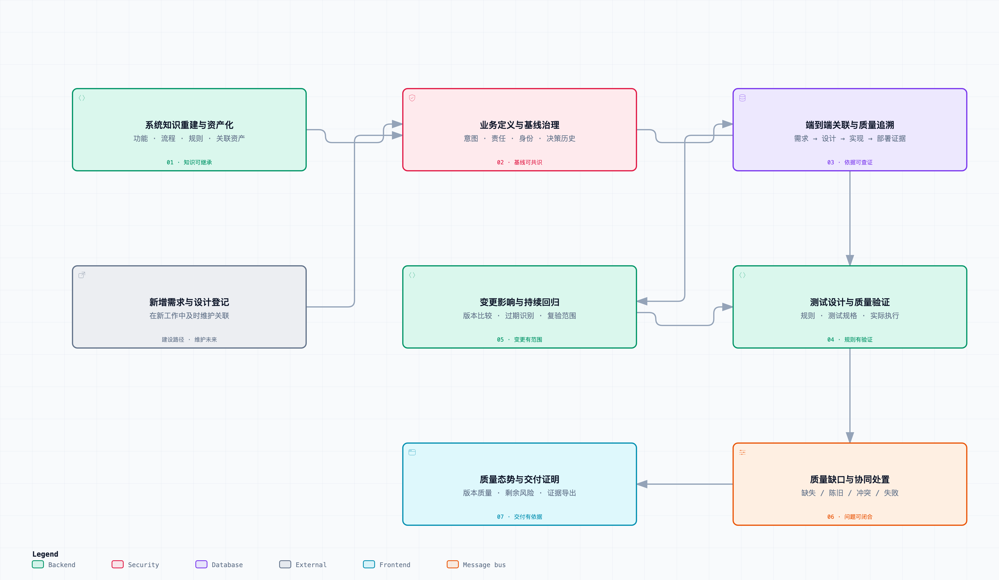
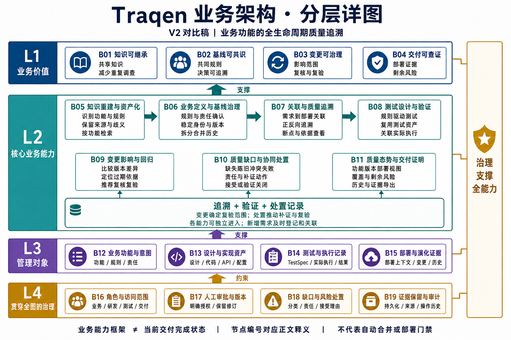
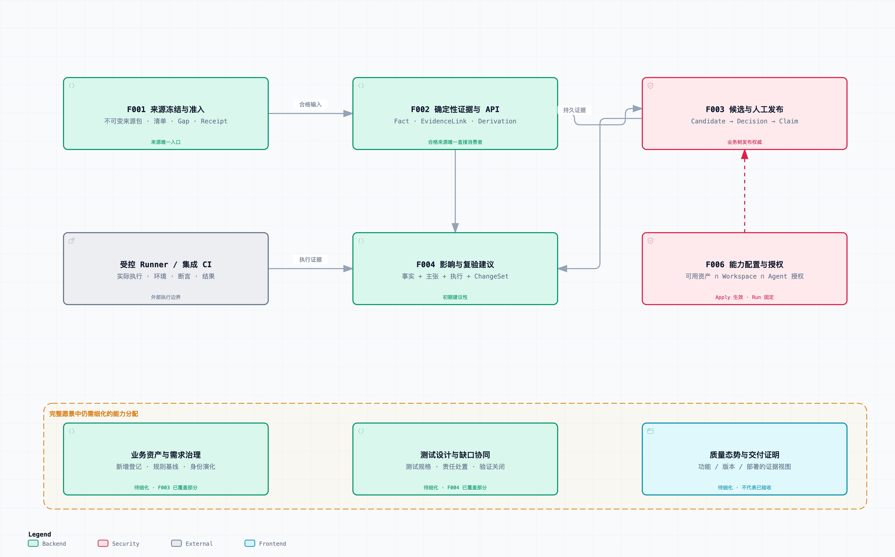
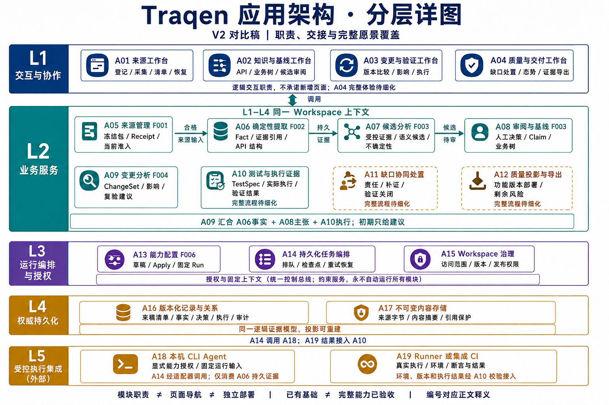
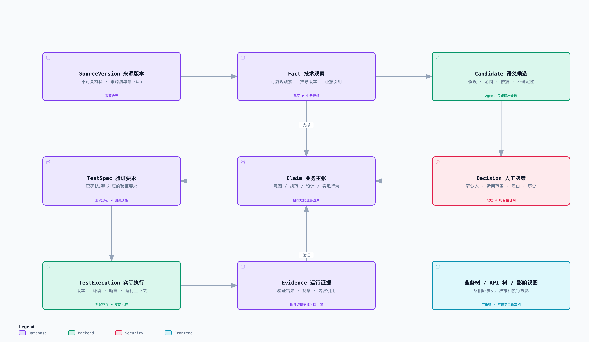
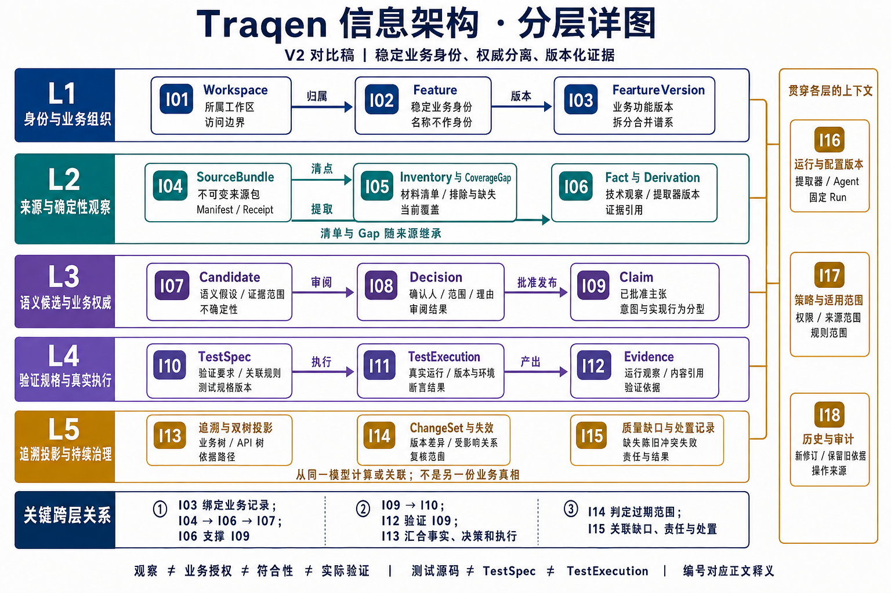
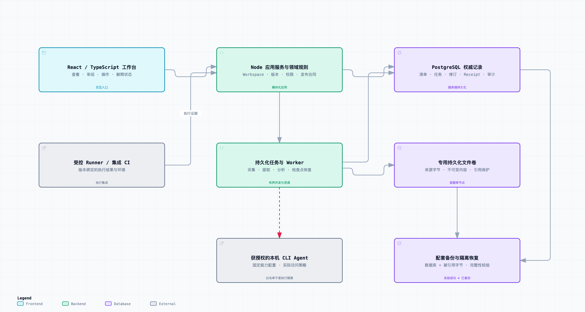
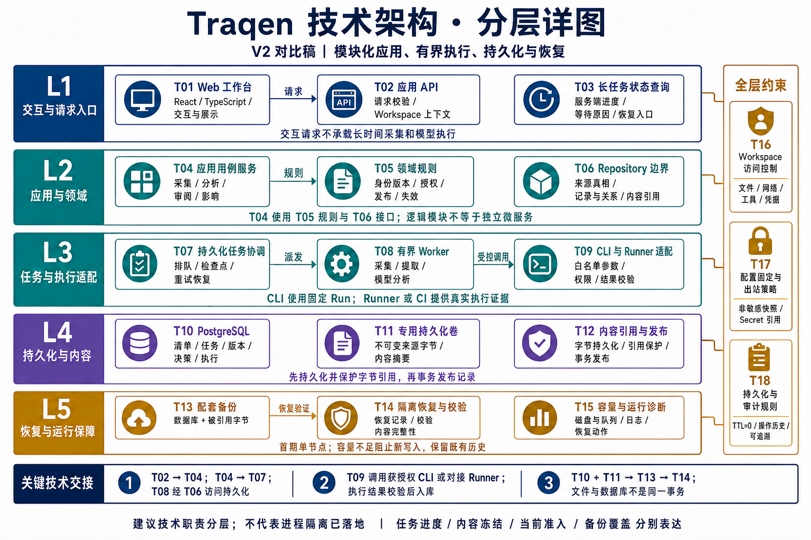

> Language: **English** · [简体中文](traqen-product-architecture.zh-CN.md)

---
feature_ids: [F001, F002, F003, F004, F006]
topics: [product-architecture, business-architecture, application-architecture, information-architecture, technical-architecture, traceability, change-impact]
doc_kind: product-architecture
created: 2026-07-29
updated: 2026-09-07
---

# Traqen Product Architecture

**Traqen treats business capabilities as core assets, linking intent, design, implementation, configuration, tests, and deployment evidence. It continuously manages their changes and quality gaps so software knowledge can be inherited, quality explained, and delivery verified.**

The architecture comprises **seven business capabilities, one Workspace governance boundary, one versioned evidence model, and a quality loop connecting knowledge, baselines, verification, change, and delivery.**

This document remains the entry point for ongoing architecture updates. The four original diagrams are generated with [tt-a1i/archify](https://github.com/tt-a1i/archify) and embedded in their respective sections. Each retains an interactive HTML, vector export, and editable JSON source. The shared figures use Chinese labels; this English text defines the same responsibilities. Interactive versions support focus, zoom, light/dark themes, and guided views. Diagrams are derived from this document. The business and information views reuse Archify color categories for capabilities and information objects; actual deployment is defined by the technical view.

**V1/V2 comparison:** Each original Archify diagram remains first, immediately followed by a new image-generation layered view and its numbered node glossary. V2 elaborates the existing architecture; it does not establish new permissions, deployments, Feature scope, or acceptance. Layer IDs L1–L5 are local to each view; B/A/I/T IDs identify the nodes explained below. The diagrams use shared Chinese labels, with matching English explanations.

| View | Core question | Reading entry |
| --- | --- | --- |
| Business | Which capabilities fulfill the vision, for whom, and with what value? | [Capabilities and value](#1-business-architecture-lifecycle-quality-traceability) |
| Application | Which modules produce, approve, and consume the required evidence? | [Responsibilities and coverage](#2-application-architecture-separate-evidence-responsibilities) |
| Information | How do business objects, facts, claims, and execution evidence remain connected and trustworthy? | [Versions and authority](#3-information-architecture-versioned-conclusions-and-evidence) |
| Technology | How are these capabilities run, persisted, constrained, and recovered? | [Deployment and tradeoffs](#4-technical-architecture-modular-application-and-bounded-execution) |

**Reading status:** The business view describes the full capability framework; the application view distinguishes current design coverage from areas requiring elaboration; the technical view is a recommended deployment shape. Design boundaries, implementation foundations, and validation needs remain distinct. Neither diagrams nor existing code prove acceptance.

## 1. Business architecture: lifecycle quality traceability

[Interactive view](../diagrams/traqen-product-architecture/product-overview.architecture.html) · [Vector image](../diagrams/traqen-product-architecture/product-overview.architecture.svg) · [Editable source](../diagrams/traqen-product-architecture/product-overview.architecture.json)

### V2 · Business layered view

**Layer relationships:** L2 reconstructs, confirms, links, and verifies assets in L3; L3 provides referenceable records. L2 supports L1 outcomes, while L4 constrains every capability. Broad arrows denote support or constraints, not execution order. B09 scopes B08 revalidation, B10 drives evidence collection and revalidation, and B11 aggregates traceability, verification, and disposition. New requirements can enter the baseline directly without legacy reconstruction.

| Layer | Responsibility | Nodes | Meaning |
| --- | --- | --- | --- |
| L1 | Business value | B01–B04 | Defines team outcomes; improvement still requires real-task validation. |
| L2 | Core capabilities | B05–B11 | Decomposes seven capabilities and their reconstruction, confirmation, traceability, verification, regression, resolution, and delivery collaboration. |
| L3 | Managed objects | B12–B15 | Defines the business assets, implementation materials, tests, and deployment records managed and linked by capabilities. |
| L4 | Crosscutting governance | B16–B19 | Defines who can act, how approval and risk acceptance work, and how evidence is retained and audited. |

**Node glossary — each ID is explained individually.**

| ID | Layer / node | Meaning, input/output, and boundary |
| --- | --- | --- |
| `B01` | L1 / Transferable knowledge | An outcome of reconstruction and discovery: teams can find rules, implementation, and provenance by capability. Reduced investigation requires observation in real handovers. |
| `B02` | L1 / Shared baselines | Business definition and human decisions establish agreed rules, scope, and responsibility. Agreement means authorized confirmation, not a model majority. |
| `B03` | L1 / Governable change | Impact rationale, coverage limits, and stale evidence inform investigation, review, and retesting. An empty impact list does not prove safety. |
| `B04` | L1 / Verifiable delivery | Connects a version or deployment to actual verification evidence and residual risk for acceptance. It does not automatically approve release. |
| `B05` | L2 / Knowledge reconstruction and assets | Identifies capabilities, processes, and rules in legacy materials, preserves provenance and uncertainty, and organizes discovery by business capability to produce reusable knowledge. |
| `B06` | L2 / Business definition and baselines | Turns new or reconstructed definitions into an authorized baseline of purpose, rules, and scope; maintains stable identity, versions, split/merge lineage, and decision history. |
| `B07` | L2 / Linking and quality traceability | Creates typed links across requirements, design, implementation, configuration, tests, and deployment evidence, supporting forward/backward navigation and explanations of broken links. |
| `B08` | L2 / Test design and verification | Maps confirmed rules to verification requirements, assists test design/reuse, and associates actual execution and assertion results. Test existence alone does not prove verification. |
| `B09` | L2 / Change impact and regression | Compares explicit versions of requirements, implementation, or configuration, identifies affected capabilities and stale support, and recommends review/revalidation while preserving unknowns. |
| `B10` | L2 / Gaps and collaborative resolution | Turns missing, stale, conflicting, or failed links into accountable actions. Evidence collection, correction, risk acceptance, and retesting retain rationale and results for justified closure. |
| `B11` | L2 / Quality reporting and delivery proof | Combines traceability, verification, and disposition records into capability/version/deployment views, history, and evidence exports without replacing distinct dimensions with an opaque score. |
| `B12` | L3 / Capabilities and intent | Governed capabilities, rules, scope, and responsibility form the business baseline: the core assets managed by B06 and linked by B07. |
| `B13` | L3 / Design and implementation assets | Designs, code, APIs, data, and configuration are referenceable, versioned assets with provenance. Existing implementation does not automatically define normative business intent. |
| `B14` | L3 / Tests and executions | Keeps verification specifications, test assets, actual execution contexts, and results distinct so a rule can be traced to concrete verification support. |
| `B15` | L3 / Deployment and evolution evidence | Deployment context, version changes, and historical support define the delivery target to which evidence applies and allow later evolution to be traced. |
| `B16` | L4 / Roles and access scope | Business, engineering, testing, and delivery roles operate within Workspace grants; a role label does not automatically grant publication or source access. |
| `B17` | L4 / Human approval and versioning | Business confirmation, relationship publication, and rule revisions retain authorization and versions; new decisions preserve prior history and do not silently alter existing runs. |
| `B18` | L4 / Gap and risk governance | Defines how gap categories, responsibility, and acceptance rationale are recorded. B10 performs resolution; this governance capability constrains its evidence and traceability. |
| `B19` | L4 / Evidence retention and audit | Preserves provenance, versions, producers, and operation history with durable retention by default; new versions do not automatically delete earlier evidence. |

The core objects are business capabilities and their supporting records. For example, order submission should connect its rules, design, implementation, configuration, test specifications, actual results, and version history. Arrows emphasize primary collaboration relationships; work can enter at different capabilities. Quality reporting combines traceability, verification, and disposition records; gap resolution returns to evidence collection, correction, and revalidation.

| Business capability | Required functions | Business value |
| --- | --- | --- |
| **Knowledge reconstruction and asset management** | Identify capabilities, processes, rules, interfaces, and related assets in legacy materials; retain provenance, ambiguity, and missing information; browse by capability | Preserve shared, transferable knowledge and reduce repeated investigation and handover losses. |
| **Business definition and baseline governance** | Confirm purpose, rules, scope, and responsibility; maintain stable identity, versions, splits/merges, and decision history | Establish a shared business/engineering baseline without confusing current implementation with normative requirements. |
| **End-to-end linking and quality traceability** | Connect requirements, design, code, APIs, data, configuration, tests, and deployment evidence; navigate both directions and locate breaks | Explain implementation and verification of each requirement and expose missing implementation, tests, or valid support. |
| **Test design and quality verification** | Assist test design from confirmed rules, reuse existing tests, and associate actual executions, assertions, environments, and results | Identify which requirements were verified and expose unverified rules, exceptions, and boundaries. |
| **Change impact and continuous regression** | Compare requirement, implementation, and configuration changes; identify affected capabilities and stale support; recommend review/revalidation; preserve evolution history | Bound investigation and verification, reduce omissions, and keep knowledge and evidence applicable. |
| **Quality gaps and collaborative resolution** | Distinguish missing, stale, conflicting, and failed links; assign responsibility and corrective actions; record acceptance rationale and outcomes | Make quality work accountable, trackable, and verifiably resolved. |
| **Quality reporting and delivery proof** | Show quality, coverage, and residual risks by capability, version, and deployment; support historical inspection and evidence export | Provide verifiable support for acceptance, delivery, retrospectives, and audits, and help prioritize quality work. |

**Two construction paths:** Legacy reconstruction fills historical gaps; timely registration and linking of new requirements and designs maintains future work. The latter belongs to the full capability framework; its detailed registration and integration contracts still need design. It does not introduce automatic source synchronization or an analysis path bypassing F001.

| Participant | Responsibility and use of value |
| --- | --- |
| Product and business owners | Confirm goals, rules, and acceptance criteria; maintain a shared business baseline. |
| Architects and developers | Maintain design/implementation relationships, understand systems, and handle change impact. |
| Test and quality personnel | Define verification scope, inspect actual execution evidence, and drive gap resolution. |
| Delivery, operations, and management | Inspect the quality evidence, residual risk, and history of a specific version or deployment. |

Workspace permissions, human approval, versioning, evidence retention, and audit span every capability. Existing requirements, development, and test systems are potential integration partners; Traqen continuously links business capabilities with quality evidence. Specific integration scope remains to be defined.

**Value validation:** Direct outputs are reusable capability knowledge, explicit trace relationships, actionable verification scope, and verifiable delivery evidence. Expected improvements in handover cost, communication rework, change omissions, and acceptance efficiency require real-team pilots. Graph node counts or test pass rates cannot substitute for those outcomes.

System handover, change assessment, and verification planning remain one typical journey. Business architecture defines the full capability set; F001–F004 and F006 are current delivery slices, mapped below. Initial analysis remains advisory and adds no automatic merge, CI, or deployment blocks.

## 2. Application architecture: separate evidence responsibilities

[Interactive view](../diagrams/traqen-product-architecture/application.architecture.html) · [Vector image](../diagrams/traqen-product-architecture/application.architecture.svg) · [Editable source](../diagrams/traqen-product-architecture/application.architecture.json)

### V2 · Application layered view

**Layer relationships:** L1 invokes L2 use cases; L3 provides authorization, pinned context, and orchestration; L4 persists authoritative outputs. A14 invokes A18 through adapters, and A10 validates A19 executions. F001→F002→F003 is a source/candidate handoff, not automatic pipeline execution. Logical layering does not require every call to traverse each adjacent layer or allow external CLIs to write persistence directly.

| Layer | Responsibility | Nodes | Meaning |
| --- | --- | --- | --- |
| L1 | Interaction and collaboration | A01–A04 | Groups interaction responsibilities by user task. A page can combine responsibilities; new navigation is not committed. |
| L2 | Business services | A05–A12 | Separates source, extraction, candidates, publication, impact, verification, resolution, and projections by outputs and handoffs. |
| L3 | Orchestration and authorization | A13–A15 | Provides pinned configuration, durable jobs, and Workspace permission context for use cases. |
| L4 | Authoritative persistence | A16–A17 | Retains recoverable records, relationships, and immutable content; projections are rebuilt from these records. |
| L5 | Controlled execution integrations | A18–A19 | Separates CLI semantic analysis from Runner/CI execution, with authorized calls and validated result ingestion. |

**Node glossary — each ID is explained individually.**

| ID | Layer / node | Meaning, input/output, and boundary |
| --- | --- | --- |
| `A01` | L1 / Source workbench | Interaction responsibilities for registration, capture progress, inventory, frozen history, and recovery. Uses A05; the browser does not own authoritative state. |
| `A02` | L1 / Knowledge and baseline workbench | Explores APIs, business trees, and evidence and supports candidate review and approval through A06–A08. Viewing and approving remain separate actions. |
| `A03` | L1 / Change and verification workbench | Selects comparison versions, inspects impact rationale and unknowns, and associates executions via A09/A10. Recommendations remain distinct from completed verification. |
| `A04` | L1 / Quality and delivery workbench | Logical interactions for gaps, resolution, version quality, and evidence export. The complete experience requires elaboration; separate new pages are not committed. |
| `A05` | L2 / Source management F001 | Owns capture, frozen bundles, receipts, and current admission, with SourceTruthRepository as authority. Supplies QualifiedSourceInput only to A06. |
| `A06` | L2 / Deterministic extraction F002 | Extracts facts, derivations, references, and API structure from qualified sources, persisting outputs and inherited gaps. Controlled document/configuration reading still needs contract detail. |
| `A07` | L2 / Candidate analysis F003 | Authorized Agents consume A06 persisted evidence to produce scoped semantic candidates with provenance and uncertainty. They cannot bypass source access or publish claims themselves. |
| `A08` | L2 / Review and baseline F003 | Accepts candidates for authorized human decisions and publication of claims and approved relationships into the business tree. Model agreement cannot replace human authority. |
| `A09` | L2 / Change analysis F004 | Combines ChangeSet, A06 facts, A08 claims, and A10 execution evidence to produce CONFIRMED/POSSIBLE/UNKNOWN findings and advisory revalidation guidance. |
| `A10` | L2 / Tests and execution evidence | Organizes TestSpec, existing test assets, and actual external executions, validating version, environment, and results. Existing models do not prove a complete design/verification workflow. |
| `A11` | L2 / Collaborative gap resolution | Links gaps, responsibility, corrective/evidence actions, and verified closure using existing gap/decision foundations. The full collaboration workflow requires elaboration. |
| `A12` | L2 / Quality projections and export | Projects capability/version/deployment evidence and residual risk from the shared model and provides exports. It owns no second editable truth; the full experience needs elaboration. |
| `A13` | L3 / Capability configuration F006 | Maintains global assets, Workspace drafts, applied versions, and explicit Agent grants. Each run pins its configuration; later edits never hot-switch it. |
| `A14` | L3 / Durable job orchestration | Queues lengthy tasks, checkpoints progress, and coordinates retries/recovery with pinned context and execution adapters. Source freezing does not automatically launch the whole pipeline. |
| `A15` | L3 / Workspace governance | Carries access scope, version context, and publication grants into use cases and rejects cross-Workspace or stale-context references. Legacy Project is only an alias. |
| `A16` | L4 / Versioned records and relationships | Authoritatively stores source inventories, facts, decisions, claims, executions, audit records, and relationships from which business/API/quality views are projected. |
| `A17` | L4 / Immutable content storage | Retains source bytes, digests, and referenced content with integrity checks. Byte durability and database publication are coordinated stages. |
| `A18` | L5 / Local CLI Agent | An authorized local CLI integration under F006 v1, invoked by A14 through adapters. Evidence access stays within A06 outputs; global availability does not expand grants. |
| `A19` | L5 / Runner or integrated CI | Performs real tests and supplies environment, assertions, and results for validation by A10. It is not model judgment and creates no implicit CI/deployment gate. |

| Module | Owned responsibilities and outputs | Handoff boundary |
| --- | --- | --- |
| F001 Workspace & Source Truth | Source registrations, capture tasks, immutable components/bundles, manifests, inventory, gaps, receipts, and current admission | `SourceTruthAdmission` supplies `QualifiedSourceInput` only to F002, never mutable paths, refs, upload sessions, or credentials. |
| F002 Deterministic Evidence & API Structure | `Fact`, `EvidenceLink`, `Derivation`, inherited/new gaps, and API tree | Supplies persisted, snapshot-bound evidence to F003/F004; does not turn guessed business names or ownership into facts. |
| F003 Agent Candidates & Business Tree | Bounded candidates, human review, approved claims, and business tree | Agents interpret evidence; authorized people decide publication. Model agreement and confidence are supporting information only. |
| F004 Change Impact Analysis | `ChangeSet`, actual execution context, impact classifications, and revalidation guidance | Combines F002/F003 and execution evidence; initially advisory only. |
| F006 Workspace Capability Settings | Global capability assets, Workspace drafts/active configurations, explicit Agent grants, and pinned run configurations | Global availability is not an Agent grant; configuration cannot expand source scope. v1 uses allowlisted local CLIs. |

F001 is the only entry point for analysis content, and F002 is the only direct consumer of qualified source bundles. F003/F004 inherit source provenance and gaps through F002 outputs; they cannot return to the original repository or upload directory to collect materials independently. The application diagram preserves this boundary.

**Handoff recommendation requiring elaboration:** F002 outputs should retain snapshot-bound evidence references and controlled reading of documentation, configuration, and other materials, rather than AST nodes alone. This preserves context for Agent investigation across materials while respecting admission and egress policy. The exact reading protocol, excerpt bounds, and authorization checks belong in F002/F003 design; this document does not claim that interface already exists.

Workspace is the canonical aggregate root. Legacy `Project.id` is a migration compatibility identity only. Modules share Workspace context and reject late responses from old contexts. Responsibilities do not map directly to navigation pages: F001's eight stations remain one source workbench, and this iteration does not redefine global navigation.

### 2.1 Full business capabilities and current delivery coverage

| Business capability | Main current design support | Scope still requiring elaboration or acceptance |
| --- | --- | --- |
| Knowledge reconstruction and assets | F001 sources, F002 facts/APIs, F003 candidates/publication | Complete knowledge reconstruction and use across materials. |
| Business definition and baselines | F003 human decisions/business tree; existing Feature/Claim identity and version models | Complete new-requirement registration, rule-baseline, and identity-evolution workflows. |
| End-to-end linking and traceability | F002/F003 relationships and support; F004 execution links | Complete intent-to-deployment coverage and explanation of breaks. |
| Test design and verification | Existing TestSpec/execution models; F004 revalidation support | Rule-based test design, reuse, and actual verification workflows. |
| Change impact and regression | F004 ChangeSet, impact classifications, and recommendations | Continuous review and revalidation across multiple kinds of change. |
| Gaps and collaborative resolution | Stage-specific gaps, decisions, and invalidation records | Responsibility, evidence collection, correction, risk acceptance, and verified closure workflows. |
| Quality reporting and delivery proof | Traceability, impact, and metric projections from the shared model | Acceptance, history, and evidence-export experiences by capability/version/deployment. |

“Main support” maps responsibilities and existing models; it does not claim a complete implemented capability. F006 provides crosscutting run capabilities and grant boundaries. The lower diagram row shows capability allocation requiring elaboration, not new Feature IDs, navigation structure, or committed delivery phases.

## 3. Information architecture: versioned conclusions and evidence

[Interactive view](../diagrams/traqen-product-architecture/information.architecture.html) · [Vector image](../diagrams/traqen-product-architecture/information.architecture.svg) · [Editable source](../diagrams/traqen-product-architecture/information.architecture.json)

### V2 · Information layered view

**Layer relationships:** I01 establishes ownership and I02/I03 business identity/version. I04 is observed by I06, interpreted by I07, and published as I09 only after I08 approval. I09 links to I10 requirements; I11 produces I12 evidence supporting verification. I13 projects records according to their publication authority, I14 identifies staleness, and I15 associates gaps with dispositions. I16–I18 retain context throughout. Arrows express association/evidence dependencies, not automatic downstream record creation.

| Layer | Responsibility | Nodes | Meaning |
| --- | --- | --- | --- |
| L1 | Identity and business organization | I01–I03 | Establishes ownership, stable business identity, and versions before associating content or conclusions. |
| L2 | Sources and deterministic observations | I04–I06 | Preserves material identity, inventory, coverage limits, and reproducible observations as the basis for interpretation. |
| L3 | Semantic candidates and business authority | I07–I09 | Human review and approval publish claims, keeping hypotheses separate from business confirmation. |
| L4 | Specifications and actual execution | I10–I12 | Distinguishes what should be verified, what actually ran, and what evidence remains. |
| L5 | Trace projections and ongoing governance | I13–I15 | Projects trees/traceability, identifies staleness through change, and associates gaps with dispositions. |
| Crosscutting | Context across layers | I16–I18 | Associates exact run versions, applicable policies, history, and audit with records in every layer. |

**Node glossary — each ID is explained individually.**

| ID | Layer / node | Meaning, input/output, and boundary |
| --- | --- | --- |
| `I01` | L1 / Workspace | Canonical ownership and access boundary for business records, sources, and runs; references, queries, and publication retain and validate this context. |
| `I02` | L1 / Feature | A stable governed business-capability identity, independent of name, path, taxonomy position, and engineering roadmap IDs such as F001. |
| `I03` | L1 / FeatureVersion | A capability revision and its associated baseline. Evolution records retain split/merge lineage without erasing earlier identities or history. |
| `I04` | L2 / SourceBundle | An immutable frozen source bundle linking components, manifest, inventory, gaps, and receipt. Issuance status and current admission are distinct. |
| `I05` | L2 / Inventory and CoverageGap | Inventory records materials and disposition; CoverageGap records missing, unsupported, or unobserved scope. Gaps propagate through dependencies and are not erased by downstream conclusions. |
| `I06` | L2 / Fact and Derivation | Facts are snapshot-bound deterministic observations; derivations and references identify extractor, inputs, rules, and locations. Reproducibility does not prove complete runtime coverage. |
| `I07` | L3 / Candidate | An Agent semantic hypothesis over persisted evidence, retaining provenance, scope, uncertainty, and review status without business-publication authority. |
| `I08` | L3 / Decision | An authorized human review decision with actor, scope, rationale, and outcome. Only approval/publication decisions publish claims; rejection remains historical evidence. |
| `I09` | L3 / Claim | A human-published assertion distinguishing normative requirements, design intent, observed implementation, and quality expectations, with authorization and implementation/verification support. |
| `I10` | L4 / TestSpec | Versioned verification requirements and test specifications for associated rules. Discovering test source does not automatically create an approved TestSpec. |
| `I11` | L4 / TestExecution | A real run with version, environment, assertions, and results, distinct from plans, specifications, and model-generated test recommendations. |
| `I12` | L4 / Evidence | Trustworthy observations and content references produced or associated by actual execution, supporting verification through execution context without granting business authority. |
| `I13` | L5 / Traceability and tree projections | The business tree uses approved claims/relations; the API tree uses deterministic observations; trace paths combine support. All are rebuildable without another editable truth. |
| `I14` | L5 / ChangeSet and invalidation | Records differences and dependency changes between explicit versions to identify impact, staleness, and review scope. Implementation invalidation does not delete business intent. |
| `I15` | L5 / Quality gaps and disposition | Associates coverage gaps, staleness, conflicts, and failures with affected objects, responsibility, acceptance, or correction/retesting results. Complete collaboration still needs elaboration. |
| `I16` | Crosscutting / Run and configuration versions | Retains exact extractor, Agent capability, and pinned run versions with nonsensitive configuration so observations and candidates remain explainable and replayable. |
| `I17` | Crosscutting / Policies and applicability | Defines permission, source, and rule scopes. Evidence with different scopes cannot be combined unconditionally or used to broaden access grants. |
| `I18` | Crosscutting / History and audit | Preserves producers, operations, decisions, and revisions. Corrections append records; earlier evidence and rejected candidates remain inspectable without appearing as currently approved truth. |

The diagram shows evidence and governance dependencies, not automatic creation of every downstream record on each analysis. `CoverageGap` can arise during capture, extraction, review, or execution and propagates along relevant dependencies. All records belong to one Workspace and retain exact versions, producers, policies, scopes, and history. Corrections create new derivations, decisions, or revisions.

### 3.1 Separate authority, conformance, and verification

| Dimension | Question answered | What it cannot replace |
| --- | --- | --- |
| Authority | Who confirmed the business claim, and within which scope? | Human approval cannot prove implementation conformance or passing tests. |
| Conformance | Does the current implementation satisfy the relevant business requirement? | Observed behavior cannot establish that the business should behave that way. |
| Verification | Which execution verified what, on which version and environment? | Passing tests cannot grant business authority or prove unobserved behavior. |
| Freshness, conflict, and coverage | Is evidence still applicable, contradictory, or incomplete? | A green state in one dimension cannot remove gaps in others. |

A `Fact` is a deterministic observation, a `Candidate` is a semantic hypothesis, and a `Claim` requires human publication. Claims distinguish current implementation behavior, normative business requirements, design intent, and quality expectations. Rejected, superseded, or stale candidates remain auditable without appearing as current business truth.

Discovering test source creates a test asset, not an approved TestSpec or actual TestExecution. Missing execution results appear as gaps. Trusted Evidence supports an associated Claim through TestExecution and verification results, preserving the business authorization chain.

### 3.2 Two trees, one evidence model

| Projection | Publication basis | Preserved boundary |
| --- | --- | --- |
| Business tree | Human-reviewed claims and approved relationships | API, code, documentation, configuration, and test links retain their types and provenance. |
| API tree | Deterministic endpoint, operation, handler, and contract observations | Unclassified endpoints are valid; do not invent business ownership for visual completeness. |
| Impact, trace chains, and metrics | Facts, decisions, and executions at the relevant versions | Projections are rebuildable and cannot own another editable business truth. |

Business `Feature.id` is a stable identity assigned through governance, not calculated from names, paths, or taxonomy positions. `FeatureVersion` carries changes. Stable Fact entity identity is separate from snapshot-specific fact identity. Engineering roadmap IDs such as F001 are not business Feature identities.

Code changes can require renewed implementation mapping, conformance checks, or verification while preserving business intent, human decisions, and historical evidence. Dependencies also need source, extractor, capability configuration, decision, and execution-context versions. Each Feature must validate the exact recomputation scope; renaming or reclassification must not imply disappearance of a business identity.

## 4. Technical architecture: modular application and bounded execution

[Interactive view](../diagrams/traqen-product-architecture/technology.architecture.html) · [Vector image](../diagrams/traqen-product-architecture/technology.architecture.svg) · [Editable source](../diagrams/traqen-product-architecture/technology.architecture.json)

### V2 · Technical layered view

**Layer relationships:** T02 invokes T04; use cases validate through T05 and access authoritative data via T06. T07 orchestrates lengthy work for T08; T09 adapts external execution and validates results without expanding source scope. T10/T11 retain records/bytes; T12 coordinates publication; T13 provides coordinated backups for T14 recovery validation. T16–T18 are constraints, not new independent services. Logical responsibilities do not imply implemented process or microservice separation.

| Layer | Responsibility | Nodes | Meaning |
| --- | --- | --- | --- |
| L1 | Interaction and request entry | T01–T03 | Handles interactive requests and server-side status queries, separating lengthy jobs from page lifetime. |
| L2 | Application and domain | T04–T06 | Application services coordinate use cases, domain rules enforce invariants, and repositories preserve authoritative access boundaries. |
| L3 | Jobs and execution adapters | T07–T09 | Separates durable coordination, bounded workers, and controlled adapters; module boundaries do not prove process isolation. |
| L4 | Persistence and content | T10–T12 | Separately retains database records and file bytes, coordinating reference protection and transactional publication. |
| L5 | Recovery and operation | T13–T15 | Uses coordinated backups, isolated recovery, and capacity diagnostics for recoverable retained content and truthful status. |
| Crosscutting | Constraints across layers | T16–T18 | Enforces access, egress, pinned runs, and default persistence throughout the architecture. |

**Node glossary — each ID is explained individually.**

| ID | Layer / node | Meaning, input/output, and boundary |
| --- | --- | --- |
| `T01` | L1 / Web workbench | React/TypeScript handles input, display, and feedback via the application API. Browser state is not the authoritative copy of jobs or business evidence. |
| `T02` | L1 / Application API | Validates identity, arguments, and Workspace context, invokes use cases, and returns results or job references without holding long-running work in an interactive request. |
| `T03` | L1 / Long-running job status | Reads server-side progress, waiting reasons, failure diagnostics, and recovery actions. Reloads recover durable records instead of relying on browser timers. |
| `T04` | L2 / Application use-case services | Coordinates capture, analysis, review, and impact use cases through domain rules, repositories, and job orchestration. |
| `T05` | L2 / Domain rules | Enforces identity, version, authorization, publication, and layered-invalidation invariants without promoting display state or Agent output to authority. |
| `T06` | L2 / Repository boundaries | Interfaces through which domain/application logic accesses authoritative data. SourceTruthRepository owns source truth; records, relationships, and content references retain their respective ownership. |
| `T07` | L3 / Durable job coordination | Queues lengthy work and persists attempts, checkpoints, and recovery state for bounded scheduling. Retries do not overwrite publication or delete failure history. |
| `T08` | L3 / Bounded workers | Performs capture, deterministic extraction, and model analysis under bounded concurrency, queues, and in-flight resources, persisting progress. Isolation and capacity require acceptance. |
| `T09` | L3 / CLI and Runner adapters | Builds allowlisted executable/argument calls, enforces file/network/tool/credential access, and validates Runner/CI results; accepts neither arbitrary shell strings nor direct model-API execution. |
| `T10` | L4 / PostgreSQL | Durably stores authoritative inventories, jobs, versions, receipts, facts, decisions, executions, and audits, including publication transactions. |
| `T11` | L4 / Dedicated persistent volume | Stores immutable source bytes and digests on the deployment host for replay independent of browsers or original sources. Source data does not belong in product code or design assets. |
| `T12` | L4 / Content references and publication | Makes bytes durable and protects references before atomically publishing components, bundles, and receipts in the database. This is not a cross-filesystem/database transaction. |
| `T13` | L5 / Coordinated backups | Backs up the database together with its referenced bytes and records covered versions. Successful freezing does not prove backup coverage. |
| `T14` | L5 / Isolated recovery and validation | Restores coordinated records/content in isolation and validates reference integrity, blocking on missing or corrupt bytes. Initial single-node failures may pause service. |
| `T15` | L5 / Capacity and run diagnostics | Observes disk, queues, job logs, and recovery actions. Insufficient capacity blocks new writes while retaining history; thresholds and capacity require measurement. |
| `T16` | Crosscutting / Workspace access controls | Enforces Workspace and user/Agent grants on files, networks, tools, and credentials. An executable allowlist alone does not prove isolation. |
| `T17` | Crosscutting / Pinned configuration and egress | Runs use immutable nonsensitive configuration and Secret references. Egress policies constrain source, prompts, outputs, and logs; paused jobs also retain pinned configuration. |
| `T18` | Crosscutting / Persistence and audit rules | Traceable user state defaults to TTL=0, retaining jobs, sources, decisions, executions, and operations. Transient sessions cannot implicitly decide retention or cleanup. |

**Recommended deployment shape:** Reuse domain rules, application services, PostgreSQL adapters, and CLI adapters in a modular application. Bounded Workers perform lengthy capture, extraction, and model analysis separately from interactive requests. The server persists jobs, checkpoints, and results. The diagram shows responsibilities and data relationships, not proof that every process-isolation boundary is implemented.

| Technical choice | Reason | Tradeoff and validation boundary |
| --- | --- | --- |
| Modular application with isolated lengthy execution | Reuse existing foundations and concentrate version, authorization, and publication contracts | Validate recovery, resource bounds, and isolation; module names do not automatically imply independent services. |
| PostgreSQL + dedicated persistent volume | Matches confirmed F001 storage: authoritative records in the database, source bytes in the volume | Files and database are not one transaction; persist bytes and protect references before transactional publication. |
| Unified evidence graph model | Share identities and relationships across business/API/impact views | The model does not mandate a dedicated graph database; measure actual path queries and incremental workloads before extending storage. |
| Allowlisted CLIs and pinned run configuration | Follow F006 v1 and preserve exact capability/grant provenance | An executable allowlist is not isolation; file, network, tool, and credential permissions still require validation. |
| Initial single node with coordinated recovery | Focus on one verifiable persistence, backup, and recovery chain | Outages may pause service; no claim of high availability, fixed throughput, or unmeasured recovery objectives. |

Source content follows approved access paths and is not automatically sent externally merely because a model is available. Runs retain nonsensitive configuration snapshots and Secret references. Raw source, prompts, outputs, logs, and exports are subject to Workspace access and egress policies. Active and paused jobs never hot-switch to later configurations.

### 4.1 Express four states separately

The latest F001 design B separates four questions; the overall product should preserve this distinction:

| State | Meaning |
| --- | --- |
| Task progress | Current step, whom it awaits, and how to resume. |
| Content freezing | Whether an immutable, queryable bundle and issuance record exist. |
| Current admission | Whether current permission, integrity, and gap-acceptance expiry permit new analysis. |
| Backup coverage | Which coordinated backup actually covers this version. |

Published receipts are only `READY` or `READY_WITH_ACCEPTED_GAPS`. `BLOCKED` belongs to diagnostics for an unsuccessful publication attempt, which issues no receipt. Expired acceptance does not rewrite an old receipt; current admission rejects new analysis. Renewed acceptance of the same content can append a new receipt. Successful freezing does not imply backup coverage.

Tasks, frozen history, and audit records persist by default (TTL=0). Insufficient capacity blocks new writes and provides recovery actions instead of automatically deleting history. Database and referenced bytes are backed up together, with reference integrity checked after isolated recovery. Retained content must remain usable when original sources cannot be fetched again.

## 5. Key difficulties and validation

| Difficulty | Architectural response | Required evidence |
| --- | --- | --- |
| Incomplete static relationships | Determinism guarantees reproducible observations only; dynamic calls, reflection, and configuration gaps propagate into impact findings | Unsupported behavior and missing-edge cases remain `UNKNOWN`, never unsupported no-impact conclusions. |
| Human review cost | Recommend grouping candidates by business capability and emphasizing evidence/version differences; confidence can aid ordering but never grant authority | Real tasks allow evidence inspection, candidate correction, and explicit publication; observe review burden in the pilot. |
| Trust across version changes | Preserve stable business identity and distinguish recomputation, re-review, and history retention through dependencies | Code, configuration, extractor, or environment changes invalidate the right scope without deleting business intent. |
| Persistence and recovery | Bounded streaming capture, checkpoints, reference protection, atomic publication, and coordinated recovery | Interruptions, retries, lost responses, full disks, and missing restored bytes never expose partial bundles or false availability. |
| Agent execution boundary | Pin inputs/capabilities and verify actual file/network/tool/credential permissions | Unauthorized materials and capabilities remain inaccessible; logs, outputs, and history do not leak secrets. |

Impact findings use `CONFIRMED`, `POSSIBLE`, or `UNKNOWN`, each with scope, paths, and limitations. `CONFIRMED` means evidence establishes a specific relationship or execution result; it does not mean a production failure has occurred. An empty impact list is not a pass without relevant coverage proof.

## 6. Delivery sequence and overall validation

Current delivery dependencies remain: F006 capability boundaries and F001 sources → F002 deterministic evidence/APIs → F003 human-reviewed business meaning → F004 execution evidence and impact guidance → controlled reference pilot. Completing F001 capture alone does not require an Agent or F002. Subsequent delivery scope for the full capability framework still needs division; this initial sequence does not narrow the vision.

Use an order-submission rule change as a multi-role pilot across key business-value stages:

| Pilot stage | Verifiable output |
| --- | --- |
| Knowledge and business baseline | The team locates an existing capability and its sources; product/business owners confirm rules, scope, and responsibility while distinguishing current behavior from requirements. |
| Linking and change | Developers compare explicit versions, trace affected APIs, implementations, and claims, and see impact rationale and unknown areas. |
| Tests and resolution | Test personnel identify rule-based verification scope and associate real execution; gaps have responsibility, actions, acceptance rationale, or evidence of verified closure. |
| Delivery and ongoing maintenance | Delivery personnel inspect the evidence chain and residual risk for a specific version/deployment; subsequent iterations preserve decisions and correctly expose stale support. |

An architect's change decision is one criterion. Overall validation must also establish transferable knowledge, shared business baselines, verifiable tests and gap resolution, and inspectable delivery evidence. Capabilities absent from the first pilot remain explicitly unvalidated rather than implying acceptance of the full vision.

Fact replay, distinct publication authority for both trees, recovery, and permission boundaries still require proof. Observe expected cost, rework, and efficiency improvements in real tasks without inventing benefit figures. These are validation goals, not a report of a passing pilot.

## 7. Design authority and implementation foundations

### 7.1 Active design sources

| Source | Scope |
| --- | --- |
| [Product vision](../../README.md) and [system requirements](traqen-system-requirements.md) | The vision defines complete intent-to-deployment traceability for high-value business capabilities. System requirements describe the current delivery focus and R1–R9, not the entire capability framework. |
| [Current F001 Chinese design B](../../feature-discussions/2026-08-30-F001-workspace-source-truth-design/README.zh-CN.md) | Current authority for F001 behavior and acceptance; takes precedence over unsynchronized older specs, English documents, and ADR summaries. |
| [F002](../features/F002-feature-api-traceability.md), [F003](../features/F003-traceability-graph.md), [F004](../features/F004-change-impact-analysis.md) | Deterministic facts, human publication, execution, and impact contracts. |
| [F006](../features/F006-workspace-capability-settings.md) and [capability-resolution map](../diagrams/traqen-product-architecture/workspace-capability-resolution.dataflow.html) | CLI assets, explicit grants, and separate Apply/Run pinning boundaries. |
| [ADR-0001](../decisions/ADR-0001-canonical-traceability-ontology.md) | Canonical ontology, stable identity, and distinct authority levels. |
| [ADR-0002](../decisions/ADR-0002-workspace-aggregate-and-execution-isolation.md) | Workspace aggregation and execution isolation; use its later F006 amendment. |
| [ADR-0003](../decisions/ADR-0003-source-truth-boundary.md) | Decision background for source boundaries; current F001 details follow design B. |

This document owns overall relationships, rationale, and tradeoffs. Detailed Feature contracts remain in their respective documents. Later substantive changes require confirmation of the complete proposal and authorized updates to affected designs; changing the overview alone cannot silently change downstream permissions, data, or product boundaries.

### 7.2 Implementation foundations inspected in this discussion

| Existing foundation | Code entry points | What its existence does not prove |
| --- | --- | --- |
| Domain model and layered invalidation | [Model](../../src/domain/model.js), [invalidation](../../src/domain/invalidation.js) | All new contracts are correctly consumed by current workflows. |
| Application and PostgreSQL storage | [Application](../../src/application/traceability-application.js), [production entry](../../src/api/production-server.js) | The complete F001 source-bundle lifecycle and coordinated recovery have passed acceptance. |
| Analysis jobs and checkpoints | [Job runner](../../src/application/workspace-analysis-job-runner.js), [Worker](../../src/application/workspace-analysis-worker.js) | New capture workflows have passed resource, concurrency, and failure validation. |
| Analysis models and CLI adapters | [Model adapters](../../src/analysis/model-adapters.js) | Every legacy execution path satisfies the latest F006 grant contract. |
| Graphs, changes, and execution evidence | [Graph projection](../../src/domain/feature-graph.js), [impact model](../../src/domain/change-impact.js), [execution evidence](../../src/domain/execution-evidence.js) | The complete F001–F004 reference pilot has passed. |

The inspected baseline was `b8aba2434e571fd4ac041c12234ff33f271eddbb` plus existing local work. This iteration changes architecture documents and derived diagrams only. Source inspection does not replace runtime acceptance or promote legacy scanner outputs, Agent conversations, or browser state into authority.

## 8. Iteration history

| Date | Change | Authority |
| --- | --- | --- |
| 2026-09-06 | Record business, application, information, and technology views; add tradeoffs, difficulties, pilot criteria, and implementation limits; align the F002 evidence path and design B receipt semantics. | Architecture discussion thread `thread_mtqkycp918zlran6`; co-creator message `0001788746520984-000176-ec4774ba` authorized recording the discussion directly in the product architecture and iterating through this document. |
| 2026-09-06 | Revise positioning, seven business capabilities, value/roles, delivery coverage, and overall validation against the full vision; render and embed all four views with Archify. | Co-creator correction `0001788749140743-000200-f7d41a90`; complete revised proposal `0001788749143009-000202-d0baa266`; message `0001788751611709-000210-8aaf4a92` explicitly requested tt-a1i/archify diagrams directly in the overall architecture document. |
| 2026-09-07 | Preserve V1; add four image-generation layered comparison views, layer responsibilities, explicit cross-layer handoffs, and 74 numbered node definitions. | Co-creator message `0001788767680385-000243-77af4f52` requests image-generation, preservation of prior figures, and clearer layers and individual node meanings. |

The V1 diagrams use the installed Archify v2.12, type `architecture`, `classic` preset, and no animation. Static images are native exports of the interactive artifacts. The [delivery record](../diagrams/traqen-product-architecture/architecture-delivery.json) retains specification/HTML SHA-256 values, nine automated checks, visual-review status, and static-export digests. After editing a source, regenerate and validate its HTML and static images together.

V2 uses native image-generation and retains its prompts and [generation/verification record](../diagrams/traqen-product-architecture/imagegen-v2/generation-record.json). Its checks cover node labels, layer placement, relationships, legibility, and preserved V1 bytes. V1’s Archify 9/9 checks do not apply to V2 raster images. The earlier omission was treating a component overview as sufficient layering; this iteration adds layer purpose, node decomposition, and explicit handoffs across all four views.

Continue updating this document and its derived diagrams, preserving changes and their authority in the history. New elaboration items must identify affected contracts and validation methods. Approved design, recommendations, and implementation acceptance remain separate statuses.
