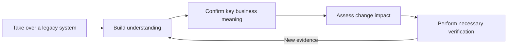
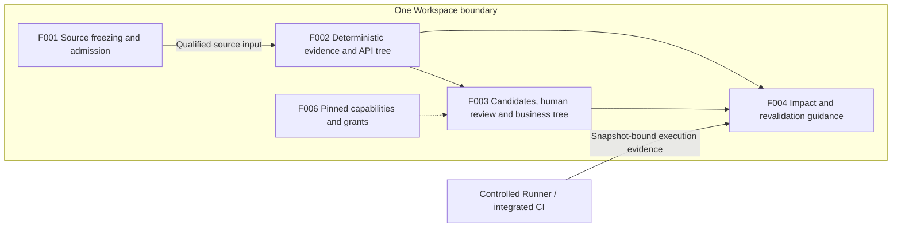
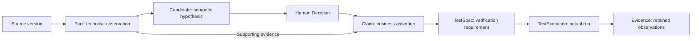
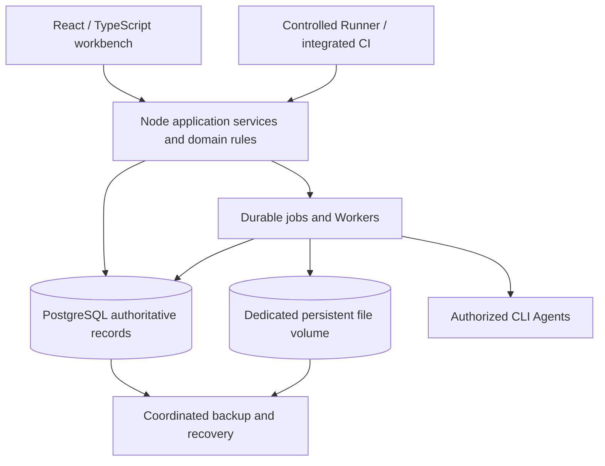

> Language: **English** · [简体中文](traqen-product-architecture.zh-CN.md)

---
feature_ids: [F001, F002, F003, F004, F006]
topics: [product-architecture, business-architecture, application-architecture, information-architecture, technical-architecture, traceability, change-impact]
doc_kind: product-architecture
created: 2026-07-29
updated: 2026-09-06
---

# Traqen Product Architecture

**Traqen turns understanding of a legacy system into traceable, maintainable evidence so architects can decide how to make the next change and what to verify.**

The architecture has **one Workspace boundary, one versioned evidence model, business and API projections, and an understanding–change–verification loop.**

[Open the interactive four-view architecture map (Chinese)](../diagrams/traqen-product-architecture/product-overview.architecture.html) · [Diagram source](../diagrams/traqen-product-architecture/product-overview.architecture.json)

The interactive map offers business, application, information, and technology views, with focus, zoom, and light/dark themes. Its groupings compress information; the sections below define detailed responsibilities and handoffs. This document is the stable entry point for subsequent overall architecture iterations. The map is a derived presentation, not a second product contract.

**Reading status:** The co-creator authorized recording this architecture discussion. Existing design boundaries, implementation foundations, and recommendations requiring elaboration or validation are distinguished below. Neither a diagram nor existing code proves feature acceptance.

## 1. Business architecture: support the architect's decisions

| User decision | Evidence provided by Traqen | Business value |
| --- | --- | --- |
| What capabilities exist and how are they implemented? | Business tree, API tree, and evidence paths | Reduce repeated investigation during handover. |
| What could this change affect? | Relationships to business/API nodes, reasons, and coverage gaps | Identify investigation and review scope. |
| What additional verification is needed? | Test specifications, actual executions, stale and missing evidence | Turn understanding into concrete action. |

Long-term quality traceability builds on this loop: connect confirmed intent for governed, high-value business Features to implementation and actual deployment execution evidence, exposing missing, stale, conflicting, or failed links. F001–F004 currently deliver this through legacy-system understanding and advisory change analysis; they do not imply new automatic merge, CI, or deployment blocks.

A typical journey is: register materials and access policy → inspect frozen sources and inventory → explore technical facts/APIs → review Agent candidates → publish business claims → compare two versions → obtain revalidation guidance and associate new execution evidence. After source freezing, the user separately chooses downstream analysis; the stages are not automatically launched as one chain.

## 2. Application architecture: separate evidence responsibilities

| Module | Owned responsibilities and outputs | Handoff boundary |
| --- | --- | --- |
| F001 Workspace & Source Truth | Source registrations, capture tasks, immutable components/bundles, manifests, inventory, gaps, receipts, and current admission | `SourceTruthAdmission` supplies `QualifiedSourceInput` only to F002, never mutable paths, refs, upload sessions, or credentials. |
| F002 Deterministic Evidence & API Structure | `Fact`, `EvidenceLink`, `Derivation`, inherited/new gaps, and API tree | Supplies persisted, snapshot-bound evidence to F003/F004; does not turn guessed business names or ownership into facts. |
| F003 Agent Candidates & Business Tree | Bounded candidates, human review, approved claims, and business tree | Agents interpret evidence; authorized people decide publication. Model agreement and confidence are supporting information only. |
| F004 Change Impact Analysis | `ChangeSet`, actual execution context, impact classifications, and revalidation guidance | Combines F002/F003 and execution evidence; initially advisory only. |
| F006 Workspace Capability Settings | Global capability assets, Workspace drafts/active configurations, explicit Agent grants, and pinned run configurations | Global availability is not an Agent grant; configuration cannot expand source scope. v1 uses allowlisted local CLIs. |

F001 is the only entry point for analysis content, and F002 is the only direct consumer of qualified source bundles. F003/F004 inherit source provenance and gaps through F002 outputs; they cannot return to the original repository or upload directory to collect materials independently. This replaces the old overview's inventory-to-F003 bypass.

**Handoff recommendation requiring elaboration:** F002 outputs should retain snapshot-bound evidence references and controlled reading of documentation, configuration, and other materials, rather than AST nodes alone. This preserves context for Agent investigation across materials while respecting admission and egress policy. The exact reading protocol, excerpt bounds, and authorization checks belong in F002/F003 design; this document does not claim that interface already exists.

Workspace is the canonical aggregate root. Legacy `Project.id` is a migration compatibility identity only. Modules share Workspace context and reject late responses from old contexts. Responsibilities do not map directly to navigation pages: F001's eight stations remain one source workbench, and this iteration does not redefine global navigation.

## 3. Information architecture: versioned conclusions and evidence

The diagram shows evidence and governance dependencies, not automatic creation of every downstream record on each analysis. `CoverageGap` can arise during capture, extraction, review, or execution and propagates along relevant dependencies. All records belong to one Workspace and retain exact versions, producers, policies, scopes, and history. Corrections create new derivations, decisions, or revisions.

### 3.1 Separate authority, conformance, and verification

| Dimension | Question answered | What it cannot replace |
| --- | --- | --- |
| Authority | Who confirmed the business claim, and within which scope? | Human approval cannot prove implementation conformance or passing tests. |
| Conformance | Does the current implementation satisfy the relevant business requirement? | Observed behavior cannot establish that the business should behave that way. |
| Verification | Which execution verified what, on which version and environment? | Passing tests cannot grant business authority or prove unobserved behavior. |
| Freshness, conflict, and coverage | Is evidence still applicable, contradictory, or incomplete? | A green state in one dimension cannot remove gaps in others. |

A `Fact` is a deterministic observation, a `Candidate` is a semantic hypothesis, and a `Claim` requires human publication. Claims distinguish current implementation behavior, normative business requirements, design intent, and quality expectations. Rejected, superseded, or stale candidates remain auditable without appearing as current business truth.

Discovering test source creates a test asset, not an approved TestSpec or actual TestExecution. Missing execution results appear as gaps. Trusted Evidence supports an associated Claim through TestExecution and verification results, preserving the business authorization chain.

### 3.2 Two trees, one evidence model

| Projection | Publication basis | Preserved boundary |
| --- | --- | --- |
| Business tree | Human-reviewed claims and approved relationships | API, code, documentation, configuration, and test links retain their types and provenance. |
| API tree | Deterministic endpoint, operation, handler, and contract observations | Unclassified endpoints are valid; do not invent business ownership for visual completeness. |
| Impact, trace chains, and metrics | Facts, decisions, and executions at the relevant versions | Projections are rebuildable and cannot own another editable business truth. |

Business `Feature.id` is a stable identity assigned through governance, not calculated from names, paths, or taxonomy positions. `FeatureVersion` carries changes. Stable Fact entity identity is separate from snapshot-specific fact identity. Engineering roadmap IDs such as F001 are not business Feature identities.

Code changes can require renewed implementation mapping, conformance checks, or verification while preserving business intent, human decisions, and historical evidence. Dependencies also need source, extractor, capability configuration, decision, and execution-context versions. Each Feature must validate the exact recomputation scope; renaming or reclassification must not imply disappearance of a business identity.

## 4. Technical architecture: modular application and bounded execution

**Recommended deployment shape:** Reuse domain rules, application services, PostgreSQL adapters, and CLI adapters in a modular application. Bounded Workers perform lengthy capture, extraction, and model analysis separately from interactive requests. The server persists jobs, checkpoints, and results. The diagram shows responsibilities and data relationships, not proof that every process-isolation boundary is implemented.

| Technical choice | Reason | Tradeoff and validation boundary |
| --- | --- | --- |
| Modular application with isolated lengthy execution | Reuse existing foundations and concentrate version, authorization, and publication contracts | Validate recovery, resource bounds, and isolation; module names do not automatically imply independent services. |
| PostgreSQL + dedicated persistent volume | Matches confirmed F001 storage: authoritative records in the database, source bytes in the volume | Files and database are not one transaction; persist bytes and protect references before transactional publication. |
| Unified evidence graph model | Share identities and relationships across business/API/impact views | The model does not mandate a dedicated graph database; measure actual path queries and incremental workloads before extending storage. |
| Allowlisted CLIs and pinned run configuration | Follow F006 v1 and preserve exact capability/grant provenance | An executable allowlist is not isolation; file, network, tool, and credential permissions still require validation. |
| Initial single node with coordinated recovery | Focus on one verifiable persistence, backup, and recovery chain | Outages may pause service; no claim of high availability, fixed throughput, or unmeasured recovery objectives. |

Source content follows approved access paths and is not automatically sent externally merely because a model is available. Runs retain nonsensitive configuration snapshots and Secret references. Raw source, prompts, outputs, logs, and exports are subject to Workspace access and egress policies. Active and paused jobs never hot-switch to later configurations.

### 4.1 Express four states separately

The latest F001 design B separates four questions; the overall product should preserve this distinction:

| State | Meaning |
| --- | --- |
| Task progress | Current step, whom it awaits, and how to resume. |
| Content freezing | Whether an immutable, queryable bundle and issuance record exist. |
| Current admission | Whether current permission, integrity, and gap-acceptance expiry permit new analysis. |
| Backup coverage | Which coordinated backup actually covers this version. |

Published receipts are only `READY` or `READY_WITH_ACCEPTED_GAPS`. `BLOCKED` belongs to diagnostics for an unsuccessful publication attempt, which issues no receipt. Expired acceptance does not rewrite an old receipt; current admission rejects new analysis. Renewed acceptance of the same content can append a new receipt. Successful freezing does not imply backup coverage.

Tasks, frozen history, and audit records persist by default (TTL=0). Insufficient capacity blocks new writes and provides recovery actions instead of automatically deleting history. Database and referenced bytes are backed up together, with reference integrity checked after isolated recovery. Retained content must remain usable when original sources cannot be fetched again.

## 5. Key difficulties and validation

| Difficulty | Architectural response | Required evidence |
| --- | --- | --- |
| Incomplete static relationships | Determinism guarantees reproducible observations only; dynamic calls, reflection, and configuration gaps propagate into impact findings | Unsupported behavior and missing-edge cases remain `UNKNOWN`, never unsupported no-impact conclusions. |
| Human review cost | Recommend grouping candidates by business capability and emphasizing evidence/version differences; confidence can aid ordering but never grant authority | Real tasks allow evidence inspection, candidate correction, and explicit publication; observe review burden in the pilot. |
| Trust across version changes | Preserve stable business identity and distinguish recomputation, re-review, and history retention through dependencies | Code, configuration, extractor, or environment changes invalidate the right scope without deleting business intent. |
| Persistence and recovery | Bounded streaming capture, checkpoints, reference protection, atomic publication, and coordinated recovery | Interruptions, retries, lost responses, full disks, and missing restored bytes never expose partial bundles or false availability. |
| Agent execution boundary | Pin inputs/capabilities and verify actual file/network/tool/credential permissions | Unauthorized materials and capabilities remain inaccessible; logs, outputs, and history do not leak secrets. |

Impact findings use `CONFIRMED`, `POSSIBLE`, or `UNKNOWN`, each with scope, paths, and limitations. `CONFIRMED` means evidence establishes a specific relationship or execution result; it does not mean a production failure has occurred. An empty impact list is not a pass without relevant coverage proof.

## 6. Delivery sequence and first architecture test

The dependency sequence remains: F006 capability boundaries and F001 sources → F002 deterministic evidence/APIs → F003 human-reviewed business meaning → F004 execution evidence and impact guidance → controlled reference pilot. Completing F001 capture alone does not require running an Agent or F002.

Test the chain against a real business change, such as modifying an order-submission rule:

1. Explicitly select before/after source versions and retain complete inventories and gaps.
2. Identify affected APIs with traceable source evidence.
3. Show associated confirmed business claims, distinguishing implementation changes from requirement changes.
4. List recommended test reruns, existing execution contexts, and unresolved areas.
5. Associate new execution evidence, checking updated conclusions and access to earlier supporting records.

The question is whether an architect can use this evidence to make a justified change decision. The pilot must also prove fact replay, distinct publication authority for both trees, recovery, and permission boundaries. These are validation goals, not a report of a passing pilot. Demo fallbacks and automatic enforcement gates must not conceal missing evidence.

## 7. Design authority and implementation foundations

### 7.1 Active design sources

| Source | Scope |
| --- | --- |
| [System requirements](traqen-system-requirements.md) | Mission, R1–R9, and the initial advisory boundary. |
| [Current F001 Chinese design B](../../feature-discussions/2026-08-30-F001-workspace-source-truth-design/README.zh-CN.md) | Current authority for F001 behavior and acceptance; takes precedence over unsynchronized older specs, English documents, and ADR summaries. |
| [F002](../features/F002-feature-api-traceability.md), [F003](../features/F003-traceability-graph.md), [F004](../features/F004-change-impact-analysis.md) | Deterministic facts, human publication, execution, and impact contracts. |
| [F006](../features/F006-workspace-capability-settings.md) and [capability-resolution map](../diagrams/traqen-product-architecture/workspace-capability-resolution.dataflow.html) | CLI assets, explicit grants, and separate Apply/Run pinning boundaries. |
| [ADR-0001](../decisions/ADR-0001-canonical-traceability-ontology.md) | Canonical ontology, stable identity, and distinct authority levels. |
| [ADR-0002](../decisions/ADR-0002-workspace-aggregate-and-execution-isolation.md) | Workspace aggregation and execution isolation; use its later F006 amendment. |
| [ADR-0003](../decisions/ADR-0003-source-truth-boundary.md) | Decision background for source boundaries; current F001 details follow design B. |

This document owns overall relationships, rationale, and tradeoffs. Detailed Feature contracts remain in their respective documents. Later substantive changes require confirmation of the complete proposal and authorized updates to affected designs; changing the overview alone cannot silently change downstream permissions, data, or product boundaries.

### 7.2 Implementation foundations inspected in this discussion

| Existing foundation | Code entry points | What its existence does not prove |
| --- | --- | --- |
| Domain model and layered invalidation | [Model](../../src/domain/model.js), [invalidation](../../src/domain/invalidation.js) | All new contracts are correctly consumed by current workflows. |
| Application and PostgreSQL storage | [Application](../../src/application/traceability-application.js), [production entry](../../src/api/production-server.js) | The complete F001 source-bundle lifecycle and coordinated recovery have passed acceptance. |
| Analysis jobs and checkpoints | [Job runner](../../src/application/workspace-analysis-job-runner.js), [Worker](../../src/application/workspace-analysis-worker.js) | New capture workflows have passed resource, concurrency, and failure validation. |
| Analysis models and CLI adapters | [Model adapters](../../src/analysis/model-adapters.js) | Every legacy execution path satisfies the latest F006 grant contract. |
| Graphs, changes, and execution evidence | [Graph projection](../../src/domain/feature-graph.js), [impact model](../../src/domain/change-impact.js), [execution evidence](../../src/domain/execution-evidence.js) | The complete F001–F004 reference pilot has passed. |

The inspected baseline was `b8aba2434e571fd4ac041c12234ff33f271eddbb` plus existing local work. This iteration changes architecture documents and the derived map only. Source inspection does not replace runtime acceptance or promote legacy scanner outputs, Agent conversations, or browser state into authority.

## 8. Iteration history

| Date | Change | Authority |
| --- | --- | --- |
| 2026-09-06 | Record business, application, information, and technology views; add tradeoffs, difficulties, pilot criteria, and implementation limits; align the F002 evidence path and design B receipt semantics. | Architecture discussion thread `thread_mtqkycp918zlran6`; co-creator message `0001788746520984-000176-ec4774ba` authorized recording the discussion directly in the product architecture and iterating through this document. |

Continue updating this document and its derived map, preserving changes and their authority in the history. New elaboration items must identify affected contracts and validation methods. Approved design, recommendations, and implementation acceptance remain separate statuses.
