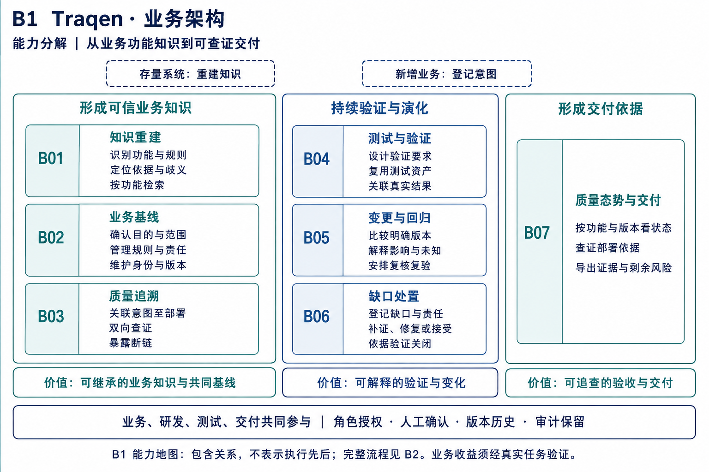
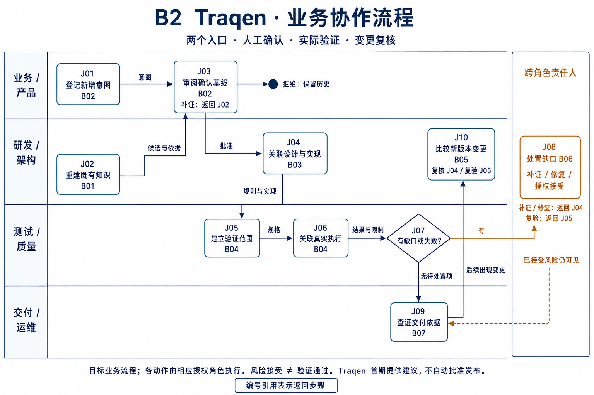
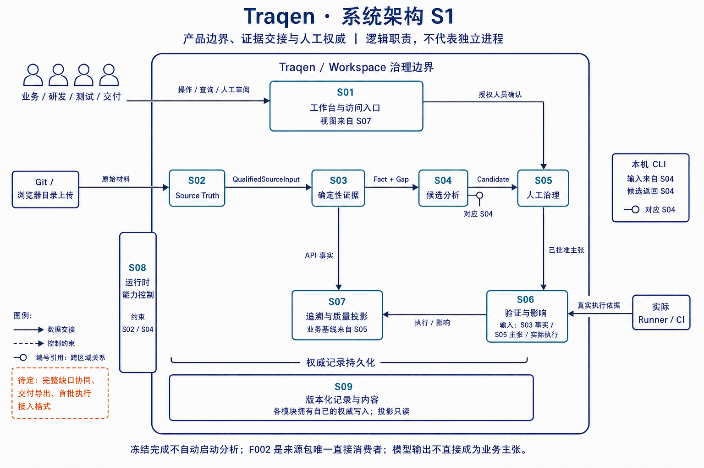
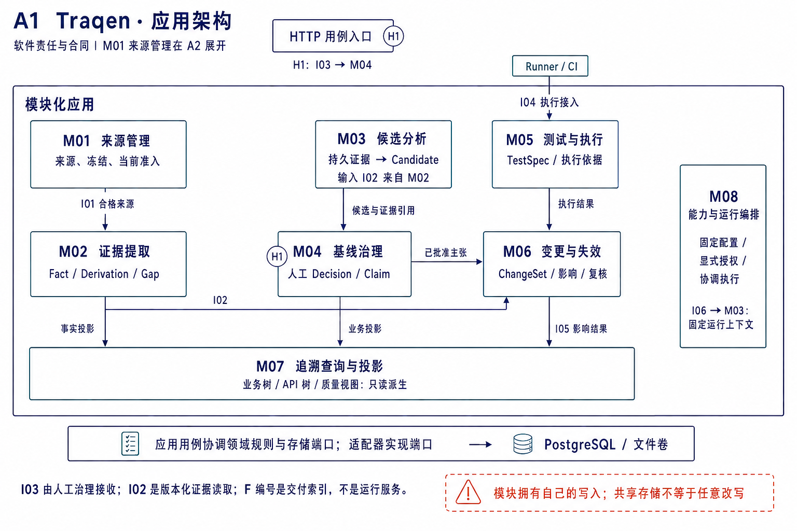
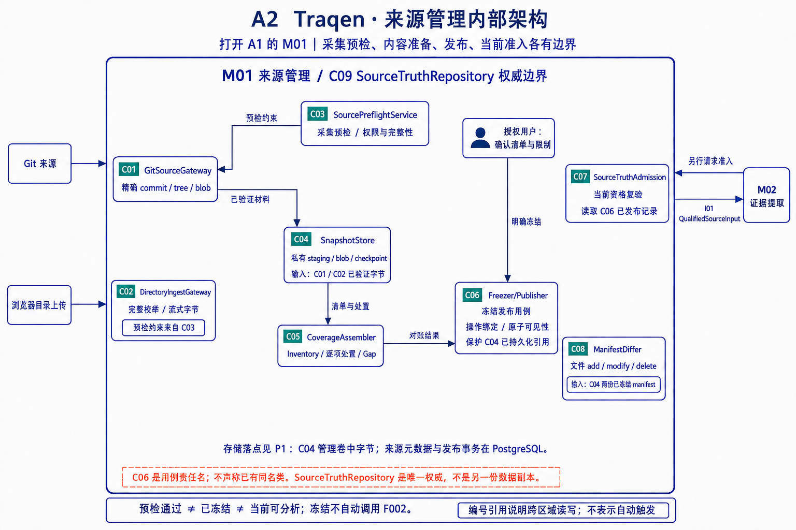
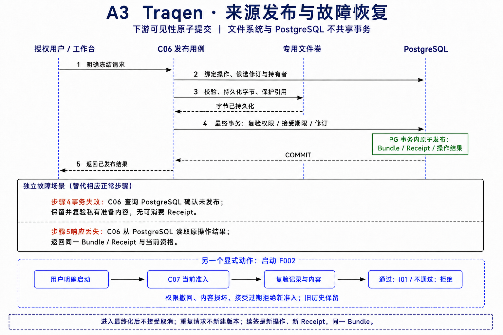
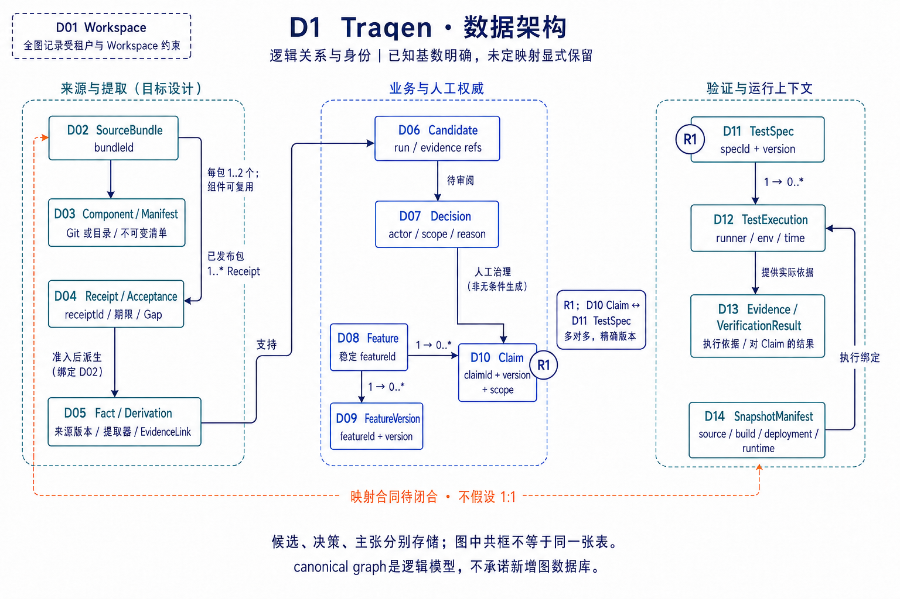
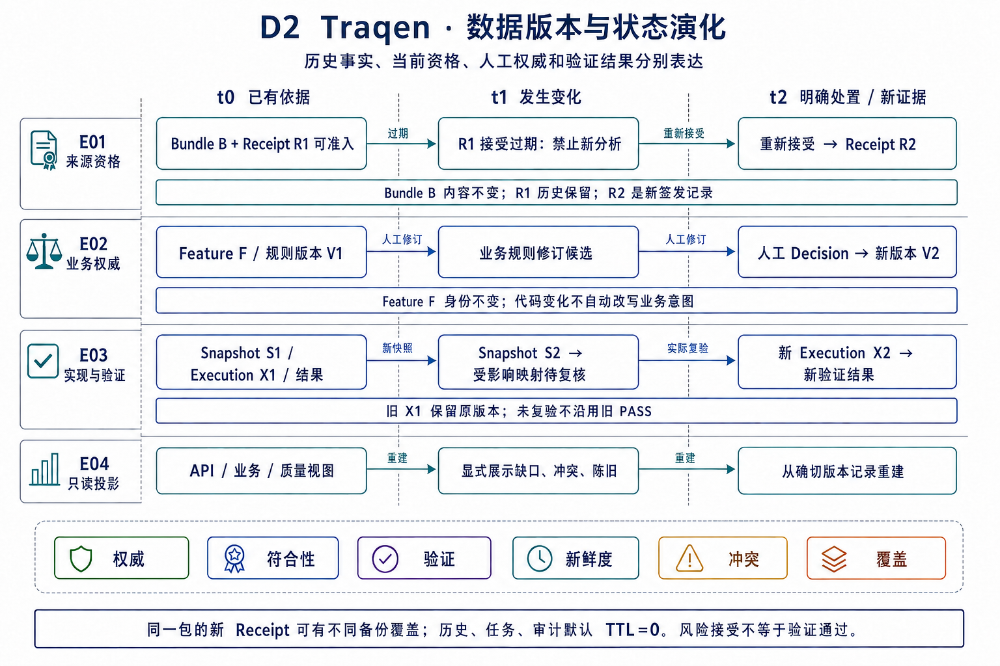
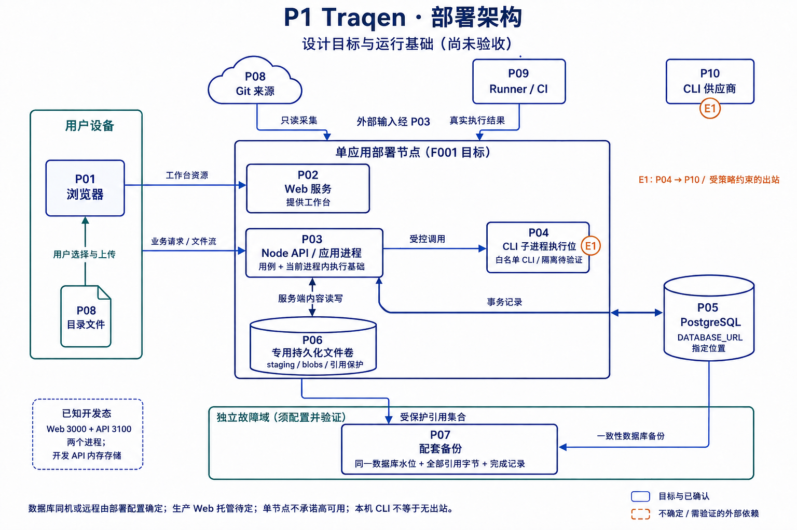

> 语言：**简体中文** · [English](traqen-product-architecture.md)

---
feature_ids: [F001, F002, F003, F004, F006]
topics: [product-architecture, business-architecture, application-architecture, information-architecture, technical-architecture, traceability, change-impact]
doc_kind: product-architecture
created: 2026-07-29
updated: 2026-09-07
---

# Traqen 产品架构

**Traqen 以业务功能为核心资产，关联业务意图、设计、实现、配置、测试和部署证据，持续管理它们的变化与质量缺口，让软件知识可以继承、质量可以解释、交付可以查证。**

架构提炼为：**七组业务能力，一个 Workspace 治理边界，一份版本化证据模型，以及连接知识、基线、验证、变更与交付的质量闭环。**

本文是整体架构持续迭代的固定入口。

**当前阅读入口：** [V3 · 业务、系统、应用、数据、部署五视图](#architecture-v3)，共九张 image-generation 图及逐节点、接口与运行机制说明。§1–§8 原图及文字完整保留供对照，最新解释以 §9 为准。原版四张图采用 [tt-a1i/archify](https://github.com/tt-a1i/archify) 生成并直接嵌入对应章节；每张图均保留交互版、矢量图和 JSON 图源。交互版支持聚焦、缩放、明暗主题与分组阅读；图是正文的派生表达。业务与信息图中的配色图例沿用 Archify 分类，节点分别表示业务能力和信息对象；实际技术部署以技术图为准。

**V1/V2 对比阅读：** 各节保留原版 Archify 图，并紧接着新增 image-generation 分层图及编号释义。V2 展开已有架构中的职责、对象、子功能和交接，不新增权限、部署、Feature 范围或验收结论。L1–L5 是各视角内部层级；B/A/I/T 编号分别对应业务、应用、信息、技术节点。

| 视角 | 核心问题 | 阅读入口 |
| --- | --- | --- |
| 业务架构 | 愿景要求哪些功能，为哪些角色产生什么价值？ | [业务能力与价值](#1-业务架构业务功能的全生命周期质量追溯) |
| 应用架构 | 哪些模块负责生产、确认与消费这些能力所需的证据？ | [职责与覆盖范围](#2-应用架构按证据职责划分) |
| 信息架构 | 业务对象、事实、主张和执行证据怎样关联并持续可信？ | [版本与权威关系](#3-信息架构结论与依据的版本关系) |
| 技术架构 | 怎样运行、持久化、约束执行并恢复这些能力？ | [部署与实现取舍](#4-技术架构模块化应用与有界执行) |

**阅读状态：** 业务图表达完整产品能力框架；应用图明确当前设计覆盖与待细化部分；技术图是建议部署归纳。已有设计边界、实现基础及待验证项分别说明，图与代码存在均不代表功能验收完成。

## 1. 业务架构：业务功能的全生命周期质量追溯

[交互阅读](../diagrams/traqen-product-architecture/product-overview.architecture.html) · [矢量图](../diagrams/traqen-product-architecture/product-overview.architecture.svg) · [可编辑图源](../diagrams/traqen-product-architecture/product-overview.architecture.json)

### V2 · 业务 分层详图

**层间关系：** L2 对 L3 中的资产开展重建、确认、关联和验证，L3 提供可引用记录；L2 共同支撑 L1 的价值，L4 横向约束全部能力。图中宽箭头表示支撑或约束，不是执行先后。B09 确定 B08 的复验范围，B10 推动补证与复验，B11 汇合追溯、验证和处置记录。新增需求可直接登记到业务基线，无须先走存量系统重建。

| 层级 | 职责 | 节点 | 这一层说明什么 |
| --- | --- | --- | --- |
| L1 | 业务价值 | B01–B04 | 说明团队最终得到什么结果；价值改善仍需真实任务验证。 |
| L2 | 核心业务能力 | B05–B11 | 分解七组能力的子功能，以及重建、确认、追溯、验证、回归、处置与交付的协作。 |
| L3 | 管理对象 | B12–B15 | 明确能力管理和关联哪些业务资产、实现材料、测试及部署记录。 |
| L4 | 贯穿全图的治理 | B16–B19 | 规定谁能操作、如何确认、如何接受风险，以及证据怎样保留和审计。 |

**节点释义：每个编号独立说明。**

| 编号 | 层级 / 节点 | 代表什么、输入产出与边界 |
| --- | --- | --- |
| `B01` | L1 / 知识可继承 | 知识重建和检索的业务结果：团队能沿功能找到规则、实现及依据；重复调查是否减少需在交接任务中观察。 |
| `B02` | L1 / 基线可共识 | 由业务定义和人工决策形成共同认可的规则、范围与责任；这里的共识是获授权确认，不是模型多数意见。 |
| `B03` | L1 / 变更可治理 | 用影响理由、覆盖限制和过期依据确定调查、复核与复验范围；不以空影响列表证明安全。 |
| `B04` | L1 / 交付可查证 | 将具体版本或部署与实际验证证据、剩余风险关联，为验收提供可追查依据；不等于自动批准发布。 |
| `B05` | L2 / 知识重建与资产化 | 从存量材料识别功能、流程与规则，保留来源、歧义和缺失，再按业务功能组织检索；输出可复用知识资产。 |
| `B06` | L2 / 业务定义与基线治理 | 将新增或重建的功能候选交由业务责任人确认目的、规则和范围；维护稳定身份、版本、拆分合并及决策历史。 |
| `B07` | L2 / 关联与质量追溯 | 建立需求、设计、实现、配置、测试和部署证据的有类型关联；从要求找实现，也能从变更反查业务，并解释断点。 |
| `B08` | L2 / 测试设计与验证 | 把已确认规则转为验证要求，辅助设计或复用测试，并接入真实执行与断言结果；测试存在不等于要求已验证。 |
| `B09` | L2 / 变更影响与回归 | 比较明确版本中的需求、实现或配置变化，识别关联功能与失效依据，输出复核和复验建议；未知项继续可见。 |
| `B10` | L2 / 质量缺口与协同处置 | 把缺失、陈旧、冲突和失败转为责任与动作；补证、修复、接受风险或复验均保留理由和结果，只有相应依据支持才关闭。 |
| `B11` | L2 / 质量态势与交付证明 | 汇合追溯、验证和处置记录，按功能、版本与部署展示覆盖和剩余风险，提供历史与证据导出；不合成为无解释的总分。 |
| `B12` | L3 / 业务功能与意图 | 被治理的功能、业务规则、适用范围和责任组成业务基线；是 B06 管理、B07 关联的核心资产。 |
| `B13` | L3 / 设计与实现资产 | 设计说明、代码、API、数据和配置作为可引用资产，各自保留版本及来源；现有实现不自动成为业务规范。 |
| `B14` | L3 / 测试与执行记录 | 分别保存验证规格、测试资产、真实执行上下文和结果，使规则能定位到具体的验证依据。 |
| `B15` | L3 / 部署与演化证据 | 具体部署上下文、版本变更和历史依据说明证据适用于哪个交付对象，并支撑后续变化的追溯。 |
| `B16` | L4 / 角色与访问范围 | 业务、研发、测试、交付等角色在 Workspace 内按权限查看和操作；角色名称不自动授予发布或源码访问权。 |
| `B17` | L4 / 人工审批与版本 | 业务确认、关系发布及规则修订均保留授权和版本；新确认追加历史，不覆盖旧决定或偷偷改变既有运行。 |
| `B18` | L4 / 缺口与风险处置 | 规定缺口分类、责任和接受理由如何记录；B10 执行处置流程，本节点约束处置的依据和可追溯性。 |
| `B19` | L4 / 证据保留与审计 | 保存来源、版本、生产者和操作历史，默认长期持久化；历史证据仍可查，不因新版本出现自动删除。 |

管理的核心对象是一个个业务功能及其完整依据。例如“订单提交”应关联业务规则、设计实现、配置条件、测试规格、实际结果和版本历史。图中箭头突出主要协作关系，实际工作可以从不同能力进入；质量态势汇合追溯、验证和处置记录，缺口处置还会回到补证、修正与复验。

| 业务能力 | 应包含的功能 | 形成的业务价值 |
| --- | --- | --- |
| **系统知识重建与资产化** | 从存量材料识别功能、流程、规则、接口及关联资产；保留来源、歧义和缺失信息；按功能查看内容 | 沉淀可共享、可继承的知识，减少重复调查和交接中的知识损失。 |
| **业务定义与基线治理** | 确认功能目的、业务规则、适用范围与责任；维护稳定身份、版本、拆分合并和决策历史 | 建立业务与研发共同认可的基线，避免将当前实现误认为规范性需求。 |
| **端到端关联与质量追溯** | 关联需求、设计、代码、API、数据、配置、测试和部署证据；正反向追溯、内容查看和断点定位 | 看清要求如何实现、如何验证，定位缺少实现、测试或有效依据的环节。 |
| **测试设计与质量验证** | 围绕已确认规则辅助设计测试，复用已有测试，关联实际执行、断言、环境和结果 | 明确哪些业务要求得到验证，暴露未验证的规则、异常和边界。 |
| **变更影响与持续回归** | 比较需求、实现、配置等变化；识别受影响功能和过期依据；推荐复核与复验；保留演化历史 | 控制调查与验证范围，减少变更遗漏，让知识与证据持续有效。 |
| **质量缺口与协同处置** | 区分缺失、陈旧、冲突和失败；明确责任、补证和修复动作；记录接受理由与处置结果 | 使质量问题有人负责、可以跟踪、能够验证关闭。 |
| **质量态势与交付证明** | 按功能、版本和部署展示质量状态、覆盖与剩余风险；支持历史回溯和证据导出 | 为验收、交付、复盘和审计提供可查证依据，帮助确定质量投入重点。 |

**两条建设路径：** 存量系统知识重建补齐过去；新增需求与设计的及时登记和关联维护未来。后一条属于完整产品能力框架，详细登记和集成合同仍需设计；这里不新增自动同步来源或绕过 F001 的分析入口。

| 参与角色 | 主要责任与价值使用 |
| --- | --- |
| 产品与业务负责人 | 确认功能目标、规则及验收依据，维护共同认可的业务基线。 |
| 架构师与研发人员 | 维护设计实现关系，理解系统并处理变更影响。 |
| 测试与质量人员 | 建立验证范围，检查实际执行证据，推动缺口处置。 |
| 交付、运维及管理人员 | 查看具体版本和部署的质量依据、剩余风险与历史变化。 |

Workspace 权限、人工审批、版本管理、证据保留和审计贯穿全部能力。企业已有的需求、研发和测试系统可作为集成对象，Traqen 持续关联业务功能及其质量依据；具体集成范围另行确定。

**价值的验证：** 直接产出是可复用的功能知识、清晰的追溯关系、可执行的验证范围和可查证的交付证据。预期改善交接成本、沟通返工、变更遗漏与验收效率，须通过真实团队试点验证；图谱节点数量或测试通过率不能直接代替这些业务收益。

“接手系统—判断变更—安排验证”保留为一个典型使用场景。业务架构定义完整能力，F001–F004、F006 是当前交付拆分，二者的覆盖关系见下一节；首期仍是建议性分析，不隐含自动合并、CI 或部署阻断。

## 2. 应用架构：按证据职责划分

[交互阅读](../diagrams/traqen-product-architecture/application.architecture.html) · [矢量图](../diagrams/traqen-product-architecture/application.architecture.svg) · [可编辑图源](../diagrams/traqen-product-architecture/application.architecture.json)

### V2 · 应用 分层详图

**层间关系：** L1 经 L2 执行用例；L3 提供授权、固定上下文和任务编排；L2/L3 的权威产物保存在 L4。A14 经适配器调用 A18，A19 的实际执行由 A10 校验接入。F001→F002→F003 是来源与候选的交接，不自动触发整条流水线。层次表示逻辑职责，不能解读为每一层都必须经过下一层才能调用，或外部 CLI 直接写持久化。

| 层级 | 职责 | 节点 | 这一层说明什么 |
| --- | --- | --- | --- |
| L1 | 交互与协作 | A01–A04 | 按用户任务归纳交互职责；同一页面可组合多项职责，不代表新导航已确定。 |
| L2 | 业务服务 | A05–A12 | 拆开来源、提取、候选、发布、影响、验证、处置和投影，明确各自产物与交接。 |
| L3 | 运行编排与授权 | A13–A15 | 提供固定配置、持久化任务和 Workspace 权限上下文，约束上层用例。 |
| L4 | 权威持久化 | A16–A17 | 保留可恢复的记录、关系和不可变内容；投影视图从这些记录重建。 |
| L5 | 受控执行集成 | A18–A19 | 区分 CLI 语义分析与 Runner/CI 实际执行，通过授权调用或校验结果进入产品。 |

**节点释义：每个编号独立说明。**

| 编号 | 层级 / 节点 | 代表什么、输入产出与边界 |
| --- | --- | --- |
| `A01` | L1 / 来源工作台 | 来源登记、采集进度、清单、冻结历史和恢复动作的交互职责；通过 A05 操作来源，不由浏览器保存权威状态。 |
| `A02` | L1 / 知识与基线工作台 | 集中浏览 API、业务树和证据，审阅候选并确认主张；消费 A06–A08，浏览和批准是不同操作。 |
| `A03` | L1 / 变更与验证工作台 | 选择比较版本、查看影响理由与未知项、关联执行结果；消费 A09/A10，区分建议与已完成验证。 |
| `A04` | L1 / 质量与交付工作台 | 面向质量缺口、处置、版本态势和证据导出的逻辑交互集合；完整体验待细化，不代表新增独立页面已确定。 |
| `A05` | L2 / 来源管理 F001 | 拥有采集、冻结包、Receipt 和当前准入；由 SourceTruthRepository 保持权威，只向 A06 交付 QualifiedSourceInput。 |
| `A06` | L2 / 确定性提取 F002 | 从合格来源提取 Fact、推导、证据引用和 API 结构，持久保存并传递 Gap；受控文档/配置读取合同仍需细化。 |
| `A07` | L2 / 候选分析 F003 | 获授权 Agent 消费 A06 持久证据，提出有来源、范围和不确定性的语义候选；不能绕回原来源取材或自行发布主张。 |
| `A08` | L2 / 审阅与基线 F003 | 接收候选，由有权限的人记录 Decision 并发布 Claim 和获批准关系，形成业务树；模型一致性不代替人工权威。 |
| `A09` | L2 / 变更分析 F004 | 汇合 ChangeSet、A06 事实、A08 主张与 A10 执行证据，给出 CONFIRMED/POSSIBLE/UNKNOWN 及复验建议；初期建议性。 |
| `A10` | L2 / 测试与执行证据 | 组织 TestSpec、既有测试资产及外部实际执行，校验版本、环境和结果后保留验证依据；已有模型不代表完整设计/验证流程完成。 |
| `A11` | L2 / 缺口协同处置 | 关联缺口、责任、补证/修复动作和验证关闭结果；复用已有 Gap/决策基础，完整协作流程待细化。 |
| `A12` | L2 / 质量投影与导出 | 从同一模型汇合功能/版本/部署的质量依据和剩余风险，提供视图及导出；不另建可编辑真相，完整体验待细化。 |
| `A13` | L3 / 能力配置 F006 | 维护全局资产、Workspace 草稿、Apply 生效版本及 Agent 显式授权；每次运行固定配置，编辑不热切换已有 Run。 |
| `A14` | L3 / 持久化任务编排 | 将长任务排队、记录检查点并协调重试/恢复；固定运行上下文后调用执行适配，不把来源冻结自动串联成全流程。 |
| `A15` | L3 / Workspace 治理 | 把访问范围、版本上下文和发布权限带入每个用例；拒绝跨 Workspace 的引用和过期上下文，规范根不是旧 Project 别名。 |
| `A16` | L4 / 版本化记录与关系 | 权威保存来源清单、Fact、Decision、Claim、执行与审计记录及关系；业务树、API 和质量视图由这些记录投影。 |
| `A17` | L4 / 不可变内容存储 | 保存来源字节、摘要及被记录引用的内容，保障引用完整性；字节持久化与数据库发布分步协调。 |
| `A18` | L5 / 本机 CLI Agent | F006 v1 的获授权本机执行集成，由 A14 经适配器调用；业务取证限定为 A06 输出，不能凭全局可用性扩大权限。 |
| `A19` | L5 / Runner 或集成 CI | 执行实际测试并提供环境、断言和结果，由 A10 校验接入；不是模型判断，也不自动形成 CI 或部署阻断策略。 |

| 模块 | 拥有的职责与产物 | 交接边界 |
| --- | --- | --- |
| F001 工作空间与源码真相 | 来源登记、采集任务、不可变组件/来源包、manifest、清单、Gap、Receipt 和当前准入 | `SourceTruthAdmission` 只向 F002 提供 `QualifiedSourceInput`；不交付可变路径、ref、上传会话或凭据。 |
| F002 确定性证据与 API 结构 | `Fact`、`EvidenceLink`、`Derivation`、继承及新增 Gap、API 结构树 | 将快照绑定的持久化证据交给 F003/F004；不把业务命名或归属猜测写成事实。 |
| F003 Agent 候选与业务功能树 | 有边界的候选、人工审阅、获批准主张及业务树 | Agent 解释证据；有权限的人决定发布。模型一致性与置信度仅作辅助。 |
| F004 变更影响分析 | `ChangeSet`、实际执行上下文、影响分类和重验证建议 | 汇合 F002/F003 与执行证据；初期只提供建议。 |
| F006 Workspace 能力设置 | 全局能力资产、Workspace 草稿/生效配置、Agent 显式授权、运行固定配置 | 全局可用性不等于 Agent 授权；配置不扩大来源范围。v1 使用白名单本机 CLI。 |

F001 是分析内容的唯一入口，F002 是合格来源包的唯一直接消费者。F003/F004 经 F002 输出继承来源依据与 Gap，不能绕回原仓库或上传目录自行取材。应用图按此边界表达。

**需细化的交接建议：** F002 的输出应保留文档、配置等材料的快照绑定证据引用及受控读取方式，不能只剩 AST 节点。这样既保留 Agent 跨材料调查所需的上下文，也不绕过准入和出站策略。具体读取协议、片段上限和权限校验须在 F002/F003 设计中定义；本文不声称该接口已经实现。

Workspace 是规范聚合根。旧 `Project.id` 只作为迁移兼容身份；各模块共享 Workspace 上下文并拒绝旧上下文的迟到响应。模块职责不直接等于页面导航，F001 八站仍在一个来源工作台内；本轮不重定义全局导航。

### 2.1 完整业务能力与当前交付覆盖

| 业务能力 | 当前设计中的主要支撑 | 尚需细化或验收的范围 |
| --- | --- | --- |
| 知识重建与资产化 | F001 来源底座、F002 事实/API、F003 业务候选与发布 | 跨材料知识重建和使用体验的完整链路。 |
| 业务定义与基线治理 | F003 人工决策及业务树，既有 Feature/Claim 身份与版本模型 | 新增需求登记、规则基线和身份演化的完整业务流程。 |
| 端到端关联与质量追溯 | F002/F003 关系与依据、F004 执行关联 | 从意图到部署证据的全链覆盖与断点解释。 |
| 测试设计与质量验证 | 既有 TestSpec/执行证据模型，F004 重验证支撑 | 围绕业务规则的测试设计、复用及实际验证工作流。 |
| 变更影响与持续回归 | F004 ChangeSet、影响分类与建议 | 多类变更下的持续复核与复验闭环。 |
| 质量缺口与协同处置 | 各阶段 Gap、人工决策和失效记录 | 责任、补证、修复、风险接受与验证关闭的协作流程。 |
| 质量态势与交付证明 | 同一证据模型的追溯、影响和指标投影 | 按功能/版本/部署的验收、历史和证据导出体验。 |

“主要支撑”表示职责和已有模型的对应关系，不能据此宣称完整能力已经实现。F006 横向提供运行能力与授权边界；图中下排是待细化的能力分配，不是新增 Feature 编号、页面结构或已承诺交付阶段。

## 3. 信息架构：结论与依据的版本关系

[交互阅读](../diagrams/traqen-product-architecture/information.architecture.html) · [矢量图](../diagrams/traqen-product-architecture/information.architecture.svg) · [可编辑图源](../diagrams/traqen-product-architecture/information.architecture.json)

### V2 · 信息 分层详图

**层间关系：** I01 确定归属，I02/I03 确定稳定业务身份和版本；I04 经 I06 形成可引用观察，再供 I07 解释，I08 批准后才发布 I09。I09 关联 I10 验证要求，I11 的实际执行产出 I12，由其支持主张的验证结论。I13 按各类记录的发布依据投影，I14 识别过期范围，I15 关联缺口与处置。I16–I18 为全链保留上下文。箭头表示关联或证据依赖，不代表存在记录就自动创建下一层。

| 层级 | 职责 | 节点 | 这一层说明什么 |
| --- | --- | --- | --- |
| L1 | 身份与业务组织 | I01–I03 | 先固定归属、稳定业务身份与版本，再把内容和结论绑定到正确对象。 |
| L2 | 来源与确定性观察 | I04–I06 | 保留材料身份、清单、覆盖限制及可复现观察，提供后续解释的依据。 |
| L3 | 语义候选与业务权威 | I07–I09 | 候选接受人工审阅，批准后发布主张，显式分开假设与业务确认。 |
| L4 | 验证规格与真实执行 | I10–I12 | 区分要验证什么、实际执行了什么及留下什么证据。 |
| L5 | 追溯投影与持续治理 | I13–I15 | 形成双树与追溯视图，按变更识别失效，并关联质量缺口和处置。 |
| 横向 | 贯穿各层的上下文 | I16–I18 | 每层记录关联确切运行版本、适用策略、历史和审计。 |

**节点释义：每个编号独立说明。**

| 编号 | 层级 / 节点 | 代表什么、输入产出与边界 |
| --- | --- | --- |
| `I01` | L1 / Workspace | 全部业务记录、来源与运行的规范归属和访问边界；引用、查询与发布都要保留并核验此上下文。 |
| `I02` | L1 / Feature | 治理分配的稳定业务功能身份；名称、文件路径或分类位置不是身份，工程路线图编号 F001 等也不是业务身份。 |
| `I03` | L1 / FeatureVersion | 功能在某次修订中的业务状态及关联基线；演化记录保留拆分合并谱系，变化不会抹除旧身份与历史。 |
| `I04` | L2 / SourceBundle | 已冻结的不可变来源包，关联组件、Manifest、Inventory、Gap 与 Receipt；签发时状态和当前准入分别判断。 |
| `I05` | L2 / Inventory 与 CoverageGap | Inventory 记录材料及明确处置，CoverageGap 描述缺失、不支持或无法观察的覆盖范围；Gap 沿依赖继承，不因下游生成结论消失。 |
| `I06` | L2 / Fact 与 Derivation | Fact 是快照绑定的确定性观察；Derivation 和证据引用说明提取器、输入、规则及定位。可复现不代表完整观测所有运行行为。 |
| `I07` | L3 / Candidate | Agent 对持久证据的语义解释假设，保留来源、范围、不确定性和审阅状态；尚无业务发布权威。 |
| `I08` | L3 / Decision | 有权限的人作出的审阅决定，含确认人、范围、理由和结果；只有批准发布决定能形成相应已发布 Claim，拒绝也保留历史。 |
| `I09` | L3 / Claim | 经人工发布的业务主张，区分规范性要求、设计意图、当前实现行为和质量期待；既要有确认依据，也要关联实现与验证依据。 |
| `I10` | L4 / TestSpec | 某组规则对应的版本化验证要求和测试规格；从源码发现测试资产不自动产生已批准 TestSpec。 |
| `I11` | L4 / TestExecution | 一次真实运行的版本、环境、断言与结果记录；它与计划、规格和模型生成的测试建议分别保存。 |
| `I12` | L4 / Evidence | 实际执行产生或关联的可信观察和内容引用，经执行上下文支持验证结论；验证 Claim 不等于重新授予业务权威。 |
| `I13` | L5 / 追溯与双树投影 | 业务树从批准主张和关系发布，API 树来自确定性观察，追溯路径汇合各类依据；均可重建，不另存一份可编辑真相。 |
| `I14` | L5 / ChangeSet 与失效 | 记录明确版本间的差异和依赖变化，用于识别影响、过期和复核范围；实现失效不自动删除业务意图。 |
| `I15` | L5 / 质量缺口与处置记录 | 将覆盖缺口、陈旧、冲突和失败关联到受影响对象及责任、接受或修复/复验结果；完整协同流程仍需细化。 |
| `I16` | 横向 / 运行与配置版本 | 记录提取器、Agent 能力与固定 Run 的确切版本及非敏感配置，使观察和候选可解释、可重放。 |
| `I17` | 横向 / 策略与适用范围 | 声明记录适用的权限、来源与业务规则范围；范围不同的依据不能无条件合并或用来扩大访问授权。 |
| `I18` | 横向 / 历史与审计 | 保留生产者、操作、决策与修订，纠正通过新记录表达；旧证据与被拒候选仍可查，不显示为当前已批准事实。 |

图表示证据与治理依赖，不表示每次分析都自动创建后续记录。`CoverageGap` 可在采集、提取、审阅和执行各阶段出现，并沿相关依赖传递。所有记录属于同一 Workspace，保留准确版本、生产者、策略、范围和历史；校正创建新推导、决策或修订。

### 3.1 分开表达权威、符合性与验证

| 维度 | 回答的问题 | 不能替代什么 |
| --- | --- | --- |
| 权威 | 谁在什么范围确认了业务主张？ | 人工批准不能证明代码符合或测试通过。 |
| 符合性 | 当前实现是否符合相应业务要求？ | 观察到现有行为，不能直接推导业务本来就应该如此。 |
| 验证 | 哪次执行在什么版本、环境下验证了什么？ | 测试通过不能授予业务权威，也不能证明未观测行为。 |
| 新鲜度、冲突与覆盖 | 依据是否仍适用、是否矛盾、哪些区域未知？ | 任一绿色状态都不能消除其他维度的缺口。 |

`Fact` 是确定性观察，`Candidate` 是语义假设，`Claim` 需人工发布。主张应区分当前实现行为、规范性业务要求、设计意图与质量期待。候选被拒绝、替代或过期后仍可审计，不显示为当前业务真相。

检测到测试源码只产生测试资产；它既不是已批准 TestSpec，也不是实际 TestExecution。缺少执行结果应显示缺口。可信 Evidence 经 TestExecution 与验证结果支撑关联 Claim，不抹除业务授权链。

### 3.2 两棵树，一份证据模型

| 投影 | 发布依据 | 保留的边界 |
| --- | --- | --- |
| 业务功能树 | 人工审阅后的主张及获批准关系 | API、代码、文档、配置和测试链接各自保留类型与来源。 |
| API 结构树 | 确定性的端点、操作、处理器与契约观察 | 未分类端点可以存在；不可为展示完整而发明业务归属。 |
| 影响、追溯链与指标 | 相应版本上的事实、决策与执行证据 | 投影可重建，不能维护另一套可编辑业务真相。 |

业务 `Feature.id` 是治理分配的稳定身份，不由名称、路径或分类位置计算。`FeatureVersion` 承载变化；Fact 的稳定实体身份与快照特定事实身份分开。工程路线图编号 F001 等不是业务 Feature 的身份。

代码变化可使实现映射、符合性或验证需要复核，同时保留业务意图、人工决策和历史证据。还需按依赖追踪来源、提取器、能力配置、决策与执行上下文的版本；具体重算范围在对应 Feature 中验证，不能把改名或重新分类误当作业务身份消失。

## 4. 技术架构：模块化应用与有界执行

[交互阅读](../diagrams/traqen-product-architecture/technology.architecture.html) · [矢量图](../diagrams/traqen-product-architecture/technology.architecture.svg) · [可编辑图源](../diagrams/traqen-product-architecture/technology.architecture.json)

### V2 · 技术 分层详图

**层间关系：** T02 调用 T04；用例通过 T05 校验规则、T06 访问权威记录，长任务交 T07 编排并由 T08 执行。T09 负责外部执行适配与结果校验，不扩大源码范围。T10/T11 分别保存记录和字节，T12 协调发布；T13 配套备份后由 T14 恢复校验。T16–T18 是约束，不是新增独立服务。图是职责分层，不承诺模块已经物理分进程或微服务化。

| 层级 | 职责 | 节点 | 这一层说明什么 |
| --- | --- | --- | --- |
| L1 | 交互与请求入口 | T01–T03 | 处理交互请求和服务端状态查询，把长任务与页面生命周期分离。 |
| L2 | 应用与领域 | T04–T06 | 应用组织用例，领域校验规则，Repository 维持权威数据访问边界。 |
| L3 | 任务与执行适配 | T07–T09 | 持久化调度、有界 Worker 与受控执行适配分工；模块划分不等于进程已隔离。 |
| L4 | 持久化与内容 | T10–T12 | 分别保存数据库记录和文件字节，通过引用保护与事务发布闭合一致性。 |
| L5 | 恢复与运行保障 | T13–T15 | 用配套备份、隔离恢复和容量诊断保障保留内容可恢复、状态诚实。 |
| 横向 | 全层约束 | T16–T18 | 把访问、出站、运行固定和默认持久化规则落实到每一层。 |

**节点释义：每个编号独立说明。**

| 编号 | 层级 / 节点 | 代表什么、输入产出与边界 |
| --- | --- | --- |
| `T01` | L1 / Web 工作台 | React/TypeScript 承担输入、展示和操作反馈，向应用 API 发请求；浏览器状态不是任务或业务证据的权威副本。 |
| `T02` | L1 / 应用 API | 校验请求身份、参数和 Workspace 上下文，调用应用用例并返回结果或任务引用；不在交互请求内承载长时执行。 |
| `T03` | L1 / 长任务状态查询 | 从服务端读取进度、等待原因、失败诊断和恢复入口；页面重载从持久记录恢复，而非依赖浏览器计时。 |
| `T04` | L2 / 应用用例服务 | 组织采集、分析、审阅和影响等用例，调用领域规则、Repository 与任务编排；跨步骤的业务协调集中在这里。 |
| `T05` | L2 / 领域规则 | 维护身份、版本、授权、发布与分层失效的不变量；不将展示状态或 Agent 输出直接提升为业务权威。 |
| `T06` | L2 / Repository 边界 | 领域和应用访问权威数据的接口；SourceTruthRepository 单独拥有来源真相，记录关系与内容引用按职责持久化。 |
| `T07` | L3 / 持久化任务协调 | 将长任务排队，保存尝试、检查点和恢复状态，协调有界调度；重试不改写已发布结果，也不删除失败历史。 |
| `T08` | L3 / 有界 Worker | 执行采集、确定性提取和模型分析，使用有限并发、队列及在途资源，逐步持久化进度；具体隔离与容量须验收。 |
| `T09` | L3 / CLI 与 Runner 适配 | 使用白名单可执行文件与参数构造调用，落实文件/网络/工具/凭据权限，校验 Runner/CI 结果；不接受任意 Shell 或直连模型 API。 |
| `T10` | L4 / PostgreSQL | 持久保存清单、任务、版本、Receipt、事实、决策、执行与审计等权威记录，承担发布事务。 |
| `T11` | L4 / 专用持久化卷 | 部署机上保存不可变来源字节及内容摘要，脱离浏览器和原始来源也能重放；不把来源内容写进产品源码或设计资产目录。 |
| `T12` | L4 / 内容引用与发布 | 先使字节持久并保护引用，再在数据库中原子发布组件、包和 Receipt；不是文件系统与数据库的跨系统事务。 |
| `T13` | L5 / 配套备份 | 备份数据库及其实际引用字节，记录覆盖到哪些版本；冻结成功不能代替备份覆盖证明。 |
| `T14` | L5 / 隔离恢复与校验 | 在隔离环境恢复配套记录与内容并校验引用完整性，发现缺字节或损坏时如实阻断；首期单节点故障可暂停服务。 |
| `T15` | L5 / 容量与运行诊断 | 查看磁盘、队列、任务日志和恢复动作；容量不足时阻止新写入并保留历史，具体告警阈值与容量需测量。 |
| `T16` | 横向 / Workspace 访问控制 | 把 Workspace 与用户/Agent 授权落实到文件、网络、工具和凭据访问；命令白名单本身不能证明执行已隔离。 |
| `T17` | 横向 / 配置固定与出站策略 | 运行使用不可变非敏感配置及 Secret 引用；源码、提示词、输出和日志的外发受策略约束，暂停任务也不热切换配置。 |
| `T18` | 横向 / 持久化与审计规则 | 用户可追溯状态默认 TTL=0；保留任务、来源、决策、执行和操作历史，生命周期与清理不能由临时会话隐式决定。 |

**建议部署形态：** 沿用现有领域规则、应用服务、PostgreSQL 适配器与 CLI 适配器，以模块化方式组织产品。耗时采集、提取和模型分析由有界 Worker 执行，与交互请求分开；任务、检查点和结果由服务端持久保存。图表示职责与数据关系，不能据此认定所有进程隔离已落地。

| 技术选择 | 理由 | 取舍与验证边界 |
| --- | --- | --- |
| 模块化应用、隔离的耗时执行 | 复用现有基础，集中维护版本、权限和发布合同 | 需验证任务恢复、资源上限及隔离；不因模块名称直接拆成多个独立服务。 |
| PostgreSQL + 专用持久化卷 | 与 F001 已确认存储一致：数据库保存权威记录，文件卷保存来源字节 | 文件与数据库不是同一事务；先持久化并保护字节引用，再事务发布。 |
| 统一证据图模型 | 让业务/API/影响共享身份与关系 | 图模型不预设专用图数据库；先测真实路径查询与增量负载，再判断存储扩展。 |
| 白名单 CLI 与固定运行配置 | 遵守 F006 v1，运行能够追溯到确切能力与授权 | 白名单命令不等于隔离；仍须验证文件、网络、工具和凭据权限。 |
| 首期单节点与配套恢复 | 聚焦一条可验证的持久化、备份和恢复链 | 故障期间允许暂停；不承诺高可用、固定吞吐或未经测量的恢复目标。 |

源码仅经获准路径处理，不能因存在模型能力就自动外发。运行保存非敏感配置快照和 Secret 引用；原始源码、提示词、输出、日志、导出均受 Workspace 访问与出站策略约束。运行中或暂停的任务不热切换后续配置。

### 4.1 四种状态分别表达

F001 最新设计 B 将状态拆为四个问题，这一表达应在整体产品中保持：

| 状态 | 含义 |
| --- | --- |
| 任务进度 | 到了哪一步、等待谁、怎样恢复。 |
| 内容冻结 | 是否已有不可变且可查询的来源包和签发记录。 |
| 当前准入 | 此刻的权限、完整性和 Gap 接受期限是否允许新分析。 |
| 备份覆盖 | 哪次配套备份实际覆盖这个版本。 |

已发布 Receipt 只有 `READY` / `READY_WITH_ACCEPTED_GAPS`；`BLOCKED` 属于未成功发布的任务诊断，不签发 Receipt。接受过期不会改写旧 Receipt，当前准入会拒绝新分析；同内容重新接受可追加新 Receipt。冻结成功不等于已被备份。

任务、冻结历史与审计默认持久化（TTL=0）。容量不足阻止新写入并给出恢复动作，不自动删除旧历史。数据库与其引用字节配套备份，隔离恢复后校验引用完整性；原来源不可重取时也应能使用已保留内容。

## 5. 关键难点与验证方式

| 难点 | 架构应对 | 需要的证据 |
| --- | --- | --- |
| 静态关系不完整 | 确定性只保证观察可复现；动态调用、反射与配置分支缺口传入影响结论 | 不支持行为与缺边案例保持 `UNKNOWN`，不产生无依据的“无影响”。 |
| 人工审阅成本 | 建议按业务功能聚合候选，突出依据和版本差异；置信度可辅助排序，不自动授予权威 | 真实任务中能定位证据、纠正候选并明确发布；审阅负担通过试点观察。 |
| 版本变化后的可信性 | 保留稳定业务身份，按依赖区分重算、复核与历史保留 | 修改代码、配置、提取器或执行环境后，过期范围准确，业务意图不被误删。 |
| 持久化与故障恢复 | 有界流式采集、检查点、引用保护、原子发布和配套恢复 | 中断、重复请求、丢响应、磁盘满与恢复缺字节均不产生半包或虚假可用。 |
| Agent 执行边界 | 固定输入与能力，验证实际文件/网络/工具/凭据权限 | 未授权材料和能力不可访问；日志、输出与历史不泄漏秘密。 |

影响结果使用 `CONFIRMED`、`POSSIBLE`、`UNKNOWN`，每项带范围、路径和限制。`CONFIRMED` 表示证据建立了特定关系或执行结果，不等于已经发生生产故障；空影响列表也不等于通过，除非有相关覆盖证明。

## 6. 交付路线与整体验证

当前交付依赖仍为：F006 能力边界与 F001 来源底座 → F002 确定性证据/API → F003 人工审阅后的业务含义 → F004 执行证据与影响建议 → 受控参考试点。F001 单独采集的完成不以运行 Agent 或 F002 为条件。完整业务能力的后续交付范围需继续划分，不用这条初期路线裁剪愿景。

以“订单提交规则变更”贯穿多角色试点，验证完整业务价值的关键环节：

| 试点环节 | 应能查验的产出 |
| --- | --- |
| 知识与业务基线 | 团队能定位既有功能及依据；产品/业务负责人能确认规则、适用范围与责任，区分现状和要求。 |
| 关联与变更 | 研发能比较明确版本，追溯受影响 API、实现与主张，看到影响理由及无法判断的区域。 |
| 测试与处置 | 测试人员能确定规则对应的验证范围，关联真实执行；缺口有责任、动作、接受理由或验证关闭的依据。 |
| 交付与持续维护 | 交付人员能查证具体版本/部署的证据链与剩余风险；新迭代保留旧决策，并正确暴露过期依据。 |

架构师的变更决策是其中一个判题。整体验证还要检查知识能否继承、业务基线能否共同确认、验证和缺口能否闭合、交付依据能否被查证。首期没有覆盖的能力明确记录为尚未验证，不包装成完整愿景已验收。

事实重放、两树发布权威、恢复与权限边界仍需证明。预期的成本、返工和效率改善须观察真实任务，不设未经测量的收益数字；此处定义验证目标，不报告试点通过。

## 7. 设计依据与实现基础

### 7.1 活动设计依据

| 依据 | 使用范围 |
| --- | --- |
| [产品愿景](../../README.zh-CN.md)与[系统需求](traqen-system-requirements.zh-CN.md) | 愿景定义高价值业务功能从意图到部署证据的完整追溯；系统需求承载当前交付主线及 R1–R9，不替代完整业务能力框架。 |
| [F001 当前中文设计 B](../design/F001-workspace-source-truth/README.md) | F001 产品行为与验收的当前权威；优先于未同步的旧 Spec、英文与 ADR 摘要。 |
| [F002](../features/F002-feature-api-traceability.zh-CN.md)、[F003](../design/F003-traceability-graph/README.md)、[F004](../features/F004-change-impact-analysis.zh-CN.md) | 确定性事实、人工发布、执行与影响合同。 |
| [F006](../features/F006-workspace-capability-settings.zh-CN.md)及[能力解析图](../diagrams/traqen-product-architecture/workspace-capability-resolution.dataflow.html) | CLI 资产、显式授权、Apply 与 Run 固定边界。 |
| [ADR-0001](../decisions/ADR-0001-canonical-traceability-ontology.zh-CN.md) | 统一本体、稳定身份与不同权威层级。 |
| [ADR-0002](../decisions/ADR-0002-workspace-aggregate-and-execution-isolation.zh-CN.md) | Workspace 聚合与执行隔离；F006 采用文内较新修订。 |
| [ADR-0003](../decisions/ADR-0003-source-truth-boundary.zh-CN.md) | 来源边界的决策背景；F001 当前细节以设计 B 为准。 |

本文维护整体关系、理由与取舍；Feature 详细合同继续由对应文档承载。后续实质变更须确认完整方案并同步获授权的受影响设计，不能仅改总图就暗中改变下游权限、数据或产品边界。

### 7.2 本轮读取的实现基础

| 已存在的基础 | 代码入口 | 尚不能据此宣称 |
| --- | --- | --- |
| 领域模型与分层失效 | [模型](../../src/domain/model.js)、[失效规则](../../src/domain/invalidation.js) | 全部新合同都已被当前业务链路正确消费。 |
| 应用与 PostgreSQL 存储 | [应用服务](../../src/application/traceability-application.js)、[生产入口](../../src/api/production-server.js) | 完整 F001 来源包生命周期与配套恢复已验收。 |
| 分析任务与检查点 | [任务运行器](../../src/application/workspace-analysis-job-runner.js)、[Worker](../../src/application/workspace-analysis-worker.js) | 新采集流程已完成资源、并发及故障验证。 |
| 分析模型与 CLI 适配 | [模型适配器](../../src/analysis/model-adapters.js) | 所有旧执行路径均已满足最新 F006 授权合同。 |
| 图谱、变更与执行证据 | [图谱投影](../../src/domain/feature-graph.js)、[影响模型](../../src/domain/change-impact.js)、[执行证据](../../src/domain/execution-evidence.js) | F001–F004 的完整参考试点已经通过。 |

读取基线为 `b8aba2434e571fd4ac041c12234ff33f271eddbb` 及本地已有工作；本轮只修改架构文档与派生图，不以源码抽查替代运行验收，也不把旧 Scanner 输出、Agent 对话或浏览器状态提升为权威。

## 8. 迭代记录

| 日期 | 变化 | 依据 |
| --- | --- | --- |
| 2026-09-06 | 写入业务、应用、信息、技术四视图；补充技术取舍、关键难点、试点判题和实现边界；统一 F002 取证路径与设计 B 的 Receipt 语义。 | 架构讨论线程 `thread_mtqkycp918zlran6`；co-creator 消息 `0001788746520984-000176-ec4774ba` 授权将本轮讨论直接写入产品架构并以本文持续迭代。 |
| 2026-09-06 | 按完整愿景改写定位、七组业务能力、价值与角色、交付覆盖和整体验证；四视图采用 Archify 并直接嵌入正文。 | co-creator 纠偏 `0001788749140743-000200-f7d41a90`；上一轮完整修正方案 `0001788749143009-000202-d0baa266`；消息 `0001788751611709-000210-8aaf4a92` 明确要求用 tt-a1i/archify 画图并直接写入整体架构文档。 |
| 2026-09-07 | 保留 V1，在原图下追加四张 image-generation 分层对比图；补充层次职责、跨层交接及 74 个编号节点的含义。 | co-creator 消息 `0001788767680385-000243-77af4f52` 要求重新生图、保留前版对比，并把层级和每个节点画清楚、说清楚。 |

V1 图稿由本机已安装的 Archify v2.12 生成，类型为 `architecture`，使用 `classic` 预设、无动画。静态图从交互版原生导出；[交付校验记录](../diagrams/traqen-product-architecture/architecture-delivery.json)保存图源和 HTML 的 SHA-256、9 项自动校验、视觉检查及静态导出摘要。修改图源后必须重新生成和核验对应 HTML 与静态图。

V2 使用原生 image-generation，保留生成提示词及[生成与核验记录](../diagrams/traqen-product-architecture/imagegen-v2/generation-record.json)，检查编号、节点文字、层次归属、关系、可读性及 V1 字节保留。V1 的 Archify 9/9 校验不用于宣称 V2 位图通过同样校验。此前的表达偏差是把组件总览当成了完整分层；本轮在四个视角一并补齐层次目的、节点展开和跨层交接。

后续仍更新本文和其派生图，保留本表的变化与依据。新增待细化项必须明确影响的合同和验证方式；已批准设计、建议及实现验收状态分别记录。

## 9. V3 · 五个架构视图与关键机制（当前阅读入口）

2026-09-07：按 co-creator 本轮要求重新建模。§1–§8 及其中 V1/V2 图保留为对比历史；其“分层”不能作为完整软件架构的证明。本节以业务、系统、应用、数据、部署分别说明同一系统，并向下展开关键模块和运行机制。

**适用范围：** 产品目标包含完整七组业务能力；详细机制沿用已经确认的设计。`设计`表示已确认的目标合同，`基础`表示可定位的既有实现，`待定`表示设计或集成尚未闭合。三者不代表功能验收。目标模块是逻辑责任边界，不能直接解释成独立服务。图中 F 编号仅用于回溯交付文档。

| 视图 | 图及深入阅读 | 这份材料回答什么 |
| --- | --- | --- |
| 业务 | B1 能力分解；B2 角色协作流程 | 完整业务如何开展，各角色获得什么结果？ |
| 系统 | S1 系统边界与协作 | 外部环境、内部主要责任和权威边界如何组成整体解法？ |
| 应用 | A1 模块职责；A2 来源模块展开；A3 发布时序 | 哪些软件模块通过哪些合同完成任务，异常怎样处理？ |
| 数据 | D1 逻辑关系；D2 版本与状态演化 | 哪些数据是权威记录，怎样关联、变化和保持可信？ |
| 部署 | P1 运行拓扑 | 软件与数据实际如何落位，哪些运行条件仍需落实？ |

### 9.1 业务架构：能力分解与角色协作

**B1 读法：** 外框表示业务责任域，内部为能力及其业务活动；没有先后箭头。三组外框便于阅读，不新增组织或软件模块。两种入口分别补齐存量知识、及时登记新增意图，共同进入业务功能的持续治理。

| 节点 | 子能力的含义与可查验产出 | 主要价值与责任 |
| --- | --- | --- |
| B01 知识重建 | 识别功能/规则；定位依据与相互竞争的解释；按功能检索。输出带来源、范围和歧义的功能知识候选。 | 研发/架构与业务共同补齐系统知识，使交接有依据。 |
| B02 业务基线 | 确认目的、规则、范围与责任；维护稳定身份及版本。输出人工确认的业务意图和决策历史。 | 产品/业务责任人维护共同基线；代码现状不自动成为规范。 |
| B03 质量追溯 | 建立意图、设计、实现、配置、测试和部署的有类型关联；支持正反查询及断链定位。 | 各角色能查明“要求如何实现、如何验证”。 |
| B04 测试与验证 | 将规则组织为验证要求，设计或复用测试，关联真实执行与断言。输出验证范围、结果与未验证项。 | 测试/质量人员判断具体业务规则的验证情况。 |
| B05 变更与回归 | 对比明确版本，解释影响路径与未知范围，安排复核/复验。输出版本绑定的调查与回归建议。 | 研发和测试控制变更遗漏；空结果不等于无影响。 |
| B06 缺口处置 | 对缺失、陈旧、冲突和失败登记责任；补证、修复或接受剩余风险；依据后续证据判断关闭。 | 责任人推进处置；风险被接受仍须可见，不能变成验证通过。 |
| B07 质量态势与交付 | 按功能、版本与部署汇合追溯、验证和处置状态；导出证据及剩余风险。 | 交付/运维与业务查证验收依据；首期不自动批准发布。 |

上述是业务能力与直接产出，效率、成本和缺陷改善需要真实任务验证。权限、人工确认、版本历史和审计是跨能力业务规则，不构成四个额外功能层。

**B2 是完整业务流程的责任示意，不是已实现的自动流水线。** 泳道代表业务/产品、研发/架构、测试/质量、交付/运维四类责任；实际授权由 Workspace 策略决定。节点内 B 编号回溯 B1 能力；编号引用表示返回步骤，右侧为跨角色责任人协同处置区。

| 流程节点 | 输入、动作与输出；分支含义 |
| --- | --- |
| J01 新增意图 | 产品登记目标与规则，进入 J03；新增登记的完整交互合同仍待细化。 |
| J02 重建既有知识 | 研发从获准材料形成候选与依据，交 J03 业务审阅；不把推断当已确认规则。 |
| J03 审阅并确认基线 | 获授权责任人批准后发布基线；补证分支回到 J02；拒绝分支保留历史且停止该候选的发布。 |
| J04 关联设计与实现 | 研发按确切版本关联基线与实现材料，并暴露缺失或冲突。 |
| J05 建立验证范围 | 测试人员依据业务规则和实现关联设计/复用测试，区分测试规格与执行记录。 |
| J06 关联真实执行 | 接入具有版本、运行器、环境、时间和断言依据的实际结果；没有结果时保持未验证。 |
| J07 核对缺口与风险 | 缺失、失败、陈旧或冲突进入 J08；已有充分依据的项进入 J09。 |
| J08 处置与复核 | 指派补证/修复并回到相应步骤；有权责任人可记录风险接受，再交 J09 查阅剩余风险。接受不是 PASS。 |
| J09 查证交付依据 | 交付/业务查阅具体版本或部署的证据及剩余风险，外部发布流程自行决策。 |
| J10 出现新版本变更 | 研发选择比较版本，查明影响/未知，回到 J04 复核关系、J05 复验范围；历史基线与旧结果保留。 |

### 9.2 系统架构：边界、信任与总体协作

S1 的外边界是 Traqen 产品，内部矩形是主要系统职责，不声明物理进程。外部角色、Git/目录、CLI 和执行系统各有不同的输入权威。编号引用“对应 S04”连接候选分析与本机 CLI；框内注明的来源编号同样表示数据依赖。

| 系统节点 | 责任、输入与输出 |
| --- | --- |
| S01 工作台与访问入口 | 接收业务操作、版本选择和查询；把身份及 Workspace 上下文带入用例，浏览器不持有独立权威记录。 |
| S02 来源真相 | 接收 Git/目录材料，经采集、对账、确认与冻结，向 S03 交付 `QualifiedSourceInput`。F001 拥有来源记录与内容准入。 |
| S03 确定性证据 | 提取快照绑定的 Fact、EvidenceLink、Derivation、Gap，供 S04/S06/S07 使用；不决定业务归属。 |
| S04 候选分析 | 通过获授权 CLI 分析 S03 的持久证据，保存候选、来源、范围和不确定性；候选不直接进入已发布业务树。 |
| S05 人工治理 | 有权的人审阅候选，记录 Decision 并发布获批准的业务对象和关系；新增人工业务意图路径的完整合同仍待细化。 |
| S06 验证与影响 | 关联真实执行并比较明确版本，消费事实、主张和执行依据，输出验证状态及建议性影响；不自动合并或部署。 |
| S07 追溯与质量投影 | 从相同版本化记录生成业务树、API 树、追溯、影响与质量视图；视图不是另一套可编辑真相。完整处置协同和交付导出待细化。 |
| S08 运行与能力控制 | 固定 Run 输入与 Apply 生效配置，解析显式授权、协调任务与恢复；配置不扩大来源范围，暂停运行不热切换配置。 |
| S09 版本化记录与内容 | 保存各模块拥有的事实、候选、决策、执行记录和来源字节。图中的汇集不授予模块任意修改其他模块数据的权限。 |

**关键交接约束：** S02→S03 是来源准入；S03→S04 是取证边界；S04→S05 是推断到人工权威的边界；执行系统→S06 是实际运行证据的边界。S07 消费各自产物，不能沿图中的引用反向获得原仓库访问权。F001 冻结结束后，启动 F002 是另一个显式动作。

外部 CLI 可能连接其供应商，出站仍受授权与策略约束。F006 v1 使用白名单本机 CLI，不把旧代码中的模型直连接口画成目标入口。外部 Runner/CI 的首批报告格式及完整接入体验待定。

### 9.3 应用架构：逻辑模块、组件与运行机制

**A1 读图：** 配对端口 H1 表示 HTTP 入口通过 I03 进入 M04 人工治理；M03 内的 I02 引用来自 M02，M08 的 I06 引用指向 M03。编号引用与实线共同表达模块合同，不表示额外组件。

**A1 是目标逻辑模块分工。** M01–M08 与 S1 主要职责相对应；它们可以在一个模块化应用中运行。接口表描述已有合同及待细化处，不发明已存在的 HTTP endpoint。

| 模块 | 拥有的写入与对外合同 | 实现/设计依据 |
| --- | --- | --- |
| M01 来源管理 | 来源、任务、manifest、Gap/接受、Bundle、Receipt；经 I01 交付合格来源。内部见 A2。 | F001 中文设计 B §8、§11；旧来源代码不是新合同已完成。 |
| M02 证据提取 | 写入 Fact、Derivation、EvidenceLink 和覆盖缺口；I02 提供固定版本的证据结果。 | F002；`src/scanner/`、`src/domain/facts.js` 为基础。 |
| M03 候选分析 | 写入运行与 Candidate；向 M04 提供可审阅候选及 I02 的证据引用。 | F003；`src/analysis/`、`src/skills/` 为基础。 |
| M04 基线治理 | 通过 I03 接收人工审阅，校验身份和发布规则，写 Decision、Feature/Claim 及获批准关系。 | `src/domain/governance.js`、`decision-governance.js`、`review.js`；新 F003 工作流仍需对齐。 |
| M05 测试与执行 | 保存 TestSpec、可信 TestExecution、Evidence 和 VerificationResult；I04 接收真实运行依据。 | `test-spec.js`、`execution-evidence.js` 与 `src/runner/`；集成格式待定。 |
| M06 变更与失效 | I05 消费基线/目标、事实、主张与执行，产生 ChangeSet、影响分类及失效依据。 | F004；`change-impact.js`、`invalidation.js`。 |
| M07 追溯查询与投影 | 组合以上只读合同生成业务/API/质量视图；不能用 UI 改图绕过 M04。 | `feature-graph.js`、`trace-chain.js`、`product-metrics.js`。 |
| M08 能力与运行编排 | 固定配置和授权、记录任务/检查点，调用 CLI 适配器；不能替业务责任人作出确认。 | F006；`workspace-execution-profile.js`、`workspace-analysis-job-runner.js` 为基础。 |

| 接口编号 | 输入→输出 | 不变量/错误处理 |
| --- | --- | --- |
| I01 来源准入 | Workspace/Bundle/Receipt 引用→`QualifiedSourceInput` | 重验权限、完整性和接受有效期；返回完整 inherited Gap；拒绝 path/ref/上传会话。仅 M02 直接消费。 |
| I02 证据交接 | 已持久化提取结果的版本引用及受控范围→Fact/EvidenceLink/Derivation/完整 Gap 集合 | 固化快照与提取器版本；受控文档/配置片段读取协议、分页及上限仍需在 F002/F003 闭合。 |
| I03 人工审阅 | Candidate+证据范围+操作者→审阅记录/获批准对象 | 校验授权、版本与引用；拒绝/补证保留候选；模型一致性不能触发发布。确切并发审阅协议待定。 |
| I04 执行接入 | 规格引用+运行器/环境/快照/时间+真实结果→执行与验证记录 | 验证完整来源和结果；测试文件线索不成为执行；缺证据保持未验证/Gap。 |
| I05 影响查询 | 明确基线/目标+证据图版本→路径、分类、复验建议 | 保留 `CONFIRMED/POSSIBLE/UNKNOWN` 与覆盖边界；不由空列表推出安全。 |
| I06 Run 固定上下文 | Apply 版本+Agent 显式授权+输入引用→不可变运行上下文 | Workspace 生效能力集∩Agent 显式授权；生效集含未被本 Workspace 禁用的全局 active 能力和 Workspace 本地能力。全局停用/删除仍限制继承资产；暂停不热切换。 |

HTTP/API 入口负责认证、请求验证和调用应用用例；领域模块负责不变量；存储端口负责受控持久化，PostgreSQL 适配器实现存储。M01 的来源权威与其他记录的存储接口需保持各自所有权，不能用一个共享 Repository 名称抹平。

| A2 组件 | 输入→输出及边界 |
| --- | --- |
| C01 GitSourceGateway | 授权 Git 引用→确切 commit、已提交 tree 与 blob；不读 dirty working tree，不执行仓库逻辑。 |
| C02 DirectoryIngestGateway | 本次完整枚举与文件流→规范路径及已验证字节；不能把浏览器枚举伪装成文件系统点时快照。 |
| C03 SourcePreflightService | 输入/范围/权限/策略→采集预检报告及原因；预检通过不表示已冻结或可分析，完整性和安全阻断不可接受豁免。 |
| C04 SnapshotStore | 分片、字节和清单→私有准备内容、检查点、已验证 blob；未发布内容对下游不可见。 |
| C05 CoverageAssembler | manifest+逐项处置→Inventory、Gap 与对账结果；每项必须对应终态处置。 |
| C06 冻结发布用例 | 已确认候选+有效接受→原子发布 Bundle/Receipt 和任务结果；这是用例责任名，不声称已有同名类。 |
| C07 SourceTruthAdmission | 已发布引用→当前合格输入；重验权限、完整性和有效期，只对 M02 开放。 |
| C08 ManifestDiffer | 两个已冻结清单→文件 add/modify/delete；范围变更单列，不产生业务影响判断。 |
| C09 SourceTruthRepository | C01–C08 所使用的来源权威边界；拥有来源记录及访问控制，不是第二份来源数据副本。 |

M08 协调执行与恢复；来源任务的领域状态与检查点仍由 M01/SourceTruthRepository 拥有。M02 的启动输入来自 I01 合格来源与固定提取配置，I02 则是下游只读消费已持久化证据的合同。

A2 中 C04 接收 C01/C02 已验证字节；C07 读取 C06 发布记录；C08 读取 C04 的两份已冻结清单。存储落点在 P1 展开。图中的组件调用均在 M01 边界内；C06 从 UI 接收明确冻结请求，C07 从另行启动的 F002 请求进入。用户材料通过网关准备；冻结成功不调用 F002。

**A3 参与者：** 授权用户/工作台、发布用例、文件卷、PostgreSQL、F002 准入调用者。文件卷不参与 PostgreSQL 事务，数据库发布记录决定下游可见性。

1. 用户明确请求冻结。服务端锁定操作绑定与候选修订，确认持有者；重复请求查询同一操作。
2. 校验清单、逐项处置、Gap/接受与内容完整性；完成所需字节持久化，保护内容引用。准备索引分批私有预写。
3. 最终事务重新核验当前权限、策略、接受绝对期限、准备修订和持有者代次，提交组件引用、Bundle、Receipt、谱系、操作结果与任务成功状态。
4. **文件完成、事务失败：** 仅留受保护的私有准备内容，未发布；恢复后核验复用，不能给出可消费 Receipt。
5. **事务成功、响应丢失：** 查询持久化操作结果返回原包，不再创建第二次发布；同时返回当前资格，不能自动续期。
6. F002 由另一个显式动作启动，经过 C07 当前准入检查后取得 I01。权限撤回、内容损坏或接受过期均拒绝新准入，旧历史保留。

最终化前可以取消并保留尝试；进入最终化后只能查询/恢复结果，不接收取消。这里沿用 F001 已确认合同，不能把操作去重、内容相同和同包续签混为一种身份。

### 9.4 数据架构：权威关系与版本演化

**D1 读图：** 两个 R1 端口连接 D10 Claim 与 D11 TestSpec，表示精确版本的多对多关联。其余实线为标明语义的引用/治理/依据关系；橙色虚线表示尚未闭合的映射，不表示已实现外键。

**D1 是逻辑关系图，包含设计与已有存储映射。** 标出已经有依据的基数，未确认关系不补猜测基数。所有记录受 Workspace/租户范围约束；图为可读性省略重复的归属线。

| 数据节点 | 含义、身份与关系 |
| --- | --- |
| D01 Workspace | 治理与引用校验范围；旧数据库 `project` 是既有映射，迁移不能静默更换身份。 |
| D02 SourceBundle | F001 冻结的来源集合，含 1–2 个组件：最多一个 Git、最多一个目录。不要与四类运行组件的 SnapshotManifest 混同。 |
| D03 Component/Manifest | 单一 Git 或目录组件的不可变身份及完整清单；组件可以被多个 Bundle 复用。 |
| D04 Receipt/Acceptance | 已发布 Bundle 有一个或多个 Receipt；同包续签追加新 Receipt，绑定确切策略/Gap/接受。接受有效期不等于保留 TTL。 |
| D05 Fact/Derivation | 固定来源和提取推导上的观察及证据链接；每个 Fact 有可回溯依据。派生修订不能覆写旧事实。 |
| D06 Candidate | 一次运行形成的有范围推断，必须有证据引用；拒绝后保留。与已发布 Claim 不假设一一对应。 |
| D07 Decision | 对具体主张/候选的人工治理记录，保存真实操作者、范围与理由；接受、拒绝、补证和替代有不同效果。 |
| D08 Feature | 稳定受治理业务身份；名称、分类、代码路径不构成身份。一个 Feature 可关联多个版本和 Claim。 |
| D09 FeatureVersion | Feature 的版本化业务属性；已有存储中 Claim 外键指向 Feature，不能伪画成必须依附 FeatureVersion 的外键。 |
| D10 Claim | 具体版本及范围的业务主张；人工决策决定其业务权威，执行证据决定验证情况，两者分开。 |
| D11 TestSpec | 验证规格；通过有版本的关联连接一个或多个 Claim。多个规格也可验证同一 Claim，属多对多。 |
| D12 TestExecution | 某 TestSpec 的真实执行及运行器/环境/时间/快照；一个规格可尚未执行或执行多次。 |
| D13 Evidence/VerificationResult | Evidence 记录实际依据；VerificationResult 对关联 Claim 作 PASS/FAIL/INCONCLUSIVE 判断。两个实体在图中共框，不是合并一张表。 |
| D14 SnapshotManifest | 既有运行上下文由 source/build/deployment/runtime 四类组件组成；它与 F001 来源 Bundle 的映射合同仍需闭合，不宣称 1:1。 |

| 关系 | 已有依据及限制 |
| --- | --- |
| SourceBundle→Component：1..2 | F001 中文 B，组件类型去重；同一组件可在多个包复用。 |
| SourceBundle→Receipt：1..*（已发布包） | 同包续签不新建 Bundle；不同 Receipt 的当前资格与备份覆盖可不同。 |
| Feature→FeatureVersion / Claim：0..* | 稳定身份及版本/主张独立持久化；不要把一个界面业务节点误当成一行数据库记录。 |
| Claim↔TestSpec：多对多 | `test_spec_claim` 带规格与 Claim 的精确版本；发布/执行资格另受业务规则约束。 |
| TestSpec→TestExecution：0..* | 无实际执行时不能创建占位执行来填满图。 |
| Candidate→Decision→Claim | 表示治理关系，不表示无条件生成，也不声明统一 1:1 基数；旧候选表不代替新 F003 全部生命周期。 |

**数据所有权与存储：** M01 拥有来源、清单、Gap/接受、Receipt 及来源内容访问；M02 拥有提取事实；M03 拥有推断运行与候选；M04 拥有人工治理；M05 拥有规格/执行/验证；M06 拥有版本比较及失效结果；M07 只有派生投影。PostgreSQL 保存事务记录，专用卷保存 F001 内容，派生索引可重建。`canonical graph` 是共享逻辑模型，不是新增图数据库承诺。

| 演化通道 | 变化规则与保留边界 |
| --- | --- |
| E01 来源冻结与当前资格 | Bundle B 保持不变；Receipt R1 过期后拒绝新准入；重新接受生成 R2，R1 历史保留。安全或完整性阻断不能靠续签解除。 |
| E02 业务身份与人工权威 | Feature F 稳定，规则修订形成新业务版本/主张与决策；代码变化不会自动删除意图，也不能靠模型投票修改基线。 |
| E03 实现、验证与新鲜度 | 新快照使受影响映射/验证需要复核；旧执行保留原上下文，新 TestExecution 提供新的验证依据。未复验不沿用旧 PASS。 |
| E04 派生视图与覆盖 | API/业务/质量视图从确切版本记录投影；缺口、冲突、权威、符合性、验证和新鲜度分别表达，不能压成一个绿色总状态。 |

默认任务、历史与审计 TTL=0。新版本追加历史；备份覆盖精确到 Bundle/Receipt 及全部引用集合。容量不足先停止新写入并提供恢复动作，不自动删历史腾空间。恢复不完整时禁止新准入。

### 9.5 部署架构：运行拓扑与故障域

**P1 读图：** P04 和 P10 的 E1 是配对连接符，表示受策略约束的 CLI 出站，不是数据库访问；它与 D2 的演化通道 E01 无关。

**P1 是既有运行基础与已确认 F001 单节点存储目标的对应，不是线上部署验收图。** 数据库位置经 `DATABASE_URL` 指定，专用卷必须挂到处理 F001 字节的节点；图不确定数据库必须同机或远程。CLI 能启动不代表已经具有操作系统级文件/网络隔离。

| 部署节点 | 实际落点或目标条件 |
| --- | --- |
| P01 浏览器 | 运行 React/TypeScript 工作台，查询权威服务；不直接访问数据库和来源卷。 |
| P02 Web 服务 | 提供工作台；开发入口由 vinext 启动，`npm run dev` 使用 3000。生产 Web 托管方式未在这轮确定。 |
| P03 Node API/应用进程 | HTTP 入口组装应用与存储；`production-server.js` 连接 PostgreSQL。既有 Worker/JobRunner 是应用代码基础，不等于独立 Worker daemon。 |
| P04 CLI 子进程执行位 | F006 的白名单本机 CLI 适配目标；只获允许的证据/能力。实际文件、网络及凭据隔离机制仍须实现和验证。 |
| P05 PostgreSQL | 权威事务记录及任务恢复基础；连接与访问保护由部署配置落实。生产入口存在不代表 F001 新记录迁移已实现。 |
| P06 专用持久化文件卷 | F001 已确认目标：分 Workspace/run 的 staging、已验证 blobs 与引用保护；不能以容器临时层或仓库目录替代。 |
| P07 独立故障域备份 | 配套保存数据库水位、引用内容及封闭完成记录；同盘目录不是独立备份。备份目标、计划及密钥恢复条件须明确配置。 |
| P08 外部 Git/目录来源 | Git 通过受控只读访问；目录字节经浏览器上传，不给服务端一个可随时读取的用户本地路径。 |
| P09 外部执行系统 | Runner/CI 提供实际测试结果；报告格式/网络接入合同待细化，不自动控制其部署或发布。 |
| P10 CLI 供应商端 | CLI 的可能出站去向；按生效授权和 Workspace 策略限制，不能把“本机 CLI”理解为所有内容仅在本机。 |

**当前开发态与目标分开：** `src/cli/start-development.js` 启动 Web 3000 与开发 API 3100 两个子进程；开发 API 使用内存存储，不能当作持久化验收环境。生产 API 可接 PostgreSQL，已有应用和 Worker 类并未证明 F001 整条冻结/恢复链路已经落地。Clowder AI 的 3003/3004 和 Redis 6399 不用于 Traqen。

**故障边界：** 应用节点故障中断交互/采集/CLI；恢复依赖持久化任务而非浏览器存活。数据库不可用或专用卷损坏时禁止发布/准入。灾难恢复必须使用同一成功备份集合恢复数据库与全部引用字节，校验后才开放分析；较早恢复水位明确显示，不能假装包含之后的数据。

### 9.6 跨视图追踪与待闭合设计

| 业务活动 | 系统/应用责任 | 权威数据 | 部署与验证重点 |
| --- | --- | --- | --- |
| B01 重建知识 | S02–S04 / M01–M03 | Bundle、Receipt、Fact、Candidate | P03/P04/P05/P06；准入、受控读取、未知保留。 |
| B02 确认基线 | S05 / M04 | Feature、Claim、Decision | P03/P05；授权、版本一致性、拒绝与补证不误发布。 |
| B03 追溯关联 | S03/S05/S07 / M02/M04/M07 | 有类型关系及确切版本引用 | P03/P05；可追到依据，投影不成为第二真相。 |
| B04 实际验证 | S06 / M05 | TestSpec、TestExecution、Evidence | P09→P03/P05；无实际运行不产生执行记录。 |
| B05 变更回归 | S06 / M06 | ChangeSet、失效/影响记录 | P03/P05；不完整覆盖保留 UNKNOWN。 |
| B06/B07 处置与交付 | S05/S06/S07 / M04–M07 | 缺口、处置、验证与投影 | 完整协作/导出合同待定；风险接受不等于通过或自动发布。 |

以下是已有设计尚未闭合的具体边界，不能靠图上连线补成已决定的接口：

- F002→F003 的跨文档/配置证据受控读取：版本绑定、分页闭合、片段上限和权限复验。
- F001 SourceBundle 到既有四组件 SnapshotManifest 的准确映射及迁移，不混用身份或假定 1:1。
- F003 新工作流与既有治理/候选记录的对齐：角色、并发修订、补证、拒绝与替代。
- 新增业务意图登记、缺口责任协同、按部署导出交付证据的完整交互和数据合同。
- CLI 实际隔离、生产 Web 落点、执行结果首批格式、配套备份配置和恢复演练。

这些问题的暴露属于架构材料的内容；本次重绘不扩展为未授权的实现或新产品决定。已有约束与建议严格区分，后续确认后在同一入口迭代。

### 9.7 依据与表达校验

图和文字依据 [产品愿景](../../README.zh-CN.md)、[本页既有业务能力](#1-业务架构业务功能的全生命周期质量追溯)、[F001 中文设计 B](../design/F001-workspace-source-truth/README.md)、[F002](../features/F002-feature-api-traceability.zh-CN.md)、[F003](../design/F003-traceability-graph/README.md)、[F004](../features/F004-change-impact-analysis.zh-CN.md)、[F006](../features/F006-workspace-capability-settings.zh-CN.md)、[ADR-0001](../decisions/ADR-0001-canonical-traceability-ontology.zh-CN.md)及上述实现锚点。旧 Spec 中的来源措辞以 F001 当前 B 合同为准。

表达方法参考 [C4 软件结构](https://c4model.com/diagrams/container)、[组件展开](https://c4model.com/diagrams/component)、[部署视图](https://c4model.com/diagrams/deployment)和 [arc42 运行视图](https://docs.arc42.org/section-6/)。这些方法提供视图表达，Traqen 的节点与机制来自项目材料。

图片由原生 image-generation 生成，配套提示词及生成记录位于同级 `v3/` 目录。图片、编号与链接检查属于表达校验；内容还需核对来源权限、发布原子性、数据身份/基数及部署状态。未把出图成功或像素检查写成软件验收。
