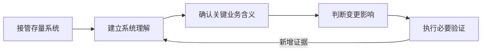
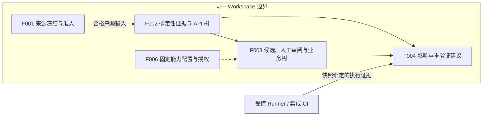
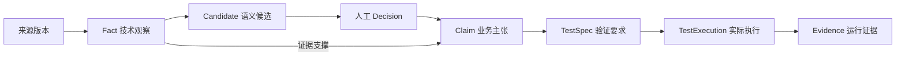
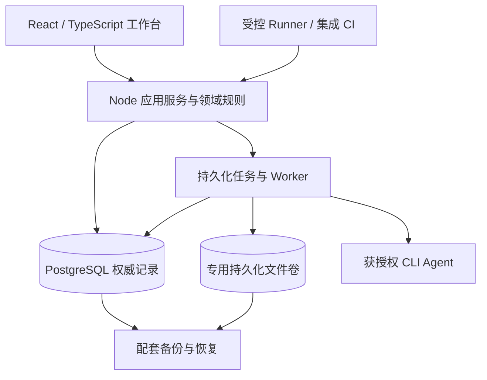

> 语言：**简体中文** · [English](traqen-product-architecture.md)

---
feature_ids: [F001, F002, F003, F004, F006]
topics: [product-architecture, business-architecture, application-architecture, information-architecture, technical-architecture, traceability, change-impact]
doc_kind: product-architecture
created: 2026-07-29
updated: 2026-09-06
---

# Traqen 产品架构

**Traqen 将对存量系统的理解沉淀成可追溯、可更新的证据，让架构师有依据地决定下一次怎样改、验证什么。**

架构提炼为：**一个 Workspace 边界，一份版本化证据模型，业务与 API 两个投影，以及“理解—变更—验证”的闭环。**

[打开四视图交互架构图](../diagrams/traqen-product-architecture/product-overview.architecture.html) · [图源](../diagrams/traqen-product-architecture/product-overview.architecture.json)

交互图提供业务、应用、信息、技术四个阅读视角，可聚焦、缩放和切换明暗主题。总览中的分组是信息压缩；详细职责和交接以本文各节为准。本文是后续整体架构迭代的固定入口，图是本文的派生表达，不建立第二份产品合同。

**阅读状态：** 本轮架构讨论已获 co-creator 授权写入。下文区分已有设计边界、实现基础及仍需细化或验证的建议；架构图与代码存在均不代表功能验收完成。

## 1. 业务架构：支撑架构师的决策

| 用户要作的决策 | Traqen 提供的依据 | 业务价值 |
| --- | --- | --- |
| 系统有哪些能力、怎样实现？ | 业务功能树、API 树及证据路径 | 减少接手系统时的反复调查。 |
| 这次修改可能影响什么？ | 变更到业务/API 的关系、影响理由及覆盖缺口 | 帮助确定调查和审阅范围。 |
| 应当补哪些验证？ | 测试规格、实际执行、过期和缺失证据 | 把理解转化为具体行动。 |

长期质量追溯建立在这一闭环上：对纳入治理的高价值业务 Feature，将已确认意图连接到实现与实际部署执行证据，并暴露缺失、陈旧、冲突或失败环节。当前 F001–F004 以接管理解和建议性变更分析交付这条主线；不隐含新增自动合并、CI 或部署阻断。

一次典型旅程是：登记材料与访问策略 → 查看冻结来源及清单 → 浏览技术事实/API → 审阅 Agent 候选 → 发布业务主张 → 比较两个版本 → 取得复验建议并关联新执行证据。来源冻结完成后由用户另行选择下游分析，不自动串行启动所有步骤。

## 2. 应用架构：按证据职责划分

| 模块 | 拥有的职责与产物 | 交接边界 |
| --- | --- | --- |
| F001 工作空间与源码真相 | 来源登记、采集任务、不可变组件/来源包、manifest、清单、Gap、Receipt 和当前准入 | `SourceTruthAdmission` 只向 F002 提供 `QualifiedSourceInput`；不交付可变路径、ref、上传会话或凭据。 |
| F002 确定性证据与 API 结构 | `Fact`、`EvidenceLink`、`Derivation`、继承及新增 Gap、API 结构树 | 将快照绑定的持久化证据交给 F003/F004；不把业务命名或归属猜测写成事实。 |
| F003 Agent 候选与业务功能树 | 有边界的候选、人工审阅、获批准主张及业务树 | Agent 解释证据；有权限的人决定发布。模型一致性与置信度仅作辅助。 |
| F004 变更影响分析 | `ChangeSet`、实际执行上下文、影响分类和重验证建议 | 汇合 F002/F003 与执行证据；初期只提供建议。 |
| F006 Workspace 能力设置 | 全局能力资产、Workspace 草稿/生效配置、Agent 显式授权、运行固定配置 | 全局可用性不等于 Agent 授权；配置不扩大来源范围。v1 使用白名单本机 CLI。 |

F001 是分析内容的唯一入口，F002 是合格来源包的唯一直接消费者。F003/F004 经 F002 输出继承来源依据与 Gap，不能绕回原仓库或上传目录自行取材。总图已按此边界收束，替代旧图中清单到 F003 的旁路。

**需细化的交接建议：** F002 的输出应保留文档、配置等材料的快照绑定证据引用及受控读取方式，不能只剩 AST 节点。这样既保留 Agent 跨材料调查所需的上下文，也不绕过准入和出站策略。具体读取协议、片段上限和权限校验须在 F002/F003 设计中定义；本文不声称该接口已经实现。

Workspace 是规范聚合根。旧 `Project.id` 只作为迁移兼容身份；各模块共享 Workspace 上下文并拒绝旧上下文的迟到响应。模块职责不直接等于页面导航，F001 八站仍在一个来源工作台内；本轮不重定义全局导航。

## 3. 信息架构：结论与依据的版本关系

图表示证据与治理依赖，不表示每次分析都自动创建后续记录。`CoverageGap` 可在采集、提取、审阅和执行各阶段出现，并沿相关依赖传递。所有记录属于同一 Workspace，保留准确版本、生产者、策略、范围和历史；校正创建新推导、决策或修订。

### 3.1 分开表达权威、符合性与验证

| 维度 | 回答的问题 | 不能替代什么 |
| --- | --- | --- |
| 权威 | 谁在什么范围确认了业务主张？ | 人工批准不能证明代码符合或测试通过。 |
| 符合性 | 当前实现是否符合相应业务要求？ | 观察到现有行为，不能直接推导业务本来就应该如此。 |
| 验证 | 哪次执行在什么版本、环境下验证了什么？ | 测试通过不能授予业务权威，也不能证明未观测行为。 |
| 新鲜度、冲突与覆盖 | 依据是否仍适用、是否矛盾、哪些区域未知？ | 任一绿色状态都不能消除其他维度的缺口。 |

`Fact` 是确定性观察，`Candidate` 是语义假设，`Claim` 需人工发布。主张应区分当前实现行为、规范性业务要求、设计意图与质量期待。候选被拒绝、替代或过期后仍可审计，不显示为当前业务真相。

检测到测试源码只产生测试资产；它既不是已批准 TestSpec，也不是实际 TestExecution。缺少执行结果应显示缺口。可信 Evidence 经 TestExecution 与验证结果支撑关联 Claim，不抹除业务授权链。

### 3.2 两棵树，一份证据模型

| 投影 | 发布依据 | 保留的边界 |
| --- | --- | --- |
| 业务功能树 | 人工审阅后的主张及获批准关系 | API、代码、文档、配置和测试链接各自保留类型与来源。 |
| API 结构树 | 确定性的端点、操作、处理器与契约观察 | 未分类端点可以存在；不可为展示完整而发明业务归属。 |
| 影响、追溯链与指标 | 相应版本上的事实、决策与执行证据 | 投影可重建，不能维护另一套可编辑业务真相。 |

业务 `Feature.id` 是治理分配的稳定身份，不由名称、路径或分类位置计算。`FeatureVersion` 承载变化；Fact 的稳定实体身份与快照特定事实身份分开。工程路线图编号 F001 等不是业务 Feature 的身份。

代码变化可使实现映射、符合性或验证需要复核，同时保留业务意图、人工决策和历史证据。还需按依赖追踪来源、提取器、能力配置、决策与执行上下文的版本；具体重算范围在对应 Feature 中验证，不能把改名或重新分类误当作业务身份消失。

## 4. 技术架构：模块化应用与有界执行

**建议部署形态：** 沿用现有领域规则、应用服务、PostgreSQL 适配器与 CLI 适配器，以模块化方式组织产品。耗时采集、提取和模型分析由有界 Worker 执行，与交互请求分开；任务、检查点和结果由服务端持久保存。图表示职责与数据关系，不能据此认定所有进程隔离已落地。

| 技术选择 | 理由 | 取舍与验证边界 |
| --- | --- | --- |
| 模块化应用、隔离的耗时执行 | 复用现有基础，集中维护版本、权限和发布合同 | 需验证任务恢复、资源上限及隔离；不因模块名称直接拆成多个独立服务。 |
| PostgreSQL + 专用持久化卷 | 与 F001 已确认存储一致：数据库保存权威记录，文件卷保存来源字节 | 文件与数据库不是同一事务；先持久化并保护字节引用，再事务发布。 |
| 统一证据图模型 | 让业务/API/影响共享身份与关系 | 图模型不预设专用图数据库；先测真实路径查询与增量负载，再判断存储扩展。 |
| 白名单 CLI 与固定运行配置 | 遵守 F006 v1，运行能够追溯到确切能力与授权 | 白名单命令不等于隔离；仍须验证文件、网络、工具和凭据权限。 |
| 首期单节点与配套恢复 | 聚焦一条可验证的持久化、备份和恢复链 | 故障期间允许暂停；不承诺高可用、固定吞吐或未经测量的恢复目标。 |

源码仅经获准路径处理，不能因存在模型能力就自动外发。运行保存非敏感配置快照和 Secret 引用；原始源码、提示词、输出、日志、导出均受 Workspace 访问与出站策略约束。运行中或暂停的任务不热切换后续配置。

### 4.1 四种状态分别表达

F001 最新设计 B 将状态拆为四个问题，这一表达应在整体产品中保持：

| 状态 | 含义 |
| --- | --- |
| 任务进度 | 到了哪一步、等待谁、怎样恢复。 |
| 内容冻结 | 是否已有不可变且可查询的来源包和签发记录。 |
| 当前准入 | 此刻的权限、完整性和 Gap 接受期限是否允许新分析。 |
| 备份覆盖 | 哪次配套备份实际覆盖这个版本。 |

已发布 Receipt 只有 `READY` / `READY_WITH_ACCEPTED_GAPS`；`BLOCKED` 属于未成功发布的任务诊断，不签发 Receipt。接受过期不会改写旧 Receipt，当前准入会拒绝新分析；同内容重新接受可追加新 Receipt。冻结成功不等于已被备份。

任务、冻结历史与审计默认持久化（TTL=0）。容量不足阻止新写入并给出恢复动作，不自动删除旧历史。数据库与其引用字节配套备份，隔离恢复后校验引用完整性；原来源不可重取时也应能使用已保留内容。

## 5. 关键难点与验证方式

| 难点 | 架构应对 | 需要的证据 |
| --- | --- | --- |
| 静态关系不完整 | 确定性只保证观察可复现；动态调用、反射与配置分支缺口传入影响结论 | 不支持行为与缺边案例保持 `UNKNOWN`，不产生无依据的“无影响”。 |
| 人工审阅成本 | 建议按业务功能聚合候选，突出依据和版本差异；置信度可辅助排序，不自动授予权威 | 真实任务中能定位证据、纠正候选并明确发布；审阅负担通过试点观察。 |
| 版本变化后的可信性 | 保留稳定业务身份，按依赖区分重算、复核与历史保留 | 修改代码、配置、提取器或执行环境后，过期范围准确，业务意图不被误删。 |
| 持久化与故障恢复 | 有界流式采集、检查点、引用保护、原子发布和配套恢复 | 中断、重复请求、丢响应、磁盘满与恢复缺字节均不产生半包或虚假可用。 |
| Agent 执行边界 | 固定输入与能力，验证实际文件/网络/工具/凭据权限 | 未授权材料和能力不可访问；日志、输出与历史不泄漏秘密。 |

影响结果使用 `CONFIRMED`、`POSSIBLE`、`UNKNOWN`，每项带范围、路径和限制。`CONFIRMED` 表示证据建立了特定关系或执行结果，不等于已经发生生产故障；空影响列表也不等于通过，除非有相关覆盖证明。

## 6. 交付路线与首个架构判题

交付依赖仍为：F006 能力边界与 F001 来源底座 → F002 确定性证据/API → F003 人工审阅后的业务含义 → F004 执行证据与影响建议 → 受控参考试点。F001 单独采集的完成不以运行 Agent 或 F002 为条件。

建议以一个真实业务变更检验全链路，例如修改订单提交规则：

1. 明确选定变更前后来源版本，保留完整清单与 Gap。
2. 给出受影响 API 及可回溯源码证据。
3. 展示关联的已确认业务主张，区分实现变化与业务要求变化。
4. 列出建议重跑的测试、已有执行上下文，以及仍无法判断的区域。
5. 关联新执行证据，检查结论更新及旧依据可追溯性。

判题是“架构师能否凭这些证据完成一次有依据的变更决策”。试点还需证明事实重放、两树发布权威、恢复与权限边界。此处定义验证目标，不报告试点已通过；不使用演示兜底或自动强制门禁掩盖证据缺口。

## 7. 设计依据与实现基础

### 7.1 活动设计依据

| 依据 | 使用范围 |
| --- | --- |
| [系统需求](traqen-system-requirements.zh-CN.md) | 产品使命、R1–R9 和初期建议性边界。 |
| [F001 当前中文设计 B](../../feature-discussions/2026-08-30-F001-workspace-source-truth-design/README.zh-CN.md) | F001 产品行为与验收的当前权威；优先于未同步的旧 Spec、英文与 ADR 摘要。 |
| [F002](../features/F002-feature-api-traceability.zh-CN.md)、[F003](../features/F003-traceability-graph.zh-CN.md)、[F004](../features/F004-change-impact-analysis.zh-CN.md) | 确定性事实、人工发布、执行与影响合同。 |
| [F006](../features/F006-workspace-capability-settings.zh-CN.md)及[能力解析图](../diagrams/traqen-product-architecture/workspace-capability-resolution.dataflow.html) | CLI 资产、显式授权、Apply 与 Run 固定边界。 |
| [ADR-0001](../decisions/ADR-0001-canonical-traceability-ontology.zh-CN.md) | 统一本体、稳定身份与不同权威层级。 |
| [ADR-0002](../decisions/ADR-0002-workspace-aggregate-and-execution-isolation.zh-CN.md) | Workspace 聚合与执行隔离；F006 采用文内较新修订。 |
| [ADR-0003](../decisions/ADR-0003-source-truth-boundary.zh-CN.md) | 来源边界的决策背景；F001 当前细节以设计 B 为准。 |

本文维护整体关系、理由与取舍；Feature 详细合同继续由对应文档承载。后续实质变更须确认完整方案并同步获授权的受影响设计，不能仅改总图就暗中改变下游权限、数据或产品边界。

### 7.2 本轮读取的实现基础

| 已存在的基础 | 代码入口 | 尚不能据此宣称 |
| --- | --- | --- |
| 领域模型与分层失效 | [模型](../../src/domain/model.js)、[失效规则](../../src/domain/invalidation.js) | 全部新合同都已被当前业务链路正确消费。 |
| 应用与 PostgreSQL 存储 | [应用服务](../../src/application/traceability-application.js)、[生产入口](../../src/api/production-server.js) | 完整 F001 来源包生命周期与配套恢复已验收。 |
| 分析任务与检查点 | [任务运行器](../../src/application/workspace-analysis-job-runner.js)、[Worker](../../src/application/workspace-analysis-worker.js) | 新采集流程已完成资源、并发及故障验证。 |
| 分析模型与 CLI 适配 | [模型适配器](../../src/analysis/model-adapters.js) | 所有旧执行路径均已满足最新 F006 授权合同。 |
| 图谱、变更与执行证据 | [图谱投影](../../src/domain/feature-graph.js)、[影响模型](../../src/domain/change-impact.js)、[执行证据](../../src/domain/execution-evidence.js) | F001–F004 的完整参考试点已经通过。 |

读取基线为 `b8aba2434e571fd4ac041c12234ff33f271eddbb` 及本地已有工作；本轮只修改架构文档与派生图，不以源码抽查替代运行验收，也不把旧 Scanner 输出、Agent 对话或浏览器状态提升为权威。

## 8. 迭代记录

| 日期 | 变化 | 依据 |
| --- | --- | --- |
| 2026-09-06 | 写入业务、应用、信息、技术四视图；补充技术取舍、关键难点、试点判题和实现边界；统一 F002 取证路径与设计 B 的 Receipt 语义。 | 架构讨论线程 `thread_mtqkycp918zlran6`；co-creator 消息 `0001788746520984-000176-ec4774ba` 授权将本轮讨论直接写入产品架构并以本文持续迭代。 |

后续仍更新本文和其派生图，保留本表的变化与依据。新增待细化项必须明确影响的合同和验证方式；已批准设计、建议及实现验收状态分别记录。
