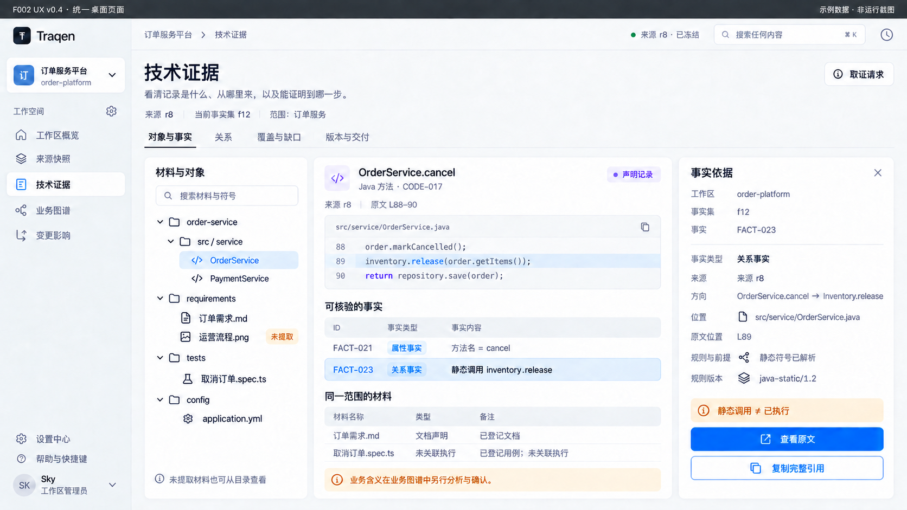
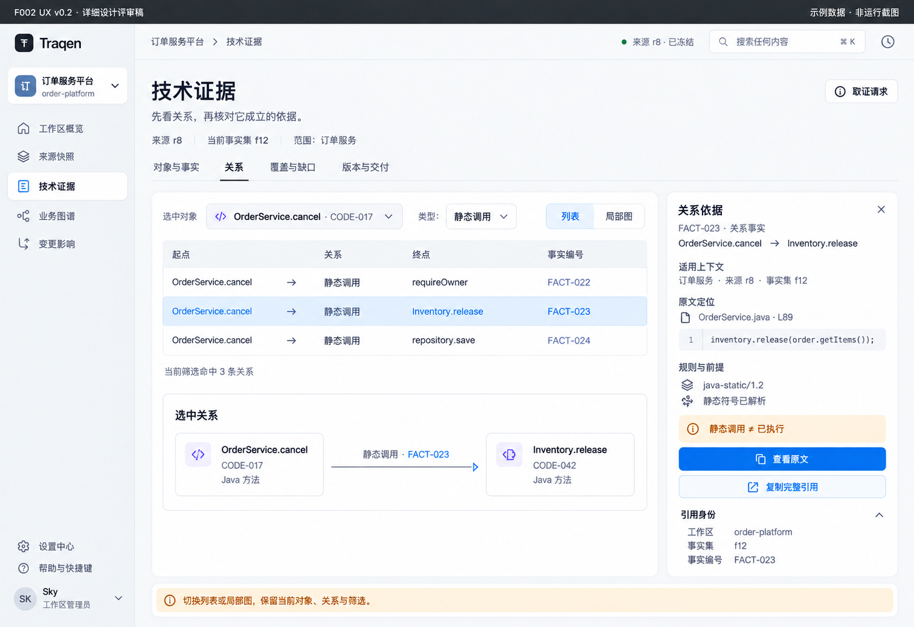
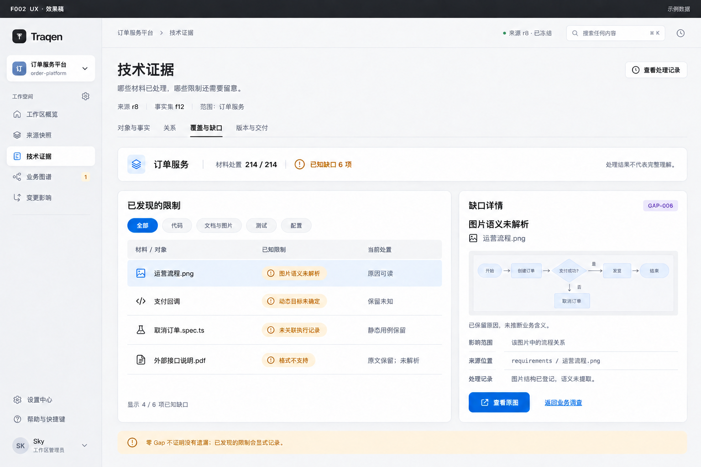
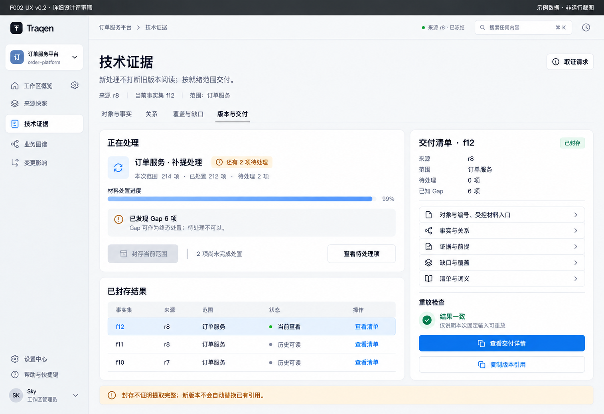
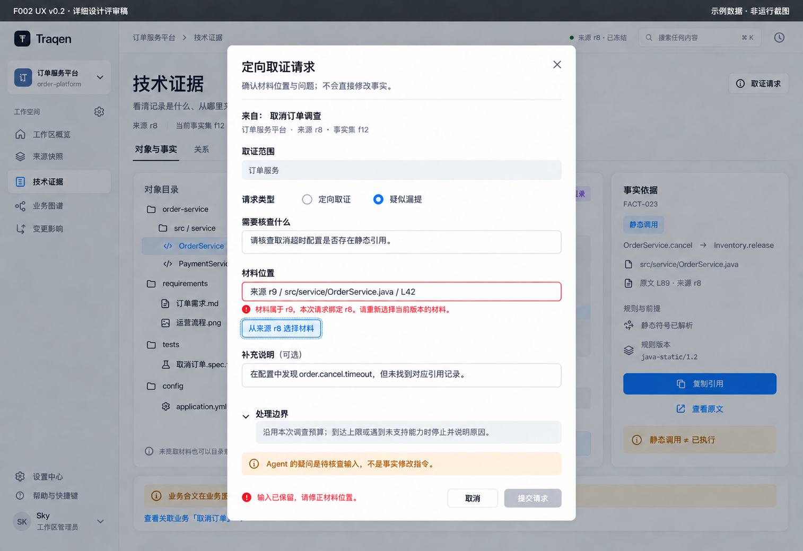
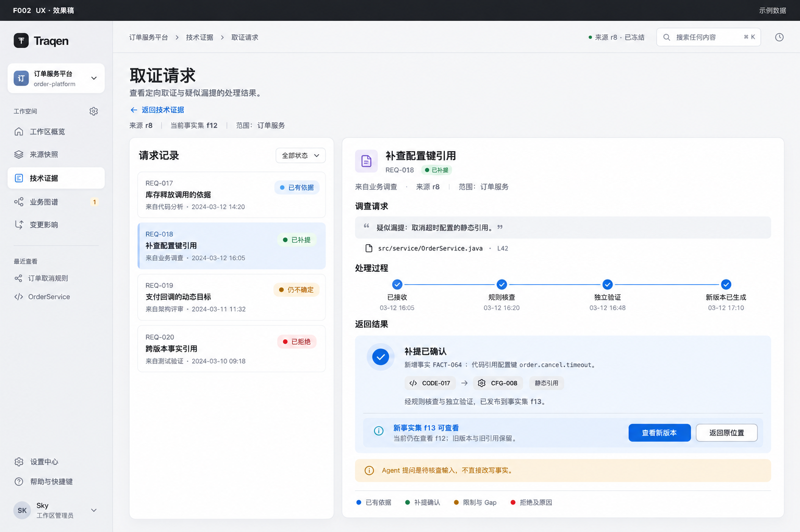

# F002 · 技术证据工作台 UX 详细设计 V0.5

> **供 co-creator 审阅，尚未采纳为 UX 基线。** 一套统一的桌面工作台设计。先看效果图，再看对应的交互与状态；不包含手机、平板或窄屏方案。
>
> 功能依据：[F002 已发布功能设计 V1.0（固定提交）](https://github.com/qianfengXY/Traqen/blob/32a85d38c15ab45a586022cc3d7854907038d953/docs/design/F002-deterministic-facts/README.md)。视觉参考：[F005 整体视觉与交互评审稿（固定提交）](https://github.com/qianfengXY/Traqen/blob/d408210f6d8c93a38e7442e6c7c98c4530b109b4/docs/design-reviews/F005/README.md)，不改变 F005 自身的待采纳状态。本稿不修改 Feature Spec、ADR、接口或产品代码。

> **一个主界面，不按设备分版本。** 功能、内容、按钮、默认布局和操作路径保持一致，只适配显示比例与可用空间。不得因窗口大小自动隐藏目录、收起依据面板、删减按钮或改成逐层进入的精简版。此约束适用于本文所有页面。

## 1. 统一主界面

材料目录、原文与事实、依据面板同时呈现。导航、内容和操作组成同一个完整主界面，缩放不改变页面结构。

目录始终可发现未提取材料；中间读原文与事实；右侧核对依据和限制。「同一范围的材料」只表示共同属于当前范围，不表示文档、测试与代码之间已证明业务关联。

本文只用上面这一张图定义主界面。后面的关系、缺口、版本和取证图展示不同功能场景，不是按设备另做的设计。所有场景共用同一套导航、上下文、视觉和操作规则。

当前主界面图沿用已生成的统一页面，图头保留其生成版本 V0.4；本文 V0.5 整理的是文档表达，不声称重画全部图片。已撤销的旧图移入历史目录，不再作为当前设计或验收依据；详见 [资产记录](assets/GENERATION.md)。

**图中全是示例数据，不是产品运行截图或验收证据。** 原始图片尺寸见 [资产清单](assets/manifest.json)。图片像素不等于实际可用视口，效果图不能作为缩放实现通过的证明。示例 Java、规则名、时间和数量不代表已经实现的能力、首期支持清单或真实审计记录。

## 2. 页面结构与显示适配

对象页固定为「材料目录＋阅读区＋依据面板」。四个标签页、取证请求、原文与证据、限制提示、全部操作均完整保留。本文不设设备分档、尺寸对照表或独立的精简模式。

显示适配只处理系统／浏览器缩放、实际可用视口和自然留白。不按窗口宽度切换功能布局，不维护不同的菜单、内容或按钮配置；具体显示比例由实际环境确定，不强制缩放到某个固定值。

**一致性按相同数据、权限和操作状态比较。** 用户可主动关闭或重开面板；窗口变化不能代替用户关闭面板，打开依据也不能自动挤掉目录。

正文段落沿用 F005 的舒适行宽规则，不因大屏把一段文字拉满全屏。代码保留物理行号，可独立横向滚动或切换软换行；软换行不产生新的源文件行号。页面标题、版本范围和标签栏稳定可见；长列表、正文、依据面板分别滚动，焦点所在区响应滚动。

显示空间不足时，调整显示比例或使用可访问的滚动来阅读完整页面；不自动裁掉功能区或改变操作路径，也不能为塞满一屏把文字缩小到不可读。权限提示、错误与操作入口始终可访问。本轮不增加手机、平板或独立窄屏产品布局。

## 3. 信息架构：按用户问题组织，不按处理器组织

左侧沿用 F005 工作区导航，F002 入口叫「技术证据」。不另设六个处理阶段菜单，也不把「启动 API 分析」作为用户目标。

| 页面入口 | 用户要解决的问题 | 首要内容 | 主要动作 |
|---|---|---|---|
| 对象与事实 | 这里有什么？这条记录说了什么？ | 材料目录、原文、属性／关系事实 | 选对象、查看原文、查看依据 |
| 关系 | 这两个对象为什么有关联？ | 可检索关系列表、局部关系预览 | 选关系、核对两端与依据 |
| 覆盖与缺口 | 哪些处理过？哪些仍不知道？ | 范围、能力说明、已发现限制 | 定位受影响材料、回到调查 |
| 版本与交付 | 我现在看的是什么版本？能交付哪些结果？ | 固定版本、处理进度、交付清单 | 查看历史、检查封存条件、读交付物 |
| 页头「取证请求」 | 补查到哪一步？返回了什么？ | 来自 F003 调查的请求与结果 | 核对请求、查看返回、返回调查 |

所有页面共享上下文条：**工作区／项目范围、F001 来源版本、F002 事实集版本、当前分析范围**。来源版本 `r8`、事实集 `f12`、F003 业务图谱版本是三个概念，不用一个「版本」字段混称。

切标签保留当前范围、筛选、选中项和滚动位置；返回列表落回原行。切工作区必须先清空旧内容再加载，异步旧响应不得覆盖新工作区。无权查看的对象不能因保留历史选择而显示出来。

## 4. 对象与事实：从材料进入，不以有 Fact 为前提

对应 §1 的统一主界面图。

### 4.1 目录与检索

- 目录首先呈现获准范围内的材料，再展开可定位对象。文件没有提取成功的事实，也有自己的材料入口与处理状态。
- 支持按材料名、符号名、路径、对象／事实展示编号查找；筛选材料类型和处理状态。检索只在当前获准范围内生效，不暗中跨项目扩搜。
- 搜索结果解释命中位置；同名对象显示来源路径与范围，不靠名称猜关联。短号有歧义时列出候选，要求选择。
- 「没有匹配结果」「没有已提取事实」「材料不可读取」是三种不同状态，不能用同一个空白页。
- 目录中的图片即使只有文件登记、没有语义提取，也可在权限允许时查看原图；不把 AI 图片理解结果充当 F002 确定性事实。

### 4.2 阅读区域

| 材料 | 默认阅读方式 | 必须保留的界限 |
|---|---|---|
| 代码 | 路径、固定版本、物理行号、选中范围高亮 | 静态调用不等于实际执行；不能把推断调用画成已证明调用 |
| 文本文档 | 章节结构、段落位置、原文片段 | 「文档声明」不等于「代码已经实现」 |
| 图片／图文文档 | 原图、页码／图片位置；已登记范围标注 | 未解析语义明确标注，不补画业务含义；缩放不改变源定位 |
| 测试用例／报告 | 用例内容或报告记录，关联依据另列 | 缺执行来源、命令、环境或被测版本绑定时，不显示「已验证通过」 |
| 配置 | 文件位置、键值声明、版本 | 声明值不等于实际运行环境生效值；敏感值按权限处理 |

权限允许的原文访问独立于事实列表：即使右侧是「尚无提取事实」，阅读入口仍然存在。显示授权失败或材料确实不可用时，给出具体原因；不承诺每件材料都必然可读。

### 4.3 事实列表与依据面板

事实列表至少分清「属性事实」与「关系事实」，并标识事实依据类别。「声明记录」与「规则派生」分别呈现；派生项必须展示规则版本和前提。示例 `FACT-021` 是方法名称属性；`FACT-023` 是静态调用关系，不能拿对象 `CODE-017` 代替事实编号。

依据面板按以下阅读顺序组织：

1. 事实原句、类型、完整身份坐标；
2. 适用的来源版本、分析范围与关系方向；
3. 原文定位与可读证据片段；
4. 提取规则、推导前提及可追溯的上游依据；
5. 已知限制、关联 Gap、不可从该事实推出的结论。

点击「查看原文」在当前阅读区定位，保留关系或事实的返回点。点击「复制完整引用」复制包含 `workspaceId + graphVersionId + factId` 的引用，而非只有 `FACT-023`。其中 `graphVersionId` 指 F002 事实集版本，不是 F003 业务图谱版本。最终 URI／序列化格式仍待出口契约确认。

未提取原文复制的是材料引用，不伪造 factId。完整引用不授予读取权限；复制引用也不默认复制原文。敏感内容不能通过隐藏面板、剪贴板或无鉴权预加载绕过控制。

## 5. 关系：列表找得到，依据说得清

默认用列表回答「谁与谁、什么关系、依据是什么」。局部图只帮助定位上下文，不用全仓毛线球替代可检索的信息。

| 操作 | 界面反馈 | 返回方式 |
|---|---|---|
| 按关系类型、起点／终点、路径筛选 | 列表数量随当前范围变化；筛选条件可见 | 清除单项筛选，不清空范围 |
| 选择一条关系 | 两端对象、方向、factId 与依据同步高亮 | 返回时仍落在该行 |
| 点击局部图的边 | 选中同一条关系事实，不产生新事实 | 面板关闭后保留图位置 |
| 点击一端对象 | 进入该对象阅读区，携带原事实返回点 | 一次返回原关系列表 |
| 遇到歧义或未解析目标 | 显示候选／限制，不画确定连线 | 可查看已发现 Gap 或发起调查 |

没有关系线不等于「没有关联」；只有声明能力与范围内的处理结果才能解释为空。图片或文档与代码同目录、同名，不自动证明它们实现了同一业务功能。图中每条确定关系和列表行使用同一事实引用与证据，禁止图表各算一套。

## 6. 覆盖与缺口：让限制可见，不制造完整性承诺

顶部先显示当前范围及能力说明，再显示材料处置数和已发现限制；下方列表按原因、来源、材料类型、状态筛选。选择 Gap 后，右侧说明**哪里受影响、为何受限、有什么已知依据、下一步能做什么**。

| 内容 | 显示规则 |
|---|---|
| 材料处置进度 | `214/214 件已处置`只表示这一清单的处理状态，不写「系统理解 100%」 |
| 提取覆盖 | 显示语言／格式、规则版本、支持能力与排除范围；对象、文件、规则三种分母不混用 |
| 已知 Gap | 保留原因、受影响范围、发现来源及可追溯依据；可有解析失败、不支持、歧义、动态行为等 |
| F001 继承限制 | 标明来源于 F001，不伪装成 F002 新发现；展示对应来源引用 |
| 当前访问限制 | 与算法提取 Gap 分开标识；无权读取不等于源材料不存在，不能泄露受限内容与隐藏数量 |
| 未检测遗漏 | 不虚构一条已被系统发现的 Gap；固定提示「零 Gap 不证明没有遗漏」 |

图中图片条目展示「保留原图、未推断业务含义」。点击原图走受控材料入口，不要求先有图上的 Fact。对测试未绑定执行的情况展示缺失绑定，不把报告里的 PASS 直接转成运行成功状态。

从此处的「返回业务调查」进入 F003，并携带材料位置、范围和已知 Gap；若没有既有调查返回点，先进入 F003 选择获准调查，不直接提交补查。只有 F003 的受限调查请求才能进入本稿的取证回路。此入口不赋予用户越权访问或向事实集直接写入新事实的能力。

## 7. 版本与交付：固定结果，不把封存当作“全对”

### 7.1 页面结构

上方显示当前范围的处理任务；下方列出已封存事实集。**运行任务、可读的已封存版本、当前浏览版本分开显示。** 新任务运行中仍可读已获准的旧版本，不自动把半成品覆盖到当前事实集。

选择历史版本后，页面上下文切换到它绑定的来源与范围；不会用最新原文填补历史证据。需要重新取证时建立新请求／新版本，旧引用保持指向原版本。

### 7.2 进度与封存

- 任务开始前显示目标来源、范围、提取能力与规则版本；本稿不新增「任选本地路径」入口。
- 总量未知时显示已处理数量与正在处理的阶段，不编造百分比或结束时间。
- 「检查封存条件」先核对本次范围的终态处置、准入、权限、清单与必要校验；图中「封存」按钮代表这一入口，不是客户端绕过门禁的开关。
- **全终态可以包含明确的 Gap；仍有待处理项不能封存。** 创建一个 Gap 本身不自动结束处理项，必须有明确终态处置及原因。
- 校验不通过就展示具体阻断项，并定位到材料或任务。不能在弹窗里用「仍然封存」绕过未完成工作。
- 封存成功返回稳定的版本与范围回执。旧事实不可改写；补提、纠正确认在独立验证后形成新版本。

封存流程和检查顺序是 UX 提案；服务端状态机、检查点协议与权限角色仍需联合契约设计，本文不以按钮文案冻结实现。

### 7.3 五部分交付视图

1. **对象与编号**：目录及受控材料视图引用；未提取材料也能在获准范围内被发现。
2. **事实与关系**：属性事实、关系事实、类型与编号。
3. **证据与前提**：原文位置、受控内容、规则和推导依据。
4. **缺口与覆盖**：已发现限制、处置状态、能力与范围说明。
5. **清单与词义**：版本、来源绑定、类型词义与消费者解释边界。

「查看交付清单」默认只读，不暗示全量原文可导出。按需读取仍需授权。重放状态区分「未执行」「一致」「存在差异」，一致只证明固定条件下的可复现性，不证明正确或完整。

## 8. 定向取证：请求、验证、返回，形成闭环

### 8.1 请求填写与校验

这个表单是 **F003 调查请求的可视化填写／核对界面**，不是一个脱离调查授权、任意要求 F002 改事实的新入口。

| 字段 | 交互方式 | 校验与反馈 |
|---|---|---|
| 所属调查、工作区、来源版本、基准事实集 | 从调查继承；固定绑定清楚显示 | 不静默换成当前最新版本 |
| 请求类型 | 定向取证／疑似漏提／疑似错误，词义明确 | 怀疑不等于事实变更指令 |
| 待核查问题 | 用户／Agent 提供问题描述 | 缺失时贴近字段提示，保留其他输入 |
| 材料位置与范围 | 选择已登记材料，必要时填写结构位置 | 工作区、版本、授权范围不匹配时拒绝；提供重新选择入口 |
| 已有依据 | 引用事实／材料／Gap，不是任意绝对路径 | 引用可解析且在获准范围内 |
| 预算与停止条件 | 显示调查允许的界限 | 不在本稿假定固定 token 数、金额或超时阈值；不得无限补查 |

图中 `r9` 材料被错误填入 `r8` 请求，是有意设计的失败场景。「从当前来源选择」只替换出错的材料位置，不抹掉问题描述。客户端提前提示；最终准入与范围校验以服务端为准。

提交时禁用重复提交并显示发送状态。返回请求编号后才显示「已受理」；网络中断但接收结果未知时显示「确认提交结果中」，通过同一次提交的去重标识查询，不创建第二个请求。去重标识的接口形式待契约确定，UX 不承诺当前后端已有该能力。

未提交表单在同一授权上下文中保留；离开前提示未保存内容。恢复草稿时重新校验版本与权限，权限撤销后不继续展示旧的敏感片段。

### 8.2 请求结果与回到调查

请求列表显示请求编号、问题摘要、范围、状态和最后更新时间。点开一项看到处理过程、返回依据、限制与回执；不是一个成功 toast 后就找不到结果。

| 返回类别 | 结果页显示 | 下一步 |
|---|---|---|
| 已有依据 | 已有事实／材料引用、证据位置、适用前提 | 查看依据，返回原 F003 调查 |
| 补提／纠正确认 | 独立验证结果、新事实集引用与新增／更正内容 | 明确选择查看新版本；旧调查基准不自动切换 |
| 仍不确定／不支持 | 已确认的限制、影响范围、相关 Gap 或未能验证原因 | 携限制回到调查；不把未验证假设写入事实 |
| 越权／版本不符 | 可公开的拒绝原因、可纠正项 | 修正后重新提出请求；不得伪装为成功空结果 |

处理中、失败、取消／停止（若协议支持）是任务状态，不冒充上述四类成功返回。失败后保留请求与已完成的可公开检查记录。是否可重试以及重试范围由当前授权和任务状态决定。

示例 `f13 已生成` 与 `当前仍为 f12` 同时可见。「查看 f13」只改变浏览版本；**将它作为 F003 新调查依据是另一项显式选择**，必须保留原调查的版本与引用。F003 不能就地修改 F002 事实。

## 9. 三条完整用户旅程

### 9.1 架构师核查一个技术结论

进入技术证据 → 确认来源 r8／事实集 f12／订单服务范围 → 搜索 `cancel` → 选择代码对象 → 选择静态调用事实 → 查看原文 L89 和规则前提 → 复制完整引用 → 回到业务调查解释业务含义。

每一步都能回到原位置；业务解释不在 F002 中被标成已证明事实。

### 9.2 从尚未提取的材料继续调查

目录找到运营流程图片 → 看到「已登记、未提取」 → 在授权内读原图 → 查看已发现限制 → F003 基于原材料提出问题 → 携材料定位提交定向取证 → 获得已有依据、新版本或明确限制 → 回到原调查。

没有 Fact 不能成为材料入口被隐藏的理由；无权访问则必须止于权限边界，不能以这条旅程规避准入。

### 9.3 补提后采用新的事实版本

查看请求 → 看到独立验证后产生 f13 → 当前 f12 保持不变 → 在新版本检查相关事实与依据 → 显式将新版本引用带回 F003 → 由 F003 决定如何更新调查结论，原版本与原调查记录仍可回查。

这一过程不是跨版本影响分析产品，也不承诺自动判断业务结论是否全部失效。

## 10. 状态与恢复设计

| 状态 | 用户看到什么 | 可执行恢复 | 不能做什么 |
|---|---|---|---|
| 首次加载 | 导航、固定上下文与局部骨架；各区域可独立完成 | 区域失败可局部重试 | 整页闪空或旧项目内容残留 |
| 来源尚未就绪 | 说明缺少合格来源／固定版本 | 回来源快照查看具体阻断 | 给出任意路径绕过 F001 |
| 有材料、无事实 | 目录和获准原文可读，事实区解释处理状态 | 查看能力／任务／已知限制 | 把材料一起隐藏 |
| 搜索无结果 | 保留搜索词和筛选条件 | 清条件或更换查询 | 写成「系统没有这种功能」 |
| 关系存在歧义 | 候选和限制可见，未定边不实画 | 查看原文与已知 Gap | 自动挑同名目标 |
| 原文被脱敏 | 显示可公开片段和脱敏提示 | 按现有权限流程处理 | 把敏感原文预加载后仅 CSS 隐藏 |
| 权限被撤销 | 停止读取、移除已呈现敏感内容，解释访问变化 | 重新校验授权 | 复用旧句柄或旧缓存继续读 |
| 原文／历史版本不可用 | 保留引用与不可用原因；不填补内容 | 重试合法读取或向来源侧核查 | 自动跳最新来源冒充历史证据 |
| 局部请求超时 | 原有可读结果保留，失败区有重试 | 重试当前版本和范围 | 清空全页或宣布材料不存在 |
| 新版本到达 | 提示可查看新版本，当前版本保持固定 | 显式切换 | 静默改变引用含义 |
| 提交结果未知 | 区分「未确认」与「失败」，保留输入 | 对账同次请求，再决定是否重试 | 连点产生多个取证任务 |
| 运行中断／失败 | 展示最后可信状态和失败原因 | 在权限允许时恢复或重试 | 伪装全终态后封存 |
| 切工作区／范围 | 清理旧内容与未完成请求的界面绑定 | 加载新上下文，旧草稿按其身份隔离 | 迟到响应污染新上下文 |

访问审计和敏感信息策略必须由受控读取链路保证，不能只靠提示文案。列表数量与错误详情也受权限约束。本文定义用户应看到的状态，不授权新的读取路径或存储权限。

## 11. 组件、视觉与可访问性

沿用 F005 的 porcelain／graphite 体系：背景 `#F5F5F7`、导航 `#EBEDF1`、白色内容卡片、正文 `#1D1D1F`、次级文字 `#626570`、主操作蓝 `#0066CC`、选中底 `#E8F1FF`。琥珀表示限制／待确认，红色表示阻断，绿色只表示对应任务或检查的确定状态。

- 版式：标题 32/40，区块标题 20/28，阅读正文 15/27，控件 13/20，关键辅助文字不小于 12/18；卡片圆角 16、按钮圆角 9。具体 token 继承 F005，不另建一套主题。
- 状态必须同时有文字和图标，不能只靠颜色。选中行、键盘焦点、错误状态视觉可区分。
- 一个活动任务保留一个主要按钮，其余用次级操作；不在目录每行堆一排蓝按钮。
- 表格支持键盘选择、明确表头与当前行；目录用可展开的层级语义。依据面板具有标题和关闭标签。
- 搜索支持中文输入法；组合输入未结束时，Enter 不误触提交。快捷键不覆盖文本编辑的常用键。
- 弹层打开时焦点进入，关闭后回到触发按钮；Esc 关闭临时面板，不静默丢弃未保存的请求。
- 代码软换行、图片缩放、长路径省略都提供查看完整信息的途径。复制成功说明复制的是引用还是内容。
- 桌面 200% 缩放时仍可访问全部动作、错误与权限提示；必要时通过可访问滚动查看完整页面，不自动折叠、隐藏功能区或改换操作路径，不强行缩小文字抵消用户放大。

拟复用的组件职责：上下文条负责版本与范围；材料目录负责发现；阅读器负责原位定位；事实表与关系表负责选择；依据面板负责解释；Gap 面板负责限制；版本清单负责固定交付；请求回执负责闭环。这里是展示职责，不是新的服务拆分或数据 schema。

## 12. 与已定 24 项功能的对应

功能编号仅用于本表追踪，不是对象或事实编号。

| 功能 | 用户可见落点 | 交互／交付说明 |
|---|---|---|
| 01.1 材料登记 | §4 目录、§6 处置清单 | 未提取材料也有状态与入口 |
| 01.2 结构切分 | §4 章节／符号层级 | 展开对象，不宣称已理解业务 |
| 01.3 原位定位 | §4 阅读器 | 源版本、路径、物理行／页／结构位置 |
| 01.4 对象编号 | §4 对象头、完整引用 | 短号展示，全坐标引用 |
| 02.1 代码声明 | §4 代码与事实列表 | 声明记录和规则派生区分 |
| 02.2 文档与图 | §4 原文／原图 | 保留材料，未知语义不猜 |
| 02.3 测试与配置 | §4 阅读方式、§6 限制 | 声明、执行报告与生效结果分开 |
| 02.4 事实分型 | §4 事实表、依据面板 | 属性／关系及依据类别 |
| 03.1 内部结构 | §4 目录结构 | 包含层级与位置来自材料依据 |
| 03.2 代码关联 | §5 关系列表 | 静态关系可回查前提 |
| 03.3 跨材料链接 | §5 关系筛选 | 仅展示有依据的链接，不用同名推业务关系 |
| 03.4 歧义处理 | §5 候选／限制、§6 Gap | 不确定关系不画实线 |
| 04.1 原文回查 | §4 阅读器、§6 原图入口 | 有无 Fact 均可在授权内查原文 |
| 04.2 证据保留 | §4 固定来源、§7 历史版本 | 不用最新内容替换旧引用 |
| 04.3 推导回查 | §4 依据面板 | 规则版本、前提、上游依据 |
| 04.4 受控访问 | §10 权限与脱敏状态 | 展示、复制、读取均受控 |
| 05.1 原因分类 | §6 Gap 列表 | 已发现限制按原因及来源区分 |
| 05.2 未知标记 | §6 原图／动态行为／未绑定执行 | 未知不写成不存在或已成功 |
| 05.3 影响定位 | §6 受影响材料／范围 | 不是新增跨版本影响分析 |
| 05.4 覆盖跟踪 | §6 数量与能力说明 | 分母明确，不等同语义完备 |
| 06.1 范围封存 | §7 检查条件与回执 | 全终态可有 Gap，待处理不能封存 |
| 06.2 持久保存 | §7 历史事实集、§8 请求回执 | 用户可回查，旧引用保留 |
| 06.3 重放校验 | §7 校验状态 | 未执行／一致／差异，不等于正确完整 |
| 06.4 按需读取 | §4、§7 五部分交付 | 引用解析与材料读取均需授权 |

F003→F002 定向取证和返回路径贯穿 §8，不构成 F003 改写事实的通道，也不擅自新增第七个核心功能组。

## 13. 拟验收清单：实施后要证明的体验

以下是未来实现的验收要求，**不是本次已经通过的运行测试**。

- [ ] 改变窗口大小与显示比例，以同一数据、权限和操作状态核对四个标签页与取证请求：功能区、内容字段、按钮和操作路径一致。
- [ ] 选中事实后保留材料目录、阅读区和依据面板；没有因窗口宽度触发的自动收起或布局模式切换。
- [ ] 调整显示比例仅影响页面显示尺度；缩放前后选中对象、事实、版本、权限提示和可执行动作不变。
- [ ] 缩放前后均沿相同路径完成「选对象→选事实→读原文→返回」，不增加寻找被自动隐藏功能的步骤。
- [ ] 自主关闭／重开面板时保留选择和滚动位置。200% 放大时可通过键盘与滚动访问完整页面，不能自动隐藏功能或强制缩小文本。
- [ ] 无 Fact 的获准材料可从目录发现并读取；无权读取时不泄露隐藏原文。
- [ ] 属性事实、关系事实、声明与派生能够区分；每条确定关系可定位证据与前提。
- [ ] 复制 FACT 引用带工作区和事实集坐标；未提取材料复制材料引用，不生成虚假 factId。
- [ ] 对账完成但有 Gap 的状态不写为「完整理解」；零 Gap、重放一致均不承担完备性背书。
- [ ] 有待处理项时不能封存；只有显式终态处置且通过必要检查后才获得固定交付回执。
- [ ] 请求版本不符时贴近字段解释并保留输入；服务端再校验，重复点击不产生重复请求。
- [ ] 四类取证返回均有可回查结果和返回原调查入口；结果未知、失败不冒充成功返回。
- [ ] 新事实集可提示、可查看，但不会静默替换当前事实集或 F003 调查基准。
- [ ] 切工作区、撤销权限、历史内容不可用、迟到响应均按 §10 恢复，不回退到未经同意的材料版本。
- [ ] 全程可用键盘完成主要任务；中文输入法不误提交；桌面放大后关键操作与限制仍可访问。

本次交付的校验范围仅是：图文对应、引用与资产完整、桌面范围、版本／权限语义一致性。图片无法代替真实字号、焦点、网络异常、权限撤销和提交去重的实现验收。

## 14. 保留的边界与本轮审阅重点

尚未替 operator 决定的内容：原文读取接口的物理路径、最终出口 schema／词义表、ID 生成与跨项目身份模型、首批提取能力、服务端检查点协议、存储实现、访问审计与脱敏细则。**现行 ADR-0003 准入边界仍有效**；UX 中的「查看原文」不构成批准 F003 直接绕过 F002 的证据。

不在本轮设计中增加移动端、完整数据库／外部依赖地图、跨版本影响分析、应用实际执行、Agent 业务分类或自动改写事实。

本轮主要请审阅三件事：

1. 统一主界面是否适合长时间阅读与证据核查；
2. 四个页面入口能否让你自然找到对象、依据、限制和交付版本；
3. 取证请求与返回路径是否清楚，是否始终能知道当前看的来源、事实集与调查基准。

## 15. 产物与来源

原稿授权：`0001789549627051-000075-0ba73828`（详细设计并放文档供审阅）；桌面范围约束：`0001789549109488-000067-b0ccfa64`。

V0.5 修订依据：`0001789625563158-000128-a7b8e0d3` 要求只呈现一个主界面，不做两套设计；此前 `0001789616427632-000054-84945b89` 已授权将显示适配约束写入文档。本轮删除设备分组、尺寸对照和分档验收表达，统一正文入口；不改变 §3–10 的功能语义和 §12 的 24 项功能映射。功能定稿不因本稿自动更新，UX 采纳需另行确认。

- [图像资产与 SHA-256 清单](assets/manifest.json)
- [生成与选择记录](assets/GENERATION.md)
- 当前正文嵌入统一主界面图及五张不同功能场景图，不是设备版本。资产随文档保存，不依赖聊天临时附件；撤销的旧图仅存于历史目录。

作者：砚砚 / gpt-6-astra
