> Language: **English reference** · [简体中文](README.md)

# F005 · Traqen Experience and Frontend Design Charter

> **Historical proposal, superseded.** The current authority is [F005 Layout and Navigation Design V1.0 (normative Chinese)](../../design/F005-layout-navigation/README.md). The V2.1 text, images and verification below remain historical. Separate sidebar sizes and extra content on larger displays are no longer current rules; images 18–21 do not prove uniform scaling. Mobile boards, Pencil and offline prototypes are also historical. Publication does not retroactively approve those artifacts or declare full product implementation.

> V2.1 desktop-scope revision · 2026-09-17. Fixture design proposal, not an adopted Feature Spec or implemented product.

## Reading entry and screen designs

The operator's 2026-09-17 03:09 UTC request limits design to **14-inch laptops and 27-inch displays**, defers narrow screens, and requests two expandable default themes. This revision retains **Porcelain Light and Graphite Dark**, including the existing blue accent, as the demonstration choice. It updates the proposal and presentation, without formal adoption or general implementation authorization.

Four comparisons show the same graph, selected object, versions, and fixture state at two desktop viewports in both themes. Fourteen current desktop screenshots precede the sixteen charter sections. The Chinese edition is canonical.

- [Offline interactive prototype, including the complete Chinese charter](assets/Traqen-F005-review.html)
- [Standalone charter reader](assets/charter.html)
- [Full-size screen gallery](assets/gallery.html)
- [V2 Pencil core boards (historical visual source; this charter defines current scope)](assets/F005-layout-navigation-v2.pen)
- [Current desktop and theme verification](assets/desktop-themes-verification.json)
- [V2 prototype verification record (includes historical narrow-screen checks)](assets/verification.json)

### Same page, two themes, two desktop viewports

Cancel Order, its evidence, and the graph state stay identical. Extra space does not scale type or controls.

#### 14-inch laptop · Porcelain Light · 1440×900

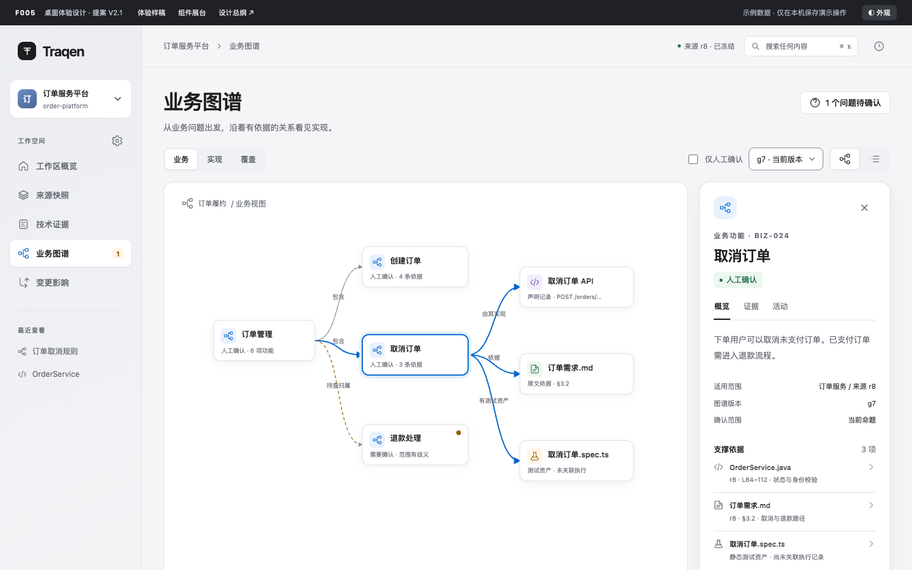

[Open original size](assets/previews/18-graph-laptop-light.png)

#### 14-inch laptop · Graphite Dark · 1440×900

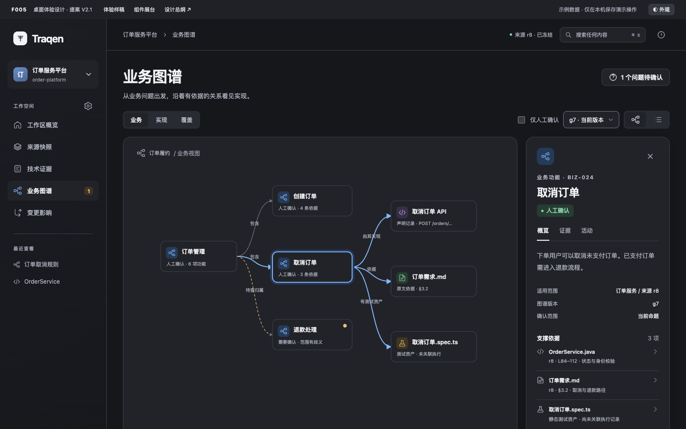

[Open original size](assets/previews/19-graph-laptop-dark.png)

#### 27-inch display · Porcelain Light · 2560×1440

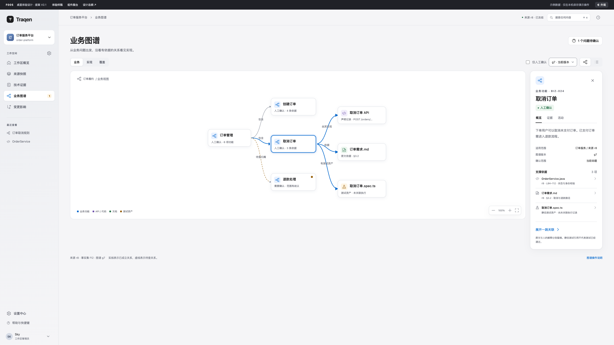

[Open original size](assets/previews/20-graph-display-light.png)

#### 27-inch display · Graphite Dark · 2560×1440

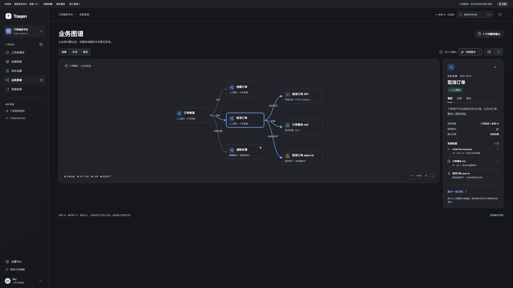

[Open original size](assets/previews/21-graph-display-dark.png)

### Workspace overview

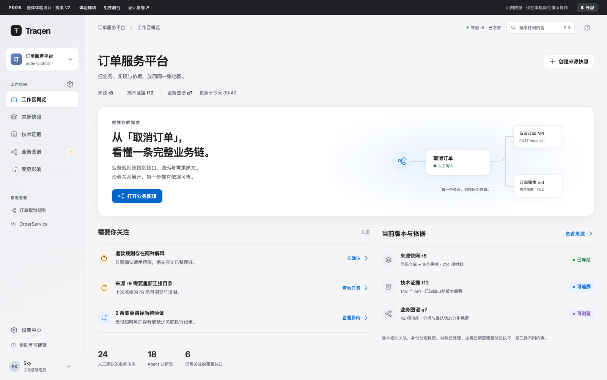

[Open original size](assets/previews/01-overview.png)

### Source snapshots

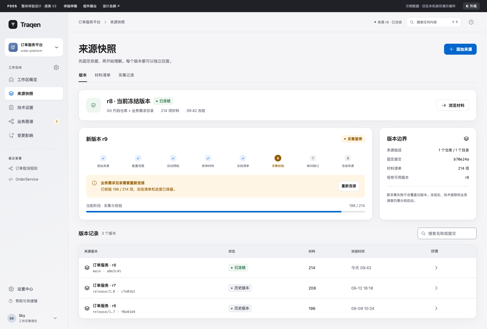

[Open original size](assets/previews/04-sources.png)

### Technical evidence

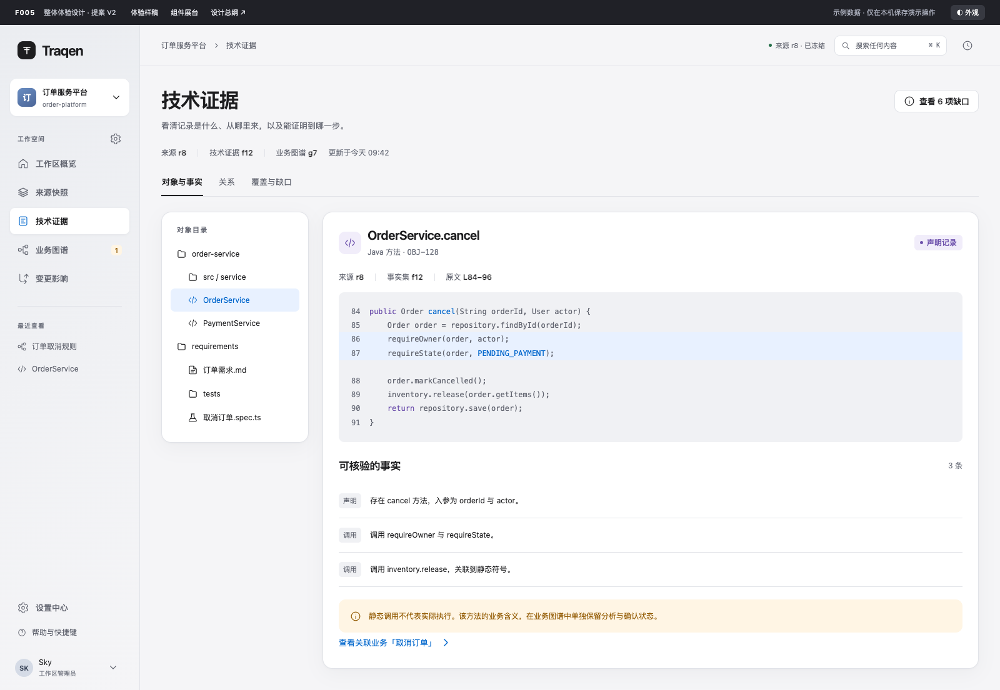

[Open original size](assets/previews/05-evidence.png)

### Settings

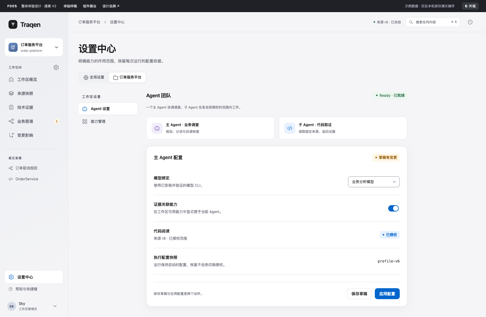

[Open original size](assets/previews/06-settings.png)

### Component showcase

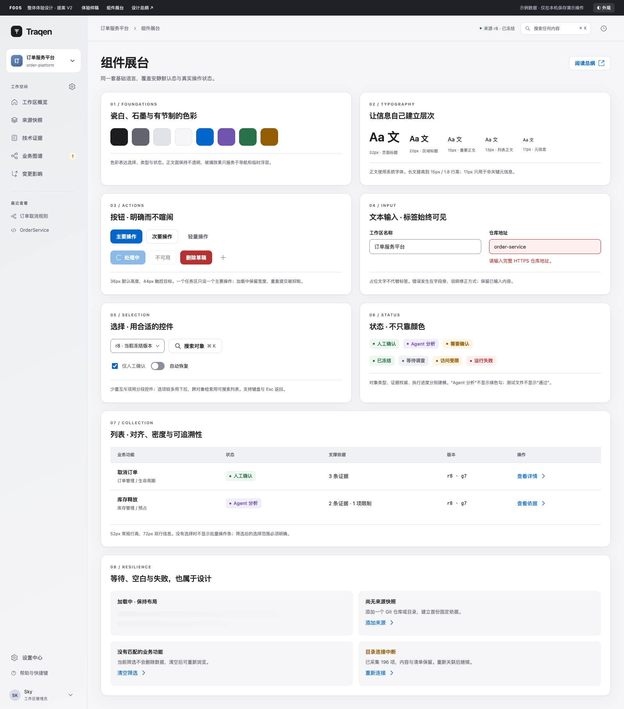

[Open original size](assets/previews/07-components.png)

### Form validation

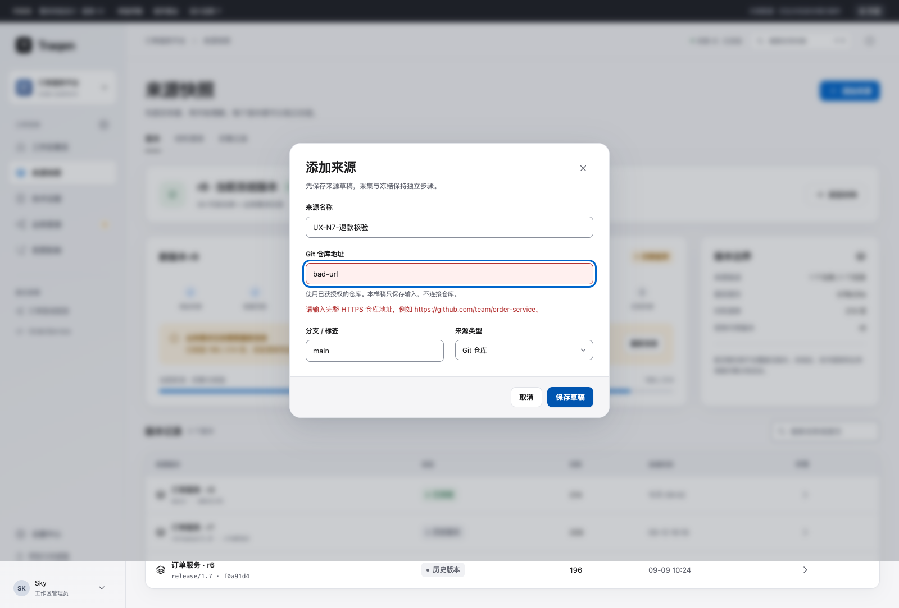

[Open original size](assets/previews/08-form-error.png)

### Form validation · dark

Invalid input and the source name remain visible, with a clear error message and focused field in the dark theme.

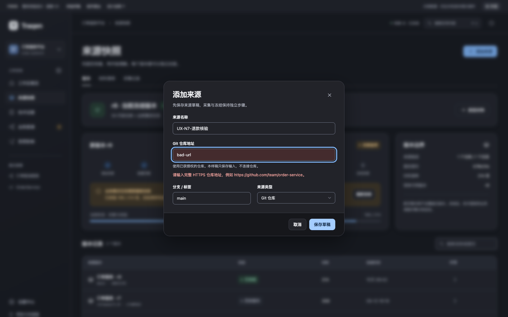

[Open original size](assets/previews/17-form-error-dark.png)

### Proposition confirmation

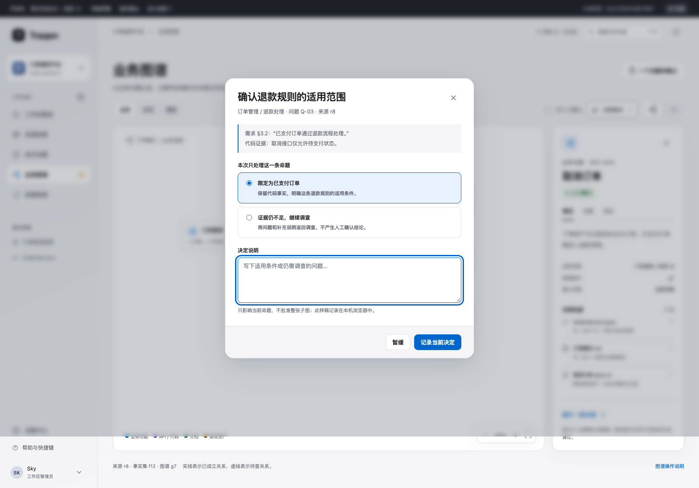

[Open original size](assets/previews/09-review.png)

### Global search

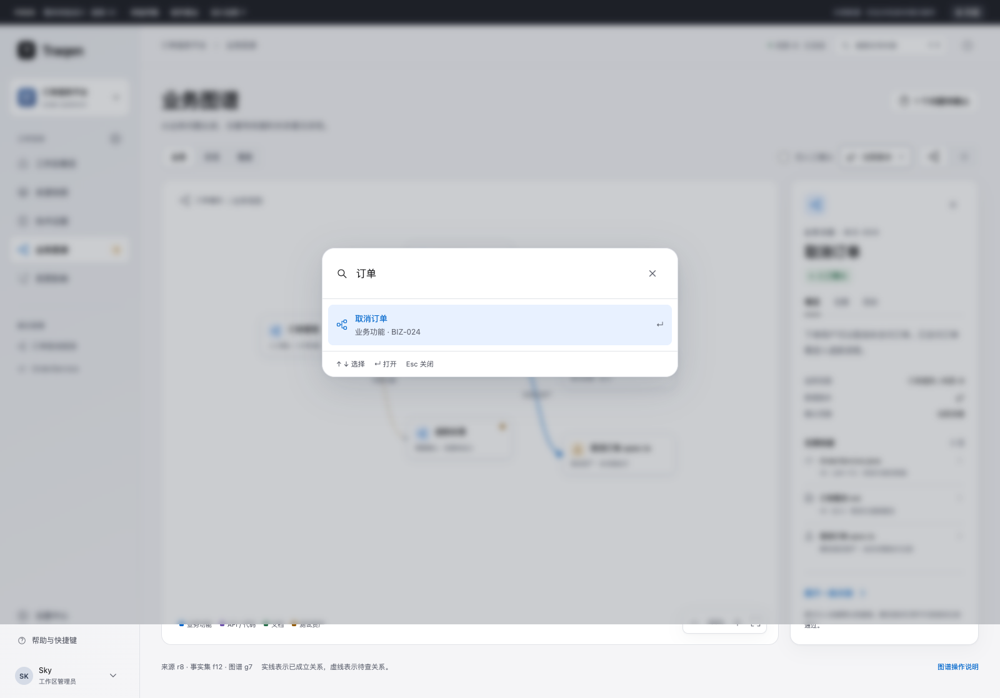

[Open original size](assets/previews/10-command.png)

### Change impact

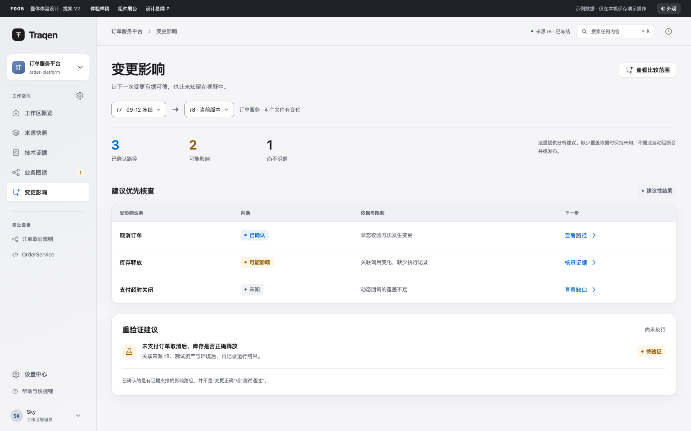

[Open original size](assets/previews/11-impact.png)

### Historical assets outside current scope

Old graph captures and five mobile images are historical assets, outside current design and acceptance scope.

## 01 · Design position

**Make understanding a complex system a calm, precise, traceable workspace.**

The interface must make the workspace, selected version, grounds for a conclusion, and next action immediately understandable. The “Porcelain and Graphite” direction uses a soft neutral canvas, opaque reading surfaces, clear text hierarchy, and restrained blue for selection and primary actions. Layout, typography, and spacing establish hierarchy before borders, shadows, or materials.

The earlier proposal organized navigation but did not establish a consistent visual and interaction language across pages and states. V2 redesigns the shell, graph, forms, lists, and feedback together. Screenshots come from the same components as the interactive prototype.

### Apple reference and adaptation

Apple's distinction between content and controls informs the design: navigation and floating controls may have a subtle material treatment; prose, code, tables, and graph nodes remain opaque. Avoid widespread blur, nested glass, and ornamental reflections. See Apple's [Meet Liquid Glass](https://developer.apple.com/videos/play/wwdc2025/219/). This is a Traqen adaptation, not a native-system replica or an Apple specification for the dimensions below.

Use professional application density and preserve long Chinese text, evidence, versions, and permission context. Do not reproduce macOS traffic-light controls, Apple branding, or redistribute Apple font assets.

| Principle | Observable behavior |
|---|---|
| Content before decoration | Clear object titles, quiet reading surfaces, focus on the explored graph path |
| One primary action per task area | One blue task action; destructive operations are not the default |
| Preserve object context | Side inspection; returning restores selection, filters, scroll, and version |
| Attach state to its object | Failure, restriction, staleness, and confirmation appear beside the affected entity |
| Make conclusions inspectable | Nodes and edges retain provenance, version, status, and applicable scope |
| Express unknowns honestly | Missing extraction is not absence; test assets are not passing executions; analysis is not human confirmation |

## 02 · F005 responsibility and domain boundaries

Propose expanding F005 from shell/navigation design into the frontend experience charter: information architecture, page patterns, foundations, components, states, desktop adaptation, and acceptance. Domain features continue to own business semantics, permissions, processes, and data contracts.

| Feature | Presentation responsibility | Domain decisions remain outside F005 |
|---|---|---|
| F001 | Source types, material inventory, capture, fixed identity, usable versions, recovery | Freezing, admission, phase transitions, permission rules |
| F002 | Objects, declarations, derived facts, deterministic relations, evidence, gaps | Extraction coverage, derivation rules, fact identity |
| F003 | Investigation, evidence routing, automatic analysis-state recording, human exceptions, versions | Evidence sufficiency, unit of confirmation, isolation/repair decisions |
| F004 | Comparison scope, impact paths, limitations, verification suggestions | Impact computation and execution contracts |
| F006 | Global assets, workspace enablement, Agent grants, run configuration snapshots | Effective capability evaluation, authentication, admission |

**The accepted F003 V2.0 panorama takes precedence over the older all-human-review assumption.** Sufficiently supported results may enter the graph as Agent analysis; humans handle ambiguity and other exceptions. A human decision applies to an explicit proposition or relation, never an entire subgraph by implication.

Source, fact-set, and graph versions have distinct identities. r8/f12/g7 are display labels, not a universal version field. Material processing, business investigation, and actual test execution are independent dimensions.

## 03 · Information architecture and navigation

| Main destination | User question | Views and functions | Typical next step |
|---|---|---|---|
| Workspace overview | What can I continue now? | Resume exploration, attention items, current evidence, recent tasks | Resume an object or resolve a specific blocker |
| Source snapshots | Which material are we interpreting? | Versions, inventory, capture history, add sources, configure scope | Read fixed materials or recover capture |
| Technical evidence | Which facts are directly verifiable? | Objects/facts, relations, coverage/gaps, code/original reading | Inspect evidence or related business |
| Business graph | How do business, implementation, and evidence connect? | Business/implementation/coverage projections, runs, questions, graph/list | Expand, inspect, resolve a proposition |
| Change impact | What might this change affect? | Version comparison, paths, limitations, revalidation advice | Inspect paths or attach execution records |
| Settings | Who uses which capability in what scope? | Global accounts/models/Skill/MCP; workspace Agent/capability settings | Repair, save, apply |

Navigation uses user-purpose labels rather than F numbers or internal pipeline phases. Sidebar: brand and workspace selector at top, primary destinations centrally, up to five clearable recent objects, settings/help/account at bottom. Provide a workspace-settings shortcut next to the workspace name. Handle unsaved edits before switching and load the destination workspace's own state.

The toolbar shows workspace/page context, a fixed-source summary, global search, and activity. Source, fact-set, and graph selectors identify their own version type; the toolbar source summary is not a universal selector.

Main navigation changes the work purpose and supports direct links and browser history. Tabs change content domains for the same task/object. Segmented controls change a projection or representation. Temporary inspection does not create a main destination; sharing, sustained editing, and comparisons can use a full details page.

Serialize appropriate queries, filters, sort, selection, and versions in URLs. Keep personal density locally; keep sensitive source text and credentials out of URLs. Returning restores position. Version changes cannot inherit prior confirmation silently. If an old object cannot be located, explain why and retain its original-version entry.

Proposed routing follows workspace → feature → object, with distinct version parameters. Implementation must align with the canonical router. Prototype hashes are demonstration navigation, not backend contracts.

## 04 · Page patterns and workflows

### A. Workspace overview

Organize around resume work, attention, and current evidence. Restore context before emphasizing totals; show three to five actionable issues at most. First-use empty states explain how to establish a source. Existing workspaces should not repeat marketing onboarding. The illustrated cancel-order chain links a business rule to an API and original requirements and provides an actual object-entry action. Metrics are secondary and have a defined scope.

### B. Source snapshots

Separate frozen versions from new capture. An interrupted r9 must leave r8 readable. Percentages require a fixed, known inventory denominator; before enumeration, show the phase and discovered count instead of invented progress.

Readable grouping: source/scope → preflight → enumeration/fixed inventory → capture/validation → gaps → freeze. F001 owns exact phase names and transitions; the compact visual progression is only a summary.

Reconnection identifies the affected source, preserved work, and required checks. Identity/inventory changes require a comparison before proceeding; do not inherit old progress automatically. Freezing offers downstream entry points but does not automatically launch extraction or investigation.

### C. Technical evidence

Use an object directory, a main reading surface, and optional inspection. Declarations show locations; derived facts show rules, premises, and original inputs. An API tree is one projection, not the whole fact product.

Code reading retains language, path, line numbers, fixed source, and location range. Highlight only relevant lines. Copy code and copy citation are separate actions. Restricted originals must not be rendered or prefetched, and a blank directory must not masquerade as absence.

### D. Business graph

Start from a domain or search hit and expand progressively. Business, implementation, and coverage use the same identified data, preserve selection, and explain hidden portions. The desktop inspector offers overview/evidence/activity. Edges are selectable and inspect their own evidence. Graph and list must both support reading objects and relations and filtering states.

### E. Change impact

Keep both compared identities, analysis scope, and time visible. Distinguish supported paths, possible impact, and unknowns, each with evidence and limitations. Suggestions remain unexecuted until a bound run, environment, version, and result exist. Missing edges or unknown coverage never automatically block merging, deployment, or release.

### F. Settings

Choose global or a named workspace first. Global assets define availability; workspaces enable capabilities; Agents receive explicit grants. Do not flatten these layers into one toggle.

Current constraints require one main Agent and at least one child. Show model CLI availability and authentication summaries; do not invent a direct-API execution path. Ready/Incomplete/Needs attention expand into reasons and repair links.

Distinguish current edits, saved draft, applied configuration, and run snapshot. Applying states its scope; existing runs retain launch configuration. A save toast cannot imply application or runtime success.

## 05 · Visual foundations and tokens

The following are Traqen proposal values, not Apple-prescribed sizes. Use semantic tokens instead of per-page approximate colors.

| Semantic role | Light | Dark |
|---|---|---|
| Canvas | #F5F5F7 | #16171B |
| Content surface | #FFFFFF | #222329 |
| Secondary surface | #F0F1F4 | #292B33 |
| Navigation surface | #EBEDF1 | #1C1D23 |
| Primary text | #1D1D1F | #F2F3F6 |
| Secondary text | #626570 | #B3B7C3 |
| Noncritical metadata | #6B6F7B | #9A9EAB |
| Decorative separator | #E1E3E8 | #3C3E48 |
| Necessary control boundary | #898F9B | #72788A |
| Interactive blue | #0066CC | #84BBFF |
| Blue soft surface | #E8F1FF | #263B59 |
| Established/available | #28714B | #8DCEAC |
| Attention | #945C05 | #EAC283 |
| Analysis/type assistance | #7054AD | #C2ACEF |
| Error/destructive | #B43232 | #FFAAA4 |

Decorative separators cannot be the only indication of a control. Status uses a quiet tinted surface plus explicit text; color alone is insufficient. Dark primary buttons use light blue with dark text, not an automatic inversion of white-on-blue.

### Default themes and future extension

| Stable ID | Name | Appearance | Default behavior |
|---|---|---|---|
| `light` | Porcelain Light | Light surfaces, graphite text, blue accent | First visit without a saved choice |
| `dark` | Graphite Dark | Dark surfaces, light text, pale-blue accent | Restore after explicit selection |

These are complete light/dark palettes; business-status colors retain their semantic roles. Switching preserves workspace, source/fact/graph identities, filters, selection, graph position, and unsaved input. The current choice stays recognizable, keyboard-selectable, and restored on reload.

The production selector consumes a theme collection and stores a stable `themeId`. Theme definitions contain `id`, `label`, `colorScheme` (light/dark), and complete semantic `tokens`. Built-ins use this same contract; new themes register without rewriting page components. Configuration cannot be limited to an `isDark` Boolean. A custom color editor or theme marketplace is outside this revision.

New themes cover backgrounds/surfaces, text, boundaries, interaction/selection, focus, disabled states, errors/warnings/success, code, and graph nodes/edges, including each relevant interaction state. Verify section 11 contrast and compare the same graph, component showcase, and error forms. Theme count changes neither information architecture nor domain-state enums.

The offline prototype retains its two-way switch to demonstrate the current defaults. The extensible registry remains an implementation requirement.

### Typography

System stack: -apple-system, BlinkMacSystemFont, PingFang SC, Segoe UI, Noto Sans SC, sans-serif. Use tabular numerals for numbers/versions and ui-monospace/Menlo/Consolas for code. Chinese body text has natural spacing, without negative tracking.

| Role | Size / line height | Weight |
|---|---|---|
| Page title, one h1 | 32/40 | 600–650 |
| Featured narrative | 28/38 | 600 |
| Section title | 20/28 | 600 |
| Small heading | 15/22 | 600 |
| Reading prose | 15/27 | 400 |
| Interface body | 13/20 | 400–500 |
| Important help/status | 12/18 | 400–550 |
| Noncritical microcopy | 11/16 | 400 |

Microcopy must not contain key errors or judgments. Target a reading width equivalent to 64–76 Latin characters. Long titles can wrap to two lines with full reading available. Truncated table cells can expand without relying exclusively on hover. Important identifiers wrap or copy without irreversible omission.

Spacing scale: 4, 8, 12, 16, 20, 24, 32, 40, 48, 64. Laptop baseline margins 34; display baseline 48 horizontally and 42 vertically; compact desktop windows 24–34. Between sections 24–32; inside sections 16–24.

Radii: status 6; input/button 9; graph nodes 11–12; panels 16. Avoid making every element a pill. Standard borders 1px; focus ring 3px with 3px offset; selected graph nodes use a 2px edge and soft outer halo.

Use content/floating/modal elevation tiers, with content nearly flat. Centralize stacking order: content → fixed navigation → inspector → backdrop → dialogs/menus → toast. Icons default to 18px with 1.5–1.75px strokes, one consistent family, and text or an accessible name; core icons are not emoji.

## 06 · Desktop dimensions, density, and layout

Only 14-inch laptops and 27-inch displays are in scope. Inches describe physical size, not CSS pixels; resolution, system scaling, browser zoom, and window size affect available space. These are design/capture baselines, not hardware-default claims.

| Scenario | Design viewport (CSS px) | Navigation and margins | Work surface |
|---|---|---|---|
| 14-inch laptop | 1440×900 | 224px sidebar; about 34px content margins | Graph plus approximately 300px inspector; primary actions first, secondary tools can wrap |
| 27-inch display | 2560×1440 | 244px sidebar; 48px horizontal / 42px vertical margins | Expanded analysis area; 300–360px inspector, comparison possible; bounded prose |

Additional desktop-window checks at 1280×800 and 1920×1080 cover reduced usable space/scaling without new device designs. Workspace, versions, key actions, and recovery remain reachable. Reduce secondary spacing, wrap tools, or reveal details on demand before reducing text size.

Both contexts use the same type and controls. Extra space increases visible content and analysis area; do not proportionally enlarge the laptop screen or stretch prose across the display. Graph labels stay stable; use pan, zoom, and progressive expansion. Tables expose configurable extra columns. Except for two-dimensional diagrams and necessary local table scrolling, ordinary content must not require horizontal scrolling.

Comfortable rows are 52px, two-line rows 72px, and compact single-line rows 40px. Density follows the task/user choice, not physical inches. Hit regions and visual size are separate. Hidden secondary data stays available in details; names, status, and recovery cannot disappear.

**Phones, tablets, narrow drawers, mobile details, and mobile-specific interactions are outside this revision's design and acceptance.** Previous 320/390/768px breakpoints and mobile artifacts are historical. Desktop keyboard, text enlargement, and browser-zoom reflow requirements remain; accessibility reflow does not create a mobile product scope.

## 07 · Frontend component standards

The common state vocabulary includes default, hover, pressed, focus-visible, disabled, loading, invalid, and readonly. Apply only meaningful states; mark others inapplicable. Components cannot guess authorization, fabricate success, or silently change domain versions. Distinguish asynchronous loading/error/retry/completion. Destructive actions explain object and consequence; navigation and reversible light actions do not need repeated confirmation.

| Component | Required anatomy and behavior |
|---|---|
| AppShell | Stable sidebar, contextual toolbar, main content, overlay host; stable navigation on both desktop contexts; closing overlays/details returns focus |
| WorkspaceSwitcher | Name, short ID, selected workspace, search; only accessible scopes; handle unsaved edits and unavailable destinations |
| NavItem | Icon, label, meaningful optional count, current state; aria-current and a non-color current indicator |
| PageHeader | One h1, explanation, context, task action; wrap within laptop windows and keep one primary action |
| Button | Primary/secondary/ghost/destructive; 36px default; loading preserves width and prevents duplicates; stable name and nearby disabled reason |
| IconButton | 18px icon in 36px desktop target with discernible spacing; aria-label; tooltip is supplementary |
| Link/TextButton | Destination versus operation uses correct semantics; external destinations clear; no nested row/button controls |
| TextField | Visible bound label, input, help, error; aria-invalid/describedby and preserved values |
| TextArea | Label, multiline input, length/save feedback; resizing; newline is not submit; IME composition never triggers premature submit |
| SearchField | Search, clear, result feedback; keyboard-clear; empty query differs from no results; async results do not steal focus |
| Select | Current value, limited options, disclosure; prefer native semantics; placeholder is not a real default; disabled options explain why |
| Combobox | Input, candidates, groups/help; arrows select, Enter commits, Escape returns; loading/no-results/failure distinct |
| Menu | Actions, groups, shortcuts, dangerous items; not a data selector; arrows/Home/End/Escape |
| SegmentedControl | Two to four mutually exclusive representations; readable current state and full labels |
| Tabs | Content-domain labels, selected underline/count; tablist/tab/tabpanel linkage; arrows/Home/End; automatic activation only for low-latency content |
| Checkbox | Multi-select and mixed state; “all” identifies current page versus all filtered results |
| RadioGroup | Mutually exclusive choices with explanations, fieldset/legend or equivalent; arrows; defaults have domain justification |
| Switch | On/off with scope; immediate change versus draft editing explicit; failure restores prior value and explains |
| StatusBadge | Text, small symbol, muted tint; object type, confirmation, and run progress remain separate models |
| Tooltip | Supplementary explanation; hover and focus, Escape dismissal; never the only critical information |
| Popover | Anchored temporary information/editing; boundary avoidance; focus returned on dismissal |
| Dialog/Sheet | Named title, affected object, body/actions; focus containment, Escape, return; safe initial focus for destructive confirmation |
| Inspector | Identity, state, explanation, evidence, activity; selection-driven, independent scroll, stable viewport, full-page option |
| EmptyState | Distinguish first-use emptiness, filtered no-results, restriction, and failure; relevant next action |
| InlineNotice | Reason and recovery at the object; blockers cannot be toast-only; avoid repetitive reader announcements |
| Toast | Lightweight completion/undo; not critical errors or long-running task truth; does not cover the primary action |
| Skeleton/Progress | Real layout, phase, known progress; unknown denominator stays indeterminate; reduced-motion stops shimmer |
| DataTable/List | Object/status/evidence/version/actions; consistent sorting, filters, selection scope, pagination, loading/empty/error/refresh |
| TreeView | Hierarchy, expansion, name, state; keyboard expansion, preserved selection, lazy loading, searchable list alternative |
| CodeViewer/EvidenceQuote | Source, path, range, original, citation; original versus explanation separated; fixed references; no restricted-text preloading |
| GraphCanvas/Node/Edge | Typed objects, directed relations, evidence inspection; graph/list share state and model |
| VersionSelector | Identity, time, availability, active version; version kinds labeled; unsaved-edit handling; no silent historical substitution |

Validate fields before submission, with server domain validation authoritative. First blur or submit may expose errors; clear corrected errors without flashing red during Chinese composition. Multiple failures have a focusable summary plus field-level repair guidance. Explain what failed and how to fix it. Preserve user input, while credentials follow their security requirements and never enter diagnostic prose.

Long choices show name and scope and support keyboard search. Async comboboxes prevent stale responses replacing newer queries. Removed/unauthorized selections remain visibly invalid with replacement actions rather than silently selecting the first option. Follow the [WAI-ARIA Combobox Pattern](https://www.w3.org/WAI/ARIA/apg/patterns/combobox/).

## 08 · Lists and information density

Default order: object → most decision-relevant status → evidence/limitations → version/time → action. Separate status dimensions into columns when needed. Align numbers right and names left; use consistent times with full values available.

Sortable headings expose direction and aria-sort. Filters stay visible; clearing filters does not delete data. Pagination defines totals and never invents an unknown count. Background refresh retains old results, filters, and selection; failure does not erase known content.

Show bulk controls only after selection, explicitly identifying current-page or all-filtered scope. Never carry selection silently across workspaces or versions. Bulk operations require domain authorization; human proposition confirmation cannot expand into wholesale graph approval.

Virtualized lists remain accessible to keyboard and assistive technology, with pagination when necessary. Keep cell labels and reusable loading/empty/no-results/partial-error/restriction states.

## 09 · Graph-specific standards

| Dimension | Visual encoding | Boundary |
|---|---|---|
| Object kind | Icon, type label, secondary color | Blue business, purple technical, green document, amber tests are type aids |
| Conclusion state | Explicit Agent analysis/human confirmed/investigating/needs confirmation/isolated text | Green is not universal human approval |
| Relation semantics | Arrow direction and verb | Bidirectional queries do not erase call/containment direction |
| Relation state | Solid/dashed plus text and details | Dashed means pending investigation, but style is not the only signal |
| Selection | Strong 2px boundary, soft halo, one-hop emphasis | Never changes the domain state |
| Restricted/invalid | Placeholder, reason, repair/history entry | Do not delete it visually and imply absence |

Nodes contain names and status/evidence summaries. Long names may use two lines; paths and source detail belong in the inspector. Use consistent type/size tiers rather than arbitrarily shrinking text. Edge hit regions exceed visible line width and work by keyboard. Show labels broadly for small graphs and near focus for larger ones. Reduce crossings; preserve valid cycles and direction.

Exploration requirements:

1. Enter through a domain, search result, or impact path with an initially readable local graph.
2. Selection retains position and opens details; emphasize one hop while leaving context legible.
3. Explicit one-hop expansion reports additions and hidden conditions and supports undo.
4. Aggregate large graphs before expansion; avoid random full-layout rearrangement.
5. Provide pan, zoom, fit, and previous-position controls; dragging is not the only input.
6. Filters remain visible; explain a hidden selection and allow restoring conditions.
7. List mode preserves objects, relations, origins, and statuses; both desktop contexts allow explicit graph/list choice.
8. Full-detail navigation returns to the same selection, expansion set, projection, zoom, and pan.

Coverage distinguishes material processing, business investigation, evidence, and actual test execution. Missing bound execution reads “no linked execution,” not a green pass.

Inspector order: identity/type → state → scope → source/fact-set/graph identities → supporting/counter evidence → original location → limitations/tasks → activity. An edge also shows endpoints, direction, type, and its own evidence. Each proposition explains how far evidence supports it. Human decisions retain person, time, target, scope, version, and note. A new source retains the old decision as history rather than inheriting its approval.

| Investigation routing | UI state and next action |
|---|---|
| Sufficient evidence | Record Agent analysis with grounds/scope; browse, investigate further, or review when needed |
| Insufficient evidence | Preserve investigation state and missing evidence; investigate further |
| Ambiguous rules | Queue a specific proposition with options/originals; confirm that proposition or investigate |
| No business explanation yet | Keep the material pending explanation in coverage; investigate from it |
| Invalid citation/permission/version | Isolate with repair reasons; repair the reference/access/version instead of asking business users to guess approval |

## 10 · States, feedback, and recovery

| State | Required presentation and preservation |
|---|---|
| Initial load | Actual-layout skeleton and explanation; no empty-state flash |
| Partial refresh | Previous content remains readable; affected region marked; selection/filters retained |
| Running task | Stage, known progress, object, recent activity; leaving and returning restores it |
| External wait | Dependency, affected step, inspect/retry entry; no fake advancing progress |
| Capture failure | Source, preserved count, prior usable version, recovery; never overwrite a frozen source |
| Permission failure | Restricted scope and authorization/contact entry; no secret/original leakage |
| Invalid reference | Original identity, reason, history/repair; no current-version replacement |
| Edit conflict | Local and latest differences; retained input and explicit choice |
| No results | Conditions and clear action; not “no data yet” |
| Complete | Object, scope, next action; save/application/execution distinguished |

Domain state drives errors consistently. Retry depends on actual recoverability; unrecoverable states do not offer empty retry loops. Traceable user decisions, tasks, and messages persist by default. Prototype localStorage is not the product persistence architecture.

## 11 · Motion and accessibility

Proposed microfeedback is 120–160ms; panels/navigation 180–240ms. Motion explains spatial change, not task-duration promises. Avoid continuous flashing, glowing graph nodes, or ornamental floating content.

Respect prefers-reduced-motion: remove translation, elasticity, and shimmer while retaining static feedback. Increased-contrast mode strengthens boundaries and removes unnecessary transparency. Independently check dark text, controls, badges, code, and graph edges rather than mechanically inverting colors.

Target WCAG 2.2 AA. Ordinary text requires 4.5:1 and large text 3:1; see [Contrast Minimum](https://www.w3.org/WAI/WCAG22/Understanding/contrast-minimum.html). Necessary control/graphic identification requires non-text contrast assessment; decorative lines cannot stand in for that boundary.

WCAG's target-size baseline is 24 CSS px with defined exceptions such as spacing; see [Target Size Minimum](https://www.w3.org/WAI/WCAG22/Understanding/target-size-minimum.html). Desktop icon buttons default to a 36px hit region, separate from visual icon size.

Acceptance includes keyboard flows, visible focus, no unintended focus traps, named dialogs and returned focus, Chinese IME, screen-reader status feedback, 200% text size, reflow at 400% zoom, and equivalent graph-list reading. The two-dimensional diagram can retain pan, but surrounding controls and prose remain readable.

## 12 · Component layers and state contracts

Use the existing React frontend after inspecting its components/dependencies. Do not introduce a new UI framework merely to reproduce this design. Standalone HTML/CSS/JS is a prototype, not a production-stack decision.

| Layer | Responsibility | Examples |
|---|---|---|
| Foundation | Semantic tokens, typography, spacing, motion, stacking | color/space/type/radius/motion |
| Primitive | Native semantics and interaction | Button, TextField, Select, Dialog |
| Composite | Reusable task structures | PageHeader, DataTable, Inspector, EmptyState |
| Domain | Business meaning and scoped identity | EvidenceReference, SourceTask, ClaimStatus, GraphEdgeDetail |
| Page | Data and process composition | Sources, evidence, graph, impact, settings |

Proposed component responsibilities:

- Button: variant, size, loading, disabled, accessibleLabel, onPress; no embedded permission evaluation.
- Field: id, label, description, error, required, readOnly; guaranteed accessible associations.
- DataTable: stable rowId, columns, sort, filters, selectionScope, loadingState, error, pagination; queries supplied by the page.
- Inspector: selectedEntity, context, activeTab, onClose, openFullDetail; never infer identity from the latest response.
- EvidenceReference: workspaceId, sourceIdentity, materialIdentity, locator, accessState; facts add factSetIdentity/factId, graph references add graphVersionIdentity and node/edge identity.
- ClaimStatus: analysisState, confirmationState, evidenceState, scope; not a single success boolean.
- GraphView: nodes, directedEdges, projection, filters, selection, expandedSet, viewport, onInspectNode/onInspectEdge; graph/list share the model.
- RunProgress: runId, stage, processed, totalKnown, blockedReason, recoverability, lastActivity; percentages only when the total is known.
- SettingsEditor: draft, savedDraft, appliedVersion, validation, runtimeSnapshotRefs; explicit save/application actions.

These are frontend responsibility proposals, not new backend endpoints or schema replacements. Adapt to authoritative contracts and correct mapping conflicts. Export tokens as CSS variables, prohibit scattered arbitrary colors, and include long content and real states in the showcase. Domain fixtures must not use production data.

## 13 · Quality gates and acceptance

Aesthetic acceptance includes main work surfaces, action results, and recovery, not only the home page. These are product implementation requirements, not claims of complete prototype certification.

| Area | Observable condition |
|---|---|
| Consistency | Shared typography, actions, inputs, statuses, and spacing across six pages |
| Source recovery | Prior source remains readable; phase/count/reason/action beside the task |
| Evidence | Nodes and edges reach fixed originals with identity and location |
| Graph semantics | Type/state independence, direction, analysis/confirmation distinction, equivalent list reading |
| Human decision | Only the selected proposition changes; others retain state; notes recover and history remains inspectable |
| Configuration | Global/workspace/Agent scopes distinct; draft/application separate; old runs do not hot-switch |
| Forms | Invalid input retained and focused; long Chinese/URLs fit; duplicate prevention |
| Accessibility | Keyboard, focus, readers, contrast, zoom, reduced motion per section 11 |
| Desktop layout | Core actions reachable at 1440×900 / 2560×1440 baselines and 1280×800 / 1920×1080 desktop-window checks; narrow screens are outside this gate |
| Themes | Same graph in both baseline viewports and themes; switching preserves domain/edit state, reload restores choice, new themes follow section 05 |
| Complete states | First-use empty, no-results, loading, partial failure, restriction, invalidity, conflict |
| Performance | Measured results identify failing data scales; screenshots are not performance evidence |

Proposed engineering targets, not achieved benchmarks: ordinary feedback below 100ms; prompt launch feedback for long tasks; initially validate a 100-node/200-edge local graph, then aggregate/load on demand at larger scales. If targets fail, change presentation/data strategy rather than silently dropping nodes.

Required journeys:

1. Unique source name → invalid address error → correction → save → list → survives reload.
2. Failed capture and known progress → reconnect → identity check → continue; old source remains readable.
3. Search cancel order → node → implementation relation → fixed evidence → original exploration position.
4. Read ambiguity evidence → write scope → decide only that proposition or investigate further → inspect record; no unrelated approval.
5. Fix comparison endpoints → read known/unknown paths → inspect evidence → obtain unexecuted validation advice.
6. Choose capability scope → edit draft → save → apply → identify the new-run configuration.
7. Cancel Order graph and evidence → switch themes → retain selection, versions, filters, graph position, and drafts → restore theme on reload.
8. Check both baselines and additional desktop-window sizes → reachable actions/status/details, stable type, bounded prose.

## 14 · Deliverables and explicit limits

This package presents fourteen desktop images (four new comparisons and ten existing states) and the offline prototype. V2 Pencil boards, older graph captures, five mobile images, and original verification remain historical assets. The complete charter is in these Markdown pages, the standalone reader, and inside the offline prototype. The six destinations plus component showcase use the same visual foundation.

| Area | Delivered proposal | Remaining product implementation |
|---|---|---|
| Pages/visuals | Seven views, laptop/display contexts, two default themes | Production-page migration and full browser acceptance |
| Interactions | Draft sources, search, selection, edges, filters, zoom, notes, configuration draft/application | Real identity, permission, persistence, async tasks |
| Graph | Local fixture, inspector, list, one-hop expansion | Full layout, large aggregation, complete list-edge details, historical versions |
| Technical evidence | OrderService code/fact example | All object categories and real source location |
| Settings | Scope and representative capability changes | Complete account/model/Skill/MCP editing and validation |
| Accessibility | Native semantics, labels, focus styling, keyboard examples, reduced motion | Reader testing, all widget patterns, zoom/browser certification |

[Desktop/theme verification](assets/desktop-themes-verification.json) records this revision separately. The V2 Pencil file is not updated for this scope; this charter controls current requirements. Legacy narrow-screen prototype behavior creates no current product requirement.

The fixture label is explicit. The prototype does not connect to entered repositories, collect directories, call models, execute tests, or change real business data. Offline demo notes use a dedicated browser storage namespace; embedded-chat interactions only guarantee current-page state. Production requires authorized backend persistence.

## 15 · Adoption and implementation sequence

After complete-proposal acceptance, integrate approved requirements into the authoritative F005 experience charter. Other features reference its visual/interaction standards instead of copying divergent tokens.

1. Semantic tokens, typography, AppShell, primitive showcase.
2. Sources and evidence, including forms, long lists, originals, and recovery.
3. Graph, inspector, edge evidence, and question queue following F003 V2.
4. Impact and settings scope, including read-only, invalid, conflict, and permission states.
5. Compare real rendering and journeys to this proposal, record deviations, then replace old styles after acceptance.

This revision does not modify canonical F005 specifications, architecture, ADRs, or lifecycle. Viewing/archiving the proposal is not formal adoption; approval of a color or dimension is not acceptance of the entire design.

## 16 · Sources and design record

Product sources were read on 2026-09-15; newer accepted material takes precedence over old overview wording:

- [F001 source-truth discussion](../../design/F001-workspace-source-truth/README.md).
- [F002 published functional design with the reviewed V4 panorama](../../design/F002-deterministic-facts/README.md).
- [F003 published V2 functional panorama](../../design/F003-traceability-graph/README.md).
- [F006 workspace capability settings](../../features/F006-workspace-capability-settings.md).
- [System requirements](../../architecture/traqen-system-requirements.md); newer F003 acceptance overrides old automatic-recording/confirmation assumptions.
- Revision authorization: 2026-09-17 03:09 UTC, message 0001789614562911-000019-617589c4; two desktop contexts, two expandable default themes, and explicit documentation permission. V2.1 supersedes old narrow-screen scope and acceptance, preserving domain boundaries.
- Original redesign request: 0001789458139802-000323-ea91580b; documentation-view request: 0001789530224292-000425-1446a766.

External references support only the cited Apple hierarchy/material ideas and W3C contrast, target-size, and combobox requirements. Traqen-specific colors, dimensions, component boundaries, layouts, and performance budgets are proposal judgments.

The corrective lesson: structural coverage alone did not establish visual/experience quality. V2 verifies representative interaction states, Chinese density, and standards together, with evidence → judgment → action → recovery as a page-check sequence. Future visual changes should include actual rendering of affected component states, not only a homepage screenshot.
