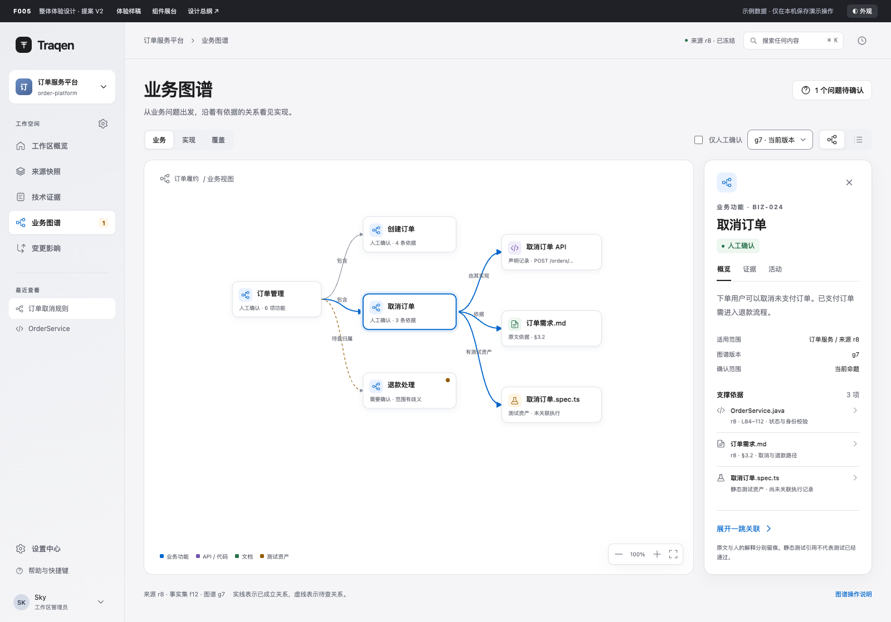
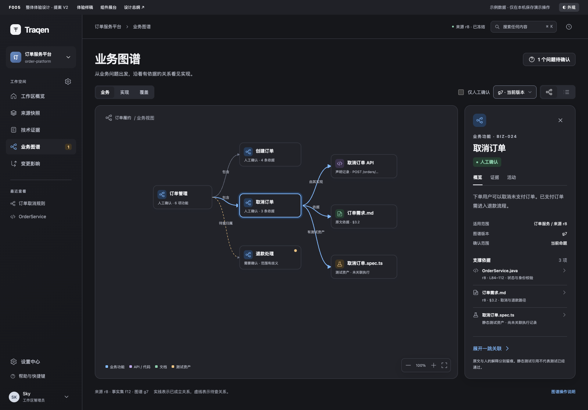
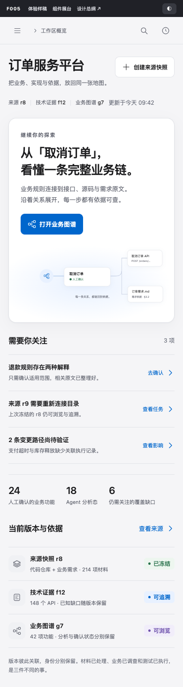
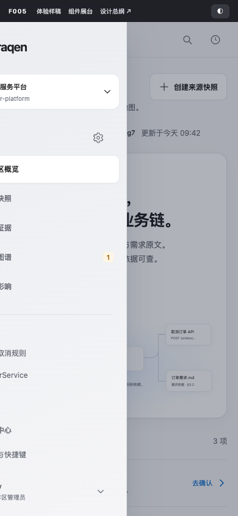
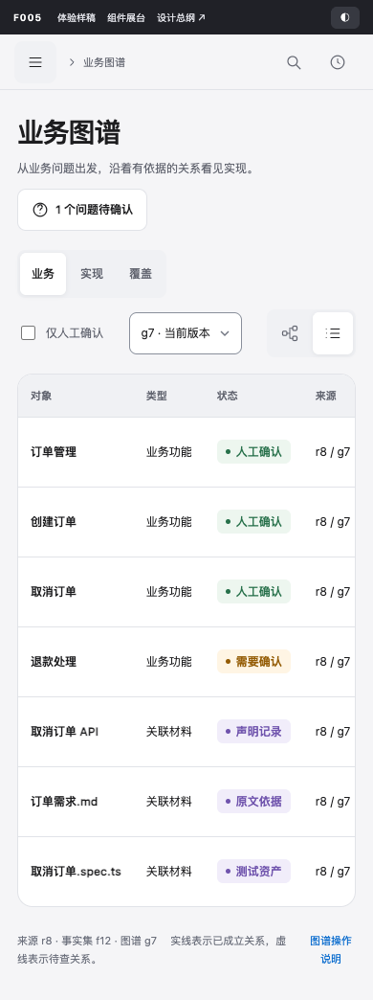
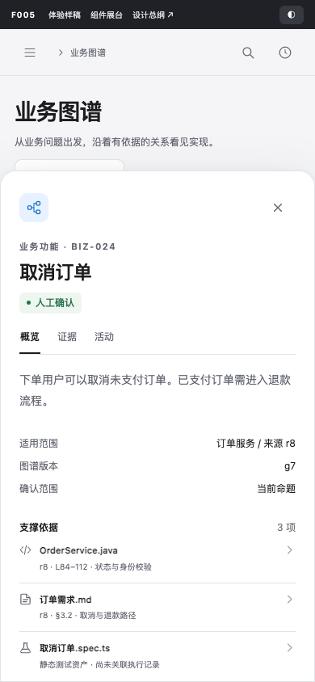

> 语言：**简体中文** · [English（可选参考）](README.en.md)

# F005 · Traqen 整体体验与前端设计总纲

> V2 完整评审提案 · 2026-09-15。效果图与交互样稿均使用构造数据。本提案尚未写入正式 Feature Spec，也不代表产品功能已经实现。

## 阅读入口与页面效果图

这份文档收录了 2026-09-15 已交付的完整 V2 提案，并按你 2026-09-16 03:43 UTC“你放到文档里面，我直接去文档里面查看”的要求，将效果图直接嵌入正文。**这是查看载体的整理，方案仍待评审；不表示正式 F005 已采用或获得实施授权。**

下方先看 16 张效果图，再读原提案的 16 节总纲。图片均为既有样稿的实际渲染，本次没有重绘或改变设计。

- [离线交互样稿（内含完整总纲，无需启动服务）](assets/Traqen-F005-review.html)
- [全部效果图浏览页](assets/gallery.html)
- [Pencil 核心设计板](assets/F005-layout-navigation-v2.pen)
- [原有样稿验证记录](assets/verification.json)

### 工作区概览

侧栏、工作区上下文、继续工作与需要关注。

[查看原尺寸](assets/previews/01-overview.png)

### 业务图谱 · 浅色

局部图、关系方向、选中高亮与右侧依据面板。

[查看原尺寸](assets/previews/02-graph-light.png)

### 业务图谱 · 深色

相同的信息层次，适配深色阅读。

[查看原尺寸](assets/previews/03-graph-dark.png)

### 来源快照

固定版本、新版本采集与中断恢复。

[查看原尺寸](assets/previews/04-sources.png)

### 技术证据

对象目录、固定原文与可核验事实。

[查看原尺寸](assets/previews/05-evidence.png)

### 设置中心

作用范围、Agent 团队、草稿与应用。

[查看原尺寸](assets/previews/06-settings.png)

### 组件展台

按钮、文本框、下拉、状态与列表的统一规范。

[查看原尺寸](assets/previews/07-components.png)

### 表单错误

保留输入，指出错误字段与修正方式。

[查看原尺寸](assets/previews/08-form-error.png)

### 命题确认

查看依据后，只对当前命题记录决定。

[查看原尺寸](assets/previews/09-review.png)

### 全局搜索

搜索页面和对象，支持键盘定位。

[查看原尺寸](assets/previews/10-command.png)

### 变更影响

版本比较、有据路径、可能影响与未知。

[查看原尺寸](assets/previews/11-impact.png)

### 窄屏概览

单列内容、工作区入口与主要动作。

[查看原尺寸](assets/previews/12-mobile-overview.png)

### 窄屏导航

抽屉展示完整导航。

[查看原尺寸](assets/previews/13-mobile-navigation.png)

### 窄屏图谱列表

先保证逐行阅读，再按需进入画布。

[查看原尺寸](assets/previews/14-mobile-graph-list.png)

### 窄屏详情

底部展开对象详情与依据。

[查看原尺寸](assets/previews/15-mobile-detail.png)

### 窄屏深色设置

能力作用范围和编辑状态。

[查看原尺寸](assets/previews/16-mobile-dark-settings.png)

## 01 · 设计主张

**把复杂系统的理解过程，做成一个安静、精确、可追溯的工作空间。**

Traqen 是持续理解业务、技术实现和变化影响的专业工具。用户应能快速知道：我在哪个工作区、正在查看哪个版本、这里的结论凭什么成立、下一步能做什么。

本次选择“瓷白与石墨”：大面积柔和中性背景，不透明的正文面，深浅明确的文字，蓝色只突出选中与主要动作。层次首先由位置、字号和间距建立；边框、阴影和材质只在有分组或空间意义时出现。

上一版的不足不是缺几个精致组件，而是缺少贯穿页面、任务、状态与细节的统一语言。V2 因此同时重做导航、主要工作面、图谱、表单、列表和状态系统；以同一套组件生成效果图和可操作样稿，减少“设计稿漂亮，实际状态失真”的落差。

### Apple 风格的取舍

借鉴 Apple 对内容与控制层次的区分：导航、浮动控制可以有轻微材质感；长文、代码、表格和图谱节点使用稳定的不透明底色。避免大面积模糊、玻璃叠玻璃和纯装饰反光。该取舍参考 Apple 的 [Meet Liquid Glass](https://developer.apple.com/videos/play/wwdc2025/219/)；它是 Traqen 的设计选择，不宣称复刻原生系统。

Traqen 采用专业应用的信息密度，保留长中文、版本、证据和权限信息。没有仿 macOS 窗口红黄绿灯，没有 Apple 标志，不要求下载或分发 Apple 字体资产。

### 六条贯穿规则

| 规则 | 页面上的具体体现 |
|---|---|
| 先内容，后装饰 | 页面标题明确对象；正文面安静；图谱只强调当前探索路径 |
| 一个任务区，一个主动作 | 当前任务只有一个蓝色主按钮；危险操作不充当默认动作 |
| 同一对象保持上下文 | 详情在侧面展开；返回保留选择、筛选、滚动与版本 |
| 状态跟着对象出现 | 失败、受限、过期和待确认显示在对应行、节点或任务旁 |
| 结论可以回查 | 节点和关系均有来源、版本、依据、状态和适用范围 |
| 未知被准确表达 | 未提取不等于不存在；测试资产不等于执行通过；分析态不等于人工确认 |

## 02 · F005 的职责与业务边界

建议把 F005 从“总体布局及导航”扩展为**所有前端页面的体验总纲**：负责信息架构、页面模板、视觉基础、组件规范、交互状态、响应式与验收标准。各 Feature 继续决定业务对象、处理流程、权限和数据契约，F005 统一它们的呈现方式。

| 归属 | F005 必须承接的业务事实 | 不由 F005 自行改变 |
|---|---|---|
| F001 来源真相 | 多种来源、材料清单、采集过程、固定身份、可用版本与恢复 | 来源冻结规则、准入规则、任务阶段与权限 |
| F002 确定性事实 | 对象、声明、派生事实、确定性关系、依据和缺口 | 可提取范围、推导规则和事实身份 |
| F003 业务图谱 | 调查、证据路由、分析态自动入库、例外的人类确认、图谱版本 | 证据充分性、业务确认单位、隔离与修复判定 |
| F004 变更影响 | 比较范围、影响路径、判断限制、建议验证 | 影响计算和验证执行契约 |
| F006 能力配置 | 全局资产、工作区启用、Agent 授权、运行配置快照 | 有效能力求值、认证与执行准入 |

**本次以 F003 已确认 V2.0 为准。** 不沿用旧设计“所有业务候选必须人工确认后才可进入图谱”的假设。证据充分的结果可以以 Agent 分析态记录；人工处理规则歧义等例外。人工确认只作用于明确的命题或关系，不能一键批准整张子图。

来源版本、事实集版本、业务图谱版本是不同身份。示例中 r8、f12、g7 只是便于阅读的显示名，不可用一个通用 version 字段替代。技术提取完成、业务材料已调查、测试已经执行也是三个独立维度。

## 03 · 信息架构与导航

### 主导航

左侧导航按用户目的命名，不以 F 编号或内部流水线阶段命名。F 编号出现在研发文档中，不进入日常产品导航。

| 一级入口 | 回答的问题 | 二级视图 / 页面功能 | 常见下一步 |
|---|---|---|---|
| 工作区概览 | 我现在可以继续做什么？ | 继续探索、需要关注、当前版本与依据、近期任务 | 回到对象或解决具体阻塞 |
| 来源快照 | 我们在理解哪一份材料？ | 版本、材料清单、采集记录；添加来源；范围配置 | 浏览固定材料 / 恢复采集 |
| 技术证据 | 哪些事实可以直接核验？ | 对象与事实、关系、覆盖与缺口；代码/原文阅读 | 回查依据 / 转到关联业务 |
| 业务图谱 | 业务、实现和依据怎样连接？ | 业务、实现、覆盖三种投影；调查运行；待确认问题；图/列表 | 展开关联 / 阅读依据 / 处理命题 |
| 变更影响 | 这次变化可能影响哪里？ | 版本比较、影响路径、限制、重验证建议 | 回查路径 / 补充执行记录 |
| 设置中心 | 谁以什么能力在什么范围工作？ | 全局：账号、模型、Skill、MCP；工作区：Agent 设置、能力管理 | 修复配置 / 保存并应用 |

侧栏顶部固定品牌与工作区切换；中部为主导航；“最近查看”最多 5 项并允许清空；底部放设置、帮助和当前账号。当前工作区名称旁提供设置快捷入口。切换工作区先处理未保存编辑，再进入目标工作区自己的状态。

顶部工具栏包含工作区/当前页面上下文、当前固定来源摘要、全局搜索和活动入口。版本切换必须在其所属页面标明是来源、事实集还是业务图谱；不能把顶部来源摘要误当成所有页面的通用版本切换器。

### 导航、Tab 和局部视图的区别

- 主导航改变主要工作目的；浏览器前进/后退有效，页面支持直接打开。
- Tab 改变同一对象或同一任务下的内容域，例如“对象 / 关系 / 缺口”。
- 分段控件改变同一组数据的投影或表现，例如“业务 / 实现 / 覆盖”和“图 / 列表”。
- 临时详情不创建新的主导航项。需要分享、长时间编辑或跨对象比较时，提供完整详情页。
- 查询、筛选、排序、选中对象和版本应可序列化到 URL；个人密度偏好可存本地；敏感原文和凭据不进入 URL。
- 返回列表保留查询与位置；切换版本不偷偷复用旧确认。无法定位历史对象时解释原因，并保留原版本入口。

建议路由结构为 workspace → feature → object，参数分别承载来源、事实集、图谱版本。具体 URL 在实现时与路由真相源对齐；本样稿的 hash 是演示导航，不是后端契约。

## 04 · 页面模板与主要工作流

### A. 工作区概览

使用“继续工作 + 需要关注 + 当前依据”结构。恢复上次上下文优先于大数字；最多展示 3–5 条需要行动的事项。新用户空态解释首个来源的建立方式；已有工作区不重复展示入门营销内容。

当前设计的引导面板连接“取消订单”到 API 与需求原文。它说明 Traqen 的价值，同时提供真实进入对象的动作。统计仅作辅助，必须能解释统计范围。

### B. 来源快照

冻结版本与进行中的新采集分区展示。r9 采集中断时，r8 仍为可用的固定来源。进度只使用已建立清单后的真实分母；枚举前显示当前阶段与已发现数量，不伪造百分比。

来源工作流承接 F001 的阶段，不重新发明处理状态。可读层次为：来源与范围 → 预检 → 材料枚举和固定清单 → 采集校验 → 缺口处置 → 来源冻结。正式阶段名称、转换条件以 F001 为准，紧凑进度条只是摘要。

重新连接显示受影响来源、已保留内容、下一步核对什么。身份或清单改变时先展示差异；不能直接继承旧任务进度。来源冻结成功后提供后续入口，但不自动启动技术提取和业务调查。

### C. 技术证据

采用对象目录、主要阅读面和按需详情结构。默认显示声明及定位；派生事实必须标出推导规则、前提和原始输入。API 树是可选投影，不代表全部技术证据。

代码视图保留语言、路径、行号、固定来源和定位范围；选中事实时只高亮相关行。复制代码与复制引用分开。权限不足时不能渲染原文预览；对象目录不能用空白冒充“没有内容”。

### D. 业务图谱

默认从某个业务领域或搜索命中对象开始，逐步展开。业务、实现、覆盖使用同一批带身份的数据；切换投影保留当前对象，并解释被筛选隐藏的部分。

桌面右侧检查器包含“概览 / 证据 / 活动”，不把所有信息挤进节点。关系本身可选中并回查依据。图谱和逐行列表都必须可以完成对象阅读、关系阅读和状态筛选。

### E. 变更影响

固定显示比较两端及其身份、分析范围和时间。区分“有依据的影响路径”“可能影响”“未知”，每项都给出依据和限制。测试建议明确标注未执行；只有有关联运行、环境、版本与结果时，才呈现执行结论。

此页面提供建议，不因为图中缺边或覆盖未知就自动阻断合并、部署或发布。

### F. 设置中心

顶层先选择全局或具体工作区；全局拥有资产目录，工作区启用能力，Agent 获得显式授权。两层能力清单不能混成一个总开关。

一个主 Agent 与至少一个子 Agent 是当前业务约束。模型绑定显示 CLI 可用性和认证摘要；不制造直接 API 执行入口。Ready、Incomplete、Needs attention 必须能展开原因和跳到修复位置。

编辑值、已保存草稿、已应用配置、运行使用的快照分别可辨。应用前展示作用范围；现有运行保持启动配置。不能通过“保存成功”的 toast 暗示已经对运行生效。

## 05 · 视觉基础与设计 Token

以下数值是 Traqen 的实现基准提案；不冒充 Apple 官方尺寸。统一使用语义 token，不允许页面临时选近似灰色和蓝色。

### 颜色

| 语义 | 浅色 | 深色 | 使用边界 |
|---|---|---|---|
| 页面背景 | #F5F5F7 | #16171B | 大面积画布 |
| 内容表面 | #FFFFFF | #222329 | 阅读面、表格、节点 |
| 次级表面 | #F0F1F4 | #292B33 | 分段底板、轻分组 |
| 导航底色 | #EBEDF1 | #1C1D23 | 侧栏层次 |
| 主要文字 | #1D1D1F | #F2F3F6 | 标题、正文、重要值 |
| 次要文字 | #626570 | #B3B7C3 | 说明和次要字段 |
| 元信息 | #6b6f7b | #9A9EAB | 非关键时间、辅助信息 |
| 装饰分割线 | #E1E3E8 | #3C3E48 | 不能单独承担交互控件识别 |
| 控件边界 | #898F9B | #72788A | 输入框、选择框的必要轮廓 |
| 交互蓝 | #0066CC | #84BBFF | 主要操作、选中、链接、焦点 |
| 蓝色浅底 | #E8F1FF | #263B59 | 选中背景 |
| 成立 / 可用 | #28714B | #8DCEAC | 与文字状态一起出现 |
| 注意 / 待处理 | #945C05 | #EAC283 | 需操作、有歧义 |
| 分析 / 类型辅助 | #7054AD | #C2ACEF | Agent 分析、技术对象类型 |
| 错误 / 危险 | #B43232 | #FFAAA4 | 错误说明、破坏性操作 |

状态使用对应低饱和浅底；浅底不承载唯一语义。深色主按钮使用浅蓝底与深色字，不能直接把浅色白字方案反转。

### 字体与排版

系统字体栈：-apple-system、BlinkMacSystemFont、PingFang SC、Segoe UI、Noto Sans SC、sans-serif。数字和版本使用 tabular-nums；代码使用 ui-monospace、Menlo、Consolas。中英文混排自然，中文正文不使用负字距。

| 层级 | 字号 / 行高 | 字重 | 使用 |
|---|---|---|---|
| 页面标题 | 32 / 40；窄屏 28 / 36 | 600–650 | 每页一个 h1 |
| 重点叙述 | 28 / 38 | 600 | 概览中的继续工作区域 |
| 区域标题 | 20 / 28 | 600 | 大区域、主要面板 |
| 小标题 | 15 / 22 | 600 | 行标题、字段分组 |
| 阅读正文 | 15 / 27 | 400 | 需求原文、解释、决定说明 |
| 工作界面正文 | 13 / 20 | 400–500 | 导航、列表、按钮 |
| 关键辅助与状态 | 12 / 18 | 400–550 | 版本、状态、字段帮助 |
| 非关键微文案 | 11 / 16 | 400 | 稀疏元信息，不放错误或核心判断 |

正文连续阅读宽度建议 64–76 个拉丁字符等效宽度。长标题最多两行，保留完整阅读入口。表格单元格截断时可展开，不仅依赖鼠标悬停。重要 ID 可换行或复制，不能不可恢复地省略。

### 间距、形状与层级

- 间距阶梯：4、8、12、16、20、24、32、40、48、64。4 是基础步长。
- 页面边距：桌面 32–40；紧凑桌面 24；手机 18–20。区块间距 24–32，区块内部 16–24。
- 圆角：状态 6；输入/按钮 9；节点 11–12；面板 16；移动详情 20。无需把每个矩形变成胶囊。
- 边框通常 1px；焦点环 3px + 3px 外间隙；选中图谱节点 2px 并配浅色外圈。
- 阴影分 content、floating、modal 三层；内容层接近无阴影，浮层可辨且柔和。
- 层级顺序：正文 → 固定导航 → 浮动检查器 → 遮罩 → 对话框/菜单 → toast。z-index 由统一层级表控制。
- 图标默认 18px、1.5–1.75px 线宽；导航和操作优先同一图标集。图标有明确文字或可访问名称；不以 emoji 代替核心图标。

## 06 · 页面尺寸、密度与响应式

| 宽度 | 导航 | 内容与详情 | 表格 / 图谱 |
|---|---|---|---|
| ≥1680 | 244px 侧栏 | 阅读区可限宽；分析画布伸展 | 检查器 320–360px，允许并列比较 |
| 1280–1679 | 224px 左右 | 页面边距 32–34px | 图谱 + 约 300px 检查器 |
| 1024–1279 | 200px | 压缩次要间距，不缩核心文字 | 检查器约 270–300px；必要时覆盖 |
| 768–1023 | 184px 或用户主动折叠 | 单列工作面；检查器临时覆盖 | 工具条换行；重点列优先 |
| 390–767 | 抽屉导航 | 单列，详情底部展开或独立页 | 默认列表；用户可切图；表格局部横滚 |
| 320–389 | 抽屉导航 | 保留核心阅读和操作 | 不以整体缩放桌面页面适配 |

支持舒适和紧凑两种桌面密度。舒适行为 52px，含说明的双行为 72px；紧凑模式单行 40px。触控场景保持至少 44px 的目标尺寸或等效命中区域。控件视觉高度与命中区域是两个属性。

分析画布可二维平移，页面其余区域不能依赖横向滚动阅读正文。隐藏非核心列时提供列配置或详情，不删除状态、对象名称和恢复动作。图谱在窄屏默认逐行阅读，而不是把七个节点缩成不可读的小点。

## 07 · 前端组件规范

### 共同契约

基础组件统一覆盖 default、hover、pressed、focus-visible、disabled、loading、invalid、readonly；不是每个组件都机械拥有全部状态，未适用的状态明确排除。

组件不得在内部猜权限、伪造成功或自行改变业务版本。异步组件接收可区分的加载、失败、重试和完成状态。危险动作必须知道对象和后果；普通导航和可撤销轻操作不重复确认。

| 组件 | 外观 / 解剖 | 交互与状态标准 |
|---|---|---|
| AppShell | 工作区侧栏 + 顶部上下文 + 主内容 + 浮层宿主 | 导航稳定；窄屏抽屉可 Esc/点击遮罩关闭；焦点回触发器 |
| WorkspaceSwitcher | 名称、简短标识、当前项、搜索 | 列出可访问范围；未保存编辑先处置；目标不可用解释原因 |
| NavItem | 图标、名称、可选数量、当前态 | aria-current；计数必须有对象含义；活动页不能只靠颜色 |
| PageHeader | h1、说明、上下文、当前任务动作 | 只有一个主动作；标题和动作窄屏换行不互挤 |
| Button | primary、secondary、ghost、destructive；默认 36px | loading 保宽并禁重复提交；可访问名称稳定；禁用原因邻近可读 |
| IconButton | 18px 图标，36px 桌面目标 | aria-label；tooltip 仅辅助；触控目标 44px |
| Link / TextButton | 链接表示目的地，按钮表示操作 | 用正确语义；外部跳转明确；不把整行和内部按钮嵌套 |
| TextField | 可见 label、输入区、帮助、错误 | label 绑定 id；错误用 aria-invalid/aria-describedby；保留输入 |
| TextArea | label、多行输入、长度/保存反馈 | 自适应或手动调整；换行不提交；中文输入法组合态不触发快捷提交 |
| SearchField | 搜索图标、输入、清空、结果反馈 | 清空可键盘操作；无结果与尚未输入不同；异步结果不抢焦点 |
| Select | 有限选项、当前值、展开指示 | 优先原生语义；占位不当默认已选；不可选项带原因 |
| Combobox | 可输入值 + 候选列表 + 分组/说明 | 上下键移动，Enter 选择，Esc 返回；加载/无结果/失败清晰 |
| Menu | 动作列表、分组、快捷键、危险项 | 用于执行动作，不代替数据选择器；方向键、Home/End、Esc 可用 |
| SegmentedControl | 同一面板的 2–4 种互斥投影 | 当前态可辨；不装过多长标签；响应式保持完整命名 |
| Tabs | 内容域标签、当前下划线、可选数量 | tablist/tab/tabpanel 关联；方向键和 Home/End；自动激活仅用于低延迟内容 |
| Checkbox | 独立多选、全选/部分选中 | 部分选中用 mixed；全选明确是当前页还是全部筛选结果 |
| RadioGroup | 互斥选项、每项解释 | fieldset/legend 或等价名称；方向键可选；默认值必须有业务依据 |
| Switch | 开/关能力或偏好，旁有作用说明 | 即时生效与编辑草稿明确区分；失败恢复原值并说明 |
| StatusBadge | 文案 + 小符号 + 低饱和底 | 字面状态是权威；类型/确认/运行状态不同维度不得共用一个枚举 |
| Tooltip | 简短辅助解释 | hover 与 focus 均可触发；可 Esc 关闭；不用来承载唯一关键说明 |
| Popover | 临时信息或轻编辑 | 锚定触发器；边缘自动避让；关闭后归还焦点 |
| Dialog / Sheet | 标题、作用对象、正文、动作 | 焦点约束、Escape、返回焦点；破坏性操作默认焦点在安全动作 |
| Inspector | 对象身份、状态、说明、证据、活动 | 选择对象更新内容；独立滚动；关闭不丢画布位置；可打开完整详情 |
| EmptyState | 场景说明 + 下一步 | 首次空白、筛选无结果、权限受限、加载失败分别设计 |
| InlineNotice | 对象旁的原因与恢复动作 | 阻塞不能只发 toast；读屏播报不重复刷屏 |
| Toast | 轻量成功反馈与可选撤销 | 不承担关键失败与长期任务状态；不遮挡主动作 |
| Skeleton / Progress | 对应真实布局 / 阶段和已知进度 | 无分母用不确定进度；减少动态模式停掉闪烁 |
| DataTable / List | 对象、状态、证据、版本、操作 | 排序、筛选、分页、选择范围、空/错/刷新状态统一 |
| TreeView | 层级、展开标识、名称、状态 | 方向键折叠展开；保留选择；长目录按需加载并有列表检索替代 |
| CodeViewer / EvidenceQuote | 来源、路径、范围、原文、引用动作 | 原文与解释分区；复制可定位引用；受限内容不得预加载泄露 |
| GraphCanvas / GraphNode / GraphEdge | 图形浏览、节点类型、关系方向、证据入口 | 详见第 09 节；图与列表同一数据和状态来源 |
| VersionSelector | 版本身份、时间、可用性、当前使用 | 三类版本各自标注；切换前处置未保存编辑；失效对象不静默替换 |

### 输入和校验细则

提交时先做字段校验，再提交请求；服务端业务校验仍是最终依据。字段在首次离焦或提交后提示错误，之后可以及时清除已修正错误；不要在中文尚未输入完时显示红色错误。

多字段错误在表单顶部给摘要并可跳到字段，同时各字段保留具体修正方式。错误信息包含“什么不满足”和“怎么修正”，避免只写“非法参数”。失败保留已有内容；密码、令牌等敏感字段按安全要求处理，不进入诊断正文。

长选项显示完整名称与作用域，支持键盘检索。异步 Combobox 防止旧请求覆盖新查询结果。选择项被权限或配置变化移除时显示失效项与替换操作，不自动悄悄选择第一项。键盘行为以 [WAI-ARIA Combobox Pattern](https://www.w3.org/WAI/ARIA/apg/patterns/combobox/) 为实现依据。

## 08 · 列表与信息密度

默认列顺序：对象 → 最关键状态 → 依据/限制 → 版本或更新时间 → 行动作。多个状态维度可以分列，但优先展示影响当前判断的一项。数字右对齐，名称左对齐，时间使用一致格式并能查看完整时间。

排序表头提供方向与 aria-sort；筛选条件在工具条可见；“清空筛选”只清查询，不删除数据。分页保留总量定义，未知总量不用假数字。后台刷新保留旧列表并标记刷新中，失败不清空已知结果。

仅勾选后出现批量操作条，并明确“已选当前页 N 项”或“全部匹配 M 项”。不允许跨版本、跨工作区悄悄继承选择。批量动作仅用于业务允许的同质操作，绝不把人工确认命题扩大成批量批准图谱。

长列表可虚拟化，但读屏与键盘定位必须可用；必要时提供分页模式。重要单元格不能因虚拟化失去标签。表格加载、空态、无结果、部分失败、权限不足均提供同一套可复用骨架和提示。

## 09 · 图谱专属规范

### 视觉语法

| 维度 | 表达方式 | 禁止混淆 |
|---|---|---|
| 对象类型 | 图标 + 类型标签 + 辅助色 | 蓝色业务、紫色技术、绿色文档、琥珀测试仅为类型辅助 |
| 结论状态 | 明确文字：Agent 分析、人工确认、待调查、需要确认、隔离 | 不能把所有绿色节点解释为人工认可 |
| 关系语义 | 有方向的箭头 + 动词标签 | 双向查询不把“调用”“包含”变成无向关系 |
| 关系状态 | 实线/虚线 + 文字 + 详情 | 虚线表示待查；不能只靠虚实线承载唯一语义 |
| 选中 | 2px 强边界 + 淡色外圈 + 一跳高亮 | 不改变原始业务状态 |
| 受限 / 失效 | 占位对象 + 原因 + 修复或回查入口 | 不以删除节点制造“没有关系”的假象 |

节点首行是对象名，辅助行是当前状态与依据概况；长标题允许两行。API 路径、源码位置等细节在检查器阅读。相同节点类型和尺寸档位全图一致；节点密度变化有离散档位，不任意缩小文字。

边的点击命中区域应比可见线宽更宽，并支持键盘访问。小范围图可显示边标签，大范围图只显示焦点附近标签；不能通过隐藏标签改变关系语义。交叉尽量减少，循环关系可以存在并应保持方向。

### 探索过程

1. 从领域、搜索结果或变更路径进入，初次只显示可读的局部图。
2. 选中节点时保留位置并打开检查器；高亮相关一跳，其他节点适度减弱但仍可辨。
3. 显式“展开一跳关联”追加邻居；显示新增数量、隐藏条件和可撤销展开。
4. 大图先聚合再展开；展开不应让整张图随机重排。
5. 平移、缩放、适应画布、返回上一探索位置都提供按钮；拖动不是唯一操作方法。
6. 开启筛选后显示条件；当前对象被筛掉时提示并允许恢复条件。
7. 转成列表后保留对象、关系、来源和状态；手机默认进入此模式。
8. 深层阅读可打开完整详情，返回后恢复选中、展开集合、视图、缩放和平移。

业务、实现、覆盖是投影。覆盖视图分别显示材料处理、业务调查、证据与测试执行状态；未关联执行记录明确写“未关联执行”，不画一个绿色通过图标。

### 检查器的信息顺序

身份与类型 → 当前状态 → 适用范围 → 来源/事实集/图谱身份 → 支撑与反证 → 原文定位 → 限制与待办 → 活动记录。边的检查器额外展示起点、终点、方向、关系类型与该边独有的证据。

同一来源可以支撑不同命题，但每条命题要说明支撑到哪一步。人工确认记录保留人、时间、对象、范围、版本和说明；新来源到来时旧决定保留为历史记录，不能自动给新图谱贴上同样确认标签。

### 调查结果的五路呈现

| 业务处置 | 页面呈现 | 可执行下一步 |
|---|---|---|
| 证据充分 | Agent 分析态进入图谱，附依据与范围 | 浏览、继续调查或按需复核 |
| 证据不足 | 保留调查状态与缺少的证据 | 补充调查 |
| 规则有歧义 | 具体命题进入需确认队列，给出选项和原文 | 人工确认当前命题 / 继续调查 |
| 暂无业务解释 | 材料在覆盖视图保持待解释 | 从材料继续调查 |
| 引用、权限或版本不合法 | 隔离并展示修复原因 | 修复引用/权限/版本，不让业务用户猜着批准 |

## 10 · 状态、反馈与恢复

| 状态 | 用户应该看到 | 恢复与保留 |
|---|---|---|
| 初始加载 | 对应真实布局的骨架与加载说明 | 不闪现空态 |
| 局部刷新 | 旧内容仍可读，受影响区域有刷新提示 | 筛选和选择保留 |
| 任务运行 | 当前阶段、已知进度、处理对象、最近活动 | 可离开页面；返回能恢复 |
| 等待外部条件 | 等什么、影响哪一步、检查或重试入口 | 不伪装持续进度 |
| 采集失败 | 失败来源、保留数量、旧可用版本、恢复动作 | 不覆盖已冻结来源 |
| 权限不足 | 被限制的范围与授权/联系入口 | 不泄露原文或凭据 |
| 引用失效 | 原版本身份、失败原因、回查或修复 | 不用当前版本替换历史证据 |
| 编辑冲突 | 本地内容和最新版本差异 | 保留本地输入；显式选择 |
| 无结果 | 当前条件与清空操作 | 不说“还没有数据” |
| 完成 | 完成对象、范围与下一步 | 清晰区分保存、应用、执行成功 |

错误状态应由 domain state 驱动，禁止多个组件各自解释同一个错误码。可重试性必须由实际条件决定；不可恢复错误不提供无效“重试”。用户可追溯的决定、任务和消息默认持久保存，不能把本地样稿的 localStorage 当作产品持久化方案。

## 11 · 动效与无障碍

微反馈建议 120–160ms；面板和导航转换 180–240ms。动效解释空间变化，不承担等待时长承诺。禁止持续闪光、循环发光节点和为了“高级感”让所有元素漂浮。

prefers-reduced-motion 下取消平移、弹性和闪动，保留静态状态提示；增加对比度时加强边界并关闭不必要透明。深色不能只机械反相：分别检验文字、控件边界、状态底色、代码与图谱边。

目标是 WCAG 2.2 AA。普通文字至少 4.5:1，大文字至少 3:1，依据 [W3C Contrast Minimum](https://www.w3.org/WAI/WCAG22/Understanding/contrast-minimum.html)。控件识别与必要图形按非文本对比要求评估，装饰线不能替代必要轮廓。

WCAG 2.2 最小目标尺寸的基准为 24 CSS px，并有间距等例外；见 [W3C Target Size Minimum](https://www.w3.org/WAI/WCAG22/Understanding/target-size-minimum.html)。本提案对触控使用更宽松的 44px 设计目标，两者不混为一谈。

验收至少包括：全键盘主流程、可见焦点、没有意外焦点陷阱、对话框命名和返回焦点、中文输入法、读屏状态反馈、200% 字号、400% 缩放时重排、图谱的等价列表阅读。二维图形本身可保留平移，但周边控件与文字仍须可读。

## 12 · 前端组件分层与状态契约

建议使用现有 React 前端承接设计，先核验现有组件与依赖，不为了设计稿引入新的 UI 框架。此次样稿是独立 HTML/CSS/JS，不是生产实现或新的技术栈决定。

| 层级 | 责任 | 示例 |
|---|---|---|
| Foundation | 语义 token、排版、间距、动效、层级 | color、space、type、radius、motion |
| Primitive | 原生语义与交互基础 | Button、TextField、Select、Dialog |
| Composite | 通用任务结构 | PageHeader、DataTable、Inspector、EmptyState |
| Domain | 业务意义与跨版本身份 | EvidenceReference、SourceTask、ClaimStatus、GraphEdgeDetail |
| Page | 数据与流程编排 | 来源、证据、图谱、影响、设置 |

代表性组件契约提案：

- Button：variant、size、loading、disabled、accessibleLabel、onPress。业务权限不在按钮内求值。
- Field：id、label、description、error、required、readOnly。错误文本与控件关联由组件保证。
- DataTable：稳定 rowId、columns、sort、filters、selectionScope、loadingState、error、pagination；由页面提供查询数据。
- Inspector：selectedEntity、context、activeTab、onClose、openFullDetail。不能从“最近一次响应”隐式推断当前对象。
- EvidenceReference：workspaceId、sourceIdentity、materialIdentity、locator、accessState；事实引用额外携带 factSetIdentity + factId，图谱引用携带 graphVersionIdentity + node/edgeId。
- ClaimStatus：analysisState、confirmationState、evidenceState、scope。不能压成一个 success 布尔值。
- GraphView：nodes、directedEdges、projection、filters、selection、expandedSet、viewport、onInspectNode、onInspectEdge。画布和列表消费同一模型。
- RunProgress：runId、stage、processed、totalKnown、blockedReason、recoverability、lastActivity。只有 totalKnown 成立才计算百分比。
- SettingsEditor：draft、savedDraft、appliedVersion、validation、runtimeSnapshotRefs。切换保存/应用必须走明确动作。

这些是前端责任边界，不定义新的后端 endpoint，也不覆盖已有 schema。实现时适配当前权威数据契约，发现冲突先修正提案映射。

样式统一从 token 输出 CSS 变量；禁止在页面散落任意十六进制色值。组件展台应覆盖基础状态和真实长内容；domain 组件绑定构造 fixture，禁止读取生产数据做开发演示。

## 13 · 质量门与验收矩阵

审美验收不是只看首页：必须覆盖核心工作面、操作后的状态和失败恢复。以下是正式实现的验收要求，并非声称样稿已经完成全部标准认证。

| 验收主题 | 可观察条件 |
|---|---|
| 视觉一致 | 六个主页面使用同一排版、按钮、输入、状态和间距；没有孤立风格 |
| 来源恢复 | 新任务失败后旧来源可读；当前阶段、数量、原因和恢复动作在同一任务附近 |
| 证据回查 | 从业务对象和关系均能到固定原文；身份与定位不缺失 |
| 图谱语义 | 类型与状态独立；关系方向明确；分析态和人工确认不同；列表能完成等价阅读 |
| 人工决定 | 只更新所选命题；其余对象保持状态；说明可恢复；历史决定可回查 |
| 配置范围 | 全局/工作区/Agent 权限可区分；草稿与应用分离；旧运行不热切换 |
| 表单 | 无效输入被定位并保留；长中文/URL 不破坏布局；提交防重 |
| 无障碍 | 键盘、焦点、读屏、对比度、缩放、减少动态按第 11 节核验 |
| 响应式 | 390、768、1280、1600、1920 宽度下主操作可达；320px 基础阅读可用 |
| 状态完整 | 首次空态、筛选无结果、加载、部分失败、受限、失效、冲突均有明确设计 |
| 性能 | 有测量记录，卡顿发生在哪个数据规模可追查；不以截图代替性能证明 |

性能预算作为待验证的工程目标：常规交互反馈目标小于 100ms；长任务及时显示启动反馈；图谱先验证 100 节点 / 200 关系的局部场景，大规模进入聚合与按需展开。此处不是产品已达到的 benchmark。达不到时调整呈现与数据策略，不通过静默丢弃节点改善数字。

### 必须走通的体验路径

1. 创建来源草稿：输入独有名称 → 无效地址提示 → 修正 → 保存 → 列表出现 → 刷新仍存在。
2. 恢复采集：看到中断对象与进度 → 重新连接 → 核对身份 → 继续；旧冻结版本持续可读。
3. 追溯业务：搜索取消订单 → 查看节点 → 查看实现关系 → 打开固定依据 → 返回原探索位置。
4. 处理歧义：阅读原文 → 写适用条件 → 决定当前命题或继续调查 → 查看记录；不能批准无关节点。
5. 变更分析：固定两端版本 → 读已知与未知 → 查看路径 → 得到尚未执行的验证建议。
6. 配置能力：切换作用范围 → 改草稿 → 保存 → 应用 → 明确新运行使用新配置。
7. 窄屏：打开导航 → 进入图谱列表 → 选中对象 → 阅读详情 → 关闭返回列表。

## 14 · 交付物、覆盖与明确限制

本次文档目录在 assets/ 中保留离线样稿、图片、Pencil 设计板及原验证记录；正文收录完整总纲。交付内容包括：
- 体验样稿：工作区概览、来源快照、技术证据、业务图谱、变更影响、设置中心。
- 组件展台：色彩、文字、按钮、输入、选择、状态、列表和恢复。
- 效果图：由真实样稿渲染，包含浅色、深色、移动端和操作状态。
- 当前总纲：本 Markdown 与离线样稿内的阅读版。
- Pencil 设计板：用于继续编辑核心视觉布局；完整交互以浏览器样稿为准。

| 范围 | 本次交付 | 正式实现仍需 |
|---|---|---|
| 页面与视觉 | 七个可浏览页面、两种外观、窄屏适配 | 现有产品页面迁移与完整跨浏览器验收 |
| 示例交互 | 来源草稿、搜索、选中、关系、筛选、缩放、确认说明、配置草稿/应用 | 接入真实身份、权限、持久化与异步任务 |
| 图谱 | 局部固定示例、检查器、列表和一步展开 | 完整图布局、大规模聚合、完整列表关系详情与历史版本 |
| 技术证据 | OrderService 的代码与事实示例 | 各类对象全量提取结果、真实原文定位 |
| 设置 | 作用范围和代表性能力切换 | 完整账号/模型/Skill/MCP 编辑及验证 |
| 无障碍 | 原生语义、标签、焦点样式、键盘示例与减少动态 | 读屏实测、全部控件模式、缩放和浏览器组合认证 |

样稿内有明确示例标识。不会连接填写的仓库，不会采集本地目录，不会调用模型，不会执行测试或修改真实业务数据。演示说明保存在专用本机命名空间；正式产品需要后端持久保存与权限校验。

## 15 · 采用后的落实顺序

完整方案确认后，再把正式 F005 定位改为“整体体验与前端设计总纲”，将本提案的已批准内容整合进权威文档。各 Feature 引用 F005 的视觉与交互规范，不复制多套 token。

1. 建立语义 token、排版、AppShell 和基础组件展台。
2. 迁移来源快照和技术证据，先完成输入、长列表、原文和恢复状态。
3. 落地图谱、检查器、关系依据与待确认队列，按 F003 V2 处理状态。
4. 统一变更影响与设置范围，补齐只读、失效、冲突和权限场景。
5. 对照效果图与体验路径验收，记录偏差；达到标准后再替换旧样式。

本次尚未修改正式 F005、架构、ADR 或生命周期索引。要进入正式采用，需确认整体方案并授权相应文档写回；确认个别颜色或尺寸不等于批准整体方案。

## 16 · 依据与设计记录

产品依据（阅读日期 2026-09-15；新确认内容优先于旧概览）：

- [F001：工作空间与源码真相设计](../../../feature-discussions/2026-08-30-F001-workspace-source-truth-design/README.zh-CN.md)。
- [F002：已发布功能设计，采用已评审 V4 功能全景](../../design/F002-deterministic-facts/README.md)。
- [F003：已发布 V2 功能全景](../../design/F003-traceability-graph/README.md)。
- F006：docs/features/F006-workspace-capability-settings.zh-CN.md。
- 产品目标：docs/architecture/traqen-system-requirements.zh-CN.md；涉及 F003 自动入库与确认的旧描述由上列新确认文档优先解释。
- 提案触发：用户要求重新设计并将 F005 作为前端视觉与体验总纲，消息 0001789458139802-000323-ea91580b。

外部依据限于本提案相应段落的官方资料：Apple 的内容/控制层次与材质思路；W3C 的对比度、目标尺寸和 Combobox 交互要求。具体 Traqen 色值、尺寸、组件分层、页面布局及性能预算均为本提案的设计判断。

此次改进记录：上一版把结构齐全当成视觉与体验完成，缺少代表性交互状态、中文密度和完整规范的共同验证。V2 使用同一实现生成效果图，并将“依据—判断—动作—恢复”作为每个页面的检查顺序。后续变更必须带受影响组件状态的实际渲染，不能只凭首页截图验收。
