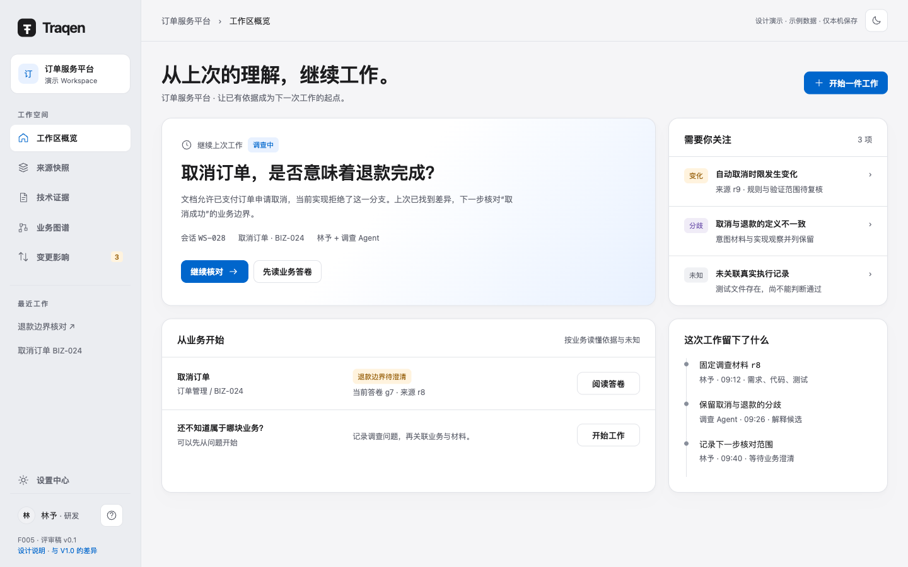
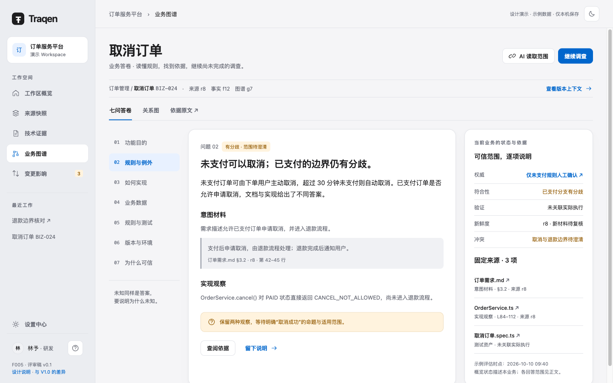
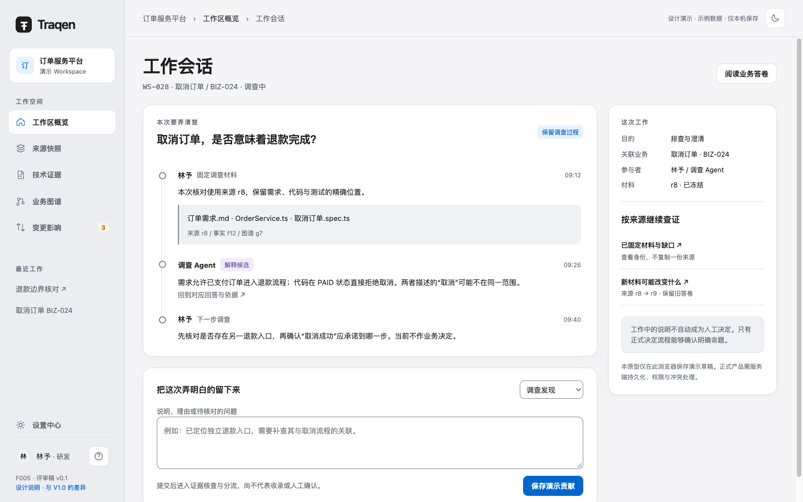
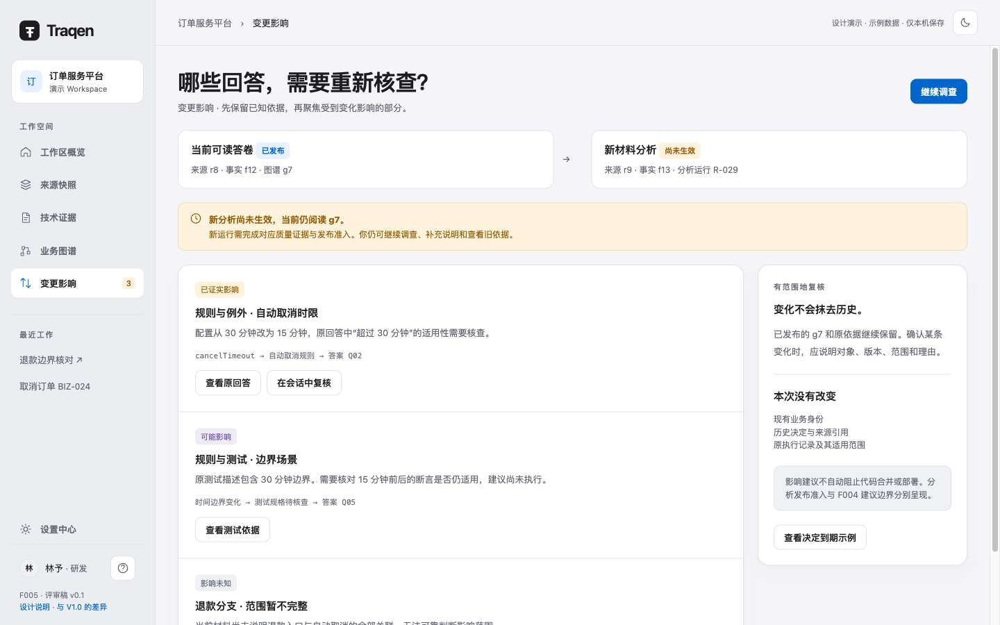
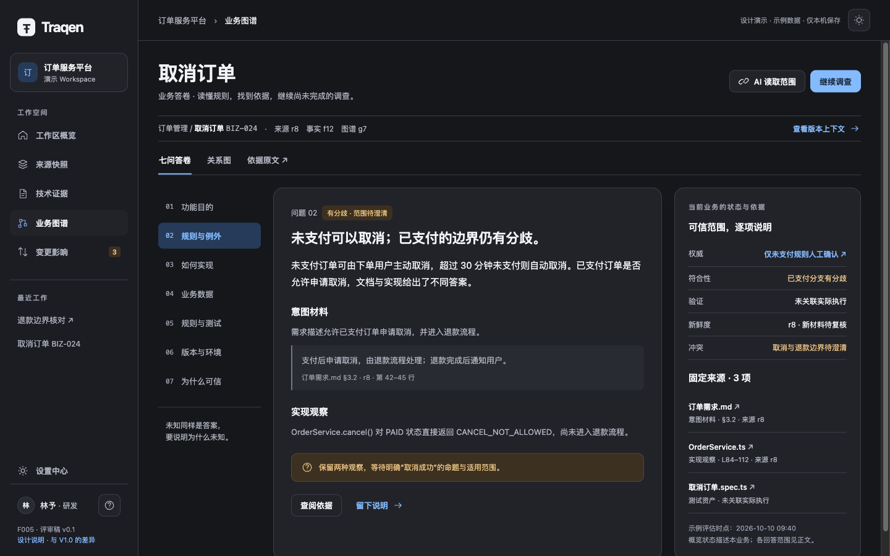
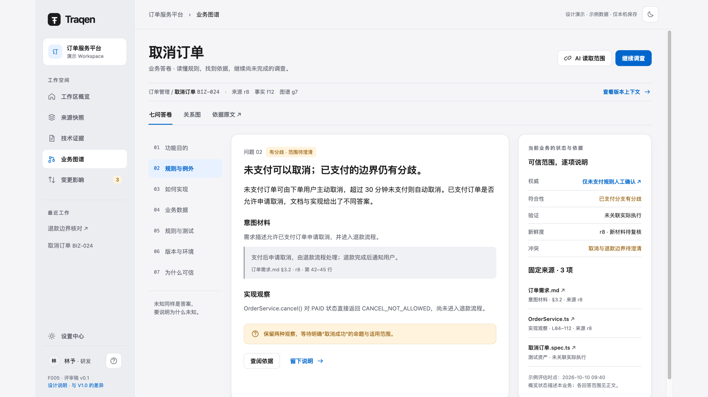

# F005 · 业务工作台体验设计 v0.1

> **独立评审稿，不替换 F005 V1.0。** 本稿根据 2026-10-10「那你先设计一版吧，然后单独列出与之前的不一样的地方」制作，承接上一轮已说明的调整范围。正式布局规范、Feature Spec、权限和接口合同均未改动。文中“应”描述本稿建议，不表示方案已经采纳或产品已经实现。

**让用户围绕一块业务读懂已有认识、完成当前工作，把新依据留给下一次工作。**

- [交互稿](assets/index.html)：六个现有导航，四个重点场景，七问阅读、原文往返、双主题与本机演示回写。
- [离线单文件](assets/offline.html)：下载后直接用浏览器打开，无外部字体或网络依赖。
- [与 F005 V1.0 的独立差异清单](CHANGES.md)：逐项列旧版、新版、理由、影响章节及承接边界。
- [浏览器验证记录](assets/verification.json)：仅证明该设计样稿的已测行为。
- [现行 F005 V1.0](../../../design/F005-layout-navigation/README.md)、[F007 v0.4](../../../design/F007-function-architecture/v0.4/README.md)、[产品愿景](../../../../README.zh-CN.md)。

## 1. 阅读这份设计

先看下面四个场景，再看规则和差异表。全部使用“取消订单”合成示例，人物、时间、版本、代码与业务规则仅用于评审；**不表示 F007 的试点业务已经选定**。

### 01 · 概览：继续上次工作



第一眼读到上次要解决的问题、已有依据与下一步。主动作“开始一件工作”；已有会话有明确“继续核对”入口。“需要关注”只放能指向对象与动作的事项，不用扫描量或节点数替代价值。

### 02 · 答卷：结论、依据、分歧一起读



业务详情默认建议使用七问答卷。左侧提供问题定位，中部讲清当前回答，右侧保留依据与状态。关系图仍在同一业务的页内视图中，不删除原有探索能力。长内容可滚动，不缩字号塞满首屏。

### 03 · 会话：保存本次弄明白的内容



一次工作可以先没有业务归属。会话保留问题、材料引用、贡献与下一步。回写类型明确；调查说明不会因点击“保存”就获得人工权威。

### 04 · 变化：定位需要复核的回答



区分当前可读答卷和新材料分析。将变化落实到回答条目，分别说明已证实、可能、未知的理由。旧依据继续可读，工作会话不因新分析尚未获准发布而停用。

### 同一答卷的外观与显示缩放





以上图片来自同一 HTML/CSS 与 fixture。1440×900 母版、224 侧栏、66 顶栏、32 内容边距、302 检查器继续沿用；2560×1440 使用 1.6 倍、左右各 128px 余量。设备变化不会增加面板、节点、默认行数或列数。整体缩放与图谱探索倍率是独立概念。

## 2. 产品重心与首期边界

依据 F007 v0.4 §1、§7：业务功能的七问答卷是派生阅读面，工作会话连接真实工作。答卷不是新建一份可以随意编辑的权威资料；它消费已生效的图谱、主张、决定、来源与执行证据。

一期沿用六个主导航，不新建“AI”“答卷”“会话”一级菜单。页面可以分步实现，但用户仍应有可操作的会话与人工回写入口；该降级条件在 F007 §9 尚待细化，本稿提出保留 Web 表单的方案，不替 F007 决定最终交付通道。

本稿覆盖页面与组件交互，不创建新后端实体合同或新的 Feature 负责人。会话、贡献、答卷投影的存储与 API 属 F007 待落实职责；F005 承担其可见形态和体验验收。

## 3. 信息架构与页面分工

| 一级入口 | 本版页面职责 | 页面内新增／保留 |
|---|---|---|
| 工作区概览 | 恢复工作、开始问题、聚焦待处理事项 | 会话列表与会话详情；保留当前依据与活动 |
| 来源快照 | 固定材料、解释缺口 | 增加会话往返上下文；F001 八站与准入不变 |
| 技术证据 | 核查事实与原文 | 从回答跳入精确位置，返回原问题；声明／派生仍分开 |
| 业务图谱 | 读懂一块业务并继续追问 | 新增七问阅读面；关系图、图／列表、原文仍保留 |
| 变更影响 | 找到需要重新核查的回答 | 回答级影响列表、影响依据与会话入口 |
| 设置中心 | 明确配置和授权范围 | 区分外部 AI 入站读取与内部模型调用；完整 F006 设置不在本稿重做 |

现行 `?page=` 六路由保持。会话归属 overview，七问及关系视图归属 graph；原型的 `view`、`q`、`session` 仅为样稿导航，不冻结生产查询参数或新增 API。

共享上下文分为工作区、业务身份、会话、回答位置及版本上下文。可选项可以为空，不强迫用户先选业务才能调查。对当前工作适用的上下文才随跳转携带；跨 Workspace 不继承未验证的引用。

## 4. 概览与新工作

1. 已有工作：标题说明问题；次级信息包括材料、关联业务、参与者、最近进展和下一步。
2. 新工作：先输入问题，允许业务未归属、材料未关联。创建会话不自动建立业务对象，不启动采集、扫描或模型。
3. 关注事项：具体变化、冲突、缺口与决定到期；点击落到对应回答或工作，而非打开无范围的总量统计。
4. 正式产品会话服务持久化。跨设备恢复、并发编辑和失败保留属于产品验收，本地样稿不能证明这些能力。

## 5. 七问答卷的阅读结构

七问沿用愿景：功能目的；规则／角色／状态／例外；实现；业务数据；规则与测试；版本与环境；当前版本可信依据。

每个问题可有多条回答或多个适用范围，也可明确未知。七问是信息组织方式，不是七个必填字段、七张固定大小的卡片或七张数据库表。

每条回答应可查：稳定回答引用、业务身份、正文、适用范围、依据、实际版本上下文、来源、状态及评估时点。人工确认另列确认人、命题、范围、时间与有效期；没有人工确认时不填一个假确认人。

中部阅读顺序：**一句当前结论 → 适用范围 → 意图与实现观察 → 分歧或未知 → 下一步**。引用只展开足以判断的片段，全文在原文页读取。长回答仍用清晰正文，不把段落拆成满屏徽标。

右侧检查器当前展示本业务的五维概览，明确概览范围；各答案自己的适用范围见正文。正式实现若呈现答案级状态，必须由该答案实际状态驱动，不用固定业务汇总冒充所有回答的状态。

图谱是查证同一业务的另一阅读视图，保留对象和关系身份。完整平移、缩放、展开、键盘与等价列表继续以 V1.0 为准；本原型只画固定一跳关系用于验证视图衔接，不宣称完成 GraphView。

## 6. 工作会话与四种回写

会话正文按发生顺序展示材料固定、发现、理由、纠正与下一步；角色、行为、来源和阶段分开。Agent 贡献保留稳定行为者身份，并可在详情回查模型、Skill 和配置修订；日常阅读不堆配置细节。

| 回写内容 | 页面动作与反馈 | 成立条件与业务归属 |
|---|---|---|
| 调查发现 | 填说明、关联依据；保存后显示收到／待分流／后续处置 | F003 五档分流；充分支持自动收录为分析态；歧义交人工；无效隔离 |
| 正式决定 | 显示明确命题、范围、版本与理由，进入决定流程 | 权限与决定规则由业务端核验，不整图批准 |
| 新材料 | 转入来源接入，再带冻结身份回会话 | F001 准入；不得借文本回写绕过材料版本 |
| 执行结果 | 进入证据摄取，核对规格、执行、环境及版本 | 独立证据规则；调用方写 PASS 不构成可信执行 |

保存、分流、人工确认、发布生效是不同阶段。前端只能显示服务端返回的阶段与理由，不因按钮点击而自行推进状态。

同一会话的输入离开页面应可恢复；不同会话的草稿与贡献隔离。错误定位到字段，失败保留输入；取消、冲突、权限变化不得悄悄清空内容。示例中“正式决定／执行结果”仅展示边界说明，未模拟真实提交成功。

## 7. 版本、五维状态与未知

| 维度 | 页面解释 | 禁止合并的含义 |
|---|---|---|
| 权威 | 谁在什么范围确认，是否仍有效 | 不由测试通过推导人工确认 |
| 符合性 | 实现是否符合该命题与范围 | 不由文档存在推导实现一致 |
| 验证 | 精确版本／环境下实际执行结果 | 不将测试资产计为执行通过 |
| 新鲜度 | 依据是否仍适用，哪些依赖改变 | 不把新材料一律解释为旧意图失效 |
| 冲突 | 相反材料或解释是否仍未解决 | 不自动用摘要消解分歧 |

列表突出当前最影响行动的原因，详情可展开五维；不展示综合绿灯或可信总分。

来源、事实、图谱分别显示，验证涉及执行快照、规格及 Execution 时另列。未知分量明确未关联；不拼装不兼容的新旧身份，不用执行快照代替真实执行记录。

未知原因至少区分缺依据、未调查、冲突、权限受限与能力不支持。权限受限首先解释访问边界，不向无权用户泄露被遮蔽对象名称或原文，更不能写成“业务不存在”。

## 8. 变化后怎样继续工作

本轮默认同时呈现“当前可读依据”和“新材料分析状态”。若新分析未获准，保留旧头并就地提示“新分析尚未生效”；会话与人工回写仍可按自身权限使用。

影响条目包含回答、前后材料、影响分类、路径／理由、限制与下一步。已证实影响不得漏标；可能、未知允许保守提示，但必须给原因。F004 首期建议不自动阻断代码合并或部署，不能与分析发布准入混成同一个门禁。

决定到期即使版本不变也需重新评估权威适用性。保留历史确认与评估时点；到期不改写成测试失败。

新增执行证据独立生效后的答卷更新属于 F007 §9 待细化项。本稿保留场景：“图谱头不变，新失败执行生效，相关验证答案更新；旧执行仍可回查”。这是建议验收，尚非已批准的新更新合同。

## 9. 外观与统一母版

延续 V1.0 §5–8、§12 的色值、排版、间距、圆角、基础控件状态和可访问性。默认 `light` 瓷白、`dark` 石墨；未来以完整语义 token 注册主题。本轮不增加第二套强调色、不改状态色定义。

唯一母版 1440×900，侧栏 224、内容边距 32、检查器 302。常规空间整体倍率 `max(1,min(W/1440,H/900))`；两屏相同内容、布局、密度与效果，只改变倍率。宽高比不同留余量。

**样稿限制：** 小于母版时，本静态稿提供整页滚动，未实现正式规范要求的全部可访问性重排。窄屏产品仍不设计；不得拿这份样稿声明完成 400% 放大或 WCAG 认证。新场景正式实施必须补 V1.0 的相应验收。

主题切换只改外观，保留业务、会话、版本、草稿和阅读位置。新来源／技术／设置示意页仅承接导航，不取代对应 Feature 的完整页面设计。

## 10. 新增组合组件的责任

以下是设计责任名称，不是新增后端字段或已实现组件 API。

| 组件 | 必须接收并呈现 | 错误／空态重点 |
|---|---|---|
| AnswerEntry | 回答引用、正文、范围、来源、版本、状态、依据 | 无回答、局部未知、过期、冲突分开 |
| UnknownReason | 原因、可披露范围、可用下一步 | 受限不泄露；未调查不宣告不存在 |
| VersionContext | 来源／事实／图谱／执行的独立身份 | 缺失显式为空；不静默换最新 |
| AnswerStateDetails | 五维状态与各自依据 | 概览与条目范围明确，不合成总分 |
| WorkSession | 问题、范围、关联业务与材料、可恢复输入 | 未归属合法；与真实运行状态分离 |
| ContributionComposer | 内容类型、依据、权限与处理阶段 | 提交失败保留；不能自行宣布确认／生效 |
| ContributionTimeline | 行为者、动作、材料、引用、阶段与时间 | 更正追加，历史引用可回查 |
| AffectedAnswer | 回答、from/to、分类、原因与下一步 | 不确定有原因；建议不冒充已执行 |

基础 Button、Field、Select、Dialog、Table、Inspector、EvidenceReference、GraphView 继续复用。页面负责任务与查询编排，基础组件不猜权限、版本或业务状态。

## 11. 状态怎样在现场被看到

```yaml
in_context_observability:
  primary_surface: "答案条目、回写表单、会话贡献和对应影响项"
  why_not_dashboard_only: "用户需要在当前判断处知道依据是否过期、回写是否生效，统计页不能替代"
  deep_dive_surface: "版本上下文、证据检查器和会话历史"
  noise_dedup_policy: "同一回答/依赖/原因聚合展示；可收起历史提醒，当前限制仍在对象旁可见"
```

受影响的阅读者在答案旁第一时间看到提示；贡献者在表单及时间线看到提交阶段；需要深挖时进入依据和历史。概览仅汇聚可操作事项，不能成为错误唯一出现的地方。无障碍通告只播报当前动作结果，不把所有后台状态变成 toast。

## 12. 样稿可操作范围与正式验收

| 样稿已提供的体验 | 正式实现仍需的证明 |
|---|---|
| 六入口、七问切换、关系图与原文往返 | 真实对象、权限、URL 与历史版本读取 |
| 两主题、整体缩放、键盘焦点与对话框 | 各生产页面完整状态、指针换算及无障碍验收 |
| 本机草稿恢复、会话创建、演示贡献 | 服务端持久化、并发、授权、准入、分流与恢复 |
| 旧答卷／新分析未生效的同屏表达 | F006→F003 真实运行、质量证据与发布回路 |
| 意图／实现分歧、未执行、决定到期说明 | 独立真值集、真实执行摄取与到期重评估 |

重点产品旅程：

1. 接手者打开业务，读答案，沿引用查依据，并说清未知原因。
2. 未知归属的问题也能创建工作，固定材料后再关联业务。
3. 从答案进入原文、再回到原回答；会话草稿不丢。
4. 调查贡献经过正确分流；正式决定只影响明确命题与范围。
5. 新分析未获准时旧答卷可读；获准后才推进分析对应当前头。
6. 材料变化定位受影响回答；决定到期触发重评估；历史可查。
7. AI 读取按固定身份与范围过滤，缓存也复验权限；与出站模型授权分开。
8. 隔离恢复后，会话、决定与材料引用可用，并说明恢复未覆盖时间段。

第 7、8 条是 F007 端到端依赖；此静态样稿没有服务端或外部调用，不能以截图宣称通过。

## 13. 本轮与后续分期

本轮 F005 建议采用：现有六入口内的业务答卷、工作会话、回写分路、回答级影响、上下文与状态组件，以及相应验收。

二期再根据真实使用证据判断导航重排、AI 回写与业务数据对象的布局。三期正向登记、通用外部 AI 接入与测试执行产品流程；四期运行信号平台集成与交付证明等，按 F007 依赖推进。当前界面不为这些能力预留不可用一级菜单。

F007 尚未决定的试点业务、关系类型清单、执行证据投影更新及页面降级条件继续标待定。本稿选择取消订单用于视觉演示，不代替这些决定。

## 14. 溯源与修改边界

- 原正式基线：F005 V1.0，发布 2026-09-19；对照基线 `8b6cc695fbe328022ef84c670d3c537442b5e2ef`。
- 新方向：F007 v0.4，2026-10-09 独立落盘；原 F007 继续保留，未明确替代的合同不推断替代。
- 本线程分析：`0001791616116287-000558-8dc248c6`；完整分析回复 `0001791616117555-000564-6c11f53d`。
- 本次制作授权：`0001791616725970-000567-7bf52b61`；仅制作本版评审稿与独立差异，不替换正式规范。
- 工具：当前无可调用 Pencil 工具／配对设备，采用本目录可维护 HTML/CSS/JS 及浏览器实际截图；不伪造 `.pen`。
- 修改范围仅此独立目录。没有改产品代码、Feature Spec、F007、索引、正式 F005 或旧图稿；既有未跟踪材料保留。
