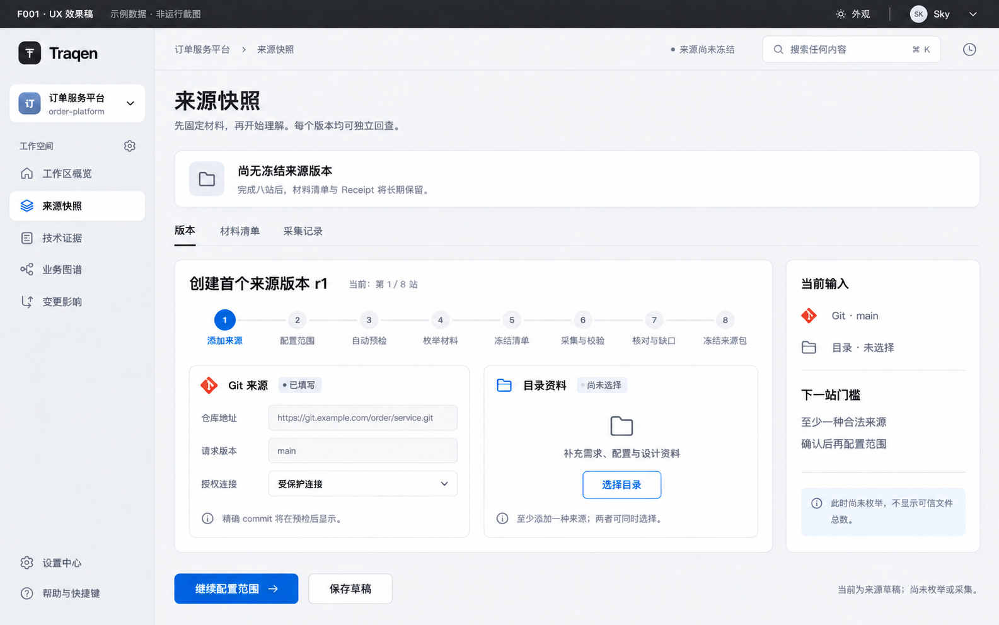
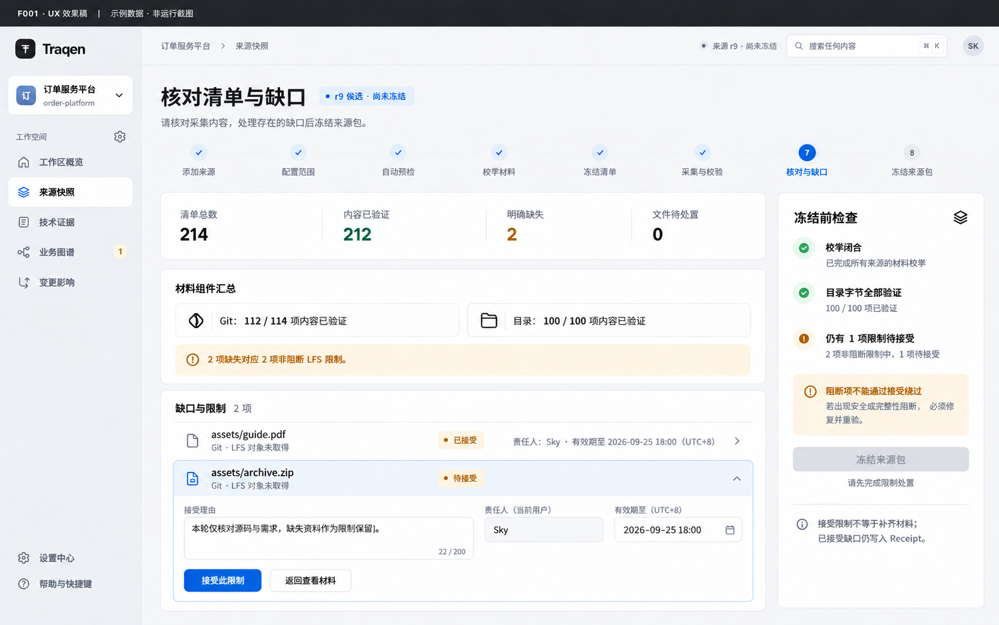
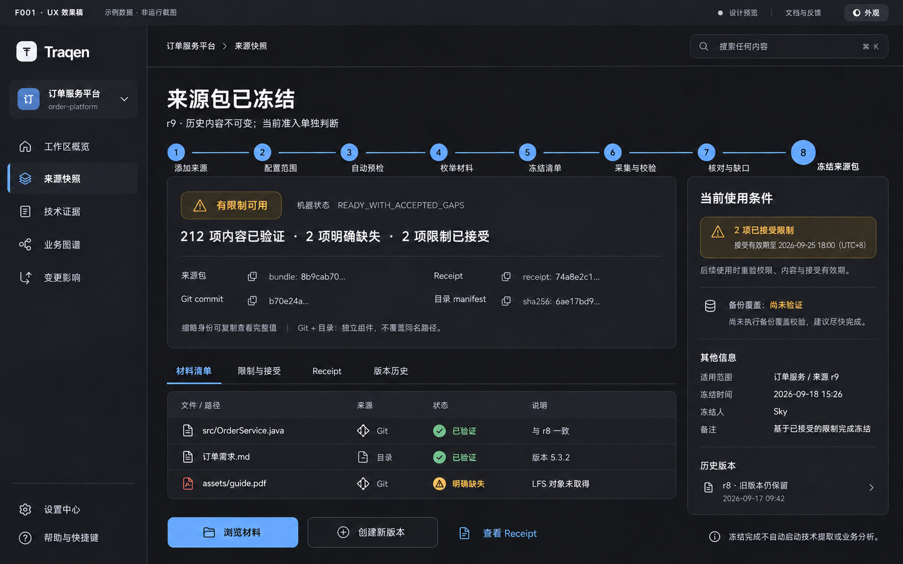

> 语言：**简体中文（当前权威）** · [English — 历史参考](../../../feature-discussions/2026-08-30-F001-workspace-source-truth-design/README.md)

---
feature_ids: [F001]
related_features: [F002, F003, F004, F006]
topics: [workspace, source-truth, git, directory-upload, source-bundle, incremental, source-snapshot, artifact-inventory, coverage-gap, receipt, design-gate]
doc_kind: feature-design
created: 2026-08-30
updated: 2026-09-22
status: approved
design_gate: operator-approved
---

# F001 方案设计 — Workspace & Source Truth

> 本轮设计仅维护中文；[英文旧版](../../../feature-discussions/2026-08-30-F001-workspace-source-truth-design/README.md)保留作历史参考，不与本轮修订视为等价。2026-09-19 按 co-creator 最新要求，将全文的界面说明对齐下列三张 UX 效果图，重点重写 §9–10。既有功能设计与实现授权保留；本文是设计合同，不代替实现、部署或 F001 整体验收记录。见[实施计划](../../../feature-specs/2026-09-06-f001-source-truth-implementation.md)。

**阅读顺序：** 先读下面的“F001 是什么”，再看三张效果图和 §1–2 的产品结果，随后按 §10.1、§10.3、§10.4 对照图中的区域、字段、按钮和状态；未单独出图的中间站见 §10.2，恢复见 §10.5，安全与存储见 §7–8，验收见 §10.8 与 §12。本文即 co-creator 指定的“文件 B”，是当前 F001 设计真相源；旧 Feature Spec（文件 A）不能反向约束或回退本方案。

> 目录统一：依 co-creator 2026-09-19 授权（`0001789795568668-000196-bd4d7d48`），本页与配套图稿由原讨论目录迁入 `docs/design/`，正文功能合同不变。

## F001 是什么（先读这段）

**F001 是 Traqen 的“工作空间与来源快照”功能：先把要分析的代码和资料，整理成一份有明确版本、能回查的依据。**

比如你要接手一个老系统，有 Git 代码仓库，还有接口文档、SQL 和说明文件。按本设计，F001 负责：

1. **归到一个工作空间**：确定这是哪个系统的资料，并在这个 Workspace 内管理来源及访问权限。
2. **接入来源**：选择 Git 版本、上传目录，或两者一起。
3. **采集并核对**：说明拿到了什么、哪些已验证、哪些缺失或有限制；不能把缺失伪装成成功。安全或完整性阻断不能靠接受限制来绕过。
4. **冻结成一个来源版本**：保存内容、材料清单，以及一份说明来源和限制的凭据（Receipt）。“冻结”是固定这份快照，不会锁住或修改你的原仓库。
5. **保留历史**：以后资料更新就创建新版本，旧版本仍能查看、比较，不被覆盖。

**F001 不负责理解业务、生成业务图谱、执行测试或判断改动影响。** 那是 F002–F004 等后续功能的事；F001 先保证后续分析能回答：“我依据的是哪一版材料，有什么没拿到？”冻结完成不会自动启动分析，后续使用还要检查当前权限、内容完整性和限制接受的有效期。

下面三张效果图分别展示这个过程的三个关键时刻：**添加来源、核对材料与缺口、查看冻结结果**，不是三套独立功能。完整八站流程与未单独出图的恢复场景见 §7 和 §10。

这段概述解释的是 F001 的设计职责，不表示上述能力都已完成运行验收，也不以文档发布代替产品实现。

## UX 效果图（2026-09-18）

三张图已按消息 `0001789717182538-000861-7bec2f99` 内嵌。co-creator 随后明确要求“设计文档也应该全部按照这个UX效果图进行调整，特别是第10节。文档要与图片里的内容能对应上”（`0001789790327580-000007-1c2318ea`）。因此，**本组三图是本轮界面基准，不再只是正文之外的插图**；正文采用图中的页面结构、名称、控件及状态关系，旧八站图不再作为当前视觉依据。

图片由 AI 生成，是参考 F005 瓷白/石墨视觉的**示例数据设计稿，不是产品运行截图**。图中未画出的安全、持久化、恢复与准入规则在正文明确补全；不会因未画出而删除，也不会被图中的示例数值或装饰覆盖。

三张图分别呈现首次建包 r1、第 7 站 r9 候选、第 8 站 r9 冻结结果。图 02→03 说明完成剩余接受后可以达到的结果，但不是同一次真实采集的连续截图；第 2–6 站没有单独出图。示例 Workspace、r1/r9、文件名、214/212/2、负责人和日期不写死为产品限制。本组不同场景与主题不能证明 14/27 英寸统一缩放、主题等价或 F001 完工。

### 01 · 首次添加来源（瓷白）



Git 和目录是两个独立入口，至少一种即可。首次建包 r1 尚在草稿阶段，commit 待预检解析，不提前显示已验证文件数。“继续配置范围”和“保存草稿”是本页动作；字段与右栏逐项说明见 §10.1。创建后继版本从第 2 站配置范围开始，不以这张首次建包图替代。

### 02 · 核对清单与缺口（瓷白）



后续版本 r9 的 214 项材料中，212 项内容已验证、2 项明确缺失。文件待处置为零不等于 Gap 已接受；两项非阻断 LFS 限制中仍有一项待接受，需由当前用户记录理由及绝对有效期限，冻结按钮保持禁用。安全或完整性阻断不能接受绕过。四张统计、组件汇总、展开表单与“冻结前检查”对应 §10.3。

### 03 · 冻结结果与当前准入（石墨）



r9 冻结后仍以橙色“有限制可用”及机器状态 `READY_WITH_ACCEPTED_GAPS` 表达结果；Bundle、Receipt、Git commit、目录 manifest 分别表达身份，r8 历史版本保留不变。备份覆盖仍未验证，后续使用须重验当前权限、内容和接受期限；冻结来源包不自动启动分析。身份卡、四个详情页签、右栏与三个完成后动作对应 §10.4。

以上 PNG 可直接在本文查看，点击图片可放大。图片字节不在本次修订中改动；本次调整的是整篇文字与图的对应关系。旧图和英文文档仅保留历史入口，见 §10.9。

## 1. F001 完成时，用户得到什么

当架构师能把一个选定的 Git 版本、一个选定的目录或二者，变成一份**长期保存、可恢复、可重放的冻结来源包及 Source Truth Receipt** 时，F001 才算完成。Receipt 明确记录采集了哪些来源组件、哪些材料没有取得及版本身份。第 8 站的终点是“冻结来源包”，不是“启动 F002”；后续使用时另行检查当前准入资格。

首期文件存入 **Traqen 部署机的专用持久化数据卷**，任务、清单和版本等记录存入 **PostgreSQL**。不存进项目源码、设计 `assets/` 或浏览器会话。关闭页面不删除任务；冻结后原 Git/目录离线也不影响已有内容的重放。单节点故障时允许暂停服务并从配套备份恢复，不承诺首期高可用。

具体而言，架构师可以：

1. 创建或打开 Workspace，分别添加**Git 来源**和/或**目录资料**；至少需要一个，两个同时添加时共同定义一份分析范围；
2. 在“Git 来源”卡选择请求版本（branch/tag/ref），到预检后看到精确 commit；和/或通过“目录资料”卡选择目录，到采集与校验后看到全部已选文件的验证结果；
3. 让 Traqen 自动预检来源，并在不执行用户控制代码的前提下采集；
4. 通过“材料清单”“限制与接受”“Receipt”“版本历史”回查带组件身份的材料、限制、凭据和不可变历史；
5. 在来源变化后创建新版本：比较 Git commit 或重新选择目录的 manifest，只传输变化字节；以及
6. 在用户另行选择后续分析时，将合格的不可变来源包及继承限制交给 F002，而不是交一个会变化的路径或 branch；图 03 的完成动作本身不启动分析。

首期允许一个 Git 组件、一个上传目录组件，或两者同时存在。组合来源是带命名空间的并集，不是自动合并：同名路径仍是不同记录。F001 **不会**产生 API 树、推断业务功能、执行测试或给出变更影响建议；这些分别属于 F002–F004。F001 的产物是可信来源地基，后续结果才有资格被相信。

## 2. 功能清单、作用与解决的问题

| 功能 | 架构师获得什么 | 解决什么问题 |
| --- | --- | --- |
| Workspace 与来源选择（图 01） | 左栏确定 Workspace；主区“Git 来源”“目录资料”两卡分别填写/选择，至少一种。“当前输入”同步摘要，草稿可保存。Git 凭据保持受保护；目录上传带用户/会话审计。 | 用户不必选择误导性的第三种“Git+目录”类型；分析不能悄悄使用任意本地目录，也不会泄露凭据。 |
| 精确组件身份 | Git ref 被解析为 commit；目录由已验证 manifest 表达。组件保留原生身份。 | 移动中的 branch、本地目录或伪装成 commit 的目录不能冒充稳定证据。 |
| 自动预检 | `可开始` / `可带预期 Gap 开始` / `已阻断`，并给出原因和修复动作。 | 授权、路径安全、限制和完整性问题不会等误导性扫描结束才暴露。 |
| 安全不可变采集 | 已密封组件快照和一个 `SourceBundleSnapshot`；不执行仓库脚本、构建、hook、filter、依赖安装或上传内容。 | 来源控制的行为和 working tree 修改不能改变或威胁证据。 |
| 材料清单与组件汇总（图 02/03） | 每个已发现条目都有带组件身份的定位符、disposition 和 reason；界面显示“文件/路径、来源、状态、说明”，按 Git/目录分别汇总，大规模时可搜索、分页。 | 文档、配置、SQL、测试、二进制、读取失败以及组件内同名文件不能静默消失。 |
| 缺口与限制 / 限制与接受（图 02/03） | 核对页逐项接受政策允许的非阻断限制；冻结后仍可回查责任人、理由和有效期。“冻结前检查”不会放过阻断项。 | 不能用点击警告掩盖完整性失败，同时常见存量系统的不完整性仍然可见、可管理。 |
| 版本历史与文件 Delta | 用户显式操作后得到一份完整不可变新版本；两份已密封 manifest 间的 add/modify/delete 证据。 | 影响分析不能比较移动来源，同时未变化的 50,000 文件组件不被复制或重传。 |
| 来源包、Receipt 与当前使用条件（图 03） | 主区展示冻结身份及 `READY` / `READY_WITH_ACCEPTED_GAPS`；右栏另列当前使用条件。`BLOCKED` 留在采集记录，不签发 Receipt。F002 只接收重新准入后的合格输入。 | 后续能力不能基于路径、branch、部分上传，或未经接受的限制，产出看似权威的结论。 |
| 保存、恢复与容量 | 图 01“保存草稿”以服务端保存为准；任务在同一工作台恢复。容量不足暂停新增；图 03 右栏独立显示该版本备份覆盖。 | 刷新、断网、重启或原来源消失不会被误当作任务取消或历史丢失；缺少备份的历史不冒充可恢复。 |

## 3. 与产品愿景的对齐

| 产品愿景 | F001 的贡献 | 刻意边界 |
| --- | --- | --- |
| 帮架构师接管陌生的存量系统。 | 在解释任何内容前，先建立精确材料基线。 | 它本身不解释业务含义。 |
| 从来源到结论保留可追溯链路。 | 建立第一段长期有效链路：来源组件 → 不可变 manifest → 来源包 → inventory/Gap → Receipt → F002 provenance。 | Fact、Candidate、Claim、测试证据、影响链路由 F002–F004 补齐。 |
| 展示可信 API 树和经过审核的业务功能树。 | 防止任一棵树在其底层来源不完整时仍表现得像“完整”。 | F001 不解析 API，也不发布任一棵树。 |
| 让下一次变更更安全。 | 保留可比较来源版本和诚实的文件级 Delta 供后续影响工作使用。 | 不推断影响、不运行测试、不建议复验。 |
| 宁可明确不完整，也不输出看似可信但无证据的答案。 | 排除项、读取失败、脱敏限制、外部材料、已接受 Gap 都显式可见并被继承。 | 阻断安全/完整性条件不能被转成可用结果。 |

因此，F001 与愿景一致，但它是**诚实的来源地基**，不是独立完成“存量理解”的产品。它的成功标准不是“扫描跑完”，而是“后续结论能说出并证明它基于什么输入、什么版本、受什么限制”。

这一原则在三图中依次表现为：图 01“不提前给验证总数”，图 02“缺失仍计入清单且未接受不能冻结”，图 03“已冻结、有限制、当前使用条件和备份覆盖分别说明”。左栏出现技术证据、业务图谱或变更影响，不代表 F001 已生成这些结果。

## 4. 方案状态与权威

本文件是已获 co-creator 确认的 F001 方案设计。[ADR-0003](../../decisions/ADR-0003-source-truth-boundary.zh-CN.md)保留决策背景；当前产品行为与验收以本文为准。2026-09-06 的确认覆盖单节点存储、八站生命周期和恢复方案；文档授权原文为“不用做双语设计了，只用中文即可。授权你修改，仅更新设计文档。”（消息 `0001788694315222-000093-757d8776`）。随后 co-creator 明确“以文件B的为准，文件A有点过时了”（`0001788697307275-000096-73b7de6e`），并要求“将B文件的方案设计完善”（`0001788697442248-000099-a92055fb`）。这些是历史功能授权，不是继续保留旧视觉的理由。

历史反馈修订另有明确授权：co-creator 在逐项建议分析后回复“可以按你的判断进行处理”（`0001788705321540-000110-6b5b4cc6`），据此细化身份、诊断、发布、备份和安全合同。本次最新授权为 `thread_mtdpfw4ft7ngbi5f#0001789790327580-000007-1c2318ea`：按已看到的 UX 效果图调整全部设计文档，尤其第 10 节。此次只修订本文的界面说明与对应关系，不改英文、A、ADR、图片、代码、部署或生命周期状态。

权威顺序是：co-creator 最新明确决定 → 本文与指定三图共同表达的当前设计 → 历史资料。界面结构、控件名称与可见状态按本组三图对齐；未出图的行为按本文补全并明确标注。示例数字不变成配额，缩略身份不变成身份算法，未画出的权限检查不被删除。发现旧文字与三图冲突时修正文案，不让旧 HTML/PNG 反向覆盖新界面；发现 A 与 B 冲突时，不以 A 为验收依据。

共享壳采用 F005 的 Workspace 选择、六个功能入口及完整浅/深主题；F001 定义自己在“来源快照”中的呈现与操作，不重新设计全局导航。14/27 英寸遵从同一界面统一缩放的既有要求，不恢复两套布局。三图不同场景下的侧栏宽度、头像位置等绘图差异不定义多套壳，具体规则见 §9–10。

`source-truth` ownership 边界拥有来源登记、上传/采集生命周期、组件和来源包快照、manifest、inventory、Gap/Receipt 状态、版本比较和 F002 准入；不拥有 F002 提取、F003 审阅、F004 执行/影响或 F006 设置。`SourceTruthRepository` 是唯一权威；F002 只接收 `QualifiedSourceInput`，绝不接收路径、ref、working tree、上传会话或凭据。

## 5. 总体架构

```text
Workspace
  ├─ GitSourceRegistration ── 解析请求 ref ──► 已提交 Git tree/blob reader
  └─ DirectoryUploadSession ── 已选文件 ─────► 受控流式上传
                         │                              │
                         └────── SourceCaptureRun ──────┘
                                             │
           3 预检 → 4 枚举 → 5 冻结清单 → 6 有界采集与校验
                                             │
            PostgreSQL 记录 + 数据卷已验证字节（仍是私有准备结果）
                                             │
                       7 对账 Inventory / Gap + 有效接受
                                             │
                       8 原子发布组件 / 来源包 / Receipt
                       READY | READY_WITH_ACCEPTED_GAPS
                                             │
                               SourceTruthAdmission → F002
                    （重验当前资格；合格来源包 + inherited gaps）
                                             │
                          选择已密封版本 → SnapshotDelta → F002
```

`SourceCaptureRun` 记录一次尝试、实时进度、取消、重试和 checkpoint。密封组件/来源包记录不可变证据；Receipt 记录签发时的决定，准入服务另行判断当前资格。阻断尝试保留原因与 `BLOCKED` 任务诊断，但不产生已冻结来源包，也不签发任何 Receipt。上述边界防止半成品 run 被看成来源版本，也防止重试重写历史。

界面是上述记录的投影：图 01 为来源草稿；图 02 为候选 run 的 Inventory、Gap 与接受记录；图 03 为发布后的 Bundle/Receipt 及独立查询的当前使用条件。页面上的“版本”不是 run 的别名，“冻结清单”也不是“冻结来源包”的别名。

## 6. 领域记录与不变量

| 对象 | 职责 | 不变量 |
| --- | --- | --- |
| `Workspace` | 授权与隔离聚合根。 | 每条 F001 记录只属于一个 Workspace；元数据与数据访问遵守相同租户/Workspace 边界。 |
| `GitSourceRegistration` | 已获只读授权的仓库身份和凭据引用。 | 不存裸凭据；请求 ref 选择 commit，但不是 snapshot 身份。 |
| `DirectoryUploadSession` | 一个用户选择目录的传输和审计轨迹。 | 至少有一个已选文件；成功组件要求每个已选文件均验证。 |
| `DirectorySourceRegistration` | Workspace 内稳定的目录来源身份与展示标签。 | 来源 ID 不由目录名或本机绝对路径决定；新会话显式更新该来源，不能因同名目录自动判为同源。 |
| `CapturePolicyRevision` | 平台拥有的限制、路径规则、扫描器/脱敏和来源安全。 | 用户不能编辑完整性、安全或 Gap 严重度规则；已密封历史绑定 policy revision。 |
| `SourceCaptureRun` | 一次 resolve/preflight/capture/seal 尝试及阶段诊断。 | 重试创建新 run；阻断诊断绑定 run、候选修订、失败阶段及脱敏原因，不引用不存在的 Bundle。 |
| `SourcePreflightReport` | 身份、权限、边界、路径、限制、外部内容与安全证据。 | `PASS` / `WARN` / `BLOCK` 均有 reason code 和下一步；`WARN` 不会静默变成最终覆盖。 |
| `SourceManifest` | 一个组件按序内容寻址的条目和分片摘要。 | 它是覆盖和变更比较的权威；Delta 不能覆盖它。 |
| `GitSourceSnapshot` | 已解析 commit/tree 与声明 Git 范围的密封 Git 组件。 | seal 后不可变；已提交 object 而非 checkout 是证据权威。 |
| `DirectoryUploadSnapshot` | 以已验证 manifest 为内容身份的密封目录组件；上传会话另作审计。 | seal 后不可变；不声称所选目录外的覆盖，也不伪装成 commit。 |
| `SourceBundleSnapshot` | 有序组件引用与来源包级身份。 | 有一个或两个组件；MVP 每类型仅一个；冲突路径按组件 ID 保持不同。 |
| `ArtifactInventory` | 覆盖率分母和逐项处置。 | 每个已发现条目恰有一种终态 disposition/reason；seal 前计数/字节/分片摘要必须对账。 |
| `CoverageGap` / `GapAcceptance` | 实质分析限制与可追责接受。 | Gap 追加写入；只有非阻断 Gap 可接受，且带负责人/理由/有效期；接受不声称材料已获得。 |
| `SnapshotDelta` | 两个已密封版本的 add/modify/delete 比较。 | 从 manifest 派生、可重放、可选缓存；MVP 中 rename = delete + add。 |
| `SourceTruthReceipt` | 已发布 Bundle 的不可变来源证据和签发决定。 | 仅有 `READY` / `READY_WITH_ACCEPTED_GAPS`：前者无实质 Gap，后者签发时仅有有效接受的非阻断 Gap。没有 Bundle 就没有 Receipt；过期、权限或完整性变化只影响当前准入。 |
| `SourceBackupSet` | 配套备份的水位、成员清单与完成证据。 | 成功集合不可变，覆盖关系从它派生；失败尝试留诊断，不冒充成功集合。后续可用性/损坏另记健康证据，不能改写原完成事实。 |

持久化的来源包身份不包含 run ID、上传时间、接受时间或备份状态；它绑定原生来源坐标、范围、完整 manifest、处置与 Gap 的稳定证据及策略。接受记录以冻结候选摘要和 Gap 集为对象；密封后可追溯至对应包。会话、审计与 Receipt 签发身份单独保存，同样的材料重放不因时间变化成为不同内容。

`display-redacted` 的含义刻意收窄：内容可以被采集并可供获授权下游使用，只是不显示在 UI/日志中。若脱敏令分析不可得，它还会生成实质 `CoverageGap`。任何记录均不泄露来源秘密或凭据。

### 6.1 用户看到的四种不同状态

| 维度与图中位置 | 回答的问题 | 不能混同 |
| --- | --- | --- |
| 任务进度：三图八站条及图 02“r9 候选·尚未冻结” | 本次到了哪站，等待谁，失败后从哪里恢复？ | 第 6 站字节处理完不等于第 8 站已发布包。 |
| 内容冻结：图 01“尚无冻结来源版本”→图 03“来源包已冻结”与身份卡 | 是否已经取得唯一、不可变且可查询的 Bundle/Receipt 发布记录？ | 冻结记录不因接受过期、后继任务失败或备份失败被改写。 |
| 当前准入：图 03 右栏“当前使用条件” | 此刻该用户能否使用这份内容启动下游分析？ | 接受过期、权限撤回或完整性异常均可拒绝；不能只看历史 READY。 |
| 备份覆盖：图 03 右栏独立提示“尚未验证” | 哪次配套备份已经覆盖这个版本，能恢复到哪个时间点？ | “系统最近备份成功”不表示之后冻结的新包已被备份。 |

文件计数、目录计数与 Gap 数分别显示。范围内文件数按“已取得并验证的内容 + 明确未取得的内容 + 待完成”对账；范围外条目单列，不能算作已采集内容。阻断/接受、展示脱敏是附加维度，不重复加入文件总数；Gap 与文件并非必然一对一。逻辑字节数、本次传输字节、复用字节及物理新增存储也分别统计，不能相加形成虚假的完成百分比。

图 02 的显示名分别是“清单总数 / 内容已验证 / 明确缺失 / 文件待处置”，示例守恒为 **214 = 212 + 2 + 0**；组件验证为 Git **112/114**、目录 **100/100**。两个缺失项在这个示例恰好对应两个 Gap，其中一个仍待接受；不能把“文件待处置 0”解释为“限制待接受 0”。图 03 冻结后仍是 212 已验证、2 明确缺失，只是两项限制均已接受，缺失不会变成已验证。

### 6.2 确定性身份合同 v1

可重放要求的是**同一 Workspace、来源登记、原生坐标、范围、策略及身份格式下得到同一证据身份**；不是“字节相同的不同 commit 必须是同一来源包”。换来源登记、Git commit 或策略可以改变组件/包身份，底层相同字节仍可按权限复用。

- 已取得内容统一取**原始字节的 SHA-256**，不改换行、编码或压缩后再计算。Git 原生对象引用始终带 `objectFormat`（`sha1` / `sha256`）与完整 OID；它不是产品字节摘要，两者不混用。
- 产品结构摘要统一为 `sha256(UTF8(JCS({domain, version: 1, payload})))`，JCS 按 RFC 8785；域分别为 `manifest`、`coverage`、`component`、`inventory`、`gaps`、`bundle`，不得跨域解释摘要。非适用字段显式为 null；字节数、计数使用无前导零的非负十进制字符串（零为 `"0"`），不依赖浮点舍入。格式变化必须升级版本，旧版本仍按旧规则重放，不能原地重算替换历史。
- 路径是选定根下的相对路径，根本身不计条目。身份中的 `pathBytes` 是原始路径字节的无填充 base64url：Git 保留原始字节，目录入口将有效 Unicode 路径编码为 UTF-8；来源适配器用 `/` 连接路径段，不改变段内字符，不转小写、不作 Unicode 归一化。非法路径仍按 §8.2 阻断，不能“修正后”当另一文件。显示名仅是无损解码/转义视图，不参与身份；不能无损取得的名称明确阻断，不静默替换字符。
- Manifest 条目按解码后的相对路径字节升序排序，不使用区域排序；相同路径重复即阻断。每项固定 `pathBytes`、`kind`、`sizeBytes`、`expectedContent`、`gitMode`：Git 文件/链接使用带算法的对象引用，目录文件使用预期 SHA-256；目录项大小及内容预期为 null，Git 模式保留原生模式、上传目录模式为 null，gitlink 使用其原生提交引用且大小为 null。空子目录作为目录项保留。mtime、权限探测时间、浏览器会话、进度、物理分片方式均不进入身份。

| 摘要层 | 固定输入与计算顺序 |
| --- | --- |
| Manifest | 来源类型及完整有序条目数组。第 5 站 Git 用已固定的原生对象引用；目录用本地完整哈希的预期摘要。第 6 站补验证证据，不回写已冻结 manifest。 |
| Coverage / Gap 稳定证据 | 按来源登记、路径及规则码排序的逐项处置、reason code、已取得内容 SHA-256/长度，及 Gap 的受影响范围、原因、严重度、规则版本和外部对象引用；无内容则显式 null。Gap 稳定键由这些证据定义，不使用新生成的审计 ID、发现时间或接受记录。 |
| 组件 | Workspace、来源登记 ID、类型、原生坐标（Git 的算法/commit/tree；目录的 manifest 摘要）、声明范围、manifest 摘要、组件 coverage 摘要及策略版本。展示标签、凭据引用及上传会话另记审计，不入摘要。 |
| Inventory / 包级 Gap 集 | 组件计算完成后，Inventory 按组件 ID、路径排序，绑定 manifest 与终态处置；Gap 集按稳定键排序。这里只绑定组件/证据，不反向依赖 Bundle、Receipt 或接受，避免循环身份。 |
| Bundle | Workspace、策略版本、组件引用数组、Inventory 摘要及包级 Gap 摘要；组件固定 Git 在前、目录在后，缺少的类型省略。冻结候选摘要即该待发布 Bundle 摘要，但摘要算出不等于已经发布。 |

各结构的有序数组均允许有界流式编码；存储分片摘要负责分片校验，但调整分页、分片大小或并发顺序不得改变逻辑身份。实现前需固定字段编码测试向量，覆盖乱序枚举、空树、大小写/Unicode 差异、Git 模式变化和大计数；不是把默认 JSON 序列化结果直接当合同。

### 6.3 阻断诊断与发布凭据

预检 `BLOCK` 保存 `SourcePreflightReport` 并使 run 阻断；采集/最终化前的阻断保存同一 run 的阶段诊断。两者都保留候选、原因和恢复动作，**零个新 Bundle、零个 Receipt**，不另建“无 Bundle 的 Receipt”类型。“采集记录”列出任务与尝试结果，“版本历史”列出已冻结版本；已冻结包后来的准入拒绝是当前检查结果，不把旧 Receipt 改成 `BLOCKED`。

同一操作的重复投递复用原诊断/结果；用户显式修复重试则创建 `retryOf` 新 run，并保留两次尝试，不能为了去重合并掉失败审计。第 8 站的发布记录必须绑定一个 Bundle 和一个签发 Receipt；同内容续签只追加 Receipt 及其操作记录，不再发布第二个 Bundle。

## 7. 采集与版本生命周期

### 7.1 初始来源采集

图 01 对应第 1 站草稿，图 02 对应第 7 站候选，图 03 对应第 8 站已发布结果。以下生命周期适用于三图，未单独出图的中间状态仍在同一工作台显示。

```text
1 添加来源 → 2 配置范围 → 3 PREFLIGHTING → 4 ENUMERATING
    → 5 MANIFEST_FROZEN → 6 CAPTURING / RECONCILING
    → 7 REVIEW_REQUIRED
        ├─ 无 Gap：用户确认清单 ─────────────────┐
        └─ 非阻断 Gap：AWAITING_GAP_DECISION      │
                         └─ 有效接受 + 确认 ────┤
                                               ▼
                              8 PREPARING_SEAL → FINALIZING
                                               │
                         原子发布组件 + Bundle + Receipt
                                 READY / READY_WITH_ACCEPTED_GAPS

安全/完整性阻断 → BLOCKED（修复后重新预检，无接受绕过）
瞬态故障 → FAILED_RETRYABLE（新 run 校验并复用检查点）
等待本地未上传文件 → WAITING_FOR_CLIENT（重新授权/选择并核对）
最终化前取消 → CANCELLED（保留审计，不发布包）
seal 前接受过期 → 返回第 7 站（不重新枚举/传输）
```

- Preflight 校验采集前可知的内容：授权、Git 解析、声明 root、上传/会话边界、路径安全、限制和策略；它不伪装成业务理解。
- 第 4 站完成枚举，第 5 站冻结条目、范围、原生版本、预期摘要与已知字节总数；未知的外部内容大小单列，不能按零字节冒充完整。目录摘要必须完成流式读取与哈希才能固定。此前仅显示“已发现 N”；之后按真实分母显示文件验证数和已知字节数。
- 目录初始输入只有所有已选文件到达且验证才成功。损坏传输或策略拒绝不能静默降级为部分成功或“来源完整性未知” Gap；已验证条目仍可在策略允许时携带可见的分析限制 Gap。
- `DRAFT` 数据保持私有。原子 seal 会在一起发布 snapshot、来源包和 Receipt 前核对 manifest 分片、内容存在性、inventory 总数、处置和实质 Gap。
- 取消/失败/阻断的后续 run 绝不改变先前已密封版本。

### 7.2 会话、并发与恢复

- 首期每个 Workspace 同时只有一条活动采集（含等待目录续传或缺口决定）；并发启动返回当前任务和责任人，不另建竞争基线。读历史、使用合格旧包不受此限制。执行持有者失联后由服务端恢复执行器自动检测，以检查点和递增持有者代次取得执行权；同一非终态 run 可恢复执行，旧 worker 不能继续写入或发布。已经终态失败的用户重试仍创建新 run。
- 页面是服务端状态的投影。关闭/刷新不等于取消；已经收到的字节可由服务端继续验证，尚未上传的本地文件进入 `WAITING_FOR_CLIENT`。页面回到同一任务，提示重新选择目录并授权，绝不承诺浏览器失去文件读取能力后仍能上传。
- 同一输入的瞬态失败创建新 run，记录 `retryOf`，只复用匹配 Workspace、来源身份、manifest、策略且验证有效的检查点。未验证的临时字节不能直接计为成功。重新选择后内容与冻结清单不符，阻断原输入续传，转为明确的新候选；没有密封基线时仍是首次采集，不伪称新历史版本。
- 最终化前可取消，等待 worker 停止写入后保留终态。进入 `FINALIZING` 后禁止取消，并提示“正在最终化；结果未知时先查询”。重启后按发布凭据查询，不能仅因客户端超时就标失败或重复发布。
- 草稿、run、检查点、冻结历史和审计默认持久保存（TTL=0）。用户明确放弃并确认释放暂存，或主动选择保留期限，才允许回收符合条件的临时字节；记录本身仍保留。释放活动名额与清理字节不是一个无提示的动作。

任务恢复的界面合同：进入工作台先查询服务端任务与已选版本；显示“上次停在第 N 站、最近已保存进度、等待条件、下一动作”。图 01 的“保存草稿”保存来源/范围的草稿修订，服务端确认成功才显示“已保存”；失败就地说明并保留输入，尚未送达服务端的表单输入不得声称可恢复。回看旧站不修改记录，重新编辑已锁定输入则创建新的候选修订，并使依赖旧输入的预检、清单确认和接受失效，不能带着旧绿灯直接跳到第 8 站。

自动恢复只接管系统执行，不更换用户责任或替用户确认。未收到的目录文件仍等待有维护权限的成员主动重新选择并核对；操作按实际成员留痕。缺口接受和冻结请求仍由当前授权用户显式完成，不能凭另一个成员权限相同就自动代其接受；不新增成员接管审批流程。

### 7.3 接受记录与冻结后的资格

接受使用现有 Workspace 的授权管理边界：只读成员可查看，无权接受或冻结；服务端在操作时校验调用者维护权限。每条接受追加记录责任人、理由、服务端 `acceptedAt`、用户选择的绝对 `expiresAt`（界面显示时区），并绑定确切候选内容、策略和 Gap 集。时间基准是服务端，不接受客户端时钟决定有效性；期限不能在冻结或重试时顺延。

图 02 将此合同表达为“接受理由”“责任人（当前用户）”“有效期至（UTC+8）”和“接受此限制”。责任人由当前授权身份确定，不是可代填其他成员的输入；Sky 与图中的日期均为示例。图 03“当前使用条件”继续展示接受期限，多条期限不一致时摘要取最早到期值，详情保留每条完整记录。

第 7 站通过只代表可以尝试冻结；第 8 站发布和每次 F002 准入都重验。最终化前已过期则回到第 7 站重做确认，保留已经验证的材料。新内容、范围、策略或 Gap 集变化不得沿用旧接受。

已冻结包不因过期改变内容或历史状态。用户可对**同一冻结内容**重新接受原有限制，追加接受记录并签发新的 Receipt，关联前一 Receipt；不重跑第 4–6 站、不重传字节。旧 Receipt 仍可审计，不能自动替换既有 F002 结果绑定的凭据。页面分别显示“冻结完成”“接受已过期/当前禁止新分析”；准入恢复后仍是橙色有限制，不变成零 Gap。

完整性损坏、权限撤回和安全阻断不能通过续签接受解除。损坏记录属于当前存储健康证据，不篡改冻结 manifest；恢复相同字节并核验成功后才恢复准入。已开始分析绑定准入时凭据，过期不追溯改写已产生结果；后续读取仍校验访问权限与内容完整性，新分析或新准入必须重新检查。

### 7.4 增量新版本

```text
选择基线 + “创建新版本”
  ├─ Git：解析新精确 commit → 比较已提交 tree → 只取得新增/修改的缺失 blob
  ├─ 目录：重新选择文件夹 → 完整枚举/哈希 → 服务端 manifest 比较 → 只发送变化字节
  └─ 未变化组件：复用先前已密封组件
             │
             ▼
准备完整组件 → 第 7 站核对/有效接受 → 第 8 站原子发布组件、Bundle、Receipt
                                                    └─ 派生可重放 SnapshotDelta
```

每个新版本都有完整 manifest。优化的是物理复用，绝不是逻辑不完整。目录客户端必须枚举全部已选文件，因为只有这样能可信地证明删除；客户端哈希只用于挑选传输候选，服务端会在字节成为证据前验证每次传输。F001 不自动跟随 branch、不监视本地文件夹，也不在没有架构师操作时把 ref 移动变为新基线。

用户确认的是一个确切基线，不是随时变化的“最新版本”。组合更新时，各组件分别选择沿用或更新：沿用已冻结目录组件不需要重新选择本地目录；只有更新目录组件才重新枚举、哈希和核对。若复用对象的字节缺失或损坏，先按完整性异常恢复并核验，不能为了省传输而跳过验证。创建新版本不自动切换既有分析的基线，也不修改任何历史 Receipt。

对应图 03，“创建新版本”以当前选定的 r9 为基线进入第 2 站，产生新的候选；r8 仍可从右栏或“版本历史”回查。r9 及后继编号来自实际记录，不固定生成 r10，更不覆盖 r8/r9。材料行“与 r8 一致”是与明确基线比较的文件证据，不是业务影响判断。

## 8. 安全、可扩展的采集设计

| 接口 | 职责 | 禁止 |
| --- | --- | --- |
| `GitSourceGateway` | 用只读授权解析 ref、枚举已提交 tree、流式读取 blob。 | 读取可变 working tree，或执行来源控制的 hook/filter/logic。 |
| `DirectoryIngestGateway` | 直接流式接收文件到受控存储，规范路径并验证传输字节。 | 将原始本地路径当作身份、展开归档或执行上传文件。 |
| `SourcePreflightService` | 检查授权、身份、声明 root、上传边界、路径、限制、外部内容和策略。 | 让用户覆盖完整性/安全 block。 |
| `ManifestDiffer` | 比较两份密封 manifest，得出文件级 add/modify/delete。 | 推断业务影响、识别 rename 相似度或改变已密封 manifest。 |
| `SnapshotStore` | 租户范围的 staging、内容寻址已验证 blob、manifest/inventory 分片、checkpoint 和原子 seal。 | 暴露 Draft、修改已密封历史或泄漏跨租户去重。 |
| `CoverageAssembler` | 对账完整 inventory 和实质 Gap。 | 隐藏跳过、读取失败、脱敏限制或范围边界。 |
| `SourceTruthAdmission` | 重验可消费性，向 F002 签发 `QualifiedSourceInput`。 | 返回 path/ref/upload/credential、遗漏 inherited Gap 或绕过 Receipt 状态。 |

快速路径必须有界而非无限：固定资源池、有界队列/背压、在途字节上限、流式哈希、批量元数据写入和分片 manifest/inventory。Git 可经已提交 object 遍历和 object identity 避免重读已知 blob。目录传输可直接流入受控存储并经 checkpoint 恢复。内容复用仅限租户/Workspace，不能成为跨租户存在性查询。

false-green 防线严格：冻结 manifest 中的每项必须对账到恰一种终态 disposition；跳过/缺失的分析材料必须链接对应 Gap；队列清空不能决定成功。seal 失败只留下可重试的私有 Draft/run，绝不会留下对 F002 可见的部分版本。

### 8.1 首期存储落点与权威划分

**确定采用单部署节点：专用持久化文件卷 + PostgreSQL。** 以下是设计约定，不表示目录、迁移或运行服务已创建。

本机部署的数据卷位置：

- 父路径：`/Volumes/WorkSSD/`
- 子路径：`TraqenData/source-truth/`

其他部署由运维指定等价的专用持久化卷，容器必须挂载该卷，不能退回容器临时层、项目仓库、`assets/` 或浏览器。数据库沿用项目 PostgreSQL 接入，记录迁移按独立的实施与部署授权执行；本文不登记当前实际落点，不把开发内存存储当作真实持久化。

| 保存对象 | 位置与权威 | 关键约束 |
| --- | --- | --- |
| 来源登记、任务、检查点、策略、Gap/接受、版本和 Receipt | PostgreSQL 的 F001 记录 | 唯一事务记录源；页面状态和任务查询从这里恢复，不靠 sessionStorage。 |
| 冻结 manifest、分片及摘要 | PostgreSQL 不可变 manifest 分片 | 定义声明材料集合；条目内容摘要另指向文件卷。Inventory 查询索引从它及处置记录派生，对账不一致则阻断发布，不能出现两个可独立修改的清单真相源。 |
| 正在接收的字节 | 卷内按 Workspace/run 隔离的 staging | 保存传输偏移及分片校验检查点；对下游不可见。 |
| 已验证内容 | 卷内按 tenant/Workspace、算法和内容摘要定位的 blobs | 用系统生成的键，不用用户路径拼接物理路径；同 Workspace 复用，首期不跨 Workspace 或租户去重。持久化不等于包已发布。 |
| 文件 Delta 与搜索索引 | 可重建派生结果 | 分页读取；丢失可重建，不能代替完整 manifest 或影响原历史。 |

来源包是“完整不可变引用集合 + 可校验内容”，不要求为每一版本复制十万文件，也不要求生成一个 ZIP。逻辑完整历史与物理去重分开：任何仍被历史包、活动任务或有效备份引用的内容都不能回收。

部署安全是运行验收前提：数据库、主卷和备份按服务/备份职责授予最小访问权限，不授予浏览器或普通主机用户直接读卷权限；主卷及备份采用静态加密，传输走受保护通道。密钥/解锁凭据与备份数据分开保管，登记恢复责任人，并在隔离演练中验证可解密恢复；本设计不指定新 KMS 或云依赖。文件不挂到静态资源路由，blob 摘要不是下载授权；每次原始内容读取仍校验 Workspace 权限。诊断、日志和 Receipt 不输出正文秘密、凭据或物理存储路径。权限、加密或密钥恢复条件未就绪时明确阻断相应写入/备份就绪判定，不以 UI 脱敏代替存储保护。

### 8.2 输入、权限和覆盖防线

Git 首期连接合同为 HTTPS Git 地址及受保护的只读凭据引用（公开仓库可不提供凭据）；本机路径、SSH、任意协议和未提交工作树不作为首期输入。系统在授权的目标边界内取提交对象；校验重定向/实际连接目标与访问策略，拒绝未授权内部地址，不向重定向目标转发凭据。不执行 hook、filter、构建或依赖安装。

**零条目的边界按证据来源区分。** 已解析的 Git commit 指向可校验的空 tree 时允许建立零条目组件/包，显示“已确认空 Git 版本，0 个文件”，保留 commit、范围、空 manifest 摘要及用户第 7 站确认；同源同范围从非空变空的 Delta 显式列出全部删除，不伪造 0/0 百分比或“已分析完成”。目录根不存在、对象不可读或枚举未完成不是空 tree，仍阻断。目录输入首期继续要求至少一个文件，首次空目录和已有目录被清空都明确不支持发布；后者不生成删除结论、不沿用旧组件冒充更新成功。支持目录清空需另行确认，不在本轮隐式放开。

目录使用支持完整目录遍历与文件读取的浏览器入口。能力不足时在选择前说明不支持并停止，不把仅有部分 FileList 的降级称为“完整目录”。验收须登记实际验证的浏览器/版本/平台组合，未验证平台不承诺支持。

- 记录用户选定根、目录来源 ID、选择会话、枚举起止与完整结束标记。空子目录保留为目录元数据，文件计数与目录计数分开；根下零个文件时明确提示首期不支持空来源，不能签发空成功包。
- 不要求声明选定根之外的材料。覆盖声明是**本次完整枚举并成功读取、验证的集合**，不是操作系统在某一瞬间的原子目录快照。若用户需要点时一致的多文件内容，应在采集期间停止修改该目录；平台不能用浏览器哈希证明整个实时文件系统曾同时处于该状态。
- 第 5 站固定规范相对路径、类型、大小、内容预期摘要和枚举闭合证据；服务端只信任实际收到并核验的内容，或同 Workspace 已经验证、可访问的现存 blob。不能仅凭客户端声称“已有此 hash”而跳过存在性和权限检查。
- 枚举未闭合、读文件失败、已选项漏传、哈希不符、检测到源文件变化或权限丢失，都不能成为已接受 Gap。重选后必须完整核对；不凭同名文件夹、mtime 或大小判断未变化。目录增量删除只在同一来源/同一范围的完整新 manifest 确认后成立；更换范围、移除组件属于范围变化，不伪装为文件删除。
- 拒绝路径逃逸、绝对路径、非法控制字符和规范化后的冲突路径；不跟随越界符号链接，不解压归档，不执行任何材料。大小、总字节、文件数、路径深度、资源与配额由平台策略控制，用户不能通过配置关闭。
- Git LFS 指针与外部正文分开记账；首期不自动拉取外部正文或递归子模块，记录指针/gitlink 和明确限制，只有政策允许的非阻断缺口可接受。Git 内链接记录链接本身，不跟随目标；越界或不可信边界阻断。目录不能悄悄跳过不可安全读取的已选项。
- 二进制、配置、测试和可执行文件的“文件类型”本身不等于 F001 不能安全保存；语义解析支持度归 F002。仅 UI 脱敏不限制授权分析；任何令分析拿不到材料的处理必须形成独立 Gap。政策禁止存储的已选目录文件则阻断，不能通过接受豁免。

### 8.3 流式、检查点与原子发布

按阶段分别限制枚举/哈希/传输/存储并发、队列、在途字节、单文件分片和数据库批量写入；背压传到读取端。文件流式哈希，大文件分片重试；分片成功不能代替最终文件摘要验证。十万项 manifest、Inventory 与 Delta 均分片或分页，UI 不展开十万行。

第 8 站的“原子”是**下游可见性的原子发布**，不是假设 PostgreSQL 与文件系统共用一个事务：

Manifest、逐项处置及 Inventory 索引在准备阶段分批预写为私有记录，并固化对账摘要和准备修订。最终发布事务不重新插入十万行清单；它验证不可变准备结果、当前持有者/权限及接受期限后，发布引用和状态。所有查询均以已提交发布记录为可见性门，不允许从预写索引读出“已冻结”结果；这不是跳过门槛检查后只翻一个布尔值。

1. 校验当前执行持有者与冻结候选，逐项对账处置、Gap、摘要、已知字节和目录全部已选文件；将所需 blob 完整持久化，确认文件及目录项的持久性。任何验证失败先停止发布。
2. 固定本次候选、Gap/接受集合与发布操作；所有被引用内容持有不可回收的引用保护。事务发布前再检查当前权限、策略和接受绝对期限，不把第 7 站曾有效等同于此刻有效。
3. PostgreSQL 一个事务核对准备修订、持有者代次、权限和接受时限，发布新组件引用、Bundle、已有 Inventory/Gap 记录的绑定、Receipt、谱系、发布操作结果与 run 成功记录。权限撤销/输入修订与发布必须有可判定的先后，旧检查不能越过并发变更；事务提交前外部看不到新冻结包，复用的旧组件仍保持原身份。
4. 同一幂等键的重复请求只能返回同一已提交结果；候选或接受集合变化不能复用该键。响应丢失先查发布记录；只有确认未发布才重试。即使返回旧成功结果，也必须同时报告该 Receipt 的当前资格，不能以幂等重试为其自动续期。

文件已写入但数据库事务失败，只留下受任务引用保护的私有准备内容，可核验复用；事务已提交但响应丢失，查询得到原包。服务重启或最终化中断均按这两种情况恢复，不能重新生成第二个版本。任何缺失或损坏的已引用 blob 都使准入失败，不凭旧校验徽章放行。

发布幂等的权威是**服务端持久化操作绑定**，不是客户端时钟或候选内容摘要。绑定包含 Workspace、操作种类（初次发布/同包续签）、操作 ID、所属 run 或既有 Bundle、确切候选/策略/Gap 集、用户确认及接受记录集合。首次冻结请求按 run 和确认修订取得唯一操作，重复点击或换传输 token 不能另建发布；服务端受控生成的操作 ID 供后续查询/重试。若接收客户端去重 token，必须存服务端映射并拒绝同键异参，token 不授予权限。

同一操作同一绑定只返回原结果；改变候选或接受集合必须重新确认并取得新操作，不能修改旧绑定。候选摘要不包含接受期限，因此同内容续签必须是新操作/新 Receipt，Bundle 身份保持不变。进程恢复或响应丢失保留原操作；已经确认未发布的终态失败可创建新 run，记录原操作谱系并封禁旧执行者，不能同时发布两份结果。用户日后重新采集完全相同的证据可复用同一 Bundle 内容身份，同时保留新的尝试及明确签发记录，不把“相同内容”和“同一次请求”混为一谈。

### 8.4 容量、保留与配套备份

预检同时检查数据库可用性、文件卷写入/挂载、可用空间和 Workspace 配额；枚举后用实际需新增字节重新评估。运行中持续计量并预留受控写入预算，预检通过不是磁盘不会满的保证。空间不足暂停/阻断新写入，保留可恢复进度并说明缺少的容量、受影响任务及“扩容/恢复存储后重试”“明确放弃并释放无引用暂存”动作。不能自动删旧包腾位置，也不能以降低完整性或跳过文件继续。

默认没有自动过期删除：历史、任务与审计 TTL=0。回收只针对获得用户明确处置授权且不存在历史包、活动任务、备份保护引用的字节；保留释放对象、授权人与结果审计。冻结历史的删除/保留期限变更不在本轮增加自动策略。

备份覆盖 PostgreSQL 记录与其引用的 **Git 和目录内容**，不能假设源仓库仍在线或本地目录仍存在。备份目标必须在主数据卷之外的独立故障域，使用相同访问保护；同盘另一个目录不算故障恢复备份。具体备份目标、计划、容量预算和保留期限由部署配置显式登记，未配置或最近备份失败时页面显示“备份未就绪/失败”，不能声称可灾难恢复。

首期备份合同：在一致性边界上暂缓新发布及字节回收，建立可恢复的数据库备份与引用集合水位，保护该集合并复制所有引用的不可变内容；校验清单、内容摘要、数据库备份标识及格式版本后才记录“配套备份成功”。覆盖可恢复任务的检查点：水位固定其已验证分片/前缀与精确长度，复制期间不得覆盖或回收这些内容；不能保证一致的临时传输尾部不计作已验证进度，恢复时明确要求重传该段。使用 PostgreSQL 支持的一致性备份方法，不简单复制运行中的数据库目录。

`SourceBackupSet` 将以上证据持久化：备份 ID、格式版本、数据库备份标识与一致性水位、按 Workspace 划分的 Bundle/Receipt/接受记录成员、manifest 与 blob 摘要集合、受保护检查点前缀/长度、目标故障域与密钥版本引用、完成时间及完整性校验结果。成功集合的清单及校验证据同时写入备份目标的封闭完成记录，不能只存在于晚于备份水位的在线数据库；恢复先读取该记录核验数据库和文件，失败或未封闭集合不能作为成功恢复点。它不包含裸密钥，在线查询索引可重建，不另设可独立修改的覆盖真相源。

覆盖判定精确到 `(Bundle, Receipt)`：两者及其依赖的清单、字节、策略和接受记录均属于同一成功备份集合才“已覆盖”。备份水位之后的新包、新 Receipt 均显示未覆盖，即使全部文件物理复用；旧 Receipt 已覆盖不自动意味着同包续签的新 Receipt 已覆盖。后续发现备份损坏、不可访问或已按授权移除时另记健康/处置证据，显示当前不可用或未验证，不改写历史成功事实；恢复必须重新验证。备份期间的引用保护、完成/失败后的保护交接与授权释放都要留痕；回收不能仅凭“最近备份成功”解除历史包或活动任务引用。

恢复先在隔离环境加载同一备份水位的数据库与文件，校验全部引用、manifest/Receipt 摘要和访问隔离；未闭合前禁止准入。未完成任务恢复为等待核对/续传，不能自动变成成功。备份恢复到较早水位必须显示恢复时间点；未备份的后续工作不能被声称仍在。升级/迁移前及人工恢复演练必须取得并验证配套备份。

首期接受单节点故障期间暂停服务。备份频率、恢复点目标（RPO）、恢复时间目标（RTO）与吞吐须在实际部署预算下确定并由试点测量，本文不编造分钟数或保证零丢失。没有配置和恢复演练证据，设计/实现不能宣布已满足运行验收。

图 03 因没有该 `(Bundle, Receipt)` 的覆盖校验证据，右栏显示“备份覆盖：尚未验证”，与“来源包已冻结”并存。实际查明未配置、未覆盖、失败或已覆盖时，显示对应事实和恢复点；不能把图片中的“尚未验证”永久写死，也不能只凭冻结完成改成备份成功。

## 9. 用户信息架构与交互合同

主现场是 **Workspace 内的“来源快照”**，不是独立仪表盘。三图共同采用“共享壳 → 当前任务/版本 → 主操作区与上下文侧栏”的层级。页面让用户回答：*选的是什么来源；本次到哪一步；哪些材料尚未取得；冻结后此刻能否使用？*

| 层级 / 图中位置 | 内容与操作 | 边界 |
| --- | --- | --- |
| 左栏 Workspace 选择 | 当前 Workspace 名称与标识，示例“订单服务平台 / order-platform”。 | 切换后所有来源、任务和版本随 Workspace 变更；不得残留另一 Workspace 的内容或授权。 |
| 左栏功能导航 | 工作区概览、**来源快照**、技术证据、业务图谱、变更影响；底部设置中心、帮助与快捷键。 | 三图均唯一选中“来源快照”。采用 F005 的真实导航和选中/焦点规则；这些入口不表示 F001 已生成下游结果。图 02 业务图谱旁的示例角标不是 F001 的 Gap 数。 |
| 顶部上下文 | Workspace → 来源快照面包屑、来源当前状态、共享搜索入口。 | “搜索任何内容”属于共享壳；材料搜索属于下方材料清单，不混为一种搜索。全局外观、账号、帮助沿用 F005，不因场景变化另造一套。 |
| 首次进入与版本总览（图 01） | “来源快照”标题、“尚无冻结来源版本”提示，以及“版本 / 材料清单 / 采集记录”页签。 | 提示来自已成功读取的 Workspace 来源状态；401、403 或读取失败不是“尚无版本”。“版本”承载建包/选版，“采集记录”保留进行中和失败尝试。 |
| 当前任务（图 01/02） | 版本候选、八站进度、当前站主区；右栏随阶段显示“当前输入 / 下一站门槛”或“冻结前检查”。 | 候选尚未冻结，不展示可消费的 Receipt；回看证据与改变任务进度是两种操作。 |
| 冻结版本（图 03） | “来源包已冻结”、质量状态、身份卡，以及“材料清单 / 限制与接受 / Receipt / 版本历史”详情页签。 | 页签作用于明确选定的冻结版本，不静默跳到最新候选；它们是版本详情，不是新增四个全局导航。 |
| 右侧上下文（图 03） | 当前使用条件、备份覆盖、适用范围、冻结时间/人/备注、历史版本入口。 | 历史冻结事实、当前准入、备份证据独立更新；不再强制显示已经不存在的“下一站”。 |
| 完成后的动作（图 03） | 浏览材料、创建新版本、查看 Receipt。 | 保持在 F001；冻结不自动启动技术提取或业务分析。新版本必须显式选定基线。 |

**术语统一：** 面向用户用“来源快照、来源包、材料清单、缺口与限制、限制与接受、采集记录、版本历史”；需要对照数据模型时才注明 Source Truth、Bundle、Inventory、CoverageGap 等英文对象。图 02 的“缺口与限制”是候选核对区，图 03 的“限制与接受”是冻结详情页签，指向同一套可追溯记录而非两套限制系统。

页签分两层上下文：尚未选定冻结版本时使用图 01 的总览页签；查看明确冻结版本时使用图 03 的详情页签。返回总览保留所选版本与未完成任务；失败任务只进入“采集记录”，不混进已冻结“版本历史”。历史页既能回查旧版本，也能选择两份明确版本查看文件 Delta，Delta 不生成业务影响结论。

## 10. 前端交互设计

本节将三图转成可实现、可验收的页面合同。**当前视觉依据只有本文上方图 01、02、03**；第 2–6 站、异常与恢复没有新效果图，以下明确补充其在同一框架中的行为，不用旧图冒充已经对齐。

共同规则：

- 使用 F005 的完整瓷白浅色 / 石墨深色语义主题；主题改变颜色，不改变功能、字段、顺序或门槛。图 03 使用深色是展示选择，不是“冻结后自动切深色”。
- 14/27 英寸使用同一界面统一缩放，不针对大屏增删功能或另做布局。三图本身是不同状态，不是同状态缩放对照；不能拿图片尺寸、侧栏宽度或头像位置差异推出两套设计。窄屏不是本组三图的视觉验收范围。
- 统一八站名称：**添加来源 → 配置范围 → 自动预检 → 枚举材料 → 冻结清单 → 采集与校验 → 核对与缺口 → 冻结来源包**。当前站有明确高亮与文字，已完成站有完成标记，未到达站不显示已完成；不能只靠颜色区分。
- 点击已到达站点只回看证据；未来站点可说明条件，但不跳过门槛。人工确认必须等待用户，系统步骤按结果自动推进；无用于操作真实数据的“设计稿播放/跳站”控件。
- 卡片、表格、按钮、输入框、选中态和键盘焦点在两主题中对应。无权限、校验失败、保存中、等待客户端及失败原因都在当前任务现场显示，不能靠用户查日志。
- 图片最上方“F001 · UX 效果稿 / 示例数据·非运行截图”及“设计预览 / 文档与反馈”是设计稿说明，不是要加到产品里的第二条导航栏。共享外观/账号控件按 F005 统一，不照抄三张图各自的排布差异。

### 10.1 图 01：首次添加来源 — 第 1 站

对应[图 01 原图](assets/ux-2026-09-18/01-first-source-light.png)。本图描述用户已有 Workspace、尚无冻结来源版本、正在创建首次来源候选 r1 的状态；不是未认证页面，也不是创建 Workspace 的表单。

| 图中区域 / 元素 | 具体内容与行为 |
| --- | --- |
| 页面标题 | “来源快照”；副文案“先固定材料，再开始理解。每个版本均可独立回查。” |
| 版本空态 | “尚无冻结来源版本”；说明完成八站后材料清单与 Receipt 长期保留。顶部同时显示“来源尚未冻结”。已有旧版本但新任务未完成时不能再显示此空态。 |
| 总览页签 | “版本”选中；“材料清单”“采集记录”保持可辨识入口。尚无材料/任务时解释真实空态，不伪造样例记录。 |
| 任务标题与站次 | “创建首个来源版本 r1”，显示“当前：第 1 / 8 站”；r1 来自当前候选展示序号，不是 Bundle 身份。 |
| Git 来源卡 | 图中为“已填写”：**仓库地址、请求版本、授权连接**。示例 HTTPS Git 地址、main 和“受保护连接”只表示已填输入，不表示鉴权/解析/采集成功。 |
| Git 辅助说明 | “精确 commit 将在预检后显示。” 请求版本保留原值；解析后的 commit 到第 3 站才作为证据出现。 |
| 目录资料卡 | 图中为“尚未选择”，说明“补充需求、配置与设计资料”，动作“选择目录”。支持 Git、目录、两者同时选择；不提供第三种“组合”来源类型。 |
| 右栏“当前输入” | 跟随草稿显示“Git · main”“目录 · 未选择”；选择/移除来源后同步，不能显示未采集文件为已验证。 |
| 右栏“下一站门槛” | “至少一种合法来源”“确认后再配置范围”；说明此时尚未枚举，不显示可信文件总数。这里的合法输入是格式/选择完整，不等同于第 3 站权限、安全和内容预检通过。 |
| 底部动作 | 主按钮“继续配置范围”；次按钮“保存草稿”；尾注“当前为来源草稿；尚未枚举或采集”。 |

“选择目录”调用真实目录选择能力；能力不支持、用户取消或目录不可读时分别说明，不把演示目录当作用户输入。目录必须符合 §8.2 的完整遍历与至少一个文件边界。Git 的授权连接只展示受保护的引用，不回显裸 token；没有可用授权时给明确的连接处理入口，不自行授予来源权限。

未提供至少一种有效输入时“继续配置范围”禁用并解释原因；满足输入条件后进入第 2 站，**不立即预检或采集**。“保存草稿”按 §7.2 送达服务端后才报告成功，失败保留输入。名称、示例地址、main、r1 均不得写死为默认正确来源。

### 10.2 第 2–6 站：同一工作台的中间状态

**本组三图未单独画出这五站。** 保留图 01 的任务上下文和八站条，主区展示本站输入或证据，右栏展示当前检查与下一步条件；系统阶段无需重复点击“下一步”。不再内嵌旧逐站 PNG，避免把两版视觉当作同一版合同。

| 站点 / 执行者 | 主区内容与操作 | 保存的产出 / 推进门槛 | 异常和返回 |
| --- | --- | --- | --- |
| 2 配置范围 · 用户 | 确认 Git 全仓或一个根、目录全部所选材料。新版本明确锁定所选基线、各组件沿用/更新；动作“确认范围并运行预检”。 | 保存范围/基线修订；用户确认后建立活动任务并启动第 3 站。同 Workspace 已有活动采集则打开该任务。 | 返回来源可编辑；已锁定输入再编辑会创建新候选并使旧检查/接受失效。无算法、并发、安全规则或任意排除项编辑器。 |
| 3 自动预检 · 系统 | 分项显示 Git 请求版本→精确 commit、目录来源、权限、范围、安全、卷/数据库与容量检查。 | 保存 PASS/WARN/BLOCK 及原因；无阻断自动枚举。WARN 只是预告，不是已接受的最终 Gap。 | 来源/权限问题修复后重新预检；存储问题恢复后重试。安全阻断没有接受绕过。 |
| 4 枚举材料 · 系统 | Git 遍历提交 tree，目录完整遍历已选范围；按来源显示“已发现 N 项”，尚无完成分母、百分比或 ETA。 | 所有待更新组件枚举闭合；沿用组件有有效复用证据后进入第 5 站。单来源不等待不存在的第二来源。 | 未闭合、读取失败或权限中断不宣布空来源、完成或删除。重选后核对原输入。 |
| 5 冻结清单 · 系统 | 各组件身份、范围、条目、预期摘要和已知总数；目录完整哈希后才能固定，未知外部字节单列。 | 保存不可变候选 manifest 后自动采集；后续进度使用此分母。**清单冻结≠来源包冻结。** | 输入变化创建新候选，不修改已经固定的 manifest，不提前显示可消费 Receipt。 |
| 6 采集与校验 · 系统 | 每条来源分别显示内容已验证、明确缺失、文件待处置、固定总数；传输、验证、复用字节分开，显示检查点和等待原因。 | 每项有终态处置，计数/摘要对账；目录全部已选文件验证且无阻断后自动进入图 02 的第 7 站。 | 未收到字节进入等待目录续传；瞬态失败新 run 复用有效检查点；完整性失败不能接受掉。最终化前可取消。 |

首次与增量共用八站。沿用已冻结组件时显示所引用的版本与复用校验结果，不重新枚举/上传，也不要求用户点击空步骤；未变化组件仍属于完整新版本的逻辑清单。

### 10.3 图 02：核对清单与缺口 — 第 7 站

对应[图 02 原图](assets/ux-2026-09-18/02-review-gaps-light.png)。页面标题“核对清单与缺口”，紧邻蓝色候选标识“r9 候选 · 尚未冻结”；第 1–6 站已完成，第 7 站当前，第 8 站未完成。主区从上到下为四项统计、材料组件汇总、缺口与限制；右栏为冻结前检查。

#### 10.3.1 统计与材料组件汇总

| 可见字段 | 图中示例 | 对应事实 |
| --- | --- | --- |
| 清单总数 | 214 | 已冻结候选清单中本次范围内的文件分母，不包含目录计数。 |
| 内容已验证 | 212（绿色） | 实际已取得并核验的内容，不能包括未取得的 LFS 正文。 |
| 明确缺失 | 2（橙色） | 两项分析材料正文未取得，分别有原因与 Gap；接受不会将其转为已验证。 |
| 文件待处置 | 0 | 文件条目已有终态 disposition；不表示缺口接受已完成。 |
| Git 组件 | 112 / 114 项内容已验证 | 114 项中 2 项正文未取得；指针存在不等于外部正文取得。 |
| 目录组件 | 100 / 100 项内容已验证 | 全部已选目录文件已验证；漏传或哈希不符不能变成可接受缺口。 |
| 橙色汇总条 | “2 项缺失对应 2 项非阻断 LFS 限制。” | 本例缺失与 Gap 恰好一对一，产品模型不强制一对一。 |

示例守恒为 214 = 212 + 2 + 0，212 = 112 + 100；两项限制的接受进度另外计算。本页不再用旧稿的 100,000 项样例解释这张图；十万规模是独立验收 fixture，见 §10.7、§12。

#### 10.3.2 缺口列表与展开接受表单

“缺口与限制 2 项”下面逐项列出路径、来源/原因与接受状态。图中：

- assets/guide.pdf：Git · LFS 对象未取得，橙色“已接受”；摘要显示责任人 Sky 与绝对有效期，展开可回查理由和完整记录。
- assets/archive.zip：同类非阻断限制，橙色“待接受”；该行展开后显示“接受理由”“责任人（当前用户）”“有效期至（UTC+8）”。
- “责任人（当前用户）”来自授权身份，只读显示，不能替他人接受。日期必须是明确绝对时间并显示时区，服务端判断是否有效。图中 Sky、2026-09-25 18:00 及字数计数仅为示例，不新增固定账号、默认期限或 200 字的存储契约。
- 动作“接受此限制”验证权限、非阻断性质、理由与期限后保存绑定当前候选的接受；成功后更新此行和右栏。提交中防止重复，失败原位显示并保留输入，不提前标“已接受”。
- “返回查看材料”回看相关路径及其处置证据，不清空已保存的接受，不自动补抓外部材料。

已接受项持续保持橙色，展开仍可看到缺失事实；**接受限制不等于补齐材料**。图中的 LFS 非阻断性质由政策决定，用户不能自行降级严重度；安全/完整性阻断不出现“接受此限制”。

#### 10.3.3 右栏“冻结前检查”与冻结按钮

图中依次显示：

1. “枚举闭合”：所有来源的材料枚举已完整结束；
2. “目录字节全部验证”：100/100 项已验证；
3. “仍有 1 项限制待接受”：两项非阻断限制中仅一项完成接受；
4. “阻断项不能通过接受绕过”的固定边界说明；
5. 灰色禁用的“冻结来源包”，并说明“请先完成限制处置”；
6. 接受不等于补齐材料，已接受缺口仍写入 Receipt。

只有文件处置/摘要对账闭合、目录全部验证、无阻断、当前候选得到用户确认、全部必需接受有效且当前用户有权限时，才允许请求冻结。理由填写完但尚未成功提交不算接受；“文件待处置 0”不能单独解锁按钮。无 Gap 时直接确认清单并冻结，不强制填无意义接受表单。

用户点击“冻结来源包”表示确认当前核对结果并请求进入第 8 站；服务端再次校验，不能只信任按钮此前可点击。若接受过期则停留/返回本核对界面，保留材料，不重新枚举或传输。

### 10.4 图 03：来源包已冻结 — 第 8 站完成态

对应[图 03 原图](assets/ux-2026-09-18/03-frozen-with-gaps-dark.png)。成功前仍在第 8 站展示“正在最终化”及结果查询，不提前渲染本完成态。完成后主标题为“来源包已冻结”，副文案为“r9 · 历史内容不可变；当前准入单独判断”；八站全部完成，第 8 站保留当前位置。

#### 10.4.1 结果与身份卡

| 图中内容 | 设计要求 |
| --- | --- |
| 橙色“有限制可用” | 与机器状态 READY_WITH_ACCEPTED_GAPS 并列；不是无缺口的绿色 READY。无 Gap 的合法版本才显示对应无缺口结果。 |
| “212 项内容已验证 · 2 项明确缺失 · 2 项限制已接受” | 从实际发布证据取值；相比图 02，只改变接受完成情况，不将缺失算成验证成功。 |
| 来源包 / Receipt | 分别展示 Bundle 身份与此次签发凭据，不能用一个摘要冒充两者。 |
| Git commit / 目录 manifest | 分别保留 Git 原生精确 commit 与目录 manifest 摘要；目录不伪装成 commit。单来源时不展示一个虚构的第二组件身份。 |
| 复制 / 查看完整值 | 图中的省略号只做显示缩略；复制及详情返回完整准确值，不把截断文本作请求参数。 |
| “Git + 目录：独立组件，不覆盖同名路径” | 保留组件身份与命名空间；组合不是路径覆盖合并。 |

图中 bundle、receipt、commit、sha256 的具体值都是示例。它们的完整身份规则仍按 §6.2；任务 ID、接受期限和备份状态不进入 Bundle 内容身份。

#### 10.4.2 四个冻结详情页签

| 页签 | 与图片对应的内容 |
| --- | --- |
| **材料清单**（图中选中） | 表列“文件 / 路径、来源、状态、说明”。示例 src/OrderService.java 来自 Git、已验证、与 r8 一致；订单需求.md 来自目录、已验证、说明含其材料版本；assets/guide.pdf 仍明确缺失并写明 LFS 对象未取得。缺失条目不会因接受而消失。 |
| 限制与接受 | 完整列出 Gap、受影响范围、原因、责任人、理由、接受/过期记录与期限；图 02 的决定可在这里追溯，不仅展示总数。 |
| Receipt | 展示确切凭据、签发时状态、Bundle/组件/Inventory/策略引用和继承限制。历史签发决定与当前可用性分开，严禁显示裸凭据、正文秘密或物理存储路径。 |
| 版本历史 | 列出可独立回查的冻结版本和凭据，支持明确基线/目标的文件 Delta。图中 r8 不会被 r9 覆盖；失败候选不冒充冻结版本。 |

材料表以实际数据为准，不只固定展示图中的三行；组件筛选、路径搜索、分页和详情承载完整清单。图中“版本 5.3.2”是该材料的示例说明，不表示 F001 已自动推断业务版本或完成内容分析。

#### 10.4.3 右栏“当前使用条件”

- 橙色卡片“2 项已接受限制”，显示接受的绝对期限；下方写明“后续使用时重验权限、内容与接受有效期”。多项期限不同按 §7.3 展示最早期限并可查每条详情，不能以仍存在一条有效接受掩盖另一条过期。
- “备份覆盖：尚未验证”是独立区块，不覆盖橙色限制，也不改变已冻结历史。查到覆盖证据后才能更新为实际状态，判据见 §8.4。
- “其他信息”显示适用范围、冻结时间、冻结人和备注；冻结事实来自发布记录，当前访问者变化不能改写冻结人。图中日期、Sky、“订单服务 / 来源 r9”是示例值。
- “历史版本”提供 r8 的快捷入口并说明“旧版本仍保留”；详细列表在“版本历史”页签。历史可读取仍受当前权限检查，不等于历史凭据永远可启动新分析。

当前准入拒绝时，在这里明确显示过期、权限或完整性原因及真实恢复动作；主标题仍承认历史已冻结，不能把包改回草稿，也不能继续声称当前可用。

#### 10.4.4 完成后动作

| 按钮 | 到达哪里 / 做什么 | 不会做什么 |
| --- | --- | --- |
| 浏览材料 | 聚焦当前版本的“材料清单”，浏览、搜索和筛选完整条目。 | 不重新采集，不执行材料。 |
| 创建新版本 | 显式选定当前版本为基线，进入第 2 站确认各组件沿用/更新。 | 不覆盖旧版本，不自动跟随 branch 或监视目录，不自动切换既有分析基线。 |
| 查看 Receipt | 打开当前签发凭据详情，保留确切 Bundle/Receipt 上下文。 | 不自动换成别的 Receipt，不直接启动分析。 |

完成区保留“冻结完成不自动启动技术提取或业务分析”。左栏“技术证据”等入口是独立功能导航，不是第 9 站；后续分析必须另有用户动作并经过 §11 准入。本图不增加“立即启动 F002”作为冻结主按钮。

### 10.5 页面返回、恢复、新版本与异常

三图未画出全部异常。以下状态仍使用同一个工作台，替换当前主区和右栏的事实/动作，不另开日志仪表盘，不复用旧示例截图冒充新稿。

| 场景 | 用户看见什么 / 下一步 | 必须保留的事实 |
| --- | --- | --- |
| 来源入口尚未认证或无来源权限 | 显示认证/来源访问问题及连接或授权处理入口；读取中有明确等待与恢复提示。 | 不是图 01 的真实空版本态；创建 Workspace 不自动授予来源权限，辅助目录故障不冒充 Workspace 不存在。 |
| 导航后返回或刷新 | 恢复所选 Workspace、版本及服务端活动任务；说明上次站次、已保存进度、等待条件。 | 尚未服务端保存的输入不能承诺可恢复；切 Workspace 有未保存修改时明确提示，不能跨身份复用旧内容。 |
| 回看旧站 / 编辑输入 | 回看是只读；编辑说明新候选及旧检查/接受失效范围。 | 不用点击站号回退持久状态，最终化期间不能编辑。 |
| 安全/权限/来源预检阻断 | 给脱敏原因、影响范围及重新授权或编辑输入后预检动作。 | 没有接受绕过，不签发 Bundle/Receipt；旧历史不会被失败覆盖。 |
| 存储/容量故障 | 显示暂停原因与恢复存储/扩容后重试。 | 不错误要求用户换 Git 地址，不删历史腾空间，不丢文件换成功。 |
| 等待目录续传 | 显示已验证与仍需提供的字节，提供重新选择目录并核对动作。 | 关闭浏览器后未取得的本地字节不会凭空上传；变更的目录不能直接续上旧 manifest。 |
| 瞬态失败 | 提供对同一锁定输入的新 run 重试，显示复用的检查点和原尝试。 | 不原地抹掉失败记录；原 run 已失败时不把“取消任务”当作取消仍在执行的任务。 |
| 最终化前取消 / 最终化中 | 前者停止写入后记录取消；后者显示正在最终化，仅允许查询结果。 | 结果未知不等于失败；响应丢失先查原发布操作，不能双击生成两版。 |
| 接受过期 | seal 前回第 7 站确认；seal 后右栏显示当前禁止新分析，允许按权限重新接受。 | 同内容续签只追加接受和新 Receipt，不重采、不改旧 Bundle/Receipt，状态仍有限制。 |
| 创建后继版本 | 从图 03 的明确选中基线回第 2 站；分别沿用/更新组件。 | 逻辑清单完整；目录更新重新枚举和哈希，沿用则无需再次选择；文件 Delta 不是影响分析。 |

所有错误均说明失败对象、受影响组件/范围、旧冻结版本的历史及当前可用性、可执行的下一步。阻断原因有代码依据且脱敏，不把真实错误换成示例空态。

### 10.6 状态与文案对照

下表是**展示语义**，不是新增后端枚举。后端 run、Receipt、准入及备份记录仍按 §6–8 分别存储。

| 事实 / 所在场景 | 用户主标签与颜色 | 操作门槛 |
| --- | --- | --- |
| 尚无冻结版本（图 01） | “尚无冻结来源版本”；草稿来源“已填写 / 尚未选择”，中性显示。 | 至少一种合法输入才能“继续配置范围”；不出现可信验证总数。 |
| 预检通过 / 风险预告（未单独出图） | 展示自动预检结果；WARN 表明风险预告而非完成。 | 无阻断系统自动推进，未取得内容不显示已验证。 |
| 阻断 / 可重试失败 / 等待客户端（未单独出图） | 明确“已阻断 / 可重试失败 / 等待目录续传”及不同原因。 | 按 §10.5 区分恢复动作；非阻断限制接受不能解除完整性/权限错误。 |
| 候选待核对（图 02） | “核对清单与缺口”“r9 候选 · 尚未冻结”；缺口与已接受均为橙色。 | 未完成处置或接受时禁用“冻结来源包”，并就地说明缺哪项。 |
| 可以请求冻结（图 02 的条件变化） | 仍是候选，未显示“来源包已冻结”。 | 通过全部冻结前检查后启用请求；服务端再验并原子发布。 |
| 最终化中（未单独出图） | “正在最终化”，结果未知时显示查询。 | 不可取消、编辑或另建重复发布。 |
| 无 Gap 的已发布包（未单独出图） | “来源包已冻结”与 READY 对应无缺口结果。 | 完成动作仍为浏览材料 / 创建新版本 / 查看 Receipt；下游使用另验。 |
| 有有效接受的已发布包（图 03） | “来源包已冻结” + 橙色“有限制可用” / READY_WITH_ACCEPTED_GAPS。 | 接受后缺失仍可见，不能变绿色完整。 |
| 已冻结但当前接受过期或完整性/权限不满足 | 保留历史冻结标题；右栏明确当前不可用及原因。 | 禁止新准入，恢复动作按实际原因；旧 Receipt 不改成 BLOCKED。 |
| 备份覆盖状态（图 03 右栏） | 本例“尚未验证”；其他事实分别说明未覆盖、失败或已覆盖。 | 只有精确覆盖校验证据能支持“已覆盖”；不凭冻结成功推断。 |

状态不能仅靠颜色：文字、图标、选中标记和键盘焦点共同表达；禁用按钮说明原因。中文版优先使用图中中文名称，机器状态和身份字段保留精确术语。

### 10.7 大清单与增量体验

图 02 用 214 项、图 03 用三条可见材料行说明布局，**不是规模上限，也不是十万文件验收证据**。实际清单增大时保持相同信息层级与操作，不另做“大屏专用功能”。

- 枚举阶段只显示已发现数量；清单冻结后使用真实固定分母。Git/目录组件计数独立，汇总遵守 §6.1，目录元数据与 Gap 数不加入文件总数。
- 材料清单、限制详情及 Delta 支持搜索、组件/状态筛选、分页或虚拟列表，完整集合可查询，不一次渲染十万行。
- 文件逻辑总字节、本次需传输、已传输、复用和物理新增分别说明，未知外部字节不假装为零；进度不能把明确缺失算成内容验证成功。
- 新版本保留完整 manifest，目录更新完整枚举后才能声明删除，只传服务端缺失变化字节；沿用组件引用有效旧证据。
- 版本比较只展示文件级新增、修改、删除；rename 暂为删除加新增，范围/组件变化单列，不给业务影响结论。

### 10.8 图文对应与前端验收

| 索引 | 核验对象 | 通过条件 |
| --- | --- | --- |
| UX-01 | 三图共享框架 | Workspace 上下文和“来源快照”唯一选中一致；全局导航、主题、焦点与真实目的地遵从 F005；不将设计稿顶条或业务图谱示例角标当 F001 功能。 |
| UX-02 | 图 01 来源与草稿 | 两张独立来源卡、三个 Git 字段、选择目录、当前输入、下一站门槛及两个底部动作逐项对应；无来源时禁用继续，未预检不显示精确 commit/验证总数。 |
| UX-03 | 第 2–6 站 | 与 §10.2 的五站输入/产出/门槛一致；系统自动推进，人工确认不被自动代办；不拿旧逐站图作当前视觉验收。 |
| UX-04 | 图 02 统计 | 214 = 212 + 2 + 0，Git 112/114、目录 100/100；文件待处置为零仍允许存在待接受 Gap，两个维度不混算。 |
| UX-05 | 图 02 接受表单 | 一项已接受、一项展开待接受；理由、当前责任人、绝对期限与时区、接受/返回动作完整，失败保留输入，已接受仍橙色。 |
| UX-06 | 图 02 冻结门槛 | 右栏准确列出待完成条件；有未接受/过期/阻断时冻结禁用；仅全部条件满足才能请求，服务端重验。 |
| UX-07 | 图 03 结果与身份 | 完成仍是 212 已验证、2 明确缺失、2 已接受；四种身份各有完整值入口；组合来源同名路径不覆盖。 |
| UX-08 | 图 03 详情与动作 | 四个详情页签、材料表四列、浏览材料 / 创建新版本 / 查看 Receipt 均对应真实所选版本；旧 r8 保留，冻结不自动分析。 |
| UX-09 | 图 03 右栏 | 当前使用条件、备份覆盖、冻结信息、历史入口分区；接受过期、权限撤回、完整性异常及备份未验证不伪装成当前完整可用。 |
| UX-10 | 无图边界与恢复 | 认证/403、目录能力不足、预检阻断、续传、超时/失败、取消/最终化、同包续签及跨 Workspace 旧状态隔离有独立验证。 |
| UX-11 | 主题与显示尺寸 | 同一状态分别验证浅/深色、14/27 英寸同画布缩放的功能/内容/效果等价；本组三张不同场景的 PNG 不能代替这项。 |
| UX-12 | 真实数据规模与安全 | 100,000 文件场景完整可检索且有界；权限、敏感内容、持久化/备份与真实 Git/目录输入按 B-01–B-13 取证，不能由样例图判定通过。 |

文档检查证明的是图与文字对应；运行验收仍需版本绑定的真实操作、持久化和故障证据。本设计不增加全局仪表盘、实时日志 tail、秘密查看器、源码编辑器或 F002–F004 分析功能。

### 10.9 历史图稿（不作为当前视觉依据）

[旧八站 HTML 交互稿](assets/source-truth-journey-v3-zh-CN.html)和[旧窄屏示例](assets/source-truth-journey-v3-mobile-zh-CN.png)保留历史回查。旧稿的逐站 PNG、100,000 项默认演示、r3→r4 示例、右栏始终显示前后站证据的排布，以及浅色单主题说明，均不再覆盖本次三图与正文。

旧 HTML 的示例目录、浏览器 tab 演示恢复、播放/跳站和异常加载控件仅用于旧设计演示，不代表真实文件采集、持久化恢复或当前产品能力。此次没有修改这些历史文件；旧图不再与新图并排作为当前八站效果图。

## 11. F002 准入与 Delta 合同

图 03 的“来源包 / Receipt / Git commit / 目录 manifest”分别对应下面的包、凭据和组件身份；“限制与接受”对应完整继承的 Gap 集，“当前使用条件”展示实时准入判断。界面以中文摘要呈现，详细技术字段在材料/Receipt 详情按需展开，不要求在结果首页一次铺开全部对象。

此合同是用户另行请求下游使用时的系统边界，不为图 03 增加自动分析动作。本次 UX 对齐不改变以下类型、字段或准入规则。

```ts
type QualifiedSourceComponent =
  | {
      componentSnapshotId: string;
      kind: "GIT";
      nativeIdentity: { objectFormat: "sha1" | "sha256"; resolvedCommit: string };
      declaredScope: { kind: "REPOSITORY" } | { kind: "DIRECTORY_ROOT"; path: string };
      manifestId: string;
    }
  | {
      componentSnapshotId: string;
      kind: "DIRECTORY_UPLOAD";
      nativeIdentity: { manifestDigest: string };
      provenance: { uploadId: string }; // 会话审计，不进入内容身份
      declaredScope: { kind: "UPLOADED_DIRECTORY" };
      manifestId: string;
    };

type QualifiedSourceInput = {
  workspaceId: string;
  receiptId: string;
  receiptStatus: "READY" | "READY_WITH_ACCEPTED_GAPS";
  receiptValidUntil: string | null;
  sourceBundleSnapshotId: string;
  components: ReadonlyArray<QualifiedSourceComponent>;
  inventoryId: string;
  inventoryDigest: string;
  policyRevisionId: string;
  inheritedGaps: ReadonlyArray<{
    gapId: string;
    severity: "NON_BLOCKING";
    componentSnapshotId: string;
    affectedScope: string;
    reasonCode: string;
  }>;
};

type SnapshotDeltaInput = {
  baselineBundleSnapshotId: string;
  targetBundleSnapshotId: string;
  operations: ReadonlyArray<{
    componentKind: "GIT" | "DIRECTORY_UPLOAD";
    componentSnapshotId: string;
    path: string;
    kind: "ADD" | "MODIFY" | "DELETE";
    beforeDigest: string | null;
    afterDigest: string | null;
  }>;
};
```

准入要求调用者有 Workspace 权限；组件/来源包/inventory 已密封并验证；存在精确匹配、当前可消费的 Receipt；相关接受未过期；不存在 blocker 或篡改信号。它拒绝 direct path、Git URL、仅 ref 输入、dirty checkout、上传会话、部分 snapshot、过期接受和全部 `BLOCKED` 结果。

`receiptStatus` 没有 `BLOCKED` 变体：任务阻断诊断不是 `QualifiedSourceInput`。合法空 Git 版本可通过来源完整性准入，但明确携带零条目的 manifest/inventory；这不保证 F002 有可提取的 Fact，更不能成为“业务无风险”的结论。

以上为逻辑合同，不要求一次请求加载完整 `operations`、Inventory 或 Gap 集：实际消费须支持绑定相同不可变版本的分页/流式读取，Gap 继承必须能闭合完整集合，不能只继承第一页。删除项保留基线组件定位，新增项保留目标定位；两个包范围或组件配置变化单独显示，不与内容删除混算。

`receiptValidUntil` 是所绑定接受中最早的绝对到期日，无需接受时为 null；它不是数据保留 TTL，也不是绕过权限/完整性复验的承诺。F002 固化本次准入时间、确切 Receipt 及其接受记录引用，重放历史时不得静默替换成较新的 Receipt。准入时拒绝过期凭据；同包续签后必须显式使用新的凭据。内容读取仍受当前权限与完整性检查约束。

F002 将来源包/Receipt/inventory/policy 身份及完整 inherited Gap 集固化在每个派生 fact 上。比较已选基线/目标时，F002 可请求 `SnapshotDeltaInput`，但不得修改、隐藏、降级或重新接受 F001 Gap。F003/F004 通过 F002 获取 F001 provenance；F004 的影响结论留在 F001 外。

## 12. 参考试点与规模验收

图文核验与运行验收分开：§10.8 的 UX-01–UX-12 检查页面对应关系；本节 B-01–B-13 验证相同页面背后的真实来源、状态与持久化。本文不登记任何一项的当前通过/失败状态，具体结论须引用独立的版本绑定验收证据。

| 样例 / fixture | 用途 | 不能替代 |
| --- | --- | --- |
| 图 01：首次来源 r1 草稿 | 对照字段、来源卡、右栏和保存/继续动作。 | 真实目录选择能力、受保护 Git 授权与跨会话保存验证。 |
| 图 02：r9 候选，214/212/2/0 | 对照材料与限制两种计数、接受表单、冻结禁用门槛。 | 真实枚举/字节核验、服务端权限/期限/完整性检查。 |
| 图 03：r9 已冻结，2 项接受、备份尚未验证 | 对照身份、当前使用条件、材料/Receipt/历史及完成后动作。 | 原子发布、当前准入、隔离备份恢复；不能据此判定部署成功。 |
| 下列受控 Git A/B、目录 D1/D2 与十万文件 fixture | 故障注入、可重放身份、规模、恢复与资源测量。 | 不能反过来把十万样例数字当成图 02 的文案或固定产品配额。 |

使用含 Git commit A/B 和目录版本 D1/D2 的受控 fixture。组合 A+D1 包含代码、文档、配置、SQL、测试、安全敏感 fixture 处理、重复内容、零字节文件、深层路径、刻意不可得的非阻断条目、大文件策略条目和阻断路径/完整性 fixture。

以下 `B-01`–`B-13` 是本文件独立的验收索引，不依赖 A 的旧 AC；它们定义必须证明什么，不把设计条目本身当作已实现或尚未实现的状态报告。

| 索引 / 用例 | 必须证明 |
| --- | --- |
| B-01：仅 Git、仅目录和 A+D1 的完整八站 | 三种组合均走同一工作台；原生组件身份、逐站产出/门槛、目录全部验证、无路径覆盖、每项一种处置。单来源不等待另一个不存在的来源。 |
| B-02：重放 A+D1 | 按 §6.2 固定身份格式、来源登记、坐标、范围与策略，跨重试/重启及受支持平台得到相同身份；乱序枚举/分片大小变化不改变身份，大小写/Unicode 字节差异不被合并。仅审计/接受时间不入身份；Git 模式或 commit 变化仍可改变证据身份。 |
| B-03：A→B、D1→D2 | Git 只取得变化的缺失 blob；目录完整重新枚举但只发送缺失变化字节；删除显式记录，范围收缩不冒充文件删除。 |
| B-04：仅 Git 变化后的 B+D1 | D1 保持引用而非复制/重传或再次要求选择；两个版本可独立查询，已存在分析的基线不自动变化。 |
| B-05：被阻断的安全/完整性 fixture | 阻断记录绑定 run/候选/阶段，零个新 Bundle、零个 Receipt，无接受绕过；重复请求不重复记录、显式新 run 重试保留历史。未授权读取/跨 Workspace 去重、静态路径读 blob、诊断泄露秘密均不可行；主卷/备份权限和加密前提缺失时准确拒绝。 |
| B-06：100,000 文件组合 fixture | 内存/队列/文件描述符有界，清单/Delta 分页完整；文件、目录、Gap 和字节分母不混算；中断后精确对账，无 Draft 准入。 |
| B-07：原来源离线 + 服务重启 | Git 50,000 + 目录 50,000 的已冻结包仍从数据卷/数据库重放，不重新请求原来源；身份及字节摘要不变。 |
| B-08：关页、重选、目录变动与并发 | 服务端恢复执行器接管后旧代次无法写入/发布，不自动代用户确认；未收到字节等待客户端。变化输入不能继续原清单；第二条活动采集被拒绝，历史仍可按权限查询。 |
| B-09：容量/数据库故障 | 暂停新写入、保留检查点并给准确恢复动作；不删除历史，不跳过目录文件签发成功，不把存储故障错误引导为修改来源。 |
| B-10：第 7/8 站期限边界与冻结后续签 | 接受过期则不发布/不准入；服务端判定绝对期限。同内容续签只追加记录与 Receipt，不重采或改旧凭据，界面不把有限制变为绿色完整。 |
| B-11：两种提交故障、重复请求及取消边界 | 分批预写索引不能被下游读取；最终事务仍核验门槛。丢响应/重复点击/不同 token 返回同一操作结果，同键异参被拒；续签新 Receipt 但不新建 Bundle。文件落盘而事务失败仅留私有准备，最终化拒绝取消，此前取消不发布包。 |
| B-12：配套备份隔离恢复 | 从目标完成记录恢复同一数据库水位、Receipt/接受、manifest、全部引用 blob 及隔离；损坏、缺密钥或集合未封闭则拒绝。逐 `(Bundle, Receipt)` 证明覆盖，旧包续签晚于备份仍显示新凭据未覆盖；早水位恢复不冒充最新。 |
| B-13：空来源与全删除 | 可验证空 Git tree 产生零条目版本，非空到空同范围 Delta 完整列出删除；缺失 root/对象或未闭合枚举仍阻断。目录零文件（含清空旧目录）首期明确拒绝，不生成空成功、删除结论或虚假百分比。 |

每项均为**验收要求，不是验收结果**。规模报告登记部署环境、总文件/字节/大小分布、各阶段耗时、实传与复用字节、内存/队列/文件描述符峰值、恢复时间与最后可恢复水位；用实际配置预算判定，不写无依据的通用性能数值。浏览器验证矩阵、备份目标与计划、容量预算及 RPO/RTO 是运行验收输入，未登记不得宣称部署已就绪。

首要失效模式是 **false-green Receipt**：材料静默消失，UI 却显示 ready。冻结 manifest、终态处置守恒、明确实质 Gap、两阶段/原子 seal、不可变 Receipt 和 F002 强制继承 Gap 共同构成防线。

运行验收的证据不能只有截图或“任务结束”：每个索引至少保留所用 fixture/版本、操作与故障注入点、实际持久化结果、用户看到的状态/恢复动作及准入判定。完整八站需走真实 Git/目录输入，HTML 示例播放不能代替；下游边界可用契约测试消费者验证，不要求先实现 F002–F004 的分析功能。

### 12.1 设计已定项与部署验收输入

| 已定合同 | 部署必须提供并验证的输入 | 未满足时如何表达 |
| --- | --- | --- |
| 单节点专用卷 + PostgreSQL | 实际卷/挂载、数据库连接、最小权限、静态加密/密钥恢复责任及容量预算。 | 存储保护未就绪或容量不足；不能创建虚假成功包。 |
| 受权限约束的 Git/目录读取 | 只读连接、获准目标、实际浏览器/版本/平台矩阵。 | 来源不可访问或入口不支持；不降级成部分目录成功。 |
| 有界、流式处理十万文件 | 并发、队列、在途字节、文件描述符等资源上限和测量记录。 | 限流/等待/明确失败，不以丢材料保吞吐。 |
| 长期保留 + 配套备份恢复 | 独立故障域目标、备份计划、保留约定、实测恢复点/时间。 | 冻结可单独完成，但未覆盖该包的备份不能显示为已备份；运行验收未闭合。 |

这些参数由实施和部署时的真实环境提供，不构成重新选择存储架构、改变八站或放松完整性的授权。若需求变为多节点不停机服务、自动删除历史或扩展来源种类，须另行确认，不藏进部署参数。

## 13. 决策闭环与下一门

co-creator 已确认：两类来源及组合；原生组件身份/无覆盖；显式手动创建版本；逻辑完整版本与物理增量复用；目录完整重新枚举但只上传变化字节；Git 手动更新；仅文件级 add/modify/delete；以及 100,000 文件下有界流式/原子真实性。

2026-09-06 已补齐单节点专用卷/PostgreSQL、服务端任务、八站先接受后发布、绝对期限/续签、幂等最终化、容量/保留与配套备份恢复。co-creator 的方案确认消息为 `0001788693409717-000090-f4d768c7`，中文文档修改授权为 `0001788694315222-000093-757d8776`，所在 thread 为 `thread_mtdpfw4ft7ngbi5f`。

此前确定的设计原则仍然成立：界面能顺利走完八站，不等于用户的证据可以长期保存、恢复和再使用；状态图、持久化边界与故障验收必须一起核对。明确拒绝：默认草稿 TTL（违背可恢复预期）、冻结时平移接受期限（改变用户授权）、先密封整包后接受（违背第 7/8 站门槛）、依赖原来源重抓来恢复（目录或仓库可能已消失）。这些理由在本文成立，不依赖旧 A 的内容，也不新增操作家规。

2026-09-06 的文档已收口八站输入/产出/门槛、单来源与组件沿用路径、页面返回及修改失效、四维状态、条件性旧包可用性，以及 `B-01`–`B-12` 独立验收索引。

历史反馈核验及消息 `0001788705321540-000110-6b5b4cc6` 授权进一步固定 §6.2 身份格式，分离阻断诊断与 Receipt，细化批量预写/原子发布、服务端幂等绑定、执行接管、备份覆盖证明和存储安全，并增加 B-13 空来源验收。基线仍由用户显式选择；Git 克隆策略留给有界采集实现与测量，不硬编码成产品要求。接受可校验的 Git 空树，但不扩展目录零文件输入；不按候选摘要生成唯一发布身份，不增加独立可编辑的备份覆盖表。本段记录产品决定，不是同行 review verdict 或实现验收记录。

**2026-09-18/19 图文修订：** co-creator 先要求补 UX 效果图并嵌入文档（`0001789715975694-000827-97d3deed`、`0001789717182538-000861-7bec2f99`），后明确要求全文按图调整，尤其第 10 节（`0001789790327580-000007-1c2318ea`）。本版据此采用三图的来源卡、核对表单、冻结结果与动态右栏，统一全文术语、统计、按钮、状态及图文验收索引；旧逐站图移为历史入口，不再与新图并行约束界面。单纯嵌图不能完成这项对齐。

**本次边界：** 修改文件 B 中文正文，不改三张 PNG、英文、A、ADR、产品代码或部署；F005 共享壳按既有设计使用，不在此重新设计。图中未展示的第 2–6 站、异常、持久化/备份和安全行为明确标注为规范补充，不声称三图已覆盖全部旅程。

**实现授权记录与后续门禁：** co-creator 于 2026-09-06 明确“没有异议了，进行编码实现阶段吧。你可以进行开发了，按照这个方案进行，完整实现后再通知我。”（`0001788707385838-000118-bc711ace`），对应[完整实施计划](../../../feature-specs/2026-09-06-f001-source-truth-implementation.md)及 B-01～B-13。后续导航与 F001 UX 另有独立修正授权（`0001789653261900-000458-743377b6`）；本轮按图调整文档，不重复触发其实现或发布。设计确认、代码交付、部署和功能验收分开；文档检查、效果图或局部测试通过均不等于 F001 完成，也不是使用生产数据实验的授权。

### 技术依据与适用边界

- [PostgreSQL 文件系统级备份说明](https://www.postgresql.org/docs/current/backup-file.html)：运行中普通目录复制不是一致性备份。本方案选择配套备份合同，具体可恢复方法需针对部署数据库版本验证；不由本文声称已经部署。
- [W3C File API 草案：File 接口](https://w3c.github.io/FileAPI/#file)：文件读取的快照状态不提供整个目录的事务快照保证。本设计据此收窄为本次枚举/读取集合；浏览器实际行为仍须用试点验证，不把标准草案当作兼容性测试结果。
- [RFC 8785：JSON Canonicalization Scheme](https://www.rfc-editor.org/rfc/rfc8785.html)：§6.2 选用其结构编码规则；数组的领域排序、路径无损表示及身份字段由本文额外规定，不能用 JCS 代替这些产品合同。
- [Git 对象哈希格式说明](https://git-scm.com/docs/hash-function-transition)：原生 OID 包含 Git 对象类型/长度等编码，不等于原始文件字节的产品 SHA-256；这里仅据此区分两种身份，不承诺所有 Git 客户端/传输组合都已验证支持。
