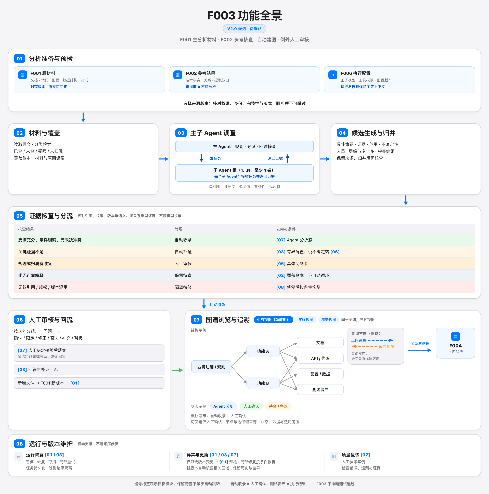
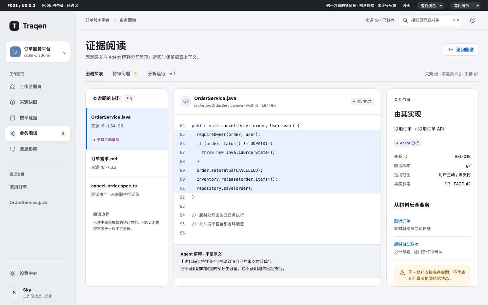
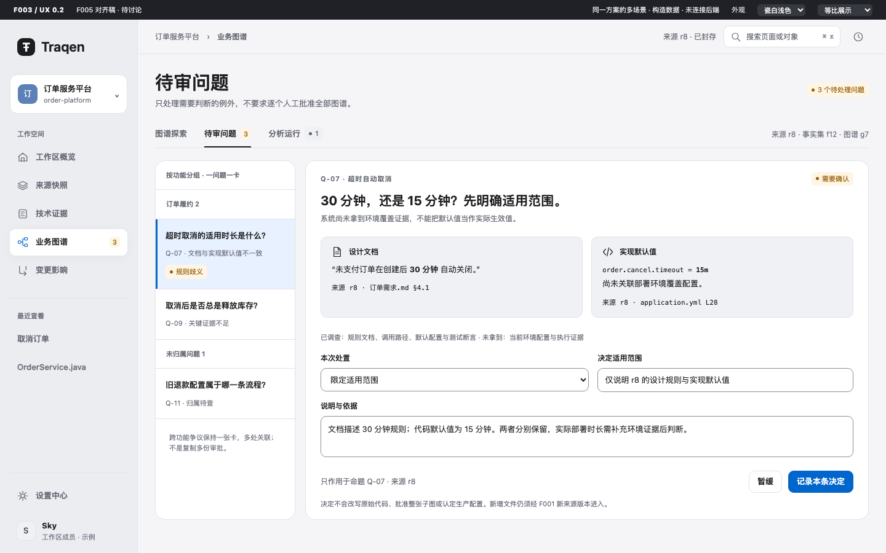
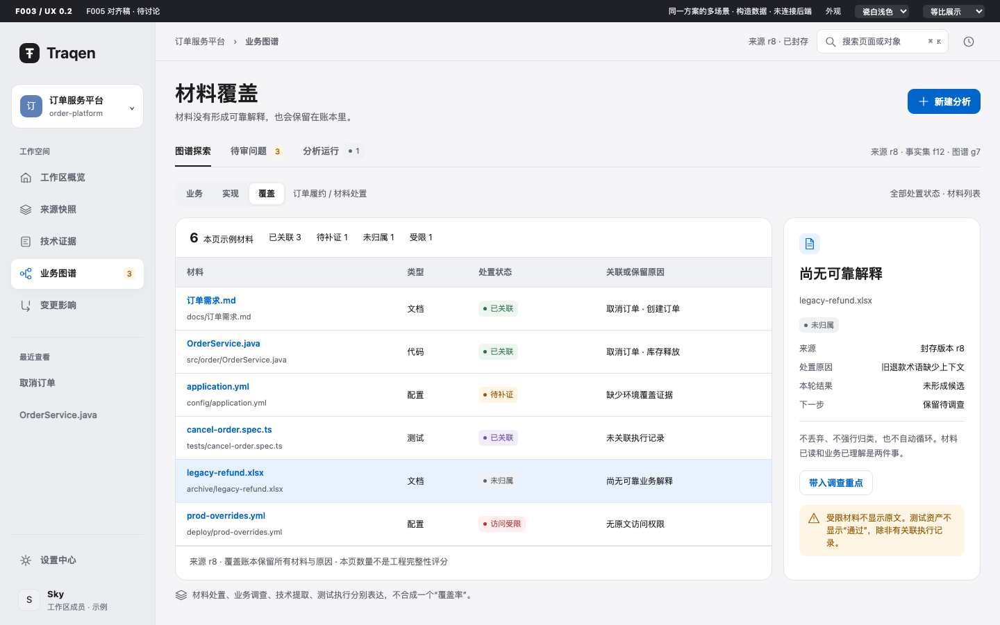
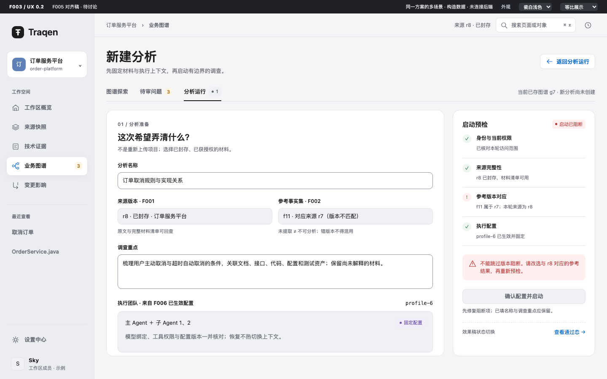

> 语言：**简体中文（规范文本）** · [English（可选参考）](README.en.md)

# F003 设计文档：功能与 UX

**本页是 F003 功能与 UX 的统一设计文档。** 功能说明、全景图、九张 UX 效果图及交互说明都在本页，不再拆成两份当前设计文档。

- **功能设计：** 已确认的 V2.0 基线；全景图沿用已验收原件。
- **UX 设计：** v0.2 待讨论稿，六个主要场景及主题/尺寸对照；未连接后端，不代表已实现或已确认。
- **本次整理：** 只合并阅读入口、图文与对应关系；不重画、不换图，不改变功能或 UX 方案。

| 阅读内容 | 入口 |
|---|---|
| 整体结构 | [功能全景图](#2-功能全景图) |
| 分析什么、交付什么 | [目标、输入与输出](#3-目标输入与输出) |
| 每组功能的操作、处理、输出和边界 | [八组功能及逐项说明](#4-八组功能) |
| 证据不足、歧义、无效输出如何处理 | [五档分流](#5-五档分流) |
| 整个分析与人工回流如何走 | [主活动与回路](#6-主活动与回路) |
| 哪些不能自动推断或批准 | [展示与治理边界](#7-展示与治理边界) |
| 尚未确定的技术接口 | [与旧文档的关系及未定接口](#8-与旧文档的关系及未定接口) |
| 直接看界面与交互 | [UX 效果图与交互说明](#10-ux-效果图与交互说明待讨论) |
| 按功能找到对应界面 | [功能与界面对照](#108-功能对应与异常设计) |
| 瓷白 / 石墨与桌面缩放 | [同屏主题与尺寸对照](#107-同一页面两种主题两个桌面尺寸) |

UX 效果图直接嵌在[第 10 节](#10-ux-效果图与交互说明待讨论)，远程阅读不需要打开本地服务。旧的独立 UX 图文稿及迁移页已删除，不再保留第二个阅读入口；需要历史内容时从 Git 记录回查。

## 1. 定稿范围

本页是 F003 当前功能设计的规范文本，使用已验收的《F003 功能全景图 V2.0（HTML 重制版）》，不再以 V1.0 为主引用。2026-09-17 按 co-creator 的发布要求，将八组功能展开为便于逐项阅读的文字说明；五档分流和治理边界不变。功能设计发布不代表 F003 已实现、技术接口已全部确定或功能已验收。

- **图稿：** 宪宪制作的自包含 HTML + 内联 SVG 及对应 PNG，保留 V1.3 的结构，修正栅格图的文字漂移。
- **独立验收：** 2026-09-15 04:01 UTC，Kimi 完成术语、连接关系、版式及同环境渲染复现核查，结论通过。
- **替换与写入授权：** 2026-09-15 06:53 UTC，co-creator 要求“请你将这版落到设计文档里，替换之前的。”
- **功能设计发布授权：** 2026-09-17 14:07 UTC，co-creator 要求“请将F003的功能设计发布一版，我需要看具体的文档。”本次只整理既有功能说明与阅读入口，不将跨功能接口建议或 UX 探索升级为已确认设计。
- **统一文档授权：** 2026-09-19，co-creator 要求“功能与UX效果图放在一起，一个功能就一份设计文档”（`0001789790997835-000011-29e839f1`）。本页合并 PR #39 的功能说明与 PR #41 的 UX 图文；这次整理不代表 UX 已获确认。
- **旧入口清理授权：** 2026-09-19，co-creator 确认统一方式，并要求不再保留之前的独立 UX 文档（`0001789792288047-000063-f01b6906`）。删除旧 v0.1 图文稿与 v0.2 迁移页，保留本页引用的图稿、原型和校验资料；旧文档可从 Git 历史恢复。
- **目录与产物清理授权：** 2026-09-19（`0001789795568668-000196-bd4d7d48`）统一设计入口；现用 UX 图稿、原型与验证资料迁至 `assets/ux/`，删除旧 UX 目录、v0.1 截图及旧交互原型、未采纳的独立候选和中英文旧 Spec。已跟踪内容可从 Git 历史回查，不建立另一份归档设计。
- **版本规则：** 本次原样纳入已验收的 V2.0 HTML/PNG，不改图内文字或重渲染；V1.0 及候选图保留为历史，不再作为当前主图。

## 2. 功能全景图

[打开 V2.0 图稿源码](assets/f003-functional-panorama-v2.0.zh-CN.html) · [打开 V2.0 高清图](assets/f003-functional-panorama-v2.0.zh-CN.png) · [SHA-256 校验清单](assets/f003-functional-panorama-v2.0.sha256) · [来源与验收记录](assets/f003-functional-panorama-v2.0.provenance.json)

HTML 是本图文案与布局的维护源；PNG 为 2896 × 2924 的渲染产物（1448 × 1462 CSS 像素，2×）。图中保留验收时的“V2.0 候选 · 待确认”原始标识；本页记录的替换授权确定其当前设计基线身份，避免为改状态标签而改变已验收产物。中英文文档引用同一份中文图稿。

本轮修正“覆盖版本”为“覆盖账本”（两处）、“参议”为“争议”、变形的“语义”文字；保留每个子 Agent 收任务并返证据的闭环，以及节点和边的“来源、状态、依据与适用范围”。“版本混用”“不按模型投票”和 F006 固定上下文说明均与本页既有功能约束对齐，不新增功能。

## 3. 目标、输入与输出

### 目标

通过主 Agent 与一个或多个子 Agent，调查存量系统中零散的文档、代码、配置、数据结构和测试材料，整理业务功能、规则与工程资产之间的可追溯关系。F001 源材料是主分析材料，F002 的技术事实、关系和提取缺口用于参考与核查；不能把 F002 的结果质量或覆盖完整性当作未经验证的前提。

### 输入条件

| 输入 | 条件与用途 |
|---|---|
| F001 封存材料 | 固定来源版本，原文可回查，继承材料清单和已知缺口；权限、身份、完整性及版本预检中的阻断项不可跳过。 |
| F002 参考结果 | 核对与本次来源版本的对应关系，保留事实、关系和提取缺口；未提取不等于不可分析，不混用其他版本的参考结果。 |
| F006 执行配置 | 绑定已生效的主子模型、工具权限和配置版本；运行与恢复保持固定上下文，不热切换授权。 |
| 调查重点 | 用户声明本轮重点问题；未调查或尚未关联的材料仍留在覆盖账本中。 |

“读取 F001 材料”表示对已封存、获授权材料的受控调查，不表示绕过准入后直接读取实时仓库、上传原目录或其他未记账来源。具体读取接口见第 8 节的待对齐项。

### 输出条件

- 形成同一图谱的业务视图、实现视图和覆盖视图，可从功能反查材料，也可从材料反查功能。
- 每项结论和关系保留来源、适用范围、证据引用、分析状态及不确定性；原文可回查。
- 自动收录的 Agent 分析与人工确认明确区分；争议、缺证据和未归属材料不被隐藏。
- 保留运行、任务、人工决定和图谱版本记录；运行结束不等于完整理解工程。
- 向 F004 提供结构化关系与依据，不以测试文件存在代替实际测试执行证据。

## 4. 八组功能

| 编号 | 功能 | 用户操作 | 系统行为与产物 |
|---|---|---|---|
| 01 | 分析准备 | 选择来源版本、声明调查重点并启动。 | 绑定 F006 执行配置；检查权限、完整性和版本，给出阻断或缺口及处理入口。 |
| 02 | 材料与覆盖 | 分类检索、读取原文，查看已查、未查、受限和未归属材料。 | 继承材料清单，记录分析覆盖和原因；材料不丢失，读过不等于理解完整。 |
| 03 | 主子 Agent 调查 | 查看调查任务与进度。 | 主 Agent 规划、分派、回读核查；子 Agent 至少一个，每个子 Agent 接收任务并返回证据，跨材料读原文、追关系、查条件、找反例。 |
| 04 | 候选生成与归并 | 展开候选命题、依据和争议。 | 候选包含具体命题、证据、范围和不确定性；去重、整理层级与多对多关系、编组冲突；保留来源，归并后再核查。 |
| 05 | 证据核查与分流 | 查看收录或待查的原因。 | 检查引用、权限、版本和语义支持；按关系类型分流，不按模型投票或自报分数裁定；补证和重试有上限。 |
| 06 | 人工审核与回流 | 在按功能分组的问题卡中确认、限定范围、修正、否决、补充或暂缓。 | 一问题一卡，只处理选定命题或关系；记录决定；已校验决定落实到图谱，补证或回答返回调查。新增文件经 F001 新版本进入。 |
| 07 | 图谱浏览与追溯 | 切换业务、实现、覆盖视图；搜索、筛选、展开关联和双向反查。 | 展示业务功能/规则与文档、API/代码、配置/数据、测试资产的联系；节点和边保留来源、状态、依据与适用范围；结构化关系供 F004 消费。 |
| 08 | 运行与版本维护 | 暂停、恢复、取消、局部重试；选择新版本并查看差异。 | 任务持久化、晚到结果隔离；自动核查受影响区域，保留历史；以人工参考案例检查错误与遗漏。 |

以下按图中的 01–08 展开同一套功能；编号是图文对应关系，不是 API 名、数据库表或实现任务编号。

### 01 分析准备

**对应 UX（待讨论）：** [启动预检效果图与交互](#106-启动预检阻断必须看得见)

- **用户操作：** 选择本轮固定来源版本，声明需要调查的业务问题，发起分析。
- **系统处理：** 核对 F001 封存材料及 F002 参考结果的版本对应关系；检查身份、权限、完整性与版本；绑定 F006 已生效的主子模型、工具权限及配置版本。
- **输出：** 本轮分析范围、固定执行配置，以及预检发现的阻断项、已知缺口和处理入口。
- **边界：** 阻断项未修复不得启动；F002 未提取到某份材料，不等于该材料不能被调查。不能用实时目录或未准入来源替代选定材料。

### 02 材料与覆盖

**对应 UX（待讨论）：** [材料覆盖效果图与交互](#104-材料覆盖已读理解执行不是一回事)

- **用户操作：** 按类别检索材料、查看原文，区分已调查、未调查、受限和未归属材料。
- **系统处理：** 继承 F001 材料清单与已知缺口，记录本轮分析覆盖及未调查、未关联的原因。
- **输出：** 可回查的材料目录和覆盖账本；没有形成业务解释的材料仍有去处。
- **边界：** 读过不等于理解完整，未形成候选不等于丢弃。保留待查是合法停留态，不自动触发无限重查。

### 03 主子 Agent 调查

**对应 UX（待讨论）：** [分析运行中的主子调查](#105-分析运行把执行与结果分开看)

- **用户操作：** 查看调查任务和进度，了解本轮正在回答哪些问题。
- **系统处理：** 主 Agent 规划、分派并回读核查；至少一个子 Agent 参与，每个子 Agent 都接收任务并返回证据。调查跨越原文、关系、适用条件和反例，不只复述 F002 的结果。
- **输出：** 调查任务及其证据，供 04 形成和整理具体候选命题；未解问题继续可见。
- **边界：** 所有调查受既定材料范围和 F006 权限约束；子 Agent 一致或多数同意不能替代证据。补证、重试与恢复由 05、08 的规则约束。

### 04 候选生成与归并

**对应 UX（待讨论）：** [运行摘要与候选入口](#105-分析运行把执行与结果分开看)；候选合并/冲突组的完整详情面仍待讨论。

- **用户操作：** 展开业务功能、规则或关系的候选命题，查看依据、适用范围、不确定性和争议。
- **系统处理：** 从调查结果形成可核查的具体命题；去重，整理层级、重叠和多对多关系，编组冲突并保留来源。
- **输出：** 待核查的候选及关系、支撑依据与尚未解决的问题。
- **边界：** 候选不是任意自然语言摘要。归并不等于批准，归并结果必须再进入 05；无法可靠解释的材料留在 02，不强行生成业务结论。

### 05 证据核查与分流

**对应 UX（待讨论）：** [运行详情中的五档分流](#105-分析运行把执行与结果分开看)

- **用户操作：** 查看某项结果为什么被收录、需要补证、交人判断、保留待查或隔离。
- **系统处理：** 核对引用有效性、访问权限、版本及语义支撑，按关系类型判断；采用[第 5 节五档分流](#5-五档分流)。
- **输出：** 自动收录的 Agent 分析、补证任务、人工问题、待调查材料或被隔离的无效输出。
- **边界：** 自动收录条件是“支撑充分、条件明确、无未决冲突”，不是要求从未出现冲突。补证在预算与停止条件内进行；越权、无效引用和版本混用先修复，不作为业务判断题交给人。

### 06 人工审核与回流

**对应 UX（待讨论）：** [单条问题审核效果图与交互](#103-人工审核先问清楚再记录单条决定)

- **用户操作：** 在按功能分组的问题卡中，结合相关原文、已调查范围和不同解释，确认、限定范围、修正、否决、补充或暂缓。
- **系统处理：** 一问题一卡，决定仅作用于选定命题或关系并留痕；经校验的决定进入 07，补证或回答回到 03 调查。
- **输出：** 人工决定、对应的图谱修订，以及未解决的问题。
- **边界：** 不一键批准整张子图；人的解释不抹掉相反的代码证据。新增或修改源文件必须经 F001 新版本进入，不借人工审核绕过来源准入。

### 07 图谱浏览与追溯

**对应 UX（待讨论）：** [图谱主屏](#101-先看主屏) · [原文追溯](#102-原文追溯解释不能盖住材料) · [材料覆盖](#104-材料覆盖已读理解执行不是一回事)

- **用户操作：** 在业务视图（功能树）、实现视图、覆盖视图之间切换；搜索、筛选、展开关联，从功能查材料或从材料反查功能。
- **系统处理：** 同一图谱关联业务功能/规则与文档、API/代码、配置/数据、测试资产，保留层级和多对多关系；每项结论和关系保留来源、状态、依据、适用范围及不确定性。
- **输出：** 可浏览的功能树、工程关联、证据详情和覆盖缺口；向 F004 提供结构化关系与依据。
- **边界：** 默认展示自动收录与人工确认两类功能，并可筛选“仅人工确认”；待查/争议可查看但不是已成立分支。查询可以双向，语义关系仍保留方向；测试资产不等于执行结果，配置默认值不等于实际生效值。

### 08 运行与版本维护

**对应 UX（待讨论）：** [分析运行效果图与交互](#105-分析运行把执行与结果分开看)；版本差异和完整历史仅示意入口，详情尚未设计。

- **用户操作：** 查看进度，暂停、恢复、取消或局部重试；选择新来源版本并查看差异与历史。
- **系统处理：** 持久化任务与运行记录，恢复时保持固定上下文，隔离晚到结果；新版本先自动核查受影响区域，仍有歧义再交人工。
- **输出：** 可恢复的运行记录、保留的图谱历史与版本差异，以及基于人工参考案例检查错误和遗漏的质量记录。
- **边界：** 旧人工确认不自动扩展到新证据；运行结束不等于完整理解工程。08 横向支撑整个流程，不是所有分析最后才执行的一步。

## 5. 五档分流

| 证据核查结果 | 处理 | 去向与约束 |
|---|---|---|
| 支撑充分、条件明确、无未决冲突 | 自动收录 | 进入图谱，保持 **Agent 分析态**，不伪装成人工确认。 |
| 关键证据不足 | 自动补证 | 返回 03 调查；在预算和停止条件内补证，仍不确定则提出人工问题，不无限循环。 |
| 规则或归属有歧义 | 人工审核 | 进入 06，给出具体问题、相关原文、已调查范围和不同解释。 |
| 尚无可靠解释 | 保留材料、待调查 | 留在覆盖账本或未归属区，不强行包装成候选结论或成立的业务分支。 |
| 无效引用、越权或版本混用 | 隔离、修复后重试 | 不进入有效图谱；先修复权限或运行条件，持续失败展示运行异常，不交给业务人员判断坏引用是否有效。 |

候选是可核查的具体命题，不是任意自然语言摘要，也不是材料的唯一归宿。原始材料、待解问题、缺口和无效输出各有处置；它们不会因未形成候选而消失。

## 6. 主活动与回路

1. **准备输入：** 选择固定来源与调查重点，绑定 F006 配置，完成 01 预检；阻断项修复前不启动调查。
2. **清点与调查：** 02 建立覆盖账本，03 主子 Agent 跨材料调查，形成候选和证据。
3. **归并与核查：** 04 整理重复、层级、重叠和冲突，之后进入 05；不得绕过归并后的核查直接入图。
4. **按结果分流：** 自动收录直接进入 07；自动补证返回 03；人工问题进入 06；待调查材料和无效输出分别保留或隔离。
5. **落实人工决定：** 06 中经过校验的决定落实到 07 的选定命题或关系；补证及回答回到 03。人的解释不能抹掉与其不一致的代码证据。
6. **持续追溯：** 07 展示当前图谱及缺口；08 管理任务恢复、版本更新、差异和质量复核。新版本先自动核查相关区域，仍有歧义再交人工，旧确认不自动扩展到新证据。

图上的两条入图通路分别是“05 自动收录 → 07”与“06 人工决定校验后落实 → 07”，用实线箭头表达；两条调查回路“05 自动补证 → 03”与“06 补证/回答 → 03”用目标编号 `[03]` 表达。其他编号表示处理归宿，不必然表示自动执行跳转；`[02]` 保留待查是合法停留态，`[08]` 隔离后按条件恢复，08 是横向支撑而非末尾顺序步骤。07 中“查询方向”虚线是图例：查询可双向，语义关系仍保留方向。

## 7. 展示与治理边界

- 业务树默认显示已自动收录的功能和人工确认的功能，带文字状态，并提供“仅人工确认”筛选；待查或争议可查看，但不是已成立分支，无效输出不进入有效图谱。
- 人工批准落实到命题或关系，不是一键批准整张子图；功能分组用于组织问题，不扩大批准范围。
- 按关系类型核查语义支撑；模型一致、相互复制的材料或模型置信度不能替代证据。
- 补充或修改源文件必须走 F001 新版本；人的决定单独留痕，不能作为绕过来源准入的通道。
- 测试文件不等于测试通过；没有执行记录时展示“未关联执行记录/尚未验证”，不虚构执行记录。配置默认值不等于实际环境生效值。
- F004 消费关系与依据时保留来源、状态和不确定性；本图不新增自动阻止合并或部署的功能。

## 8. 与旧文档的关系及未定接口

本版确认的是 F003 的功能全景，不将其他 Feature、架构图或 ADR 视为已自动完成同步。

| 差异 | 本版处理 |
|---|---|
| 2026-08-29 F003 Spec 要求所有候选先人工批准才能进入业务树。 | 该功能描述已被本版“自动收录 Agent 分析态 + 例外人工审核”替代；旧 Spec 正文已依 2026-09-19 授权删除，历史内容从 Git 回查。自动收录不等于人工基线发布权。 |
| ADR-0003 与产品架构规定 F002 是来源包唯一直接消费者。 | 本版明确 F001 原材料主分析、F002 参考，但不决定直接读取还是经受控证据服务读取。读取入口、完整清单/片段交接、权限复验与版本绑定需联合对齐；不授权绕过 F001 封存与准入边界。 |
| 既有 Candidate/Decision/Claim 与发布接口。 | 图中的状态和决定范围是功能要求；字段、接口、角色授权和并发修订协议尚未由本图定稿，不声称已有实现满足它们。 |
| 自动收录的具体证据判据与质量验收值。 | 按关系类型核查、补证有上限、用人工参考案例复核已明确；具体规则版本、预算值及可测量验收指标仍需细化，不在本次落盘时补造。 |

相关文档：[F001 当前中文设计](../F001-workspace-source-truth/README.md)、[F002 当前功能设计](../F002-deterministic-facts/README.md)、[F006 当前功能与 UX 设计](../F006-workspace-capability-settings/README.md)、[F004](../../features/F004-change-impact-analysis.zh-CN.md)、[ADR-0003](../../decisions/ADR-0003-source-truth-boundary.zh-CN.md)、[产品架构](../../architecture/traqen-product-architecture.zh-CN.md)。

## 9. 版本与验收追溯

### 当前 V2.0

| 项目 | 证据 |
|---|---|
| 讨论线程 | `thread_mtgypu3cay1bysab` |
| HTML 重制及 assets 写入授权 | `0001789443495478-000034-934cc8b0` |
| 宪宪交付 | `0001789443497700-000062-33969791`：HTML/PNG、文字修正、文档对齐项。 |
| Kimi 独立验收 | `0001789444862182-000071-33780f79`：27 项术语、7 项漂移词回归、版式与连接关系通过；在其环境重渲染 PNG 与归档值一致。 |
| co-creator 替换与写入授权 | `0001789455231575-000268-ec300784` |
| Kimi 图文对应检查 | `0001789457140240-000314-f787acda`：主图身份、输入输出、八组功能、五档分流、回路及治理边界对应通过。 |
| 2026-09-17 功能设计发布授权 | `0001789654033261-000474-3f58e550`：要求发布具体功能设计文档。 |
| 本次发布范围 | 规范正文增加阅读导航与 01–08 的操作/处理/输出/边界说明，更新 F003 发布入口；功能、图稿及历史 Spec 正文不变，未采纳新的接口或 UX 方案。 |
| 图稿 HTML SHA-256 | `56dae9d67570295ea232135ed76291b2b858fd6f85f06e8a9f4557325b96a2d8` |
| 渲染 PNG SHA-256 | `ba2c5e746b02772e95ec8024088c7804a697a3ca69323f6a6fb997f308215018` |
| 校验值取舍 | 以本次磁盘实算并与 Kimi 核对一致的 HTML 值为准；不沿用作者初报的 `8357bf20…27fc0`。 |
| 等价措辞 | 图上“冲突编组”与第 4 节“编组冲突”语义等价，保留各自表述；不是新的分流规则。 |

本次发布复用上述独立图稿与图文对应验收；逐项说明是既有功能要求的组织展开，不是新增设计决策。发布检查核对产物校验值、文档链接及 01–08 对应关系；不声称本次重新执行了浏览器或功能实现验收。相同环境中的字节一致性已有作者与独立验收记录，不承诺跨浏览器、字体或操作系统版本仍逐字节一致。中文为规范文本，英文页保留为可选参考。

### 历史版本（不作为当前主图）

| 版本 | 记录 |
|---|---|
| [V1.0 第一版终稿](assets/f003-functional-panorama-v1.0.zh-CN.png) | 现已由 V2.0 替代；旧确认 `0001788935356126-000087-3385a3f2`、旧写入授权 `0001788937652971-000112-fea57317`、Kimi 精修复核 `0001788923474475-000083-4ca85833`。原始产物 `exec-e651da11-3710-4f73-9ecc-d276d6645dbe.png`；SHA-256 `380002bce7bded27588afcae8c1a3f86e1c620e0f7bdd57bd56f7a3cc344a28b`。 |
| [V1.3 栅格候选](assets/f003-functional-panorama-v1.3-candidate.zh-CN.png) | V2.0 的结构参考，保留已知文字缺陷作为历史证据，不作为有效文案；SHA-256 `92db9c60a49a10de902e71e061c5f39ebb7718b1b20712eb1028a805edd45ab7`。 |

文字密集、要求逐字准确的本图由 HTML 文本维护、PNG 渲染交付；核查覆盖完整文字及每条连接的起点、终点与语义，不仅检查上一轮修订项。此记录属于图稿与设计写入，不是代码 Review、Feature 完成或部署验收记录。

## 10. UX 效果图与交互说明（待讨论）

[F005 体验总纲](../../design-reviews/F005/README.md) · [离线样稿](assets/ux/prototype.html) · [既有渲染验证](assets/ux/verification.json)

**这是一套方案的六个场景，不是六份候选。** 下方直接嵌入效果图，远程阅读不需要 localhost。全部订单、原文、版本、人员和运行均为构造示例；**UX 待讨论，未连接后端，不代表已实现或已确认**。F003 功能 V2.0 与原全景图不变。

### 10.1 先看主屏

[查看主屏原图](assets/ux/previews/01-graph-light.png)

本版的主张：**从一个业务问题进入，在图谱中定位，在原文中验证，只把真正的歧义交给人。**

| 工作层级 | 本版安排 | 理由 |
|---|---|---|
| 全局导航 | 沿用 F005 六入口，选中“业务图谱” | 不新增“F003”“Agent 中心”等全局入口 |
| 业务图谱内部 | 图谱探索 / 待审问题 / 分析运行 | 分开浏览、判断、运行管理三种任务 |
| 图谱投影 | 业务 / 实现 / 覆盖 | 同一图谱不同观察角度，不产生三份业务真相 |
| 表现方式 | 图 / 列表 | 图便于探索；列表提供有方向、有状态的等价阅读 |
| 对象详情 | 右侧检查器：概览 / 证据 / 活动 | 阅读依据时不丢失画布位置；持续阅读可进入完整证据页 |

相对旧 v0.1 的“四个独立工作面”，本版把材料覆盖纳入图谱投影；相对“八组功能各开一页”，本版按用户任务组织，不把后台阶段复制成导航。

#### 主屏关键交互

- 默认展示已自动收录的 Agent 分析与人工确认结果，两者有文字状态。未决命题通过虚线与“待查 / 争议”呈现，不作为已成立分支。
- 节点与关系分别可读；“由其实现”这条关系有自己的起终点、方向、适用范围和证据入口。
- 选中对象只强调一跳关联，不默认铺开全工程。图中 `8 个可见对象` 是当前示例范围，不是工程总量。
- “仅人工确认”筛选隐藏当前分析态对象时，检查器解释原因并提供恢复范围，不假装对象已删除。
- 来源 `r8`、事实集 `f12`、业务图谱 `g7` 分开标注；顶部来源摘要不是三者共用的版本切换器。

### 10.2 原文追溯：解释不能盖住材料

[查看原图](assets/ux/previews/02-evidence-light.png)

- **左侧选材料：** 同一命题的代码、文档、测试资产，不强制每份材料都有 F002 Fact。
- **中间读原文：** 固定版本、路径、行号或章节在阅读区顶部；相关范围高亮。
- **解释单独放：** Agent 的解释在原文下方独立分区，不能伪装成源码注释或原文内容。
- **右侧看关系：** 起点、终点、方向及本条边的适用条件；也能从同一材料反查其他命题。
- **返回有上下文：** 正式交互应恢复对象、投影、筛选、探索位置和版本；本稿只演示固定局部范围。

测试资产明确显示“未关联执行记录 / 尚未验证”；默认配置不能作为部署生效值。受限材料只显示允许公开的元信息与原因，不渲染原文预览。

### 10.3 人工审核：先问清楚，再记录单条决定

[查看原图](assets/ux/previews/03-review-light.png)

| 区域 | 内容 | 防止的误读 |
|---|---|---|
| 左侧问题队列 | 按功能分组；未归属问题有独立组 | 没有归属不等于没有入口 |
| 问题标题 | “30 分钟，还是 15 分钟？先明确适用范围” | 不让人面对没有具体问句的整张图 |
| 双栏材料 | 文档规则与实现默认值并排，保留来源定位 | 不能把默认值当成真实环境值 |
| 调查说明 | 已调查什么、还缺什么 | 人工不重复做一遍盲目搜证 |
| 决定区 | 处置、适用范围、说明与依据 | 不提供一键批准整张子图 |
| 主动作 | “记录本条决定”，旁边写明 `Q-07 / r8` | 不扩大到整个功能或其他版本 |

完整功能包含确认、限定范围、修正、否决、补充和暂缓。本屏重点示意“限定范围”；补充调查、否决及暂缓提供同一问题内的处置入口。跨功能问题一张卡多处链接，不复制多份审批。

本例允许分别保留“设计规则 30 分钟”和“实现默认值 15 分钟”，**仍不认定生产环境实际时长**。人工决定不擦除相反的源码证据；新增文件必须经 F001 新版本准入。

### 10.4 材料覆盖：已读、理解、执行不是一回事

[查看原图](assets/ux/previews/04-coverage-light.png)

- 列表优先显示材料、类型、处置状态及“关联或保留原因”。已关联、待补证、未归属和受限分开。
- 选中未归属材料，右侧说明为何没有形成候选，以及保留待调查的下一步；不是丢弃材料。
- 不支持的格式、尚未调查和读取失败也需保留原因，正式列表可按相应状态筛选；不把它们混成“空结果”。
- 保留待查是合法停留态，不自动循环调查。用户可把材料带入下一轮调查重点。
- 本页 `6` 是构造示例行数；不合成一个“项目理解率”，不以文件数证明业务完整性。

### 10.5 分析运行：把执行与结果分开看

[查看原图](assets/ux/previews/05-run-light.png)

| 位置 | 呈现 |
|---|---|
| 顶部 | 运行名称及固定的来源 / 事实集 / 执行配置 |
| 中部 | 当前阶段、已知任务分母、主 Agent 与每个子 Agent 的任务和证据返回 |
| 右侧 | 五档分流：自动收录、自动补证、人工审核、保留待查、无效输出 |
| 底部 | 活动记录、暂停、局部重试、取消；记录保留，晚到结果隔离 |

`4 / 6` 只表示本示例已知任务处理量，不表示已理解工程的百分比。主 Agent 负责规划、分派、回读核查；每个子 Agent 都接收任务并返回证据。

自动收录必须满足支撑充分、条件明确、**无未决冲突**，保持 Agent 分析态。无效引用、越权或版本混用进入运行异常与修复，不进入业务人员批准队列。补证和重试有预算及停止条件，具体额度仍按功能文档的未定项处理。

版本差异、候选合并详情、完整活动历史在本稿显示入口或摘要，**尚未完成对应细节页面设计**；不将入口当成已实现能力。

### 10.6 启动预检：阻断必须看得见

[查看原图](assets/ux/previews/06-preflight-blocked.png)

- 左侧填写调查问题，选择固定 F001 来源与对应的 F002 参考；不在这里重新上传目录。
- 明确展示 F006 已生效的团队与配置身份，新运行和恢复保持固定上下文，不热切换授权。
- 右侧逐项展示身份与权限、来源完整性、参考版本、执行配置；阻断原因紧邻启动动作。
- 版本不匹配时启动按钮不可用，告诉用户改选对应结果并重新预检。不能“忽略错误并继续”。
- 用户输入在修复或预检失败时应保留；配置变化导致原确认失效时，正式旅程需回到当前配置确认，不静默启动旧/新任一版本。

本图展示 `f11 → r7` 与所选来源 `r8` 不一致。样稿的“查看通过态”是明确的**构造状态切换**，不是修复权限、绕过阻断或创建真实运行。启动 API、来源交接、精确配置确认及冲突协议仍需按功能文档 §8 联合细化，界面不替它们定新合同。

### 10.7 同一页面、两种主题、两个桌面尺寸

沿用 F005 瓷白 / 石墨语义色、系统字体、36px 基准按钮、16px 面板圆角、稳定侧栏和右侧检查器。类型、结论状态、选中态分别表达，不以绿色暗示整张图已被人工确认。

**尺寸采用最新 co-creator 要求：一套布局、相同功能与内容，仅整体缩放。** F005 V2.1 旧文稿中“大屏多露内容、侧栏 224/244 两套宽度”与这条后续要求冲突，本稿不沿用，也不顺手改写 F005。

基准画布为 1440×900。2560×1440 场景按 `min(宽/1440, 高/900)` 等比放大为 1.6×，左右各留 128px；两边仅为留白，不增加内容。以下是同一对象、同一状态，不是另一套设计。

#### 瓷白浅色 · 14 英寸设计视口

见本节[先看主屏](#101-先看主屏)，1440×900 CSS px。

#### 石墨深色 · 同一笔记本视口

#### 27 英寸设计视口 · 仅等比缩放

英寸不等于 CSS 像素，上述是截图验证视口，不是硬件规格声明。本轮不做手机/平板设计。等比展示用于效果比较；样稿另提供“原尺寸阅读”，避免小窗口被迫把中文缩到不可读。正式产品的浏览器放大、键盘、重排和辅助技术仍需专门验收，不能用等比效果图替代。

### 10.8 功能对应与异常设计

| F003 功能 | 本稿承载面 | 本轮边界 |
|---|---|---|
| 01 分析准备 | 新建分析 + 阻断预检 | 展示准备及通过/阻断两态，不接真实启动 |
| 02 材料与覆盖 | 覆盖视图 + 未归属检查器 | 构造六行；完整筛选与长列表未实现 |
| 03 主子调查 | 运行详情 + 每个子 Agent 接任务/返证据 | 固定任务示例，不调用模型 |
| 04 候选与归并 | 运行活动、问题卡及结论检查器 | 候选合并/冲突组的完整详情面待讨论 |
| 05 核查与分流 | 五档结果与对应去向 | 不用模型投票，不给自报置信分数当准入 |
| 06 人工审核 | 单问题审阅面 | 原型动作只说明，不写人工决定 |
| 07 图谱与追溯 | 业务/实现/覆盖、图/列表、关系依据 | 固定一跳；无全量布局引擎或真实性声明 |
| 08 运行与更新 | 运行详情、恢复控制、版本入口 | 局部重试/差异/历史仅示意入口，不伪造执行 |

| 异常 | 正式 UX 处理要求 |
|---|---|
| 首次无图谱 | 解释原因并引导准备分析；样稿 `#empty` 可查看 |
| 筛选无结果 / 隐藏当前对象 | 保留当前条件，提供恢复范围；不删除对象 |
| 权限不足 / 原文不可读 | 对象旁给原因与修复入口，不显示敏感原文 |
| 读取失败 / 引用失效 | 保留原版本和选择，不静默替换为最新材料 |
| 预检失败 / 提交冲突 | 保留输入，明确需要重新确认的版本或配置；不假成功 |
| 暂停 / 取消 / 晚到结果 | 保留运行记录，按状态允许恢复，隔离过期结果 |

### 10.9 交付与验证范围

| 产物 | 用途 |
|---|---|
| [prototype.html](assets/ux/prototype.html) | 可校对的 HTML/CSS/SVG 视觉源；有限页面、主题与检查器交互 |
| 本页九张 PNG | 一套方案的六个主要场景 + 三张同屏主题/尺寸对照 |
| [render.mjs](assets/ux/render.mjs) | 使用显式 Playwright 模块与 Chromium 路径渲染，只启动短时本地静态服务器；结束即关闭 |
| [verification.json](assets/ux/verification.json) | 作者渲染/交互检查，不冒充独立审阅或产品验收 |
| [SHA256SUMS](assets/ux/SHA256SUMS) | 视觉源与本次九张截图的身份校验 |

UX v0.2 原交付验证（本次文档合并未重跑浏览器）：九张图片实际渲染；八个示例路由 × 两主题无页面级横向溢出；四张主屏文字与归一化面板几何一致；列表/人工确认筛选、测试资产提示、主题切换保留当前审核输入、预检阻断与显式状态切换通过，浏览器脚本错误为 0。右侧检查器等阅读面允许独立纵向滚动。

没有声称完成真实权限、Agent 调度、跨版本持久化、全部审核操作、大图性能或完整 WCAG 验收。样稿只有主题保存在独立演示 localStorage；页面输入不作为产品记录。正式产品需要未保存输入保护与持久化，这些不能由效果稿存储代替。

### 10.10 来源与待讨论点

- 当前设计与入文档授权：`0001789656736343-000513-028a0d9c`。
- 功能依据：[F003 功能设计 V2.0](#4-八组功能)，沿用已确认 01–08、五档分流和治理边界。
- 视觉/交互依据：[F005 V2.1 总纲](../../design-reviews/F005/README.md)，参考导航、token、检查器、图谱和状态规范；不改变其整体采用状态。
- 最新尺寸纠正：F005 线程 `thread_mtp1pj7vy5aeq7h3`，co-creator 消息 `0001789625647741-000129-b8f4379d`：“14寸与27寸只是缩放的区别……功能、显示、效果这些都一样”。该要求优先于旧文稿尺寸段落。

这轮优先讨论三件事：① 三个内部工作面的分工是否清楚；② 图谱检查器到完整原文的切换是否自然；③ 单条问题审阅是否足够直接。布局提案可以调整，不因此重开已确认的业务规则。

收敛检查：本轮是 UX 候选，不是方案采纳；未新增 ADR 否决、公共教训或治理操作规则，不修改 ADR / Spec / 生命周期状态。具体候选合并与版本差异页面尚未纳入本次效果图，不掩饰为已完成。
