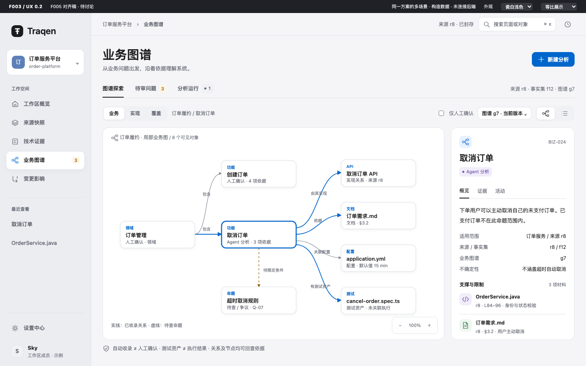
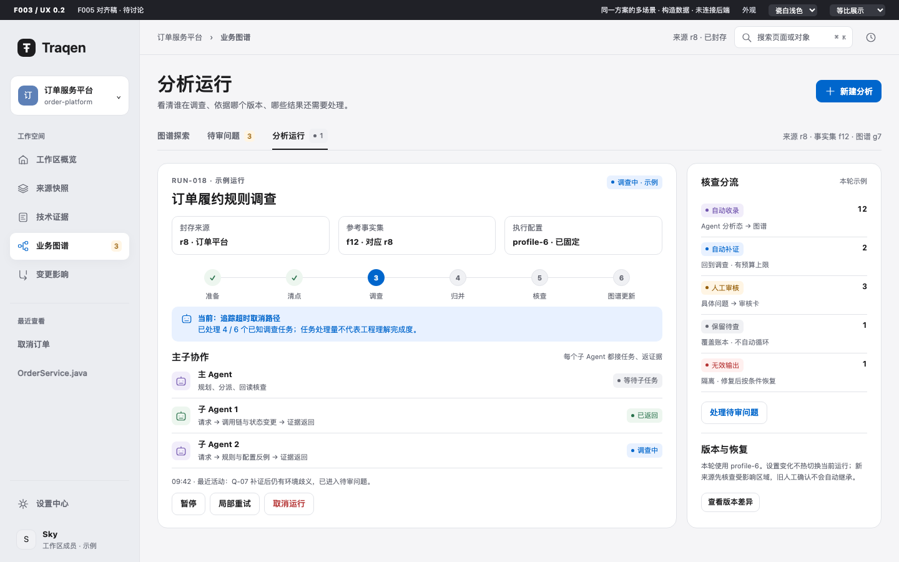
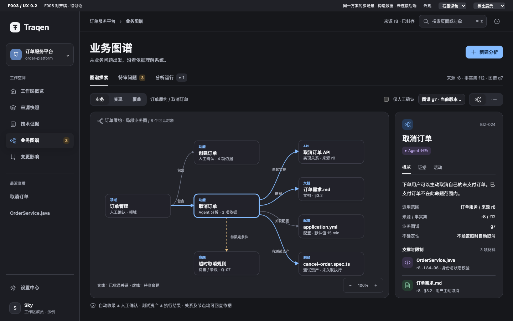
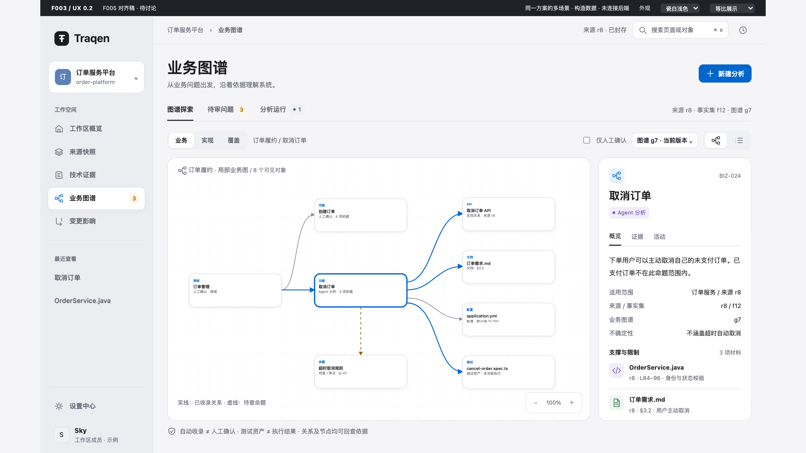
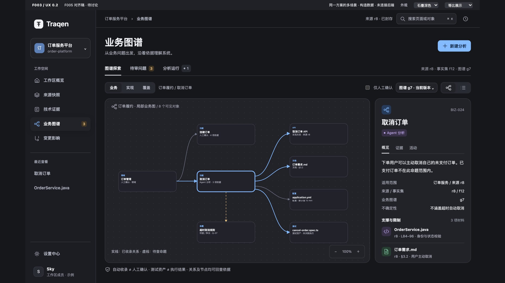

# F003 前端 UX v0.2 · F005 对齐稿

[返回功能设计 V2.0](../README.md) · [F005 体验总纲](../../../design-reviews/F005/README.md) · [离线样稿](assets/prototype.html) · [渲染验证](assets/verification.json)

**这是一套方案的六个场景，不是六份候选。** 下方直接嵌入效果图，远程阅读不需要 localhost。全部订单、原文、版本、人员和运行均为构造示例；**UX 待讨论，未连接后端，不代表已实现或已确认**。F003 功能 V2.0 与原全景图不变。

## 1. 先看主屏

[查看主屏原图](assets/previews/01-graph-light.png)

本版的主张：**从一个业务问题进入，在图谱中定位，在原文中验证，只把真正的歧义交给人。**

| 工作层级 | 本版安排 | 理由 |
|---|---|---|
| 全局导航 | 沿用 F005 六入口，选中“业务图谱” | 不新增“F003”“Agent 中心”等全局入口 |
| 业务图谱内部 | 图谱探索 / 待审问题 / 分析运行 | 分开浏览、判断、运行管理三种任务 |
| 图谱投影 | 业务 / 实现 / 覆盖 | 同一图谱不同观察角度，不产生三份业务真相 |
| 表现方式 | 图 / 列表 | 图便于探索；列表提供有方向、有状态的等价阅读 |
| 对象详情 | 右侧检查器：概览 / 证据 / 活动 | 阅读依据时不丢失画布位置；持续阅读可进入完整证据页 |

相对旧 v0.1 的“四个独立工作面”，本版把材料覆盖纳入图谱投影；相对“八组功能各开一页”，本版按用户任务组织，不把后台阶段复制成导航。

### 主屏关键交互

- 默认展示已自动收录的 Agent 分析与人工确认结果，两者有文字状态。未决命题通过虚线与“待查 / 争议”呈现，不作为已成立分支。
- 节点与关系分别可读；“由其实现”这条关系有自己的起终点、方向、适用范围和证据入口。
- 选中对象只强调一跳关联，不默认铺开全工程。图中 `8 个可见对象` 是当前示例范围，不是工程总量。
- “仅人工确认”筛选隐藏当前分析态对象时，检查器解释原因并提供恢复范围，不假装对象已删除。
- 来源 `r8`、事实集 `f12`、业务图谱 `g7` 分开标注；顶部来源摘要不是三者共用的版本切换器。

## 2. 原文追溯：解释不能盖住材料

[查看原图](assets/previews/02-evidence-light.png)

- **左侧选材料：** 同一命题的代码、文档、测试资产，不强制每份材料都有 F002 Fact。
- **中间读原文：** 固定版本、路径、行号或章节在阅读区顶部；相关范围高亮。
- **解释单独放：** Agent 的解释在原文下方独立分区，不能伪装成源码注释或原文内容。
- **右侧看关系：** 起点、终点、方向及本条边的适用条件；也能从同一材料反查其他命题。
- **返回有上下文：** 正式交互应恢复对象、投影、筛选、探索位置和版本；本稿只演示固定局部范围。

测试资产明确显示“未关联执行记录 / 尚未验证”；默认配置不能作为部署生效值。受限材料只显示允许公开的元信息与原因，不渲染原文预览。

## 3. 人工审核：先问清楚，再记录单条决定

[查看原图](assets/previews/03-review-light.png)

| 区域 | 内容 | 防止的误读 |
|---|---|---|
| 左侧问题队列 | 按功能分组；未归属问题有独立组 | 没有归属不等于没有入口 |
| 问题标题 | “30 分钟，还是 15 分钟？先明确适用范围” | 不让人面对没有具体问句的整张图 |
| 双栏材料 | 文档规则与实现默认值并排，保留来源定位 | 不能把默认值当成真实环境值 |
| 调查说明 | 已调查什么、还缺什么 | 人工不重复做一遍盲目搜证 |
| 决定区 | 处置、适用范围、说明与依据 | 不提供一键批准整张子图 |
| 主动作 | “记录本条决定”，旁边写明 `Q-07 / r8` | 不扩大到整个功能或其他版本 |

完整功能包含确认、限定范围、修正、否决、补充和暂缓。本屏重点示意“限定范围”；补充调查、否决及暂缓提供同一问题内的处置入口。跨功能问题一张卡多处链接，不复制多份审批。

本例允许分别保留“设计规则 30 分钟”和“实现默认值 15 分钟”，**仍不认定生产环境实际时长**。人工决定不擦除相反的源码证据；新增文件必须经 F001 新版本准入。

## 4. 材料覆盖：已读、理解、执行不是一回事

[查看原图](assets/previews/04-coverage-light.png)

- 列表优先显示材料、类型、处置状态及“关联或保留原因”。已关联、待补证、未归属和受限分开。
- 选中未归属材料，右侧说明为何没有形成候选，以及保留待调查的下一步；不是丢弃材料。
- 不支持的格式、尚未调查和读取失败也需保留原因，正式列表可按相应状态筛选；不把它们混成“空结果”。
- 保留待查是合法停留态，不自动循环调查。用户可把材料带入下一轮调查重点。
- 本页 `6` 是构造示例行数；不合成一个“项目理解率”，不以文件数证明业务完整性。

## 5. 分析运行：把执行与结果分开看

[查看原图](assets/previews/05-run-light.png)

| 位置 | 呈现 |
|---|---|
| 顶部 | 运行名称及固定的来源 / 事实集 / 执行配置 |
| 中部 | 当前阶段、已知任务分母、主 Agent 与每个子 Agent 的任务和证据返回 |
| 右侧 | 五档分流：自动收录、自动补证、人工审核、保留待查、无效输出 |
| 底部 | 活动记录、暂停、局部重试、取消；记录保留，晚到结果隔离 |

`4 / 6` 只表示本示例已知任务处理量，不表示已理解工程的百分比。主 Agent 负责规划、分派、回读核查；每个子 Agent 都接收任务并返回证据。

自动收录必须满足支撑充分、条件明确、**无未决冲突**，保持 Agent 分析态。无效引用、越权或版本混用进入运行异常与修复，不进入业务人员批准队列。补证和重试有预算及停止条件，具体额度仍按功能文档的未定项处理。

版本差异、候选合并详情、完整活动历史在本稿显示入口或摘要，**尚未完成对应细节页面设计**；不将入口当成已实现能力。

## 6. 启动预检：阻断必须看得见

[查看原图](assets/previews/06-preflight-blocked.png)

- 左侧填写调查问题，选择固定 F001 来源与对应的 F002 参考；不在这里重新上传目录。
- 明确展示 F006 已生效的团队与配置身份，新运行和恢复保持固定上下文，不热切换授权。
- 右侧逐项展示身份与权限、来源完整性、参考版本、执行配置；阻断原因紧邻启动动作。
- 版本不匹配时启动按钮不可用，告诉用户改选对应结果并重新预检。不能“忽略错误并继续”。
- 用户输入在修复或预检失败时应保留；配置变化导致原确认失效时，正式旅程需回到当前配置确认，不静默启动旧/新任一版本。

本图展示 `f11 → r7` 与所选来源 `r8` 不一致。样稿的“查看通过态”是明确的**构造状态切换**，不是修复权限、绕过阻断或创建真实运行。启动 API、来源交接、精确配置确认及冲突协议仍需按功能文档 §8 联合细化，界面不替它们定新合同。

## 7. 同一页面、两种主题、两个桌面尺寸

沿用 F005 瓷白 / 石墨语义色、系统字体、36px 基准按钮、16px 面板圆角、稳定侧栏和右侧检查器。类型、结论状态、选中态分别表达，不以绿色暗示整张图已被人工确认。

**尺寸采用最新 co-creator 要求：一套布局、相同功能与内容，仅整体缩放。** F005 V2.1 旧文稿中“大屏多露内容、侧栏 224/244 两套宽度”与这条后续要求冲突，本稿不沿用，也不顺手改写 F005。

基准画布为 1440×900。2560×1440 场景按 `min(宽/1440, 高/900)` 等比放大为 1.6×，左右各留 128px；两边仅为留白，不增加内容。以下是同一对象、同一状态，不是另一套设计。

### 瓷白浅色 · 14 英寸设计视口

见本文第 1 节主屏，1440×900 CSS px。

### 石墨深色 · 同一笔记本视口

### 27 英寸设计视口 · 仅等比缩放

英寸不等于 CSS 像素，上述是截图验证视口，不是硬件规格声明。本轮不做手机/平板设计。等比展示用于效果比较；样稿另提供“原尺寸阅读”，避免小窗口被迫把中文缩到不可读。正式产品的浏览器放大、键盘、重排和辅助技术仍需专门验收，不能用等比效果图替代。

## 8. 功能对应与异常设计

| F003 功能 | 本稿承载面 | 本轮边界 |
|---|---|---|
| 01 分析准备 | 新建分析 + 阻断预检 | 展示准备及通过/阻断两态，不接真实启动 |
| 02 材料与覆盖 | 覆盖视图 + 未归属检查器 | 构造六行；完整筛选与长列表未实现 |
| 03 主子调查 | 运行详情 + 每个子 Agent 接任务/返证据 | 固定任务示例，不调用模型 |
| 04 候选与归并 | 运行活动、问题卡及结论检查器 | 候选合并/冲突组的完整详情面待讨论 |
| 05 核查与分流 | 五档结果与对应去向 | 不用模型投票，不给自报置信分数当准入 |
| 06 人工审核 | 单问题审阅面 | 原型动作只说明，不写人工决定 |
| 07 图谱与追溯 | 业务/实现/覆盖、图/列表、关系依据 | 固定一跳；无全量布局引擎或真实性声明 |
| 08 运行与更新 | 运行详情、恢复控制、版本入口 | 局部重试/差异/历史仅示意入口，不伪造执行 |

| 异常 | 正式 UX 处理要求 |
|---|---|
| 首次无图谱 | 解释原因并引导准备分析；样稿 `#empty` 可查看 |
| 筛选无结果 / 隐藏当前对象 | 保留当前条件，提供恢复范围；不删除对象 |
| 权限不足 / 原文不可读 | 对象旁给原因与修复入口，不显示敏感原文 |
| 读取失败 / 引用失效 | 保留原版本和选择，不静默替换为最新材料 |
| 预检失败 / 提交冲突 | 保留输入，明确需要重新确认的版本或配置；不假成功 |
| 暂停 / 取消 / 晚到结果 | 保留运行记录，按状态允许恢复，隔离过期结果 |

## 9. 交付与验证范围

| 产物 | 用途 |
|---|---|
| [prototype.html](assets/prototype.html) | 可校对的 HTML/CSS/SVG 视觉源；有限页面、主题与检查器交互 |
| 本页九张 PNG | 一套方案的六个主要场景 + 三张同屏主题/尺寸对照 |
| [render.mjs](assets/render.mjs) | 使用显式 Playwright 模块与 Chromium 路径渲染，只启动短时本地静态服务器；结束即关闭 |
| [verification.json](assets/verification.json) | 作者渲染/交互检查，不冒充独立审阅或产品验收 |
| [SHA256SUMS](assets/SHA256SUMS) | 视觉源与本次九张截图的身份校验 |

作者验证：九张图片实际渲染；八个示例路由 × 两主题无页面级横向溢出；四张主屏文字与归一化面板几何一致；列表/人工确认筛选、测试资产提示、主题切换保留当前审核输入、预检阻断与显式状态切换通过，浏览器脚本错误为 0。右侧检查器等阅读面允许独立纵向滚动。

没有声称完成真实权限、Agent 调度、跨版本持久化、全部审核操作、大图性能或完整 WCAG 验收。样稿只有主题保存在独立演示 localStorage；页面输入不作为产品记录。正式产品需要未保存输入保护与持久化，这些不能由效果稿存储代替。

## 10. 来源与待讨论点

- 当前设计与入文档授权：`0001789656736343-000513-028a0d9c`。
- 功能依据：[F003 功能设计 V2.0](../README.md)，沿用已确认 01–08、五档分流和治理边界。
- 视觉/交互依据：[F005 V2.1 总纲](../../../design-reviews/F005/README.md)，参考导航、token、检查器、图谱和状态规范；不改变其整体采用状态。
- 最新尺寸纠正：F005 线程 `thread_mtp1pj7vy5aeq7h3`，co-creator 消息 `0001789625647741-000129-b8f4379d`：“14寸与27寸只是缩放的区别……功能、显示、效果这些都一样”。该要求优先于旧文稿尺寸段落。
- [旧 UX v0.1](../../../../feature-discussions/2026-09-09-F003-traceability-graph-design/ux-v0.1.zh-CN.md) 保留为历史，不覆盖原图或原型。

这轮优先讨论三件事：① 三个内部工作面的分工是否清楚；② 图谱检查器到完整原文的切换是否自然；③ 单条问题审阅是否足够直接。布局提案可以调整，不因此重开已确认的业务规则。

收敛检查：本轮是 UX 候选，不是方案采纳；未新增 ADR 否决、公共教训或治理操作规则，不修改 ADR / Spec / 生命周期状态。具体候选合并与版本差异页面尚未纳入本次效果图，不掩饰为已完成。
