# F006 · 能力设置：整体体验设计审阅稿

> **待你审查，不代表已采纳或已上线。** 本稿按 2026-09-18 的要求，将 F005 的整体体验语言落实到 F006 的页面、组件、任务和恢复状态，而不只提供两张换色图片。已有[功能设计 V1.0](README.md)保留；本稿是其视觉与交互的审阅补充，不修改正式 Spec、权限或运行契约。

## 先看什么

先看下面同一团队的四张图，再按“全局资产 → 工作区能力 → Agent 授权 → 应用”的顺序审阅。随后查看错误恢复与停用影响。图片、交互样稿与文案必须来自同一份设计源，不把生成式图片当作产品界面或行为证据。

审查重点不是选择一个漂亮配色，而是确认三件事：**一眼知道在改哪个范围；能看清谁获得哪些能力；始终知道编辑是否保存、是否生效、失败如何恢复。**

### 同一团队 · 两种桌面 · 两种主题

示例是一个 Main、两个 Child；两个 Child 不是最低数量要求。对照图保持相同模型、授权、选择与草稿状态。所有账号、版本和能力均为构造数据，不代表真实登录、检测或运行。

#### 14 英寸场景 · 1440 × 900 · 瓷白


#### 14 英寸场景 · 1440 × 900 · 石墨


#### 27 英寸场景 · 2560 × 1440 · 瓷白


#### 27 英寸场景 · 2560 × 1440 · 石墨


大屏增加可见内容和对照空间，**不是整张小屏图等比放大**。主标题、表单、按钮、错误字号不随屏幕变大；表单和说明仍限制阅读宽度。

## 1. 对上一版的修正

前轮两张生成式预览只覆盖了团队页，且两版布局、图标、控件细节并不完全一致；它们没有证明全局资产、能力管理、失效与恢复能使用同一套系统。本稿不将其收入正式设计图集，也不把它们作为实施基准。

| 先前不足 | 本稿的设计决定 | 审阅时怎样判断 |
|---|---|---|
| 用“瓷白/石墨”代替整体体验对齐 | 同时对齐壳、导航、组件、密度、状态和上下文保持 | 团队、账号、能力、错误页像同一产品，而非独立海报 |
| 单页展示，范围不完整 | 全局账号/模型/Skill/MCP历史与 Workspace 团队/能力分别有落点 | 不需要依赖演示场景选择器才能找到业务入口 |
| 只看静态就绪状态 | 补空态、失败、冲突、影响确认、只读版本 | 错误发生后仍知道修改在哪、如何恢复 |
| 图片里的状态容易矛盾 | 数量、列表、授权、就绪性从同一个示例状态派生 | 卡片“2 项 Skill”必须对应详情两项勾选 |
| 画面与文字规范分离 | 每张图附任务、范围、主动作、状态与限制 | 读图后可在同章找到行为说明 |
| 以图稿完成暗示产品完成 | 分开“设计目标”“样稿实测”“正式产品待接线” | 不宣称真实账号可用、MCP执行或 AC-C2 已完成 |

## 2. F005 是完整系统，不只是色板

依据为 [F005 整体体验总纲 V2.1](../../design-reviews/F005/README.md)。F005 本身的正式采纳状态不由本稿改变；此处只按你的指令，将它作为 F006 设计参照。以下逐节映射说明采用什么、在哪里体现，以及哪些内容不应硬搬进设置页。

| F005 章节 | F006 采用方式 | 不混入的职责 |
|---|---|---|
| §01 内容优先、一个任务一个主动作 | 团队页主动作只有“应用配置”；状态靠近对象和动作 | 不新增统计大屏、装饰 hero、整页绿色就绪条 |
| §02 业务边界 | 保留三层范围、CLI-only、草稿/Active/Run 分离 | 不由 UX 发明授权、模型默认值或新执行通道 |
| §03 信息架构 | 同一 AppShell、Workspace 上下文、设置范围与次级导航 | 不把 F 编号、调试场景或协议枚举放进产品导航 |
| §04 页面模板 | 全局资产采用列表/详情；团队采用名单/编辑；版本采用只读摘要 | 不照搬旧样稿的手动“保存草稿”，F006 正常路径仍自动保存 |
| §05 视觉基础 | 复用语义 token、字号、间距、圆角及双主题 | 不另选近似灰色、字体体系或随意缩小关键信息 |
| §06 桌面布局 | 1440×900、2560×1440 主图；1280×800、1920×1080 辅助检查 | 不在此版本承诺手机和平板设计 |
| §07 组件契约 | PageHeader、DataTable、Field、Select、Checkbox、Dialog、InlineNotice | 状态与权限不由按钮组件自行猜测 |
| §08 列表与密度 | 名称/状态/限制/更新时间/操作，固定行高与局部错误 | 不用卡片墙掩盖资产对照，不以截断隐藏失效原因 |
| §09 图谱专属规范 | 本页只继承“类型、状态、选中分开”的原则 | 设置页不绘图谱，不把 Main/Child 画成可任意连线的工作流 |
| §10 恢复与反馈 | 编辑保留，失败就地显示，恢复动作有不同后果 | 不以 toast 代替持久错误，不自动替用户选择恢复策略 |
| §11 可达性 | 键盘、焦点、缩放、减少动态、双主题对比检查 | 不把截图或色值表当成完整无障碍认证 |
| §12 组件分层 | 语义 token → 基础组件 → 任务结构 → F006对象 → 页面 | 离线设计样稿不是新生产技术栈 |
| §13 验收 | 每条旅程有状态和范围检查；同页双主题保持数据 | 不以首页好看替代全部场景 |
| §14 产物与限制 | 文档中直接嵌图，并提供同源样稿与覆盖记录 | 构造数据、模拟写入不冒充真实 API 或持久化证据 |
| §15 落实顺序 | 先审整体设计，再决定生产界面迁移 | 本轮不自动改正式前端、Spec或生命周期 |
| §16 来源 | 保留 F005、F006 V1.0 与本次纠偏原文锚点 | 不把其他 Feature 的临时产物当成设计批准 |

## 3. 一条贯穿页面的使用路径

```text
准备全局资产         配置一个 Workspace          应用后的消费者
账号 → CLI模型 ───→ Main/Child 选模型 ─┐
Skill ──────────→ 可用范围 → 显式授权 ├→ 自动保存草稿 → 主动应用 → 生效快照
本地Skill ───────→ 本地可用范围 ───────┘                              ↓
                                                  F003 分析准备（接线待定）
MCP：暂停、历史只读，不进入本期执行路径。
```

全局可用不是授权。Workspace 禁用继承项只改变此 Workspace 的可用上限；恢复继承不替 Agent 勾选。新建本地 Skill 也不自动授权。未被团队选择的失效目录项，不阻断其余有效配置。

### 3.1 全局壳与范围

- 左侧固定 F005 主导航：工作区概览、来源快照、技术证据、业务图谱、变更影响；底部设置中心、帮助和账号。最近查看只显示有意义的历史，不凭空补数字。
- Workspace 选择器是全局上下文；设置范围选择器决定编辑全局资产还是本 Workspace。两者不能合并成一个模糊“环境”开关。
- 顶栏保留面包屑与搜索入口；来源摘要明确叫“来源”，不伪装成能力配置版本切换器。全局设置不借当前 Workspace 的来源状态暗示全球有效。
- 全局次级导航：**账号 / 模型 / Skill / MCP（已暂停）**。Workspace 次级导航：**Agent 团队 / 能力管理**。它们始终可见，不藏在演示工具中。
- 场景切换、主题对照、示例标识放在产品壳外。产品区域只使用面向用户的任务语言。

### 3.2 桌面空间分配

| 区域 | 1440×900 | 2560×1440 |
|---|---|---|
| 主导航 | 224px | 244px |
| 内容外边距 | 34px | 横48px、纵42px |
| 设置次级导航 | 紧凑稳定一层，不与 Agent 选择竞争 | 同一位置与层级，不额外多造一列总导航 |
| 团队名单 | 约320–360px；按 Main、Child 次序显示 | 约360–400px；增加可见说明，不等比放大卡片 |
| Agent 编辑区 | 占剩余宽度，字段可换行 | 表单宽度不超过720px，多余空间留给只读版本对照 |
| 只读版本对照 | 按需打开，返回保留选中与滚动 | 可并排呈现草稿与当前生效摘要，标明两者身份 |
| 长内容 | 必要时内容纵向滚动，页头和动作可达 | 列表增加可见行，正文不横跨整屏 |

空间不足时先减少次要间距、重排表单，再将详情变成同区可返回的视图；不能把名称、状态和错误缩成9–10px。附加桌面窗口与200%/400%缩放的可达性分别验证，不称为手机设计。

## 4. 全局资产：同一套列表与编辑结构

### 4.1 账号

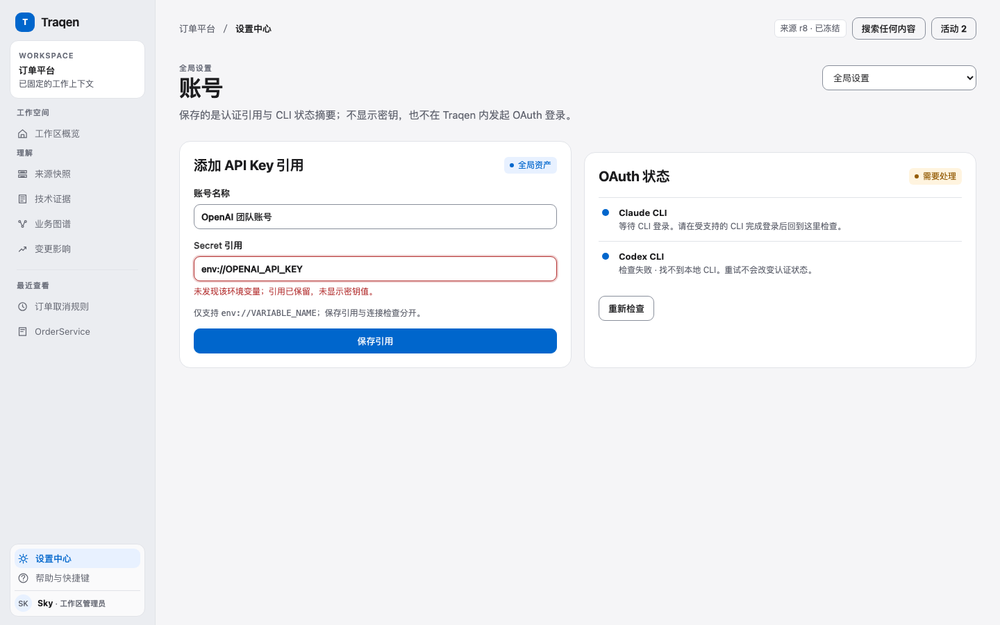

任务是准备可供 CLI 模型使用的认证引用。主动作“添加账号”；列表依次显示名称、状态、认证方式、适用 CLI、最近检查与行操作。点击对象打开同页编辑区，不丢筛选和列表位置。

- API Key 只填写当前支持的 `env://VARIABLE_NAME` 引用，常驻 label 与示例帮助并存；不是明文密钥输入框。引用保存与可用性检查是两个状态。
- OAuth 明示“请先在该 CLI 登录，再回到这里重新检查”。不出现 Traqen 代登录按钮，也不复制 CLI 私有 token。
- 检查失败保留表单，账号行和字段处给非敏感原因与恢复入口。未检查、检查中、可用、需要处理、停用与历史删除分别显示。
- 只读用户看到获准摘要和限制原因，不以禁用颜色代替说明；不会预加载无权查看的凭据或影响明细。

### 4.2 模型与 Skill

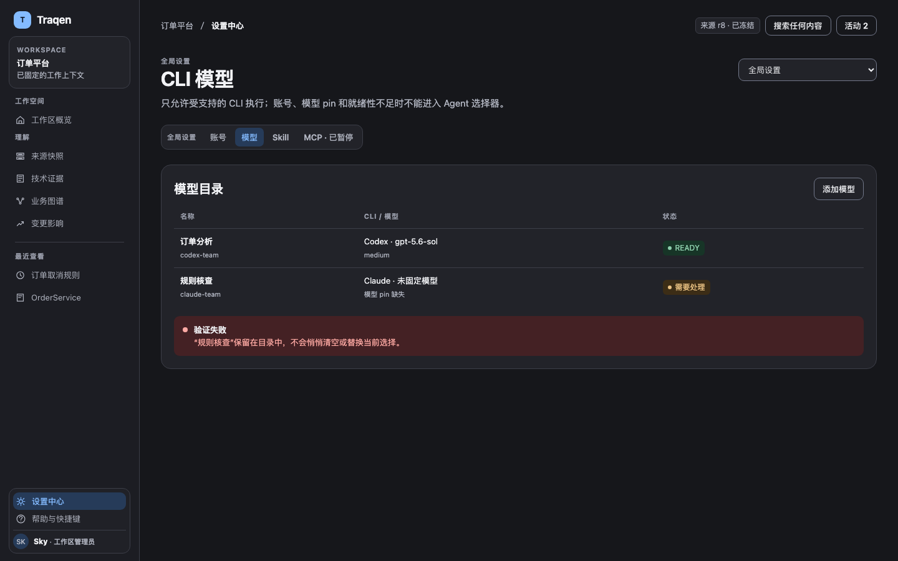

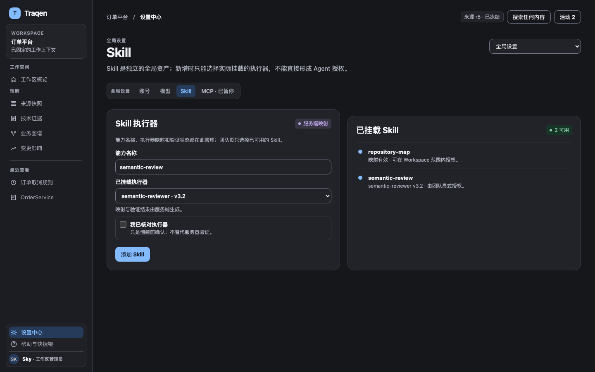

模型与 Skill 在产品导航中是不同页面；对照图或场景可以并列解释，不能因此把产品目录合成一个总开关。

模型页主动作“添加模型”。列表显示昵称、CLI、真实模型标识、适用参数、账号与验证状态；表单依序选择 CLI、兼容账号、模型与受支持参数。保存但未验证不是就绪；失效已选模型可见并给修复入口，不自动替换为第一项。

Skill 页主动作“添加 Skill”。运行映射只能选择服务端实际挂载的执行器，名称和说明与执行映射分开。没有执行器时禁提交并说明原因；历史未挂载项继续可读，不能伪造 VERIFIED。全局定义只在全局页修改。

### 4.3 MCP 暂停

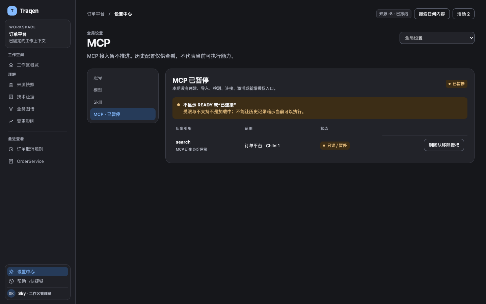

主区明确写“接入暂不推进，历史配置仅供查看”；不出现创建、导入、连接、重新检测、激活或新增授权入口。有旧引用时给“前往团队移除授权”。暂停不是 loading，更不是绿色可用。**这是目标设计；不据此声称后端已经阻断全部旧 MCP 准入。**

## 5. Workspace：范围、授权与生效分开

### 5.1 团队

页头显示具体 Workspace、保存状态和唯一主动作“应用配置”。其下用轻量摘要标识当前生效版本、有无未应用更改和只读查看入口，不用大绿色条占据整行。应用前在动作附近常显作用范围：“仅应用于订单平台，供之后的新分析使用；不改变其他工作区或已有运行。”切换 Workspace 时名称同步更新，不增加重复确认弹窗，也不把全局资产操作伪装成 Workspace Apply。

团队固定一个 Main、至少一个 Child。Main 是统筹角色，不表示天然拥有更多权限。每张卡显示真实模型、档位、已授权 Skill 数量和局部“就绪/需要处理”；“可以应用”只用于整个草稿的校验结果，不用作每个 Agent 的状态名。

选中 Agent 后按顺序编辑模型、查看账号就绪性、勾选 Skill。授权数从实际勾选项派生；全局/本地来源有文字标签。能力即使失效仍保持勾选且可撤销，不能禁用整个复选框而封死修复路径。

添加 Child 不复制模型和授权；移除前解释只移除草稿中的成员，不改历史运行。选中详情与生效只读视图切换后，恢复原选择、焦点与滚动。

### 5.2 能力管理

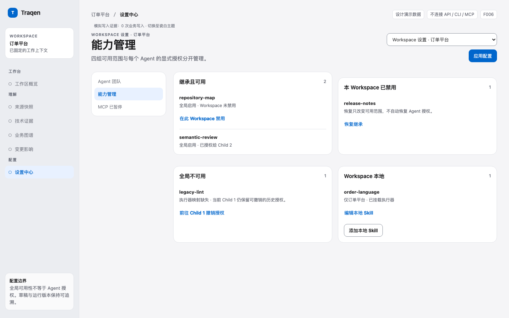

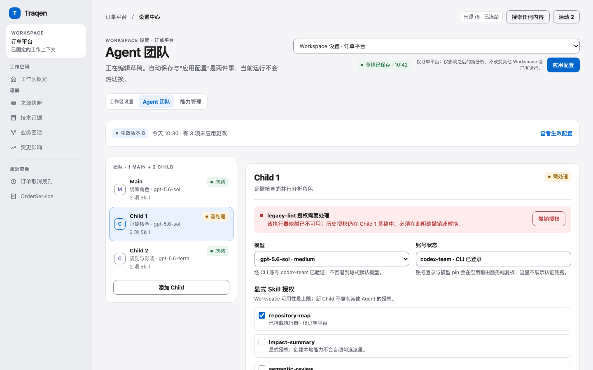

四组固定为“继承且可用”“本 Workspace 已禁用”“全局不可用”“Workspace 本地”。组名与数量可直接解释其范围，不用同色开关模糊来源。

继承项可以在此 Workspace 禁用/恢复；全局失效只能查看原因，不能本地复活；本地项可管理但不能同名覆盖全局 manifest。新建本地 Skill 后明确提示“尚未授予 Agent”，提供回团队入口，而不是自动勾选。

搜索无结果提供清空查询，初始无资产给准备资产入口，读取失败保留已知列表并给重试读取；这三种状态不共用“暂无数据”。

### 5.3 初始空态

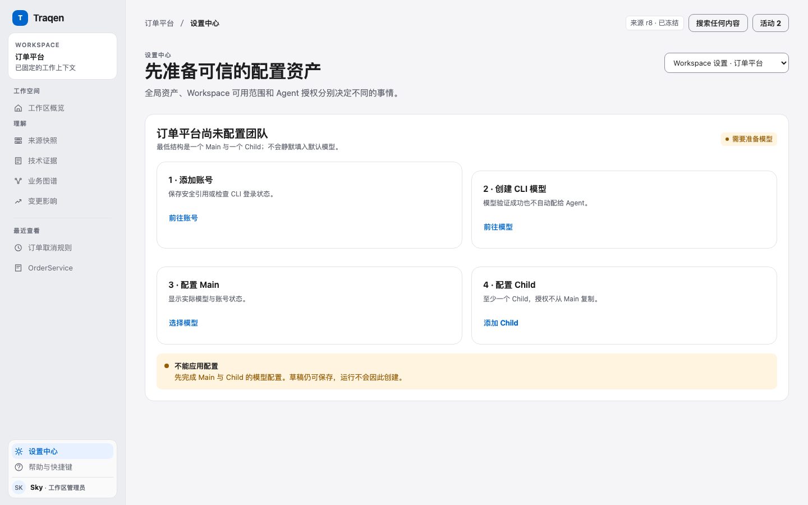

显示 Main 与 Child 1 的未配置占位和下一步“准备模型”；不出现假默认模型或虚假成功。草稿允许不完整，“应用配置”禁用且邻近给“先完成团队配置”的可读原因。范围切换仍可用，但有未确认保存时先处置编辑。

## 6. 保存、冲突、应用：把区别画进界面

### 6.1 四种不同身份

| 身份 | 用户看见什么 | 不应推导什么 |
|---|---|---|
| 本次编辑 | 正在保存 / 保存失败，编辑仍保留 | 未收到回执不能说服务端已保存 |
| 服务端草稿 | 草稿已保存及时间；待处理项数量 | 保存不等于有效或生效 |
| 当前生效配置 | 不可变版本摘要；有未应用更改 | 不改写已有运行 |
| 某次运行配置 | 此运行使用的固定版本 | 不跟随当前 Active 更新 |

正常编辑只有自动保存，不设置竞争性的“保存草稿”按钮。Apply 只在草稿存在、编辑已确认保存、无冲突/保存中且选择有效时可用。点击后的 loading 保留按钮宽度并防重复；失败保留草稿和旧生效版本；结果未知先读取权威状态，不能盲目再创建版本。

### 6.2 冲突就在团队编辑上下文中恢复

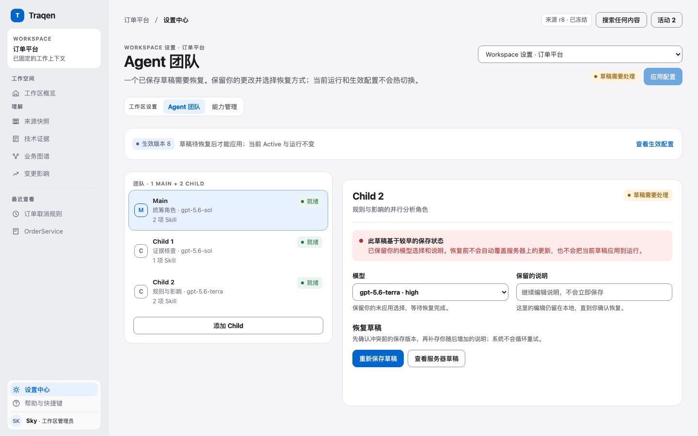

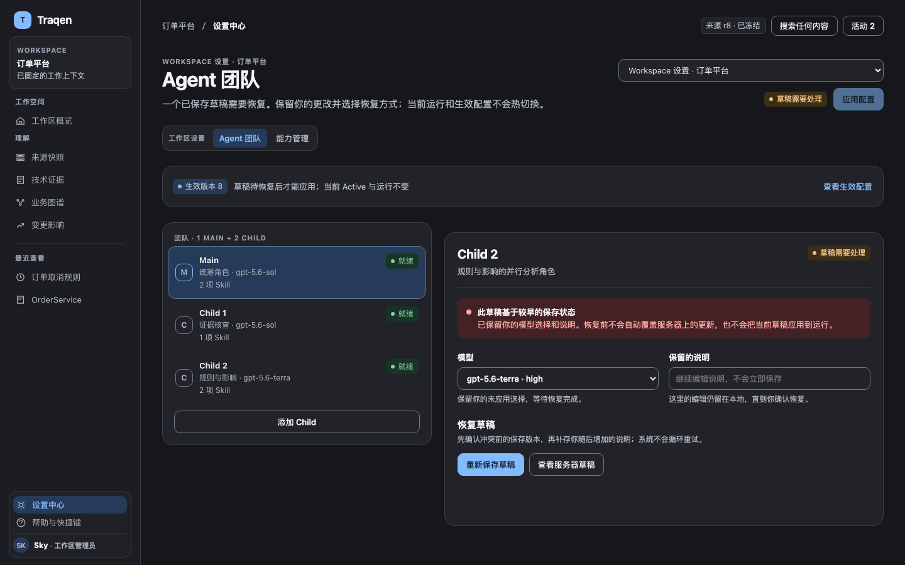

冲突不是另一个产品页面。Agent、模型和本地勾选保持可见；横幅明确“其他位置更新了草稿，你的编辑仍保留”，同时提供“重试我的草稿”和“采用服务器草稿”。Apply 禁用且不发 activation 请求。

“重试”先重存失败时冻结的 M2，只确认真正发出的 M2；冲突期间更晚的 M3 保持待保存，M2 成功后再补存一次。界面不要求用户理解 M2/M3 编号，但事件证据必须能区分两份内容。横幅存在时的新编辑不会启动后台重试风暴。

“采用服务器草稿”先说明会丢弃未保存编辑，用户明确选择后再替换；成功清理失败态，后续编辑可正常保存。恢复再次失败仍保留内容并显示新原因，不偷偷切到另一策略。

### 6.3 生效只读视图

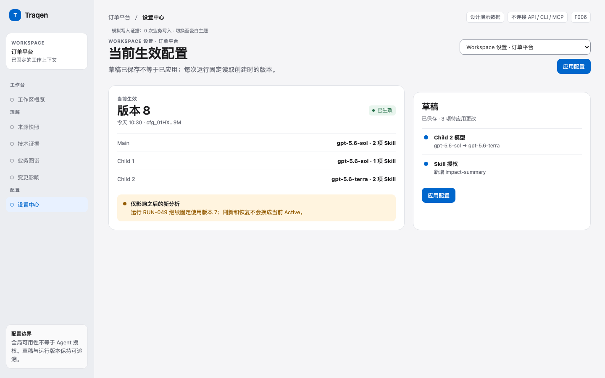

显示版本身份、应用时间、Main/Child 模型与授权摘要及“仅影响之后的新分析”。没有服务端显示序号时使用时间和短标识，不由前端伪造连续版本。只读查看不覆盖草稿，不提供隐式回滚或自动重新应用。

## 7. 停用、删除及影响：先对象，后后果，最后确认

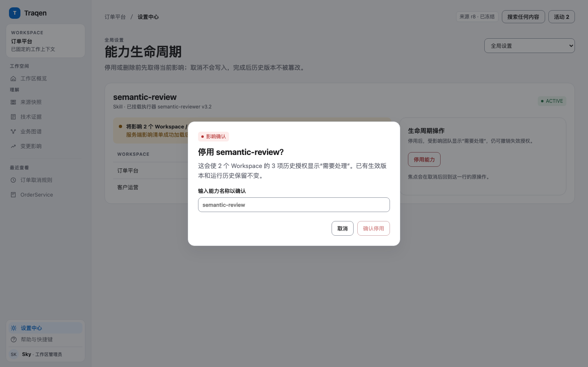

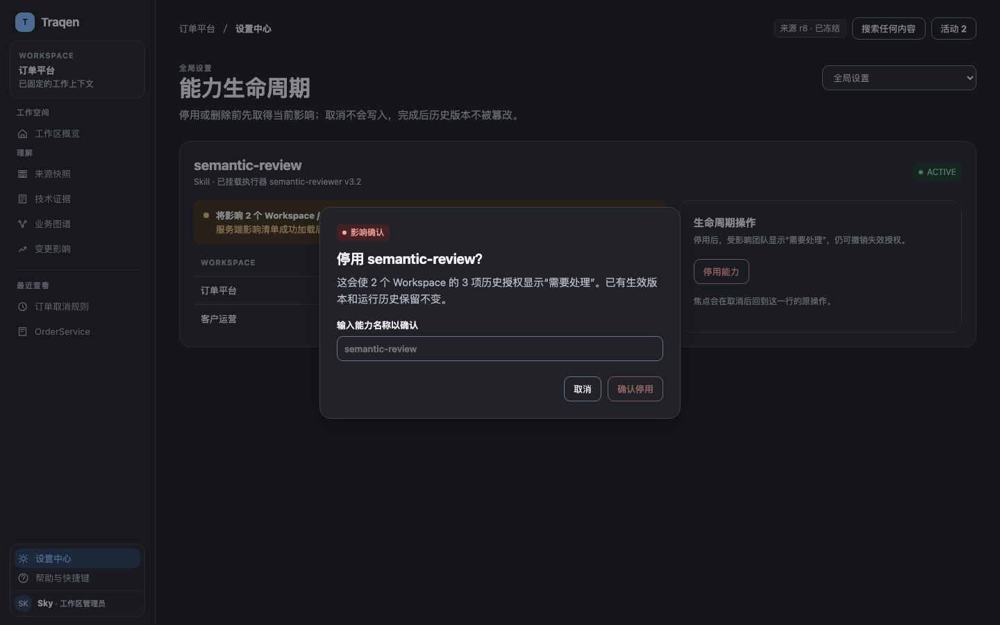

从对象行进入，展示要操作的能力名称、当前状态、可见范围内的 Workspace/Agent 影响、历史保留说明，再输入**能力名称**确认。影响读取失败不能用空列表代替；影响变化需重新确认。取消不产生业务写入，焦点回到触发器。

完成后对象生命周期更新，受影响授权仍可见并可移除，团队给具体“需要处理”原因。旧版本和旧运行不被抹去。危险操作不作为默认焦点，弹窗可 Escape 关闭且具有明确名称。

## 8. 分析准备是 F003 的消费示意，不是新启动入口

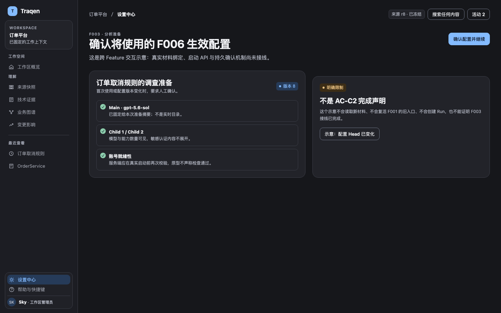

F003 展示用户即将使用的精确生效配置、Main/Child 模型、能力数量、账号就绪性与材料范围。首次/改版确认，同版免重复提示也不能跳过当前权限和材料检查。配置 Head 在提交前变化时，只处理相应配置冲突，刷新摘要并再次确认，不自动换版重发。

本图必须显著标注“交互示意，材料与启动接线未实现”。确认持久化、去重主体、固定材料交接和原子建 Run 合同仍待联合收敛；不添加自创 API 字段、不恢复 F001 raw-source 启动、不用模拟成功关闭 AC-C2。原 Run 恢复仍固定原来源和配置，不热切换。

## 9. 共用组件与视觉约束

色彩以 F005 §05 的语义 token 为单一来源；以下不是另一份独立主题规范。

| 项目 | 统一要求 |
|---|---|
| 瓷白 | 页面 `#F5F5F7`、表面 `#FFFFFF`、导航 `#EBEDF1`；主字 `#1D1D1F`，主动作 `#0066CC` |
| 石墨 | 页面 `#16171B`、表面 `#222329`、导航 `#1C1D23`；主字 `#F2F3F6`，主动作 `#84BBFF`配深色字 |
| 排版 | 页标题32/40、区块20/28、小标题15/22、阅读15/27、工作13/20、关键辅助12/18；中文不负字距 |
| 间距与形状 | 4/8/12/16/20/24/32/40/48/64；状态6、输入/按钮9、面板16；不把全部矩形做胶囊 |
| 控件 | 默认按钮36px、图标18px；控件边界与装饰分隔线用不同 token |
| 密度 | 单行52、双行72、紧凑40；重要名称与状态不微缩，长内容可展开 |
| 选中与状态 | 选中、就绪、生命周期、草稿变更各有独立文字，不同语义不共用一个 success 布尔值 |
| 焦点 | 3px轮廓与3px间隔；对话框有命名、约束和焦点返回；错误不靠颜色单独表达 |
| 动态 | 轻反馈与面板过渡遵守减少动态偏好；不使用循环发光或装饰性漂浮 |
| 主题 | 以稳定 themeId 保存；只改呈现，不丢范围、Agent、滚动、草稿和错误；扩展主题遵守完整 token 契约 |

不把“控制台 fixture”“HTTP 409/M2”作为普通用户主文案。非敏感技术细节可展开；失败主文案先解释影响与恢复动作。图片中的示例说明不应掺进真实产品字段。

沿用 F005 §11 的 WCAG 2.2 AA 设计目标：普通文字对比度至少 4.5:1，大文字至少 3:1；必要控件边界和非文本图形按该节要求验证。逐一检查瓷白/石墨的默认、选中、焦点、错误、只读和禁用状态，记录适用项与豁免，不能只测主题主文字。此处是设计与后续验收目标，不是已取得完整无障碍认证的声明。

## 10. 审阅范围、验证与诚实限制

本稿是**设计审查包**，不是整个 Feature 完成申请。场景选择器仅用于快速到达设计状态；业务导航本身应可到达各功能页。模拟写入证明样稿状态逻辑，不证明产品服务端、OAuth、CLI 或数据库行为。

| 覆盖 | 必须交付的判断点 |
|---|---|
| S01 | 无账号/无模型/无执行器原因可辨；Main+Child1不带假默认 |
| S02–S03 | 账号、模型、Skill 各有独立入口、列表、表单、失败与空态 |
| S04 | 四张同源主图；卡片数量与详情授权一致；只有一个 Apply |
| S05 | 四组能力与来源清晰；本地创建不等于授权，全局失效不能复活 |
| S06 | 两种恢复有不同后果；M2/M3不误确认；冲突期间零额外自动写 |
| S07 | 影响成功/失败/变化、名称确认、取消与焦点返回 |
| S08 | MCP 暂停和历史只读；无伪检测或就绪入口 |
| S09 | 编辑/草稿/Active/Run身份分离；失败不伪造生效版本 |
| S10 | F003宿主正确，显式标识未接线，不恢复旧入口 |
| 横向约束 | 双主题表单/错误/弹窗；两个主视口和附加桌面窗口；键盘、缩放、无溢出 |

完整读屏、多浏览器、中文输入法及全部缩放组合需要单独实测；未取得相应证据时不标为通过。图稿不会证明实际运行、安全准入或生产性能。非作者内容/视觉复核也不能代替你的设计审查。

### 本次审查之后

你可以直接对图中区域、某一功能页或某个状态提出意见。本稿保持待审；确认后再按批准部分更新权威阅读入口与安排正式实现，不自动修改其他 Feature、不恢复 MCP、不关闭 F006。

## 11. 来源与版本

- 本次要求：`thread_mtb64ss1i7itgzdv#0001789716168133-000834-3f0ceffd`，明确“参考F005的整体要求……落到设计文档里面，我审查文档”。
- [F005 V2.1 完整总纲与渲染样稿](../../design-reviews/F005/README.md)：页面骨架、组件、状态、密度、桌面与双主题参照。
- [F006 功能与 UX V1.0](README.md)：三层范围、团队、CLI-only、自动保存/Apply、恢复、MCP暂停和F003边界。
- [2026-08-28 功能收敛](../../../feature-discussions/2026-08-28-F006-workspace-capability-settings-design/README.zh-CN.md)：既定功能逻辑，不被新画面改变。
- 冻结图稿源：`ux-v1.0/assets/prototype.html`（SHA-256 `f6ad476b36e721d6d0db6b89630b4a383f1018e610604d32b9a9bef71ec8f4e7`）、`render.mjs`、[23 张场景图与清单](ux-v1.0/assets/SHA256SUMS)、[浏览器验证记录](ux-v1.0/assets/verification.json)。当前记录来自隔离 HeadlessChrome 153：23 张图、12 条检查、0 个页面错误；清单共 24 条（原型源加 23 张图）。
- 图文对账完成的范围：本稿引用的主图、全局模型/Skill、空态、能力与 Child 1 失效授权、团队内冲突、已打开的双主题名称确认、MCP 暂停、只读版本和 F003 示意都来自上述冻结原型。未覆盖项仍明确为**未实测**：真实产品 API/CLI/OAuth/MCP、服务端持久化与权限、F003 启动接线、完整读屏/多浏览器/中文输入法/所有缩放组合，以及 WCAG 各状态的完整认证。

| 版本 | 说明 |
|---|---|
| V1.0 | 2026-09-17 的已发布功能/UX设计，保留历史身份 |
| V1.1-review | 2026-09-18：把 F005 整体要求逐项落到 F006 页面与状态，配同源渲染图片；待 operator 审查，不是已采纳版本 |
