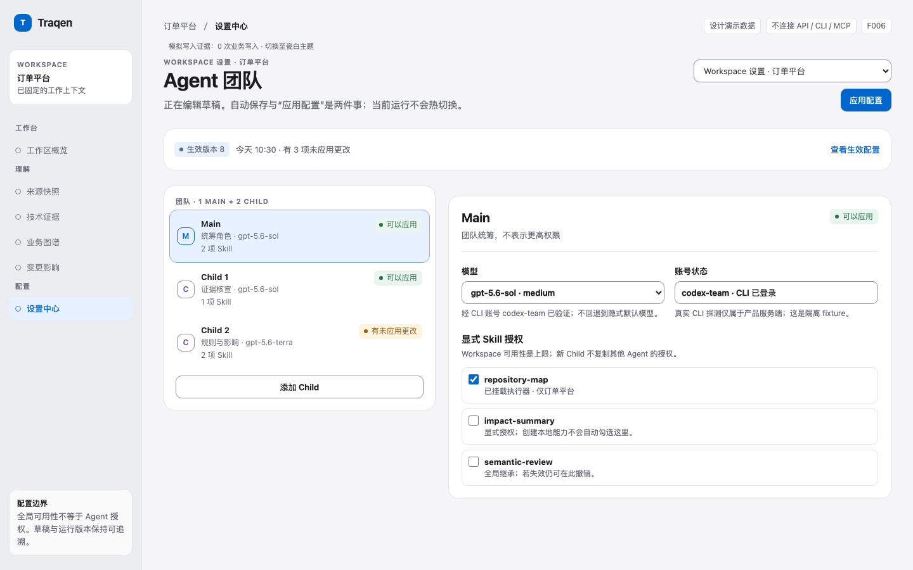
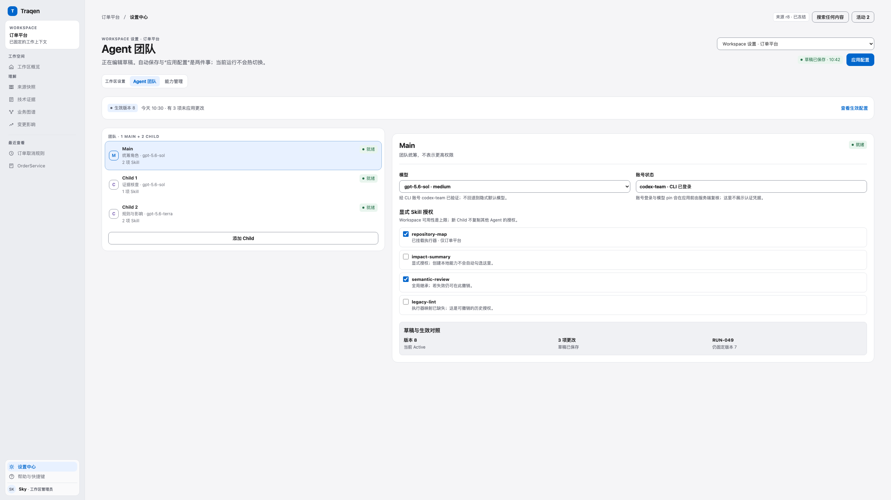
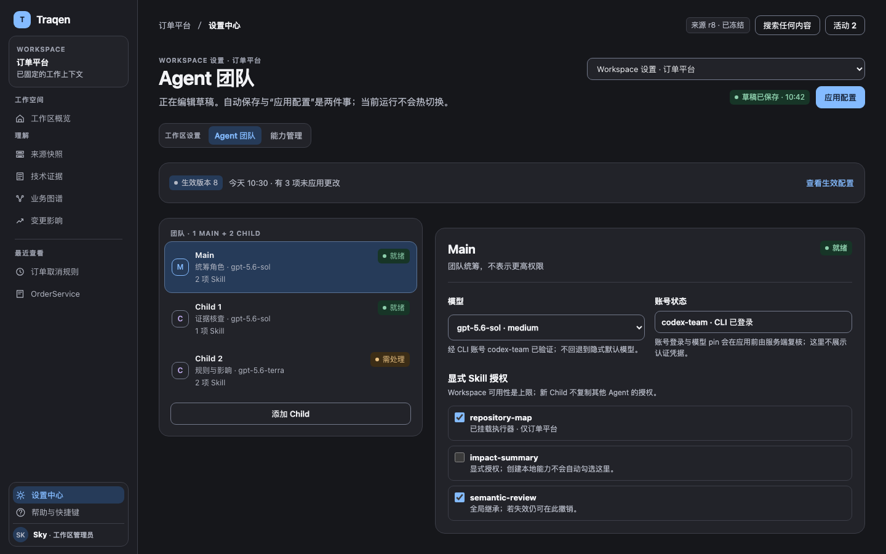
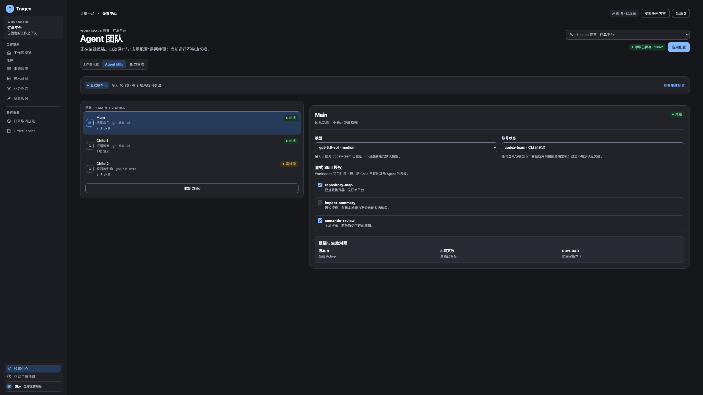
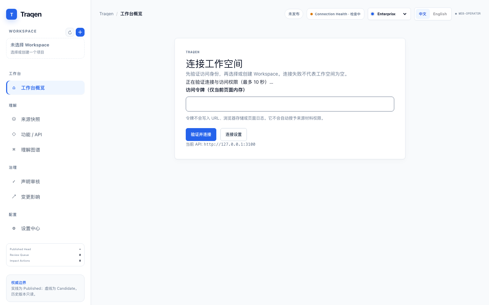

# F006 · 桌面双主题效果图与交互原型 V1.0

[返回 F006 功能与 UX 设计](../README.md) · [F005 V2.1 体验总纲](../../../design-reviews/F005/README.md) · [离线交互样稿](assets/prototype.html) · [作者验证记录](assets/verification.json)

这是 F006 设计文档 §10 的**待 operator 审查**效果图稿：一份可维护的、使用构造数据的离线 HTML 原型和实际浏览器渲染图片。它只验证视觉、交互示意与 fixture 控制流，**不是**生产前端接线、后端、CLI、凭据、MCP 或 F003 启动实现的完成声明，也不表示 operator 已批准或已合入。

## 先看 S04：同一团队，四张桌面主图

四图保持同一团队数据、选中对象和“有未应用更改”状态。27 英寸画面增加并列阅读空间，不缩放字体或把笔记本画面等比放大。

| 14 英寸 · 1440×900 | 27 英寸 · 2560×1440 |
| --- | --- |
| [](assets/previews/04-team-laptop-light.png) | [](assets/previews/06-team-display-light.png) |
| [](assets/previews/05-team-laptop-dark.png) | [](assets/previews/07-team-display-dark.png) |

## Before / after

### 当前 main 的 before



这张图在 `c6acfe7` 的隔离前端宿主实际渲染，而不是沿用 `58113fe` 的历史截图。新宿主没有连接 Workspace 服务，因此停在“连接工作空间”页，无法在不启动产品 API、导入用户数据或伪造 Workspace 的前提下进入旧 F006 组件；它记录的是当前 main 的真实可达起点和该限制，不把它冒称为 F006 已配置页面。

### 调整的可观察点

| 对照维度 | Before 的真实可达状态 | 本交付的 F005 对齐效果 |
| --- | --- | --- |
| 入口与上下文 | 隔离宿主要求连接 Workspace，设置页不可达 | 左侧稳定导航、当前 Workspace、范围选择与草稿/生效摘要同屏可读 |
| 层级与密度 | 不能审阅 F006 的已配置态 | 32/40 页标题、13px 工作正文、24/32 区块间距，模型与状态不缩至微文字 |
| 团队任务 | 无法检查 Main / Child 配置 | 总览与详情并列，Main + 两个示例 Child 的角色、实际模型、账号与 Skill 授权分开表达 |
| 主题 | 不是 F006 双主题证据 | 完整瓷白/石墨 token；深色主要动作采用浅蓝底与深色字 |
| 保存与应用 | 没有可达的 F006 恢复状态 | 自动保存、草稿、生效版本与 Run 摘要不混同；冲突期间 Apply 阻断 |

## S01–S10 场景覆盖

| 场景 | 画面 / 交互证据 | 主题与视口 |
| --- | --- | --- |
| S01 范围与初始空态 | [范围、Main + Child 引导](assets/previews/01-empty-light.png) | 瓷白 · 1440×900 |
| S02 账号 | [瓷白：API 引用错误保留、OAuth 状态](assets/previews/02-accounts-light.png) / [石墨](assets/previews/02-accounts-dark.png) | 双主题 · 1440×900 |
| S03 模型与 Skill | [瓷白：READY / 失败、挂载执行器选择](assets/previews/03-models-light.png) / [石墨](assets/previews/03-models-dark.png) | 双主题 · 1440×900 |
| S04 完整团队 | 上方四张主图；另有 [1280×800](assets/previews/16-team-compact-light.png) 与 [1920×1080](assets/previews/17-team-external-dark.png) 布局检查 | 双主题 · 4 个桌面视口 |
| S05 能力管理 | [四分组、本地能力、失效授权修复](assets/previews/08-capabilities-light.png) | 瓷白 · 1440×900 |
| S06 草稿冲突 | [M2/M3 恢复](assets/previews/09-conflict-light.png) / [石墨对照](assets/previews/10-conflict-dark.png) | 双主题 · 1440×900 |
| S07 生命周期 | [影响与命名确认](assets/previews/11-lifecycle-light.png) / [石墨对照](assets/previews/12-lifecycle-dark.png) | 双主题 · 1440×900 |
| S08 MCP 暂停 | [只读历史项与暂停边界](assets/previews/13-mcp-dark.png) | 石墨 · 1440×900 |
| S09 生效版本 | [草稿、Active、Run 版本分离](assets/previews/14-versions-light.png) | 瓷白 · 1440×900 |
| S10 F003 配置确认 | [明确未接线的确认示意](assets/previews/15-f003-dark.png) | 石墨 · 1440×900 |

错误表单（S02/S03）、409 恢复（S06）、命名确认弹窗（S07）与 MCP 暂停（S08）均有双主题浏览器截图。弹窗属于可操作原型的交互状态；截图只展示其所属工作面，避免把一个模态框当成整项覆盖。

## 可操作范围与验证

`prototype.html` 的场景选择器、主题切换、Agent 选择、Child 2 模型编辑、409 恢复、生命周期确认/取消和 F003 提示均可操作。调试控制显式标注“设计演示数据”，位于产品壳外。

`render.mjs` 用一次性 loopback 静态服务器和临时 headless Chrome profile 生成图片，并写入 [verification.json](assets/verification.json)。本次作者验证结果：19 张截图、0 个浏览器页面错误，以及以下 8 项通过项：

1. S01–S10 渲染时都有一个页面 h1，页面与控件没有横向溢出。
2. S04 在 1440×900、2560×1440 的双主题主图，以及 1280×800、1920×1080 补充布局中保持非缩放的桌面文字与控件尺寸。
3. F005 AppShell 有图标导航、最近查看、帮助与账号脚；调试控制在产品壳外；Workspace 二级导航与“草稿已保存”在壳内可见，每张 Agent 卡的 Skill 数量均与其勾选授权一致。
4. 切主题与刷新都保留选中的 Child，且主题动作的模拟业务写入为零。
5. 修改 Child 2 只产生一次 fixture 草稿写入；Main 和另一 Workspace 的 sentinel 不变。
6. M2 409 → M3 本地编辑 → 重试依次得到 `M2(409)`、`M2(200)`、`M3(200)`；冲突中没有额外 PUT，也没有 activation 请求。
7. 取消生命周期确认会关闭具名弹窗、把焦点返还原操作行，并产生零 fixture 业务写入。
8. 原生 button/input/select/dialog 可获得键盘焦点；Escape 能关闭影响确认弹窗而不形成焦点陷阱。

复现（替换为本机 Chrome 绝对路径）：

```sh
node assets/verify-contract.mjs
node assets/render.mjs /absolute/path/to/Google\ Chrome
(cd assets && shasum -a 256 -c SHA256SUMS)
```

[SHA256SUMS](assets/SHA256SUMS) 绑定 `prototype.html` 与本次 19 张原型截图；before 图单独标识为当前 main 的隔离宿主证据，不与原型效果图混作同一渲染源。

## 明确限制

- 不修改 `web/app/f006-settings-center.tsx`、产品 API、后端、F001/F003、ADR 或 Feature 生命周期。
- 示例 Workspace、模型、账号、Skill、版本、影响列表和运行均为构造数据；不会读取或写入用户数据。
- 模拟事件日志仅证明原型的有界控制流，不能代替服务端的 409、持久化、权限或 activation 验收。
- S10 只表达 F003 应展示和确认 F006 已生效配置；不连接材料、不复活旧启动 API、不创建 Run，不代表 AC-C2 完成。
