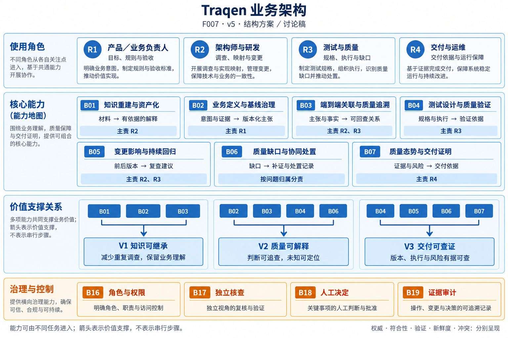
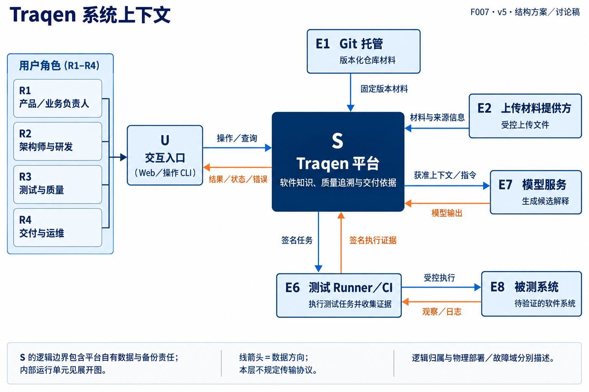
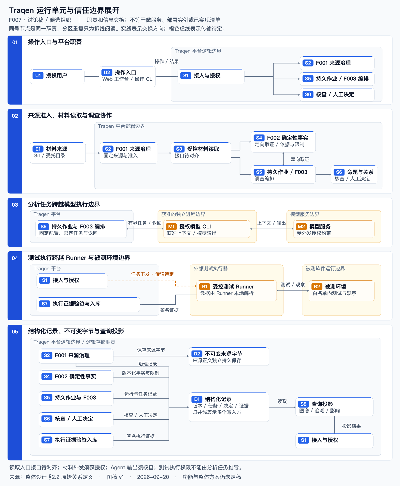
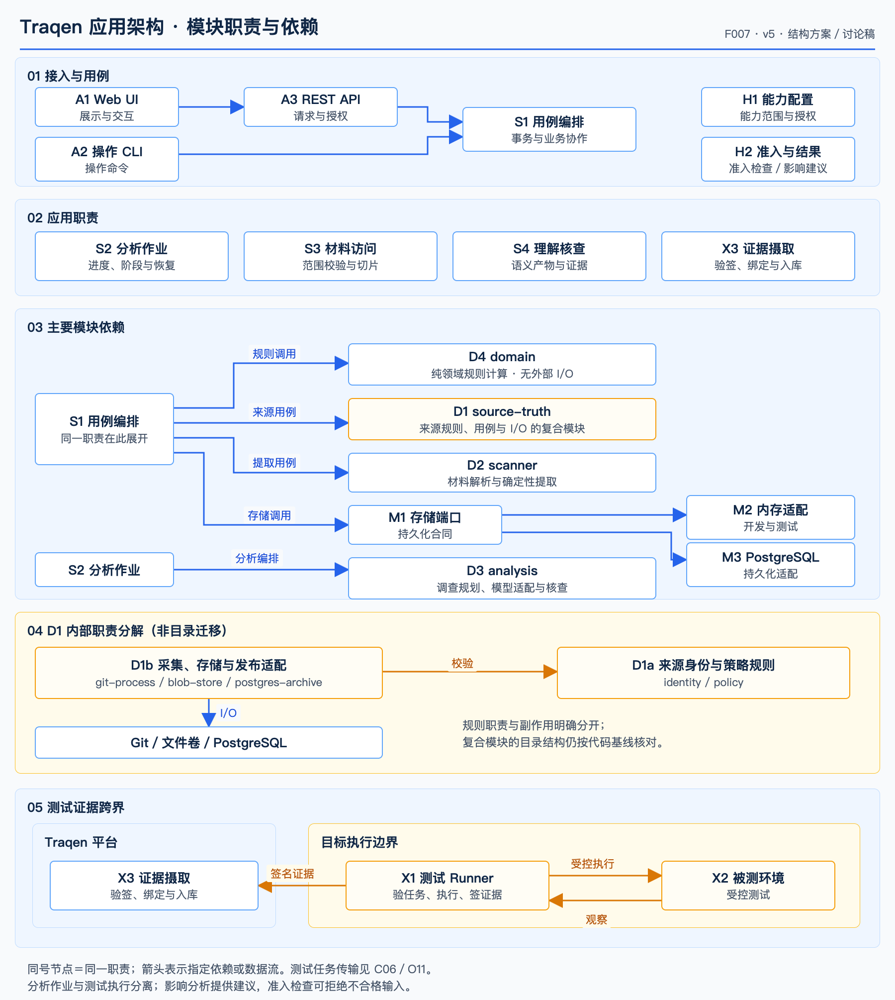
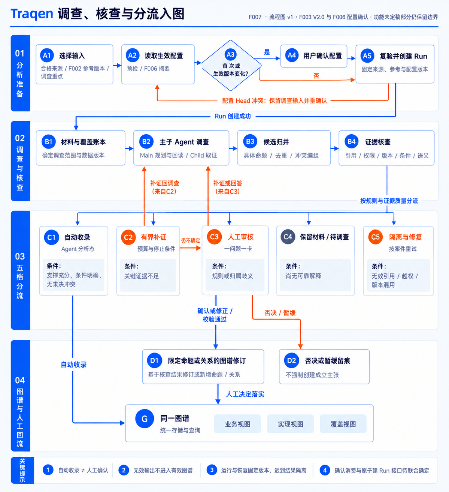
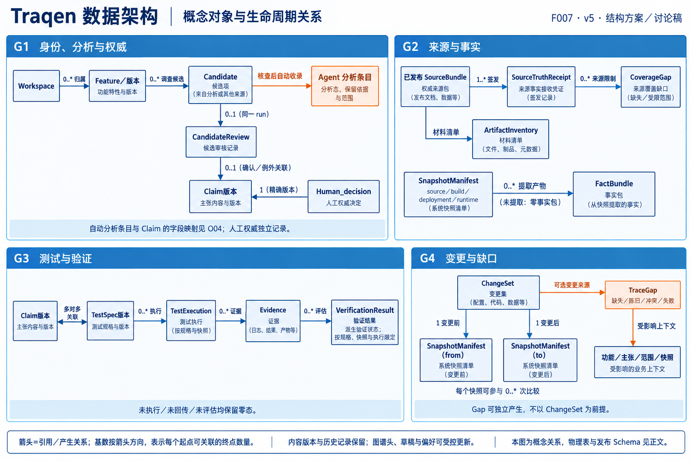
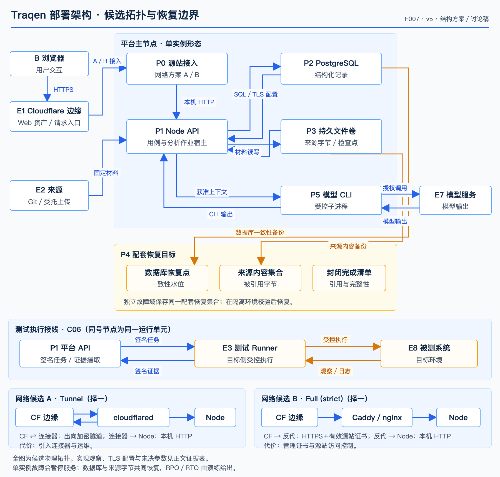

# F007 · Traqen 整体架构设计

> **讨论稿 v0.3，功能与整体方案未定稿。** 五视角结构图更新为 **v5**，两张展开流程图仍为 **v1**；v2／v3／v4 原图和图源保留供对照。图描述职责、关系与边界；实现证据集中在下表。文档进入 main 表示可共同查阅和追踪，**不表示功能、技术选型或整体设计已获批准**。

**产品方向：** 以业务功能为核心资产，连接业务意图、设计、实现、配置、测试与部署证据，让软件知识可以继承、质量可以解释、交付可以查证。架构必须同时服务业务负责人、研发、测试和交付团队，不能缩成架构师的分析工具。

## 阅读与状态

| 要回答的问题 | 阅读位置 | 本文给出的材料 |
|---|---|---|
| 为谁解决什么问题，哪些功能产生什么价值？ | [1. 业务架构](#business) | 角色、能力分解、输入产出、业务闭环与待定范围 |
| Traqen 由哪些系统单元组成，边界内外怎样协作？ | [2. 系统架构](#system) | 上下文图、运行单元、信任边界与跨边界数据流 |
| 功能由哪些软件模块实现，调用与失败恢复怎样发生？ | [3. 应用架构](#application) | 模块职责、依赖方向、三条端到端流程 |
| 系统保存哪些数据，谁产生、谁确认、怎样关联和演进？ | [4. 数据架构](#data) | 实体职责、关系约束、版本、状态及生命周期 |
| 软件和数据落在哪里，怎样运行和恢复？ | [5. 部署架构](#deployment) | 候选拓扑、网络链路、持久化、故障与恢复 |
| 为什么这样划分，什么仍需定稿？ | [6–8. 取舍、待定项与验证](#decisions) | 技术路线、难点、决策清单、分阶段验证 |
| 怎样继续更新，旧图在哪里？ | [9–10. 图稿与依据](#assets) | 图源、历史版本、迭代规则、依据索引 |

本文使用四种文字状态：

- **已确认约束**：有当前 Feature 设计或 ADR 依据；仅在该来源已确认的范围内成立。
- **实现观察**：在明确的代码基线上核对到某项职责或约束；观察范围限于所列断言，不扩展为功能完成、部署或产品验收。
- **候选方案**：供本轮评审的总体组织、职责划分或技术取舍，尚未批准。
- **待定**：功能、语义、接口或运行参数仍需收敛，不能由图上的框或箭头补造合同。

**依据边界：** F007 整体方案尚未定稿，但 F001 已确认设计、F002 V1.0、F003 V2.0、F006 V1.0 仍各有明确功能约束。本文不撤销这些局部基线，也不借它们宣布整体方案通过。具体读取接口、Schema、角色授权和量化验收须按各源文档保留待定。来源见[第 10 节](#sources)。

### 实现证据与方案状态

**观察基线：main `064f94014eb8c0a987508ed52d1ab0c24f5ba42c`，核对时间 2026-09-21 UTC。** 以下相对链接便于阅读；复查历史断言时使用 `git show 064f940:<文件路径>`。图上不放实现徽标、代码 SHA 或验收判断，结构方案与本表分别维护。

| ID／对象 | 在观察基线可复核的事实 | 依据 | 方案／运行状态 |
|---|---|---|---|
| E01 接入与前端 | API 使用 Node HTTP 入口；Web 声明 Next／React 依赖 | [production-server.js](../../../src/api/production-server.js)、[web/package.json](../../../web/package.json) | 构建配置不证明 Cloudflare 生产接线；HTTP 入口、前端框架是不同范围 |
| E02 来源与领域模块 | source-truth 同时有身份／策略规则与 Git、文件、数据库 I/O；domain 的 32 个 JS 文件未直接导入 fs／child_process／pg | [identity](../../../src/source-truth/identity.js)、[policy](../../../src/source-truth/policy.js)、[git-process](../../../src/source-truth/git-process.js)、[blob-store](../../../src/source-truth/blob-store.js)、[postgres-archive](../../../src/source-truth/postgres-archive.js)、[domain](../../../src/domain/) | D1a／D1b 是职责分解，不宣称目录已重构；直接导入检查也不证明整个调用闭包无副作用 |
| E03 分析编排 | S2 组织 Workspace 分析作业；能力路由选择模型与 Skill | [job-runner](../../../src/application/workspace-analysis-job-runner.js)、[worker](../../../src/application/workspace-analysis-worker.js)、[capability-router](../../../src/analysis/analysis-capability-router.js) | F003 五档业务分流与发布合同仍按 O04／O12 收敛；S2 不充当测试 Runner 调度器 |
| E04 执行与摄取 | 任务 HMAC、快照绑定在 Runner 中；S1 的 ingestExecutionEvidence 验签、检查精确 TestSpec 与快照后入库 | [task](../../../src/runner/task.js)、[controlled-runner](../../../src/runner/controlled-runner.js)、[traceability-application](../../../src/application/traceability-application.js) | 外部任务传输、注册和部署接线留 O11；应用图只连接有明确职责的证据摄取 |
| E05 数据库 TLS | POSTGRES_SSL 默认 require（校验证书），同时接受 no-verify 与 disable | [production-server.js](../../../src/api/production-server.js) 的 postgresSsl | 代码提供配置选项；生产采用值、证书与网络策略需运行验收，不以“SSL 必需”概括代码 |
| E06 审核与版本 | 同 project／run／candidate 审核记录唯一；确认／例外绑定 Claim，其他处置可无 Claim；human_decision 绑定精确 Claim 版本 | [0006 迁移](../../../db/migrations/0006_candidate_review_baseline.sql)、[0001 迁移](../../../db/migrations/0001_core_traceability.sql) | 图中 run 级基数对应此约束；F003 分析条目与目标发布模型留 O04 |
| E07 变更引用 | ChangeSet 有 from／to 两个快照外键且要求不同 | [0007 迁移](../../../db/migrations/0007_change_impact.sql) | 跨版本身份与变化传播仍须按 O10 验证 |
| E08 来源装配与恢复 | SOURCE_TRUTH_CONFIG 缺省不装配来源运行时；提供配置时检查失败阻止启动；存在备份实现入口 | [production-server.js](../../../src/api/production-server.js)、[backup-service](../../../src/source-truth/backup-service.js) | 配套恢复要求依据 F001 §8.4；本次没有生产资产、备份计划或 RPO／RTO 演练证据 |

历史 v4 图中的 `64100c2` 和文档 v0.2 的 `010de0e` 都来自侧分支，非本次 main 基线祖先；这些旧断言仅留在历史材料中。旧[产品架构文档](../../architecture/traqen-product-architecture.zh-CN.md)也只作历史参照，本轮不修改其他 Feature 真相源。

## 1. 业务架构：把分散的软件知识转为可共同使用的质量资产

### 1.1 业务目标与角色

产品愿景中的可验证结果是：**对每个纳入治理的高价值 Feature，能解释从已确认业务意图到实际部署 Evidence 的追溯链，同时暴露缺失、陈旧、冲突和失败。** 业务架构因此覆盖知识形成、基线治理、验证、变更及交付全过程；使用者可以从已有资产进入，不要求每次重新逆向整个系统。

| 图中角色 | 业务责任 | 典型任务 | 从 Traqen 获得的结果 |
|---|---|---|---|
| R1 产品／业务负责人 | 对业务目的、规则、适用范围和验收意图负责 | 说明“应该怎样”，处理业务歧义，确认有限范围的命题 | 有版本、可追查的业务定义；与实际实现不符之处可见 |
| R2 架构师与研发 | 对工程解释、实现映射及变更调查负责 | 接入材料，定位规则实现，评估修改会触及什么 | 可回查知识图谱、工程证据与带依据的影响范围 |
| R3 测试与质量 | 对验证范围、断言和执行证据负责 | 从规则设计测试，关联实际执行，解释未验证和失败 | 测试资产与真实执行分离，证据覆盖和缺口可定位 |
| R4 交付与运维 | 对部署上下文、运行保障和交付证据组织负责 | 按版本查看证据，组织验收材料，恢复平台数据 | 特定部署的可查证记录、剩余风险和恢复依据 |

角色是职责分类，不等于已确定的 RBAC 角色表。同一人能否兼任、哪些操作要求独立审核、组织身份如何接入，见 O02／O07；不能凭角色名称授予权限。

### 1.2 能力总览与第二层展开

图分为**参与角色、能力地图、价值支撑、贯穿治理**四部分。七项能力可按任务组合使用；下方三组连线明确表示哪些能力共同支撑 V1／V2／V3。图中重复的能力编号指向同一能力，下表展开其工作与交接。

| 能力／主责 | 第二层功能 | 关键输入 → 业务产出 | 业务价值与范围状态 |
|---|---|---|---|
| **B01 知识重建与资产化**／R2，R1 参与 | 材料登记与版本固定；技术对象与事实提取；跨材料业务调查；证据检索与未理解范围展示 | 冻结的代码、文档、配置、测试等材料 → 带来源、范围、状态的功能／规则解释、工程关系及覆盖账本 | **V1 知识可继承**：减少交接时重新找资料。F001–F003 有功能依据；材料支持范围和正确性门槛待定 |
| **B02 业务定义与基线治理**／R1 | 新增或修订业务命题；限定范围；处理歧义与冲突；记录确认、否决及历史 | 新需求或重建候选＋证据 → 明确权威来源的业务主张、版本与决定 | **V1＋V2**：知道“谁在什么范围确认了什么”。新增需求入口、拆分合并、基线发布单位待定；不能只用旧审核表替代目标设计 |
| **B03 端到端关联与质量追溯**／R2、R3 | 功能与规则组织；关联设计／代码／API／配置／测试／部署；双向查询；断链定位 | 业务主张、事实、材料引用、执行记录 → 同一模型的业务、实现、覆盖和追溯视图 | **V1＋V2**：知识可交接，每条结论能回到依据。F003 已规定三种视图；无依据的关联不能补成成立关系 |
| **B04 测试设计与质量验证**／R3 | 测试规格及断言设计；执行资格确认；关联／发起受控执行；证据核验；验证结果展示 | 有范围的规则＋TestSpec＋准确被测版本／环境 → TestExecution、Evidence 与验证状态 | **V2＋V3**：知道哪个部署被怎样验证。F004 与领域实现提供基础；首批执行方式、报告接入和审批体验未定 |
| **B05 变更影响与持续回归**／R2、R3 | 比较前后版本；解释差异；遍历影响依据；识别陈旧结论；给出重验证建议 | 两个版本及各自证据 → CONFIRMED／POSSIBLE／UNKNOWN 的影响与重验证项 | **V3**：确定交付前要复查什么。F004 首版只给建议，不自动阻止工作、合并或部署 |
| **B06 质量缺口与协同处置**／按缺口归属分责 | 登记缺失／陈旧／冲突／失败；解释原因；组织补证、修正、复验或风险接受；保留处置记录 | 来源／提取／分析／验证发现的问题 → 有原因、责任和后续动作的缺口集合 | **V2＋V3**：未知和风险能被处理。缺口识别已有依据；分派、通知、工单集成、风险接受权限与关闭规则未完整定稿 |
| **B07 质量态势与交付证明**／R4，R1、R3 参与 | 按功能／版本／部署汇总；展开证据链；显示剩余风险；组织交付材料 | 图谱、执行证据、缺口及决定 → 有统计口径的质量视图与交付依据 | **V3 交付可查证**：验收能追到记录。报表模板、导出包、签署与交付流程为候选范围，不能由指标代码推出已交付 |

七组能力是完整产品的讨论框架，**不等于全部进入首期**。B01 并非只扫描代码，B02 也不应被限制为逆向候选的人工审批。B06、B07 需要独立收敛用户旅程，当前不能画成已有闭环工单和商业交付系统。

### 1.3 贯穿能力的治理与价值路径

| 图中节点 | 代表什么 | 必须保留的边界 |
|---|---|---|
| B16 角色与权限 | 人、Workspace、来源、能力及对象操作的授权 | 前端可见不等于服务端可执行；读材料、确认主张、执行测试、接受风险是不同权限 |
| B17 独立核查 | 使假设、证据检查和有权决定各有依据 | Agent 自述或多模型一致不能作为证明；不意味着自动收录都须人工批准 |
| B18 人工决定与审批 | 将有权人的决定绑定到具体命题、版本及范围 | 决定须绑定角色、命题与范围；具体审批模式按 O07 收敛 |
| B19 证据审计 | 保存关键操作、版本变化和决定的依据 | 通过一次审核不能抹掉相反证据或自动扩大到新版本 |
| V1／V2／V3 | 知识可继承／质量可解释／交付可查证 | 是要验证的业务结果，不是未经试点证明的收益承诺 |

三条价值路径分别为：**B01＋B02＋B03 → 知识交接**；**B02＋B03＋B04＋B06 → 可解释质量判断**；**B04＋B05＋B06＋B07 → 有证据的交付**。候选衡量方式为真实任务的定位耗时与重复调查、结论可回查率、准确部署上的有效链与剩余缺口；分母、采样方法和目标值待确认，不把材料处理率等同于业务理解率。

### 1.4 一条贯穿产品的业务场景

以“修改订单取消规则”为说明例，**不是已完成的验收案例**：团队固定相关来源版本，调查当前规则和实现；支撑充分的解释自动进入 Agent 分析态，歧义问题交业务负责人限定范围；测试人员确认测试规格，关联目标部署的真实执行；研发比较前后版本，查看受影响规则、测试与未知范围；交付人员汇总证据及未闭合风险。即使测试通过，业务权威未确认或证据已过期仍单独显示。平台提供依据，发布决定仍由既有业务流程承担。

## 2. 系统架构：统一治理边界内组织知识，受控跨界读取和执行

### 2.1 系统上下文

本图回答“谁与平台交换什么”，S 保持黑盒，箭头表示数据方向。平台自有数据库、来源字节与恢复责任均属于 S 的逻辑边界；内部职责在 §2.2 展开，实例位置与故障域在 §5 展开。上下文层使用语义合同，不在未选定的链路上补造协议。

| 节点 | 边界归属与职责 | 输入／输出与限制 |
|---|---|---|
| R1–R4、U 交互入口 | 人通过 Web／操作 CLI 提交任务；操作 CLI 与分析模型 CLI 用途不同 | 操作／查询流入平台，结果／状态／错误流回；各入口遵守授权 |
| S Traqen 平台 | 组织来源、调查、治理、证据和投影；对用户可见结果负责 | 校验输入、持久化记录、提供查询；不代替被测软件，不拥有无限制执行权 |
| E1 Git 托管 | 来源提供者 | 平台请求只读获取，来源返回固定 commit 材料；获取失败和未获取正文明确记账 |
| E2 上传材料提供方 | 受托材料入口 | 经 F001 采集核验进入来源包；不能越过冻结和准入读取任意目录 |
| E6 外部 Runner／CI | 被测环境侧执行边界 | 接收受控任务，返回签名执行证据；已有签名约束不等于传输已接线，任意 CI 也不自动可信 |
| E7 模型服务 | 接收获准上下文并产生模型输出 | 外发遵守任务、材料与模型授权；输出仍须核查 |
| E8 被测系统 | 产生执行观察的目标软件与环境 | Runner 受控访问，返回日志与观察；与平台自身的运行环境分开 |

E7 与 E6 是两种不同的外部协作：前者生成解释，后者取得执行观察。授权模型 CLI 的进程位置与材料读取边界见下一层；模型输出不直接成为测试证据。

### 2.2 运行单元与信任边界展开（候选组织）

[打开完整尺寸图片](images/traqen-runtime-boundaries-v1.png) · [可编辑图源](src/runtime-boundaries-v1.html) · [原始关系定义](src/flow-definitions-v0.1.md)

为避免线条交叉，图分为操作入口、来源与调查、模型执行、测试执行、持久化与查询五区；**同号节点是同一职责，重复展示不表示新增运行实例**。编号仅在本展开图内使用，不与 v5 概览或应用图的同名编号自动对应。

展开图表达**职责和信息交换**，不是现有服务清单。平台内各框可同进程，不因此成为微服务。`受控材料读取入口`是待落实的合同位置：沿用现行准入要求，不通过此图选择 F003 直接读 F001，或确认现有 source-slice-broker 已满足新材料合同。

| 信任边界 | 跨越时必须回答的问题 | 已知依据／待定 |
|---|---|---|
| 用户 → 平台 | 是谁、在哪个 Workspace、能操作哪个对象及版本？ | 当前有 API 身份与策略检查；企业登录、角色映射及委托模型待定 |
| 原始材料 → 可用来源 | 内容是否完整、安全获准保存、精确冻结？ | F001 清单、摘要、Gap、Receipt 和当前准入条件；阻断项不能接受豁免 |
| 材料 → Agent／CLI／模型 | 任务允许读取和外发什么，谁持有凭据？ | F006 固定配置与显式授权；原文读取、脱敏及模型外发策略须对齐 |
| Agent 输出 → 图谱 | 引用是否有效，证据是否支持命题或关系？ | F003 五档分流；生成文本不能直接取得人工权威 |
| 平台 → Runner → 被测环境 | 谁准许执行、在哪个目标、允许哪些操作？ | 已有验签、快照绑定、目标策略与本地凭据解析；外部调度／传输待定 |
| Runner → 平台 | 谁产生记录，是否绑定精确测试、版本和环境？ | 平台验签与一致性核查；签名证明受信密钥来源和内容完整性，不证明测试充分 |

### 2.3 系统间合同目录

这里规定需交接的信息，不冻结 HTTP 路径或字段 Schema。合同可由模块内调用实现，也可在后续独立运行时保持相同语义。

| 合同 | 生产者 → 消费者 | 交接内容 | 不成立时怎样处理 |
|---|---|---|---|
| C01 来源准入 | F001 → F002／受控读取服务 | Workspace、Bundle、Receipt、完整清单、定位、策略与接受记录、当前资格 | 缺字节、版本或权限不符则拒绝；过往成功不替代当前检查 |
| C02 事实数据产品 | F002 → F003／查询／F004 | 材料与对象目录、事实与关系、证据与前提、缺口与覆盖、清单与词义；完整版本引用 | 未支持、未提取明确返回限制；无 Fact 不等于无材料 |
| C03 定向取证 | F003 ↔ F002 | 问题、范围、固定版本、预算；已有依据／新版本／不确定／拒绝四类返回 | 不原地改旧事实，不把 Agent 怀疑升级为事实 |
| C04 运行能力 | F006 → F003 运行编排 | 生效不可变配置、Main／Child、模型与 Skill 授权、服务端就绪条件；首次／版本变化的用户确认 | 未授权或失效阻断新运行；配置 Head 冲突时保留调查输入并重确认；已有运行不热换 |
| C05 分析与决定入图 | F003 核查／人工决定 → 图谱版本 | 命题或关系、证据、范围、状态、决定来源、并发修订条件 | Agent 分析态和人工确认分离；发布字段与并发协议待定 |
| C06 测试执行 | 平台 ↔ 外部 Runner | TestSpec 版本、权限、快照与目标、签名任务及执行证据 | 验签或绑定失败拒绝；传输与重放防护的持久化部署待定 |
| C07 影响查询 | 知识与执行记录 → F004 | from／to、关系依据、权威与验证状态、覆盖及新鲜度 | 确定／可能／未知及理由；无覆盖证明的空列表不判无影响 |

F003 自动收录结果如何被 F004 的不同分类消费，须保留权威状态并联合细化；不能将其直接视为 F004 Spec 中的“已审阅主张”。

## 3. 应用架构：按软件职责组织模块，并说明真实协作

### 3.1 分层、组件与依赖

**候选组织采用模块化应用。** 接入处理协议和身份；应用编排用例、事务及长任务；D4 负责领域计算；存储端口连接适配器。D1 来源治理是含规则、用例与 I/O 的复合模块，图中单独分解为 D1a 身份／策略和 D1b 采集／存储／发布适配。它与纯领域计算区明确分开，这个职责视图没有假设目录迁移已经发生。分析、提取模块也各自保留编排与适配职责。

| 图中节点 | 软件职责与输入产出 | 依赖／实现观察与限制 |
|---|---|---|
| A1 Web UI | 当前 Workspace、版本选择、图谱、审核与证据查看 | `web/`；Next／React 与图形组件属于展示实现，版本与构建依据见 E01 |
| A2 操作 CLI | 开发启动、自扫描、追溯评估等命令入口 | `src/cli/`；不是 F006 模型 CLI，也不授予生产阻断权 |
| A3 REST API | 解析请求、身份认证、作用域检查、错误响应，调用应用用例 | [http-server.js](../../../src/api/http-server.js)；当前为 Node HTTP 服务 |
| S1 用例编排 | 业务基线、审核、证据入库、追溯与影响查询，组织事务 | [traceability-application.js](../../../src/application/traceability-application.js)；文件中已有多个领域的用例，不代表目标模块边界已重构完毕 |
| S2 分析作业／Worker | 分析任务生命周期、阶段推进、持有者与恢复 | [job-runner](../../../src/application/workspace-analysis-job-runner.js)、[worker](../../../src/application/workspace-analysis-worker.js)；是知识分析作业，**不能据此认定为外部测试 Runner 的调度服务** |
| S3 受控材料访问 | 校验作用域后交付有界材料及定位 | [source-slice-broker](../../../src/application/source-slice-broker.js) 有代码；是否满足 F001–F003 新材料合同仍待联合对齐 |
| S4 理解等价检查 | 对固定语义产物及证据进行比较核验 | [understanding-equivalence](../../../src/application/understanding-equivalence.js)；不证明业务理解完整，也不代替 F003 逐命题核查 |
| D1 来源治理 | 连接来源、采集、暂存、内容保存、发布、准入与备份 | [source-truth](../../../src/source-truth/)；对外提供可准入的不可变来源，不负责解释业务意义 |
| D1a 身份与策略规则 | 来源身份编码、摘要、范围与策略检查 | identity／policy 等规则职责；通过数据输入计算，与外部副作用分离 |
| D1b 来源 I/O 与用例适配 | 调用 Git、保存字节、数据库事务与备份工具，组织发布过程 | git-process／blob-store／postgres-archive 等；调用规则并处理失败与恢复，不能按纯函数替换 |
| D2 确定性提取 | 材料结构定位、规则提取、证据与限制记录 | [scanner](../../../src/scanner/) 为既有基础；F002 的五部分数据产品不能缩成现有扫描器输出 |
| D3 调查与核查 | 规划、模型／Skill 适配、归并、冲突检查；目标采用五档分流 | [analysis](../../../src/analysis/)；现有 [capability-router](../../../src/analysis/analysis-capability-router.js) 选择合格模型与 Skill，**不是已经实现的业务入图五档路由器** |
| D4 领域规则 | 主张与治理、TestSpec、执行证据、追溯、失效和影响计算 | [domain](../../../src/domain/)；规则计算与外部 I/O、长任务控制分开 |
| M1 存储端口 | 应用访问持久化的合同 | [storage](../../../src/storage/)；事务与版本约束不能被适配器替换绕过 |
| M2 内存适配器 | 便于隔离开发和测试 | 不能作为用户数据的生产保存承诺 |
| M3 PostgreSQL 适配器 | 当前结构化记录的持久化与查询实现 | [postgres-traceability-store](../../../src/storage/postgres/postgres-traceability-store.js) 与迁移；不替 F002 冻结目标存储设计 |
| X1 受控测试 Runner | 接收合法任务，在目标约束内执行并签名证据 | [runner](../../../src/runner/) 有代码；目标位于平台外执行边界，传输及部署接线未定 |
| X2 被测环境 | 被验证的软件、数据、依赖及运行上下文 | 与 Traqen 平台环境区分；凭据由 Runner 本地解析，不由 Agent 自由提供 |
| X3 证据回收入口 | 平台侧验签、核对 TestSpec／快照并持久化 | S1 的 `ingestExecutionEvidence`；属于平台内，不能放在被测环境侧 |
| H1 F006 能力设置 | 全局资产、Workspace 可用范围、Agent 显式授权、生效配置 | 不是单一开关；模型执行 CLI-only，MCP 暂停，不把存在的元数据入口视为可执行能力 |
| H2 准入与结果策略 | 权限／完整性／来源检查；对影响结论提供建议 | 前者可拒绝不合格输入；后者遵循 F004 首版不阻断工作，不能合成一个对外强制质量门 |

图中只画主要职责依赖，同号 S1 表示同一用例编排责任。测试证据从 X1 流向平台内 X3；测试任务下发的具体应用接线留在 C06／O11，不将分析作业 S2 指定为测试调度器。模型 CLI 和目标 Runner 均有独立执行边界。

### 3.2 流程一：固定来源，形成可以消费的版本

| 步骤 | 负责模块与行为 | 可见结果／失败恢复 |
|---|---|---|
| 1. 登记与预检 | F001 校验来源连接、选定范围、权限、策略、存储容量 | 显示可开始、预期 Gap 或阻断原因；不是此时就生成成功版本 |
| 2. 采集与对账 | 固定 Git commit／目录材料；完整枚举、校验字节、记录 Inventory 与处置 | 检查点可恢复；失败的新任务不覆盖旧来源版本，不能悄悄跳过已选文件 |
| 3. 私有准备 | 写入所需不可变内容和准备记录，保护任务引用 | 文件已写而数据库未提交时仍不可对下游冒充已发布；允许核验后复用 |
| 4. 确认并发布来源 | 有维护权限的用户确认当前清单、完成必要的有效 Gap 接受并显式请求冻结；系统再核权限、策略、接受期限和准备修订，在数据库事务中发布 Bundle／Receipt 与操作结果 | 无 Gap 也须确认清单；未确认或接受过期不得发布。固定幂等操作，响应丢失查询原结果，不再次生成版本 |
| 5. 消费前准入 | F002／受控读取入口校验当前 Receipt 资格、字节及作用域 | 曾经冻结不等于现在可用；过期接受、损坏内容等阻断。F002 是另行启动的下游，不是来源采集的自动下一步 |

依据为 F001 Design B §8.3–8.4。这里的原子性是**对下游可见性的原子发布**，不是假设 PostgreSQL 与文件系统共享一个分布式事务。

### 3.3 流程二：调查、核查、分流入图与人工回流

[打开完整尺寸图片](images/traqen-analysis-flow-v1.png) · [生成提示词与核对记录](src/flow-visuals-v1.md) · [原始流程定义](src/flow-definitions-v0.1.md)

图按分析准备、调查与核查、五档分流、图谱与人工回流展开。C1 自动收录直接以 Agent 分析态入图；C3 人工审核另有确认、补证、否决／暂缓出口，不是自动收录的前置审批。

此流程转述 F003 V2.0，不新增“所有候选必须人工批准”的门槛。F002 参考与原材料都绑定准确版本；未被提取的材料仍可以在授权范围内调查。Main 至少协同一个 Child，模型一致不能替代证据。补证可以向 F002 发出定向请求；F002 修复产生新版本，是否选用必须明确，不能静默替换本次输入。

F003 分析准备展示服务端已生效配置摘要，首次或生效版本变化需要用户确认；同版本免重复提示也不能跳过当前权限、材料准入和能力检查。确认后 Active 改变则保留调查输入、刷新摘要并重新确认，不自动换版重发；其他冲突不能一律解释为配置变化。确认的主体去重、持久化消费及原子建 Run 合同仍待联合确定。未知创建结果先查询或按既定幂等合同恢复，不盲目另建 Run。依据为 F006 V1.0 §6。

运行记录、阶段、任务与输出需持久化。暂停／恢复保留已固定输入和配置；取消、过期持有者或旧 Workspace 上下文的晚到结果不得更新当前图谱。新的生效配置只作用于后续运行。人工新增文件重新经过 F001；人工回答也不能删除与其相反的材料证据。具体检查点、并发入图和发布失败恢复协议属于 O03／O04，不能用一张顺序图当作已实现保证。

### 3.4 流程三：执行验证与变更重验证

| 步骤 | 职责与交接 | 必须保留的非成功分支 |
|---|---|---|
| 1. 形成测试规格 | 由明确主张、范围、断言及实现映射形成 TestSpec；按策略确认执行资格 | 有测试文件但无规格／断言／批准时，保留缺口，不伪造可执行状态 |
| 2. 绑定并授权任务 | 固定 TestSpec 版本、源码／构建／部署／运行时身份、目标与执行策略 | 外部任务调度、投递与取消契约待定；没有选定部署不能宣称验证了生产 |
| 3. 目标侧执行 | X1 验签与防重放，按白名单执行，在本地解析凭据，记录步骤、断言和清理结果 | 产品失败、执行错误、证据不足、跳过、取消分别表达；清理失败单独记录 |
| 4. 平台摄取 | X3 验证 HMAC、来源、规格、快照组件与目标，原子保存执行和证据 | 未知 Runner、篡改、版本不符或不合格规格拒绝，不按客户端自报 PASS 入库 |
| 5. 派生追溯状态 | 结合主张、权威、实现映射、TestSpec、执行与冲突，追加追溯修订 | 没有执行就是 NOT_RUN；验证结果不改写业务主张，不自动变成人工确认 |
| 6. 比较变化 | F004 固定 from／to，沿关系与证据形成影响分类和重验证建议 | 新代码不自动否定业务意图；旧执行可能陈旧，未知覆盖不能包装成无影响 |

已有 [Runner 任务合同](../../../src/runner/task.js)、[执行证据领域逻辑](../../../src/domain/execution-evidence.js)和平台摄取用例可作为细化起点；首批 CI／报告适配、调度入口与新鲜度策略未定。F004 的建议性结果与平台拒绝不合法任务是两种不同控制，不相互替代。

## 4. 数据架构：分开事实、解释、权威和执行观察

### 4.1 数据域与对象职责

图中 G1–G4 分别组织**身份、分析与权威，来源与事实，测试与验证，变更与缺口**。箭头说明关联或产物方向，数量标签按“每个起点可关联多少终点”读取，未标注反向基数的线不隐含唯一性。本图组织概念对象；物理表、发布字段及迁移另由 O04 收敛。

| 域／图中对象 | 对象代表什么、由谁产生 | 身份／引用及边界 |
|---|---|---|
| G1 Workspace | 工作范围与治理聚合根 | ADR-0002 的目标要求各模块共享 `workspaceId`；当前部分表仍用 `project_id`，属于兼容实现，不能新建第二套独立项目选择与授权 |
| G1 Feature／FeatureVersion | 持续治理的业务功能身份及版本化描述 | 稳定身份不由名称或文件路径代替；版本记录名称、范围等演变。工程编号 F001–F007 与产品业务 Feature ID 不同 |
| G1 Candidate | 某次调查形成的可核查命题或关系候选 | 绑定运行、来源、范围、依据和不确定性；没有业务归属的材料不必强制变成 Candidate |
| G1 Agent 分析条目 | 候选经核查后自动收录的语义产物 | 保留分析态、来源与范围；此名称表达 F003 的产物职责，未新增数据库实体。与 Claim 的字段映射属于 O04，人工权威由独立决定记录表达 |
| G1 CandidateReview | 对某次候选的审核处置记录 | 当前表为 `reverse_candidate_review`，记录确认／例外／拒绝／证据不足／暂缓；不是 `human_decision` 的别名 |
| G1 human_decision | 对一个 Claim 精确版本作出的有权决定 | 保存人、角色、范围、时间与理由等；未审核不是一条空决定，多次决定形成历史 |
| G1 Claim／ClaimScope | 可版本化的规范要求、实现行为、设计意图或质量期望，以及其适用范围 | 主张内容、人工权威、实现符合性与执行验证分离。自动分析成果与现有 Claim 的目标映射仍待对齐 |
| G2 SourceBundle／SourceTruthReceipt | 不可变来源内容组合／一次来源签发及准入依据 | 同包可续签新 Receipt；内容相同不等于同一次发布操作，冻结身份不等于当前资格 |
| G2 ArtifactInventory／CoverageGap | 所有材料及其处理处置／已发现来源限制 | 被排除、受限和未获正文有记录；零 Gap 不能证明不存在未发现遗漏 |
| G2 SnapshotManifest | 被追溯或执行上下文的复合快照引用 | 现有执行模型包含 source／build／deployment／runtime；来源 Bundle 与完整部署快照不是同一对象，单有源码不能补造后三者 |
| G2 FactBundle／FactNode／FactEdge | 确定性技术记录与关系的既有实现对象；F002 目标出口见 C02 | F002 完整事实引用为 `workspaceId + graphVersionId + factId`，其中版本是事实数据集版本，不能混作 F003 图谱版本 |
| G3 TestSpec | 与规则和断言关联的版本化测试规格 | 规格存在、结构有效、获准执行是不同条件；静态测试文件不是 TestExecution |
| G3 TestExecution／Evidence | 一次真实执行及可核验观察材料 | 绑定精确 TestSpec、快照、Runner、目标环境和时间；签名／摘要不能代替业务断言 |
| G3 VerificationResult | 基于规格、执行和证据计算的验证结论 | 概念上保留 PASS／FAIL／INCONCLUSIVE 等语义；未执行、执行错误、跳过等也须可表达。是否独立存成实体及其基数尚未定稿 |
| G4 ChangeSet | 前后快照之间的变更集合 | `from` 与 `to` 是两个不同引用角色，不能合成一条无方向“关联快照” |
| G4 TraceGap／受影响上下文 | 追溯链中的缺失、陈旧、冲突、失败及后续处置 | 可直接来自链评估，不以 ChangeSet 为前提；分派、处置、关闭的权限与事件模型见 O08 |

概览未完整画出的支撑对象也需要进入详细数据设计：**运行与任务记录、F006 生效配置版本、材料读取授权、图谱修订与当前头、接受记录、SourceBackupSet、审计事件**。这些对象承担恢复、权限与历史一致性，不能全塞进一条无结构备注。

### 4.2 关系和基数：按生命周期，而非只画成功路径

| 关系 | 当前依据与正确读法 | 尚未确认的部分 |
|---|---|---|
| Workspace → Feature／Run／版本化记录 | Workspace 是归属边界；新 Workspace 可以没有任何业务功能或运行 | 旧 `project_id` 的逐表迁移与兼容方案，不能由本图宣布完成 |
| 已发布 SourceBundle → Receipt | 支持同包多个签发回执；同一发布操作重试返回同一结果 | 图中 `1..*` 只适用于已发布对象，不描述尚未发布的私有候选 |
| Receipt → 来源 Gap | 允许零缺口；带可接受缺口时保留对应范围、接受人和期限 | 当前资格须动态复验，不能由边数直接推导 READY |
| Candidate → CandidateReview | 当前唯一键是 `(project_id, run_id, candidate_id)`，该上下文中为 `0..1`；未审核无记录 | 不是“候选一生只能被审核一次”的目标合同；新审核历史模型待定 |
| CandidateReview → Claim | 当前确认／例外分支必须关联一个 Claim 版本；拒绝／缺证／暂缓分支不创建该关联，故为 `0..1` | F003 五档分流与旧审核模型的映射、复核和修订协议待定 |
| human_decision → Claim 版本 | 每条决定绑定一个精确 Claim 版本；同一版本可以有决定历史 | 人工问题可涉及关系，新的决定对象合同仍需联合对齐 |
| TestSpec 版本 → TestExecution | `0..*`：未运行、失败、取消和多次执行都是正常生命周期 | 首批执行采集合同、重复报告去重与外部运行 ID 映射待定 |
| SnapshotManifest → FactBundle | `0..*`：固定快照可尚未提取，或有多次提取产物 | F002 事实数据集的版本与物理组织另行确认 |
| TestExecution → Evidence | 概念生命周期为 `0..*`，执行存在不等于证据已经收到；实际验签入库仍检查证据包合同 | 首批产品是否单独持久化运行中／等待回传记录，以及与完整证据包原子入库的映射，属于 O06／O11 |
| Evidence → VerificationResult | `0..*`：尚未评估时无结果；评估使用准确规格、快照与执行上下文 | 图中结果是派生概念，独立存储及重评历史模型属于 O04 |
| ChangeSet → SnapshotManifest | 一个 `from`、一个 `to`；当前迁移约束两者不同。一个快照可未参与或参与多个比较 | 跨版本对象身份对齐与变化传播规则须单独设计 |
| TraceGap → 上下文 | 记录受影响的功能／主张、范围与快照；可以没有 ChangeSet | 完整处置事件、风险接受和重新打开模型待定 |

ArtifactInventory 说明来源材料，SnapshotManifest 说明复合版本上下文，图中分别归组而不以一条未经定义的直接映射连接。图中的 Claim 版本在 G1／G3 重复出现，from／to 是同一 SnapshotManifest 类型的两种引用角色。

上述审核基数的实现依据是 [0006_candidate_review_baseline.sql](../../../db/migrations/0006_candidate_review_baseline.sql)；前后快照依据是 [0007_change_impact.sql](../../../db/migrations/0007_change_impact.sql)。它们描述已有约束，不替代 F003 V2.0 的目标数据设计。

### 4.3 版本、权威与派生状态

**必须一起携带的上下文按用途区分：** 来源读取用 Workspace＋Bundle／Receipt＋材料定位；F002 用事实数据集版本；F003 用分析 Run＋来源／参考版本＋配置版本＋图谱修订；验证用 Claim／Scope＋TestSpec 精确版本＋快照＋Execution；影响用 from／to。不能用一个笼统 `version` 字段替代所有身份。

| 独立维度 | 它回答什么 | 不能由什么替代 |
|---|---|---|
| Authority 权威 | 谁以什么权限确认了哪条主张及范围？ | Agent 自动收录或测试通过 |
| Conformance 符合性 | 此版本实现是否与主张一致？ | 仅有人确认业务意图 |
| Verification 验证 | 在哪个部署／环境实际怎样验证？ | 存在测试文件或静态调用边 |
| Freshness 新鲜度 | 依据是否适用于当前比较和部署？ | 过去曾经通过 |
| Conflict 冲突 | 是否存在尚未解决的相反解释或证据？ | 多数模型一致或单个绿色状态 |

这些维度分别显示，不合成掩盖未知项的绿色总分。验证计算追加追溯修订，不回写主张内容；实现变更先使相关映射／证据待复核，不自动推翻仍适用的业务意图。当前评估代码见 [trace-chain.js](../../../src/domain/trace-chain.js) 与 S1 的追溯评估用例。

### 4.4 保存、演进与可恢复性

- **领域历史与可变头分开。** 已发布内容、决定、运行结果和证据保留不可变身份；当前图谱头、配置草稿、用户视图偏好有受控更新。数据域分别定义写入约束，不把“全部 append-only”当作统一存储规则。
- **修正追加版本。** 修复 F002 提取、补充来源、修订命题、改变配置均保留旧引用与来源；新运行显式选用。查询展示“当前”也须能回到产生它的版本。
- **隔离与并发。** Workspace、运行、任务持有者、配置版本及发布修订参与校验；失效执行者和迟到结果不能推进当前头。目标跨模块事务、比较并交换和冲突响应须由 C05／O04 定稿。
- **数据库与字节共同持久化。** F001 不可变字节在受管理文件存储，数据库保存身份、引用、状态及审计。其他数据域的物理存储扩展需另定，不能仅凭“图谱”就增加图数据库。
- **保留与删除显式。** F001 历史、任务和审计默认 TTL=0；证据内容的归档／删除必须有适用政策和明确授权，不能用容量不足自动删除历史。物理删除后仍需按约束保留可核验处置记录，不能笼统承诺所有字节永久留存。
- **机密不进入公共证据。** 配置和执行任务保存凭据引用，访问原文按当前权限；敏感材料的可保存范围、脱敏视图与模型外发分别控制，不将前端隐藏当作数据隔离。

## 5. 部署架构：分清平台主机、执行环境与恢复故障域

### 5.1 候选部署拓扑与节点

首期以可恢复的单节点形态讨论，不宣称高可用或零丢失。**图中的实例位置是候选部署，不是生产资产盘点。** 当前代码提供 Node API、PostgreSQL 适配与文件存储集成；前端存在 Cloudflare 构建配置，但没有本轮生产网络、进程或恢复演练证据。数据库与 API 是否同机须按实际部署配置登记。

| 图中节点 | 运行／保存什么 | 运行条件与故障影响 |
|---|---|---|
| B 浏览器 | 四类角色的交互界面 | 不承担来源真相和长任务持久状态；关闭页面不应丢失服务端记录 |
| E1 Web／Cloudflare 边缘 | 候选前端静态资产、Web Worker 与请求转发入口 | 独立于 Node API；代码有部署目标不代表域名、认证与回源已打通 |
| P1 Node API／作业宿主 | 接入、应用用例、领域计算及分析作业编排 | 当前生产入口为 HTTP；分析宿主与模型 CLI 子进程边界需分别配置。单实例不可用期间服务暂停 |
| P5 模型 CLI 子进程／E7 模型服务 | 分析宿主提交有界任务；CLI 携获准上下文调用模型 | 凭据、允许命令、材料外发单独配置，不与测试执行共享任意权限 |
| E8 被测系统 | 测试 Runner 操作的目标部署与环境 | 与平台主节点分开，准确版本和环境限定执行证据的适用性 |
| P2 PostgreSQL | 结构化身份、版本、任务、决定、证据引用及审计等 | 故障阻断依赖它的写入与恢复；备份采用数据库支持的一致性方法 |
| P3 持久文件卷 | F001 冻结字节、准备内容和受保护检查点 | 必须跨应用重启保存；缺失或损坏已引用内容会使准入失败，不能用数据库记录替代字节 |
| P4 独立故障域备份 | 配套数据库恢复点、来源内容和封闭完成清单 | 位于主数据故障域之外；同盘另一个目录不算灾难恢复备份 |
| E2 Git／上传来源 | 原始材料提供位置 | 不充当平台备份；原来源消失后，获准保存的历史材料仍应可回查 |
| E3 外部 Runner／CI | 受控测试进程、目标连接与本地凭据引用 | 不与分析 Agent 进程混用权限；传输、注册、密钥轮换、断连处理和实际落点待定 |
| 网络候选 A／B、P0 源站接入 | 浏览器入口与源站回源的加密和认证路径 | 见下节；不能把 Node 裸 HTTP 推论为当前 Cloudflare 必然在 HTTP 回源 |
| 图下注明的首期承诺边界 | 说明单节点的能力限制 | 尚无本版批准的吞吐、并发、可用性和 RPO／RTO 数值 |

**代码配置核对：** 默认端口、运行时要求分别见 [production-server.js](../../../src/api/production-server.js)、根 [package.json](../../../package.json) 和 [web/package.json](../../../web/package.json)。数据库 TLS 与来源装配的观察统一登记在 E05／E08。图中“SQL／TLS 配置”指明连接的配置责任，实际取值与证书策略须随部署记录验收。

### 5.2 两段网络链路，保留两种候选

| 候选 | 具体链路 | 价值与代价／未决项 |
|---|---|---|
| A：Cloudflare Tunnel | 浏览器 —HTTPS→ 边缘；源站侧 `cloudflared` 建立出向加密隧道；连接器 → 本机 Node 可配置 HTTP | 可减少源站公网入口需求，但引入连接器、平台依赖和运维成本；服务认证、连接器身份、升级与出站策略仍需配置 |
| B：Full (strict) ＋源站反代 | 浏览器 —HTTPS→ 边缘 —HTTPS→ 有有效证书的 Caddy／nginx —HTTP→ 本机 Node | 明确源站 HTTPS 终止点；需管理证书、源站访问控制和反代。若反代跨主机连接 Node，须重新评估该段加密，不能照搬本机 HTTP 假设 |

方案语义依据：[Cloudflare Tunnel 官方说明](https://developers.cloudflare.com/cloudflare-one/networks/connectors/cloudflare-tunnel/)及[服务协议配置](https://developers.cloudflare.com/cloudflare-one/networks/connectors/cloudflare-tunnel/routing-to-tunnel/protocols/)；[Full (strict) 官方要求](https://developers.cloudflare.com/ssl/origin-configuration/ssl-modes/full-strict/)明确源站须支持 HTTPS 并提供符合要求的证书。以上是部署候选，**本轮不选择或引入外部依赖**；仍需结合私有化／云端运行位置、材料外发边界和运维成本决定，不只比较两个技术名词。

### 5.3 持久化与恢复路径

F001 Design B §8.4 已确认恢复一致性要求，具体备份目标、频率、容量预算、保留期限、RPO／RTO 尚待配置与试点测量。

1. 在一致性边界控制新发布与回收，固定数据库备份及引用集合水位。
2. 复制该集合所需的 Git／目录字节、清单及可恢复检查点；保护已验证前缀与长度，未验证尾部不能伪装为已恢复进度。
3. 校验数据库标识、格式、清单、内容摘要与依赖，形成 `SourceBackupSet`。完成记录同时封闭写入备份目标，不能只在晚于备份水位的在线数据库中记“成功”。
4. 恢复到隔离环境，加载相同水位的数据库和字节，重新核验完整引用及访问隔离；未完成任务进入核对／续传，不自动成为成功。
5. 显示恢复点和其后的未覆盖工作。新 Receipt 即使复用同一 Bundle，也不能借旧回执的备份覆盖标记冒充已备份。

| 故障／异常 | 预期边界 | 需取得的验证证据 |
|---|---|---|
| API／分析进程退出 | 持久记录保留；恢复要核对任务持有者和固定输入，不重复发布 | 中断恢复与迟到结果案例 |
| 模型 CLI 超时、授权失效 | 有界重试或明确失败；不改用未授权模型／Skill | 固定配置、取消与错误记录 |
| 文件卷满、缺挂载或损坏 | 停止相关新写入或准入；旧历史状态诚实呈现 | 容量不足、引用损坏与恢复案例 |
| 数据库不可用 | 不继续生成伪成功；已准备内容与提交结果可区分 | 提交前失败、提交后响应丢失及幂等恢复案例 |
| Runner 断连、重复回传 | 未拿到合格证据不得显示通过；重试身份和终态需明确 | 投递／去重／取消协议与演练，当前待定 |
| 主节点丢失 | 按已验证配套恢复点恢复；期间可暂停服务 | 独立故障域恢复演练、实际 RPO／RTO，而不是只有备份按钮 |

## 6. 架构取舍、技术路线与关键难点

### 6.1 为什么这样组织

| 取舍 | 状态与理由 | 代价／何时重新评估 |
|---|---|---|
| 一个 Workspace 作用域，多种只读业务投影 | ADR-0002 已确认聚合方向；避免各页面建立不同的当前项目、图谱和授权真相 | 旧 Project 兼容需逐步对齐；查询规模增长时可增加派生索引，但不能另造可独立修改的事实源 |
| 来源、确定性事实、Agent 解释、人工权威、执行证据分开 | 各层证明的问题不同；是解释质量结论和暴露未知的基础 | 版本及跨层引用更复杂，需完整合同与用户可理解的状态 |
| 模块化应用优先 | 候选技术路线；现有 Node 应用、领域规则及存储端口可复用，减少跨服务事务和部署负担 | 大分析任务可能争用资源；以测得的任务并发、延迟和隔离需求决定是否独立 Worker，不预先画大量服务 |
| 结构化记录＋不可变字节分别保存 | 现有 PostgreSQL 实现与 F001 来源保存要求相适配 | 必须做配套发布和恢复，不能认为数据库备份已经覆盖一切；F002 物理模型仍待定 |
| 用固定版本和持久任务组织长流程 | F001／F003／F006 的恢复与审计要求 | 需处理重试、并发、旧持有者和晚到结果；追加历史不自动保证恰好一次发布 |
| 图谱是领域语义，不先绑定图数据库 | 当前关系存储已有基础；先确认对象、边类型和实际查询 | 深层遍历、索引和大图交互需量测，再决定是否引入专门查询存储 |
| 分析 CLI 与测试 Runner 分开 | 一个生成解释，一个在目标环境产生观察；授权和危险操作边界不同 | 接线、凭据及运维分别设计，不能共用一个“Agent 执行器”框省略约束 |
| 首期影响结果仅建议 | F004 明确边界；证据质量尚需试点证明 | 不提供自动发布控制收益；以后若增加强制策略须另行确认，不能由质量门代码推导授权 |

### 6.2 难点与验证方法

| 难点 | 失败会造成什么 | 设计方法与验证方向 |
|---|---|---|
| 材料覆盖与理解正确性不同 | 清单完整却漏提、错解，仍被显示为“已理解” | 分别衡量材料对账、规则提取正确性、能力内漏提、业务解释质量；用独立参考集及反例核对 |
| 跨版本身份与证据失效 | 名称相似就合并功能，或代码变化抹掉业务权威 | 稳定业务身份与版本化属性分离；保留 from／to、范围、匹配依据及不确定性，做重命名／拆分／部分变化案例 |
| 自动收录与人工基线共存 | 自动分析被误当已批准，或所有材料都被送人工 | 按关系类型核查并执行五档分流；测试歧义、无效引用、待查和有限补证分支 |
| 原文访问与模型授权 | 为了调查放宽到实时目录，或将敏感材料外发 | 固定来源、当前权限、任务范围、外发策略分别校验；用未提取但可访问材料、越权和撤权案例验证 |
| 版本化长任务与发布原子性 | 重启后双发布、旧任务覆盖新图谱 | 固定 Run 输入、幂等操作、持有者代次和条件提交；在每个持久边界中断恢复 |
| 执行证据的适用性 | 可信签名被误用来证明错误部署或无意义断言 | 核对 TestSpec、范围、快照组件、环境和断言；覆盖重放、错误目标、空断言与清理失败 |
| 大材料集与图谱查询 | 内存耗尽、长查询拖慢交互、页面试图展开全图 | F001 流式采集与分页；其余阶段声明预算、分块和查询边界。实际阈值由样本和负载验证确定 |
| 可恢复与历史保留 | 源码已删、备份缺字节，数据库恢复后图仍不可查 | 配套恢复集合、内容校验与独立故障域演练；未覆盖水位明确可见 |

## 7. 尚未定稿的功能与合同清单

这份清单是后续讨论入口，**不是默认接受的实施任务**。每项需形成具体提案、验证材料和确认记录；不能因已有代码或图稿就关闭。

| ID | 待定内容 | 本稿的讨论起点／必须取得的定稿材料 |
|---|---|---|
| O01 首期产品范围 | 优先服务哪些角色、系统类型与真实任务；B01–B07 各做到哪一步 | 选择代表性的知识交接和变更验证场景；列明确包含／暂不包含、业务价值与完整用户旅程，不默认承诺七组全量交付 |
| O02 业务基线治理 | 新需求如何进入；Feature／规则的定义、拆分合并、版本和发布单位；谁确认什么 | 命题、关系和基线实例，权限与状态流；区分 Agent 分析态、人工确认、否决与例外，不能恢复全量人工批准路径 |
| O03 材料读取与跨层合同 | F001 原文到 F003 的受控入口、完整清单、鉴权、版本绑定；F002 的范围检查点 | F001–F003 联合接口及样例；在功能上保证未提取材料可调查，在技术上不绕过现行 ADR-0003 准入 |
| O04 核心数据与入图协议 | Candidate／Review／Claim／关系模型、目标基数、角色权限、并发修订与发布失败恢复 | 目标 ER、Schema、接口、迁移兼容及竞态例子；当前审核表唯一键不直接成为最终模型 |
| O05 F002 首批能力 | 支持哪些语言、文档与图片形式、配置和报告；哪些关系可以确定性提取 | 真实材料清单、规则能力矩阵、独立参考集；明确已支持、未支持与未知遗漏边界 |
| O06 测试与执行产品流程 | TestSpec 设计／批准、已有测试和报告接入、主动执行与被动关联的首期范围 | 一条从规则到验证的可操作流程；选定 CI／报告格式与适配合同，不先承诺通用执行平台 |
| O07 身份与治理策略 | 产品角色、企业认证、多人审批、风险接受、越权处理和审计 | 权限矩阵与高风险实例；现有 API Token／治理模式是实现材料，不是完整企业身份方案 |
| O08 缺口协同处置 | Gap 的责任分派、状态、补证、修复、接受风险、关闭／重新打开及通知 | 来源 Gap、提取 Gap、业务歧义和验证失败分别定义归属；明确是否接工单及关闭证据 |
| O09 质量视图与交付证明 | 指标分子分母、范围、展示、导出内容、脱敏、签署与留存 | 真实验收材料样例与可回查证据路径；不把“无记录”估算成好结果，交付包格式待定 |
| O10 影响与新鲜度 | F003 自动分析关系怎样进入 F004；何时陈旧、何时需要重验证 | 分类规则、适用范围、变化传播与前后版本案例；空影响列表必须有覆盖证明 |
| O11 外部 Runner 接线 | 部署目标、任务调度、传输、鉴权、重复回传、取消及密钥轮换 | 在已有签名／快照／本地凭据约束上细化协议，不能笼统列“Runner 契约全部未定” |
| O12 分析运行质量 | 各关系类型收录判据、补证预算、停止条件、检查点、晚到结果、恢复及参考评估 | 故障与正确性测试集、可测指标、运行成本；F006→F003 真实材料启动链须端到端闭合 |
| O13 运行位置与网络 | 云端／私有运行约束、模型材料外发、TLS A／B、CLI 与 Worker 隔离 | 部署预算、数据边界、威胁与故障场景、实际网络验收；不在本稿引入新外部依赖 |
| O14 备份与恢复配置 | 独立目标、计划、容量、保留、RPO／RTO | F001 配套一致性要求已有设计；待定的是配置、演练和测得承诺，而非是否需要一致性 |
| O15 非功能容量 | 材料规模、并发、查询延迟、作业预算、租户隔离与可用性 | 代表性负载与容量报告；达到资源边界后再讨论独立 Worker、队列或专用索引 |
| O16 整体体验接线 | F005 导航与各能力工作面、全局／Workspace 上下文、跨功能状态展示 | 消费 F005 当前获确认范围及 F006 局部设计；F007 不通过架构节点冻结新的导航或宣称页面全部实现 |

明确不在本稿恢复的事项：F006 本期 MCP 执行接线、F004 首期强制合并／部署阻断、自动修改受治理业务权威、未经证实的高可用与吞吐承诺。

## 8. 跨视图对应与分阶段验证

### 8.1 用同一业务任务检查五个视角

| 业务能力 | 系统／应用责任 | 核心数据 | 部署依赖 | 验证结果应怎样可见 |
|---|---|---|---|---|
| B01 知识重建 | 来源治理、F002 提取、F003 调查、材料读取、F006 配置 | Bundle／Receipt、Inventory、Fact、Run／Candidate／GraphRevision | API、数据库、文件卷、授权模型 CLI | 一项解释能回查固定原文，未理解范围仍在 |
| B02 基线治理 | 人工问题、治理用例与条件发布 | Claim／Scope、审核记录、human_decision、版本 | 授权接入、事务存储 | 决定只影响被确认的对象和范围，相反证据保留 |
| B03 质量追溯 | 图谱查询与追溯计算 | 类型化关系、映射、追溯修订与独立状态 | 查询存储、Web | 同一对象在各视图的版本、状态和依据一致 |
| B04 测试验证 | 规格、任务授权、Runner、平台证据摄取 | TestSpec、TestExecution、Evidence、SnapshotManifest | 目标侧 Runner／环境、平台存储 | 静态资产、未执行、失败与通过可区分 |
| B05 变更回归 | 差异比较、失效与影响计算 | ChangeSet、Impact、前后版本及证据 | 应用／查询存储 | 每条建议带理由、范围和未知项，不自动阻断 |
| B06 缺口处置 | 各阶段发现；候选协同用例组织后续动作 | 来源／提取／追溯 Gap、处置记录 | 持久化；外部工单接线待定 | 问题有归属和证据，风险接受不冒充验证通过 |
| B07 交付证明 | 查询汇总与候选导出用例 | 固定版本视图、证据清单、剩余风险、审计 | 查询与受控导出；格式／存储待定 | 接收者能回查所声称的版本和实际执行 |

### 8.2 推进顺序建议

以下为 **F007 的候选验证顺序**，不修改现有路线图，不是开发排期或功能完成声明。

| 阶段 | 先收敛什么 | 可以进入下一阶段的证据 |
|---|---|---|
| A 范围与语义 | O01／O02，确认用户任务、能力范围和状态词义 | 用户可逐步走通的业务场景；知道每一步是谁、输入什么、得到什么 |
| B 来源与调查合同 | O03／O04／O05／O12，形成一条原材料到可追溯解释的闭环 | 固定材料、未提取原文读取、五档分流、有限补证、暂停恢复与版本更新实例 |
| C 验证与变更 | O06／O10／O11，选择真实测试和被测环境 | 精确版本执行证据、前后变化、未知覆盖和重验证案例；首版保持建议性 |
| D 治理与交付 | O07／O08／O09／O16，补齐责任、风险与交付工作面 | 审核与处置权限实例、可回查交付材料、各视图状态一致 |
| E 运行可交付性 | O13／O14／O15，确定部署和服务承诺 | 网络与身份验证、隔离执行、配套恢复演练、实际容量与成本结果 |

### 8.3 整体验证场景清单

这些是后续设计／实现的验收输入，**本次文档编写没有执行或宣称通过这些产品测试**。

1. **新 Workspace 尚无数据：** 空列表和未配置团队诚实显示，不伪造功能、执行或就绪能力。
2. **材料未被提取但可调查：** F003 仍能在授权范围读取冻结原文，F002 不完整不会变成材料隐形。
3. **支撑充分与歧义同时存在：** 前者自动以 Agent 分析态入图；后者形成具体人工问题，不混成人工批准态。
4. **补证无果或引用无效：** 分别停在有理由的待查／人工问题与隔离修复，不无限重试、不把坏引用交业务人员裁决。
5. **测试文件存在但未运行：** 能展示测试资产，验证仍为未执行；不会制造绿色 TestExecution。
6. **错误部署或篡改证据：** 平台拒绝不匹配记录，不扩大 PASS 的适用范围。
7. **变更后影响列表为空但覆盖不足：** 返回 UNKNOWN 及原因；旧人工确认与旧执行的新鲜度分别处理。
8. **首次启动、配置变化或作业重启：** 首次／生效版本变化先确认摘要；确认后配置 Head 变化保留输入并重确认。活动／暂停运行保持原配置与输入，晚到结果不覆盖新 Workspace 或新图谱头。
9. **并发审核／发布重试：** 只有符合预期版本的决定生效，重试可查回原结果；不重复晋升或覆盖相反决定。
10. **主节点丢失：** 在隔离环境从同一配套恢复点恢复数据库与材料；恢复水位之后的数据明确未覆盖。

## 9. 图稿、历史与后续迭代

### 9.1 图稿登记

**当前正文使用 v5 结构方案。** 五张图统一移除实现状态徽标和代码 SHA；实现观察集中在开篇 E01–E08。业务、系统、数据图由原生 image-generation 生成；应用和部署图各经历两轮原生生成仍有关系错误，改由 HTML/SVG 精确绘制并截图。完整提示词、失败降级依据、端点定义和校验值见 [v5 图源登记](src/v5/README.md)。旧版只作历史对照，不作为现行结构依据。

| 视角 | 当前 v5 | v4 对照 | v3 对照 | v2 对照 | 当前生成来源 |
|---|---|---|---|---|---|
| 业务 | [v5](images/traqen-architecture-v5-biz.png) | [v4](images/kimi-f007v4-biz.png) | [v3](images/kimi-f007v3-biz.png) | [v2](images/kimi-f007v2-biz.png) | [原生提示词](src/v5/generation-prompts.json) |
| 系统 | [v5](images/traqen-architecture-v5-system.png) | [v4](images/kimi-f007v4-system.png) | [v3](images/kimi-f007v3-system.png) | [v2](images/kimi-f007v2-system.png) | [原生提示词](src/v5/generation-prompts.json) |
| 应用 | [v5](images/traqen-architecture-v5-app.png) | [v4](images/kimi-f007v4-app.png) | [v3](images/kimi-f007v3-app.png) | [v2](images/kimi-f007v2-app.png) | [app.html](src/v5/app.html) |
| 数据 | [v5](images/traqen-architecture-v5-data.png) | [v4](images/kimi-f007v4-data.png) | [v3](images/kimi-f007v3-data.png) | [v2](images/kimi-f007v2-data.png) | [原生提示词](src/v5/generation-prompts.json) |
| 部署 | [v5](images/traqen-architecture-v5-deploy.png) | [v4](images/kimi-f007v4-deploy.png) | [v3](images/kimi-f007v3-deploy.png) | [v2](images/kimi-f007v2-deploy.png) | [deploy.html](src/v5/deploy.html) |

新增展开图与核对来源：

| 展开内容 | 正文图片 | 生成与维护来源 | 原始关系 |
|---|---|---|---|
| 系统运行单元与信任边界 | [v1 PNG](images/traqen-runtime-boundaries-v1.png) | [独立 HTML/SVG 图源](src/runtime-boundaries-v1.html)；原生生成两轮连线错误后精确绘制 | [v0.1 定义](src/flow-definitions-v0.1.md) |
| 调查、核查与分流入图 | [v1 PNG](images/traqen-analysis-flow-v1.png) | image-generation 原生生成及修订；[提示词、失败记录与校验值](src/flow-visuals-v1.md) | [v0.1 定义](src/flow-definitions-v0.1.md) |

两张 PNG 已包含中文和连线，正文显示不依赖 Mermaid。打开完整尺寸链接可以放大查看；后续修改须同步检查原定义、图片和正文。

五张 v4 历史图源仍保存在 src/ 的 biz／system／app／data／deploy.html；共享样式为 [style.css](src/style.css)，是一套工作图源，不声称含各历史版本的独立源码快照；历史 PNG 保留供对照。v3 曾同名覆盖修订，不能仅凭“v3”标签识别其中某次中间稿。

历史图源预览：在本目录的 `src/` 内运行 `python3 -m http.server 8471 --bind 127.0.0.1`，逐页访问 `http://127.0.0.1:8471/biz.html` 等五页，再按固定浏览器、字体与视口全页截图。服务只绑定本机；当前 PNG 不承诺在任意环境逐字节重现。不要覆盖历史图；新版本使用新文件名，登记来源和校验值，并同时核对节点、连线与正文语义。

v5 的应用／部署图在 `src/v5/` 内使用相同本机静态服务方法预览，视口宽度 1800 CSS 像素，等待字体就绪后全页截图。原生图片没有可逐像素重现的 HTML 对应，迭代时使用登记的提示词并重新核查关系。

### 9.2 文档维护约定

本页作为 **F007 当前讨论入口** 持续更新，避免将功能决策散落在聊天或临时目录。功能定稿前保持 `discussion-draft-not-final`；已有 Feature 文档仍是其已确认部分的依据。后续每轮说明修改了哪些能力、关系或合同，保留未决项；只有取得相应确认后才更新定稿状态及其他正式入口。

| 版本 | 时间（UTC） | 本次变化 | 确认范围 |
|---|---|---|---|
| 图稿 v2／v3／v4 | 2026-09-19，具体交付记录见线程 | Kimi 五视角图与多轮修订，后归位至本目录 | 候选图；不等于整体设计或功能定稿 |
| 文档 v0.1 | 2026-09-20 | 将图稿索引补为整体架构草案：五视角、角色／节点释义、系统合同、三条流程、数据约束、部署取舍、16 项待定与验证清单 | co-creator 消息 `0001789868005959-000340-91d817d0` 授权补文档，并明确功能未定稿 |
| 文档 v0.2／展开图 v1 | 2026-09-20 | 两张 Mermaid 展开图替换为同风格、可直接显示的 PNG；保留原关系定义、提示词与失败降级记录；五视角 v2／v3／v4 图片未改动 | co-creator 消息 `0001789894667228-000356-83a09c63` 要求修正图形呈现；不改变功能或整体设计的定稿状态 |
| 文档 v0.3／五视角 v5 | 2026-09-21 | 将结构关系与实现观察分开；修正来源模块分层、系统边界、零态基数、业务价值路径和执行接线；保留全部旧图 | co-creator 消息 `0001789955795624-000383-749dcc90` 授权按审查建议修改；整体方案仍为讨论稿 |

## 10. 设计依据与冲突处理

| 依据 | 本文采用的范围 | 不能由其推导 |
|---|---|---|
| [项目愿景与实现概览](../../../README.zh-CN.md) | 高价值 Feature 到实际部署 Evidence 的可解释追溯愿景 | 旧概览中“全部人工批准”等措辞优先按 F003 当前基线纠正理解，不重新引入 |
| [当前设计索引](../README.md) | 查找各 Feature 被点名的当前详细设计 | 索引存在不等于所有跨功能接口已经闭合 |
| [F001 已确认 Design B](../F001-workspace-source-truth/README.md) | 来源、清单、Receipt、准入、发布及配套备份；链接采用 main 上迁移后的当前入口 | 冻结不等于当前可准入；实现不等于灾难恢复已验收 |
| [F002 功能设计 V1.0](../F002-deterministic-facts/README.md) | 六组功能、五部分数据产品、完整引用与双向取证 | 具体 Schema、首批规则、物理存储与量化验收尚未定稿 |
| [F003 功能设计 V2.0](../F003-traceability-graph/README.md) | 原材料主分析、F002 参考、八组功能、五档分流、两条入图通路 | 自动收录不等于人工发布权；读取和发布接口未因此确定 |
| [F004 变更影响 Spec](../../features/F004-change-impact-analysis.zh-CN.md) | 真实执行与静态资产分开；影响分类、覆盖和建议性边界 | 不授予首期强制 CI／合并／部署阻断能力 |
| [F006 功能与 UX V1.0](../F006-workspace-capability-settings/README.md) | 三层授权、CLI-only、Main＋至少一个 Child、草稿与 Apply、固定版本；MCP 暂停 | 不证明新 F003 材料入口的端到端启动已闭合 |
| [F005 体验讨论总纲](../../design-reviews/F005/README.md) | 导航、工作面与桌面体验的讨论参照；采用范围以其正式确认记录为准 | 本稿不替 F005 宣布采纳全部提案或实现完成 |
| [ADR-0001](../../decisions/ADR-0001-canonical-traceability-ontology.zh-CN.md)、[ADR-0002](../../decisions/ADR-0002-workspace-aggregate-and-execution-isolation.zh-CN.md)、[ADR-0003](../../decisions/ADR-0003-source-truth-boundary.zh-CN.md) | 本体、Workspace 聚合、执行隔离及来源准入约束；注意 ADR-0002 后续修订 | F003 新功能描述不自动改写旧 ADR 的读取权限或候选发布字段 |
| 本文相应章节的代码和迁移链接 | 描述读取点上可定位的实现职责与约束 | 不以“在库”替代“设计已定／已部署／已验收” |

当旧总纲、旧 Spec 或图注与当前功能设计不一致时，先定位原文的有效范围，**在本稿写明差异和待对齐合同**。例如 F003 已采用自动分析态入图，但不能借此绕过 ADR-0003 的来源准入；F006 当前为至少一个 Child 且 MCP 暂停，不能沿用旧代码或旧 ADR 未修订段落推出相反范围。跨 Feature 的协议修改须由相应设计进一步确认，不能由 F007 的示意图自行授权。
