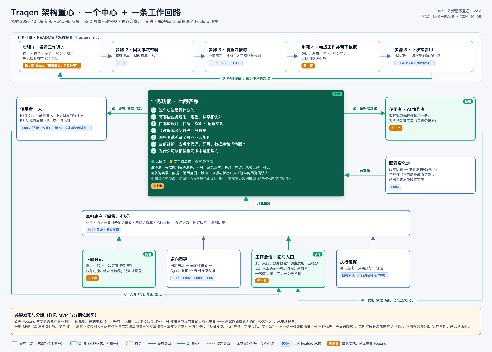
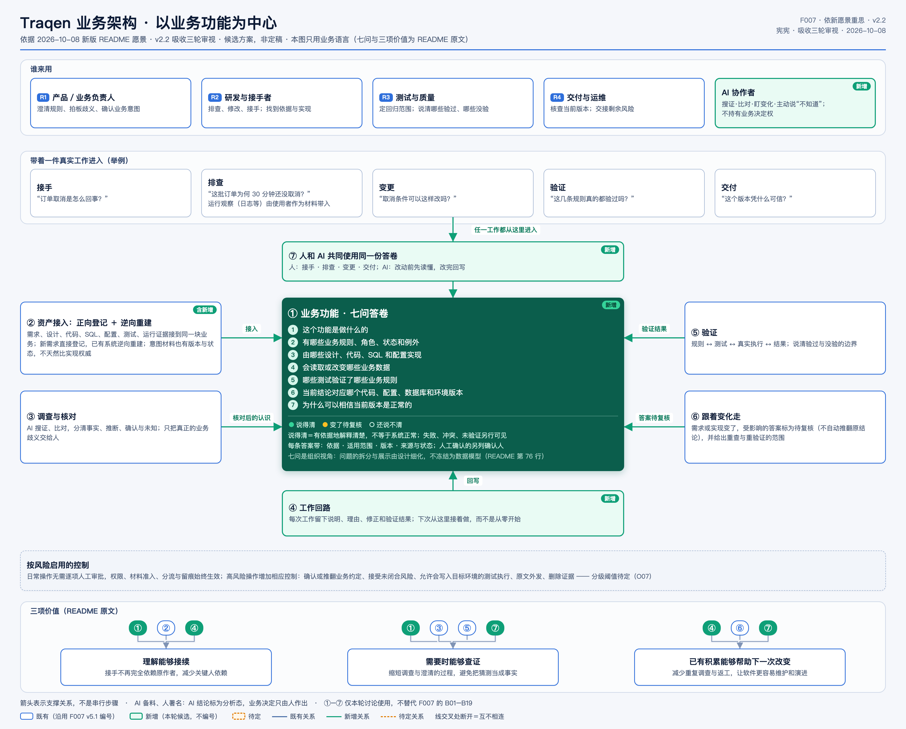
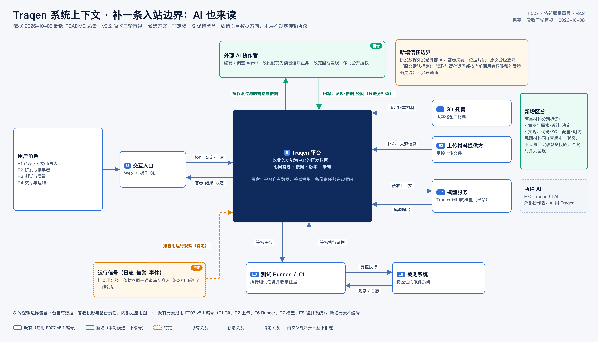
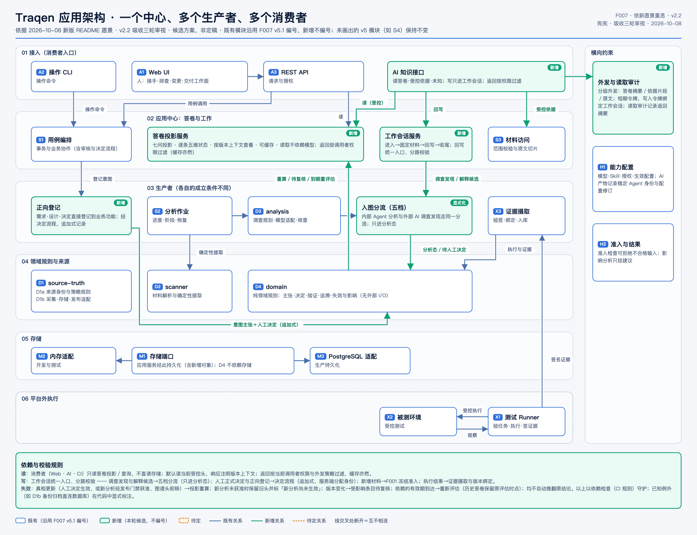
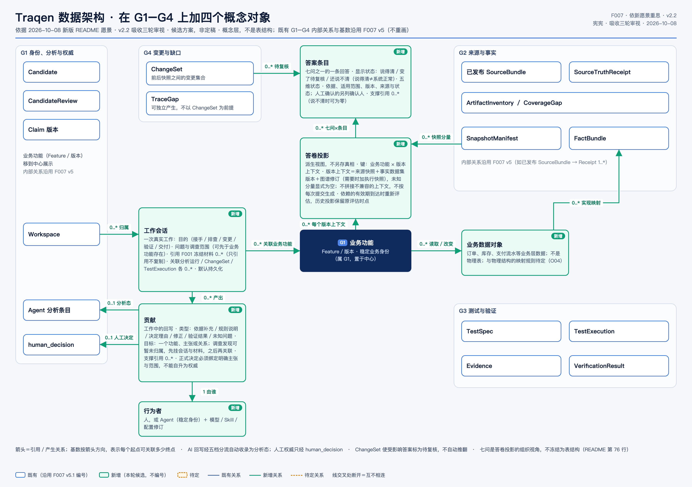
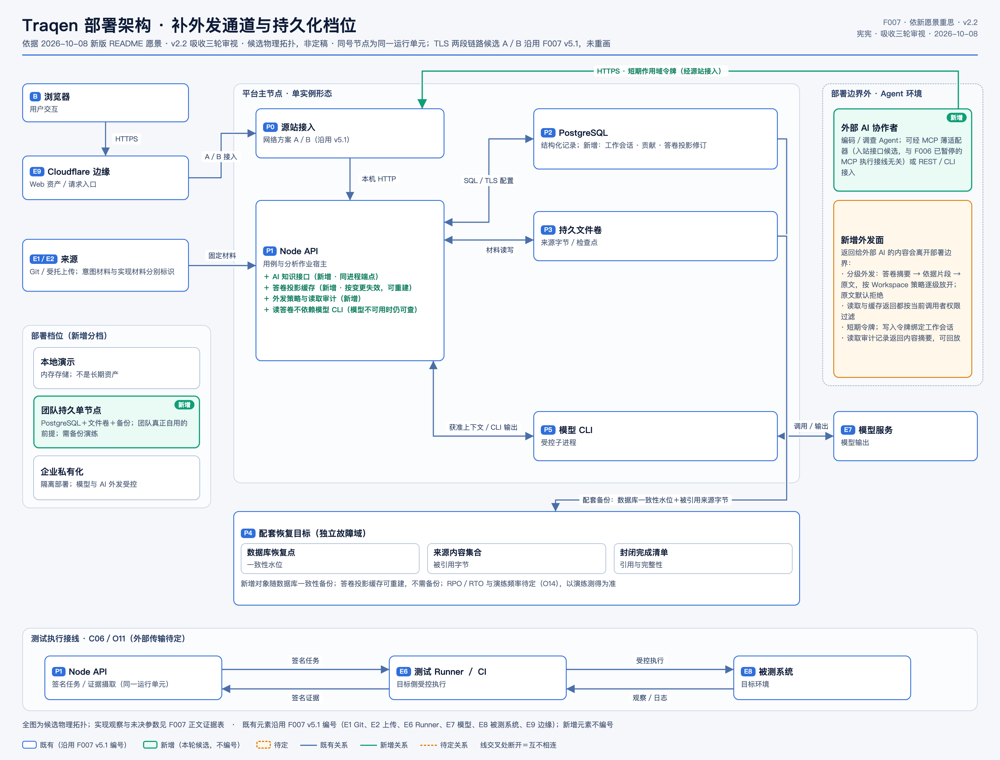
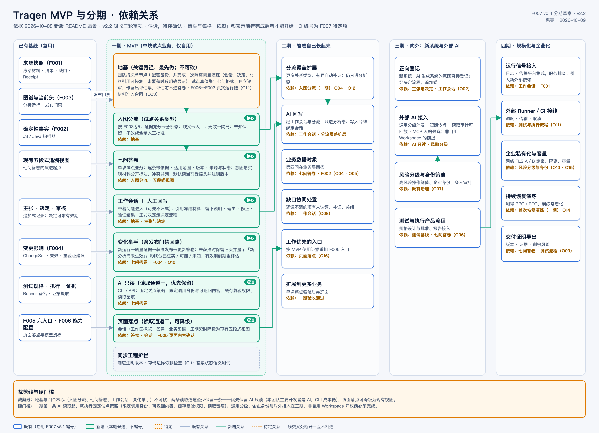

# F007 · Traqen 整体架构与 MVP 设计 v0.4

> **本轮整体设计独立成文，原 F007 设计保留。** 本文整理宪宪的 v2.2 方案：一个中心、一条工作回路、五个架构视角，以及 MVP 至四期的依赖。co-creator 于 2026-10-09 09:52 UTC 认可本轮整体方向，并明确要求单独落盘、保留之前 F007 的设计。本文不覆盖[原 F007 v0.3.2](../README.md)，也不替换其图稿、来源或入口。
>
> 方案认可与文档落盘不表示功能已经实现、部署通过验收，或所有待定项已经决定。七张图原样保留 v2.2 的“候选”标识；具体参数、试点选择及尚未合入图稿的补充见第 8、9 节。文档版本 **v0.4** 与图稿修订 **v2.2** 是两种编号。

## 阅读入口与依据边界

| 要了解什么 | 阅读位置 |
|---|---|
| 产品重心、整体形状与真实工作回路 | [1. 总体设计](#overview) |
| 为谁提供哪些业务能力 | [2. 业务架构](#business) |
| 平台内外如何协作，信任边界在哪里 | [3. 系统架构](#system) |
| 模块怎样组织，读写如何进入系统 | [4. 应用架构](#application) |
| 业务、会话、贡献、答案与证据怎样关联 | [5. 数据架构](#data) |
| 运行位置、持久化、外发与恢复 | [6. 部署架构](#deployment) |
| MVP、裁剪线、验收、后续分期与风险 | [7. MVP 与分期](#mvp) |
| O01–O16 的依赖归属与未决内容 | [8. 待定项](#open-items) |
| 末轮尚未合入 v2.2 的设计补充 | [9. 后续需细化的边界](#followups) |
| 图源、版本、原始依据与写入授权 | [10. 溯源与维护](#sources) |

产品愿景以[中文 README](../../../../README.zh-CN.md)为依据。F001、F002、F003、F005、F006 各自已确认的局部设计，以及 F004 的建议性影响边界继续适用。原 F007 的合同编号、五层分离、五维状态、版本身份与恢复要求仍可回查；不能仅因本文版本号更高，就推断未明确讨论的合同已被替换。

本文区分三类内容：**本轮方案**描述目标职责与分期；**既有依据**指出可复用的设计或实现；**待定**表示还需细化或选择。图中的既有编号沿用原 F007 v5/v5.1；新增元素不强行分配正式编号。业务图的 ①–⑦ 仅用于该图阅读，不替代旧设计的 B 编号。

## 1. 总体设计：一个中心，一条工作回路

Traqen 的目标是“让每一块业务永远有人说得清”：人员和版本变化时，已有认识、依据与未知仍能被接续。它的业务价值是**理解能够接续、需要时能够查证、已有积累能够帮助下一次改变**。

中心是每块业务的**七问答卷**。答卷是图谱、来源、主张、决定和执行证据的派生投影，不另立一套可独立修改的真相。七问组织阅读与查询，不冻结为七张表，也不把七格填满当成“系统正常”。

1. 这个功能是做什么的？
2. 有哪些业务规则、角色、状态和例外？
3. 它由哪些设计、代码、SQL 和配置实现？
4. 它会读取或改变哪些业务数据？
5. 哪些测试验证了哪些业务规则？
6. 当前结论对应哪个代码、配置、数据库和环境版本？
7. 为什么可以相信当前版本是正常的？

每条回答携带依据、适用范围、版本、来源与状态；人工确认的另列确认来源。显示“说得清”表示有依据地解释清楚，不等于系统正常；失败、冲突、陈旧、缺证据和未验证仍分别可见。

围绕中心形成五步工作回路：

1. **带着真实工作进入**：接手、排查、变更、验证或交付，先说清问题和调查范围。
2. **固定本次材料**：选择 Workspace、获准来源与精确版本，保留清单和缺口。
3. **调查并核对**：区分事实、解释、人工确认与未知，沿引用回查原材料。
4. **完成工作并留下依据**：保存业务说明、理由、修正及真实验证结果；不同写入按各自条件进入系统。
5. **下次接着用**：比较变化，复核受影响认识，保留此前依据与决定。

从一件事开始是价值组织方式，不是“首次局部扫描已实现”的承诺；现有参考分析首次运行仍为 `FULL`。

### 1.1 保留的基础与新增职责

| 组成 | 既有承接与本轮补充 |
|---|---|
| 固定来源与确定性事实 | F001、F002 提供材料身份、准入、事实及缺口 |
| 调查、解释与权威 | F003、F006 提供分析运行、配置、分流与人工决定边界 |
| 测试、执行、证据与影响 | 既有领域能力与 F004 提供精确执行绑定、独立状态和建议性影响 |
| 七问答卷 | 新增投影职责，将已有资产组织为人和 AI 能共同查询的回答 |
| 工作会话与贡献 | 新增真实工作的持续上下文与回写入口 |
| AI 知识接口 | 新增外部协作者读取答卷及受控回写的入口；与内部模型调用区分 |
| 正向登记 | 新意图进入业务资产的候选职责，排在三期 |

总览图中“无主责”是本轮发现的职责缺口，不是已经创建了新 Feature 或指定了实现负责人。既有五层真相基础保留，不为新增投影重建另一份来源或业务权威。

## 2. 业务架构

### 2.1 使用者与价值

| 使用者 | 真实工作 | 希望得到的帮助 |
|---|---|---|
| 产品／业务负责人 | 澄清规则、处理歧义、确认意图 | 看到意图、实现及证据的分歧，限定决定范围 |
| 研发与接手者 | 接手、排查、修改 | 找到规则依据、实现位置、业务关联和未知范围 |
| 测试与质量人员 | 设计回归、核查验证 | 分清测试资产、真实执行、失败和未验证 |
| 交付与运维人员 | 核查版本、交接风险 | 说明准确环境下的依据与剩余问题 |
| AI 协作者 | 搜证、比对、改动前查询、工作后补充发现 | 复用可溯源资产，明确不知道什么；不拥有业务决定权 |

### 2.2 能力组织

| 图内能力 | 业务职责 |
|---|---|
| ① 业务功能与七问答卷 | 按稳定业务身份组织回答，逐条展示版本、依据与状态 |
| ② 资产接入 | 正向登记与逆向重建共同服务业务；需求、设计、代码、配置、测试和运行证据分别有来源 |
| ③ 调查与核对 | 核对解释与材料，只将真正需要业务判断的歧义交给人 |
| ④ 工作回路 | 让一次工作形成的理由、修正和结果成为后续工作的起点 |
| ⑤ 验证 | 连起规则、测试规格、真实执行及结果，明确验过与没验过的范围 |
| ⑥ 跟着变化走 | 受影响的答案待复核，给出重查与重验证范围，不自动推翻原结论 |
| ⑦ 人和 AI 共同使用 | 共享同一份受控资产，通过不同入口完成各自的工作 |

意图材料也有版本和状态，不因写在文档里就天然比实现观察更权威；冲突时并列保留。排查需要的日志等运行观察可由使用者作为材料带入；这与四期的日志、告警平台集成不是同一交付。

### 2.3 治理与日常使用

日常操作无需逐项人工审批，权限、材料准入、分流和留痕始终生效。确认或推翻业务约定、接受未闭合风险、允许会写入目标环境的测试、原文外发与删除证据等动作增加相应控制；具体分级阈值仍属 O07。

测试通过不等于业务权威已确认；人的决定不抹掉相反材料。业务理解的质量不以图谱节点数、文档篇幅或扫描完成率代替。

## 3. 系统架构：平台黑盒与两种 AI 边界

Traqen 的系统边界包含平台自有数据、答卷投影及备份责任。系统上下文图保持黑盒，内部模块在下一节说明。

| 边界外对象 | 交互内容与边界 |
|---|---|
| 人与 Web／操作 CLI | 发起查询、工作与回写，接收答卷、结果和状态 |
| Git 托管／上传材料提供方 | 提供固定版本材料及来源信息，经 F001 准入 |
| 外部 AI 协作者 | 入站读取按权限过滤的答卷与依据；读写分开授权，发现与疑问不自动获得人工权威 |
| 模型服务 E7 | Traqen 出站调用模型，发送获准上下文并接收输出 |
| 测试 Runner／CI E6 | 接收签名任务，在目标侧受控执行，回传签名证据 |
| 被测系统 E8 | 接受受控执行并产生观察、日志；不与 Traqen 平台混为一个系统 |
| 运行信号来源 | 日志、告警、事件等，经上传材料同一冻结准入通道后可关联到工作；平台集成留后期 |

**入站 AI 知识接口与出站模型调用是两种授权面。** 不能因参与者都叫 AI 就共用一份不分方向的授权。入站 MCP 薄适配器只是候选协议，不恢复 F006 已暂停的 MCP 执行接线。

返回内容按答卷摘要、依据片段、原文分级，原文默认拒绝；答卷及缓存返回也须按当前调用者权限和外发策略过滤。MVP 采用限定身份与内容的固定试点策略，三期再建设通用配置与外部接入。

## 4. 应用架构：多个生产者，共用受控查询与工作入口

### 4.1 模块职责

| 层次／模块 | 职责 |
|---|---|
| Web、操作 CLI、REST API、AI 知识接口 | 接入调用者；AI 接口提供答卷、受控依据与未知，目标回写进入工作会话 |
| S1 用例编排 | 协调业务事务、审核与决定流程 |
| 答卷投影服务（新增） | 按业务功能与版本上下文组织回答；显示独立状态；可缓存、可重建，查询不依赖实时模型 |
| 工作会话服务（新增） | 保存进入、固定材料、调查、回写和收尾的上下文；统一入口、分路校验 |
| 正向登记（新增，三期） | 将需求、设计和决定登记为业务意图，经决定流程追加记录 |
| S2 分析作业、D3 analysis | 长任务推进与恢复、调查规划、模型适配和核查；不是外部测试 Runner 的调度服务 |
| 入图分流 | 内部 Agent 分析与外部 AI 调查发现按证据条件处理，分析收录不等于人工确认 |
| X3 证据摄取 | 验签、核对精确规格和版本绑定、保存执行与证据 |
| D1 source-truth、D2 scanner、D4 domain | 来源身份及 I/O 适配、确定性事实提取、主张／决定／验证／追溯／影响规则；D4 保持无外部 I/O |
| M1 存储端口、M2 内存适配、M3 PostgreSQL 适配 | 应用服务持久化；内存用于开发测试，长期资产使用持久适配 |
| 外发与审计、H1 能力配置、H2 准入与结果 | 横向约束授权、配置版本、归因、外发与不合格输入处置 |

### 4.2 四类写入，各有成立条件

| 写入内容 | 去向 | 不能省略的边界 |
|---|---|---|
| 调查发现与解释候选 | 五档分流 | 引用、范围、版本与语义支持核查；只进分析态 |
| 人工正式决定与正向登记 | 决定流程 | 明确对象、范围和权限，追加记录，身份由服务端分配 |
| 新增材料 | F001 冻结与准入 | 不借工作会话或人工回答绕过来源版本 |
| 执行结果 | 证据摄取与版本绑定 | 不按调用方自报 PASS 入库，不将结果变成人工确认 |

完整分流遵循 [F003 §5](../../F003-traceability-graph/README.md#5-五档分流)：充分支持自动收录；缺证据有界补证；歧义交人工；未知保留；无效引用、越权或版本混用隔离。MVP 覆盖试点需要的关系类型，二期扩展类型和补证能力，不恢复全量人工批准路径。

### 4.3 查询、版本与更新

- Web、AI、CI 等消费端通过答卷投影／查询访问，默认读取当前受控头，并在响应中标明实际版本上下文。
- 返回内容按当前权限与外发策略过滤，缓存命中也执行；读答卷不依赖模型 CLI 在线。
- v2.2 将人工决定生效、新分析通过发布门禁并推进图谱头列为投影重算条件。未获准的新分析保留在其运行上下文，旧头仍可查，答卷显示“新分析尚未生效”。
- 版本变化使受影响条目待复核；依赖的有效期到达时重新评估。历史答卷保留原评估时点，不把重新计算等同于自动推翻原主张。
- 依赖边界以 CI 检查守护，已知存储直连例外需显式登记。此项是目标约束，不表示检查规则已经实现。

执行证据独立生效后的投影更新，是末轮针对上述重算表述提出的补充，见第 9 节；原图未静默改写。既有证据摄取路径仍遵守原 F007 §3.4，不因这一说明而被新的分析发布门禁替代。

## 5. 数据架构：保留真相分层，增加工作与答卷概念

本图是概念关系，不是物理表结构。原 F007 的 G1–G4 内部关系与基数继续可回查：G1 为身份、分析与权威；G2 为来源与事实；G3 为测试与验证；G4 为变更与缺口。

### 5.1 新增概念及关系

| 概念 | 关键内容与生命周期 |
|---|---|
| 工作会话 | 一次真实工作的目的、问题和调查范围；可以先于业务功能存在；引用 F001 冻结材料，不复制材料 |
| 贡献 | 依据补充、规则说明、决定理由、修正、验证结果或未知问题；调查发现可暂未归属，先关联会话与材料，之后再关联业务 |
| 行为者 | 人，或具有稳定身份的 Agent；同时记录模型、Skill 和配置修订 |
| 答案条目 | 一项问题下的一条回答及五维状态、依据、适用范围与来源；人工确认的另列确认来源 |
| 答卷投影 | 业务功能 × 版本上下文的派生视图；不是另一份权威存储 |
| 业务数据对象 | 订单、库存、支付流水等业务概念，不等于物理表；物理映射规则待定，功能在二期 |

“四个概念对象”是原图的设计分组标题；表中进一步展开了行为者和答案条目，不据标题推导实体或表的数量。

关键基数按生命周期表达：Workspace 可有 `0..*` 工作会话；会话关联 `0..*` 业务功能、冻结材料及运行；会话产出 `0..*` 贡献；每项贡献记录一个行为者。贡献到分析条目或人工决定的关系分别允许为空，不要求所有回写都形成权威对象。正式决定仍必须绑定明确命题和范围。

### 5.2 版本、状态与保存

答卷的版本上下文包含来源快照、事实数据集版本、图谱修订；需要验证时再关联执行快照。未知分量显式为空，不拼接不兼容上下文，不要求每次 Git 提交都生成一份新答卷。

具体读取和验证沿用原 F007 §4.3 的身份要求：来源读取携带 Workspace、Bundle／Receipt 与材料定位；分析保留 Run、来源、配置和图谱修订；验证保留 Claim／Scope、精确 TestSpec、快照与 Execution；影响分析保留 from／to。执行快照不能替代实际执行记录。

| 独立维度 | 需要说明什么 |
|---|---|
| Authority 权威 | 谁以何种权限确认了哪个命题和范围 |
| Conformance 符合性 | 该版本实现与主张是否一致 |
| Verification 验证 | 哪个部署、环境下实际执行了什么，结果如何 |
| Freshness 新鲜度 | 依据当前是否仍然适用 |
| Conflict 冲突 | 是否存在尚未解决的相反解释或证据 |

五维分别展示，不合成综合绿灯。工作会话等用户状态默认持久化。历史记录与可变当前头分开，修正追加版本；来源字节引用、证据保留与授权删除各自遵守所属数据域规则，不把“全部 append-only”误写为所有存储对象都不可变。

## 6. 部署架构：持久单节点承载自用，外发与恢复从一期成立

### 6.1 运行单元与部署档位

候选单节点中，Node API 承载用例、分析作业、AI 知识接口、投影缓存及读取审计；PostgreSQL 保存结构化记录，专用持久文件卷保存来源字节和检查点。模型 CLI 是受控子进程，模型服务在相应调用边界之外。测试 Runner 在目标侧受控执行，平台侧负责证据摄取，两者职责分开。

| 档位 | 用途与承诺边界 |
|---|---|
| 本地演示 | 内存存储，可体验参考流程；不作为长期工作资产 |
| 团队持久单节点 | MVP 自用档；PostgreSQL、专用文件卷、配套备份和首次隔离恢复演练 |
| 企业私有化 | 后期扩展身份、隔离、网络与容量；不由候选拓扑宣称已具备企业部署能力 |

网络 TLS A／B 沿用原 F007 v5.1 的候选，不在本文选定新网络方案。图中的 Cloudflare、源站接入和链路不构成已经部署的证据。

### 6.2 AI 读取与外发

AI 知识接口可与 Node API 同进程。REST／CLI 可作为入站方式，MCP 薄适配器仍是候选；不依赖 F006 的出站 MCP 接线恢复。

从一期第一条 AI 读取起，就执行固定试点策略：限定调用身份与可返回内容、缓存复验权限、读取留痕。通用分级外发、短期令牌、写入令牌与会话绑定及审计回放属于完整架构方向，按路线图逐步交付。非自用 Workspace 对外开放前，完成三期的外部 AI 接入与身份／风险策略。

### 6.3 配套恢复

数据库恢复点、其引用的来源内容集合和封闭完成清单共同构成恢复集合，存放在独立故障域。工作会话、贡献、决定等结构化记录随一致性数据库备份；来源字节必须配套，不能依赖原 Git 或上传目录仍然存在。投影缓存可重建。

MVP 完成一次隔离恢复，验证会话、决定与材料引用可用，并明确恢复水位之后未覆盖的工作。四期是持续恢复演练与规模化，不是首次具备恢复能力。RPO、RTO、演练频率和容量参数仍待 O14 细化，不编造分钟数或零丢失承诺。

## 7. MVP 与分期

### 7.1 MVP 定义与价值验证

**在 Traqen 自己的一块真实业务上，让人和 AI 带着工作进入，读到有依据且标明未知的答卷，留下这次弄明白的内容；材料或决定变化后，受影响的回答能够举手。**

一期只在自用 Workspace 验证一块业务。建议试点为 F001 来源快照，但具体业务尚待选择；图中“单块”不意味着缩减既有首次 `FULL` 分析的材料完整性要求。

要验证的价值有三项：接手者能否准确理解并识别未知；一次工作的依据能否被下一次直接复用；变化能否被有范围地提示，而不是全部作废或悄悄过期。

### 7.2 地基、核心与通道

| 类别 | 一期范围 | 依赖／边界 |
|---|---|---|
| 地基 | 团队持久单节点、配套备份、一次隔离恢复演练 | F001 保存与恢复合同、O14 |
| 地基 | 试点留出真值集，按七问组织、独立评审，评估前不进入答卷 | 不以直接显示参考答案代替独立分析质量验证 |
| 地基 | F006→F003 真实运行链 | O12；配置、材料、运行、结果与当前头需要真实闭合 |
| 地基 | 材料准入合同 | O03；沿用来源资格、权限、完整性与版本要求 |
| 核心一 | 入图分流，只覆盖试点所需关系类型 | F003 §5；支持的解释进入分析态，歧义交人工，无效隔离，未知保留 |
| 核心二 | 七问答卷 | 依赖受控入图；逐条带依据和状态；意图／实现分开，冲突并列 |
| 核心三 | 工作会话＋人工回写 | 可先不归属业务；引用冻结材料；正式决定经过现有决定流程 |
| 核心四 | 变化举手，包含发布门禁回路和到期重评估 | 七问答卷、F004、O10；区分已证实、可能与未知影响 |
| 通道一 | AI 只读，优先保留 | CLI／API；固定试点授权、返回范围、缓存权限复验与留痕 |
| 通道二 | 页面落点，不重排导航 | 会话在工作区概览、答卷在业务图谱；工期紧可降级为现有五段式视图，具体 F005 页面内容另行确认 |
| 同步约束 | 响应版本上下文、存储依赖检查、答案状态语义校验 | 是工程验收要求，不表示已经交付 |

**裁剪线按 v2.2 保留：** 地基与四个核心不可砍，至少保留一条读取通道，优先保留 AI 只读，页面可降级。人工回写入口在页面降级时如何保留，是第 9 节的待细化内容，不能由“读通道存在”推定已经解决。

一期不建设外部 AI 的通用接入、AI 回写、正向登记、业务数据对象扩展、运行信号平台集成、导航入口重排、完整企业身份／风险分级或企业化部署。已有授权、来源准入和证据规则不因这些产品能力后置而停用。

### 7.3 发布门禁贯穿变化回路

当前生产引导要求真值集、独立审核测量与等价证据。审核测量绑定具体生产输入、Snapshot、Run 与持久化语义输出；等价证据绑定具体终态运行及其语义面。缺失、过期、自审、篡改或不等价的证据不能推进 `CurrentGraphHead`。

因此，变化回路是：**新运行 → 对应质量证据 → 获准发布 → 当前图谱及答卷更新**。未获准时保留旧头，显示“新分析尚未生效”；工作会话和人工回写不被分析发布门禁一并暂停，但仍经过各自授权与准入。

真值集在版本与适用范围内可以复用；运行绑定的测量和等价材料不能无条件跨运行复用。参考分析器生成的 `LOCAL_DEVELOPMENT_REFERENCE_ONLY` 记录不能冒充生产证据。

### 7.4 七个验收场景

以下是待执行的验收要求，不是已有验收结果。

| 场景 | 需要观察到的结果 |
|---|---|
| 1. 接手 | 未参与原调查的猫读取答卷，对照留出真值集检查；结论可回查，未知原因可核查，包括缺依据、冲突、未调查或受限 |
| 2. 回写复用 | 前一次会话留下的理由，能在下一次工作直接引用 |
| 3. 变化举手 | 一次真实改动后，已证实影响不能漏标；可能和未知可保守提示，但说明理由 |
| 4. 门禁回路 | 新分析未获准时保留旧头并显示未生效；获准后答卷更新 |
| 5. 决定到期 | 版本未变而决定到期时，权威状态自动重新评估 |
| 6. 先读后改 | 猫在改代码前读取答卷，并在改动说明中引用其中依据 |
| 7. 恢复 | 隔离恢复后，会话、决定与材料引用可用；未覆盖时间段明确可见 |

验收关注任务是否完成、依据是否可信与可复用，不用预设收益数字替代试点测量。试点关系类型清单、人可读输出和独立执行证据更新的补充验收见第 9 节，尚未改写上述 v2.2 场景。

### 7.5 二至四期

| 阶段 | 目标与内容 | 主要依赖 |
|---|---|---|
| 二期 | 分流覆盖扩展、更多关系类型与有界补证；AI 回写；业务数据对象；缺口协同处置；按使用证据调整工作入口；扩展到更多业务 | 一期入图分流、工作会话及验收；O04/O05/O08/O12/O16；路线图将 AI 回写排在分流覆盖扩展后 |
| 三期 | 正向登记；通用外部 AI 接入；风险分级与企业身份；测试与执行的产品流程 | 主张／决定、工作会话、一期只读接口、既有治理与测试能力；O02/O06/O07 |
| 四期 | 日志与告警平台集成；外部 Runner／CI 调度接线；企业私有化与容量；持续恢复演练；交付证明导出 | 工作会话与 F001、三期测试流程和身份策略、一期恢复基础；O09/O11/O13/O14/O15 |

后续分期描述能力扩展，不表示整期所有内容都互为串行前置。具体依赖以路线图中相应节点的依赖说明为本轮起点；首次 AI 读取的基础策略与首次恢复已经前置到一期。

### 7.6 最大风险与先做的验证

一期最大成本风险是每次运行所需的审核测量与等价证据。先用试点测出一次真实运行的证据准备、独立审核及发布成本，再优化实现与准备方式；不以绕过门禁换取更快迭代。

来源合同 O03、真实配置到分析的运行链 O12、分析关系进入影响传播的 O10，以及恢复配置 O14 均是一期依赖。页面设计可并行，不能用页面完成证明这些链路已闭合。

## 8. O01–O16 的分期归属与待定内容

沿用[原 F007 §7](../README.md#open-items)的编号。下表是把原有待定内容对应到本轮路线图，**不是关闭待定项，也不是把整个 O 项一刀切推迟到某期**。

| 编号／主题 | 本轮依赖归属 | 仍需明确的内容 |
|---|---|---|
| O01 首期产品范围 | 一期 | 单块试点业务最终选择、具体范围和可运行验收路径 |
| O02 业务基线治理 | 一期复用决定约束；三期正向登记 | 业务身份、拆分合并、发布单位与正向登记产品合同 |
| O03 材料读取与跨层合同 | 一期硬依赖 | F001→F003 受控入口、完整清单、权限复验与版本绑定 |
| O04 核心数据与入图协议 | 一期试点必需部分；二期扩展 | 试点类型、会话／贡献／投影的物理映射、并发入图和发布恢复 |
| O05 F002 首批能力 | 一期核实试点所需能力；二期扩面 | 材料与关系支持清单、能力外未知和独立参考依据 |
| O06 测试与执行产品流程 | 一期消费现有证据能力；三期产品化 | 规格／批准／报告接入范围；不由后期流程取代当前证据准入 |
| O07 身份与治理策略 | 一期固定试点策略；三期通用策略 | 风险分级阈值、企业身份、多人审批与外发配置；阈值仍待定 |
| O08 缺口协同处置 | 二期；一期保留未知 | 责任、补证、关闭／重开证据与通知，不隐藏未归属材料 |
| O09 质量视图与交付证明 | 四期导出；一期回答依据 | 指标口径、导出内容、脱敏、签署和留存 |
| O10 影响与新鲜度 | 一期硬依赖 | 自动分析关系如何进入 F004、影响分类、到期、前后版本与覆盖边界 |
| O11 外部 Runner 接线 | 四期，依赖三期测试流程 | 调度、传输、取消、去重与部署；既有签名和快照绑定继续适用 |
| O12 分析运行质量 | 一期真实运行和门禁；二期扩大覆盖 | 收录判据、预算、停止条件、恢复、晚到结果和独立评估 |
| O13 运行位置与网络 | 一期核实自用运行和外发条件；四期扩展 | TLS A／B 仍待定，隔离与网络不能凭候选图宣称已完成 |
| O14 备份与恢复配置 | 一期配套备份与首次演练；四期持续优化 | 目标、计划、容量、保留与 RPO／RTO 数值均待定 |
| O15 非功能容量 | 一期测量试点边界；四期规模化 | 负载、延迟、预算、隔离及可用性，无未经测量的吞吐承诺 |
| O16 整体体验接线 | 一期现有入口落点；二期按使用证据改进 | F005 页面内容另行确认；入口重排时机保持待定 |

## 9. 后续需细化的边界

v2.2 发布后的末轮讨论还有以下补充。co-creator 随后要求将本轮整体设计独立落盘；这些补充尚未获得宪宪逐项回应，故作为**待细化内容**记录，不擅自修改原图或把示例冻结为新合同。

| 主题 | 补充内容 | 与本文的关系 |
|---|---|---|
| 执行证据独立驱动投影 | 各领域记录通过各自准入并生效后，重算受影响答案；新增失败执行不必等待新的分析图谱头。建议增加“头不变、执行失败入库、答案更新”的场景 | 澄清应用图重算条件；对应 O06/O10，保留既有证据摄取职责 |
| 裁剪后的人工作业入口 | 至少一条读取通道之外，仍要有创建会话、关联材料和人工回写的可操作入口；采用 CLI 时计入一期交付 | 澄清 MVP 的页面降级条件；对应 O04/O16 |
| 真值集的溯源 | 记录评审依据的快照、适用范围及评审人留痕 | 细化独立评估材料；对应 O12 |
| 试点关系类型清单 | 在试点选定后列出一期支持与不支持的类型；讨论中的类型举例不是已批准清单 | 约束范围扩张；对应 O04/O05/O12 |
| 人可读输出 | 若页面降级，读取通道仍应使人能读懂会话记录、版本与“新分析尚未生效”等状态 | 细化读取通道验收；对应 O16 |

上述设计问题留在当前 F007 范围内，不借落盘新增 Feature、修改权限实现或另开一轮架构方案。

## 10. 溯源、图源与维护

### 10.1 本轮材料

| 材料 | 精确锚点与作用 |
|---|---|
| 宪宪 v2.2 整体方案 | thread `thread_mtqkycp918zlran6`，消息 `0001791530572860-000533-dd5cb4b0`；五视角、MVP、分期、七个验收场景与裁剪线 |
| 砚砚末轮补充 | 同 thread，消息 `0001791534296631-000536-c29061ef`；执行证据更新与人工回写入口两处待细化内容 |
| Kimi 末轮补充 | 同 thread，消息 `0001791534296631-000538-dacac609`；真值集溯源、试点类型清单、人可读输出 |
| 独立文档写入授权 | 消息 `0001791539548792-000539-ae0c0c97`，2026-10-09 09:52 UTC：“请将这一轮整体设计单独落一份设计文档，需要保留之前F007的设计。” |
| 整理时仓库基线 | `293f985524fa58a5a1b261354a7d4ccc9a38631d`；用于回查本文所述当前 README 与实现观察，不表示功能验收 |

### 10.2 项目依据

| 来源 | 本文消费的边界 |
|---|---|
| [中文 README](../../../../README.zh-CN.md) | 新愿景、七问语义、工作回路、当前参考运行与生产发布门禁 |
| [原 F007 v0.3.2](../README.md) | 五视角旧方案、合同与编号、五维状态、版本与恢复要求；本次原样保留 |
| [F001 来源快照](../../F001-workspace-source-truth/README.md) | 冻结、Receipt、当前准入、持久字节及配套恢复 |
| [F002 确定性事实](../../F002-deterministic-facts/README.md) | 确定性事实、材料支持与缺口，不以分析解释替代事实 |
| [F003 调查与图谱](../../F003-traceability-graph/README.md) | 五档分流、未知保留、分析态与人工决定分开 |
| [F004 影响分析](../../../features/F004-change-impact-analysis.zh-CN.md) | 已证实／可能／未知、版本绑定与建议性重验证 |
| [F005 布局与导航](../../F005-layout-navigation/README.md) | 工作区概览、业务图谱等现有入口；不通过本文改其页面合同 |
| [F006 能力配置](../../F006-workspace-capability-settings/README.md) | 一个 Main、至少一个 Child、显式授权、生效配置及真实运行接线缺口 |
| [生产引导](../../../../src/api/application-bootstrap.js) | 运行绑定的审核与等价证据加载、生产分析准入 |
| [追溯应用](../../../../src/application/traceability-application.js) | 决定到期判定、独立执行证据摄取与验证绑定 |
| [既有五段式视图模型](../../../../web/app/trace-detail-model.ts) | 答卷展示的演进参考，不证明新增会话与回写已实现 |

### 10.3 七张图及可维护图源

图稿作者为**宪宪／claude-opus-5-5**，本文整理人为**砚砚／gpt-6-astra**。本次原样收录已交付的 PNG 与自包含 HTML，不重新生成图片、改文字或替换连线。SHA-256、尺寸和文件配对见 [assets.json](assets.json)。

| 视角 | PNG | HTML 图源 |
|---|---|---|
| 0 总览 | [查看](images/0-overview-v2.2.png) | [图源](src/0-overview-v2.2.html) |
| 1 业务 | [查看](images/1-business-v2.2.png) | [图源](src/1-business-v2.2.html) |
| 2 系统 | [查看](images/2-system-v2.2.png) | [图源](src/2-system-v2.2.html) |
| 3 应用 | [查看](images/3-application-v2.2.png) | [图源](src/3-application-v2.2.html) |
| 4 数据 | [查看](images/4-data-v2.2.png) | [图源](src/4-data-v2.2.html) |
| 5 部署 | [查看](images/5-deployment-v2.2.png) | [图源](src/5-deployment-v2.2.html) |
| 6 MVP 与分期 | [查看](images/6-roadmap-v2.2.png) | [图源](src/6-roadmap-v2.2.html) |

HTML 内嵌布局、SVG 连线和样式，可用浏览器打开；原 PNG 为 2 倍缩放渲染。本文不把作者报告的布局检查当作产品或架构验收，也不要求读者依赖临时目录或聊天上传链接才能看图。

本次仅新增此独立目录。原 F007 README、旧图片与图源、其他 Feature 文档和入口索引均保持原状。后续若要将本方案替换为项目主入口或收敛第 9 节内容，应明确记录采用范围与对应修订，保留本轮与旧设计的可追溯关系。
