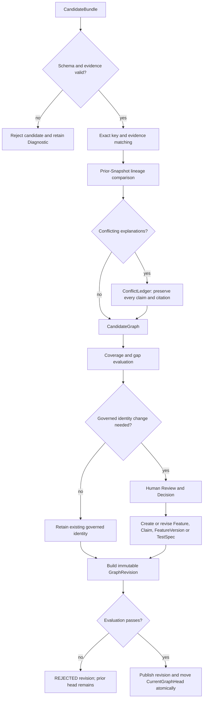

> Language: **English** · [简体中文](workspace-scan-and-analysis-lifecycle.zh-CN.md)

---
feature_ids: [F001]
related_features: []
topics:
  - workspace
  - source-scan
  - analysis-run
  - checkpoint
  - pause-resume
  - browser-refresh
doc_kind: feature-design
created: 2026-07-29
status: proposed
priority: P0
---

# Durable Workspace Scan and Analysis Agent Lifecycle

> Supporting execution design for [F001](F001-legacy-system-understanding.md). This document specifies durable ownership and recovery; understanding correctness, reconciliation, and evaluation are defined by the F001 engine design.

## 1. Requirement

The Workspace flow is one user-visible job with two separately checkpointed execution stages:

1. **SourceScanRun** seals an immutable source Snapshot, extracts deterministic per-file facts, resolves cross-file relations, and commits a `FactBundle`.
2. **AnalysisRun** plans and executes Agent/Skill `WorkUnit`s from Facts in that same Snapshot and materializes a Candidate projection.

The parent job then owns reconciliation, evaluation, graph projection, and publication. These orchestration phases do not collapse SourceScanRun and AnalysisRun into one checkpoint stream.

The parent **WorkspaceAnalysisJob** is the only task exposed to the user. The browser may create commands and observe state, but it never owns a scanner, model executor, pause flag, run clock, or authoritative status.

Refreshing, closing, reopening, disconnecting, or attaching multiple browser tabs must not change job state.

## 2. Confirmed gap

The current implementation moved only model analysis to the API. Source preparation still runs inside
`WorkspaceAnalysisView.scanWorkspace()`:

- directory handles, file lists, cursors, batches, and `scanning` state belong to the page process;
- the server `AnalysisRun` does not exist until every file has been scanned and the browser submits derived observations;
- unmounting the page destroys the only scan executor;
- IndexedDB preserves checkpoints but cannot keep execution alive;
- the previous design explicitly allowed `SCANNING + refresh → INTERRUPTED`.

The earlier acceptance covered refresh only after creation of a server `AnalysisRun`. It did not test the scan stage and is not acceptance evidence for this requirement.

## 3. Terminal architecture

```text
User
  │ Start / Pause / Resume / Cancel
  ▼
WorkspaceAnalysisJob                         ← the only user-visible task
  │
  ├─ SourceRegistration                      ← explicitly authorized source
  │    └─ SourceSnapshot                     ← immutable input for this job
  │         └─ SourceScanRun                  ← server-owned per-file work
  │              └─ FactBundle               ← Snapshot-bound Facts
  │
  └─ AnalysisRun                             ← server-owned Agent/Skill WorkUnits
       └─ CandidateBundles
            └─ CandidateReconciliation
                 └─ EvaluationRun
                      └─ GraphRevision projection
                           └─ atomic publication → CurrentGraphHead

BrowserSubscription                          ← non-authoritative read pointer
```

The API persists the job ID before returning `202 Accepted`. SourceScanRun and AnalysisRun have separate checkpoints and progress, but remain linked by one job and one source Snapshot.

Only an explicit user command can manually pause a job. A crashed worker or restarted API automatically re-leases work from the last committed checkpoint when `desiredState=RUNNING`.

### 3.1 End-to-end understanding logic

Traqen deliberately separates observation, interpretation, reconciliation, governance, and publication:

| Layer | Input | Output | Authority |
|---|---|---|---|
| deterministic scanner | immutable source Snapshot | ArtifactInventory, Facts, deterministic relations | may state what is present in the Snapshot |
| Analysis Agent / Skills | authorized Facts and bounded source slices | evidence-backed Candidates | may propose semantic interpretations |
| reconciliation | Facts, Candidates, prior lineage | CandidateGraph, conflict/coverage ledgers, lineage | may match and compare; may not assign governed identity |
| review and Decision | reconciled Candidates and evidence | governed Feature, Claim, FeatureVersion, TestSpec decisions | the only path that creates or changes business authority |
| evaluation and publication | candidate graph, decisions, evidence, gaps | immutable GraphRevision and atomic CurrentGraphHead update | may publish only a revision that passes policy |

Neither a path name, a model response, a similarity score, nor a deterministic hash may create or merge a governed `Feature.id`.

```mermaid
flowchart LR
    A[Authorized code or document project] --> B[SourceRegistration]
    B --> C[Immutable SourceSnapshot]
    C --> D[ArtifactInventory]

    D --> E[Deterministic extractors]
    E --> F[FactBundle]
    F --> G[Cross-file relation resolver]

    D --> H[Manifest and convention plan]
    G --> I[Fact-enrichment plan]
    H --> J[Bounded Analysis WorkUnits]
    I --> J
    J --> K[Agent and Skills]
    K --> L[CandidateBundles]

    F --> M[Candidate reconciliation]
    L --> M
    M --> N[CandidateGraph]
    M --> O[ConflictLedger]
    M --> P[CoverageLedger]
    M --> Q[CandidateLineage]

    N --> R[EvaluationRun]
    O --> R
    P --> R
    Q --> R
    N --> S[Human review and Decision]
    S --> T[Governed Feature, Claim, TestSpec]
    T --> U[GraphRevision]
    R -->|pass| U
    R -->|reject| V[Keep prior CurrentGraphHead]
    U --> W[Atomic publish]
    W --> X[CurrentGraphHead]
    X --> Y[Feature, API, trace, impact and quality views]
```



### 3.2 Scanner algorithm: source to deterministic Facts

Given a project such as an order service, the scanner executes four logical steps:

1. **Authorize and freeze the input.** `SourceRegistration` proves that the runner may read the root. Files are copied into a content-addressed Snapshot spool with relative path, content hash, size, media type, detected language, and scanner/policy versions. A source change during the run belongs to the next Snapshot.
2. **Seal the full inventory.** Every in-scope artifact receives an explicit disposition: `INCLUDED`, `EXCLUDED_BY_POLICY`, `UNSUPPORTED`, `GENERATED`, `BINARY`, `OVERSIZED`, `SECRET_REDACTED`, or `READ_FAILED`. Before manifest seal, the denominator is unknown; after seal, coverage is measured against the exact inventory rather than only successfully parsed files.
3. **Run versioned deterministic extractors.** Code yields modules, symbols, imports, calls, endpoints, jobs, and commands; schemas and migrations yield data objects and reads/writes; configuration yields keys and consumers without secret values; documents yield addressable requirement/design passages; tests yield cases, assertions, fixtures, and implementation links; result files yield execution identities and metadata.
4. **Resolve cross-file relations and commit.** The resolver links routes to handlers, calls to symbols, tests to implementation, configuration to consumers, and code to data objects. `SnapshotManifest + FactBundle` commit atomically. Each Fact retains Project, Snapshot, source span/content hash, extractor identity/version, a stable entity identity, and an immutable Snapshot-local Fact identity.

For example, the deterministic layer may produce:

```text
POST /orders
  └─ IMPLEMENTED_BY → OrderController.submitOrder
       └─ CALLS → OrderService.createOrder
            └─ WRITES → orders

order-submit.test.js
  └─ EXERCISES → OrderService.createOrder

ORDER_SUBMIT_ENABLED
  └─ CONSUMED_BY → OrderService.createOrder
```

This proves observable structure. It does not yet prove that the structure is the governed business feature “Submit order.”

### 3.3 Analysis Agent algorithm: Facts to semantic Candidates

The Agent does not replace parsers. It answers bounded semantic questions that deterministic extraction cannot settle: business capability, actors and workflow, rules and exceptions, design-to-implementation mapping, test intent, contradictions, and missing relations.

Planning occurs in two passes so scanner blind spots do not become Agent blind spots:

1. **Manifest/convention pass.** Before semantic Facts are complete, create at least one WorkUnit for every inventory partition using ArtifactInventory, package/module/entrypoint conventions, API and document manifests, test/config/data clusters, safe path categories, and prior Snapshot lineage.
2. **Fact-enrichment pass.** Add WorkUnits for unresolved calls, undocumented endpoints, requirements without implementation evidence, unclear tests, configuration without consumers, document/code contradictions, and the relation frontier touched by an incremental change.

Each WorkUnit is pinned to:

```text
Snapshot + analysis lane + bounded scope + producer version + policy digest
```

When source text is necessary, the Agent requests an Artifact/Symbol-bound slice through the SourceSlice Broker. The Broker validates the WorkUnit scope, applies secret scanning/redaction, clips line and byte ranges, enforces the 64 KiB / 12,000-token default ceiling, and records request/policy/result digests. Denial or truncation becomes a Diagnostic/Gap rather than an authorization bypass.

The output is a structured `CandidateBundle`, not a free-form summary:

```text
CandidateFeature: "Submit order"
CandidateClaim: "Only DRAFT orders may be submitted"
CandidateRelation:
  Submit order IMPLEMENTED_BY OrderService.createOrder
  Submit order EXPOSED_BY POST /orders
  Submit order CONFIGURED_BY ORDER_SUBMIT_ENABLED
CandidateTestIntent:
  order-submit.test.js may exercise "Only DRAFT orders may be submitted"
```

Every Candidate carries evidence Fact IDs, Snapshot and WorkUnit identity, producer/model/Skill version, per-dimension confidence, deterministic confidence caps, uncertainty, and alternative explanations. A deterministic validator rejects out-of-scope, cross-Project, cross-Snapshot, missing, duplicate, or fabricated evidence; strips forbidden governed IDs/fields; and caps confidence to what the evidence supports.

### 3.4 Reconciliation algorithm: preserve identity uncertainty

Reconciliation is not name-based deduplication. It runs the following gates in order:

1. validate Candidate schema, endpoints, evidence scope, SourceSlice authorization, and confidence caps;
2. match exact stable Candidate keys, shared Facts/source slices, explicit API/document/symbol references, constraints, and scope;
3. compare with the prior Snapshot and classify observed Candidate lineage as `NEW`, `UNCHANGED`, `BUSINESS_SEMANTICS_CHANGED`, `IMPLEMENTATION_REMAPPED`, or `EVIDENCE_REFRESHED`; place a prior Candidate that is no longer observed under `candidateAbsences` with disposition `NO_CURRENT_OBSERVATION`;
4. propose duplicate, parent/child, split, merge, or existing-Feature mappings without applying them;
5. preserve contradictory document, implementation, and test claims in `ConflictLedger`;
6. prove inventory/WorkUnit/evidence coverage and unresolved gaps in `CoverageLedger`.



The reconciliation result consists of `CandidateGraph`, `ConflictLedger`, `CoverageLedger`, and `CandidateLineage`. A Candidate remains `PENDING_REVIEW` with no governed Feature ID until an authorized Decision accepts, rejects, links, splits, merges, or classifies it.

### 3.5 Graph projection, publication, and incremental evolution

A `GraphRevision` materializes one coherent view of SnapshotManifest/ArtifactInventory, Facts, reconciled Candidates and ledgers, governed Features/Claims/Decisions/TestSpecs, test executions and Evidence, ChangeSet/ImpactAssessment, and explicit gaps. All nodes and edges retain Snapshot, producer, evidence, decision, status, version, and time provenance.

Publication is fail-closed:

```text
BUILDING → EVALUATING → PUBLISHED
                     ↘ REJECTED
```

Publishing the immutable revision and moving `CurrentGraphHead` are one transaction. On scan, reconciliation, evaluation, or publication failure, the failed revision and diagnostics remain queryable while the prior head continues serving every Feature Tree, API Tree, TraceChain, impact, coverage, conflict, and quality projection.

The first successful project analysis must be `FULL`. A later `INCREMENTAL` run compares ArtifactInventories, invalidates affected Facts, resolves the changed relation frontier, reruns WorkUnits whose evidence or producer changed, reuses unchanged Candidate lineage, emits a ChangeSet, computes impacted Features/Claims/TestSpecs, creates an ImpactAssessment and revalidation plan, and publishes a new GraphRevision only after evaluation passes. Implementation movement alone updates mappings and history; only a governed business-definition Decision creates a new FeatureVersion.

### 3.6 Current implementation boundary

This section defines the F001 target, not a claim that every component already exists. Current code has deterministic JavaScript/Java and partial OpenAPI/SQL/config/test scanning, SnapshotManifest and FactBundle relations, bounded Analysis WorkUnits and Candidate validation, incremental Candidate lineage, governed Feature/Claim/Decision/TestSpec/Evidence objects, and graph/trace projections.

F001 still requires the complete server-owned SourceScanRun, multilingual canonical-scanner parity, complete ArtifactInventory, manifest-first Agent planning, SourceSlice Broker, global reconciliation and its ledgers, EvaluationRun/GraphRevision/CurrentGraphHead publication, and the two-Snapshot “Traqen analyzes Traqen” acceptance.

## 4. User journey

### First run

1. Create a Workspace.
2. Register a source directory through the Local Runner. The API returns an opaque `sourceRegistrationId` and does not expose the canonical absolute path through normal reads.
3. Select a model profile and click Start.
4. Receive a stable `jobId` immediately.
5. Observe the server building a SourceSnapshot and executing SourceScanRun.
6. Observe the server transition to AnalysisRun after the FactBundle commits.
7. On the first project run, evaluate and publish the FULL GraphRevision. On later Snapshots, evaluate the INCREMENTAL revision and atomically move CurrentGraphHead only after it passes.

### Refresh and reconnect

At any stage, the user may refresh or close the browser. The server continues. Reopening the page loads the subscription and performs `GET` for the same `jobId`. Mount, refresh, reconnect, and polling never call Start, Pause, Resume, or Cancel.

### Manual pause and resume

Pause first persists `PAUSE_REQUESTED`. The worker commits the current atomic unit and transitions to `PAUSED`. Refresh preserves that state. Resume reuses the same job, source Snapshot, scan run, and analysis run, while skipping completed file and Agent WorkUnits.

## 5. Lifecycle objects

### SourceRegistration

Represents a server-authorized source locator.

```ts
type SourceRegistration = {
  id: string;
  projectId: string;
  connectorKind: "LOCAL_FILESYSTEM";
  displayName: string;
  canonicalRootRef: string; // private/encrypted; not returned by normal read APIs
  policyVersion: string;
  status: "ACTIVE" | "REVOKED";
  createdAt: string;
  updatedAt: string;
};
```

Registration rules:

- canonicalize `rootPath` with `realpath` and require it to be below an operator-configured allowlist;
- reject the filesystem root, the home root, device files, sockets, and symlink escape;
- keep the absolute canonical root private and out of normal read APIs;
- make revocation prevent new jobs without rewriting historical Snapshots.

### SourceSnapshot

```ts
type SourceSnapshot = {
  id: string;
  projectId: string;
  sourceRegistrationId: string;
  manifestDigest: string;
  scannerVersion: string;
  policyVersion: string;
  fileCount: number;
  totalBytes: number;
  status: "BUILDING" | "SEALED" | "FAILED";
  createdAt: string;
  sealedAt: string | null;
};
```

A sealed Snapshot is immutable. Source changes during the run are visible only to a later job and Snapshot.

### SourceScanRun

```ts
type SourceScanRun = {
  id: string;
  jobId: string;
  projectId: string;
  sourceSnapshotId: string;
  status:
    | "QUEUED" | "RUNNING" | "PAUSE_REQUESTED" | "PAUSED"
    | "COMPLETED" | "COMPLETED_WITH_GAPS" | "FAILED" | "CANCELLED";
  phase: "DISCOVERY" | "SNAPSHOTTING" | "EXTRACTION" | "RELATION_RESOLUTION" | "FACT_COMMIT";
  plannedFileCount: number | null;
  completedFileCount: number;
  failedFileCount: number;
  leaseOwnerId: string | null;
  leaseToken: number;
  leaseExpiresAt: string | null;
  updatedAt: string;
};
```

A scan WorkUnit has the deterministic identity:

```text
hash(sourceSnapshotId + relativePath + contentHash + scannerVersion + policyVersion)
```

Completed units are skipped on recovery.

### AnalysisRun

The canonical AnalysisRun remains the Agent owner. It may start only after a complete FactBundle exists for the same Project and Snapshot.

Every Analysis WorkUnit must preserve these boundaries:

- `evidenceFactIds` belong to the target WorkUnit;
- Facts belong to the same Project and Snapshot;
- model confidence does not exceed deterministic evidence caps;
- completed WorkUnits do not call the model or Skill again during recovery.

### WorkspaceAnalysisJob

```ts
type WorkspaceAnalysisJob = {
  id: string;
  projectId: string;
  sourceRegistrationId: string;
  sourceSnapshotId: string | null;
  scanRunId: string | null;
  analysisRunId: string | null;
  candidateGraphId: string | null;
  evaluationRunId: string | null;
  graphRevisionId: string | null;
  requestedMode: "FULL" | "INCREMENTAL" | "AUTO";
  desiredState: "RUNNING" | "PAUSED" | "CANCELLED";
  status:
    | "QUEUED" | "RUNNING" | "PAUSE_REQUESTED" | "PAUSED"
    | "RECOVERING" | "COMPLETED" | "COMPLETED_WITH_GAPS"
    | "FAILED" | "CANCELLED";
  phase:
    | "SOURCE_SCAN"
    | "FACT_COMMIT"
    | "ANALYSIS"
    | "RECONCILIATION"
    | "EVALUATION"
    | "PROJECTION"
    | "PUBLISHING";
  createdAt: string;
  updatedAt: string;
  completedAt: string | null;
};
```

Browser connection state is not job state. `CONNECTED / RECONNECTING / OFFLINE` is a client-only projection and may never overwrite the server job.

Mode resolution is deterministic: when the Project has no `CurrentGraphHead`, `AUTO` resolves to `FULL` and explicit `INCREMENTAL` is rejected. Once a head exists, `AUTO` resolves to `INCREMENTAL`; an operator may still force `FULL`. Mode resolution is persisted before work starts and cannot change during Resume.

### BrowserSubscription

IndexedDB stores only:

- `projectId`;
- `jobId`;
- the last observed version and timestamp.

The subscription is a non-authoritative pointer. It does not store authoritative `RUNNING` state, scan checkpoints, Facts, or Candidates.

## 6. State transitions

### 6.1 WorkspaceAnalysisJob

| Current | Event | Next | Rule |
|---|---|---|---|
| absent | Start | `QUEUED` | Persist before `202` |
| `QUEUED` | worker lease | `RUNNING` | Start SourceScanRun |
| `RUNNING` | explicit Pause | `PAUSE_REQUESTED` | Persist desired state |
| `PAUSE_REQUESTED` | atomic unit committed | `PAUSED` | Stop leasing new work |
| `PAUSED` | explicit Resume | `QUEUED` | Same job and Snapshot |
| `RUNNING` | lease expires | `RECOVERING` | Not a manual pause |
| `RECOVERING` | new worker lease | `RUNNING` | Resume from checkpoint |
| `RUNNING` | all phases finish | terminal success | Persist result and immutable output references |
| non-terminal | explicit Cancel | `CANCELLED` | Never auto-resume |
| any | refresh/offline/GET | unchanged | No side effect |

### 6.2 Phase transitions

| Current phase | Committed event | Next phase or state |
|---|---|---|
| `SOURCE_SCAN` | all scan WorkUnits complete | `FACT_COMMIT` |
| `FACT_COMMIT` | SnapshotManifest and FactBundle committed | `ANALYSIS` |
| `ANALYSIS` | all required CandidateBundles committed | `RECONCILIATION` |
| `RECONCILIATION` | CandidateGraph, ConflictLedger, CoverageLedger, and lineage committed | `EVALUATION` |
| `EVALUATION` | EvaluationRun passes | `PROJECTION` |
| `EVALUATION` | EvaluationRun rejects the revision | terminal gap/failure; keep the prior `CurrentGraphHead` |
| `PROJECTION` | immutable GraphRevision materialized | `PUBLISHING` |
| `PUBLISHING` | GraphRevision becomes `PUBLISHED` and CurrentGraphHead moves atomically | `COMPLETED` / `COMPLETED_WITH_GAPS` |

These job phases project the detailed F001 understanding pipeline defined in
[`legacy-system-understanding-engine.md`](legacy-system-understanding-engine.md). Phase transitions and their output references commit atomically. A job cannot enter Analysis without a committed FactBundle, enter Evaluation without reconciliation ledgers, or complete without a published-or-rejected GraphRevision result.

## 7. Scan checkpoints

SourceScanRun executes:

1. **DISCOVERY** — enumerate an ordered manifest below the authorized root.
2. **SNAPSHOTTING** — write content-addressed blobs and fixed content hashes.
3. **EXTRACTION** — extract per-file deterministic Facts.
4. **RELATION_RESOLUTION** — resolve imports, calls, tests, and other cross-file links.
5. **FACT_COMMIT** — atomically persist SnapshotManifest and FactBundle.

Each file or bounded batch commits atomically. A crash may repeat at most one uncommitted unit. Deterministic IDs make retries idempotent. A `RUNNING` scan must have a valid worker lease.

Scan outcomes are classified rather than collapsed:

- `SKIPPED` for an explicit policy disposition that remains in the inventory denominator;
- retryable `FAILED` for a file/batch failure that preserves its diagnostic and attempt count;
- fatal source-root/authorization failure, which fails the scan without pretending the remaining inventory was examined.

Before the manifest is sealed, `plannedFileCount` is `null` and the UI states that the denominator is still being discovered. After seal it is exact; progress must never display an estimated count as a complete denominator.

## 8. Scanner parity gate

The current browser scanner supports more languages than the server `JavaScriptProjectScanner`. Server migration may not reduce product capability.

Before cutover, the canonical scanner must retain the current visible support for JavaScript/TypeScript/JSX/TSX, Java, Python, Go, C#, Rust, OpenAPI, commands, configuration, and test clues.

A shared multilingual fixture suite must compare:

- file coverage;
- Fact/Candidate types and counts;
- stable IDs and source locations;
- secret redaction;
- test-to-implementation links;
- diagnostics.

The browser execution path cannot be removed until required parity is 100%.

## 9. Analysis recovery

- The AnalysisRun is pinned to the job's SourceSnapshot and FactBundle.
- Pause may abort an in-flight model request, but that unit returns to `QUEUED` and is not recorded as complete.
- A committed CandidateBundle is never recomputed.
- Resume keeps the same AnalysisRun.
- Retry exhaustion follows an explicit gap/pause policy and never loops indefinitely.

## 10. Leases and idempotency

- Start uses a stable idempotency key/job ID.
- Duplicate Start returns the existing job.
- One valid worker lease exists per job.
- A monotonically increasing lease token fences stale workers.
- Repeated Pause/Resume commands are idempotent.
- Scheduling is at-least-once; result commit is exactly-once.
- After restart, running jobs auto-recover, manually paused jobs stay paused, and cancelled jobs never resume.

## 11. Security boundary

### 11.1 Deployment capability modes

| Mode | Source access | Rule |
|---|---|---|
| `LOCAL_SINGLE_TENANT` | API and Runner are co-located and read allowlisted local source | permits `LOCAL_FILESYSTEM` registration |
| `PRIVATE_RUNNER` | runner stays beside private source and receives work over mutually authenticated/outbound transport | raw source remains at the source boundary |
| `CLOUD_CONTROL_PLANE` | control plane cannot read a browser-local path | requires Private Runner or governed Remote Git Connector; direct local registration is disabled |

The first implementation delivers `LOCAL_SINGLE_TENANT`. `SourceRegistration` records connector kind, capability version, and policy version so later connectors do not change Snapshot or graph semantics.

### 11.2 Common boundaries

- `TRAQEN_ALLOWED_WORKSPACE_ROOTS` is required for local registrations.
- Canonical `realpath` checks apply to the root and every file.
- Filesystem root, home root, symlink escape, device files, sockets, FIFOs, and non-regular files are rejected.
- Normal read APIs and logs do not reveal absolute paths, source bodies, secrets, or unredacted `.env` values.
- Raw source enters only the local Snapshot spool and scanner.
- External models receive bounded, policy-filtered Facts, never raw source or unredacted secrets.
- Snapshot spool data has no implicit TTL and is deleted only through an explicit audited action that removes only blobs exclusively referenced by the target Snapshot.

Remote Git and browser source upload connectors are outside the first phase. A cloud/multi-tenant API must reject `LOCAL_FILESYSTEM` registration until a compatible Private Runner exists.

## 12. API draft

```http
POST /v1/projects/{projectId}/source-registrations
GET  /v1/projects/{projectId}/source-registrations/{registrationId}
POST /v1/projects/{projectId}/source-registrations/{registrationId}/revoke

POST /v1/projects/{projectId}/workspace-analysis-jobs
GET  /v1/projects/{projectId}/workspace-analysis-jobs/{jobId}
POST /v1/projects/{projectId}/workspace-analysis-jobs/{jobId}/pause
POST /v1/projects/{projectId}/workspace-analysis-jobs/{jobId}/resume
POST /v1/projects/{projectId}/workspace-analysis-jobs/{jobId}/cancel
GET  /v1/projects/{projectId}/workspace-analysis-jobs/{jobId}/events
```

Start references a source registration, model profile, and mode. It does not contain source bodies or browser-derived observations.

Job reads return:

- job `status`, `phase`, and `desiredState`;
- SourceScanRun file counts and AnalysisRun WorkUnit counts;
- Snapshot, FactBundle, AnalysisRun, CandidateGraph, EvaluationRun, and GraphRevision references;
- the most recent error and whether it is retryable;
- a monotonically increasing `version`.

## 13. UI contract

```text
Workspace analysis · JOB-123                     [RUNNING]

1. Source scan
   Snapshot sealed · 5,240 / 12,480 files · 42%

2. Analysis Agent
   Waiting for FactBundle · 0 / 0 WorkUnits

Connection: reconnecting…
[Pause] [Cancel]
```

UI rules:

- display connection and job status separately;
- show reconnecting after refresh, never terminated or automatically paused;
- derive `RUNNING`, `PAUSED`, and terminal states only from the server;
- disable duplicate Pause while `PAUSE_REQUESTED` and show that a checkpoint is being saved;
- allow only an explicit user Resume from `PAUSED`;
- keep mount, refresh, reconnect, and polling paths GET-only.

## 14. Failure and recovery

| Failure | Job behavior | User surface |
|---|---|---|
| browser refresh/close | unchanged | reattach to same job |
| browser offline | server continues | connection offline |
| API temporarily unreachable | do not infer failure | reconnecting |
| worker crash | lease recovery | recovering → running |
| API restart | persistent re-leasing | same job/checkpoint |
| source permission lost | pause/fail with checkpoint | explicit authorization error |
| one unreadable file | policy gap/failure | file diagnostic |
| source mutates | current Snapshot fixed | next run detects change |
| model timeout | retry current unit | completed units retained |
| explicit Pause | checkpoint then pause | requested → paused |

## 15. Invariants

- **INV-1:** Browser lifecycle events never change job state.
- **INV-2:** Only the current server lease owner executes scan or analysis units.
- **INV-3:** One job is pinned to one immutable SourceSnapshot.
- **INV-4:** AnalysisRun cannot start before SourceScanRun and Fact commit finish.
- **INV-5:** Completed scan and analysis units are never repeated.
- **INV-6:** Only explicit Pause changes desired state to paused.
- **INV-7:** Manually paused jobs remain paused through refresh and restart.
- **INV-8:** Running jobs automatically recover after worker/API restart.
- **INV-9:** Client connection and server job states remain separate.
- **INV-10:** Scan, Facts, and Analysis belong to the same Project and Snapshot.
- **INV-11:** External models never receive raw source or secrets.
- **INV-12:** Scanner capability may not regress at cutover.

## 16. Acceptance

### Scan stage

- Start a repository with at least 10,000 files and refresh ten times; job and scan run IDs remain unchanged.
- Close the browser for at least 30 seconds; server completed-file count increases.
- Pause scanning; after `PAUSED`, progress stops and refresh preserves pause.
- Resume the same Snapshot and prove completed file units were not executed again.
- Restart the API during scan and prove automatic recovery from the last committed checkpoint.

### Analysis stage

- Refresh, close, and disconnect without terminating AnalysisRun.
- Pause and resume the same analysis run.
- Prove completed Agent WorkUnits do not call model or Skill again.
- Recover running work after worker/API restart while preserving manual pause.

### Security and consistency

- Reject non-allowlisted roots, traversal, and symlink escape.
- Keep source bodies and secrets out of browser requests, API reads, logs, and external model inputs.
- Keep the current Snapshot immutable when source changes.
- Pass multilingual scanner parity fixtures before cutover.

### User experience

- Refresh changes connection state only.
- Scan and Agent progress are independently visible under one job.
- Mount, refresh, reconnect, and polling paths are GET-only.

## 17. Non-goals

- Service Worker, SharedWorker, or hidden-tab execution.
- Automatic Resume triggered by refresh.
- Remote Git or browser-upload connectors in phase one.
- Multi-datacenter scheduling.
- Automatic Candidate-to-Feature promotion.
- Exactly-once external model transport; the guarantee is idempotent result commit and no replay of completed units.

## 18. Delivery phases

1. Contracts and persistence for registrations, Snapshots, scan runs, and jobs.
2. Canonical server scanner with spool, checkpoints, relation resolution, and language parity.
3. Unified orchestration from scan through Analysis, Reconciliation, Evaluation, Projection, and Publishing.
4. Worker lease, fencing, and restart recovery.
5. Browser thin client with command and read-only subscription surfaces.
6. Compatibility migration and removal of browser execution authority.
7. Large-repository, refresh, disconnect, pause/resume, restart, and visual acceptance.

The detailed TDD plan is
[`feature-specs/2026-07-29-server-owned-workspace-scan-and-analysis-lifecycle.md`](../../feature-specs/2026-07-29-server-owned-workspace-scan-and-analysis-lifecycle.md).
