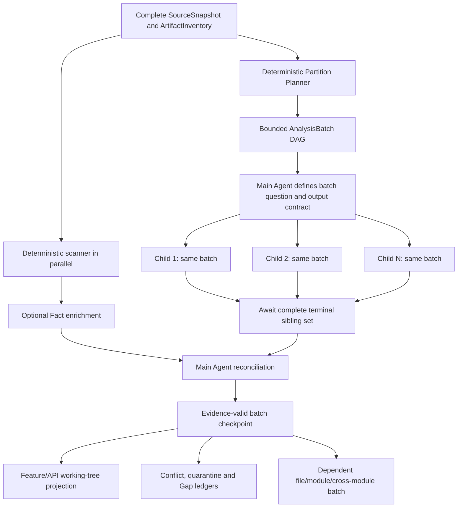
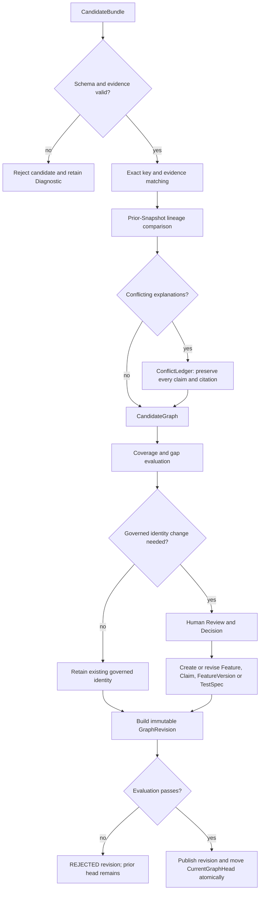

> Language: **English** · [简体中文](workspace-scan-and-analysis-lifecycle.zh-CN.md)

---
feature_ids: [F001, F006]
related_features: [F002, F003, F004, F006]
topics:
  - workspace
  - source-scan
  - analysis-run
  - checkpoint
  - pause-resume
  - browser-refresh
doc_kind: feature-design
created: 2026-07-29
updated: 2026-08-29
status: superseded
priority: P0
---

# Historical: Workspace Scan and Analysis Agent Lifecycle

> **Historical reference only.** This design is superseded by the F001–F004 evidence-first redesign in the [active F001 specification](F001-legacy-system-understanding.md) and [product architecture](../architecture/traqen-product-architecture.md). It remains only for implementation-history compatibility; it is not an active contract.

## 1. Requirement

The Workspace flow is one user-visible job with two separately checkpointed execution stages:

1. **SourceScanRun** seals an immutable source Snapshot, extracts deterministic per-file facts, resolves cross-file relations, and commits a `FactBundle`.
2. **AnalysisRun** plans bounded Agent/Skill `WorkUnit`s from the complete `SourceSnapshot` and `ArtifactInventory`, reads authorized source slices directly, and may use deterministic Facts as an independent reference while materializing Candidate projections.

The parent job then owns reconciliation, evaluation, graph projection, and publication. These orchestration phases do not collapse SourceScanRun and AnalysisRun into one checkpoint stream.

The parent **WorkspaceAnalysisJob** is the only task exposed to the user. The browser may create commands and observe state, but it never owns a scanner, model executor, pause flag, run clock, or authoritative status.

Refreshing, closing, reopening, disconnecting, or attaching multiple browser tabs must not change job state.

## 2. Confirmed gap

The current implementation moved only model analysis to the API. Source preparation still runs inside
`WorkspaceAnalysisView.scanWorkspace()`:

- directory handles, file lists, cursors, batches, and `scanning` state belong to the page process;
- the server `AnalysisRun` does not exist until every file has been scanned and the browser submits derived observations;
- unmounting the page destroys the only scan executor;
- IndexedDB preserves checkpoints but cannot keep execution alive;
- the previous design explicitly allowed `SCANNING + refresh → INTERRUPTED`.

The earlier acceptance covered refresh only after creation of a server `AnalysisRun`. It did not test the scan stage and is not acceptance evidence for this requirement.

## 3. Terminal architecture

```text
User
  │ Start / Pause / Resume / Cancel
  ▼
WorkspaceAnalysisJob                         ← the only user-visible task
  │
  ├─ SourceRegistration                      ← explicitly authorized source
  │    └─ SourceSnapshot                     ← immutable input for this job
  │         └─ SourceScanRun                  ← server-owned per-file work
  │              └─ FactBundle               ← Snapshot-bound Facts
  │
  └─ AnalysisRun                             ← server-owned Agent/Skill WorkUnits
       └─ CandidateBundles
            └─ CandidateReconciliation
                 └─ EvaluationRun
                      └─ GraphRevision projection
                           └─ atomic publication → CurrentGraphHead

BrowserSubscription                          ← non-authoritative read pointer
```

The API persists the job ID before returning `202 Accepted`. SourceScanRun and AnalysisRun have separate checkpoints and progress, but remain linked by one job and one source Snapshot.

Only an explicit user command can manually pause a job. A crashed worker or restarted API automatically re-leases work from the last committed checkpoint when `desiredState=RUNNING`.

### 3.1 End-to-end understanding logic

Traqen deliberately separates observation, interpretation, reconciliation, governance, and publication:

| Layer | Input | Output | Authority |
|---|---|---|---|
| deterministic scanner | immutable source Snapshot | ArtifactInventory, Facts, deterministic relations | may state what is present in the Snapshot |
| Analysis Agent / Skills | authorized Facts and bounded source slices | evidence-backed Candidates | may propose semantic interpretations |
| reconciliation | Facts, Candidates, prior lineage | CandidateGraph, conflict/coverage ledgers, lineage | may match and compare; may not assign governed identity |
| review and Decision | reconciled Candidates and evidence | governed Feature, Claim, FeatureVersion, TestSpec decisions | the only path that creates or changes business authority |
| evaluation and publication | candidate graph, decisions, evidence, gaps | immutable GraphRevision and atomic CurrentGraphHead update | may publish only a revision that passes policy |

Neither a path name, a model response, a similarity score, nor a deterministic hash may create or merge a governed `Feature.id`.

The earlier overall functional-architecture diagram was removed with the superseded module plan. This historical document's candidate, decision, evaluation, quarantine, and publication discussion is retained only as prior implementation context, not as an active visualization or contract.

### 3.2 Scanner algorithm: source to deterministic Facts

Given a project such as an order service, the scanner executes four logical steps:

1. **Authorize and freeze the input.** `SourceRegistration` proves that the runner may read the root. Files are copied into a content-addressed Snapshot spool with relative path, content hash, size, media type, detected language, and scanner/policy versions. A source change during the run belongs to the next Snapshot.
2. **Seal the full inventory.** Every in-scope artifact receives an explicit disposition: `INCLUDED`, `EXCLUDED_BY_POLICY`, `UNSUPPORTED`, `GENERATED`, `BINARY`, `OVERSIZED`, `SECRET_REDACTED`, or `READ_FAILED`. Before manifest seal, the denominator is unknown; after seal, coverage is measured against the exact inventory rather than only successfully parsed files.
3. **Run versioned deterministic extractors.** Code yields modules, symbols, imports, calls, endpoints, jobs, and commands; schemas and migrations yield data objects and reads/writes; configuration yields keys and consumers without secret values; documents yield addressable requirement/design passages; tests yield cases, assertions, fixtures, and implementation links; result files yield execution identities and metadata.
4. **Resolve cross-file relations and commit.** The resolver links routes to handlers, calls to symbols, tests to implementation, configuration to consumers, and code to data objects. `SnapshotManifest + FactBundle` commit atomically. Each Fact retains Workspace, Snapshot, source span/content hash, extractor identity/version, a stable entity identity, and an immutable Snapshot-local Fact identity.

For example, the deterministic layer may produce:

```text
POST /orders
  └─ IMPLEMENTED_BY → OrderController.submitOrder
       └─ CALLS → OrderService.createOrder
            └─ WRITES → orders

order-submit.test.js
  └─ EXERCISES → OrderService.createOrder

ORDER_SUBMIT_ENABLED
  └─ CONSUMED_BY → OrderService.createOrder
```

This proves observable structure. It does not yet prove that the structure is the governed business feature “Submit order.”

### 3.3 Analysis Agent algorithm: the complete Snapshot to semantic Candidates

The Agent's task universe is the complete immutable `SourceSnapshot`, not the scanner's successful outputs. Every ArtifactInventory row must end in exactly one base-coverage outcome:

- directly read by a source-analysis WorkUnit;
- consumed by a declared specialist for binary/generated/result content; or
- retained with an explicit excluded, unsupported, policy, secret, size, or read-failure disposition/Gap.

Scanner Facts are a parallel, optional enrichment input. A missing Symbol, Endpoint, or relation Fact must not remove the corresponding source Artifact from the Agent plan. “Analyze every file” therefore means complete, auditable visitation across many bounded WorkUnits; it never means placing the whole repository into one prompt.

The [interactive Workspace analysis workflow](../diagrams/traqen-product-architecture/workspace-analysis-batch.workflow.html)
expands deterministic partitioning, same-batch Child
fan-out, Workspace-scoped capability routes, bounded source reads, hierarchical
synthesis, Main Agent reconciliation, and explicit quarantine/gap paths. Its
[Archify JSON source](../diagrams/traqen-product-architecture/workspace-analysis-batch.workflow.json)
is the reproducible visual projection of the algorithm below.

#### 3.3.1 How Inventory partitions are derived

The planner builds an immutable `UnderstandingPlan` directly from ArtifactInventory and Snapshot source metadata. It does not read scanner Candidate output, governed Features, or the Truth Set.

Partitioning is deterministic and ordered:

1. **Project boundaries:** detect workspace/package/build roots from source manifests such as `package.json`, workspace files, Maven/Gradle descriptors, solution/project files, module files, and repository configuration. An unrecognized repository still receives one root boundary rather than disappearing.
2. **Artifact lanes:** assign every row to source, document/contract, API/schema, data/migration, configuration, test, build/result, binary/generated, or unknown. This routing uses content type, declared manifest structure, and versioned convention rules—not a scanner-produced business feature.
3. **Locality groups:** group artifacts by project boundary, language/toolchain, module/subtree, declared package membership, and direct manifest/import-header relationships. A lightweight planner structural index may read manifests and import headers, but it does not create Facts or semantic Candidates.
4. **Budget shards:** pack each locality group under the selected execution profile's input budget. Small related files stay together. A large file is split at versioned syntax/document boundaries into stable line/range slices with bounded overlap, followed by one file-level synthesis unit.
5. **Cross-cutting roots:** add explicitly overlapping WorkUnits for entrypoints, public interfaces, workflows, configuration consumers, tests, documents, and known change frontiers. These do not replace the disjoint base-coverage partitions.

```ts
type UnderstandingPlan = {
  id: string;
  snapshotManifestId: string;
  plannerVersion: string;
  conventionRegistryVersion: string;
  executionProfileId: string;
  partitions: Array<{
    id: string;
    kind: "BASE_COVERAGE" | "CROSS_CUTTING" | "FOLLOW_UP";
    lane: string;
    projectBoundaryId: string;
    artifactIds: string[];
    sourceRanges: Array<{ artifactId: string; startLine?: number; endLine?: number }>;
    dependencyPartitionIds: string[];
    requiredCapabilities: string[];
    languages: string[];
    estimatedInputTokens: number;
    riskClass: "STANDARD" | "HIGH";
  }>;
  coverage: {
    inventoryArtifactCount: number;
    directlyAssignedCount: number;
    specialistAssignedCount: number;
    explicitDispositionOrGapCount: number;
    unassignedCount: 0;
  };
};
```

The three assigned counts plus `unassignedCount` must equal `inventoryArtifactCount`; one Artifact has one base disposition even when its SourceRanges use bounded overlap. Every base partition has a stable ID derived from Snapshot, planner/convention versions, lane, ordered Artifact/range identities, and policy digest. Replanning the same Snapshot under the same policy must produce the same partitions. A changed planner, model/Skill route, or source range creates a new input digest and cannot silently reuse an incompatible result.

#### 3.3.2 How WorkUnits execute

An `UnderstandingPlan` becomes a persisted dependency DAG of bounded `AnalysisBatch` records. The DAG controls repository scale; the Workspace execution profile controls a logical Agent roster consisting of one Main Agent and at least two enabled, complete Child Agents. These are separate dimensions: adding batches changes throughput and context size, while adding Child slots above the lower bound changes independent corroboration.



The DAG runs in layers:

1. **Batch formation:** the deterministic planner turns each base, cross-cutting, follow-up, or synthesis partition into an immutable `AnalysisBatch`. It, not an LLM, proves total Inventory disposition.
2. **Main planning:** the Main Agent adds the semantic question, focus, allowed tools, and exact output contract without changing the batch's authorized source scope or silently dropping Artifacts.
3. **Same-batch fan-out:** the scheduler creates one `ChildWorkUnit` per active Child slot. Every sibling receives the same `analysisBatchId`, SourceSlice set, optional Fact set, task statement, and output schema. Each uses its own pinned model/Skill/MCP route and cannot see sibling output or private reasoning before committing.
4. **Completion barrier:** reconciliation begins only when every required sibling is terminal. Success, explicit `NO_ELIGIBLE_PRODUCER`, timeout, budget Gap, and policy refusal are all terminal outcomes; missing output is never treated as agreement.
5. **Main reconciliation:** the Main Agent compares the sibling outputs with deterministic Facts and prior lineage. A deterministic validator independently enforces schema, evidence scope, citation existence, confidence caps, and forbidden governed fields.
6. **Checkpoint and projection:** only validated reconciliation output may update the Feature/API working tree. Raw Child output and unconstrained Main prose cannot mutate it. Conflicts, rejected evidence, and unknowns remain visible in ledgers.
7. **Hierarchical continuation:** validated leaf batches unlock file/module batches; those unlock cross-module, contradiction, missing-relation, and project-synthesis batches. Every such batch repeats the same roster fan-out and reconciliation protocol.

```ts
type AnalysisBatch = {
  id: string;
  workspaceId: string;
  analysisRunId: string;
  executionProfileRevisionId: string;
  partitionId: string;
  stage: "LEAF" | "FILE" | "MODULE" | "CROSS_MODULE" | "CHALLENGE" | "PROJECT_SYNTHESIS";
  dependencyBatchIds: string[];
  artifactIds: string[];
  sourceRanges: Array<{ artifactId: string; startLine?: number; endLine?: number }>;
  optionalFactIds: string[];
  taskStatement: string;
  outputSchemaId: string;
  requiredChildSlotIds: string[];
  inputDigest: string;
};
```

Each ChildWorkUnit persists the batch input digest, child slot and exact model/Skill/MCP revisions, attempts, budget, structured result, evidence references, and terminal reason. Ready batches execute in parallel under worker and provider quotas; siblings within a batch may also execute concurrently. Scheduling is at-least-once, while commits are idempotent by `(analysisBatchId, childSlotId, inputDigest)`. A Main reconciliation checkpoint is idempotent by the ordered complete sibling-output digest.

During execution, reconciliation may enqueue a bounded `FOLLOW_UP` batch for an unresolved call, undocumented interface, unclear test, unknown configuration consumer, contradiction, or missing relation. Follow-up depth and total budget are fixed by policy; reaching either limit records `UNEXPLORED_BUDGET_LIMIT`.

#### 3.3.3 Model and Skill routing

The current `AnalysisModelProfile` proves transport configuration and credential readiness. It is not sufficient evidence that a model can analyze every language, artifact type, or reasoning role. The F001 target adds a versioned capability/calibration declaration separate from credentials:

```ts
type ModelCapabilityProfile = {
  id: string;
  analysisModelProfileId: string;
  modelRevision: string;
  roles: Array<"MAIN_PLANNER" | "MAIN_RECONCILER" | "SOURCE_READER" | "MODULE_SYNTHESIS" | "CROSS_MODULE_REASONING" | "CRITIC">;
  languages: string[];
  artifactKinds: string[];
  structuredOutputSchemas: string[];
  maxContextTokens: number;
  dataBoundaryClasses: Array<"FACTS_ONLY_EXTERNAL" | "RAW_SOURCE_LOCAL" | "RAW_SOURCE_PRIVATE_RUNNER">;
  calibrationPolicyVersion: string;
  qualityTierByRole: Record<string, string>;
  independenceGroup: string;
  costClass: string;
};
```

Signed Skill registrations already declare capabilities, language/framework compatibility, input/output schemas, permissions, model policy, cost class, and incremental support. The target input contract distinguishes two kinds of Skill:

- a **direct-source Skill** requires `PROJECT_SNAPSHOT` and receives SourceSlices; `CODE_FACT_BUNDLE` is optional enrichment;
- a **Fact-dependent Skill** explicitly requires the relevant FactBundle.

This changes the current baseline, where Reverse Skills require both `PROJECT_SNAPSHOT` and `CODE_FACT_BUNDLE`.
Direct-source WorkUnits require a `RAW_SOURCE_LOCAL` or `RAW_SOURCE_PRIVATE_RUNNER` producer route. An external model declared `FACTS_ONLY_EXTERNAL` may process policy-filtered Facts but never raw SourceSlices. If no in-boundary producer is eligible, analysis records `NO_ELIGIBLE_PRODUCER`.

F006 separates global model assets from capability catalogs. Main and Child slots explicitly select revisioned API/allowlisted-CLI model profiles. Built-in Skill/MCP catalogs are read-only, Workspace project entries override by typed `(kind, normalizedName)`, and disabled keys apply after overlay. Validation and activation materialize an immutable `WorkspaceExecutionProfileRevision`. Runtime receives only that revision and scoped grants; it has no mutable registry handle through which an Agent can discover or invoke a disabled, ungranted, or unmaterialized capability.

For the Main slot and each Child slot on every AnalysisBatch, a deterministic Capability Router intersects:

- required role/capabilities, languages, artifact kinds, context size, and risk class;
- verified ModelCapabilityProfiles;
- allowed, version-pinned Skill manifests;
- source data boundary and tenant policy;
- run quality, cost, deadline, concurrency, and redundancy policy.

It persists an `AnalysisRouteDecision` containing the Workspace profile revision, agent slot, eligible producers, selected route, rejected routes with reason codes, exact model/Skill/MCP versions, calibration version, independence group, and budgets. No model selects itself, no unverified profile is used, and a missing eligible producer becomes that slot's explicit `NO_ELIGIBLE_PRODUCER` outcome rather than an invisible generic fallback.

The initial role/Skill routing baseline is:

| WorkUnit role | Model profile must prove | Typical registered Skill capabilities | Primary evidence |
|---|---|---|---|
| `MAIN_PLANNER` | bounded planning, contract adherence, complete-scope preservation, and Gap honesty | `ANALYSIS_PLANNING`, `CONVENTION_INTERPRETATION` | AnalysisBatch, Inventory coverage, dependencies, Workspace conventions |
| `MAIN_RECONCILER` | multi-output comparison, source-grounded contradiction detection, conservative confidence, and no-majority behavior | `REVERSE_REVIEW`, `EVIDENCE_RECONCILIATION`, domain capabilities required by the batch | complete sibling set, raw evidence, deterministic Facts, historical lineage |
| `SOURCE_READER` | language/artifact support, schema adherence, source grounding, bounded-context behavior, and local/private raw-source eligibility | `ARCHITECTURE_REVERSE`, `BUSINESS_RULE_MINING`, `DATA_SEMANTICS`, `CONFIGURATION_ANALYSIS`, `TEST_INVENTORY_REVIEW` | raw SourceSlices; optional Facts |
| `MODULE_SYNTHESIS` | long-context synthesis without citation loss and calibrated relation precision | `FEATURE_DISCOVERY`, `ARCHITECTURE_REVERSE`, `DOMAIN_MODELING`, `BUSINESS_RULE_MINING` | leaf outputs plus selected SourceSlices/Facts |
| `CROSS_MODULE_REASONING` | cross-file graph/workflow/state reasoning and calibrated missing-relation recall | `FEATURE_DISCOVERY`, `STATE_MACHINE_RECOVERY`, `PERMISSION_ANALYSIS`, `DATA_SEMANTICS`, `CONFIGURATION_ANALYSIS`, `TEST_DESIGN`, `RUNTIME_CORRELATION`, `CHANGE_IMPACT` | module Candidates/evidence index plus selected SourceSlices/Facts |
| `CRITIC` | high evidence-verification precision, contradiction detection, and a different independence group from the primary | `REVERSE_REVIEW` plus the challenged domain capability | Candidate, raw evidence, route/calibration provenance; no private primary reasoning |

The design intentionally does not hard-code a vendor model name. For every role/language/risk cell, a versioned calibration suite measures schema validity, source-grounding precision, required/forbidden relation accuracy, context-degradation behavior, Gap honesty, secret/data-boundary compliance, latency, and cost. Only a passing model revision can become the primary or critic for that cell; a new revision begins unverified. Thus “which model” is an auditable deployment decision backed by observed fitness, not an unchecked configuration string.

#### 3.3.4 Large repositories and multiple models

A full run is one durable `AnalysisRun`, not one model request. Scale comes from bounded hierarchical decomposition and parallelism:

- leaf WorkUnits spread across workers and provider quotas;
- large files become stable source ranges and file synthesis;
- module results feed cross-module units;
- unchanged input-digest results are reusable across recovery and later incremental Snapshots;
- global synthesis sees bounded Candidate/evidence indexes plus selected SourceSlices, never every raw file at once;
- completion requires `unassignedCount=0`, terminal state for every required WorkUnit, and every unsupported/budget-limited region represented as a Gap.

Multiple models are supported through the Workspace roster, but never as an uncontrolled vote:

1. **Batch parallelism:** many bounded batches run concurrently subject to worker, provider, cost, and source-broker quotas.
2. **Same-batch corroboration:** every active Child slot analyzes every batch. The default roster has two Child slots; a Workspace may add more. A Child may use Claude, Codex, Kimi, another calibrated model, or a local deterministic producer, but all receive the identical batch contract.
3. **Independent execution:** each Child has a distinct slot identity and pinned route. `independenceGroup` records correlated model/prompt families, and siblings cannot read one another's outputs before the completion barrier.
4. **Hierarchical reduction:** leaf evidence becomes reconciled file/module indexes; later batches use those bounded indexes plus selected raw SourceSlices. No request contains the whole repository.
5. **Evidence reconciliation:** deterministic validation and the Main Agent compare citations, scopes, constraints, omissions, and contradictions against static Facts and history. Correlated agreement is labelled as such and does not count as independent proof.

Agreement may raise corroboration only within calibrated evidence caps. Disagreement is preserved in ConflictLedger; majority count never creates truth or governed identity. Evidence-untrusted claims are quarantined rather than admitted or silently discarded. An unresolved high-risk conflict goes to human Review/Decision.

#### 3.3.5 Candidate output contract

The output is a structured `CandidateBundle`, not a free-form summary:

```text
CandidateFeature: "Submit order"
CandidateClaim: "Only DRAFT orders may be submitted"
CandidateRelation:
  Submit order IMPLEMENTED_BY OrderService.createOrder
  Submit order EXPOSED_BY POST /orders
  Submit order CONFIGURED_BY ORDER_SUBMIT_ENABLED
CandidateTestIntent:
  order-submit.test.js may exercise "Only DRAFT orders may be submitted"
```

Every Candidate carries raw SourceSlice and/or Fact evidence, Snapshot and WorkUnit identity, producer/model/Skill version, route/calibration provenance, per-dimension confidence, deterministic confidence caps, uncertainty, and alternative explanations. A deterministic validator rejects out-of-scope, cross-Workspace, cross-Snapshot, missing, duplicate, or fabricated evidence; strips forbidden governed IDs/fields; and caps confidence to what the evidence supports.

### 3.4 Reconciliation algorithm: preserve identity uncertainty

Reconciliation is not name-based deduplication. It runs the following gates in order:

1. validate Candidate schema, endpoints, evidence scope, SourceSlice authorization, and confidence caps;
2. match exact stable Candidate keys, shared Facts/source slices, explicit API/document/symbol references, constraints, and scope;
3. compare with the prior Snapshot and classify observed Candidate lineage as `NEW`, `UNCHANGED`, `BUSINESS_SEMANTICS_CHANGED`, `IMPLEMENTATION_REMAPPED`, or `EVIDENCE_REFRESHED`; place a prior Candidate that is no longer observed under `candidateAbsences` with disposition `NO_CURRENT_OBSERVATION`;
4. propose duplicate, parent/child, split, merge, or existing-Feature mappings without applying them;
5. preserve contradictory document, implementation, and test claims in `ConflictLedger`;
6. prove inventory/WorkUnit/evidence coverage and unresolved gaps in `CoverageLedger`.



The reconciliation result consists of `CandidateGraph`, `ConflictLedger`, `CoverageLedger`, and `CandidateLineage`. A Candidate remains `PENDING_REVIEW` with no governed Feature ID until an authorized Decision accepts, rejects, links, splits, merges, or classifies it.

### 3.5 Graph projection, publication, and incremental evolution

A `GraphRevision` materializes one coherent view of SnapshotManifest/ArtifactInventory, Facts, reconciled Candidates and ledgers, governed Features/Claims/Decisions/TestSpecs, test executions and Evidence, ChangeSet/ImpactAssessment, and explicit gaps. All nodes and edges retain Snapshot, producer, evidence, decision, status, version, and time provenance.

Publication is fail-closed:

```text
BUILDING → EVALUATING → PUBLISHED
                     ↘ REJECTED
```

Publishing the immutable revision and moving `CurrentGraphHead` are one transaction. On scan, reconciliation, evaluation, or publication failure, the failed revision and diagnostics remain queryable while the prior head continues serving every Feature Tree, API Tree, TraceChain, impact, coverage, conflict, and quality projection.

The first successful project analysis must be `FULL`. A later `INCREMENTAL` run compares ArtifactInventories, invalidates affected Facts, resolves the changed relation frontier, reruns WorkUnits whose evidence or producer changed, reuses unchanged Candidate lineage, emits a ChangeSet, computes impacted Features/Claims/TestSpecs, creates an ImpactAssessment and revalidation plan, and publishes a new GraphRevision only after evaluation passes. Implementation movement alone updates mappings and history; only a governed business-definition Decision creates a new FeatureVersion.

### 3.6 Current implementation boundary

This section defines the F001 target, not a claim that every component already exists. Current code has deterministic JavaScript/Java and partial OpenAPI/SQL/config/test scanning, SnapshotManifest and FactBundle relations, bounded Fact-rooted Analysis WorkUnits and Candidate validation, one global active model profile plus optional version-pinned Skills, a planning/UI shape fixed to three child slots that does not drive same-batch server execution, a separate hard-coded local deterministic understanding runtime, incremental Candidate lineage, governed Feature/Claim/Decision/TestSpec/Evidence objects, and graph/trace projections.

F001 still requires the canonical server-owned Workspace aggregate and switch context, immutable Workspace-only execution profiles, one unified analysis runtime, complete server-owned SourceScanRun, multilingual canonical-scanner parity, complete ArtifactInventory, scanner-independent raw-source base coverage, deterministic UnderstandingPlan/partition coverage, same-batch ChildWorkUnit scheduling with a default-two configurable roster, Main planning/reconciliation, direct-source Skill inputs, SourceSlice Broker, complete-set reconciliation and its ledgers, EvaluationRun/GraphRevision/CurrentGraphHead publication, and the two-Snapshot “Traqen analyzes Traqen” acceptance.

## 4. User journey

### First run

1. Create a Workspace.
2. Register a source directory through the Local Runner. The API returns an opaque `sourceRegistrationId` and does not expose the canonical absolute path through normal reads.
3. Select a model profile and click Start.
4. Receive a stable `jobId` immediately.
5. Observe the server building a SourceSnapshot and executing SourceScanRun.
6. Observe the server transition to AnalysisRun after the FactBundle commits.
7. On the first project run, evaluate and publish the FULL GraphRevision. On later Snapshots, evaluate the INCREMENTAL revision and atomically move CurrentGraphHead only after it passes.

### Refresh and reconnect

At any stage, the user may refresh or close the browser. The server continues. Reopening the page loads the subscription and performs `GET` for the same `jobId`. Mount, refresh, reconnect, and polling never call Start, Pause, Resume, or Cancel.

### Manual pause and resume

Pause first persists `PAUSE_REQUESTED`. The worker commits the current atomic unit and transitions to `PAUSED`. Refresh preserves that state. Resume reuses the same job, source Snapshot, scan run, and analysis run, while skipping completed file and Agent WorkUnits.

## 5. Lifecycle objects

### Workspace and current context

```ts
type Workspace = {
  id: string;
  displayName: string;
  status: "ACTIVE" | "DELETION_PENDING" | "DELETED";
  currentGraphHeadId: string | null;
  createdAt: string;
  updatedAt: string;
};

type CurrentWorkspaceContext = {
  actorId: string;
  workspaceId: string;
  version: number;
  selectedAt: string;
};

type WorkspaceViewPreference = {
  actorId: string;
  workspaceId: string;
  visible: boolean;
};
```

Show/hide changes only `WorkspaceViewPreference`; it never deletes the Workspace. Delete is an explicit audited lifecycle. Every command, query, subscription, cache key, and persisted analysis object carries `workspaceId`. UI responses are accepted only when their Workspace context version matches the current selection.

### WorkspaceExecutionProfileRevision

```ts
type AgentSlot = {
  id: string;
  role: "MAIN" | "CHILD";
  modelProfileRevisionId: string;
  modelCapabilityProfileId: string;
  skillRevisionIds: string[];
  mcpGrantRevisionIds: string[];
  independenceGroup: string;
  policyRevisionId: string;
};

type WorkspaceExecutionProfileRevision = {
  id: string;
  workspaceId: string;
  revision: number;
  mainAgentSlot: AgentSlot;
  childAgentSlots: AgentSlot[]; // length >= 2
  dependencyPolicyRevisionId: string;
  conventionRevisionId: string;
  resolvedSkillRevisionIds: string[];
  resolvedMcpGrantRevisionIds: string[];
  builtinCatalogRevisionIds: string[];
  projectCapabilityRevisionIds: string[];
  disabledCapabilityKeysDigest: string;
  digest: string;
  createdAt: string;
};
```

The resolver pins selected global model revisions, overlays built-in/project capabilities by typed key, applies disabled keys, validates Agent grants and policies, and stores exact provenance. The result is immutable and is the only capability set mounted into a Run. Editing or activating later Workspace settings does not mutate an active or paused Run; Resume reuses its pinned revision.

### SourceRegistration

Represents a server-authorized source locator.

```ts
type SourceRegistration = {
  id: string;
  workspaceId: string;
  connectorKind: "LOCAL_FILESYSTEM";
  displayName: string;
  canonicalRootRef: string; // private/encrypted; not returned by normal read APIs
  policyVersion: string;
  status: "ACTIVE" | "REVOKED";
  createdAt: string;
  updatedAt: string;
};
```

Registration rules:

- canonicalize `rootPath` with `realpath` and require it to be below an operator-configured allowlist;
- reject the filesystem root, the home root, device files, sockets, and symlink escape;
- keep the absolute canonical root private and out of normal read APIs;
- make revocation prevent new jobs without rewriting historical Snapshots.

### SourceSnapshot

```ts
type SourceSnapshot = {
  id: string;
  workspaceId: string;
  sourceRegistrationId: string;
  manifestDigest: string;
  scannerVersion: string;
  policyVersion: string;
  fileCount: number;
  totalBytes: number;
  status: "BUILDING" | "SEALED" | "FAILED";
  createdAt: string;
  sealedAt: string | null;
};
```

A sealed Snapshot is immutable. Source changes during the run are visible only to a later job and Snapshot.

### SourceScanRun

```ts
type SourceScanRun = {
  id: string;
  jobId: string;
  workspaceId: string;
  sourceSnapshotId: string;
  status:
    | "QUEUED" | "RUNNING" | "PAUSE_REQUESTED" | "PAUSED"
    | "COMPLETED" | "COMPLETED_WITH_GAPS" | "FAILED" | "CANCELLED";
  phase: "DISCOVERY" | "SNAPSHOTTING" | "EXTRACTION" | "RELATION_RESOLUTION" | "FACT_COMMIT";
  plannedFileCount: number | null;
  completedFileCount: number;
  failedFileCount: number;
  leaseOwnerId: string | null;
  leaseToken: number;
  leaseExpiresAt: string | null;
  updatedAt: string;
};
```

A scan WorkUnit has the deterministic identity:

```text
hash(sourceSnapshotId + relativePath + contentHash + scannerVersion + policyVersion)
```

Completed units are skipped on recovery.

### AnalysisRun

The canonical AnalysisRun remains the Agent owner. It may start only after a complete FactBundle exists for the same Workspace and Snapshot.

Every Analysis WorkUnit must preserve these boundaries:

- `evidenceFactIds` belong to the target WorkUnit;
- Facts belong to the same Workspace and Snapshot;
- model confidence does not exceed deterministic evidence caps;
- completed WorkUnits do not call the model or Skill again during recovery.

### WorkspaceAnalysisJob

```ts
type WorkspaceAnalysisJob = {
  id: string;
  workspaceId: string;
  executionProfileRevisionId: string;
  sourceRegistrationId: string;
  sourceSnapshotId: string | null;
  scanRunId: string | null;
  analysisRunId: string | null;
  candidateGraphId: string | null;
  evaluationRunId: string | null;
  graphRevisionId: string | null;
  requestedMode: "FULL" | "INCREMENTAL" | "AUTO";
  desiredState: "RUNNING" | "PAUSED" | "CANCELLED";
  status:
    | "QUEUED" | "RUNNING" | "PAUSE_REQUESTED" | "PAUSED"
    | "RECOVERING" | "COMPLETED" | "COMPLETED_WITH_GAPS"
    | "FAILED" | "CANCELLED";
  phase:
    | "SOURCE_SCAN"
    | "FACT_COMMIT"
    | "ANALYSIS"
    | "RECONCILIATION"
    | "EVALUATION"
    | "PROJECTION"
    | "PUBLISHING";
  createdAt: string;
  updatedAt: string;
  completedAt: string | null;
};
```

Browser connection state is not job state. `CONNECTED / RECONNECTING / OFFLINE` is a client-only projection and may never overwrite the server job.

Mode resolution is deterministic: when the Workspace has no `CurrentGraphHead`, `AUTO` resolves to `FULL` and explicit `INCREMENTAL` is rejected. Once a head exists, `AUTO` resolves to `INCREMENTAL`; an operator may still force `FULL`. Mode resolution is persisted before work starts and cannot change during Resume.

### BrowserSubscription

IndexedDB stores only:

- `workspaceId`;
- `jobId`;
- the last observed version and timestamp.

The subscription is a non-authoritative pointer. It does not store authoritative `RUNNING` state, scan checkpoints, Facts, or Candidates.

## 6. State transitions

### 6.1 WorkspaceAnalysisJob

| Current | Event | Next | Rule |
|---|---|---|---|
| absent | Start | `QUEUED` | Persist before `202` |
| `QUEUED` | worker lease | `RUNNING` | Start SourceScanRun |
| `RUNNING` | explicit Pause | `PAUSE_REQUESTED` | Persist desired state |
| `PAUSE_REQUESTED` | atomic unit committed | `PAUSED` | Stop leasing new work |
| `PAUSED` | explicit Resume | `QUEUED` | Same job and Snapshot |
| `RUNNING` | lease expires | `RECOVERING` | Not a manual pause |
| `RECOVERING` | new worker lease | `RUNNING` | Resume from checkpoint |
| `RUNNING` | all phases finish | terminal success | Persist result and immutable output references |
| non-terminal | explicit Cancel | `CANCELLED` | Never auto-resume |
| any | refresh/offline/GET | unchanged | No side effect |

### 6.2 Phase transitions

| Current phase | Committed event | Next phase or state |
|---|---|---|
| `SOURCE_SCAN` | all scan WorkUnits complete | `FACT_COMMIT` |
| `FACT_COMMIT` | SnapshotManifest and FactBundle committed | `ANALYSIS` |
| `ANALYSIS` | all required CandidateBundles committed | `RECONCILIATION` |
| `RECONCILIATION` | CandidateGraph, ConflictLedger, CoverageLedger, and lineage committed | `EVALUATION` |
| `EVALUATION` | EvaluationRun passes | `PROJECTION` |
| `EVALUATION` | EvaluationRun rejects the revision | terminal gap/failure; keep the prior `CurrentGraphHead` |
| `PROJECTION` | immutable GraphRevision materialized | `PUBLISHING` |
| `PUBLISHING` | GraphRevision becomes `PUBLISHED` and CurrentGraphHead moves atomically | `COMPLETED` / `COMPLETED_WITH_GAPS` |

These phases are the authoritative F001 execution pipeline. Phase transitions and their output references commit atomically. A job cannot enter Analysis without a committed FactBundle, enter Evaluation without reconciliation ledgers, or complete without a published-or-rejected GraphRevision result.

## 7. Scan checkpoints

SourceScanRun executes:

1. **DISCOVERY** — enumerate an ordered manifest below the authorized root.
2. **SNAPSHOTTING** — write content-addressed blobs and fixed content hashes.
3. **EXTRACTION** — extract per-file deterministic Facts.
4. **RELATION_RESOLUTION** — resolve imports, calls, tests, and other cross-file links.
5. **FACT_COMMIT** — atomically persist SnapshotManifest and FactBundle.

Each file or bounded batch commits atomically. A crash may repeat at most one uncommitted unit. Deterministic IDs make retries idempotent. A `RUNNING` scan must have a valid worker lease.

Scan outcomes are classified rather than collapsed:

- `SKIPPED` for an explicit policy disposition that remains in the inventory denominator;
- retryable `FAILED` for a file/batch failure that preserves its diagnostic and attempt count;
- fatal source-root/authorization failure, which fails the scan without pretending the remaining inventory was examined.

Before the manifest is sealed, `plannedFileCount` is `null` and the UI states that the denominator is still being discovered. After seal it is exact; progress must never display an estimated count as a complete denominator.

## 8. Scanner parity gate

The current browser scanner supports more languages than the server `JavaScriptProjectScanner`. Server migration may not reduce product capability.

Before cutover, the canonical scanner must retain the current visible support for JavaScript/TypeScript/JSX/TSX, Java, Python, Go, C#, Rust, OpenAPI, commands, configuration, and test clues.

A shared multilingual fixture suite must compare:

- file coverage;
- Fact/Candidate types and counts;
- stable IDs and source locations;
- secret redaction;
- test-to-implementation links;
- diagnostics.

The browser execution path cannot be removed until required parity is 100%.

## 9. Analysis recovery

- The AnalysisRun is pinned to the job's SourceSnapshot and FactBundle.
- It is also pinned to one immutable WorkspaceExecutionProfileRevision; Resume cannot silently pick newer global or Workspace configuration.
- Pause may abort an in-flight Child or Main model request, but that unit returns to `QUEUED` and is not recorded as complete.
- A committed ChildWorkUnit result or Main reconciliation checkpoint is never recomputed for the same input digest.
- A partially completed sibling set remains durable; Resume schedules only missing Child slots and does not expose committed sibling output to them.
- Resume keeps the same AnalysisRun.
- Retry exhaustion follows an explicit gap/pause policy and never loops indefinitely.

## 10. Leases and idempotency

- Start uses a stable idempotency key/job ID.
- Duplicate Start returns the existing job.
- One valid worker lease exists per job.
- A monotonically increasing lease token fences stale workers.
- Repeated Pause/Resume commands are idempotent.
- Scheduling is at-least-once; result commit is exactly-once.
- After restart, running jobs auto-recover, manually paused jobs stay paused, and cancelled jobs never resume.

## 11. Security boundary

### 11.1 Deployment capability modes

| Mode | Source access | Rule |
|---|---|---|
| `LOCAL_SINGLE_TENANT` | API and Runner are co-located and read allowlisted local source | permits `LOCAL_FILESYSTEM` registration |
| `PRIVATE_RUNNER` | runner stays beside private source and receives work over mutually authenticated/outbound transport | raw source remains at the source boundary |
| `CLOUD_CONTROL_PLANE` | control plane cannot read a browser-local path | requires Private Runner or governed Remote Git Connector; direct local registration is disabled |

The first implementation delivers `LOCAL_SINGLE_TENANT`. `SourceRegistration` records connector kind, capability version, and policy version so later connectors do not change Snapshot or graph semantics.

### 11.2 Common boundaries

- `TRAQEN_ALLOWED_WORKSPACE_ROOTS` is required for local registrations.
- Canonical `realpath` checks apply to the root and every file.
- Filesystem root, home root, symlink escape, device files, sockets, FIFOs, and non-regular files are rejected.
- Normal read APIs and logs do not reveal absolute paths, source bodies, secrets, or unredacted `.env` values.
- Raw source enters only the local/private Snapshot spool, scanner, SourceSlice Broker, and explicitly eligible in-boundary Analysis Workers/Skills.
- External models receive bounded, policy-filtered Facts, never raw source or unredacted secrets.
- Snapshot spool data has no implicit TTL and is deleted only through an explicit audited action that removes only blobs exclusively referenced by the target Snapshot.

Remote Git and browser source upload connectors are outside the first phase. A cloud/multi-tenant API must reject `LOCAL_FILESYSTEM` registration until a compatible Private Runner exists.

## 12. API draft

```http
POST   /v1/workspaces
GET    /v1/workspaces
GET    /v1/workspaces/{workspaceId}
DELETE /v1/workspaces/{workspaceId}
PUT    /v1/users/me/workspace-view-preferences/{workspaceId}

POST /v1/workspaces/{workspaceId}/source-registrations
GET  /v1/workspaces/{workspaceId}/source-registrations/{registrationId}
POST /v1/workspaces/{workspaceId}/source-registrations/{registrationId}/revoke

POST /v1/workspaces/{workspaceId}/analysis-jobs
GET  /v1/workspaces/{workspaceId}/analysis-jobs/{jobId}
POST /v1/workspaces/{workspaceId}/analysis-jobs/{jobId}/pause
POST /v1/workspaces/{workspaceId}/analysis-jobs/{jobId}/resume
POST /v1/workspaces/{workspaceId}/analysis-jobs/{jobId}/cancel
GET  /v1/workspaces/{workspaceId}/analysis-jobs/{jobId}/events
```

Start references a source registration, immutable Workspace execution-profile revision, and mode. It does not contain source bodies or browser-derived observations.

Job reads return:

- job `status`, `phase`, and `desiredState`;
- SourceScanRun file counts and AnalysisRun WorkUnit counts;
- Snapshot, FactBundle, AnalysisRun, CandidateGraph, EvaluationRun, and GraphRevision references;
- the most recent error and whether it is retryable;
- a monotonically increasing `version`.

## 13. UI contract

```text
Workspace analysis · JOB-123                     [RUNNING]

1. Source scan
   Snapshot sealed · 5,240 / 12,480 files · 42%

2. Analysis Agent
   Waiting for FactBundle · 0 / 0 WorkUnits

Connection: reconnecting…
[Pause] [Cancel]
```

UI rules:

- display connection and job status separately;
- show reconnecting after refresh, never terminated or automatically paused;
- derive `RUNNING`, `PAUSED`, and terminal states only from the server;
- disable duplicate Pause while `PAUSE_REQUESTED` and show that a checkpoint is being saved;
- allow only an explicit user Resume from `PAUSED`;
- keep mount, refresh, reconnect, and polling paths GET-only.

## 14. Failure and recovery

| Failure | Job behavior | User surface |
|---|---|---|
| browser refresh/close | unchanged | reattach to same job |
| browser offline | server continues | connection offline |
| API temporarily unreachable | do not infer failure | reconnecting |
| worker crash | lease recovery | recovering → running |
| API restart | persistent re-leasing | same job/checkpoint |
| source permission lost | pause/fail with checkpoint | explicit authorization error |
| one unreadable file | policy gap/failure | file diagnostic |
| source mutates | current Snapshot fixed | next run detects change |
| model timeout | retry current unit | completed units retained |
| explicit Pause | checkpoint then pause | requested → paused |

## 15. Invariants

- **INV-1:** Browser lifecycle events never change job state.
- **INV-2:** Only the current server lease owner executes scan or analysis units.
- **INV-3:** One job is pinned to one immutable SourceSnapshot.
- **INV-4:** AnalysisRun cannot start before SourceScanRun and Fact commit finish.
- **INV-5:** Completed scan and analysis units are never repeated.
- **INV-6:** Only explicit Pause changes desired state to paused.
- **INV-7:** Manually paused jobs remain paused through refresh and restart.
- **INV-8:** Running jobs automatically recover after worker/API restart.
- **INV-9:** Client connection and server job states remain separate.
- **INV-10:** Scan, Facts, and Analysis belong to the same Workspace and Snapshot.
- **INV-11:** External models never receive raw source or secrets.
- **INV-12:** Scanner capability may not regress at cutover.
- **INV-13:** every Inventory row has one base disposition and every eligible source Artifact is assigned for direct SourceSlice reading independent of scanner Facts.
- **INV-14:** the same planning inputs produce the same Partition IDs, `unassignedCount=0`, and a dependency-acyclic dynamic WorkUnit DAG.
- **INV-15:** every executable WorkUnit has a verified, version-pinned model/Skill route; missing capability is explicit.
- **INV-16:** multi-model agreement is never counted as business truth; only evidence-backed reconciliation and human Decisions cross the governance boundary.
- **INV-17:** every AnalysisBatch is sent to the complete active Child roster with identical source scope and output schema; Main reconciliation waits for every slot's terminal outcome.
- **INV-18:** runtime models and capabilities come only from the immutable `WorkspaceExecutionProfileRevision`; mutable model registries and built-in/project capability catalogs are unreachable during execution.
- **INV-19:** all module reads and writes carry `workspaceId` plus Workspace context version; stale responses from a prior selection are discarded.

## 16. Acceptance

### Scan stage

- Start a repository with at least 10,000 files and refresh ten times; job and scan run IDs remain unchanged.
- Close the browser for at least 30 seconds; server completed-file count increases.
- Pause scanning; after `PAUSED`, progress stops and refresh preserves pause.
- Resume the same Snapshot and prove completed file units were not executed again.
- Restart the API during scan and prove automatic recovery from the last committed checkpoint.

### Analysis stage

- Refresh, close, and disconnect without terminating AnalysisRun.
- Pause and resume the same analysis run.
- Prove completed Agent WorkUnits do not call model or Skill again.
- Recover running work after worker/API restart while preserving manual pause.
- With scanner Fact output empty, prove every eligible source Artifact is directly read or ends in an explicit Gap.
- Replan the same large mixed-language Snapshot and prove stable Partition IDs, `unassignedCount=0`, bounded contexts, dynamic DAG completion, and no summary-only Candidate evidence.
- Prove an activated roster requires at least two enabled, complete Child slots, supports additional slots, and sends every active slot the same batch digest, source scope, task statement, and output schema.
- Prove each Main/Child route records the immutable Workspace profile, verified model/Skill/MCP capabilities, exact versions, calibration, independence group, budgets, and rejected alternatives; an unsupported slot becomes `NO_ELIGIBLE_PRODUCER`.
- Prove siblings cannot read one another's output before the completion barrier and Main reconciliation cannot publish from an incomplete sibling set.
- Prove evidence disagreement remains in ConflictLedger, untrusted evidence is quarantined, and neither correlated agreement nor majority count creates governed identity.
- Prove every disabled, ungranted, or otherwise absent Skill/MCP is unavailable at runtime even when present in a built-in or project catalog.

### Security and consistency

- Reject non-allowlisted roots, traversal, and symlink escape.
- Keep source bodies and secrets out of browser requests, API reads, logs, and external model inputs.
- Keep the current Snapshot immutable when source changes.
- Pass multilingual scanner parity fixtures before cutover.

### User experience

- Refresh changes connection state only.
- Scan and Agent progress are independently visible under one job.
- Switch Workspace during in-flight requests and prove every module rebinds while stale responses cannot alter the newly selected Workspace.
- Mount, refresh, reconnect, and polling paths are GET-only.

## 17. Non-goals

- Service Worker, SharedWorker, or hidden-tab execution.
- Automatic Resume triggered by refresh.
- Remote Git or browser-upload connectors in phase one.
- Multi-datacenter scheduling.
- Automatic Candidate-to-Feature promotion.
- Exactly-once external model transport; the guarantee is idempotent result commit and no replay of completed units.

## 18. Delivery phases

1. Contracts and persistence for registrations, Snapshots, scan runs, and jobs.
2. Canonical server scanner with spool, checkpoints, relation resolution, and language parity.
3. Unified orchestration from scan through Analysis, Reconciliation, Evaluation, Projection, and Publishing.
4. Worker lease, fencing, and restart recovery.
5. Browser thin client with command and read-only subscription surfaces.
6. Compatibility migration and removal of browser execution authority.
7. Large-repository, refresh, disconnect, pause/resume, restart, and visual acceptance.

Implementation is sequenced by the single active plan:
[`feature-specs/2026-07-31-traqen-product-foundation.md`](../../feature-specs/2026-07-31-traqen-product-foundation.md).
