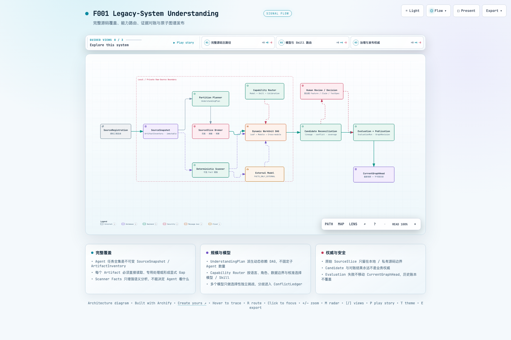
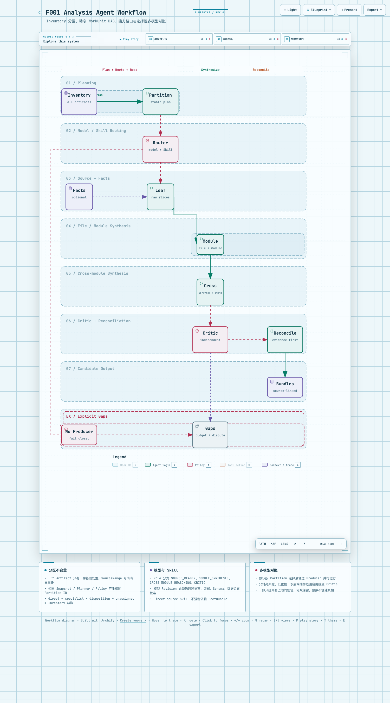
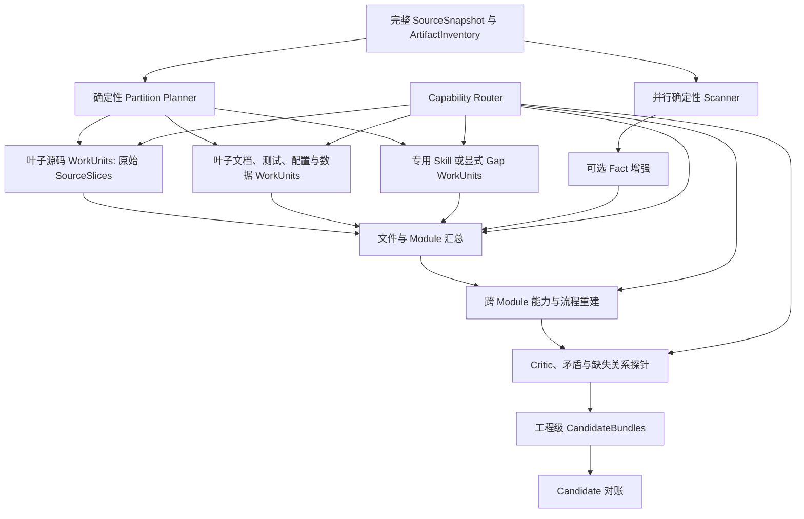
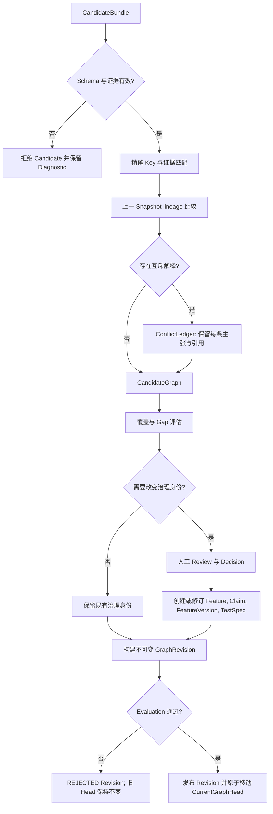

> 语言：**简体中文** · [English](workspace-scan-and-analysis-lifecycle.md)

---
feature_ids: [F001]
related_features: []
topics:
  - workspace
  - source-scan
  - analysis-run
  - checkpoint
  - pause-resume
  - browser-refresh
doc_kind: feature-design
created: 2026-07-29
status: proposed
priority: P0
---

# 持久 Workspace 扫描与 Analysis Agent 生命周期

> [F001](F001-legacy-system-understanding.zh-CN.md) 的支撑执行设计。本文定义持久所有权与恢复；理解正确性、对账和评估由 F001 理解引擎设计定义。

## 1. 需求定义

> “我说的是扫描阶段，扫描文件这一步。另外将扫描文件与分析 Agent 这一步的逻辑单独列为一个需求，作为重点需求推进。”

本需求把 Workspace 分析明确拆成两个独立、可追踪的执行阶段：

1. **SourceScanRun**：在服务端建立不可变源码快照，逐文件提取确定性事实并生成 `FactBundle`。
2. **AnalysisRun**：基于同一个 Snapshot 的确定性 Facts 规划并执行 Agent/Skill `WorkUnit`，生成 Candidate 投影。

父 Job 随后持有对账、评估、图谱投影和发布。后续编排阶段不会把 SourceScanRun 与 AnalysisRun 合并成同一套检查点。

二者由一个用户可见的 **WorkspaceAnalysisJob** 串联。浏览器不拥有任何执行器，只负责：

- 创建或选择 Workspace；
- 登记一个经过授权的源码位置；
- 发出 Start、Pause、Resume、Cancel 命令；
- 通过 `GET` 或事件流观察服务端状态。

浏览器刷新、关闭、重新打开、断网或多标签页访问都不得改变任务状态。

## 2. 当前问题与证据

当前实现只把模型分析阶段迁移到了服务端。源码扫描仍由 React 组件
`WorkspaceAnalysisView.scanWorkspace()` 中的 Promise 和内存状态驱动：

- 文件目录句柄、文件列表、扫描游标、批次和 `scanning` 状态属于页面进程；
- 服务端 `AnalysisRun` 只在全部文件扫描完成、浏览器提交 derived observations 后才创建；
- 页面卸载会销毁唯一的扫描执行器；
- IndexedDB 只能保存检查点，不能让执行在页面消失后继续；
- 旧设计明确允许 `SCANNING + refresh → INTERRUPTED`，与本需求冲突。

此前验证只覆盖了服务端 `AnalysisRun` 创建后的刷新场景，没有覆盖扫描阶段，因此不能作为本需求的验收证据。

## 3. 完成态

```text
User
  │ Start / Pause / Resume / Cancel
  ▼
WorkspaceAnalysisJob                         ← 用户看到的唯一任务
  │
  ├─ SourceRegistration                      ← 经过授权的源码位置
  │    └─ SourceSnapshot                     ← 本次任务固定的不可变输入
  │         └─ SourceScanRun                  ← 服务端逐文件扫描
  │              └─ FactBundle               ← Snapshot-bound Facts
  │
  └─ AnalysisRun                             ← 服务端 Agent/Skill WorkUnits
       └─ CandidateBundles
            └─ CandidateReconciliation
                 └─ EvaluationRun
                      └─ GraphRevision 投影
                           └─ 原子发布 → CurrentGraphHead

BrowserSubscription                          ← 非权威只读指针
```

完成态必须满足：

- 点击 Start 后，API 先持久化任务 ID，再异步执行。
- SourceScanRun 与 AnalysisRun 都由服务端 worker 持有。
- SourceScanRun 和 AnalysisRun 分别拥有自己的检查点、进度和失败语义。
- WorkspaceAnalysisJob 使用同一个 ID 串联两个阶段。
- 只有用户命令能够进入人工暂停状态。
- 服务崩溃或进程重启后，非人工暂停任务从最后一个已提交检查点重新租约执行。
- 已完成的扫描文件和 Analysis WorkUnit 不得重复执行。

### 3.1 端到端理解逻辑

Traqen 故意把观察、解释、对账、治理和发布分成不同权威层：

| 层 | 输入 | 输出 | 权威边界 |
|---|---|---|---|
| 确定性扫描器 | 不可变源码 Snapshot | ArtifactInventory、Facts、确定性关系 | 可以陈述 Snapshot 中客观存在什么 |
| Analysis Agent / Skills | 授权 Facts 与有界源码切片 | 带证据的 Candidates | 可以提出语义解释 |
| 对账层 | Facts、Candidates、历史 lineage | CandidateGraph、冲突/覆盖账本、lineage | 可以匹配比较，不能分配治理身份 |
| 人工 Review 与 Decision | 已对账 Candidates 与证据 | Feature、Claim、FeatureVersion、TestSpec 决策 | 唯一可以创建或修改业务权威对象的路径 |
| 评估与发布 | CandidateGraph、Decision、Evidence、Gap | 不可变 GraphRevision 与原子 CurrentGraphHead 更新 | 只有通过策略的 Revision 才能发布 |

路径名、模型回答、相似度分数和确定性 Hash 都不能创建或合并受治理的 `Feature.id`。

[](../diagrams/f001-legacy-system-understanding/understanding-architecture.html)

点击静态预览可打开自包含的 Archify 交互产物；其中的引导视图分别聚焦完整
源码主路径、模型/Skill 路由以及治理/发布边界。可复现的
[Archify JSON 源](../diagrams/f001-legacy-system-understanding/understanding-architecture.architecture.json)
和[交付回执](../diagrams/f001-legacy-system-understanding/README.zh-CN.md)
随设计一并入库。

### 3.2 扫描算法：从工程源码到确定性 Facts

以一个订单工程为例，扫描器执行四个逻辑步骤：

1. **授权并固定输入。** `SourceRegistration` 证明 Runner 可以读取该根目录；文件进入 content-addressed Snapshot spool，并固定相对路径、内容 Hash、大小、媒体类型、语言以及 scanner/policy 版本。运行期间发生的源码变化属于下一个 Snapshot。
2. **密封完整清单。** 范围内每个 Artifact 都有明确处置：`INCLUDED`、`EXCLUDED_BY_POLICY`、`UNSUPPORTED`、`GENERATED`、`BINARY`、`OVERSIZED`、`SECRET_REDACTED` 或 `READ_FAILED`。Manifest 密封前分母未知；密封后，覆盖率按完整 Inventory 计算，不能只统计成功解析的文件。
3. **执行版本化确定性 Extractor。** 代码生成 Module、Symbol、Import、Call、Endpoint、Job、Command；Schema 和迁移生成 DataObject 与 Read/Write；配置生成 Key 与 Consumer 但不保存真实秘密；文档生成可定位的需求/设计段落；测试生成 Case、Assertion、Fixture 与实现关系；结果文件生成执行身份和元数据。
4. **解析跨文件关系并提交。** Resolver 把 Route 关联 Handler、Call 关联 Symbol、Test 关联实现、Configuration 关联 Consumer、代码关联数据对象。`SnapshotManifest + FactBundle` 原子提交。每个 Fact 保留 Project、Snapshot、源码区间/内容 Hash、Extractor 身份与版本、稳定实体身份和 Snapshot 内不可变 Fact 身份。

例如确定性层可能产生：

```text
POST /orders
  └─ IMPLEMENTED_BY → OrderController.submitOrder
       └─ CALLS → OrderService.createOrder
            └─ WRITES → orders

order-submit.test.js
  └─ EXERCISES → OrderService.createOrder

ORDER_SUBMIT_ENABLED
  └─ CONSUMED_BY → OrderService.createOrder
```

这些关系证明可观察的工程结构，但还不能证明它就是权威业务 Feature“提交订单”。

### 3.3 Analysis Agent 算法：从完整 Snapshot 到语义 Candidates

Agent 的任务全集是完整、不可变的 `SourceSnapshot`，不是扫描器成功产生的结果。每一条 ArtifactInventory 记录必须且只能进入一种基础覆盖结果：

- 被源码分析 WorkUnit 直接读取；
- 由声明过能力的 Binary/Generated/Result 专用 Skill 处理；或
- 以 Excluded、Unsupported、Policy、Secret、Size、Read Failure 等显式处置/Gap 保留。

Scanner Facts 是并行产生、可选的增强输入。某个 Symbol、Endpoint 或关系 Fact 缺失，不能让对应源码 Artifact 从 Agent 计划中消失。因此，“分析所有文件”指所有 Artifact 在许多有界 WorkUnit 中得到完整、可审核的处置；绝不表示把整个仓库塞进一个 Prompt。

[](../diagrams/f001-legacy-system-understanding/analysis-agent-workflow.html)

交互工作流展开确定性分区、能力路由、有界源码读取、层级汇总、选择性独立
Critic、Candidate 对账与显式失败/Gap 路径。对应的
[Archify JSON 源](../diagrams/f001-legacy-system-understanding/analysis-agent-workflow.workflow.json)
是下述算法的可复现视觉投影。

#### 3.3.1 Inventory 分区如何产生

Planner 直接从 ArtifactInventory 与 Snapshot 源码元数据构建不可变 `UnderstandingPlan`，不读取 scanner Candidate、受治理 Feature 或 Truth Set。

分区规则是确定性的，并按以下顺序执行：

1. **工程边界：** 从源码 Manifest 识别 Workspace/Package/Build Root，例如 `package.json`、Workspace 文件、Maven/Gradle 描述、Solution/Project 文件、Module 文件与仓库配置。无法识别的工程仍得到一个根边界，不能因此消失。
2. **Artifact 通道：** 每条记录进入 Source、Document/Contract、API/Schema、Data/Migration、Configuration、Test、Build/Result、Binary/Generated 或 Unknown。路由依据内容类型、显式 Manifest 结构与版本化约定，不依赖 scanner 产生的业务 Feature。
3. **局部性分组：** 按工程边界、语言/工具链、Module/Subtree、声明的 Package 归属与直接 Manifest/Import Header 关系分组。Planner 可以读取 Manifest 与 Import Header 建立轻量结构索引，但该索引不生成 Fact 或语义 Candidate。
4. **预算分片：** 按所选执行 Profile 的输入预算打包每个局部性分组。小而相关的文件尽量同组；超大文件用版本化语法/文档边界切成稳定行号范围，保留有界重叠，并在其后创建文件级汇总单元。
5. **横切根任务：** 为入口、公开接口、流程、配置 Consumer、测试、文档与已知变化前沿增加允许重叠的 WorkUnit；它们不能替代互斥的基础覆盖分区。

```ts
type UnderstandingPlan = {
  id: string;
  snapshotManifestId: string;
  plannerVersion: string;
  conventionRegistryVersion: string;
  executionProfileId: string;
  partitions: Array<{
    id: string;
    kind: "BASE_COVERAGE" | "CROSS_CUTTING" | "FOLLOW_UP";
    lane: string;
    projectBoundaryId: string;
    artifactIds: string[];
    sourceRanges: Array<{ artifactId: string; startLine?: number; endLine?: number }>;
    dependencyPartitionIds: string[];
    requiredCapabilities: string[];
    languages: string[];
    estimatedInputTokens: number;
    riskClass: "STANDARD" | "HIGH";
  }>;
  coverage: {
    inventoryArtifactCount: number;
    directlyAssignedCount: number;
    specialistAssignedCount: number;
    explicitDispositionOrGapCount: number;
    unassignedCount: 0;
  };
};
```

三个已处置计数加 `unassignedCount` 必须等于 `inventoryArtifactCount`；即使一个 Artifact 的 SourceRange 有有界重叠，它仍只能有一种基础处置。每个基础分区的稳定 ID 由 Snapshot、Planner/Convention 版本、通道、排序后的 Artifact/Range 身份和 Policy Digest 派生。同一 Snapshot 在同一策略下重新规划必须得到相同分区。Planner、模型/Skill Route 或源码范围变化会产生新的 Input Digest，不能静默复用不兼容结果。

#### 3.3.2 WorkUnit 如何运行

`UnderstandingPlan` 会变成持久化的依赖 DAG，而不是固定数量的子 Agent：



DAG 分层运行：

1. **叶子读取：** 只有位于本地/私有源码边界内且能力合格的模型/Skill 才能直接读取每个可处理 Artifact 的授权原始 SourceSlice，并输出带源码锚点的 Observation/Candidate。
2. **文件/Module 汇总：** 合并相关叶子输出、选定原始切片与可选 Facts。只有子任务摘要、没有底层源码证据时不能形成 Candidate。
3. **跨 Module 重建：** 分析公开接口、Module 间 Call、流程、状态转移、规则、数据/配置影响和测试意图。
4. **Critic 与 Gap 探针：** 独立挑战高风险结论、矛盾、低置信区域、未分配证据与未解决边界。
5. **工程级汇总：** 形成有界 CandidateBundle 交给对账；不能创建受治理 Feature 身份。

每个 WorkUnit 持久化 Dependency ID、Artifact/Range 输入、可选 Fact ID、必需能力、所选 Producer Route、Token/Cost/Deadline 预算、Input/Output Digest、Attempt、Checkpoint 和结构化输出。就绪单元在 Worker 与 Provider 并发配额内并行运行；调度采用 at-least-once，绑定 Input Digest 的结果提交 exactly-once。失败、超时或预算耗尽形成显式 Gap，不能把覆盖的 Artifact 标记为语义完成。

执行期间，某通道可以为未解析 Call、无文档接口、意图不清测试、未知配置 Consumer、矛盾或缺失关系创建有界 `FOLLOW_UP` 单元。跟进深度和总预算由策略固定；触顶记录 `UNEXPLORED_BUDGET_LIMIT`。

#### 3.3.3 模型与 Skill 如何选择

当前 `AnalysisModelProfile` 只证明传输配置和凭据可用，不能证明某模型适合所有语言、Artifact 或推理角色。F001 终态在凭据之外增加版本化能力/校准声明：

```ts
type ModelCapabilityProfile = {
  id: string;
  analysisModelProfileId: string;
  modelRevision: string;
  roles: Array<"SOURCE_READER" | "MODULE_SYNTHESIS" | "CROSS_MODULE_REASONING" | "CRITIC">;
  languages: string[];
  artifactKinds: string[];
  structuredOutputSchemas: string[];
  maxContextTokens: number;
  dataBoundaryClasses: Array<"FACTS_ONLY_EXTERNAL" | "RAW_SOURCE_LOCAL" | "RAW_SOURCE_PRIVATE_RUNNER">;
  calibrationPolicyVersion: string;
  qualityTierByRole: Record<string, string>;
  independenceGroup: string;
  costClass: string;
};
```

已有签名 Skill Registration 会声明 Capability、语言/Framework 兼容性、Input/Output Schema、Permission、Model Policy、Cost Class 和增量能力。终态输入合同区分两类 Skill：

- **Direct-source Skill** 必需输入是 `PROJECT_SNAPSHOT`，通过 SourceSlice 读取源码；`CODE_FACT_BUNDLE` 只是可选增强；
- **Fact-dependent Skill** 显式要求对应 FactBundle。

这会修改当前 Reverse Skill 同时强制要求 `PROJECT_SNAPSHOT` 与 `CODE_FACT_BUNDLE` 的基线。
Direct-source WorkUnit 必须选择 `RAW_SOURCE_LOCAL` 或 `RAW_SOURCE_PRIVATE_RUNNER` Producer Route。声明为 `FACTS_ONLY_EXTERNAL` 的外部模型只能处理策略过滤后的 Facts，绝不能读取原始 SourceSlice；如果没有边界内合格 Producer，则记录 `NO_ELIGIBLE_PRODUCER`。

对每个 WorkUnit，确定性 Capability Router 计算以下交集：

- 必需 Role/Capability、语言、Artifact、Context 大小与 Risk Class；
- 已验证的 ModelCapabilityProfile；
- 已允许且版本固定的 Skill Manifest；
- 源码数据边界与 Tenant Policy；
- 本次运行的质量、成本、截止时间、并发与冗余策略。

Router 持久化 `AnalysisRouteDecision`，记录候选 Producer、选定 Primary/Critic Route、被拒绝 Route 与原因码、精确模型/Skill 版本、Calibration 版本、Independence Group 和预算。模型不能自选任务；未验证 Profile 不得运行；找不到合格 Producer 时记录 `NO_ELIGIBLE_PRODUCER`，不能悄悄换成通用 Fallback。

首版 Role/Skill 路由基线如下：

| WorkUnit Role | 模型 Profile 必须证明 | 典型已注册 Skill Capability | 主要证据 |
|---|---|---|---|
| `SOURCE_READER` | 语言/Artifact 支持、Schema 遵循、源码 Grounding、有界 Context 行为及本地/私有原始源码资格 | `ARCHITECTURE_REVERSE`、`BUSINESS_RULE_MINING`、`DATA_SEMANTICS`、`CONFIGURATION_ANALYSIS`、`TEST_INVENTORY_REVIEW` | 原始 SourceSlice；Facts 可选 |
| `MODULE_SYNTHESIS` | 长 Context 汇总不丢引用，并具备校准过的关系精度 | `FEATURE_DISCOVERY`、`ARCHITECTURE_REVERSE`、`DOMAIN_MODELING`、`BUSINESS_RULE_MINING` | 叶子输出及选定 SourceSlice/Facts |
| `CROSS_MODULE_REASONING` | 跨文件 Graph/Workflow/State 推理及校准过的缺失关系召回 | `FEATURE_DISCOVERY`、`STATE_MACHINE_RECOVERY`、`PERMISSION_ANALYSIS`、`DATA_SEMANTICS`、`CONFIGURATION_ANALYSIS`、`TEST_DESIGN`、`RUNTIME_CORRELATION`、`CHANGE_IMPACT` | Module Candidate/Evidence Index 及选定 SourceSlice/Facts |
| `CRITIC` | 高证据校验精度、矛盾检测能力，且与 Primary 属于不同 Independence Group | `REVERSE_REVIEW` 加被挑战的 Domain Capability | Candidate、原始证据、Route/Calibration Provenance；不看 Primary 私有推理 |

设计不会硬编码某个厂商模型名。每个 Role/语言/Risk Cell 都由版本化 Calibration Suite 测量 Schema 有效率、源码 Grounding 精度、必须/禁止关系正确性、Context 退化、Gap 诚实度、Secret/数据边界合规、延迟与成本。只有通过的模型 Revision 才能成为该 Cell 的 Primary 或 Critic；新 Revision 初始状态是未验证。因此，“用哪个模型”是基于实际适配度证据、可审核的部署决策，不是一个未经验证的配置字符串。

#### 3.3.4 超大工程与多模型

一次全量分析是一个持久 `AnalysisRun`，不是一次模型请求。规模通过有界层级分解与并行化处理：

- 叶子 WorkUnit 分散到多个 Worker 与 Provider 配额；
- 大文件切成稳定 Source Range，再做文件级汇总；
- Module 结果进入跨 Module 单元；
- 相同 Input Digest 的结果可在恢复和后续增量 Snapshot 中复用；
- 全局汇总只读取有界 Candidate/Evidence Index 与选定 SourceSlice，不会一次看到所有原始文件；
- 完成条件包括 `unassignedCount=0`、所有必需 WorkUnit 进入终态，以及所有不支持/预算不足区域都有显式 Gap。

系统支持多个模型，但不会做无控制投票：

1. **分区并行（默认）：** 不同 WorkUnit 路由给最合适的模型/Skill，并行运行。
2. **选择性冗余：** 仅对高风险锚点、低置信输出、矛盾、Challenge Sample 或策略抽样使用两个独立校准 Producer；默认不让每个文件重复分析。
3. **独立 Critic：** 使用不同 `independenceGroup` 的 Producer 只查看 Candidate 与原始证据，不查看 Primary 的私有推理。
4. **证据对账：** 确定性校验与 Candidate Reconciliation 比较引用、范围、约束和矛盾。同一基础模型/Prompt Family 的两个输出属于相关证据，不算两个独立投票。

一致结果只能在校准过的证据上限内提高 corroboration。分歧进入 ConflictLedger；票数不能产生真相或治理身份。未解决的高风险冲突进入人工 Review/Decision。

#### 3.3.5 Candidate 输出合同

输出是结构化 `CandidateBundle`，不是自由文本总结：

```text
CandidateFeature: “提交订单”
CandidateClaim: “只有 DRAFT 订单可以提交”
CandidateRelation:
  提交订单 IMPLEMENTED_BY OrderService.createOrder
  提交订单 EXPOSED_BY POST /orders
  提交订单 CONFIGURED_BY ORDER_SUBMIT_ENABLED
CandidateTestIntent:
  order-submit.test.js 可能覆盖“只有 DRAFT 订单可以提交”
```

每个 Candidate 携带原始 SourceSlice 和/或 Fact 证据、Snapshot/WorkUnit、Producer/模型/Skill 版本、Route/Calibration Provenance、分维度置信度、确定性置信度上限、不确定性和替代解释。确定性 Validator 拒绝越过 WorkUnit、跨 Project/Snapshot、缺失、重复或伪造的证据；剥离模型擅自填写的治理 ID/字段；并把置信度限制在证据允许的上限内。

### 3.4 对账算法：保留身份不确定性

对账不是按名称去重，而是依序执行以下门禁：

1. 校验 Candidate Schema、端点、证据范围、SourceSlice 授权和置信度上限；
2. 匹配稳定 Candidate Key、共同 Fact/SourceSlice、显式 API/文档/Symbol 引用、约束和作用域；
3. 与上一 Snapshot 比较，把本次仍观察到的 Candidate lineage 分类为 `NEW`、`UNCHANGED`、`BUSINESS_SEMANTICS_CHANGED`、`IMPLEMENTATION_REMAPPED` 或 `EVIDENCE_REFRESHED`；上一 Snapshot 有但本次未观察到的 Candidate 进入 `candidateAbsences`，处置为 `NO_CURRENT_OBSERVATION`；
4. 提出重复、父子、拆分、合并或映射到既有 Feature 的建议，但不直接执行；
5. 把互相矛盾的文档、实现和测试主张全部保存在 `ConflictLedger`；
6. 在 `CoverageLedger` 中证明 Inventory/WorkUnit/证据覆盖，并记录仍未解决的 Gap。



对账输出由 `CandidateGraph`、`ConflictLedger`、`CoverageLedger` 和 `CandidateLineage` 组成。Candidate 在授权 Decision 接受、拒绝、关联、拆分、合并或分类前保持 `PENDING_REVIEW`，并且没有 governed Feature ID。

### 3.5 图谱投影、发布与增量演进

一次 `GraphRevision` 物化同一个一致视图：SnapshotManifest/ArtifactInventory、Facts、已对账 Candidate 与账本、受治理 Feature/Claim/Decision/TestSpec、测试执行与 Evidence、ChangeSet/ImpactAssessment，以及明确 Gap。所有节点和边保留 Snapshot、Producer、Evidence、Decision、Status、Version 和 Time provenance。

发布按 fail-closed 工作：

```text
BUILDING → EVALUATING → PUBLISHED
                     ↘ REJECTED
```

发布不可变 Revision 和移动 `CurrentGraphHead` 必须是同一个事务。扫描、对账、评估或发布失败时，失败 Revision 与 Diagnostic 仍可查询，旧 Head 继续服务 Feature Tree、API Tree、TraceChain、影响、覆盖、冲突和质量等全部投影视图。

项目第一次成功分析必须是 `FULL`。后续 `INCREMENTAL` 比较 ArtifactInventory、失效受影响 Facts、重算变化关系前沿、重跑证据或 Producer 变化的 WorkUnit、复用未变化 Candidate lineage、生成 ChangeSet、计算受影响 Feature/Claim/TestSpec、形成 ImpactAssessment 与重验证计划，并且只在评估通过后发布新 GraphRevision。单纯实现移动只更新映射与历史；只有经过治理的业务定义 Decision 才创建新 FeatureVersion。

### 3.6 当前实现边界

本节定义 F001 目标，不代表所有组件已经实现。当前代码已经具备 JavaScript/Java 及部分 OpenAPI/SQL/配置/测试确定性扫描、SnapshotManifest 与 FactBundle 关系、以 Fact Root 为中心的有界 Analysis WorkUnit 与 Candidate 校验、一个 Active Model Profile 加可选版本固定 Skill、固定三个子 Agent Slot 的 UI Plan、增量 Candidate Lineage、受治理 Feature/Claim/Decision/TestSpec/Evidence，以及图谱/追溯投影。

F001 仍需完成：完整服务端 SourceScanRun、多语言 canonical scanner 等价、完整 ArtifactInventory、独立于 Scanner 的原始源码基础覆盖、确定性 UnderstandingPlan/分区覆盖、动态 WorkUnit DAG 调度、ModelCapabilityProfile 与能力路由、Direct-source Skill 输入、选择性多模型/Critic 执行、SourceSlice Broker、全局对账及账本、EvaluationRun/GraphRevision/CurrentGraphHead 发布，以及“Traqen 分析 Traqen”的双 Snapshot 验收。

## 4. 用户旅程

### 4.1 首次分析

1. 用户创建 Workspace。
2. 用户通过 Local Runner 登记源码目录；服务端返回不暴露绝对路径的 `sourceRegistrationId`。
3. 用户选择模型配置并点击“开始分析”。
4. API 返回 `202 Accepted` 和稳定的 `jobId`；页面立即展示服务端任务状态。
5. 服务端建立源码快照并执行 SourceScanRun。
6. 扫描完成后，服务端基于 FactBundle 创建 AnalysisRun。
7. 项目首次运行时评估并发布 FULL GraphRevision；后续 Snapshot 评估 INCREMENTAL Revision，只有通过后才原子移动 CurrentGraphHead。

### 4.2 刷新、关闭和重新打开

1. 用户可以在任意阶段刷新或关闭浏览器。
2. 服务端任务继续运行。
3. 页面重新打开后读取本地 subscription，并对同一 `jobId` 发 `GET`。
4. UI 恢复服务端返回的 phase、status、进度和时间线。
5. 刷新路径不得发送 Start、Pause、Resume 或 Cancel。

### 4.3 人工暂停与恢复

1. 用户点击 Pause。
2. 服务端先记录 `PAUSE_REQUESTED`，worker 在当前原子 WorkUnit 边界保存检查点。
3. 状态变为 `PAUSED` 后不再自动取得新租约。
4. 用户刷新页面，任务仍为 `PAUSED`。
5. 用户点击 Resume；同一 `jobId`、`sourceSnapshotId`、`scanRunId` 和 `analysisRunId` 继续执行。
6. 已完成的文件与 Agent WorkUnit 被跳过。

## 5. 生命周期对象普查

### 5.1 SourceRegistration

表示服务端被允许读取的源码位置。

```ts
type SourceRegistration = {
  id: string;
  projectId: string;
  connectorKind: "LOCAL_FILESYSTEM";
  displayName: string;
  canonicalRootRef: string; // 加密或服务端私有；普通读取 API 不返回绝对路径
  policyVersion: string;
  status: "ACTIVE" | "REVOKED";
  createdAt: string;
  updatedAt: string;
};
```

规则：

- `rootPath` 必须经过 `realpath` 规范化并位于 operator 配置的 allowlist 下。
- 注册时拒绝根目录、home 根目录、设备、socket 和符号链接越界。
- 撤销 registration 不删除既有历史 Snapshot；只阻止新任务读取。

### 5.2 SourceSnapshot

一次 WorkspaceAnalysisJob 的不可变源码输入。

```ts
type SourceSnapshot = {
  id: string;
  projectId: string;
  sourceRegistrationId: string;
  manifestDigest: string;
  scannerVersion: string;
  policyVersion: string;
  fileCount: number;
  totalBytes: number;
  status: "BUILDING" | "SEALED" | "FAILED";
  createdAt: string;
  sealedAt: string | null;
};
```

Snapshot 在 `SEALED` 后不可追加或替换文件。运行期间源目录发生变化，不改变当前任务；下一次分析创建新的 Snapshot。

### 5.3 SourceScanRun

```ts
type SourceScanRun = {
  id: string;
  jobId: string;
  projectId: string;
  sourceSnapshotId: string;
  status:
    | "QUEUED"
    | "RUNNING"
    | "PAUSE_REQUESTED"
    | "PAUSED"
    | "COMPLETED"
    | "COMPLETED_WITH_GAPS"
    | "FAILED"
    | "CANCELLED";
  phase: "DISCOVERY" | "SNAPSHOTTING" | "EXTRACTION" | "RELATION_RESOLUTION" | "FACT_COMMIT";
  plannedFileCount: number | null;
  completedFileCount: number;
  failedFileCount: number;
  leaseOwnerId: string | null;
  leaseToken: number;
  leaseExpiresAt: string | null;
  updatedAt: string;
};
```

每个扫描 WorkUnit 的稳定身份为：

```text
hash(sourceSnapshotId + relativePath + contentHash + scannerVersion + policyVersion)
```

已提交为 `COMPLETED` 的扫描 WorkUnit 在恢复时直接跳过。

### 5.4 AnalysisRun

继续复用 canonical `AnalysisRun`，但只能在 SourceScanRun 已产生同一 Snapshot 的完整 FactBundle 后启动。

Analysis WorkUnit 的证据仍必须满足：

- `evidenceFactIds` 属于目标 WorkUnit；
- Facts 属于同一 Project 与 Snapshot；
- 模型置信度不超过确定性证据上限；
- 已完成 WorkUnit 在恢复时不重复调用模型或 Skill。

### 5.5 WorkspaceAnalysisJob

这是用户看到的唯一任务资源。

```ts
type WorkspaceAnalysisJob = {
  id: string;
  projectId: string;
  sourceRegistrationId: string;
  sourceSnapshotId: string | null;
  scanRunId: string | null;
  analysisRunId: string | null;
  candidateGraphId: string | null;
  evaluationRunId: string | null;
  graphRevisionId: string | null;
  requestedMode: "FULL" | "INCREMENTAL" | "AUTO";
  desiredState: "RUNNING" | "PAUSED" | "CANCELLED";
  status:
    | "QUEUED"
    | "RUNNING"
    | "PAUSE_REQUESTED"
    | "PAUSED"
    | "RECOVERING"
    | "COMPLETED"
    | "COMPLETED_WITH_GAPS"
    | "FAILED"
    | "CANCELLED";
  phase:
    | "SOURCE_SCAN"
    | "FACT_COMMIT"
    | "ANALYSIS"
    | "RECONCILIATION"
    | "EVALUATION"
    | "PROJECTION"
    | "PUBLISHING";
  createdAt: string;
  updatedAt: string;
  completedAt: string | null;
};
```

`connectionStatus` 不属于该对象。浏览器的 `CONNECTED / RECONNECTING / OFFLINE` 只能作为界面派生值，绝不能覆盖服务端 job status。

模式解析必须确定性持久化：Project 没有 `CurrentGraphHead` 时，`AUTO` 解析为 `FULL`，显式 `INCREMENTAL` 被拒绝；已有当前头后，`AUTO` 解析为 `INCREMENTAL`，operator 仍可强制 `FULL`。Resume 不能改变已解析模式。

### 5.6 BrowserSubscription

IndexedDB 只保存：

- `projectId`
- `jobId`
- 最后观察到的版本和时间

subscription 不保存权威 `RUNNING`、扫描检查点、Fact 或 Candidate。

## 6. 状态转移

### 6.1 WorkspaceAnalysisJob

| 当前状态 | 事件 | 下一状态 | 说明 |
|---|---|---|---|
| absent | `POST jobs` | `QUEUED` | 先持久化 job，再返回 `202` |
| `QUEUED` | worker 取得租约 | `RUNNING` | 进入 `SOURCE_SCAN` |
| `RUNNING` | 显式 Pause | `PAUSE_REQUESTED` | 持久化 desiredState |
| `PAUSE_REQUESTED` | 当前原子单元已提交 | `PAUSED` | 停止取得新单元 |
| `PAUSED` | 显式 Resume | `QUEUED` | 同一 job 重新取租约 |
| `RUNNING` | worker 租约过期 | `RECOVERING` | 不视为人工暂停 |
| `RECOVERING` | 新 worker 取得租约 | `RUNNING` | 从最后检查点继续 |
| `RUNNING` | 所有阶段完成 | `COMPLETED` / `COMPLETED_WITH_GAPS` | 固化结果和不可变输出引用 |
| 非终态 | 显式 Cancel | `CANCELLED` | 保留历史检查点，不自动恢复 |
| 任意 | 浏览器刷新/断网/GET | 不变 | 无生命周期副作用 |

### 6.2 阶段切换

| 当前阶段 | 已提交事件 | 后续阶段或状态 |
|---|---|---|
| `SOURCE_SCAN` | 所有扫描 WorkUnit 完成 | `FACT_COMMIT` |
| `FACT_COMMIT` | SnapshotManifest 与 FactBundle 已提交 | `ANALYSIS` |
| `ANALYSIS` | 所有必需 CandidateBundle 已提交 | `RECONCILIATION` |
| `RECONCILIATION` | CandidateGraph、ConflictLedger、CoverageLedger 与 lineage 已提交 | `EVALUATION` |
| `EVALUATION` | EvaluationRun 通过 | `PROJECTION` |
| `EVALUATION` | EvaluationRun 拒绝本次 Revision | 以 gap/failure 终止；保留旧 `CurrentGraphHead` |
| `PROJECTION` | 不可变 GraphRevision 已物化 | `PUBLISHING` |
| `PUBLISHING` | GraphRevision 变为 `PUBLISHED` 且 CurrentGraphHead 原子移动 | `COMPLETED` / `COMPLETED_WITH_GAPS` |

这些 Job 阶段是
[`legacy-system-understanding-engine.zh-CN.md`](legacy-system-understanding-engine.zh-CN.md)
所定义 F001 理解流水线的执行投影。阶段切换必须和输出引用在同一个事务中提交：FactBundle 未提交不能进入 Analysis，对账账本未提交不能进入 Evaluation，GraphRevision 未形成明确的 published/rejected 结果不能完成 Job。

## 7. 扫描检查点设计

SourceScanRun 分五步执行：

1. **DISCOVERY**：遍历 allowlisted root，建立有序文件清单。
2. **SNAPSHOTTING**：读取文件并写入 content-addressed 本地 spool，固定 content hash。
3. **EXTRACTION**：对每个不可变 blob 提取 Artifact、Symbol、Endpoint、Configuration、Test Asset 等 Facts。
4. **RELATION_RESOLUTION**：跨文件解析 import/call/test linkage。
5. **FACT_COMMIT**：原子写入 SnapshotManifest 和 FactBundle。

检查点要求：

- 每个文件或有界批次完成后原子提交。
- 进程崩溃最多重做一个未提交单元。
- 重试不得重复写 Fact；Fact ID 和 WorkUnit ID 必须确定性生成。
- `RUNNING` 状态必须有有效 worker lease；租约过期进入 `RECOVERING`。
- 扫描失败分为 `SKIPPED`、可重试 `FAILED` 和致命根目录错误。
- 文件总数在 manifest seal 前显示为不确定；seal 后显示准确分母。

## 8. 扫描器能力等价门禁

当前浏览器 scanner 与服务端 `JavaScriptProjectScanner` 的语言覆盖不一致。迁移不得降低现有能力。

切换到服务端扫描前，canonical scanner 必须覆盖当前用户可见能力：

- JavaScript / TypeScript / JSX / TSX
- Java
- Python
- Go
- C#
- Rust
- OpenAPI
- 工程命令与配置
- 测试文件线索

必须用同一组多语言 fixture 做旧/新扫描结果对账，至少比较：

- 文件覆盖率
- Candidate/Fact 类型和数量
- 稳定 ID
- source location
- 配置值脱敏
- 测试线索与实现关系
- diagnostics

能力不等价时不得切断浏览器旧路径，也不得宣布本需求完成。

## 9. Analysis Agent 接续设计

- SourceScanRun 完成后，job 使用固定 `sourceSnapshotId` 和 `factBundleId` 创建 AnalysisRun。
- Pause 在模型请求进行中时可以中止当前请求，但该 WorkUnit 必须回到 `QUEUED`，且不得误记为已完成。
- 已经成功提交 CandidateBundle 的 WorkUnit 永不重复执行。
- Resume 复用同一个 AnalysisRun；不得创建新 run 冒充继续。
- 模型/Skill 输出校验失败只影响对应 WorkUnit，并保留可诊断错误。
- 自动重试受 `maxAttemptsPerWorkUnit` 限制；耗尽后按策略进入 `COMPLETED_WITH_GAPS` 或 `PAUSED`，不得无限循环。

## 10. 并发、租约与幂等

- Job 创建请求必须提供客户端生成的稳定 `idempotencyKey` 或 job ID。
- 同一 key 的重复 Start 返回同一 job。
- 每个 job 同时只能存在一个有效 worker lease。
- lease 更新使用单调递增 `leaseToken` 作为 fencing token；旧 worker 不能提交新结果。
- 多标签页只读同一 job；Pause/Resume 重复点击应幂等。
- WorkUnit 采用 at-least-once 调度和 exactly-once result commit。
- 进程重启后：
  - `desiredState=RUNNING` 的过期任务自动恢复；
  - `desiredState=PAUSED` 的任务保持暂停；
  - `desiredState=CANCELLED` 的任务永不恢复。

## 11. 安全与数据边界

### 11.1 部署能力模式

| 模式 | 源码访问 | 规则 |
|---|---|---|
| `LOCAL_SINGLE_TENANT` | API 与 Runner 共置并读取 allowlisted 本地源码 | 允许 `LOCAL_FILESYSTEM` 注册 |
| `PRIVATE_RUNNER` | Runner 位于私有源码侧，通过双向认证/出站连接接收任务 | 原始源码留在源码边界 |
| `CLOUD_CONTROL_PLANE` | 控制面不能读取浏览器本地路径 | 必须使用 Private Runner 或受治理 Remote Git Connector；禁用直接本地注册 |

第一阶段只交付 `LOCAL_SINGLE_TENANT`。`SourceRegistration` 记录 connector kind、capability version 和 policy version，使后续 Connector 不改变 Snapshot 或图谱语义。

### 11.2 通用边界

硬性约束：

- operator 配置 `TRAQEN_ALLOWED_WORKSPACE_ROOTS`；未配置时禁止本地路径注册。
- 对 root 和每个文件执行 canonical `realpath` 边界检查。
- 不跟随越过 root 的符号链接。
- 拒绝设备、socket、FIFO 和非普通文件。
- API 普通读取响应不返回绝对路径。
- 日志不记录源码正文、secret 或未脱敏 `.env` 值。
- 原始源码只进入本地/私有 Snapshot spool、Scanner、SourceSlice Broker 和明确合格的边界内 Analysis Worker/Skill；不直接发送给外部模型。
- 外部模型只接收经过 Evidence Policy 过滤的 bounded Facts。
- spool 默认持久化直到用户显式删除 Snapshot；不得使用隐式 TTL。
- 删除必须走显式 API、审计并只删除目标 Snapshot 的引用安全 blob。

远程 Git、代码托管平台连接器和浏览器上传源码不在第一阶段范围内。

云端/多租户 API 在没有兼容 Private Runner 时必须拒绝 `LOCAL_FILESYSTEM` 注册。

## 12. API 草案

```http
POST /v1/projects/{projectId}/source-registrations
GET  /v1/projects/{projectId}/source-registrations/{registrationId}
POST /v1/projects/{projectId}/source-registrations/{registrationId}/revoke

POST /v1/projects/{projectId}/workspace-analysis-jobs
GET  /v1/projects/{projectId}/workspace-analysis-jobs/{jobId}
POST /v1/projects/{projectId}/workspace-analysis-jobs/{jobId}/pause
POST /v1/projects/{projectId}/workspace-analysis-jobs/{jobId}/resume
POST /v1/projects/{projectId}/workspace-analysis-jobs/{jobId}/cancel
GET  /v1/projects/{projectId}/workspace-analysis-jobs/{jobId}/events
```

Start 请求只引用 `sourceRegistrationId`、模型配置和分析模式，不包含文件正文或 derived observations。

Job 查询返回：

- job status、phase 和 desiredState
- SourceScanRun 文件计数
- AnalysisRun WorkUnit 计数
- Snapshot/FactBundle/AnalysisRun 引用
- 最近错误和可重试性
- 单调递增 `version`

## 13. UI 设计

任务卡同时展示两个独立阶段：

```text
Workspace analysis · JOB-123                     [RUNNING]

1. Source scan
   Snapshot sealed · 5,240 / 12,480 files · 42%

2. Analysis Agent
   Waiting for FactBundle · 0 / 0 WorkUnits

Connection: reconnecting…
[Pause] [Cancel]
```

UI 规则：

- Connection 与 Job status 分开展示。
- 刷新后先显示“正在重新连接”，不得显示“任务终止”或“已暂停”。
- 只根据服务端响应显示 `RUNNING/PAUSED/COMPLETED`。
- `PAUSE_REQUESTED` 期间禁用重复 Pause，显示“正在保存检查点”。
- `PAUSED` 时仅用户点击 Resume 才能继续。
- 页面 mount、refresh 和 polling 路径必须是 GET-only。

## 14. 错误与恢复矩阵

| 故障 | Job 行为 | 用户看到 |
|---|---|---|
| 浏览器刷新/关闭 | 不变，服务端继续 | 重新连接后恢复同一 job |
| 浏览器断网 | 不变，服务端继续 | Connection=OFFLINE |
| API 暂时不可达 | 状态未知但不改为失败 | RECONNECTING |
| worker 崩溃 | lease 过期后自动恢复 | RECOVERING → RUNNING |
| API 进程重启 | 持久 job 重新租约 | 同一 job 从检查点继续 |
| 源目录权限失效 | 扫描暂停或失败，保留检查点 | 明确授权错误 |
| 单文件无法读取 | 按策略 gap 或失败 | 文件级 diagnostics |
| 源文件运行中变化 | 当前 Snapshot 不变 | 下次运行提示有新 Snapshot |
| 模型超时 | 当前 WorkUnit 重试 | 已完成单元保持 |
| 人工 Pause | 保存边界后暂停 | PAUSE_REQUESTED → PAUSED |

## 15. 不变量

- **INV-1**：浏览器生命周期事件永不改变 job 状态。
- **INV-2**：只有服务端 lease owner 可以执行扫描或 Analysis WorkUnit。
- **INV-3**：一个 job 固定引用一个不可变 SourceSnapshot。
- **INV-4**：SourceScanRun 完成前不得启动 AnalysisRun。
- **INV-5**：已完成扫描 WorkUnit 和 Analysis WorkUnit 不重复执行。
- **INV-6**：只有显式 Pause 命令能把 desiredState 改为 `PAUSED`。
- **INV-7**：人工暂停任务在刷新、断网和服务重启后保持暂停。
- **INV-8**：非人工暂停的运行任务在 worker/API 恢复后自动继续。
- **INV-9**：客户端连接状态与服务端任务状态是两个不同对象。
- **INV-10**：SourceScanRun、FactBundle、AnalysisRun 必须属于同一 Project 与 Snapshot。
- **INV-11**：外部模型不能接收原始源码或未脱敏 secret。
- **INV-12**：多语言 scanner 能力未达到现有基线时不能切换。
- **INV-13**：每条 Inventory 记录有一种基础处置，每个可分析源码 Artifact 都独立于 Scanner Facts 分配给直接 SourceSlice 读取。
- **INV-14**：相同规划输入得到相同 Partition ID、`unassignedCount=0` 与无依赖环的动态 WorkUnit DAG。
- **INV-15**：每个可执行 WorkUnit 都有经验证、版本固定的模型/Skill Route；能力缺失必须显式记录。
- **INV-16**：多模型一致不能算业务真相；只有基于证据的对账与人工 Decision 能越过治理边界。

## 16. 验收标准

### 扫描阶段

- 启动至少 10,000 文件的工程扫描，连续刷新十次，`jobId` 和 `scanRunId` 不变。
- 关闭浏览器至少 30 秒，服务端 `completedFileCount` 继续增长。
- 扫描中人工 Pause，达到 `PAUSED` 后计数停止；刷新仍暂停。
- Resume 后从同一 Snapshot 继续，已完成 file WorkUnit 的执行计数不增加。
- API 进程在扫描中重启，任务自动从最后提交检查点恢复。

### Analysis Agent 阶段

- 刷新、关闭和断网不终止 AnalysisRun。
- Pause/Resume 复用同一 `analysisRunId`。
- 已完成 Agent WorkUnit 不再次调用模型或 Skill。
- API/worker 重启后继续未完成单元，人工暂停任务不自动恢复。
- 在 Scanner Fact 输出为空时，证明每个可分析源码 Artifact 仍被直接读取或形成显式 Gap。
- 对同一超大多语言 Snapshot 重规划，证明 Partition ID 稳定、`unassignedCount=0`、Context 有界、动态 DAG 完成，且 Candidate 不能只有 Summary 证据。
- 证明每个 WorkUnit Route 记录经验证模型/Skill 能力、精确版本、Calibration、Independence Group、预算与被拒绝备选；能力不支持形成 `NO_ELIGIBLE_PRODUCER`。
- 证明选择性独立 Critic 把证据分歧保留在 ConflictLedger；相关一致和多数票都不能创建受治理身份。

### 安全与一致性

- 未在 allowlist 的路径、`..` 越界和符号链接逃逸全部被拒绝。
- 浏览器请求、API 响应和日志均不包含原始源码正文或真实 secret。
- 当前 Snapshot 在源目录变化时保持不变；下一次运行生成新 Snapshot。
- 浏览器旧 scanner 与 canonical server scanner 的多语言 fixture 对账达到 100% 必需能力等价。

### 用户体验

- 页面刷新时只短暂显示 connection 恢复，不显示终止或自动暂停。
- 扫描与 Agent 进度独立可见，并明确当前阶段。
- 任意页面只读挂接都不产生 POST。

## 17. 非目标

- 用 Service Worker、SharedWorker 或隐藏浏览器标签维持长任务。
- 通过刷新事件自动调用 Resume。
- 第一阶段支持远程 Git clone 或浏览器源码上传。
- 分布式多数据中心调度。
- 把 Candidate 自动晋升为 Governed Feature。
- 保证外部模型请求绝对 exactly-once；系统保证的是结果提交幂等和已完成单元不重放。

## 18. 实施阶段

1. **契约与持久化基线**：SourceRegistration、SourceSnapshot、SourceScanRun、WorkspaceAnalysisJob schema 与 store。
2. **Canonical server scanner**：Snapshot spool、逐文件检查点、跨文件关系解析和多语言能力对账。
3. **统一 job orchestrator**：扫描 → Fact commit → Analysis → Reconciliation → Evaluation → Projection → Publishing。
4. **租约与恢复**：heartbeat、fencing token、API/worker restart recovery。
5. **浏览器瘦客户端**：移除 page-owned scanner，保留 start/pause/resume/status。
6. **兼容迁移与删除旧路径**：迁移 subscription，删除 browser execution/checkpoint authority。
7. **真实验收**：大仓扫描、多次刷新、断网、人工暂停/恢复、API 重启和视觉证据。

详细 TDD 实施计划见
[`feature-specs/2026-07-29-server-owned-workspace-scan-and-analysis-lifecycle.md`](../../feature-specs/2026-07-29-server-owned-workspace-scan-and-analysis-lifecycle.md)。
