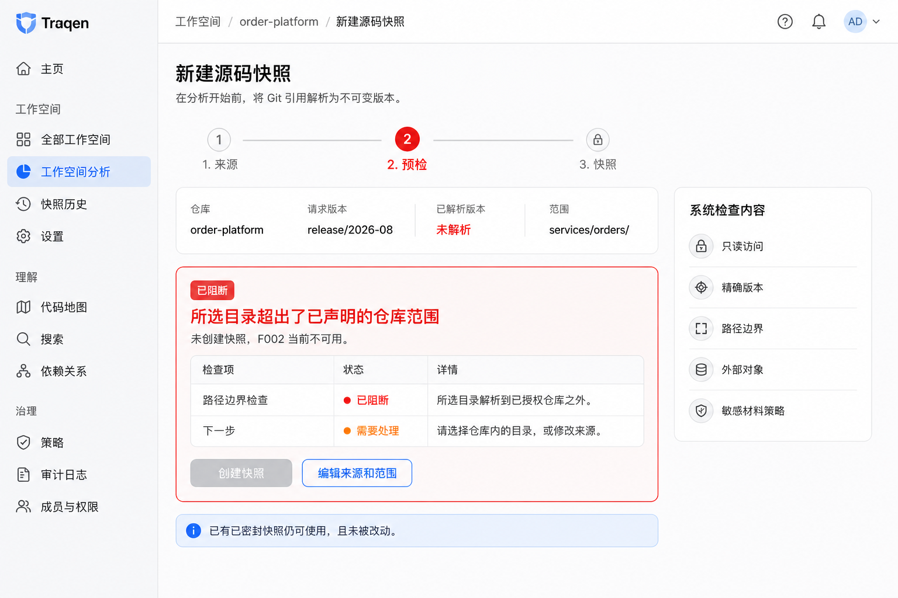

> Language: **English** · [简体中文](README.zh-CN.md)

---
feature_ids: [F001]
related_features: [F002, F003, F004, F006]
topics: [workspace, source-truth, git, source-snapshot, artifact-inventory, coverage-gap, receipt, design-gate]
doc_kind: feature-discussion
created: 2026-08-30
status: proposed
design_gate: operator-review-pending
---

# F001 design proposal — Workspace & Source Truth

## 1. What F001 completes

F001 is complete when an architect can turn one authorized Git repository at one exact commit into a **replayable Source Truth receipt**. The receipt says what Traqen safely captured, what it could not obtain, and whether the next capability may use the result.

In practical terms, the architect can:

1. register an authorized repository, choose a branch/tag/commit, and see it resolved to an exact commit;
2. keep the whole repository or deliberately limit the capture to one directory root;
3. automatically preflight and safely capture that fixed source without executing repository code;
4. inspect a complete source-coverage inventory and every known limitation;
5. accept only a non-blocking limitation with a named owner, rationale, and expiry; and
6. hand F002 a qualifying immutable snapshot plus its limitations, rather than a mutable path or branch name.

F001 does **not** yet generate the API tree, infer business functions, execute tests, or advise on change impact. Those are F002–F004. Its outcome is the trustworthy evidence foundation that makes those later results believable.

## 2. Functions, purpose, and the problem each resolves

| Function | What the architect gets | Problem it removes |
| --- | --- | --- |
| Workspace and source registration | One Workspace-bound, read-authorized Git source; credentials remain a protected reference. | Analysis cannot silently use an arbitrary local directory or leak a credential. |
| Exact revision and scope | A resolved commit and either whole-repository scope or one explicit directory root. | A moving branch or a vague “code-only” selection cannot pretend to be stable coverage. |
| Automatic preflight | A clear `can start`, `can start with expected gaps`, or `blocked` decision with remediation. | Permission, path-boundary, integrity, and external-content failures are not discovered only after a misleading scan. |
| Safe immutable capture | A sealed `SourceSnapshot`, created from committed Git objects without executing source code. | Working-tree edits, hooks, builds, and dependency installation cannot change or endanger the evidence. |
| Source Coverage inventory | One disposition and reason for every discovered in-scope item, with a visible scope boundary. | Documentation, configuration, SQL, tests, binaries, and failed reads cannot silently vanish. |
| Coverage Gap management | Blocking gaps remain blockers; non-blocking gaps can be accepted with responsibility, rationale, and expiry. | A click-through warning cannot disguise an integrity failure, while ordinary legacy-system incompleteness remains visible and manageable. |
| Receipt, history, and F002 handoff | `READY` / `READY_WITH_ACCEPTED_GAPS` / `BLOCKED`, retained with prior captures; F002 receives only a qualified input. | Later capabilities cannot derive authoritative-looking conclusions from a path, branch, dirty checkout, or an incomplete capture whose non-blocking limitations were not explicitly accepted and inherited. |

## 3. Alignment with the product vision

| Product vision | F001 contribution | Deliberate boundary |
| --- | --- | --- |
| Help an architect take over an unfamiliar legacy system. | Establishes the exact source baseline before any explanation is attempted. | It does not explain business meaning by itself. |
| Preserve a traceable chain from source to conclusions. | Creates the first durable links: repository → commit → scope → snapshot → inventory → gaps → receipt. | Facts, candidates, claims, tests, and impact links are added by F002–F004. |
| Present a reliable API tree and reviewed business-function tree. | Prevents both trees from looking complete when their source is incomplete. | F001 does not parse APIs or publish either tree. |
| Make the next change safer. | Makes later comparison and impact work refer to a fixed, auditable source. | It neither runs tests nor makes impact recommendations. |
| Prefer an explicit incomplete answer over a persuasive unsupported answer. | Makes exclusions, failed reads, external material, and accepted limitations visible and inherited. | It cannot convert a blocking safety or integrity condition into a usable result. |

Therefore F001 is aligned with the vision as its **truthful source foundation**, not as a standalone legacy-understanding product. Its success criterion is not “the scan finished”; it is “a later result can name and defend its exact input and limitations.”

## 4. Design status and reading order

This is an operator-review proposal for the already approved F001 product boundary. It is not authorization to implement. It implements, and does not reopen, [ADR-0003](../../docs/decisions/ADR-0003-source-truth-boundary.md).

Sections 1–3 explain the product outcome. The remaining sections explain how the design achieves it.

```text
Architecture cell: source-truth (new cell required)
Map delta: new cell required
Why: source identity, capture authority, sealed evidence, and downstream admission have no
single runtime owner in the current architecture map.
```

The future `source-truth` cell owns registration, capture lifecycle, snapshots, inventory, gaps, receipts, and F002 admission. It does not own F002 extraction, F003 review, F004 impact/execution, or F006 settings. This is an F303 authority/consumer change: `SourceTruthRepository` is the canonical source; F002 receives a `QualifiedSourceInput`, never a path, ref, working tree, or credential; contract tests prove that rule.

## 5. Logical architecture

```text
Workspace
  │ source, requested ref, optional directory root
  ▼
SourceRegistration → SourceCaptureRun → SourcePreflight
                                            │
                     BLOCKED receipt ◄──────┘ pass / warn
                                            ▼
GitSourceGateway → committed tree/blob reader → staged SourceSnapshot
                                                  │        │
                                                  ▼        ▼
                                          ArtifactInventory  CoverageGap(s)
                                                                  │
                                                   GapAcceptance (non-blocking only)
                                                                  ▼
                                                         SourceTruthReceipt
                                               READY | READY_WITH_ACCEPTED_GAPS
                                                                  │
                                                                  ▼
                                                SourceTruthAdmission → F002
                                              (snapshot + inventory + inherited gaps)
```

`SourceCaptureRun` records operational progress, cancellation, and retry. A sealed source result records immutable evidence and downstream eligibility. The two lifecycles are separate so a partial run cannot masquerade as a partial snapshot, and a retry cannot rewrite history.

## 6. Canonical records and invariants

| Record | Responsibility | Non-negotiable invariant |
| --- | --- | --- |
| `Workspace` | Authorization and isolation aggregate. | Each F001 record belongs to one Workspace; metadata has the same access boundary as content. |
| `SourceRegistration` | Read-authorized Git identity and credential reference. | Never stores raw credentials. A branch/tag selects a commit; it is not snapshot identity. |
| `CapturePolicyRevision` | Platform-owned scanner, redaction, size, and Git-safety rules. | Users do not edit integrity/safety rules; old results retain their original policy revision. |
| `SourceCaptureRun` | One resolve/preflight/capture/seal attempt. | Retry creates a new run; failure and cancellation remain auditable; a run never follows a moving branch. |
| `SourcePreflightReport` | Automatic source, authorization, commit, root, boundary, external-content, and safety evidence. | `PASS`/`WARN`/`BLOCK` always carry reason codes and a next action. A warning is not itself a Gap. |
| `SourceSnapshot` | Immutable result for repository identity + resolved commit + scope + policy. | Identity excludes capture time and includes ordered inventory digest. Sealed snapshots never mutate. |
| `ArtifactInventory` | Coverage denominator and one per-artifact disposition. | Every discovered in-scope item has exactly one disposition and reason; summary counts equal detail. A directory-root result visibly limits whole-repo coverage. |
| `CoverageGap` | Known analysis limitation. | Append-only; it cannot be edited into coverage. Only a later snapshot can demonstrate resolution. |
| `GapAcceptance` | Human acknowledgement of one non-blocking Gap. | Append-only; responsible person, rationale, and expiry are mandatory. Blocking gaps have no acceptance action. |
| `SourceTruthReceipt` | Immutable evidence/eligibility decision. | `READY` requires sealed source and zero relevant gaps; `READY_WITH_ACCEPTED_GAPS` needs valid acceptances; `BLOCKED` is never consumable. |
| `QualifiedSourceInput` | F002-only result of admission. | Carries receipt, snapshot, inventory, policy, and all inherited gaps—but no direct source locator or credential. |

The visible dispositions must at least distinguish safely captured, policy-isolated, redacted, external/unavailable, unreadable/failed, unsupported/binary, and outside the selected directory root. A disposition says what happened to an item; a Gap says how that fact limits later conclusions. Material limitations require both. Neither record may leak raw sensitive content or credentials.

## 7. Capture lifecycle

The published receipt has exactly the three product states specified above; `AWAITING_GAP_DECISION` is only a run state.

```text
REQUESTED → PREFLIGHTING
  ├─ blocked ───────────────────────────────► BLOCKED receipt
  └─ READY_TO_CAPTURE → CAPTURING
       ├─ cancellation requested ───────────► CANCELLED
       ├─ read/integrity failure ───────────► CAPTURE_FAILED
       └─ SEALING (atomic; cancellation closes)
            ├─ safety/integrity block ──────► BLOCKED receipt
            └─ SEALED
                 ├─ any blocking CoverageGap ► BLOCKED receipt
                 ├─ no relevant gaps ───────► READY receipt
                 └─ only non-blocking gaps ─► AWAITING_GAP_DECISION
                                                └─ valid acceptance
                                                   ► READY_WITH_ACCEPTED_GAPS receipt
```

- Resolve a requested branch/tag/commit to a full commit ID before capture. Identity, permission, path-boundary, policy, integrity, or tampering uncertainty blocks early.
- Enumerate the committed Git tree and read immutable Git blobs. Do not read a mutable user working tree after ref resolution; do not run hooks, filters, scripts, builds, or dependency installation.
- Stage privately and make snapshot/inventory visible in one atomic seal. Staging data is never listable or consumable.
- Cancellation records the run and produces no qualifying snapshot. Retry is a fresh run pinned to the same commit; a newer branch head requires an explicit new request.
- Receipt publication is append-only. Acceptance expiry makes a receipt ineligible for a new F002 admission; it never erases historical evidence or historical analysis.
- A later failed/cancelled/blocked run never invalidates an earlier ready snapshot.

## 8. Safe-capture interfaces and migration

| Interface | Owns | Never does |
| --- | --- | --- |
| `GitSourceGateway` | Resolve refs, inspect committed trees, and read blobs through a read-only credential reference. | Read mutable working-tree content after resolution or execute source-controlled logic. |
| `SourcePreflightService` | Authorization, commit/root, external-object, symlink/path, and policy checks. | Allow an operator override for integrity/safety blocks. |
| `SnapshotStore` | Workspace-bounded staging, hashing, atomic sealing, verification, retention. | Expose staging or mutate a sealed package. |
| `CoverageAssembler` | Complete inventory and material gaps. | Hide failed/redacted/unavailable/out-of-scope evidence from coverage. |
| `SourceTruthAdmission` | Re-validate eligibility and issue `QualifiedSourceInput`. | Return a path/ref or silently omit inherited gaps. |

The current `LocalSourceSnapshotCapture` is a migration baseline only for atomic staging/seal, digest verification, and path-escape defense. Its local allowlisted-root reader and its direct connection to `WorkspaceAnalysisJob` are incompatible with this design. A server cache/checkout may optimize reads, but resolved Git objects—not a checkout—remain evidence authority. F001 becomes `SourceCaptureRun`; F002 and later work start only after admission.

## 9. User surfaces and observability

The primary surface is the **Source Truth card inside the Workspace**, because source choice, scope, and Gap acceptance are made there—not in a dashboard.

| Surface | Information and action |
| --- | --- |
| Source Truth card | Canonical repository, resolved commit, root, authorization, latest receipt, and why it is usable or blocked; register source, create capture, open receipt. |
| Capture setup | Authorized source picker, ref selector with resolved commit preview, whole repository or one directory root. There is no security-rule editor. |
| Preflight | `Can start` / `Can start with expected gaps` / `Blocked`, each with affected scope and remediation. |
| Capture | Stage rail (preflight → capture → finalizing → receipt), observed counts, current operation, cancellation/retry. Never fake a percentage. |
| Source Coverage | Scope banner, tree/list, dispositions, reasons, counts, Gap links. Root scope visibly states “not whole repository.” |
| Coverage Gaps | Blocking, awaiting decision, accepted-but-still-present; only non-blocking items show an accept control. |
| Receipt & History | Source, commit, scope, integrity identity, policy, inventory, gaps, acceptance validity, F002 eligibility, historical results. |

Every error explains what failed, what scope was not obtained, whether a prior snapshot remains usable, and the next user action. Progress events are aggregated to one latest state per source; deep views retain complete history. Diagnostics are reason-coded and redacted.

## 10. Front-end interaction design proposal

The UI is a **Workspace extension**, not a new dashboard. The supplied screens are an
interaction-design proposal with illustrative data and no backend implementation. They use
Traqen's existing light console language—persistent navigation, white task panels, blue
primary actions, and explicit warning/blocking colours—so the user can make a source decision
where the source belongs.

The visual-design default is **Simplified Chinese**. This makes the reviewable F001 journey
readable to its current operators; it does not make a claim about the eventual runtime locale or
internationalization implementation.

**Design-gate question:** can an architect tell, without opening a diagnostic log, whether a
particular source result is usable for downstream analysis, what limitation F002 will inherit,
and what action is required when it is not usable? The first screen below is the soul frame for
that decision. The second proves that the same surface has an honest recovery path, rather than
only a success state.

The application shell is an invariant, not a state-dependent design choice. Both screens use the
same sidebar, in the same order, with `工作空间分析` selected:

```text
主页
工作空间: 全部工作空间 · 工作空间分析 · 快照历史 · 设置
理解: 代码地图 · 搜索 · 依赖关系
治理: 策略 · 审计日志 · 成员与权限
```

Only the main workspace content changes between a qualifying receipt and a preflight block.

### 10.1 Eligible with an accepted limitation


The receipt is deliberately orange rather than green. `READY_WITH_ACCEPTED_GAPS` means the
sealed snapshot is eligible, **not complete**: the coverage card gives the coverage denominator,
the Gap remains readable with its owner and expiry, and the downstream action says that F002
will inherit the limitation. The user can open the artifact inventory or receipt history before
starting F002; F002 does not receive a live path or working tree.

`Display-redacted` has a deliberately narrower meaning: the content was completely captured and
remains available to authorized downstream analysis, but is omitted from this UI. It is not an
analysis limitation. Conversely, any redaction that prevents analysis from accessing material
must create its own `CoverageGap` and be included in the inherited Gap set; it may never be
represented only as a coverage count. The lower `Artifact inventory` panel names all discovered
records—including out-of-scope and unavailable records—rather than implying all 192 are contents
of the sealed snapshot.

### 10.2 Preflight blocked before capture



Blocking conditions stay in the same user journey. The screen names the failed check, the
affected boundary, and the corrective action; it disables snapshot creation and makes F002
unavailable. It also reassures the user that an earlier sealed snapshot was not changed. There
is no "accept" escape hatch for a safety or integrity blocker.

### 10.3 Screen contract

| Moment | Primary information | Primary action | Honest constraint |
| --- | --- | --- | --- |
| Source setup | authorized repository, requested ref, resolved commit preview, whole-repository or directory-root scope | continue to automatic preflight | no credentials or security-rule editor is exposed |
| Preflight | `can start`, `can start with expected gaps`, or `blocked`, with a reason and affected scope | capture, or edit source/scope | a block cannot be overridden |
| Capture and sealing | stage rail, observed counts, current operation, cancellation/retry | cancel before seal or retry as a new run | progress is event-derived; it never invents a percentage |
| Source Truth receipt | resolved commit, declared scope, receipt status, coverage summary, material gaps, policy and inventory identity | open coverage/history; start F002 only when eligible | display-only redaction is explicitly distinguished; warning limitations remain visible and are inherited |
| Coverage / history detail | every artifact disposition and reason, every Gap, its acceptance validity, and earlier immutable receipts | inspect or create a new capture | an all-record inventory is not mislabeled as sealed content; neither history nor a Gap can be edited into a better result |

The Source Truth card/receipt is the **primary surface**. Coverage and receipt history are the
deep-dive surfaces. The workspace shell displays only the latest state for each source to avoid
event noise; it aggregates progress by stage and preserves the detailed, reason-coded history
behind the receipt.

**Not included in this proposal:** a global dashboard, live log tailing, a raw-secret viewer, a
source-code browser, API/function-tree visualization, or production implementation. Those would
either bypass the source decision or belong to later features.

## 11. F002 admission contract

```ts
type QualifiedSourceInput = {
  workspaceId: string;
  receiptId: string;
  receiptStatus: "READY" | "READY_WITH_ACCEPTED_GAPS";
  receiptValidUntil: string | null;
  sourceSnapshotId: string;
  repositoryIdentity: string;
  resolvedCommit: string;
  declaredScope: { kind: "REPOSITORY" } | { kind: "DIRECTORY_ROOT"; path: string };
  inventoryId: string;
  inventoryDigest: string;
  policyRevisionId: string;
  inheritedGaps: ReadonlyArray<{ gapId: string; severity: "NON_BLOCKING"; affectedScope: string; reasonCode: string }>;
};
```

Admission requires Workspace access, a sealed and integrity-verified snapshot/inventory, an exactly matching current qualifying receipt, valid acceptances, and no blocker/tampering signal. It rejects direct paths, Git URLs, standalone refs/commits, dirty checkouts, partial snapshots, expired acceptances, and all blocked outcomes.

F002 persists receipt/snapshot/inventory/policy identities and the *complete inherited gap set* on every derived result. It can create a separate extraction-layer Gap linked to an F001 Gap; it cannot modify, suppress, downgrade, or re-accept F001’s Gap. F003/F004 get source provenance through F002 only.

## 12. Reference pilot

Use a disposable Git fixture seeded from the order-platform reference artifacts, with fixed commits A and B—not a developer working tree.

| Case | Expected proof |
| --- | --- |
| Whole repository, commit A | Code, docs, config, SQL, and tests all have exactly one disposition. |
| `services/orders/` root, commit A | Receipt names the root and visibly declares all other repository content out of scope. |
| Unavailable LFS-like object in A | A non-blocking Gap requires rationale/expiry; F002 receives it after `READY_WITH_ACCEPTED_GAPS`. |
| Replay A; then move branch | Same snapshot/inventory identities on replay; branch movement does not alter the old source result. |
| Cancel, then retry A | Cancelled run has audit only; retry is a new run and old ready results remain usable. |
| Path-escape symlink or integrity mismatch in B | `BLOCKED`, no accept control, no F002 admission. |
| Package script plus sensitive fixture | Neither code execution nor raw secret exposure occurs. |
| F002 receipt vs direct input | Only the qualified receipt starts F002; its inherited Gap appears in F002 output. |

The key failure mode is a **false-green receipt**: material silently disappears yet a ready state is issued. The defense is Git-object capture, inventory conservation, explicit dispositions, material gaps, atomic seal, immutable receipt evidence, and mandatory downstream inheritance.

## 13. Review outcome and next gate

Independent reviews by 砚砚 and Kimi agreed on the records, user journey, state machine, F002 inheritance, and negative pilot. This proposal resolves the two meaningful design differences:

- `SourceRegistration` remains separate from `Workspace`, so source authorization and snapshot history are independently auditable while Workspace stays the access aggregate.
- Snapshot/inventory seal immediately after capture; human Gap acceptance produces a later eligibility receipt and never mutates source evidence.

ADR-0003 already contains the relevant rejected alternatives, so no new ADR is required. No new general operating rule or lesson was discovered.

**Next:** operator review, then establish the `source-truth` ownership map and an interactive in-context design demo. Do not begin implementation before those gates.
