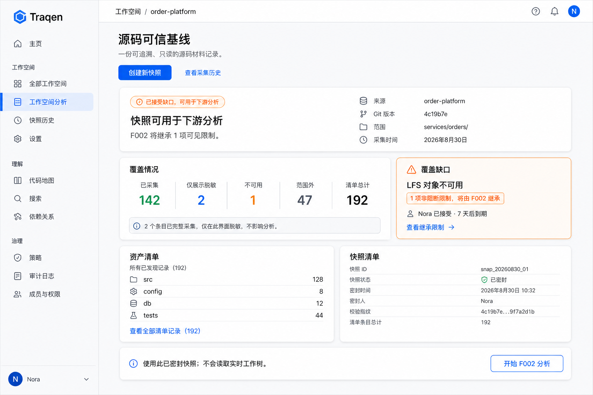
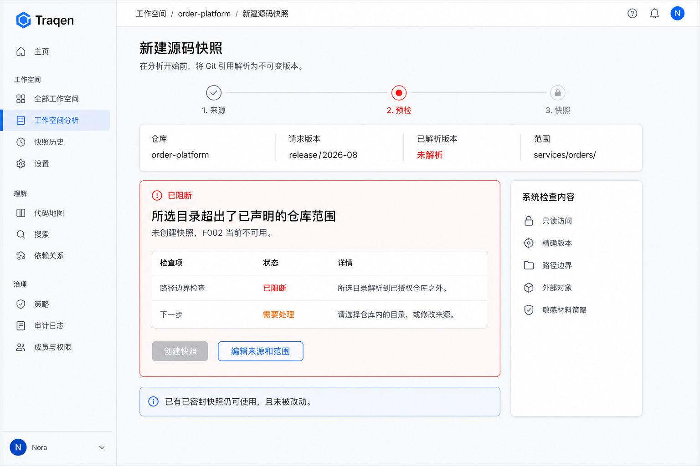

> Language: [English](README.md) · **简体中文**

---
feature_ids: [F001]
related_features: [F002, F003, F004, F006]
topics: [workspace, source-truth, git, source-snapshot, artifact-inventory, coverage-gap, receipt, design-gate]
doc_kind: feature-discussion
created: 2026-08-30
status: proposed
design_gate: operator-review-pending
---

# F001 方案设计 — Workspace & Source Truth

## 1. F001 完成时，用户得到什么

当架构师能把一个已授权 Git 仓库的某个精确 commit，变成一份**可重放的 Source Truth Receipt** 时，F001 才算完成。Receipt 明确回答：Traqen 安全采集了什么、没有获得什么、下一项能力能不能使用这份结果。

具体而言，架构师可以：

1. 登记一个已授权的仓库，选择 branch/tag/commit，并看到它被解析为精确 commit；
2. 采用全仓默认范围，或有意识地选择一个目录根；
3. 自动预检，并在不执行仓库代码的前提下安全采集这份固定源码；
4. 查看完整的源码覆盖清单和每一项已知限制；
5. 仅对非阻断限制，以负责人、理由和有效期做接受；
6. 将合格的不可变 snapshot 连同限制交给 F002，而不是交一个会变化的路径或 branch 名称。

F001 **不会**产生 API 树、推断业务功能、执行测试或给出变更影响建议；这些分别属于 F002–F004。F001 的产物是可信证据地基，后续结果才有资格被相信。

## 2. 功能清单、作用与解决的问题

| 功能 | 架构师获得什么 | 解决什么问题 |
| --- | --- | --- |
| Workspace 与来源登记 | 一个绑定 Workspace、已获只读授权的 Git 来源；凭据只是受保护的引用。 | 分析不能悄悄使用任意本地目录，也不会泄露凭据。 |
| 精确版本与范围 | 已解析 commit，以及全仓或一个明确目录根。 | 移动中的 branch 或模糊的“只扫代码”不能伪装成稳定覆盖。 |
| 自动预检 | `可开始` / `可带预期 Gap 开始` / `已阻断`，并给出修复动作。 | 权限、路径边界、完整性、外部内容问题不会等扫描成功后才暴露。 |
| 安全不可变采集 | 从 committed Git object 生成、且不执行源码的 sealed `SourceSnapshot`。 | working tree 修改、hook、构建、依赖安装不会改变或威胁证据。 |
| Source Coverage 清单 | 每项范围内已发现产物都有 disposition/reason，范围边界可见。 | 文档、配置、SQL、测试、二进制及读取失败不能静默消失。 |
| Coverage Gap 管理 | 阻断 Gap 保持阻断；非阻断 Gap 可带负责人、理由、有效期被接受。 | 不能用一次点击掩盖完整性失败，同时常见存量系统的不完整性仍然可见、可管理。 |
| Receipt、历史与 F002 交接 | `READY` / `READY_WITH_ACCEPTED_GAPS` / `BLOCKED` 和历史采集；F002 只接收合格输入。 | 后续能力不能基于路径、branch、dirty checkout，或非阻断限制未经显式接受并继承的不完整采集，产出看似权威的结论。 |

## 3. 与愿景是否一致

| 产品愿景 | F001 的贡献 | 刻意的边界 |
| --- | --- | --- |
| 帮架构师接管陌生的存量系统。 | 在解释任何内容前，先建立精确源码基线。 | 它本身不解释业务含义。 |
| 从源码到结论保留可追溯链路。 | 建立第一段长期有效链路：仓库 → commit → 范围 → snapshot → inventory → Gap → Receipt。 | Fact、Candidate、Claim、测试、影响链路由 F002–F004 补齐。 |
| 展示可信 API 树和经过审核的业务功能树。 | 防止两棵树在来源不完整时仍表现得像“完整”。 | F001 不解析 API，也不发布任一棵树。 |
| 让下一次变更更安全。 | 后续比较与影响分析能引用一份固定、可审计的源码。 | 不运行测试，也不产生影响建议。 |
| 宁可明确不完整，也不输出看似可信但无证据的答案。 | 排除项、读取失败、外部材料、已接受限制均显式可见并被继承。 | 阻断安全/完整性条件不能被转成可用结果。 |

所以 F001 与愿景一致，但它是**诚实的源码地基**，不是独立完成“存量理解”的产品。它的成功标准不是“扫描跑完”，而是“后续结论能明确说出并证明自己基于什么输入、受什么限制”。

## 4. 方案状态与阅读顺序

本文件是对已确认 F001 产品边界的**方案设计提案**，等待 co-creator 审阅；它不授权写实现代码，也不重新讨论 [ADR-0003](../../docs/decisions/ADR-0003-source-truth-boundary.zh-CN.md) 已经确定的边界。

第 1–3 节先说明产品产出；后续章节再解释用什么设计保证这些产出。

```text
Architecture cell: source-truth（需要新建）
Map delta: new cell required
Why: 来源身份、采集权威、密封证据、下游准入现在没有唯一运行时 owner。
```

未来的 `source-truth` cell 只拥有来源登记、采集生命周期、快照、清单、Gap、Receipt 与 F002 准入；不拥有 F002 提取、F003 审核、F004 执行/影响或 F006 设置。这是 F303 的 authority/consumer 变化：`SourceTruthRepository` 是唯一权威，F002 只收到 `QualifiedSourceInput`，绝不收到路径、ref、working tree 或凭据；合同测试必须证明这点。

## 5. 总体架构

```text
Workspace
  │ 来源、请求版本、可选目录根
  ▼
SourceRegistration → SourceCaptureRun → SourcePreflight
                                            │
                     BLOCKED receipt ◄──────┘ 通过 / 有预期 Gap
                                            ▼
GitSourceGateway → committed tree/blob reader → staged SourceSnapshot
                                                  │        │
                                                  ▼        ▼
                                          ArtifactInventory  CoverageGap(s)
                                                                  │
                                                   GapAcceptance（仅非阻断）
                                                                  ▼
                                                         SourceTruthReceipt
                                               READY | READY_WITH_ACCEPTED_GAPS
                                                                  │
                                                                  ▼
                                                SourceTruthAdmission → F002
                                              （snapshot + inventory + inherited gaps）
```

`SourceCaptureRun` 记录操作进度、取消和重试；密封来源结果记录不可变证据和下游资格。二者分开，避免半成品运行伪装成半成品快照，也避免重试改写历史。

## 6. 领域对象与不变量

| 对象 | 职责 | 不变量 |
| --- | --- | --- |
| `Workspace` | 授权与隔离聚合根。 | 每条 F001 记录只属于一个 Workspace；元数据与内容遵守同一访问边界。 |
| `SourceRegistration` | 已获只读授权的 Git 身份与凭据引用。 | 不存裸凭据；branch/tag 只选择 commit，不作为 snapshot 身份。 |
| `CapturePolicyRevision` | 平台拥有的扫描器、脱敏、大小、Git 安全规则。 | 用户不能编辑完整性/安全规则；历史结果永久绑定原 policy。 |
| `SourceCaptureRun` | 一次 resolve/preflight/capture/seal 尝试。 | 重试新建 run；失败/取消可审计；一个 run 不会跟随移动 branch。 |
| `SourcePreflightReport` | 自动的来源、授权、commit、root、边界、外部内容与安全证据。 | `PASS`/`WARN`/`BLOCK` 都有 reason code 和下一步；WARN 不等于最终 Gap。 |
| `SourceSnapshot` | repository identity + resolved commit + scope + policy 的不可变结果。 | identity 不含采集时间，包含排序 inventory digest；sealed 后不能变。 |
| `ArtifactInventory` | 覆盖率分母和逐项 disposition。 | 每条已发现、范围内条目恰有一种 disposition/reason；汇总等于明细。目录根结果必须明确不是全仓。 |
| `CoverageGap` | 已知分析限制。 | append-only，不能编辑为已覆盖；只有新 snapshot 能证明解决。 |
| `GapAcceptance` | 对非阻断 Gap 的人类负责确认。 | append-only，必须有负责人、理由、有效期；阻断 Gap 没有 accept 操作。 |
| `SourceTruthReceipt` | 不可变证据/资格决策。 | `READY`=密封来源且无相关 Gap；`READY_WITH_ACCEPTED_GAPS`=密封来源且接受有效；`BLOCKED` 永不可消费。 |
| `QualifiedSourceInput` | F002 专属的准入结果。 | 包含 receipt、snapshot、inventory、policy 与完整 inherited Gap；没有直接 source locator 或凭据。 |

用户至少必须能看出：安全采集、平台策略隔离、敏感脱敏、外部不可得、不可读/失败、不支持/二进制、目录根外。disposition 说明“对条目发生了什么”，Gap 说明“这会怎样限制后续结论”；有实质限制时两者都必须存在。两种记录都不得泄露原始敏感内容或凭据。

## 7. 采集状态机

对外 Receipt 始终只有 `READY`、`READY_WITH_ACCEPTED_GAPS`、`BLOCKED` 三种状态；`AWAITING_GAP_DECISION` 只是 Capture Run 状态。

```text
REQUESTED → PREFLIGHTING
  ├─ blocked ───────────────────────────────► BLOCKED receipt
  └─ READY_TO_CAPTURE → CAPTURING
       ├─ cancellation requested ───────────► CANCELLED
       ├─ read/integrity failure ───────────► CAPTURE_FAILED
       └─ SEALING（原子边界，不能再取消）
            ├─ safety/integrity block ──────► BLOCKED receipt
            └─ SEALED
                 ├─ 存在阻断型 CoverageGap ─► BLOCKED receipt
                 ├─ 无相关 Gap ─────────────► READY receipt
                 └─ 仅有非阻断 Gap ─────────► AWAITING_GAP_DECISION
                                                └─ 有效接受
                                                   ► READY_WITH_ACCEPTED_GAPS receipt
```

- 先将 branch/tag/commit 解析到完整 commit ID，再采集；身份、授权、边界、完整性、路径安全或篡改信号不可信时，提前阻断。
- 遍历 resolved Git tree、读取 immutable Git blob；解析之后绝不读取用户可变 working tree；不得执行 hook、filter、仓库脚本、构建或依赖安装。
- 私有 staging，只有一次原子 seal 才能让 snapshot/inventory 可见；半成品从不可列出、不可消费。
- 取消只保留 run 审计，不产生可消费 snapshot；重试必须新建 run，默认仍锁定原 commit。若要采集移动后的 branch，必须显式新开请求。
- receipt append-only。Gap 接受过期只会让 receipt 不能用于新的 F002 准入，不会抹去历史证据或历史分析。
- 后续 failed/cancelled/blocked run 不得使更早 READY snapshot 失效。

## 8. 安全采集、迁移边界

| 接口 | 职责 | 禁止 |
| --- | --- | --- |
| `GitSourceGateway` | 用只读凭据引用 resolve ref、检查 committed tree、读取 blob。 | 解析后读 mutable working tree，或执行 source-controlled logic。 |
| `SourcePreflightService` | 授权、commit/root、外部对象、symlink/path、policy 检查。 | 让用户覆盖完整性/安全 block。 |
| `SnapshotStore` | Workspace 边界中的 staging、hash、原子 seal、校验、留存。 | 暴露 staging 或修改 sealed package。 |
| `CoverageAssembler` | 完整 inventory 与 material Gap。 | 从 coverage 中隐藏失败/脱敏/不可用/范围外证据。 |
| `SourceTruthAdmission` | 重验资格，签发 `QualifiedSourceInput`。 | 返回 path/ref，或静默遗漏 inherited Gap。 |

`LocalSourceSnapshotCapture` 只可复用 staging/seal/digest/path-escape 的安全经验。它现在的本地 allowlisted-root reader、逐项强制 digest、直接连接 `WorkspaceAnalysisJob` 均与新合同不符。新 F001 必须以 resolved Git objects 为证据权威；服务器 cache/checkout 至多是性能优化。F001 变成 `SourceCaptureRun`，F002 及后续工作只能在准入后启动。

## 9. 用户界面与现场可观测性

**Workspace 内的 Source Truth 卡** 是用户判断“来源能不能用”的主现场；不能只放在仪表盘，因为来源、范围和 Gap 接受正是在该 Workspace 上决定。

| 界面 | 信息与动作 |
| --- | --- |
| Source Truth 卡 | 规范仓库、resolved commit、root、授权、最新 receipt、为何可用/阻断；登记来源、新建采集、打开 receipt。 |
| 采集设置 | 已授权来源、ref、resolved commit 预览、全仓/单目录根；没有安全规则编辑器。 |
| 预检 | `可开始` / `可带预期 Gap 开始` / `已阻断`，每条含范围和修复动作。 |
| 采集 | 阶段条：预检 → 采集 → 最终化 → receipt；条目计数、当前操作、取消/重试；禁止假百分比。 |
| Source Coverage | scope 横幅、树/列表、disposition、理由、计数、Gap 链接；目录根明确“非全仓”。 |
| Coverage Gaps | 阻断、等待决策、已接受但仍存在；只有非阻断项可接受。 |
| Receipt & History | 来源、commit、范围、完整性 identity、policy、inventory、Gap、接受有效性、F002 资格、历史结果。 |

每个错误必须说明：失败了什么、哪段范围没获得、旧 snapshot 是否仍可用、下一步是什么。进度默认聚合为每个 source 的最新状态，深层界面保留完整历史；诊断使用 reason code 并脱敏。

## 10. 前端交互设计提案

界面是 **Workspace 的扩展**，不是另建仪表盘。下列界面稿是带示例数据的交互设计提案，不含后端实现。它延续 Traqen 现有的浅色控制台语言——常驻导航、白色任务面板、蓝色主动作，以及明确的警告/阻断色——让用户在来源所属的 Workspace 内作出来源决策。

视觉稿默认使用**简体中文**，使当前 operator 能直接审阅 F001 旅程；这不承诺最终产品运行时语言或国际化实现方式。

**设计门问题：** 架构师是否无需打开诊断日志，就能判断某份来源结果能否用于后续分析、F002 会继承什么限制，以及不可用时该做什么？下面第一张是回答这个问题的核心画面；第二张证明同一现场有诚实的恢复路径，而不是只展示成功态。

应用壳层是固定约束，不随状态改变。两张图都使用相同顺序的左侧导航，且固定选中 `工作空间分析`：

```text
主页
工作空间：全部工作空间 · 工作空间分析 · 快照历史 · 设置
理解：代码地图 · 搜索 · 依赖关系
治理：策略 · 审计日志 · 成员与权限
```

合格 Receipt 与预检阻断之间，只有 Workspace 主内容区可以变化。

### 10.1 可用，但带已接受限制



Receipt 刻意使用橙色而不是绿色。`READY_WITH_ACCEPTED_GAPS` 表示 sealed snapshot 可用，**不表示完整**：coverage 卡给出覆盖分母，Gap 仍展示负责人和有效期，下游动作明确 F002 会继承这项限制。用户可在启动 F002 前打开 artifact inventory 或 receipt history；F002 拿到的不是实时路径或 working tree。

`Display-redacted` 的含义被刻意收窄：内容已完整采集，且仍可供获授权的下游分析使用，只是不在这个界面中展示；它不是分析限制。反过来，任何使分析无法取得材料的脱敏都必须生成独立的 `CoverageGap`，并进入 inherited Gap 集；不能只作为一个 coverage 计数出现。下方的 `Artifact inventory` 面板指的是所有已发现记录（包括范围外与不可用记录），不会暗示 192 项都属于 sealed snapshot 内容。

### 10.2 采集前被阻断



阻断条件留在同一条用户旅程里。界面说明失败检查、受影响边界和修复动作；它禁用 snapshot 创建，并明确 F002 当前不可用。同时它说明早先 sealed snapshot 没有被改动。安全或完整性 blocker 没有“接受”这一逃生入口。

### 10.3 界面合同

| 时刻 | 首要信息 | 首要动作 | 必须诚实呈现的约束 |
| --- | --- | --- | --- |
| 来源设置 | 已授权仓库、请求 ref、resolved commit 预览、全仓或目录根范围 | 继续自动预检 | 不暴露凭据或安全规则编辑器 |
| 预检 | `可开始` / `可带预期 Gap 开始` / `已阻断`，以及原因和受影响范围 | 采集，或修改来源/范围 | blocker 不能被覆盖 |
| 采集和 seal | 阶段条、已观测计数、当前操作、取消/重试 | seal 前取消，或以新 run 重试 | 进度基于事件，不伪造百分比 |
| Source Truth Receipt | resolved commit、声明范围、receipt 状态、覆盖汇总、material Gap、policy 和 inventory identity | 打开 coverage/history；仅合格时启动 F002 | 明确区分仅展示脱敏；警告限制一直可见且必被继承 |
| Coverage / History 详情 | 每项 artifact disposition/reason、每个 Gap、其接受有效性以及早期不可变 receipt | 审阅，或新建采集 | 不把全量记录清单误标为 sealed 内容；history 或 Gap 都不能被编辑成更好的结果 |

Source Truth 卡/Receipt 是**主现场**；coverage 和 receipt history 是深入查看界面。为避免事件噪声，Workspace shell 对每个 source 只显示最新状态，按阶段汇总进度，把完整、带 reason code 的历史保留在 receipt 后。

**本提案不包含：** 全局仪表盘、实时日志尾随、原始秘密查看器、源码浏览器、API/功能树可视化或生产实现。它们要么绕开来源决策，要么属于后续功能。

## 11. F002 准入合同

```ts
type QualifiedSourceInput = {
  workspaceId: string;
  receiptId: string;
  receiptStatus: "READY" | "READY_WITH_ACCEPTED_GAPS";
  receiptValidUntil: string | null;
  sourceSnapshotId: string;
  repositoryIdentity: string;
  resolvedCommit: string;
  declaredScope: { kind: "REPOSITORY" } | { kind: "DIRECTORY_ROOT"; path: string };
  inventoryId: string;
  inventoryDigest: string;
  policyRevisionId: string;
  inheritedGaps: ReadonlyArray<{ gapId: string; severity: "NON_BLOCKING"; affectedScope: string; reasonCode: string }>;
};
```

准入要求：调用者有 Workspace 权限；snapshot/inventory 已密封并验真；receipt 精确匹配且当前可消费；相关接受未过期；不存在 blocker/篡改。它拒绝 direct path、Git URL、单独 ref/commit、dirty checkout、partial snapshot、过期接受和全部 BLOCKED 结果。

F002 的每个派生结果固化 receipt/snapshot/inventory/policy 身份与**完整 inherited Gap 集**。F002 可创建独立的解析层 Gap 并链接 F001 Gap，但不得修改、隐藏、降级或重新接受 F001 Gap。F003/F004 只能经由 F002 得到来源 provenance。

## 12. 参考试点

使用由 order-platform 参考产物播种的一次性 Git fixture，含固定 commit A/B，不使用开发者 working tree。

| 用例 | 必须证明 |
| --- | --- |
| 全仓 commit A | code/docs/config/SQL/tests 每项恰有一个 disposition。 |
| A 的 `services/orders/` 根 | receipt 命名 root，并显式标示其他仓库内容范围外。 |
| A 有不可得 LFS-like object | 非阻断 Gap 要理由/有效期；`READY_WITH_ACCEPTED_GAPS` 后 F002 能看到它。 |
| 重放 A 后移动 branch | snapshot/inventory identity 不变；老结果不变。 |
| 取消后重试 A | cancelled run 只有审计；重试是新 run，旧 READY 仍可用。 |
| B 有 path-escape symlink/integrity mismatch | `BLOCKED`，没有 accept，F002 不能准入。 |
| package script + sensitive fixture | 不执行代码，也不泄露原始秘密。 |
| F002 receipt 与 direct input | 只有合格 receipt 能启动 F002，Gap 进入其输出。 |

首要失效模式是 **false-green receipt**：材料静默消失却被宣称 READY。防线是 Git-object capture、inventory 守恒、显式 disposition、material Gap、原子 seal、不可变 receipt 和强制下游继承。

## 13. 审阅结论与下一门

砚砚与 Kimi 的独立审阅在对象、旅程、状态机、F002 继承和负向试点上达成一致。两项收敛为：

- `SourceRegistration` 与 `Workspace` 分离，以便来源授权和 snapshot 历史独立审计；Workspace 保持访问聚合根。
- capture 后立即 seal snapshot/inventory；人类 Gap 接受只产生后续资格 receipt，绝不改写来源证据。

ADR-0003 已包含相关 rejected alternatives，不需要新 ADR；本轮没有新的通用 operating rule/lesson。

**下一步：** co-creator 审阅本方案；获批后先建立 `source-truth` ownership map 与可交互、在上下文中的 Source Truth 设计 demo。在这两个 gate 之前不开始实现。
