# F001 方案设计 — Workspace & Source Truth

> 本轮设计仅维护中文；[英文旧版](README.md)保留作历史参考，不与本轮修订视为等价。设计已确认并获文档修改授权，产品实现未获授权。

**阅读顺序：** 先看 §1–2 的产品结果，再看 §10.1 的八站界面与流转合同；存储、恢复和安全见 §7–8；独立验收清单见 §12。本文即 co-creator 指定的“文件 B”，是当前 F001 设计真相源；旧 Feature Spec（文件 A）不能反向约束或回退本方案。

## 1. F001 完成时，用户得到什么

当架构师能把一个选定的 Git 版本、一个选定的目录或二者，变成一份**长期保存、可恢复、可重放的冻结来源包及 Source Truth Receipt** 时，F001 才算完成。Receipt 明确记录采集了哪些来源组件、哪些材料没有取得及版本身份。第 8 站的终点是“冻结来源包”，不是“启动 F002”；后续使用时另行检查当前准入资格。

首期文件存入 **Traqen 部署机的专用持久化数据卷**，任务、清单和版本等记录存入 **PostgreSQL**。不存进项目源码、设计 `assets/` 或浏览器会话。关闭页面不删除任务；冻结后原 Git/目录离线也不影响已有内容的重放。单节点故障时允许暂停服务并从配套备份恢复，不承诺首期高可用。

具体而言，架构师可以：

1. 创建或打开 Workspace，分别添加**Git 来源**和/或**目录资料**；至少需要一个，两个同时添加时共同定义一份分析范围；
2. 选择 Git branch/tag/ref 并看到精确解析的 commit，和/或选择一个目录并看到所有已选文件均被验证；
3. 让 Traqen 自动预检来源，并在不执行用户控制代码的前提下采集；
4. 查看带组件身份的完整来源清单、覆盖限制、Receipt 和不可变历史；
5. 在来源变化后创建新版本：比较 Git commit 或重新选择目录的 manifest，只传输变化字节；以及
6. 将合格的不可变来源包及继承限制交给 F002，而不是交一个会变化的路径或 branch。

首期允许一个 Git 组件、一个上传目录组件，或两者同时存在。组合来源是带命名空间的并集，不是自动合并：同名路径仍是不同记录。F001 **不会**产生 API 树、推断业务功能、执行测试或给出变更影响建议；这些分别属于 F002–F004。F001 的产物是可信来源地基，后续结果才有资格被相信。

## 2. 功能清单、作用与解决的问题

| 功能 | 架构师获得什么 | 解决什么问题 |
| --- | --- | --- |
| Workspace 与来源选择 | 两张相互独立的 Workspace 来源卡：Git 可添加或不添加；目录可添加或不添加；至少需要一个。Git 凭据保持受保护；目录上传带用户/会话审计。 | 用户不必选择误导性的第三种“Git+目录”类型；分析不能悄悄使用任意本地目录，也不会泄露凭据。 |
| 精确组件身份 | Git ref 被解析为 commit；目录由已验证 manifest 表达。组件保留原生身份。 | 移动中的 branch、本地目录或伪装成 commit 的目录不能冒充稳定证据。 |
| 自动预检 | `可开始` / `可带预期 Gap 开始` / `已阻断`，并给出原因和修复动作。 | 授权、路径安全、限制和完整性问题不会等误导性扫描结束才暴露。 |
| 安全不可变采集 | 已密封组件快照和一个 `SourceBundleSnapshot`；不执行仓库脚本、构建、hook、filter、依赖安装或上传内容。 | 来源控制的行为和 working tree 修改不能改变或威胁证据。 |
| Source Coverage 清单 | 每个已发现条目都有带组件身份的定位符、disposition 和 reason；大规模时可搜索、分页。 | 文档、配置、SQL、测试、二进制、读取失败以及组件内同名文件不能静默消失。 |
| Coverage Gap 管理 | 阻断失败保持阻断；非阻断限制仅能以负责人、理由和有效期接受。 | 不能用点击警告掩盖完整性失败，同时常见存量系统的不完整性仍然可见、可管理。 |
| 版本历史与文件 Delta | 用户显式操作后得到一份完整不可变新版本；两份已密封 manifest 间的 add/modify/delete 证据。 | 影响分析不能比较移动来源，同时未变化的 50,000 文件组件不被复制或重传。 |
| Receipt 与 F002 交接 | `READY` / `READY_WITH_ACCEPTED_GAPS` / `BLOCKED` 及历史；F002 只接收合格来源包/输入。 | 后续能力不能基于路径、branch、部分上传，或未经接受的限制，产出看似权威的结论。 |
| 保存、恢复与容量 | 服务端持久化任务和历史；重选目录后核对续传；容量不足时暂停新增；数据库与文件配套备份。 | 刷新、断网、重启或原来源消失不会被误当作任务取消或历史丢失；缺少备份的历史不冒充可恢复。 |

## 3. 与产品愿景的对齐

| 产品愿景 | F001 的贡献 | 刻意边界 |
| --- | --- | --- |
| 帮架构师接管陌生的存量系统。 | 在解释任何内容前，先建立精确材料基线。 | 它本身不解释业务含义。 |
| 从来源到结论保留可追溯链路。 | 建立第一段长期有效链路：来源组件 → 不可变 manifest → 来源包 → inventory/Gap → Receipt → F002 provenance。 | Fact、Candidate、Claim、测试证据、影响链路由 F002–F004 补齐。 |
| 展示可信 API 树和经过审核的业务功能树。 | 防止任一棵树在其底层来源不完整时仍表现得像“完整”。 | F001 不解析 API，也不发布任一棵树。 |
| 让下一次变更更安全。 | 保留可比较来源版本和诚实的文件级 Delta 供后续影响工作使用。 | 不推断影响、不运行测试、不建议复验。 |
| 宁可明确不完整，也不输出看似可信但无证据的答案。 | 排除项、读取失败、脱敏限制、外部材料、已接受 Gap 都显式可见并被继承。 | 阻断安全/完整性条件不能被转成可用结果。 |

因此，F001 与愿景一致，但它是**诚实的来源地基**，不是独立完成“存量理解”的产品。它的成功标准不是“扫描跑完”，而是“后续结论能说出并证明它基于什么输入、什么版本、受什么限制”。

## 4. 方案状态与权威

本文件是已获 co-creator 确认的 F001 方案设计。[ADR-0003](../../docs/decisions/ADR-0003-source-truth-boundary.zh-CN.md)保留决策背景；当前产品行为与验收以本文为准。2026-09-06 的确认覆盖单节点存储、八站生命周期和恢复方案；文档授权原文为“不用做双语设计了，只用中文即可。授权你修改，仅更新设计文档。”（消息 `0001788694315222-000093-757d8776`）。随后 co-creator 明确“以文件B的为准，文件A有点过时了”（`0001788697307275-000096-73b7de6e`），并要求“将B文件的方案设计完善”（`0001788697442248-000099-a92055fb`）。本次只完善本文，不再同步 A，不修改英文、HTML/PNG、代码或 F005 导航。

权威顺序是：co-creator 最新明确决定 → 本文当前中文合同 → 与本文一致的图稿/示例。发现本文内部矛盾时，用已确认的产品结果、八站顺序及不可变证据约束修正；发现 A 与 B 冲突时，不以 A 为验收依据。图稿仅演示已标明场景，不能通过图中按钮、示例数字或旧标签推导额外产品能力。

`source-truth` ownership 边界拥有来源登记、上传/采集生命周期、组件和来源包快照、manifest、inventory、Gap/Receipt 状态、版本比较和 F002 准入；不拥有 F002 提取、F003 审阅、F004 执行/影响或 F006 设置。`SourceTruthRepository` 是唯一权威；F002 只接收 `QualifiedSourceInput`，绝不接收路径、ref、working tree、上传会话或凭据。

## 5. 总体架构

```text
Workspace
  ├─ GitSourceRegistration ── 解析请求 ref ──► 已提交 Git tree/blob reader
  └─ DirectoryUploadSession ── 已选文件 ─────► 受控流式上传
                         │                              │
                         └────── SourceCaptureRun ──────┘
                                             │
           3 预检 → 4 枚举 → 5 冻结清单 → 6 有界采集与校验
                                             │
            PostgreSQL 记录 + 数据卷已验证字节（仍是私有准备结果）
                                             │
                       7 对账 Inventory / Gap + 有效接受
                                             │
                       8 原子发布组件 / 来源包 / Receipt
                       READY | READY_WITH_ACCEPTED_GAPS
                                             │
                               SourceTruthAdmission → F002
                    （重验当前资格；合格来源包 + inherited gaps）
                                             │
                          选择已密封版本 → SnapshotDelta → F002
```

`SourceCaptureRun` 记录一次尝试、实时进度、取消、重试和 checkpoint。密封组件/来源包记录不可变证据；Receipt 记录签发时的决定，准入服务另行判断当前资格。阻断尝试保留原因与 `BLOCKED` 诊断记录，但不产生已冻结来源包或可消费 Receipt。上述边界防止半成品 run 被看成来源版本，也防止重试重写历史。

## 6. 领域记录与不变量

| 对象 | 职责 | 不变量 |
| --- | --- | --- |
| `Workspace` | 授权与隔离聚合根。 | 每条 F001 记录只属于一个 Workspace；元数据与数据访问遵守相同租户/Workspace 边界。 |
| `GitSourceRegistration` | 已获只读授权的仓库身份和凭据引用。 | 不存裸凭据；请求 ref 选择 commit，但不是 snapshot 身份。 |
| `DirectoryUploadSession` | 一个用户选择目录的传输和审计轨迹。 | 至少有一个已选文件；成功组件要求每个已选文件均验证。 |
| `DirectorySourceRegistration` | Workspace 内稳定的目录来源身份与展示标签。 | 来源 ID 不由目录名或本机绝对路径决定；新会话显式更新该来源，不能因同名目录自动判为同源。 |
| `CapturePolicyRevision` | 平台拥有的限制、路径规则、扫描器/脱敏和来源安全。 | 用户不能编辑完整性、安全或 Gap 严重度规则；已密封历史绑定 policy revision。 |
| `SourceCaptureRun` | 一次 resolve/preflight/capture/seal 尝试。 | 重试创建新 run；run 不跟随移动 branch，也不重写已密封版本。 |
| `SourcePreflightReport` | 身份、权限、边界、路径、限制、外部内容与安全证据。 | `PASS` / `WARN` / `BLOCK` 均有 reason code 和下一步；`WARN` 不会静默变成最终覆盖。 |
| `SourceManifest` | 一个组件按序内容寻址的条目和分片摘要。 | 它是覆盖和变更比较的权威；Delta 不能覆盖它。 |
| `GitSourceSnapshot` | 已解析 commit/tree 与声明 Git 范围的密封 Git 组件。 | seal 后不可变；已提交 object 而非 checkout 是证据权威。 |
| `DirectoryUploadSnapshot` | 以已验证 manifest 为内容身份的密封目录组件；上传会话另作审计。 | seal 后不可变；不声称所选目录外的覆盖，也不伪装成 commit。 |
| `SourceBundleSnapshot` | 有序组件引用与来源包级身份。 | 有一个或两个组件；MVP 每类型仅一个；冲突路径按组件 ID 保持不同。 |
| `ArtifactInventory` | 覆盖率分母和逐项处置。 | 每个已发现条目恰有一种终态 disposition/reason；seal 前计数/字节/分片摘要必须对账。 |
| `CoverageGap` / `GapAcceptance` | 实质分析限制与可追责接受。 | Gap 追加写入；只有非阻断 Gap 可接受，且带负责人/理由/有效期；接受不声称材料已获得。 |
| `SnapshotDelta` | 两个已密封版本的 add/modify/delete 比较。 | 从 manifest 派生、可重放、可选缓存；MVP 中 rename = delete + add。 |
| `SourceTruthReceipt` | 不可变来源证据和签发时的可消费决策。 | `READY` 无实质 Gap；`READY_WITH_ACCEPTED_GAPS` 在签发时仅有有效接受的非阻断 Gap；`BLOCKED` 永不可消费。过期、权限或完整性变化影响当前准入，不改写历史 Receipt。 |

持久化的来源包身份不包含 run ID、上传时间、接受时间或备份状态；它绑定原生来源坐标、范围、完整 manifest、处置与 Gap 的稳定证据及策略。接受记录以冻结候选摘要和 Gap 集为对象；密封后可追溯至对应包。会话、审计与 Receipt 签发身份单独保存，同样的材料重放不因时间变化成为不同内容。

`display-redacted` 的含义刻意收窄：内容可以被采集并可供获授权下游使用，只是不显示在 UI/日志中。若脱敏令分析不可得，它还会生成实质 `CoverageGap`。任何记录均不泄露来源秘密或凭据。

### 6.1 用户看到的四种不同状态

| 维度 | 回答的问题 | 不能混同 |
| --- | --- | --- |
| 任务进度 | 本次到了哪站，等待谁，失败后从哪里恢复？ | 第 6 站字节处理完不等于第 8 站已发布包。 |
| 内容冻结 | 是否已经取得唯一、不可变且可查询的 Bundle/Receipt 发布记录？ | 冻结记录不因接受过期、后继任务失败或备份失败被改写。 |
| 当前准入 | 此刻该用户能否使用这份内容启动下游分析？ | 接受过期、权限撤回或完整性异常均可拒绝；不能只看历史 READY。 |
| 备份覆盖 | 哪次配套备份已经覆盖这个版本，能恢复到哪个时间点？ | “系统最近备份成功”不表示之后冻结的新包已被备份。 |

文件计数、目录计数与 Gap 数分别显示。范围内文件数按“已取得并验证的内容 + 明确未取得的内容 + 待完成”对账；范围外条目单列，不能算作已采集内容。阻断/接受、展示脱敏是附加维度，不重复加入文件总数；Gap 与文件并非必然一对一。逻辑字节数、本次传输字节、复用字节及物理新增存储也分别统计，不能相加形成虚假的完成百分比。

## 7. 采集与版本生命周期

### 7.1 初始来源采集

```text
1 添加来源 → 2 配置范围 → 3 PREFLIGHTING → 4 ENUMERATING
    → 5 MANIFEST_FROZEN → 6 CAPTURING / RECONCILING
    → 7 REVIEW_REQUIRED
        ├─ 无 Gap：用户确认清单 ─────────────────┐
        └─ 非阻断 Gap：AWAITING_GAP_DECISION      │
                         └─ 有效接受 + 确认 ────┤
                                               ▼
                              8 PREPARING_SEAL → FINALIZING
                                               │
                         原子发布组件 + Bundle + Receipt
                                 READY / READY_WITH_ACCEPTED_GAPS

安全/完整性阻断 → BLOCKED（修复后重新预检，无接受绕过）
瞬态故障 → FAILED_RETRYABLE（新 run 校验并复用检查点）
等待本地未上传文件 → WAITING_FOR_CLIENT（重新授权/选择并核对）
最终化前取消 → CANCELLED（保留审计，不发布包）
seal 前接受过期 → 返回第 7 站（不重新枚举/传输）
```

- Preflight 校验采集前可知的内容：授权、Git 解析、声明 root、上传/会话边界、路径安全、限制和策略；它不伪装成业务理解。
- 第 4 站完成枚举，第 5 站冻结条目、范围、原生版本、预期摘要与已知字节总数；未知的外部内容大小单列，不能按零字节冒充完整。目录摘要必须完成流式读取与哈希才能固定。此前仅显示“已发现 N”；之后按真实分母显示文件验证数和已知字节数。
- 目录初始输入只有所有已选文件到达且验证才成功。损坏传输或策略拒绝不能静默降级为部分成功或“来源完整性未知” Gap；已验证条目仍可在策略允许时携带可见的分析限制 Gap。
- `DRAFT` 数据保持私有。原子 seal 会在一起发布 snapshot、来源包和 Receipt 前核对 manifest 分片、内容存在性、inventory 总数、处置和实质 Gap。
- 取消/失败/阻断的后续 run 绝不改变先前已密封版本。

### 7.2 会话、并发与恢复

- 首期每个 Workspace 同时只有一条活动采集（含等待目录续传或缺口决定）；并发启动返回当前任务和责任人，不另建竞争基线。读历史、使用合格旧包不受此限制。执行持有者失联后经服务端检查点与持有者代次接管，旧 worker 不能继续写入或发布。
- 页面是服务端状态的投影。关闭/刷新不等于取消；已经收到的字节可由服务端继续验证，尚未上传的本地文件进入 `WAITING_FOR_CLIENT`。页面回到同一任务，提示重新选择目录并授权，绝不承诺浏览器失去文件读取能力后仍能上传。
- 同一输入的瞬态失败创建新 run，记录 `retryOf`，只复用匹配 Workspace、来源身份、manifest、策略且验证有效的检查点。未验证的临时字节不能直接计为成功。重新选择后内容与冻结清单不符，阻断原输入续传，转为明确的新候选；没有密封基线时仍是首次采集，不伪称新历史版本。
- 最终化前可取消，等待 worker 停止写入后保留终态。进入 `FINALIZING` 后禁止取消，并提示“正在最终化；结果未知时先查询”。重启后按发布凭据查询，不能仅因客户端超时就标失败或重复发布。
- 草稿、run、检查点、冻结历史和审计默认持久保存（TTL=0）。用户明确放弃并确认释放暂存，或主动选择保留期限，才允许回收符合条件的临时字节；记录本身仍保留。释放活动名额与清理字节不是一个无提示的动作。

任务恢复的界面合同：进入工作台先查询服务端任务与已选版本；显示“上次停在第 N 站、最近已保存进度、等待条件、下一动作”。来源/范围的已确认草稿修订也需服务端保存，保存成功才显示“已保存”；尚未送达服务端的表单输入不得声称可恢复。回看旧站不修改记录，重新编辑已锁定输入则创建新的候选修订，并使依赖旧输入的预检、清单确认和接受失效，不能带着旧绿灯直接跳到第 8 站。

### 7.3 接受记录与冻结后的资格

接受使用现有 Workspace 的授权管理边界：只读成员可查看，无权接受或冻结；服务端在操作时校验调用者维护权限。每条接受追加记录责任人、理由、服务端 `acceptedAt`、用户选择的绝对 `expiresAt`（界面显示时区），并绑定确切候选内容、策略和 Gap 集。时间基准是服务端，不接受客户端时钟决定有效性；期限不能在冻结或重试时顺延。

第 7 站通过只代表可以尝试冻结；第 8 站发布和每次 F002 准入都重验。最终化前已过期则回到第 7 站重做确认，保留已经验证的材料。新内容、范围、策略或 Gap 集变化不得沿用旧接受。

已冻结包不因过期改变内容或历史状态。用户可对**同一冻结内容**重新接受原有限制，追加接受记录并签发新的 Receipt，关联前一 Receipt；不重跑第 4–6 站、不重传字节。旧 Receipt 仍可审计，不能自动替换既有 F002 结果绑定的凭据。页面分别显示“冻结完成”“接受已过期/当前禁止新分析”；准入恢复后仍是橙色有限制，不变成零 Gap。

完整性损坏、权限撤回和安全阻断不能通过续签接受解除。损坏记录属于当前存储健康证据，不篡改冻结 manifest；恢复相同字节并核验成功后才恢复准入。已开始分析绑定准入时凭据，过期不追溯改写已产生结果；后续读取仍校验访问权限与内容完整性，新分析或新准入必须重新检查。

### 7.4 增量新版本

```text
选择基线 + “创建新版本”
  ├─ Git：解析新精确 commit → 比较已提交 tree → 只取得新增/修改的缺失 blob
  ├─ 目录：重新选择文件夹 → 完整枚举/哈希 → 服务端 manifest 比较 → 只发送变化字节
  └─ 未变化组件：复用先前已密封组件
             │
             ▼
准备完整组件 → 第 7 站核对/有效接受 → 第 8 站原子发布组件、Bundle、Receipt
                                                    └─ 派生可重放 SnapshotDelta
```

每个新版本都有完整 manifest。优化的是物理复用，绝不是逻辑不完整。目录客户端必须枚举全部已选文件，因为只有这样能可信地证明删除；客户端哈希只用于挑选传输候选，服务端会在字节成为证据前验证每次传输。F001 不自动跟随 branch、不监视本地文件夹，也不在没有架构师操作时把 ref 移动变为新基线。

用户确认的是一个确切基线，不是随时变化的“最新版本”。组合更新时，各组件分别选择沿用或更新：沿用已冻结目录组件不需要重新选择本地目录；只有更新目录组件才重新枚举、哈希和核对。若复用对象的字节缺失或损坏，先按完整性异常恢复并核验，不能为了省传输而跳过验证。创建新版本不自动切换既有分析的基线，也不修改任何历史 Receipt。

## 8. 安全、可扩展的采集设计

| 接口 | 职责 | 禁止 |
| --- | --- | --- |
| `GitSourceGateway` | 用只读授权解析 ref、枚举已提交 tree、流式读取 blob。 | 读取可变 working tree，或执行来源控制的 hook/filter/logic。 |
| `DirectoryIngestGateway` | 直接流式接收文件到受控存储，规范路径并验证传输字节。 | 将原始本地路径当作身份、展开归档或执行上传文件。 |
| `SourcePreflightService` | 检查授权、身份、声明 root、上传边界、路径、限制、外部内容和策略。 | 让用户覆盖完整性/安全 block。 |
| `ManifestDiffer` | 比较两份密封 manifest，得出文件级 add/modify/delete。 | 推断业务影响、识别 rename 相似度或改变已密封 manifest。 |
| `SnapshotStore` | 租户范围的 staging、内容寻址已验证 blob、manifest/inventory 分片、checkpoint 和原子 seal。 | 暴露 Draft、修改已密封历史或泄漏跨租户去重。 |
| `CoverageAssembler` | 对账完整 inventory 和实质 Gap。 | 隐藏跳过、读取失败、脱敏限制或范围边界。 |
| `SourceTruthAdmission` | 重验可消费性，向 F002 签发 `QualifiedSourceInput`。 | 返回 path/ref/upload/credential、遗漏 inherited Gap 或绕过 Receipt 状态。 |

快速路径必须有界而非无限：固定资源池、有界队列/背压、在途字节上限、流式哈希、批量元数据写入和分片 manifest/inventory。Git 可经已提交 object 遍历和 object identity 避免重读已知 blob。目录传输可直接流入受控存储并经 checkpoint 恢复。内容复用仅限租户/Workspace，不能成为跨租户存在性查询。

false-green 防线严格：冻结 manifest 中的每项必须对账到恰一种终态 disposition；跳过/缺失的分析材料必须链接对应 Gap；队列清空不能决定成功。seal 失败只留下可重试的私有 Draft/run，绝不会留下对 F002 可见的部分版本。

### 8.1 首期存储落点与权威划分

**确定采用单部署节点：专用持久化文件卷 + PostgreSQL。** 以下是设计约定，不表示目录、迁移或运行服务已创建。

本机部署的数据卷位置：

- 父路径：`/Volumes/WorkSSD/`
- 子路径：`TraqenData/source-truth/`

其他部署由运维指定等价的专用持久化卷，容器必须挂载该卷，不能退回容器临时层、项目仓库、`assets/` 或浏览器。数据库沿用项目 PostgreSQL 接入，新增 F001 记录的迁移须等实现授权；不把开发内存存储当作真实持久化。

| 保存对象 | 位置与权威 | 关键约束 |
| --- | --- | --- |
| 来源登记、任务、检查点、策略、Gap/接受、版本和 Receipt | PostgreSQL 的 F001 记录 | 唯一事务记录源；页面状态和任务查询从这里恢复，不靠 sessionStorage。 |
| 冻结 manifest、分片及摘要 | PostgreSQL 不可变 manifest 分片 | 定义声明材料集合；条目内容摘要另指向文件卷。Inventory 查询索引从它及处置记录派生，对账不一致则阻断发布，不能出现两个可独立修改的清单真相源。 |
| 正在接收的字节 | 卷内按 Workspace/run 隔离的 staging | 保存传输偏移及分片校验检查点；对下游不可见。 |
| 已验证内容 | 卷内按 tenant/Workspace、算法和内容摘要定位的 blobs | 用系统生成的键，不用用户路径拼接物理路径；同 Workspace 复用，首期不跨 Workspace 或租户去重。持久化不等于包已发布。 |
| 文件 Delta 与搜索索引 | 可重建派生结果 | 分页读取；丢失可重建，不能代替完整 manifest 或影响原历史。 |

来源包是“完整不可变引用集合 + 可校验内容”，不要求为每一版本复制十万文件，也不要求生成一个 ZIP。逻辑完整历史与物理去重分开：任何仍被历史包、活动任务或有效备份引用的内容都不能回收。

### 8.2 输入、权限和覆盖防线

Git 首期连接合同为 HTTPS Git 地址及受保护的只读凭据引用（公开仓库可不提供凭据）；本机路径、SSH、任意协议和未提交工作树不作为首期输入。系统在授权的目标边界内取提交对象；校验重定向/实际连接目标与访问策略，拒绝未授权内部地址，不向重定向目标转发凭据。不执行 hook、filter、构建或依赖安装。

目录使用支持完整目录遍历与文件读取的浏览器入口。能力不足时在选择前说明不支持并停止，不把仅有部分 FileList 的降级称为“完整目录”。验收须登记实际验证的浏览器/版本/平台组合，未验证平台不承诺支持。

- 记录用户选定根、目录来源 ID、选择会话、枚举起止与完整结束标记。空子目录保留为目录元数据，文件计数与目录计数分开；根下零个文件时明确提示首期不支持空来源，不能签发空成功包。
- 不要求声明选定根之外的材料。覆盖声明是**本次完整枚举并成功读取、验证的集合**，不是操作系统在某一瞬间的原子目录快照。若用户需要点时一致的多文件内容，应在采集期间停止修改该目录；平台不能用浏览器哈希证明整个实时文件系统曾同时处于该状态。
- 第 5 站固定规范相对路径、类型、大小、内容预期摘要和枚举闭合证据；服务端只信任实际收到并核验的内容，或同 Workspace 已经验证、可访问的现存 blob。不能仅凭客户端声称“已有此 hash”而跳过存在性和权限检查。
- 枚举未闭合、读文件失败、已选项漏传、哈希不符、检测到源文件变化或权限丢失，都不能成为已接受 Gap。重选后必须完整核对；不凭同名文件夹、mtime 或大小判断未变化。目录增量删除只在同一来源/同一范围的完整新 manifest 确认后成立；更换范围、移除组件属于范围变化，不伪装为文件删除。
- 拒绝路径逃逸、绝对路径、非法控制字符和规范化后的冲突路径；不跟随越界符号链接，不解压归档，不执行任何材料。大小、总字节、文件数、路径深度、资源与配额由平台策略控制，用户不能通过配置关闭。
- Git LFS 指针与外部正文分开记账；首期不自动拉取外部正文或递归子模块，记录指针/gitlink 和明确限制，只有政策允许的非阻断缺口可接受。Git 内链接记录链接本身，不跟随目标；越界或不可信边界阻断。目录不能悄悄跳过不可安全读取的已选项。
- 二进制、配置、测试和可执行文件的“文件类型”本身不等于 F001 不能安全保存；语义解析支持度归 F002。仅 UI 脱敏不限制授权分析；任何令分析拿不到材料的处理必须形成独立 Gap。政策禁止存储的已选目录文件则阻断，不能通过接受豁免。

### 8.3 流式、检查点与原子发布

按阶段分别限制枚举/哈希/传输/存储并发、队列、在途字节、单文件分片和数据库批量写入；背压传到读取端。文件流式哈希，大文件分片重试；分片成功不能代替最终文件摘要验证。十万项 manifest、Inventory 与 Delta 均分片或分页，UI 不展开十万行。

第 8 站的“原子”是**下游可见性的原子发布**，不是假设 PostgreSQL 与文件系统共用一个事务：

1. 校验当前执行持有者与冻结候选，逐项对账处置、Gap、摘要、已知字节和目录全部已选文件；将所需 blob 完整持久化，确认文件及目录项的持久性。任何验证失败先停止发布。
2. 固定本次候选、Gap/接受集合与发布幂等键；所有被引用内容持有不可回收的引用保护。事务发布前再检查当前权限、策略和接受绝对期限，不把第 7 站曾有效等同于此刻有效。
3. PostgreSQL 一个事务发布新组件引用、Bundle、Inventory/Gap 绑定、Receipt、谱系与 run 成功记录。事务提交前外部看不到新冻结包；复用的旧组件仍保持原身份。
4. 同一幂等键的重复请求只能返回同一已提交结果；候选或接受集合变化不能复用该键。响应丢失先查发布记录；只有确认未发布才重试。即使返回旧成功结果，也必须同时报告该 Receipt 的当前资格，不能以幂等重试为其自动续期。

文件已写入但数据库事务失败，只留下受任务引用保护的私有准备内容，可核验复用；事务已提交但响应丢失，查询得到原包。服务重启或最终化中断均按这两种情况恢复，不能重新生成第二个版本。任何缺失或损坏的已引用 blob 都使准入失败，不凭旧校验徽章放行。

### 8.4 容量、保留与配套备份

预检同时检查数据库可用性、文件卷写入/挂载、可用空间和 Workspace 配额；枚举后用实际需新增字节重新评估。运行中持续计量并预留受控写入预算，预检通过不是磁盘不会满的保证。空间不足暂停/阻断新写入，保留可恢复进度并说明缺少的容量、受影响任务及“扩容/恢复存储后重试”“明确放弃并释放无引用暂存”动作。不能自动删旧包腾位置，也不能以降低完整性或跳过文件继续。

默认没有自动过期删除：历史、任务与审计 TTL=0。回收只针对获得用户明确处置授权且不存在历史包、活动任务、备份保护引用的字节；保留释放对象、授权人与结果审计。冻结历史的删除/保留期限变更不在本轮增加自动策略。

备份覆盖 PostgreSQL 记录与其引用的 **Git 和目录内容**，不能假设源仓库仍在线或本地目录仍存在。备份目标必须在主数据卷之外的独立故障域，使用相同访问保护；同盘另一个目录不算故障恢复备份。具体备份目标、计划、容量预算和保留期限由部署配置显式登记，未配置或最近备份失败时页面显示“备份未就绪/失败”，不能声称可灾难恢复。

首期备份合同：在一致性边界上暂缓新发布及字节回收，建立可恢复的数据库备份与引用集合水位，保护该集合并复制所有引用的不可变内容；校验清单、内容摘要、数据库备份标识及格式版本后才记录“配套备份成功”。覆盖可恢复任务的检查点：水位固定其已验证分片/前缀与精确长度，复制期间不得覆盖或回收这些内容；不能保证一致的临时传输尾部不计作已验证进度，恢复时明确要求重传该段。使用 PostgreSQL 支持的一致性备份方法，不简单复制运行中的数据库目录。

恢复先在隔离环境加载同一备份水位的数据库与文件，校验全部引用、manifest/Receipt 摘要和访问隔离；未闭合前禁止准入。未完成任务恢复为等待核对/续传，不能自动变成成功。备份恢复到较早水位必须显示恢复时间点；未备份的后续工作不能被声称仍在。升级/迁移前及人工恢复演练必须取得并验证配套备份。

首期接受单节点故障期间暂停服务。备份频率、恢复点目标（RPO）、恢复时间目标（RTO）与吞吐须在实际部署预算下确定并由试点测量，本文不编造分钟数或保证零丢失。没有配置和恢复演练证据，设计/实现不能宣布已满足运行验收。

## 9. 用户信息架构与交互合同

主现场是 **Workspace 内的 Source Truth**，不是独立仪表盘。用户无需查日志即可回答三个问题：*此版本由什么构成；F002 能否使用；需要修复或继承什么？*

| 界面 | 信息与动作 |
| --- | --- |
| Source Truth 卡 | 当前 Git/目录组件、最新 Receipt、版本身份、可用/阻断原因、**创建新版本**及 Receipt/历史链接。 |
| 来源设置 | 两张独立卡：**添加 Git 来源**与**选择目录**。至少一个即可；Git 使用受保护的授权入口/连接引用，不在清单或 Receipt 里展示、编辑裸凭据，也没有安全规则编辑器。精确 commit 以预检解析为准，文件总数以完整枚举为准。 |
| 预检 | `可开始` / `可带预期 Gap 开始` / `已阻断`、受影响组件/范围、原因和修复动作。blocker 没有接受路线。 |
| 采集进度 | 真实阶段和流式总数：“发现 N”，之后“已验证 X/Y 文件和已知字节”、策略、**核对采集结果**、seal。最终化前取消，失败 run 重试。 |
| Source Coverage | 组件筛选、路径搜索、disposition/reason、计数和 Gap 链接。大 inventory 分页/虚拟列表。 |
| Receipt 与历史 | 原生组件身份、来源包、策略、inventory identity、Gap/接受、当前 F002 资格及早期不可变版本；冻结状态与当前准入分开显示。 |
| 保存与恢复信息 | 在同一工作台查看任务恢复、存储/容量、最近配套备份水位及恢复结果；不新增全局导航模块。 |
| 新版本比较 | 基线/目标选择、变更组件、传输复用摘要、add/modify/delete 计数及下游 F002/F004 provenance 路径，不展示影响结论。 |

每个错误均要说明：失败了什么、受影响组件/范围、旧密封版本是否仍可用、下一步纠正动作。Reason 有代码支撑且脱敏。Workspace shell 只展示每个来源/来源包最新状态；详细 Receipt 历史保存完整事件。

进入“来源快照”后，正在创建的任务与已经冻结的版本分别呈现；失败的新任务不能覆盖旧包卡片或抹掉历史入口。第 8 站完成后主结果是来源包，用户可以查看清单/Receipt、选基线创建新版本、查看文件 Delta，以及按条件重新接受或查看备份恢复状态；F002 仅为另行准入的下游去向，不自动启动，也不是下一站。所有详情与恢复仍属于这一个功能，全局导航不在此定义。

## 10. 前端交互设计

界面扩展当前 Workspace，而不是新增仪表盘。视觉例稿默认使用**简体中文**，让当前 operator 可直接审阅；这是设计语言选择，不承诺运行时 i18n。新版只定义 F001 的来源快照工作区，沿用 `web/app/globals.css` 的浅色视觉 token，但不决定、重命名或实现产品的全局导航；整体导航由独立功能另行规划。HTML 设计源与 PNG 一并放在 `assets/`，便于继续迭代。

### 10.1 八站逐节点界面与流转

这一版细化已确认的八站旅程。**每站有独立界面，整条流程留在同一个来源快照工作台。** 右侧始终显示上一站证据和下一站门槛；点击已到达站点只回看证据，点击未来站点只预览条件，不改变本次进度。左侧沿用已确认稿的上下文占位，整体导航由 F005 单独设计。

[打开八站交互设计稿](assets/source-truth-journey-v3-zh-CN.html)。当前产品与演示边界以本节说明为准，上轮另存的演示记录不作为并行产品合同。

交互稿使用示例数据，不读取仓库、不上传本机文件、不连接分析后端。Git 地址、版本、示例目录名和接受理由可以输入，并会保留到后续摘要和示例 Receipt。刷新只恢复当前浏览器 tab 的**演示状态**，不代表真实上传已恢复。底部“设计稿控制”可暂停、跳看节点或载入异常；跳看会重置为预设画面，正式主线请使用页面内的业务动作。

**2026-09-06 文档修订边界：** 本轮没有改 HTML/PNG。图中八站主线保留；跨浏览器会话续传、存储/备份、续签接受、容量和最终化故障以本文 §7–8 及下表为新增设计合同，不宣称旧原型已演示这些能力。

下表是八站唯一的动作/产出合同；首次全量和后续增量共用它，不另建一条平行向导。沿用的已冻结组件引用原证据并校验复用条件，不重新枚举、上传或要求用户点击空步骤。

| 站点与执行者 | 输入与本站动作 | 保存的产出 / 下一站门槛 | 失败或返回 |
| --- | --- | --- | --- |
| 1 添加来源 · 用户 | Git 地址、授权连接、请求版本；和/或目录选择。 | 保存来源草稿与原生类型；至少一种合法输入后由用户继续。此时不承诺可信文件总数。 | 授权或浏览器能力不足时说明原因并留在本站。 |
| 2 配置范围 · 用户 | 确认 Git 全仓/一个根、目录全部所选材料；新版本锁定基线与各组件沿用/更新。 | 保存范围和基线修订；用户确认后创建活动任务并启动预检。 | 同 Workspace 有活动采集时打开该任务；不创建竞争任务。 |
| 3 自动预检 · 系统 | 核查精确 commit、权限、声明边界、策略、卷/数据库和容量。 | 保存预检证据；无阻断则自动进入枚举，WARN 仅是预告。 | 授权/来源问题修复后重新预检；存储问题修复后重试；没有接受绕过。 |
| 4 枚举材料 · 系统 | 按声明范围枚举待更新来源；沿用组件引用已有清单证据。 | 保存全部选定组件的枚举闭合或有效复用证据；已发现数量不是完成分母。 | 读失败、权限中断或枚举未闭合，不宣布完成或删除；重选/核对后再继续。 |
| 5 冻结清单 · 系统 | 固定来源、范围、条目及预期摘要；目录哈希完成后才能固定。 | 保存不可变候选 manifest 与已知总数；成功后自动采集，未知外部字节单列。 | 输入变化建立新候选，不原地修改已冻结清单。 |
| 6 采集与校验 · 系统 | 流式传输或复用、服务端核验、记录检查点与逐项处置。 | 对账完成且无阻断；目录所有已选文件验证后自动到第 7 站。 | 未收到目录字节等待客户端；瞬态失败新 run 重试；完整性失败不能接受掉。 |
| 7 核对与缺口 · 用户 | 看清计数/范围/限制；确认清单，必要时填写理由与绝对期限。 | 保存绑定当前候选的确认及有效接受；用户点击冻结才进入第 8 站。 | 待处置、过期或 blocker 均不放行；仅接受过期可重确认而不重采。 |
| 8 冻结来源包 · 系统 | 重新校验、持久化引用并原子发布；最终化不可取消。 | 保存唯一发布记录、Bundle 和 Receipt；完成后仍在本站查看包，不自动启动 F002。 | 响应丢失先查询；未发布才恢复/重试；损坏或过期仍须拒绝当前准入。 |

#### 10.1.1 第 1 站：添加来源 — 用户操作

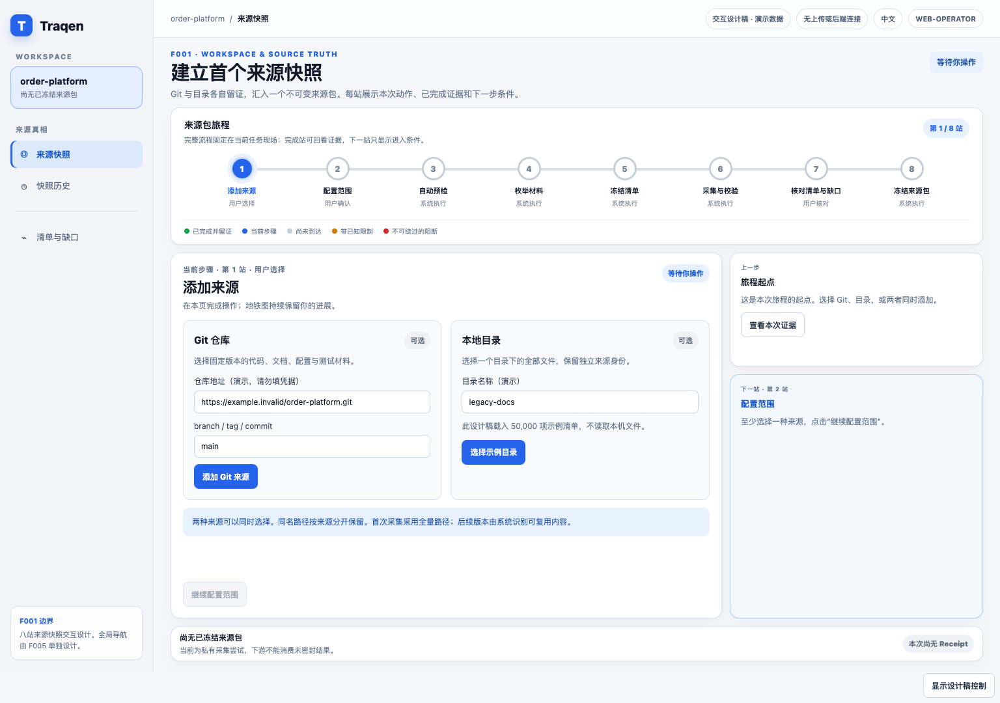

两张来源卡独立选择。Git 填地址与请求版本；目录入口在原型中明确载入示例目录。未选择来源时“继续配置范围”禁用，至少选择一种后进入第 2 站。此时尚未枚举，也没有可信总数。

#### 10.1.2 第 2 站：配置范围 — 用户确认

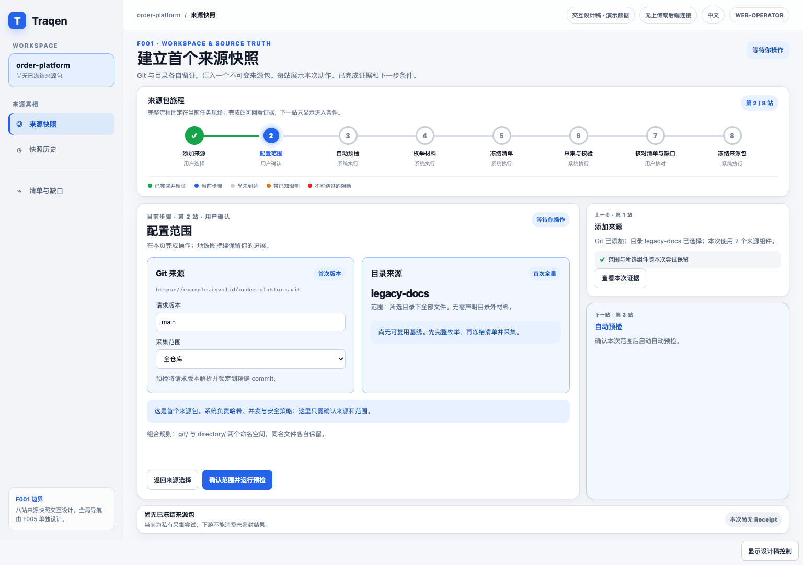

确认 Git 的全仓库或一个目录根，以及目录的全部已选文件。组合保持两个命名空间，同名文件不覆盖。系统按既有基线决定首次全量或后续增量；不提供算法、并发和排除规则配置。点击“确认范围并运行预检”进入第 3 站；返回来源选择仍可编辑。

#### 10.1.3 第 3 站：自动预检 — 系统执行

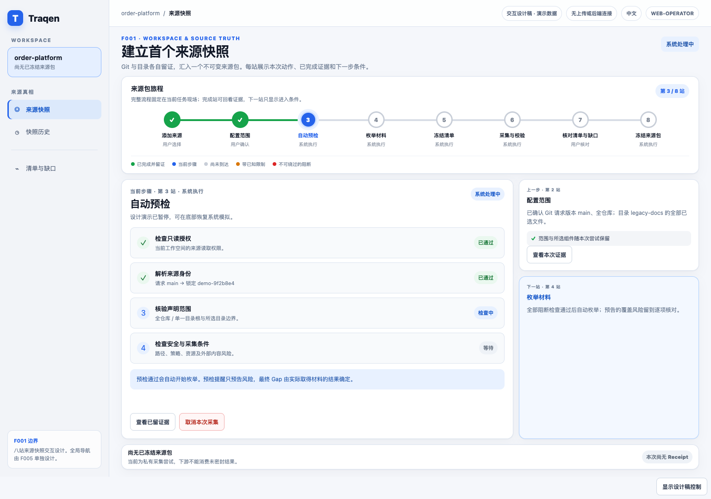

逐项显示读取权限、原生来源身份、声明范围和安全条件；Git 请求版本在此解析到精确 commit。检查通过后自动进入第 4 站。预检风险预告不冒充最终 Gap；安全阻断停在此处，不能接受后继续。

#### 10.1.4 第 4 站：枚举材料 — 系统执行

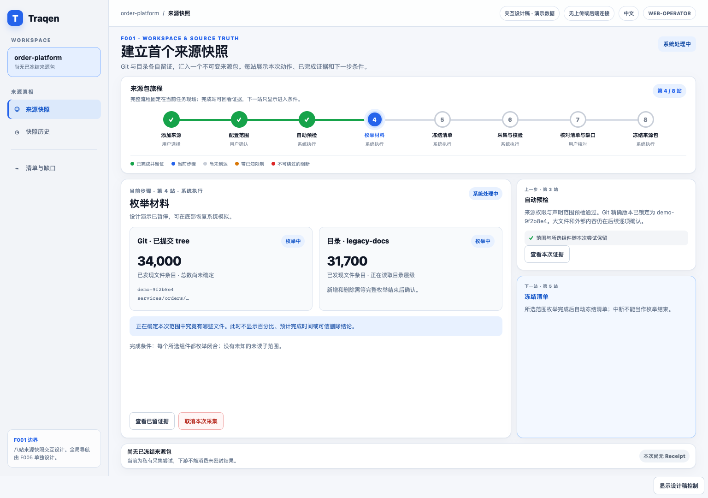

Git 遍历已提交 tree，目录完整枚举所选范围。只显示“已发现 N 项”，不显示总数、百分比或 ETA。只有本次所有所选组件均枚举闭合（沿用组件具有有效复用证据），才自动进入第 5 站；仅 Git 或仅目录不等待不存在的第二种来源。增量删除必须等同源同范围的完整枚举结束后才能确认。

#### 10.1.5 第 5 站：冻结清单 — 系统执行

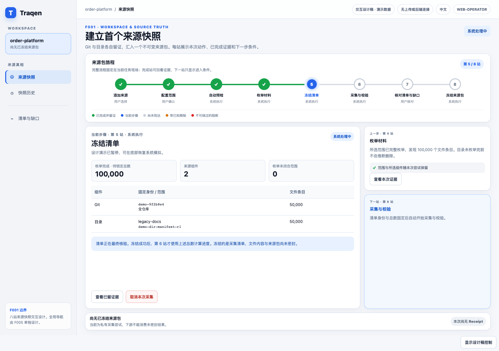

展示各组件身份、枚举完成的条目数、声明范围和待冻结清单。清单冻结成功后自动进入第 6 站，并将相同总数作为进度分母。**清单冻结不代表来源包已冻结**：内容仍需采集、验证和逐项处置。

#### 10.1.6 第 6 站：采集与校验 — 系统执行

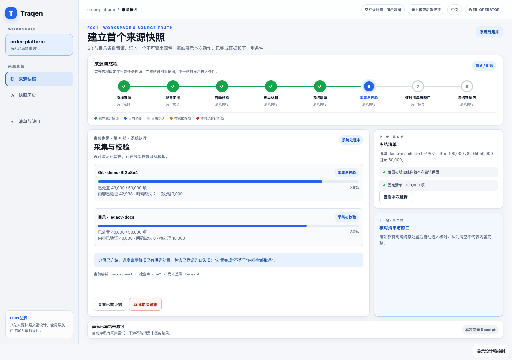

每条来源轨独立展示内容已验证、明确缺失、待处理和固定总数。进度的“已处置”包含明确缺失项，不等于内容全部取得。所有条目有终态处置、目录全部已选文件验证且没有阻断后，才自动进入第 7 站。最终化前可以取消；瞬态失败保留已验证检查点供新尝试复用。

#### 10.1.7 第 7 站：核对清单与缺口 — 用户操作

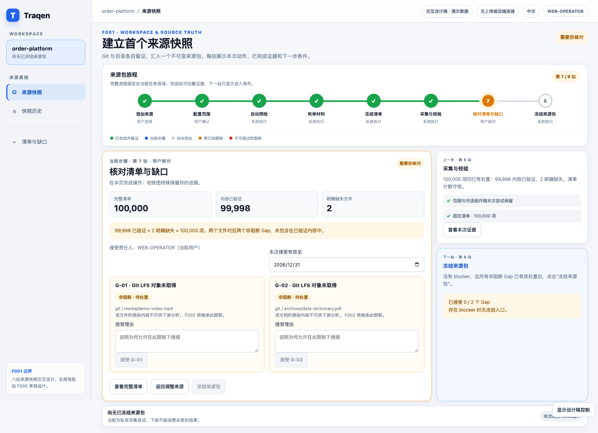

组合示例明确对账：99,998 项内容已验证 + 2 项明确缺失 = 100,000 项；两个缺失文件对应两个非阻断 LFS Gap。目录侧 50,000 项全部验证。文件数量与 Gap 数分别显示，不混成一种统计。

用户逐项填写理由，以当前用户为责任人并注明有效期，才能接受限制。已接受项保持橙色且仍在 Receipt 中。未处置、过期接受或 blocker 均不能解锁冻结。无 Gap 的路径直接核对清单后冻结，不虚构接受步骤。

#### 10.1.8 第 8 站：冻结来源包 — 执行中与完成态

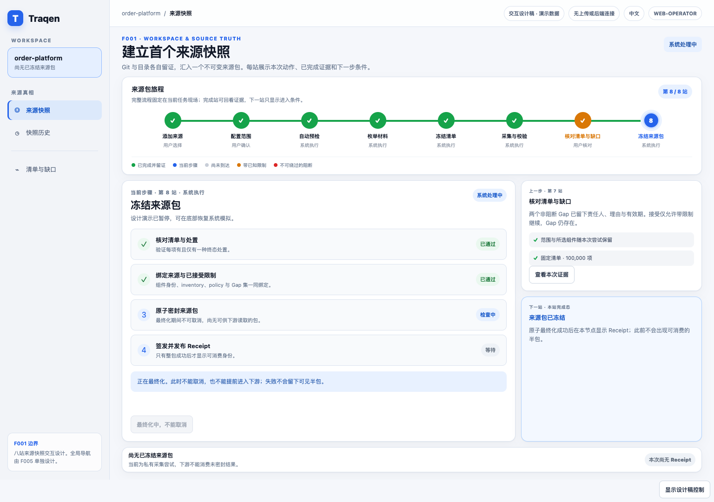

点击“冻结来源包”后，系统核对处置、绑定组件/清单/策略/Gap、原子密封并签发 Receipt。最终化期间不可取消；成功前不显示可消费 Receipt，不能提前进入下游。

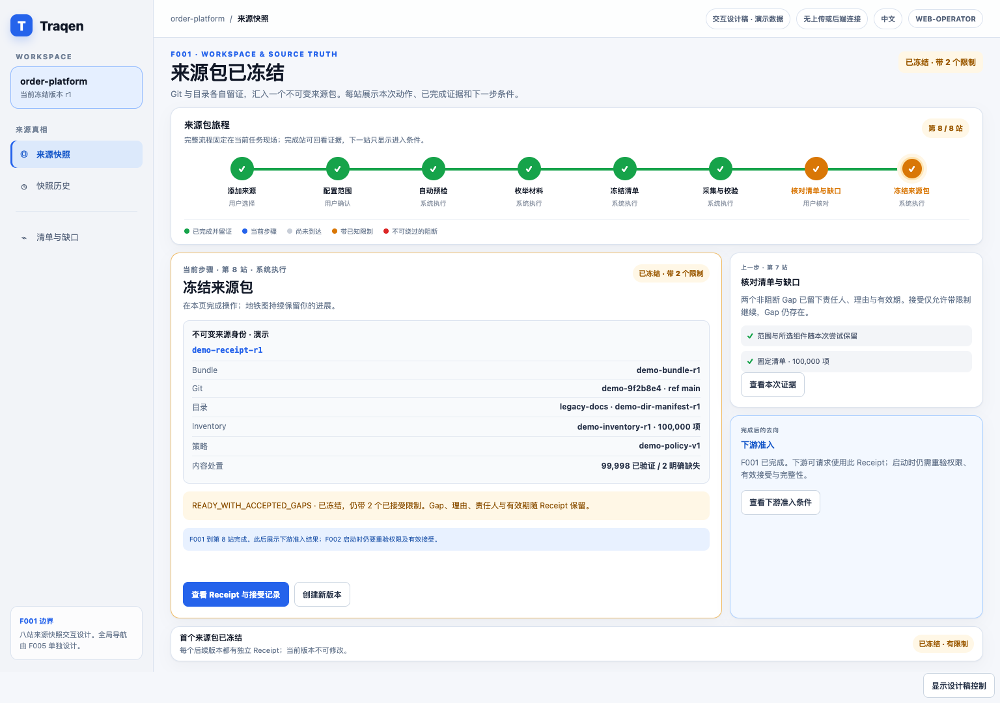

完成后仍停留在第 8 站，显示 Bundle、Git commit、目录 manifest、Inventory、策略与完整限制。带已接受 Gap 的整包状态保持橙色。F002 准入是完成后的去向，启动时仍需重验权限、Receipt 和接受有效性；它不是第 9 站。

#### 10.1.9 整体流转与恢复

~~~mermaid
flowchart LR
  A["1 添加来源 · 人"] -->|至少一个来源| B["2 配置范围 · 人"]
  B -->|确认并启动| C["3 自动预检 · 系统"]
  C -->|通过，自动| D["4 枚举材料 · 系统"]
  D -->|完整枚举，自动| E["5 冻结清单 · 系统"]
  E -->|分母固定，自动| F["6 采集与校验 · 系统"]
  F -->|对账闭合且无阻断，自动| G["7 核对清单与缺口 · 人"]
  G -->|有效处置并确认冻结| H["8 冻结来源包 · 系统"]
  H -->|原子成功，留在第8站| R["冻结完成 + Receipt"]
  C -->|阻断| X["编辑来源或范围"]
  X --> B
  F -->|瞬态失败| T["新尝试复用检查点"]
  T --> F
~~~

系统步骤可以自动前进，人工步骤必须等明确动作。设计稿的“播放”只驱动系统模拟，不代替来源确认或 Gap 接受。最终化前取消保留尝试记录且不签发 Receipt；进入最终化后只查询结果，不再接受取消。新尝试失败不改变旧版历史。

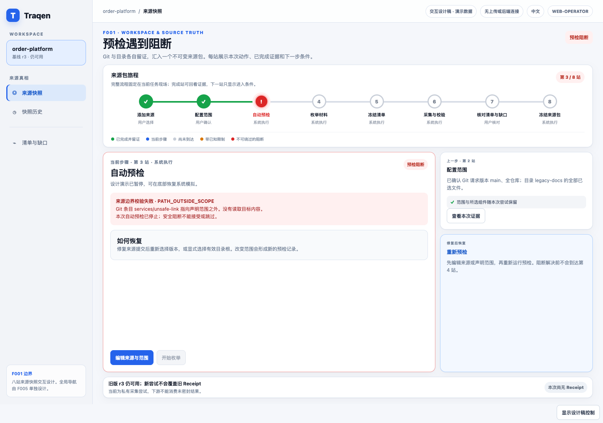

该图展示来源/范围不合法的阻断，只提供“编辑来源与范围”；原样重试仍阻断。其他阻断按实际原因提供重新授权、恢复存储或扩容后重试，不把所有失败都引导成修改来源。修复后重新验证相关条件，不直接跳到采集或冻结。

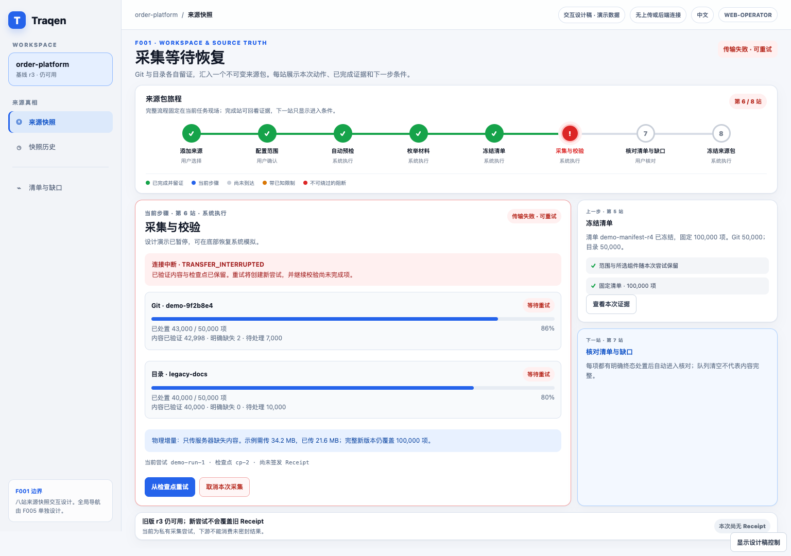

重试创建新的尝试，继续使用已锁定输入与已验证检查点；已完成进度保留，旧包与旧 Receipt 的历史证据不变。旧包当前能否使用仍重验权限、完整性与接受期限；示例中的旧凭据处于有效期内，不代表所有历史 Receipt 都可用。

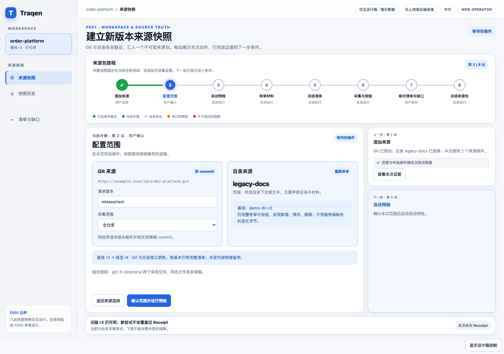

“创建新版本”从实际选定的已冻结版本回到配置范围。Git 选择目标版本，目录重新枚举；系统只传缺失变化字节，新结果仍是一份完整逻辑版本。固定场景示例为 r3 → r4，完整交互主线从 r1 创建后继时则显示 r1 → r2。

[窄屏界面示例](assets/source-truth-journey-v3-mobile-zh-CN.png)：流程图在自身容器内横向滚动并定位当前站，站次计数始终可见；主操作与上下文按顺序排列。全局导航的窄屏形态仍由 F005 决定。

~~~yaml
in_context_observability:
  primary_surface: "同一来源快照工作台的八站旅程与当前节点工作区"
  why_not_dashboard_only: "用户在本次任务现场看见动作、卡点和下一站门槛"
  deep_dive_surface: "站点证据、Inventory、Gap 与 Receipt 详情"
  noise_dedup_policy: "组件内聚合状态，详情按需展开；缺口决定与阻断原位显示"
~~~

### 10.2 页面返回、编辑与冻结后的动作

- **首次进入**：展示来源草稿或空态，从第 1 站开始；用户明确确认后，系统才执行预检及后续自动站点。不得在用户尚未确认范围时显示已采集成功。
- **返回进行中任务**：服务端恢复当前站、候选身份、进度与等待原因；需要浏览器提供文件时显示续传动作，不假装仍在后台上传。
- **回看上一步**：只读查看该站证据，不回退状态。选择“编辑来源/范围”需明确会生成新候选、使哪些旧检查失效；最终化中不能编辑。
- **查看冻结结果**：区分历史内容冻结、当前准入及本版本备份覆盖。可查看原生身份、清单、限制、Receipt 与历史；不会因最新任务失败而丢掉旧版本入口。
- **创建新版本**：用户显式选定基线，再按组件选择沿用/更新，从第 2 站走同一条八站主线。差异只说明文件变化，不自动切换其他分析的基线。
- **重新接受限制**：针对同一冻结包复用第 7 站的确认界面，只追加接受和 Receipt；不把历史包变回采集草稿，不重跑第 4–6 站。权限/完整性阻断不能通过该动作解除。
- **进入后续分析**：用户另行选择时才走 F002 准入；过期、缺失内容或权限变化立即拒绝，并解释当前原因。此动作不属于冻结来源包的完成条件。

### 10.3 状态、按钮与文案规则

| 状态 | 主标签 | 允许动作 | 禁止动作 | 文案要求 |
| --- | --- | --- | --- | --- |
| `EMPTY` | 未建立来源 | 添加 Git、上传目录 | 进入 F002 | “请选择至少一种来源建立分析底座”。 |
| `PREFLIGHT_READY` | 预检通过，继续枚举 | 自动前进、查看证据、最终化前取消 | 进入 F002、提前声称文件已验证 | 展示已锁定 commit 和声明范围；不要求用户重复点击启动。 |
| `PREFLIGHT_WARN` | 预检通过，存在风险预告 | 自动前进、查看预告、最终化前取消 | 绿色完成标签、将 WARN 当作已接受 Gap | 实际限制在采集对账后进入第 7 站，最终 Gap 必须被继承。 |
| `PREFLIGHT_BLOCKED` | 已阻断 | 编辑来源和范围 | 创建快照、接受阻断、进入 F002 | 说明阻断原因、影响组件、修复动作和旧版本可用性。 |
| `CAPTURING` | 采集与校验中 | 处理服务端已收到字节、最终化前取消 | 进入 F002、修改正在采集的来源 | 区分本地仍需上传与服务端正在验证，不用“后台运行”掩盖客户端依赖。 |
| `FAILED_RETRYABLE` | 可重试失败 | 重试、取消本次 run | 签发 Receipt | 区分网络/存储瞬态错误与用户需要修复的问题。 |
| `WAITING_FOR_CLIENT` | 等待目录续传 | 重新选择并授权、取消任务 | 宣称关浏览器仍在上传 | 说明哪些字节已验证、哪些还需要本机提供。 |
| `FINALIZING` | 正在最终化 | 查询结果 | 取消、另建重复冻结 | 结果未知不等于失败；查询本次发布凭据。 |
| `SEALED_READY` | 来源包已冻结 | 进入 F002、查看 Receipt、创建新版本 | 修改旧快照 | 说明版本已经密封，旧版本不会被后来输入改变。 |
| `SEALED_WITH_GAPS` | 可用但有限制 | 审阅已接受的非阻断 Gap、进入 F002、创建新版本 | 把状态显示成绿色完整 | 橙色置顶显示 Gap 负责人、理由、有效期和继承范围。 |
| 已冻结 + 接受过期 | 内容已冻结，当前禁止新分析 | 查看历史、重新接受并签发新 Receipt | 修改旧 Receipt、自动续期或自动准入 | 使用第 7 站的确认操作，内容不重采。 |
| 已冻结 + 完整性异常 | 当前存储不可用 | 查看原因、恢复并校验 | 以接受 Gap 绕过损坏 | 历史冻结记录仍在，禁止继续显示当前可用。 |

表中“进入 F002”均受实时准入检查约束；没有快照的阻断尝试与已有包当前被拒绝使用不是同一种状态。容量/备份提示独立呈现，不能覆盖 Gap 限制。

默认页面文案使用简体中文。英文术语只保留在对象名、状态码、commit、hash、Receipt、Gap 等需要精确对齐实现和文档的位置。

### 10.4 10 万文件与增量体验

前端不能把大规模采集设计成“上传完再说”。它必须让用户在采集中持续知道系统在做什么，同时避免浏览器被大清单拖垮：

- 发现阶段只显示已发现数量，不给不可靠百分比；manifest 冻结后才显示 `已验证 X / 总数 Y`。
- Git 与目录分开显示计数和阶段，再给一个来源包总状态，避免 50,000 + 50,000 的组合输入被误读为单一来源。
- Artifact Inventory 使用搜索、筛选、分页或虚拟列表；默认只展示摘要、异常和最近变化，不渲染全部行。
- 创建新版本时，目录仍需完整枚举以发现删除，但只上传服务端缺失的新增/修改字节；UI 同时展示“已枚举总数”和“需传输字节”。
- Delta 只展示文件级 `新增`、`修改`、`删除`，可按组件筛选；rename 暂时表现为删除加新增。
- 页面明确新尝试失败不改变旧包与旧 Receipt 的历史证据；旧包是否当前可用仍须重验权限、完整性与接受期限，并分别展示结果。

### 10.5 前端验收点

- 八个节点界面、第 8 站完成态与恢复示例来自同一设计源，均显示相同旅程、Workspace 身份和 F001 内部位置；全局导航名称、分组与 Feature 布局不作为 F001 验收内容。
- 用户在第 1–3 站完成来源添加、范围确认并看到预检解析的 commit 或所选目录身份；文件验证数在真实采集后才出现。三个输入组合共用同一八站旅程，页面不提供第三种“组合来源”类型，也不提前显示 N/N 已验证。
- 预检阻断页没有继续、接受或进入 F002 的入口；非阻断 Gap 页用橙色而不是绿色。
- 100,000 文件组合输入不会卡死浏览器，Inventory 可检索、筛选、分页或虚拟滚动。
- 新版本页能展示 Git/目录各自 add/modify/delete 与复用摘要，但不展示影响分析结论。
- Receipt 详情页不显示凭据、原始 secret、临时上传会话或用户本机绝对路径。

本设计不包括全局仪表盘、实时日志 tail、原始秘密查看器、源码编辑器、API/功能树或生产实现。它们要么绕开来源决策，要么属于后续功能。

## 11. F002 准入与 Delta 合同

```ts
type QualifiedSourceComponent =
  | {
      componentSnapshotId: string;
      kind: "GIT";
      nativeIdentity: { resolvedCommit: string };
      declaredScope: { kind: "REPOSITORY" } | { kind: "DIRECTORY_ROOT"; path: string };
      manifestId: string;
    }
  | {
      componentSnapshotId: string;
      kind: "DIRECTORY_UPLOAD";
      nativeIdentity: { manifestDigest: string };
      provenance: { uploadId: string }; // 会话审计，不进入内容身份
      declaredScope: { kind: "UPLOADED_DIRECTORY" };
      manifestId: string;
    };

type QualifiedSourceInput = {
  workspaceId: string;
  receiptId: string;
  receiptStatus: "READY" | "READY_WITH_ACCEPTED_GAPS";
  receiptValidUntil: string | null;
  sourceBundleSnapshotId: string;
  components: ReadonlyArray<QualifiedSourceComponent>;
  inventoryId: string;
  inventoryDigest: string;
  policyRevisionId: string;
  inheritedGaps: ReadonlyArray<{
    gapId: string;
    severity: "NON_BLOCKING";
    componentSnapshotId: string;
    affectedScope: string;
    reasonCode: string;
  }>;
};

type SnapshotDeltaInput = {
  baselineBundleSnapshotId: string;
  targetBundleSnapshotId: string;
  operations: ReadonlyArray<{
    componentKind: "GIT" | "DIRECTORY_UPLOAD";
    componentSnapshotId: string;
    path: string;
    kind: "ADD" | "MODIFY" | "DELETE";
    beforeDigest: string | null;
    afterDigest: string | null;
  }>;
};
```

准入要求调用者有 Workspace 权限；组件/来源包/inventory 已密封并验证；存在精确匹配、当前可消费的 Receipt；相关接受未过期；不存在 blocker 或篡改信号。它拒绝 direct path、Git URL、仅 ref 输入、dirty checkout、上传会话、部分 snapshot、过期接受和全部 `BLOCKED` 结果。

以上为逻辑合同，不要求一次请求加载完整 `operations`、Inventory 或 Gap 集：实际消费须支持绑定相同不可变版本的分页/流式读取，Gap 继承必须能闭合完整集合，不能只继承第一页。删除项保留基线组件定位，新增项保留目标定位；两个包范围或组件配置变化单独显示，不与内容删除混算。

`receiptValidUntil` 是所绑定接受中最早的绝对到期日，无需接受时为 null；它不是数据保留 TTL，也不是绕过权限/完整性复验的承诺。F002 固化本次准入时间、确切 Receipt 及其接受记录引用，重放历史时不得静默替换成较新的 Receipt。准入时拒绝过期凭据；同包续签后必须显式使用新的凭据。内容读取仍受当前权限与完整性检查约束。

F002 将来源包/Receipt/inventory/policy 身份及完整 inherited Gap 集固化在每个派生 fact 上。比较已选基线/目标时，F002 可请求 `SnapshotDeltaInput`，但不得修改、隐藏、降级或重新接受 F001 Gap。F003/F004 通过 F002 获取 F001 provenance；F004 的影响结论留在 F001 外。

## 12. 参考试点与规模验收

使用含 Git commit A/B 和目录版本 D1/D2 的受控 fixture。组合 A+D1 包含代码、文档、配置、SQL、测试、安全敏感 fixture 处理、重复内容、零字节文件、深层路径、刻意不可得的非阻断条目、大文件策略条目和阻断路径/完整性 fixture。

以下 `B-01`–`B-12` 是本文件独立的验收索引，不依赖 A 的旧 AC，也不表示任何一项已实现。

| 索引 / 用例 | 必须证明 |
| --- | --- |
| B-01：仅 Git、仅目录和 A+D1 的完整八站 | 三种组合均走同一工作台；原生组件身份、逐站产出/门槛、目录全部验证、无路径覆盖、每项一种处置。单来源不等待另一个不存在的来源。 |
| B-02：重放 A+D1 | 相同组件/来源包/manifest 身份和 inventory 结果；采集/接受时间不进入内容身份，branch 移动及本地变化不改变旧包。 |
| B-03：A→B、D1→D2 | Git 只取得变化的缺失 blob；目录完整重新枚举但只发送缺失变化字节；删除显式记录，范围收缩不冒充文件删除。 |
| B-04：仅 Git 变化后的 B+D1 | D1 保持引用而非复制/重传或再次要求选择；两个版本可独立查询，已存在分析的基线不自动变化。 |
| B-05：被阻断的安全/完整性 fixture | `BLOCKED`、无接受操作、不能 F002 准入；未授权读取/跨 Workspace 去重不可行。旧包历史不变，当前使用仍须独立通过权限、完整性与接受期限检查。 |
| B-06：100,000 文件组合 fixture | 内存/队列/文件描述符有界，清单/Delta 分页完整；文件、目录、Gap 和字节分母不混算；中断后精确对账，无 Draft 准入。 |
| B-07：原来源离线 + 服务重启 | Git 50,000 + 目录 50,000 的已冻结包仍从数据卷/数据库重放，不重新请求原来源；身份及字节摘要不变。 |
| B-08：关页、重选、目录变动与并发 | 从服务端恢复当前站及等待原因；未收到字节等待客户端；变化输入不能继续原清单；第二条活动采集被拒绝，历史仍可按权限查询。 |
| B-09：容量/数据库故障 | 暂停新写入、保留检查点并给准确恢复动作；不删除历史，不跳过目录文件签发成功，不把存储故障错误引导为修改来源。 |
| B-10：第 7/8 站期限边界与冻结后续签 | 接受过期则不发布/不准入；服务端判定绝对期限。同内容续签只追加记录与 Receipt，不重采或改旧凭据，界面不把有限制变为绿色完整。 |
| B-11：两种提交故障、重复请求及取消边界 | 文件落盘但事务失败仅留私有准备内容；事务提交后丢响应查询同一包；重复 seal 不生成第二个版本；最终化拒绝取消，此前取消不发布包。 |
| B-12：配套备份隔离恢复 | 核对数据库水位、Receipt/manifest、全部引用 blob 和 Workspace 隔离；破坏一个测试 blob 或一片 manifest 即拒绝准入。逐包证明是否受备份覆盖，恢复早于最近版本时明确报告水位。 |

每项均为**待实现的验收要求**，不是已跑通结果。规模报告登记部署环境、总文件/字节/大小分布、各阶段耗时、实传与复用字节、内存/队列/文件描述符峰值、恢复时间与最后可恢复水位；用实际配置预算判定，不写无依据的通用性能数值。浏览器验证矩阵、备份目标与计划、容量预算及 RPO/RTO 是运行验收输入，未登记不得宣称部署已就绪。

首要失效模式是 **false-green Receipt**：材料静默消失，UI 却显示 ready。冻结 manifest、终态处置守恒、明确实质 Gap、两阶段/原子 seal、不可变 Receipt 和 F002 强制继承 Gap 共同构成防线。

运行验收的证据不能只有截图或“任务结束”：每个索引至少保留所用 fixture/版本、操作与故障注入点、实际持久化结果、用户看到的状态/恢复动作及准入判定。完整八站需走真实 Git/目录输入，HTML 示例播放不能代替；下游边界可用契约测试消费者验证，不要求先实现 F002–F004 的分析功能。

### 12.1 设计已定项与部署验收输入

| 已定合同 | 部署必须提供并验证的输入 | 未满足时如何表达 |
| --- | --- | --- |
| 单节点专用卷 + PostgreSQL | 实际卷/挂载、数据库连接、服务账户权限、容量预算。 | 存储未就绪或容量不足；不能创建虚假成功包。 |
| 受权限约束的 Git/目录读取 | 只读连接、获准目标、实际浏览器/版本/平台矩阵。 | 来源不可访问或入口不支持；不降级成部分目录成功。 |
| 有界、流式处理十万文件 | 并发、队列、在途字节、文件描述符等资源上限和测量记录。 | 限流/等待/明确失败，不以丢材料保吞吐。 |
| 长期保留 + 配套备份恢复 | 独立故障域目标、备份计划、保留约定、实测恢复点/时间。 | 冻结可单独完成，但未覆盖该包的备份不能显示为已备份；运行验收未闭合。 |

这些参数由实施和部署时的真实环境提供，不构成重新选择存储架构、改变八站或放松完整性的授权。若需求变为多节点不停机服务、自动删除历史或扩展来源种类，须另行确认，不藏进部署参数。

## 13. 决策闭环与下一门

co-creator 已确认：两类来源及组合；原生组件身份/无覆盖；显式手动创建版本；逻辑完整版本与物理增量复用；目录完整重新枚举但只上传变化字节；Git 手动更新；仅文件级 add/modify/delete；以及 100,000 文件下有界流式/原子真实性。

2026-09-06 已补齐单节点专用卷/PostgreSQL、服务端任务、八站先接受后发布、绝对期限/续签、幂等最终化、容量/保留与配套备份恢复。co-creator 的方案确认消息为 `0001788693409717-000090-f4d768c7`，中文文档修改授权为 `0001788694315222-000093-757d8776`，所在 thread 为 `thread_mtdpfw4ft7ngbi5f`。

本次复盘教训：界面能顺利走完八站，不等于用户的证据可以长期保存、恢复和再使用；状态图、持久化边界与故障验收必须一起核对。明确拒绝：默认草稿 TTL（违背可恢复预期）、冻结时平移接受期限（改变用户授权）、先密封整包后接受（违背第 7/8 站门槛）、依赖原来源重抓来恢复（目录或仓库可能已消失）。这些理由在本文成立，不依赖旧 A 的内容，也不新增操作家规。

本轮进一步收口了八站输入/产出/门槛、单来源与组件沿用路径、页面返回及修改失效、四维状态、条件性旧包可用性，以及 `B-01`–`B-12` 独立验收索引。范围仍是原已确认方案的文字细化，没有新增产品功能。

**当前交付边界：** 只完善文件 B；A 为过时 Spec，不能作为当前设计或验收的约束。英文、A、ADR、HTML/PNG 和实现均不随本轮修改。图稿中尚未体现的生命周期细节以本文为准，不能声称图片已经更新。实现、迁移、数据卷创建及部署须单独授权；F005 导航仍独立规划。文档落盘或文档检查通过都不等于功能验收完成。

### 技术依据与适用边界

- [PostgreSQL 文件系统级备份说明](https://www.postgresql.org/docs/current/backup-file.html)：运行中普通目录复制不是一致性备份。本方案选择配套备份合同，具体可恢复方法需针对部署数据库版本验证；不由本文声称已经部署。
- [W3C File API 草案：File 接口](https://w3c.github.io/FileAPI/#file)：文件读取的快照状态不提供整个目录的事务快照保证。本设计据此收窄为本次枚举/读取集合；浏览器实际行为仍须用试点验证，不把标准草案当作兼容性测试结果。
