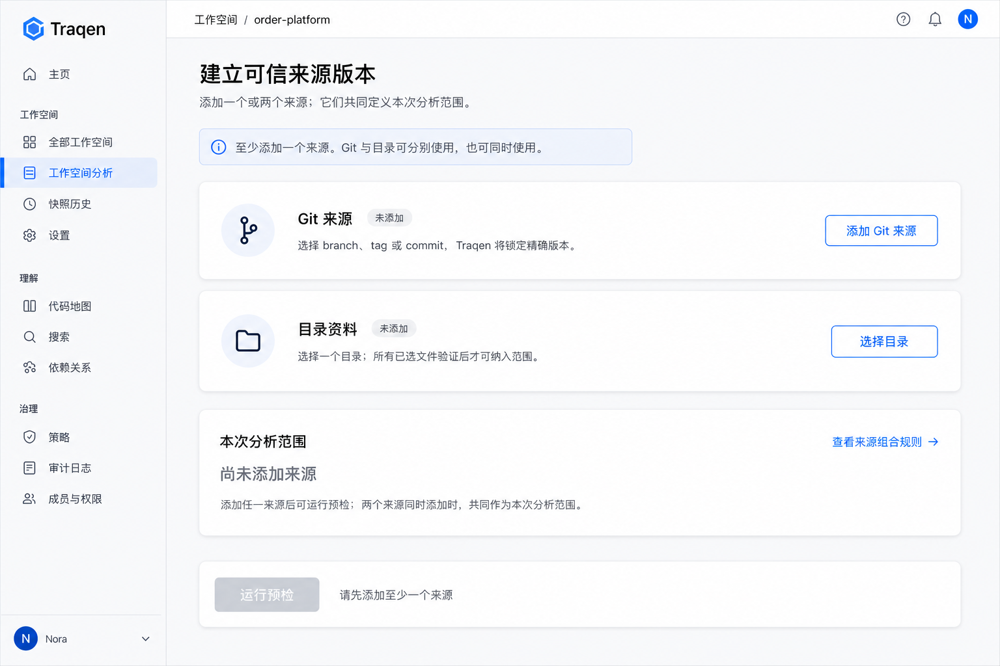
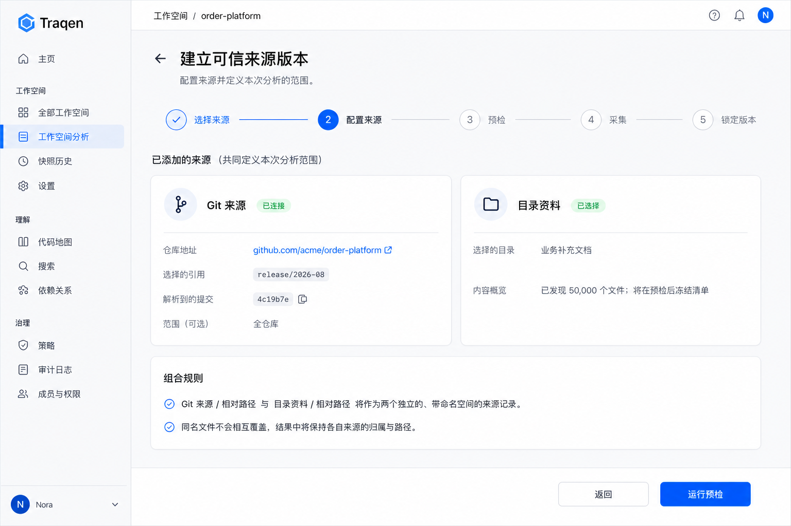
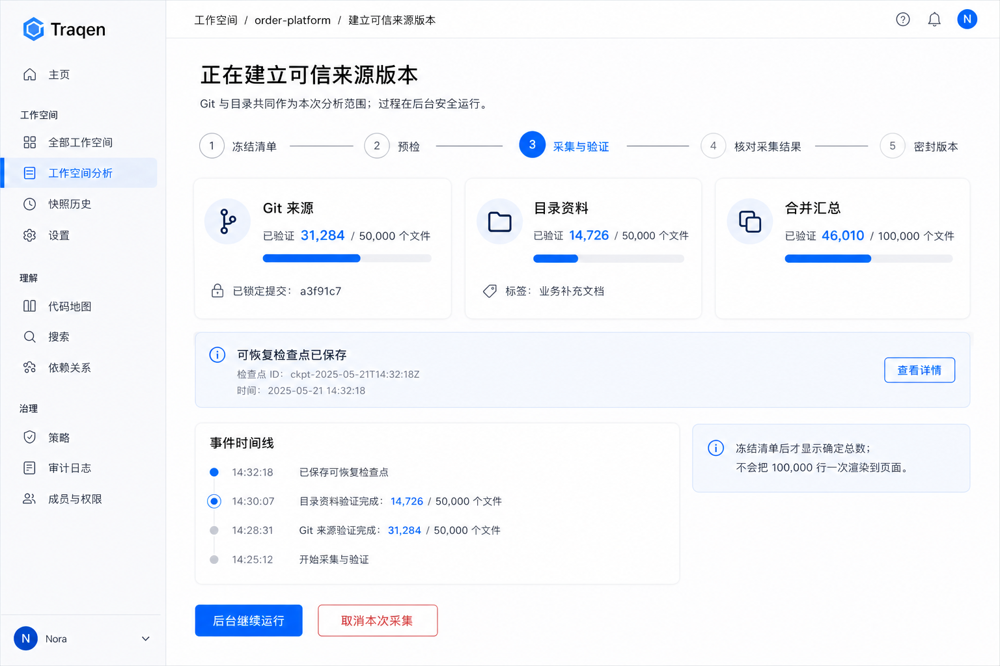
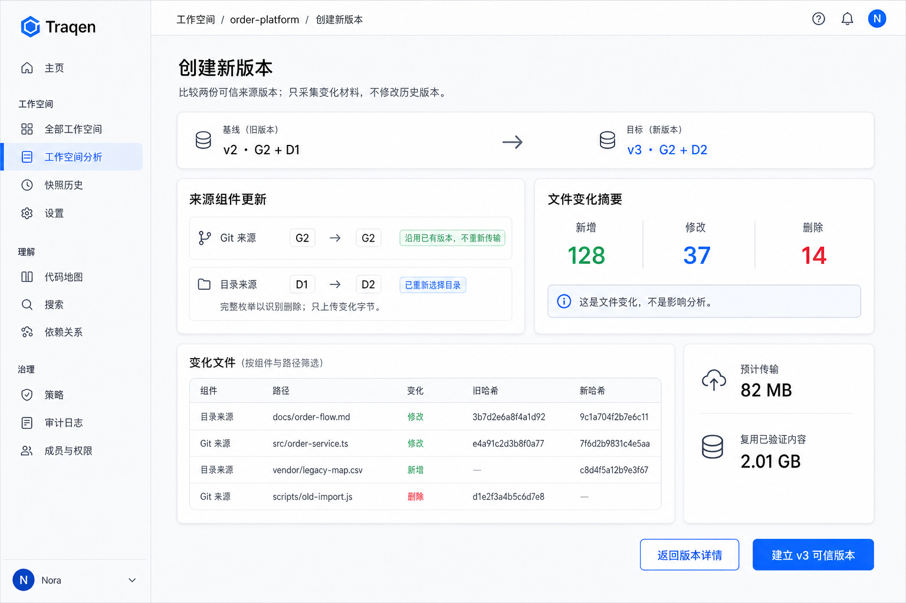

> 语言：[English](README.md) · **简体中文**

---
feature_ids: [F001]
related_features: [F002, F003, F004, F006]
topics: [workspace, source-truth, git, directory-upload, source-bundle, incremental, source-snapshot, artifact-inventory, coverage-gap, receipt, design-gate]
doc_kind: feature-discussion
created: 2026-08-30
updated: 2026-08-31
status: approved
design_gate: operator-approved
---

# F001 方案设计 — Workspace & Source Truth

## 1. F001 完成时，用户得到什么

当架构师能把一个选定的 Git 版本、一个选定的目录或二者，变成一份**可重放的 Source Truth Receipt** 时，F001 才算完成。Receipt 明确说出 Traqen 安全采集了哪些来源组件、哪些材料没有取得、它代表哪个版本，以及 F002 能否使用结果。

具体而言，架构师可以：

1. 创建或打开 Workspace，分别添加**Git 来源**和/或**目录资料**；至少需要一个，两个同时添加时共同定义一份分析范围；
2. 选择 Git branch/tag/ref 并看到精确解析的 commit，和/或选择一个目录并看到所有已选文件均被验证；
3. 让 Traqen 自动预检来源，并在不执行用户控制代码的前提下采集；
4. 查看带组件身份的完整来源清单、覆盖限制、Receipt 和不可变历史；
5. 在来源变化后创建新版本：比较 Git commit 或重新选择目录的 manifest，只传输变化字节；以及
6. 将合格的不可变来源包及继承限制交给 F002，而不是交一个会变化的路径或 branch。

首期允许一个 Git 组件、一个上传目录组件，或两者同时存在。组合来源是带命名空间的并集，不是自动合并：同名路径仍是不同记录。F001 **不会**产生 API 树、推断业务功能、执行测试或给出变更影响建议；这些分别属于 F002–F004。F001 的产物是可信来源地基，后续结果才有资格被相信。

## 2. 功能清单、作用与解决的问题

| 功能 | 架构师获得什么 | 解决什么问题 |
| --- | --- | --- |
| Workspace 与来源选择 | 两张相互独立的 Workspace 来源卡：Git 可添加或不添加；目录可添加或不添加；至少需要一个。Git 凭据保持受保护；目录上传带用户/会话审计。 | 用户不必选择误导性的第三种“Git+目录”类型；分析不能悄悄使用任意本地目录，也不会泄露凭据。 |
| 精确组件身份 | Git ref 被解析为 commit；目录由已验证 manifest 表达。组件保留原生身份。 | 移动中的 branch、本地目录或伪装成 commit 的目录不能冒充稳定证据。 |
| 自动预检 | `可开始` / `可带预期 Gap 开始` / `已阻断`，并给出原因和修复动作。 | 授权、路径安全、限制和完整性问题不会等误导性扫描结束才暴露。 |
| 安全不可变采集 | 已密封组件快照和一个 `SourceBundleSnapshot`；不执行仓库脚本、构建、hook、filter、依赖安装或上传内容。 | 来源控制的行为和 working tree 修改不能改变或威胁证据。 |
| Source Coverage 清单 | 每个已发现条目都有带组件身份的定位符、disposition 和 reason；大规模时可搜索、分页。 | 文档、配置、SQL、测试、二进制、读取失败以及组件内同名文件不能静默消失。 |
| Coverage Gap 管理 | 阻断失败保持阻断；非阻断限制仅能以负责人、理由和有效期接受。 | 不能用点击警告掩盖完整性失败，同时常见存量系统的不完整性仍然可见、可管理。 |
| 版本历史与文件 Delta | 用户显式操作后得到一份完整不可变新版本；两份已密封 manifest 间的 add/modify/delete 证据。 | 影响分析不能比较移动来源，同时未变化的 50,000 文件组件不被复制或重传。 |
| Receipt 与 F002 交接 | `READY` / `READY_WITH_ACCEPTED_GAPS` / `BLOCKED` 及历史；F002 只接收合格来源包/输入。 | 后续能力不能基于路径、branch、部分上传，或未经接受的限制，产出看似权威的结论。 |

## 3. 与产品愿景的对齐

| 产品愿景 | F001 的贡献 | 刻意边界 |
| --- | --- | --- |
| 帮架构师接管陌生的存量系统。 | 在解释任何内容前，先建立精确材料基线。 | 它本身不解释业务含义。 |
| 从来源到结论保留可追溯链路。 | 建立第一段长期有效链路：来源组件 → 不可变 manifest → 来源包 → inventory/Gap → Receipt → F002 provenance。 | Fact、Candidate、Claim、测试证据、影响链路由 F002–F004 补齐。 |
| 展示可信 API 树和经过审核的业务功能树。 | 防止任一棵树在其底层来源不完整时仍表现得像“完整”。 | F001 不解析 API，也不发布任一棵树。 |
| 让下一次变更更安全。 | 保留可比较来源版本和诚实的文件级 Delta 供后续影响工作使用。 | 不推断影响、不运行测试、不建议复验。 |
| 宁可明确不完整，也不输出看似可信但无证据的答案。 | 排除项、读取失败、脱敏限制、外部材料、已接受 Gap 都显式可见并被继承。 | 阻断安全/完整性条件不能被转成可用结果。 |

因此，F001 与愿景一致，但它是**诚实的来源地基**，不是独立完成“存量理解”的产品。它的成功标准不是“扫描跑完”，而是“后续结论能说出并证明它基于什么输入、什么版本、受什么限制”。

## 4. 方案状态与权威

本文件是已获 co-creator 确认的 F001 方案设计，更新并实现 [ADR-0003](../../docs/decisions/ADR-0003-source-truth-boundary.zh-CN.md)。它不授权实现代码。

`source-truth` ownership 边界拥有来源登记、上传/采集生命周期、组件和来源包快照、manifest、inventory、Gap/Receipt 状态、版本比较和 F002 准入；不拥有 F002 提取、F003 审阅、F004 执行/影响或 F006 设置。`SourceTruthRepository` 是唯一权威；F002 只接收 `QualifiedSourceInput`，绝不接收路径、ref、working tree、上传会话或凭据。

## 5. 总体架构

```text
Workspace
  ├─ GitSourceRegistration ── 解析请求 ref ──► 已提交 Git tree/blob reader
  └─ DirectoryUploadSession ── 已选文件 ─────► 受控流式上传
                         │                              │
                         └────── SourceCaptureRun ──────┘
                                             │
         preflight → enumerate → 冻结组件 manifest → 有界采集
                                             │
           GitSourceSnapshot / DirectoryUploadSnapshot（已密封组件）
                                             │
       SourceBundleSnapshot（仅 Git | 仅目录 | 两者，带命名空间）
                              ┌──────────────┴─────────────┐
                     ArtifactInventory                  CoverageGap(s)
                              │                               │
                              └── 核对 Inventory 与 Gap ────┘
                                             │
                             SourceTruthReceipt + version lineage
                       READY | READY_WITH_ACCEPTED_GAPS | BLOCKED
                                             │
                               SourceTruthAdmission → F002
                             （合格来源包 + inherited gaps）
                                             │
                          选择已密封版本 → SnapshotDelta → F002
```

`SourceCaptureRun` 记录一次尝试、实时进度、取消、重试和 checkpoint。密封组件/来源包记录不可变证据与下游资格。二者分开，防止半成品 run 被看成来源版本，也防止重试重写历史。

## 6. 领域记录与不变量

| 对象 | 职责 | 不变量 |
| --- | --- | --- |
| `Workspace` | 授权与隔离聚合根。 | 每条 F001 记录只属于一个 Workspace；元数据与数据访问遵守相同租户/Workspace 边界。 |
| `GitSourceRegistration` | 已获只读授权的仓库身份和凭据引用。 | 不存裸凭据；请求 ref 选择 commit，但不是 snapshot 身份。 |
| `DirectoryUploadSession` | 一个用户选择目录的传输和审计轨迹。 | 至少有一个已选文件；成功组件要求每个已选文件均验证。 |
| `CapturePolicyRevision` | 平台拥有的限制、路径规则、扫描器/脱敏和来源安全。 | 用户不能编辑完整性、安全或 Gap 严重度规则；已密封历史绑定 policy revision。 |
| `SourceCaptureRun` | 一次 resolve/preflight/capture/seal 尝试。 | 重试创建新 run；run 不跟随移动 branch，也不重写已密封版本。 |
| `SourcePreflightReport` | 身份、权限、边界、路径、限制、外部内容与安全证据。 | `PASS` / `WARN` / `BLOCK` 均有 reason code 和下一步；`WARN` 不会静默变成最终覆盖。 |
| `SourceManifest` | 一个组件按序内容寻址的条目和分片摘要。 | 它是覆盖和变更比较的权威；Delta 不能覆盖它。 |
| `GitSourceSnapshot` | 已解析 commit/tree 与声明 Git 范围的密封 Git 组件。 | seal 后不可变；已提交 object 而非 checkout 是证据权威。 |
| `DirectoryUploadSnapshot` | 已验证 manifest/upload identity 的密封所选目录组件。 | seal 后不可变；不声称所选目录外的覆盖，也不伪装成 commit。 |
| `SourceBundleSnapshot` | 有序组件引用与来源包级身份。 | 有一个或两个组件；MVP 每类型仅一个；冲突路径按组件 ID 保持不同。 |
| `ArtifactInventory` | 覆盖率分母和逐项处置。 | 每个已发现条目恰有一种终态 disposition/reason；seal 前计数/字节/分片摘要必须对账。 |
| `CoverageGap` / `GapAcceptance` | 实质分析限制与可追责接受。 | Gap 追加写入；只有非阻断 Gap 可接受，且带负责人/理由/有效期；接受不声称材料已获得。 |
| `SnapshotDelta` | 两个已密封版本的 add/modify/delete 比较。 | 从 manifest 派生、可重放、可选缓存；MVP 中 rename = delete + add。 |
| `SourceTruthReceipt` | 不可变来源证据和可消费决策。 | `READY` 无实质 Gap；`READY_WITH_ACCEPTED_GAPS` 仅有有效的已接受非阻断 Gap；`BLOCKED` 永不可消费。 |

`display-redacted` 的含义刻意收窄：内容可以被采集并可供获授权下游使用，只是不显示在 UI/日志中。若脱敏令分析不可得，它还会生成实质 `CoverageGap`。任何记录均不泄露来源秘密或凭据。

## 7. 采集与版本生命周期

### 7.1 初始来源采集

```text
REQUESTED → PREFLIGHTING → ENUMERATING → MANIFEST_FROZEN → CAPTURING → RECONCILING → PREPARING_SEAL
  │              │              │                 │              │              │                 │
  │              └─ 安全/完整性阻断 ────────────┴──────────────┴──────────────┴──► BLOCKED receipt
  ├─ seal 前用户取消 ─────────────────────────────────────────────────────────────► CANCELLED run
  └─ 瞬态失败 ─────────────────────────────────────────────────────────────────────► FAILED_RETRYABLE run
                                                                                       │
                                                       原子 seal ────────────────────┘
                                                                   │
                                                     已密封 component/bundle
                                                                   │
                                    无实质 Gap ───────────────────┼────► READY receipt
                                    仅非阻断 Gap ──────────────────┼────► AWAITING_GAP_DECISION
                                                                   │           └─ 有效接受
                                    存在阻断 Gap ──────────────────└────► BLOCKED receipt

                                                                                 READY_WITH_ACCEPTED_GAPS
```

- Preflight 校验采集前可知的内容：授权、Git 解析、声明 root、上传/会话边界、路径安全、限制和策略；它不伪装成业务理解。
- Enumerate 冻结含精确条目/字节总数及 root digest 的 manifest。在此之前进度仅可说“已发现 N”；之后 UI 才可按真实总数显示验证文件/字节。
- 目录初始输入只有所有已选文件到达且验证才成功。损坏传输或策略拒绝不能静默降级为部分成功或“来源完整性未知” Gap；已验证条目仍可在策略允许时携带可见的分析限制 Gap。
- `DRAFT` 数据保持私有。原子 seal 会在一起发布 snapshot、来源包和 Receipt 前核对 manifest 分片、内容存在性、inventory 总数、处置和实质 Gap。
- 取消/失败/阻断的后续 run 绝不改变先前已密封版本。

### 7.2 增量新版本

```text
选择基线 + “创建新版本”
  ├─ Git：解析新精确 commit → 比较已提交 tree → 只取得新增/修改的缺失 blob
  ├─ 目录：重新选择文件夹 → 完整枚举/哈希 → 服务端 manifest 比较 → 只发送变化字节
  └─ 未变化组件：复用先前已密封组件
             │
             ▼
新完整已密封组件 → 新 SourceBundleSnapshot → 可重放 SnapshotDelta → 新 Receipt
```

每个新版本都有完整 manifest。优化的是物理复用，绝不是逻辑不完整。目录客户端必须枚举全部已选文件，因为只有这样能可信地证明删除；客户端哈希只用于挑选传输候选，服务端会在字节成为证据前验证每次传输。F001 不自动跟随 branch、不监视本地文件夹，也不在没有架构师操作时把 ref 移动变为新基线。

## 8. 安全、可扩展的采集设计

| 接口 | 职责 | 禁止 |
| --- | --- | --- |
| `GitSourceGateway` | 用只读授权解析 ref、枚举已提交 tree、流式读取 blob。 | 读取可变 working tree，或执行来源控制的 hook/filter/logic。 |
| `DirectoryIngestGateway` | 直接流式接收文件到受控存储，规范路径并验证传输字节。 | 将原始本地路径当作身份、展开归档或执行上传文件。 |
| `SourcePreflightService` | 检查授权、身份、声明 root、上传边界、路径、限制、外部内容和策略。 | 让用户覆盖完整性/安全 block。 |
| `ManifestDiffer` | 比较两份密封 manifest，得出文件级 add/modify/delete。 | 推断业务影响、识别 rename 相似度或改变已密封 manifest。 |
| `SnapshotStore` | 租户范围的 staging、内容寻址已验证 blob、manifest/inventory 分片、checkpoint 和原子 seal。 | 暴露 Draft、修改已密封历史或泄漏跨租户去重。 |
| `CoverageAssembler` | 对账完整 inventory 和实质 Gap。 | 隐藏跳过、读取失败、脱敏限制或范围边界。 |
| `SourceTruthAdmission` | 重验可消费性，向 F002 签发 `QualifiedSourceInput`。 | 返回 path/ref/upload/credential、遗漏 inherited Gap 或绕过 Receipt 状态。 |

快速路径必须有界而非无限：固定资源池、有界队列/背压、在途字节上限、流式哈希、批量元数据写入和分片 manifest/inventory。Git 可经已提交 object 遍历和 object identity 避免重读已知 blob。目录传输可直接流入受控存储并经 checkpoint 恢复。内容复用仅限租户/Workspace，不能成为跨租户存在性查询。

false-green 防线严格：冻结 manifest 中的每项必须对账到恰一种终态 disposition；跳过/缺失的分析材料必须链接对应 Gap；队列清空不能决定成功。seal 失败只留下可重试的私有 Draft/run，绝不会留下对 F002 可见的部分版本。

## 9. 用户信息架构与交互合同

主现场是 **Workspace 内的 Source Truth**，不是独立仪表盘。用户无需查日志即可回答三个问题：*此版本由什么构成；F002 能否使用；需要修复或继承什么？*

| 界面 | 信息与动作 |
| --- | --- |
| Source Truth 卡 | 当前 Git/目录组件、最新 Receipt、版本身份、可用/阻断原因、**创建新版本**及 Receipt/历史链接。 |
| 来源设置 | 两张独立卡：**添加 Git 来源**与**选择目录**。任一可以缺省；至少一个即可运行预检，两个同时存在时共同组成分析范围。Git 显示 ref 和 resolved commit 预览；目录显示已选文件数。没有凭据或安全规则编辑器。 |
| 预检 | `可开始` / `可带预期 Gap 开始` / `已阻断`、受影响组件/范围、原因和修复动作。blocker 没有接受路线。 |
| 采集进度 | 真实阶段和流式总数：“发现 N”，之后“已验证 X/Y 文件和字节”、策略、**核对采集结果**、seal。seal 前取消，失败 run 重试。 |
| Source Coverage | 组件筛选、路径搜索、disposition/reason、计数和 Gap 链接。大 inventory 分页/虚拟列表。 |
| Receipt 与历史 | 原生组件身份、来源包、策略、inventory identity、Gap/接受、F002 资格及早期不可变版本。 |
| 新版本比较 | 基线/目标选择、变更组件、传输复用摘要、add/modify/delete 计数及下游 F002/F004 provenance 路径，不展示影响结论。 |

每个错误均要说明：失败了什么、受影响组件/范围、旧密封版本是否仍可用、下一步纠正动作。Reason 有代码支撑且脱敏。Workspace shell 只展示每个来源/来源包最新状态；详细 Receipt 历史保存完整事件。

## 10. 前端交互设计

界面扩展 Workspace，而不是新增仪表盘。视觉例稿默认使用**简体中文**，让当前 operator 可直接审阅；这是设计语言选择，不承诺运行时 i18n。成功和阻断状态使用同一稳定应用壳层：只允许 Workspace 主内容变化。

### 10.1 添加一个或两个来源组件



起始页只有两张相互独立的来源卡：**添加 Git 来源**和**选择目录**。用户可以添加其中任一张，也可以都添加。至少一个才可运行预检；两个同时存在时共同定义本次分析范围。因此“Git+目录”是组合结果，不是第三种输入类型，也不是互斥选择。

### 10.2 配置两个来源，且不发生覆盖



两张卡均已添加后，页面并列呈现它们的原生身份：Git 锁定 resolved commit；目录先完整发现文件，再冻结 manifest。相同相对路径仍在各自组件命名空间中保留为不同记录。组合规则只在两个组件都存在后显示。

### 10.3 采集大规模组合范围



采集分别展示各组件与组合总数，不把它们伪装成单一来源。系统先冻结 manifest，再显示真实验证总数；面向用户的第四阶段叫**核对采集结果**，而不用内部“对账”术语。检查点支持安全恢复，采集页也绝不会渲染 100,000 行 Inventory。

### 10.4 可用、但带已接受限制的 Receipt


`READY_WITH_ACCEPTED_GAPS` 刻意使用橙色而非绿色。它表示密封来源包可用，**不表示完整**：Gap 仍带负责人和有效期，且下游动作说明 F002 将继承限制。`Display-redacted` 与限制分析的脱敏不同；后者必须生成 Gap。

### 10.5 创建后续不可变版本



新版本页比较选定基线与目标来源包。Git 复用已锁定且未变的组件；目录完整重新枚举以让删除可见，但只传输缺失的变化字节。它的 `新增` / `修改` / `删除` 列表只是来源证据，**不是** F004 的影响结论。

### 10.6 预检被阻断


阻断处于同一 Workspace 旅程。界面标识失败检查、受影响边界、修复动作、禁用采集动作，并说明早先已密封版本不受影响。安全/完整性 blocker 没有接受或绕过路线。

### 10.7 前端页面地图

F001 前端默认进入 `工作空间分析 / Source Truth`，左侧应用壳层固定不随状态变化。主内容只包含以下页面或抽屉：

| 页面 | 作用 | 主要组件 | 不做什么 |
| --- | --- | --- | --- |
| Source Truth 首页 | 让用户一眼判断当前 Workspace 是否已有可消费来源。 | 当前版本卡、Git 组件卡、目录组件卡、状态标签、`创建新版本`、`进入 F002`。 | 不展示业务树、API 树或影响结论。 |
| 添加来源页 | 分别添加 Git 和/或目录。 | 独立的**添加 Git 来源**与**选择目录**卡、Git 地址/ref/root、目录选择器和范围摘要。 | 不出现第三种“组合”输入，不允许用户编辑安全规则、校验算法或默认排除清单。 |
| 预检页 | 在采集前说明能否开始。 | `可开始`、`可带预期 Gap 开始`、`已阻断` 三态；原因、影响组件、修复动作。 | 阻断项不提供接受、继续或绕过按钮。 |
| 采集进度页 | 显示 Git 拉取、目录上传、manifest 冻结、核对采集结果和 seal。 | 阶段进度、文件/字节计数、当前组件、后台运行、seal 前取消、失败重试。 | 不用日志流要求用户自己判断成功。 |
| Receipt 详情页 | 展示一个已密封来源包的可重放证据。 | 来源包 ID、组件身份、Coverage、Gap、Inventory 摘要、F002 资格、历史入口。 | 不暴露原始 secret、凭据、临时上传会话或本地路径。 |
| Artifact Inventory 页 | 面向大清单检索“采集了什么、跳过了什么”。 | 搜索、组件筛选、disposition 筛选、分页/虚拟列表、Gap 链接。 | 不一次性渲染 100,000 行，不把同名路径自动合并。 |
| 创建新版本页 | 手动生成下一份不可变来源版本。 | 基线版本、目标 Git commit、目录重选、复用摘要、add/modify/delete 预览。 | 不自动跟随 branch，不监控本地目录，不推断业务影响。 |

### 10.8 核心用户流程

1. 用户打开 Workspace，看到 Source Truth 首页；若尚未建立来源，只显示两张独立卡：`添加 Git 来源` 与 `选择目录`；至少存在一个前，预检保持禁用。
2. 选择 Git 时，用户输入仓库地址、选择 branch/tag/ref 和可选目录根；前端展示“将解析为精确 commit”，解析完成后用 commit 短 SHA 和提交时间确认锁定版本。
3. 选择目录时，用户通过浏览器目录选择器选择一个目录；前端完整枚举已选文件，展示 `已选择 N 个文件`，后续只有 `N/N 已验证` 才能进入成功 Receipt。
4. Git 与目录同时存在时，页面以两个组件卡展示，而不是把它们揉成一个文件树；同名路径显示为两条记录，并标明来源组件。
5. 预检通过后开始采集。进度先显示“正在发现文件”，冻结 manifest 后再显示确定总数；大规模输入显示按组件分阶段进度。
6. seal 成功后进入 Receipt 详情页。`READY` 可直接进入 F002；`READY_WITH_ACCEPTED_GAPS` 必须橙色显示继承限制；`BLOCKED` 不能进入 F002。
7. 后续来源变化时，用户点击 `创建新版本`。Git 选择新 commit；目录重新选择同一业务目录或新目录版本。前端展示变更摘要和只需传输的变化字节，但仍说明逻辑上会生成一份完整新版本。

### 10.9 状态、按钮与文案规则

| 状态 | 主标签 | 允许动作 | 禁止动作 | 文案要求 |
| --- | --- | --- | --- | --- |
| `EMPTY` | 未建立来源 | 添加 Git、上传目录 | 进入 F002 | “请选择至少一种来源建立分析底座”。 |
| `PREFLIGHT_READY` | 可开始 | 创建快照、编辑来源 | 进入 F002 | 展示即将锁定的 Git commit 和/或目录文件数。 |
| `PREFLIGHT_WARN` | 可带限制开始 | 创建快照、查看预期 Gap | 绿色成功标签 | 说明限制会进入 Receipt 并被 F002 继承。 |
| `PREFLIGHT_BLOCKED` | 已阻断 | 编辑来源和范围 | 创建快照、接受阻断、进入 F002 | 说明阻断原因、影响组件、修复动作和旧版本可用性。 |
| `CAPTURING` | 建立快照中 | 后台运行、seal 前取消 | 进入 F002、修改正在采集的来源 | 显示阶段、文件/字节进度和当前组件。 |
| `FAILED_RETRYABLE` | 可重试失败 | 重试、取消本次 run | 签发 Receipt | 区分网络/存储瞬态错误与用户需要修复的问题。 |
| `SEALED_READY` | 可用于 F002 | 进入 F002、查看 Receipt、创建新版本 | 修改旧快照 | 说明版本已经密封，旧版本不会被后来输入改变。 |
| `SEALED_WITH_GAPS` | 可用但有限制 | 审阅已接受的非阻断 Gap、进入 F002、创建新版本 | 把状态显示成绿色完整 | 橙色置顶显示 Gap 负责人、理由、有效期和继承范围。 |

默认页面文案使用简体中文。英文术语只保留在对象名、状态码、commit、hash、Receipt、Gap 等需要精确对齐实现和文档的位置。

### 10.10 10 万文件与增量体验

前端不能把大规模采集设计成“上传完再说”。它必须让用户在采集中持续知道系统在做什么，同时避免浏览器被大清单拖垮：

- 发现阶段只显示已发现数量，不给不可靠百分比；manifest 冻结后才显示 `已验证 X / 总数 Y`。
- Git 与目录分开显示计数和阶段，再给一个来源包总状态，避免 50,000 + 50,000 的组合输入被误读为单一来源。
- Artifact Inventory 使用搜索、筛选、分页或虚拟列表；默认只展示摘要、异常和最近变化，不渲染全部行。
- 创建新版本时，目录仍需完整枚举以发现删除，但只上传服务端缺失的新增/修改字节；UI 同时展示“已枚举总数”和“需传输字节”。
- Delta 只展示文件级 `新增`、`修改`、`删除`，可按组件筛选；rename 暂时表现为删除加新增。
- 页面必须明确旧 Receipt 仍可用；失败的 DRAFT run 不影响任何已密封版本。

### 10.11 前端验收点

- 中文壳层一致：成功、警告、阻断、采集中和新版本页使用同一左侧导航，唯一高亮 `工作空间分析`。
- 用户可在 3 步内从空 Workspace 分别添加 Git、目录或两者，并看见组件身份、锁定 commit 或目录 verified 计数；页面绝不提供第三种组合来源模式。
- 预检阻断页没有继续、接受或进入 F002 的入口；非阻断 Gap 页用橙色而不是绿色。
- 100,000 文件组合输入不会卡死浏览器，Inventory 可检索、筛选、分页或虚拟滚动。
- 新版本页能展示 Git/目录各自 add/modify/delete 与复用摘要，但不展示影响分析结论。
- Receipt 详情页不显示凭据、原始 secret、临时上传会话或用户本机绝对路径。

本设计不包括全局仪表盘、实时日志 tail、原始秘密查看器、源码编辑器、API/功能树或生产实现。它们要么绕开来源决策，要么属于后续功能。

## 11. F002 准入与 Delta 合同

```ts
type QualifiedSourceComponent =
  | {
      componentSnapshotId: string;
      kind: "GIT";
      nativeIdentity: { resolvedCommit: string };
      declaredScope: { kind: "REPOSITORY" } | { kind: "DIRECTORY_ROOT"; path: string };
      manifestId: string;
    }
  | {
      componentSnapshotId: string;
      kind: "DIRECTORY_UPLOAD";
      nativeIdentity: { manifestDigest: string; uploadId: string };
      declaredScope: { kind: "UPLOADED_DIRECTORY" };
      manifestId: string;
    };

type QualifiedSourceInput = {
  workspaceId: string;
  receiptId: string;
  receiptStatus: "READY" | "READY_WITH_ACCEPTED_GAPS";
  receiptValidUntil: string | null;
  sourceBundleSnapshotId: string;
  components: ReadonlyArray<QualifiedSourceComponent>;
  inventoryId: string;
  inventoryDigest: string;
  policyRevisionId: string;
  inheritedGaps: ReadonlyArray<{
    gapId: string;
    severity: "NON_BLOCKING";
    componentSnapshotId: string;
    affectedScope: string;
    reasonCode: string;
  }>;
};

type SnapshotDeltaInput = {
  baselineBundleSnapshotId: string;
  targetBundleSnapshotId: string;
  operations: ReadonlyArray<{
    componentKind: "GIT" | "DIRECTORY_UPLOAD";
    componentSnapshotId: string;
    path: string;
    kind: "ADD" | "MODIFY" | "DELETE";
    beforeDigest: string | null;
    afterDigest: string | null;
  }>;
};
```

准入要求调用者有 Workspace 权限；组件/来源包/inventory 已密封并验证；存在精确匹配、当前可消费的 Receipt；相关接受未过期；不存在 blocker 或篡改信号。它拒绝 direct path、Git URL、仅 ref 输入、dirty checkout、上传会话、部分 snapshot、过期接受和全部 `BLOCKED` 结果。

F002 将来源包/Receipt/inventory/policy 身份及完整 inherited Gap 集固化在每个派生 fact 上。比较已选基线/目标时，F002 可请求 `SnapshotDeltaInput`，但不得修改、隐藏、降级或重新接受 F001 Gap。F003/F004 通过 F002 获取 F001 provenance；F004 的影响结论留在 F001 外。

## 12. 参考试点与规模验收

使用含 Git commit A/B 和目录版本 D1/D2 的受控 fixture。组合 A+D1 包含代码、文档、配置、SQL、测试、安全敏感 fixture 处理、重复内容、零字节文件、深层路径、刻意不可得的非阻断条目、大文件策略条目和阻断路径/完整性 fixture。

| 用例 | 必须证明 |
| --- | --- |
| 仅 Git、仅目录和 A+D1 | 原生组件身份、所选目录验证、无路径覆盖、每项一种处置。 |
| 重放 A+D1 | 相同组件/来源包/manifest 身份和 inventory 结果；branch 移动及本地变化不改变它。 |
| A→B、D1→D2 | Git 只取得变化的缺失 blob；目录重新枚举但只发送变化字节；删除显式记录。 |
| 仅 Git 变化后的 B+D1 | D1 保持引用而非复制或重传；两个版本均可查询。 |
| 被阻断的安全/完整性 fixture | `BLOCKED`、无接受操作、不能 F002 准入，旧密封版本仍可用。 |
| 100,000 文件组合 fixture | 内存/队列/文件描述符有界、inventory 分页、worker/存储/DB 中断后恢复、精确对账、原子 seal、没有 Draft F002 准入。 |

首要失效模式是 **false-green Receipt**：材料静默消失，UI 却显示 ready。冻结 manifest、终态处置守恒、明确实质 Gap、两阶段/原子 seal、不可变 Receipt 和 F002 强制继承 Gap 共同构成防线。

## 13. 决策闭环与下一门

co-creator 已确认：两类来源及组合；原生组件身份/无覆盖；显式手动创建版本；逻辑完整版本与物理增量复用；目录完整重新枚举但只上传变化字节；Git 手动更新；仅文件级 add/modify/delete；以及 100,000 文件下有界流式/原子真实性。

砚砚与 Kimi 的独立 F001 头脑风暴和设计审阅提供了本文件采用的对象、安全、增量、规模和交互约束。本文、Feature Spec 和 ADR-0003 已对齐。实现仍需单独授权与规划。
