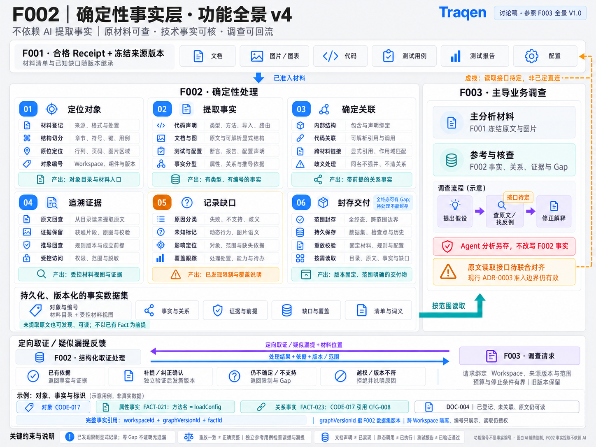

> Language: **English** · [简体中文](README.zh-CN.md)

---
feature_ids: [F002]
related_features: [F001, F003, F004]
topics: [deterministic-facts, evidence, controlled-material-view, coverage, functional-design]
doc_kind: feature-discussion
created: 2026-09-09
updated: 2026-09-15
version: "functional-panorama-v4-f003-style"
status: discussion-draft
---

# F002 Deterministic Facts: Functional Design (Panorama v4 · F003 Style)

## 1. Status of this edition

The content baseline remains panorama v4, checked by Kimi and incorporated under the operator's 07:06 UTC authorization on 2026-09-15. Following the subsequent style-only request and the 07:53 UTC request to view it inside the document, **the F003-style edition of v4 is now the current displayed image**. Functions, connection logic, and unresolved items remain unchanged; only visual styling differs. **Diagram adoption does not finalize interface contracts, establish F002 implementation, or authorize implementation; the document remains a discussion draft.**

This update embeds the existing style edition without regenerating it; original v1–v4 images and generation records remain available. Kimi's independent check covered original v4; the style edition has a separate generation and author visual-check record, not a new independent acceptance verdict. This update does not modify canonical F002/F003 specs, ADRs, lifecycle, code, or other features. Original-material access remains an open item in section 9; restyling does not select direct access or short-lived handles.

## 2. Goal, input, and output

**Goal: give Traqen's downstream knowledge graph verifiable, referenceable, reproducible technical evidence without treating Agent interpretations as source facts.**

- **Input:** an immutable F001 source version currently qualified for admission, its inventory, Receipt, and inherited gaps; not a live working directory, movable branch, or unpublished source bundle.
- **Processing:** versioned syntax/symbol analysis, explicit structure and identifier matching, and derivation rules with inspectable premises. F002 fact extraction does not rely on Agents, language models, or vision models.
- **Output:** a persistent, versioned, scoped fact dataset with a material inventory and controlled material view, evidence, gaps, and semantic definitions. An API tree, conversation summary, or unstructured text dump is not the whole product.
- **Consumer:** F003 leads business investigation using frozen source materials as its primary analysis material and F002 facts/gaps for reference, verification, and navigation. Extracted facts must not define all material F003 can see.

Determinism means replay under fixed conditions; it does not establish correctness or completeness. F002 owns its technical records and rules, not business interpretation or actual execution verification.

## 3. Current functional panorama and historical diagrams

### 3.1 Current diagram: functional panorama v4 · F003 style

[Open the current style edition](assets/f002-functional-panorama-v4-f003-style.zh-CN.png) · [Style prompts, provenance, and verification record](assets/f002-functional-panorama-v4-f003-style.prompt.md) · [Compare original v4](assets/f002-functional-panorama-v4.zh-CN.png). Both language pages embed the same Chinese image; illustrated identifiers are examples, not actual product records.

The visual reference is F003's current V2.0 image: light-gray background, white rounded cards, charcoal text, and blue accents. It contributes style only, not F003 functions or workflow. Violet requests, blue responses, teal reference output, and the amber unresolved-interface dashed line retain their distinct meanings.

v4 preserves six capabilities, twenty-four subfunctions, five output parts, and the bidirectional evidence loop while applying three visual corrections:

- The main heading is “F002 · 确定性处理” (deterministic processing). Independent verification remains a quality constraint and a condition of confirmed corrections, not a seventh capability.
- An amber dashed connector links the unresolved-interface note to F001, explicitly labeled as an undecided interface rather than approved direct access. It is not an approved physical read path.
- The “read originals / find counterexamples” step carries a matching “接口待定” (interface undecided) badge; the note that current ADR-0003 admission boundaries remain effective is preserved.

The image's “参照 F003 全景 V1.0” label records the reference baseline when v4's content was drawn, not F003's latest version. [Current F003 design](../../docs/design/F003-traceability-graph/README.md) has advanced to V2.0. The style-only request preserves existing image text; V2.0 is the visual reference, not authority to modify F003 or close cross-feature alignment items.

### 3.2 Historical diagrams (no longer the primary diagram)

| Version | Image and record | Archival purpose |
|---|---|---|
| v1 | [Original overview](assets/f002-functional-overview-v1.zh-CN.png) | Early object/fact examples; some wording was subsequently corrected. |
| v2 | [Original second-level diagram](assets/f002-functional-breakdown-v2.zh-CN.png) | Early expansion into six capabilities and twenty-four subfunctions; 01–06 identify functions, not facts. |
| v3 | [Functional panorama](assets/f002-functional-panorama-v3.zh-CN.png) · [Generation record](assets/f002-functional-panorama-v3.prompt.md) | Introduces material views, F003's primary/reference distinction, and the bidirectional loop; v4 refines the heading and unresolved-interface cues. |
| Original v4 | [Original functional panorama](assets/f002-functional-panorama-v4.zh-CN.png) · [Generation record](assets/f002-functional-panorama-v4.prompt.md) | Kimi-checked content baseline, retained for comparison with the visually restyled edition. |

### 3.3 Historical wording corrections and continuing boundaries

This table explains old diagram wording; it does not reinstate corrected assertions as v4 rules.

| Wording or possible interpretation | Current qualification |
|---|---|
| F003 reads facts and controlled evidence. | Authorized, registered material not understood by extractors must remain discoverable and readable. The material view cannot include only snippets already supporting Facts. |
| F003 does not directly read F001. | Current ADR-0003 governs admission and provenance access, not a ban on seeing original text. F003 V1.0 confirms original-material-first analysis with F002 reference results; the access interface still needs joint alignment. The diagram grants no bypass authority. |
| Stable, complete input. | Accountable records and dispositions within a declared delivery scope, not exhaustive fact extraction or complete business understanding. |
| Preserve a gap when uncertain. | Detected limitations must be explicit. Undetected omissions do not automatically produce gaps; zero gaps is not a completeness proof. |
| Seal once all work is terminal. | All declared work must have a terminal disposition and clear boundaries. Explicit gaps are allowed; pending work is not terminal. Other F002 repository scopes need not finish first. |
| Controlled access and redaction. | Honor source/access policy and retain positions and transformation explanations. Separate permitted original evidence from redacted views; never overwrite originals for display or promise to retain sensitive content prohibited by policy. |

AI-assisted illustration is separate from product fact extraction. These images do not introduce AI extraction into F002.

## 4. Six capabilities and twenty-four subfunctions

The table matches v4's six capabilities and twenty-four subfunctions; it is not an implementation checklist. Object, fact, evidence, gap, and version views expose the dataset; an API directory/tree is one projection. Independent correctness validation spans extraction, relationships, and delivery as described in section 7, rather than forming a seventh capability.

| Capability | Subfunction | Visible behavior | Direct value |
|---|---|---|---|
| 01 Locate objects | Register materials | Source inventory, formats, components, and processing dispositions. | Identify the material basis, restrictions, and scope exclusions. |
| 01 Locate objects | Split structure | Recognized sections, symbols, configuration keys, and test cases. | Navigate meaningful blocks rather than filenames alone. |
| 01 Locate objects | Locate in source | Lines/columns, pages, structural positions, or image regions in fixed material. | Return to the same version and precise position. |
| 01 Locate objects | Identify objects | Object identity, Workspace, source component/version, and display aliases. | Avoid ambiguous references across projects. |
| 02 Extract facts | Code declarations | Types, methods, imports, routes, and other supported declarations. | Inspect explicit technical structure. |
| 02 Extract facts | Documents and images | Source text, parseable explicit structures, original images, and locations. | Preserve what a document says without guessing image business semantics. |
| 02 Extract facts | Tests and configuration | Cases, assertions, report records, configuration declarations, and supported references. | Connect assets to evidence without claiming execution. |
| 02 Extract facts | Classify facts | Distinguish recorded statements from rule-based derivations; inspect property and relationship facts. | Understand exactly what each record supports. |
| 03 Establish relationships | Internal structure | Containment and declaration bindings. | Recover local context and ownership. |
| 03 Establish relationships | Code links | References/calls resolvable within declared capabilities, with premises. | Follow technical links without treating static calls as observed execution. |
| 03 Establish relationships | Cross-material links | Explicit IDs, references, links, or scoped matching with supporting evidence. | Trace code, documents, configuration, and tests together. |
| 03 Establish relationships | Handle ambiguity | Conflicting candidates, distinct same-name objects, and unresolved link reasons. | Avoid merging or linking based on resemblance alone. |
| 04 Trace evidence | Read originals | Navigate from facts/objects to fixed source or from the inventory to unextracted material. | Check conclusions and context an extractor may have missed. |
| 04 Trace evidence | Preserve evidence | Permitted snippets/images, content checks, locations, and explicit restricted-content dispositions. | Recheck independently of live sources or Agent sessions. |
| 04 Trace evidence | Inspect derivations | Rule/version, inputs, parameters, and premises. | Separate source evidence from algorithm behavior and errors. |
| 04 Trace evidence | Controlled access | Current authorization, scoped access, redaction/restriction notices, and source binding. | A known identifier never bypasses authorization. |
| 05 Record gaps | Classify causes | Detected parse failures, unsupported inputs, and ambiguity. | Distinguish failure, unsupported capability, and no match. |
| 05 Record gaps | Mark unknowns | Dynamic behavior, image semantics, missing provenance, or missing execution binding. | Do not turn unknowns into negative facts. |
| 05 Record gaps | Locate affected scope | Affected materials, objects, scopes, and unsupported capabilities. | Explain which questions a limitation affects. |
| 05 Record gaps | Track coverage | Material dispositions, declared-capability coverage, pending work, and known gaps. | Separate material processing, validated extraction capability, and business investigation. |
| 06 Seal and deliver | Seal a scope | Terminal-work reconciliation, boundary declarations, immutable checkpoints. | Deliver ready scopes without waiting for all repository extraction. |
| 06 Seal and deliver | Persist results | Recoverable datasets, material-view references, manifests, and history. | Retain the same evidence across sessions and Agents. |
| 06 Seal and deliver | Verify replay | Compare fixed-material/rule/configuration outputs and record discrepancies. | Test reproducibility without substituting it for correctness. |
| 06 Seal and deliver | Read on demand | Object indexes, facts/subgraphs, controlled material, evidence, gaps, versions, and definitions. | Avoid loading everything or losing provenance through summaries. |

## 5. Output data product and identifiers

### Five logical deliverables

These define content boundaries, not finalized JSON schemas, database tables, or API names.

| Part | Required meaning |
|---|---|
| Objects and identifiers | Material inventory, material/structural identities, component/version, precise location, disposition, and controlled material-view references; successful extraction is not a prerequisite. |
| Facts and relationships | Typed property/relationship records, subjects/objects or values, statement/derivation semantics, and applicability. Not every fact is an edge. |
| Evidence and premises | Source references, controlled original text/images or resolvable access references, locations/content checks, extractor versions, inputs, and premises. |
| Gaps and coverage | Inherited F001 gaps, detected F002 limitations, affected objects/scopes, capability declarations, dispositions, and pending states. An absent record does not establish absence of a problem. |
| Manifest and definitions | Workspace, source version, F002 dataset/checkpoint version, scope boundaries, rule/configuration/contract versions, record manifest, and type/relationship definitions. |

A controlled material view is neither an unrestricted copy of all originals nor necessarily a second physical copy. Authorized consumers must be able to resolve stable references to frozen material, including unextracted content. Physical reuse and access interfaces remain open.

### Identifier principles

- The discussed complete fact reference is `workspaceId + graphVersionId + factId`. Here `graphVersionId` identifies the F002 dataset, not an F003 business graph revision.
- Short labels such as `FACT-023`, `CODE-017`, and `CFG-008` are display aliases, not global identity. Object and fact identifiers are not interchangeable.
- Preserve source-component namespaces. Same paths, symbols, or content across projects do not automatically merge. Check project/Workspace membership and authorization when resolving references.
- Deterministic record identity excludes the current run timestamp; operational audit metadata may be recorded separately. The ID algorithm, hash inputs, rename behavior, and cross-version identity remain undecided.
- Corrections publish a new version and preserve old references/derivations. F003 does not overwrite old F002 Facts. Knowing an identifier grants no access.

API trees, relationship graphs, lists, and evidence panels project the same data product. Physical storage is undecided; merely proposing a graph database does not settle the delivery contract.

## 6. User journey and F003 collaboration

1. **Confirm materials:** select an admitted frozen F001 version; inherit its full inventory and limitations, and declare F002 scope/capabilities.
2. **Establish a baseline inventory:** expose objects/materials and processing states independently of an Agent hypothesis. Registration is not semantic extraction; unpublished F001 material cannot enter.
3. **Deliver ready scopes:** persist referenceable material views and completed facts within declared scopes. Pending work is not a sealed result.
4. **Investigate:** F003 studies authorized frozen originals, consulting F002 facts, relationships, rules, and gaps to form hypotheses and find counterexamples. Users can inspect material beyond existing graph edges.
5. **Request evidence and correct errors:** F003 can request specific scopes/relationships and report suspected omissions with positions. F002 uses supported rules or exposes limitations. Agent suspicion is not automatically a Fact; corrections require independent verification and a new version.
6. **Retain distinct outcomes:** F002 preserves technical records; F003 preserves business analysis with state, evidence, and uncertainty. Later investigation explicitly selects updated inputs rather than silently replacing a running input version.

The retained direction is **baseline inventory + F003-question-driven evidence extraction + independent correctness validation**. Neither full extraction before investigation nor registering only what an Agent happens to ask is required.

### Directed evidence requests / suspected-omission feedback (v4 loop)

**Request: F003 → F002.** Supply an evidence question or suspected omission with material positions, bound to Workspace, source version, and scope, with bounded budget and stopping conditions. Agent suspicion is an input to investigate, not an instruction to overwrite facts.

**Response: F002 → F003.** Return the result, supporting basis, and applicable version/scope, distinguishing four outcomes:

| Outcome | Response and constraint |
|---|---|
| Existing support | Return existing facts and evidence. |
| Confirmed additional extraction / correction | Publish a new version after independent verification; retain old versions and references. |
| Still uncertain / unsupported | Return detected limitations and gaps, without inventing certainty. |
| Unauthorized / version mismatch | Reject with a reason; do not expand access or mix versions. |

F003 is an important application-validation channel, not the sole evaluator of F002. [Current F003 functional design](../../docs/design/F003-traceability-graph/README.md) uses automatic admission in Agent-analysis state plus exception-based human review. This draft does not restore the historical all-candidates-must-be-approved rule.

## 7. Fact semantics and quality boundaries

### Distinctions that must survive

- A documented business rule is not proof of its implementation.
- A static call is not observed execution; a declared configuration value is not an effective runtime value.
- A test or report is not proof that a particular version passed in a particular environment. Execution observations require case identity, execution source, command, environment, tested version, and report binding. Insufficient binding retains the report statement plus a gap, not an invented pass. F002 does not replace F004 execution verification.
- Registering text/images/scans is not understanding their semantics. Arbitrary image meaning, probabilistic recognition, or vision-model interpretation is not a deterministic F002 fact. Retain permitted material and detected limitations where proof is unavailable.
- Name similarity alone does not establish identity. No edge is not proof of no feature or no impact.

### Validate four separate questions

These are discussion requirements for future concrete acceptance cases, not passed test results.

| Question | Evidence | What it cannot establish |
|---|---|---|
| Is replay reproducible? | Compare normalized outputs under identical material, rules, and configuration. | The same errors and omissions can repeat. |
| Are facts correct? | Source/rule/premise inspection; positive, negative, ambiguous, and scope-sensitive cases. | Correct records do not prove all records were extracted. |
| Are declared capabilities missing facts? | Independently checked fixtures/expected sets, bounded syntax checks, change tests, and sampling. | Bounded evidence is not a universal completeness proof. |
| Are outputs useful for investigation? | Representative F003 queries and human business questions, recording missing material/relations and misuse. | An Agent finding no problem does not establish correctness. |

Example: an independently checked fixture contains ten functions, but extraction outputs nine and labels the file parsed. Inventory reconciliation, repeatability, and zero gaps can all pass. Independent expectations are needed to detect the omission; the system cannot promise every omission necessarily gets logged.

Material accounting applies to its declared set. Gaps describe detected limitations, not every unconnected object pair. Unknown unknowns neither disappear through accounting nor invalidate the value of verifiable facts already obtained.

## 8. Scope and non-goals

This edition archives functional direction without re-freezing a stack-specific MVP. Earlier Java/Spring, Node.js/Express, and OpenAPI discussions inform sample and capability selection alongside actual inventories and representative investigation needs.

- Materials include document text/images, code, test cases/reports, and configuration, but supported formats, syntax, and provable relationships must be declared individually; this is not all-format understanding.
- No F002 Agent/LLM business classification, intent interpretation, vision-model inference, or adjudication of Agent business candidates.
- No promise to execute applications, reconstruct all dynamic behavior, establish effective environment configuration, or replace test-execution verification.
- Full database/external-dependency maps, cross-version impact comparison, exhaustive non-HTTP support, and every language are not implicit first-release commitments. Version retention is not impact-analysis delivery.
- Archiving diagrams or peer discussion does not change feature status, source admission, access authority, or authorize implementation.

## 9. Open alignment items

| Question | Current boundary |
|---|---|
| Original-material access from F001 to F003 | [ADR-0003 decision 8, current Chinese edition](../../docs/decisions/ADR-0003-source-truth-boundary.zh-CN.md) still makes F002 the sole direct source-bundle consumer. F003 V1.0 confirms original-material-first analysis but leaves direct access versus a controlled service undecided. The discussed F002 material view, full-inventory transfer, authorization rechecks, and version binding need joint alignment, not a silent ADR rewrite. |
| Output schema and semantics | Five content parts and qualified-reference principles are discussed; schemas, source-location formats, type vocabulary, queries/pagination, and errors remain open. |
| Multi-project identity | Preserve Workspace/version isolation; project-to-Workspace relationships, stable object keys, and cross-version alignment algorithms need the product identity model. |
| Initial extraction capabilities | Actual samples, declared capability, and real investigation questions jointly inform scope. A single F003 query is insufficient. |
| Checkpoint delivery | Terminal scoped work, explicit gaps, and clear cross-scope boundaries are required; granularity, incremental publishing, and pinned-input reads remain open. |
| Persistence and recovery | Durable references, recovery, and history are required; the physical store, original-byte reuse, capacity, and backup mechanism are not confirmed F002 contracts. |
| Acceptance | Separate correctness, bounded omissions, replay, and application usefulness. Reference datasets, coverage denominators, and thresholds remain open. |

A next discussion can refine the output contract, validate it with both representative F003 investigation and independent fixtures, then select initial implementation capabilities. Parallel development is an implementation-plan option, not authorized by this archive.

## 10. Provenance and archival record

| Item | Source |
|---|---|
| F002 thread | `thread_mtgygk6ew4qqmz7b` |
| Operator's explicit non-AI extraction goal | `0001788746079741-000169-e50eb527` |
| Output-first, identifiers, multi-Workspace discussion | `0001788746987542-000179-190eb843`, `0001788751324627-000207-ed56ac2c`, `0001788752020107-000212-e846349c` |
| Kimi's second-level diagram check | `0001788920209120-000047-1fde06b9`; a peer image check, not operator finalization. |
| Opus's suggestions | `0001788937824683-000117-596bec20` |
| CodeX's qualifications | `0001788938391946-000126-0d7c374c`: support contract-first, material views, and real scenarios; reject F003-only evaluation and exclusively demand-triggered extraction. |
| Initial archival authorization | `0001788939317249-000000-39316dac`: record one edition of existing F002 functions and diagrams according to the discussion. |
| Evidence-loop decision | `0001789004687536-000113-c9b9f8c7`: add directed evidence requests / suspected-omission feedback from F003 to F002 and a return path. |
| v3 redraw and visual suggestions | Redraw authorization `0001789005669469-000128-c60201b3`; Opus's three visual suggestions `0001789008610746-000150-a4270c5a`. |
| v4 edit authorization | `0001789442627373-000010-7aa2f5de`: the operator requested image changes where the author agreed with the review, or an explanation of disagreement. |
| Independent v4 image check | Kimi, `0001789455416701-000276-ad9634c8`, 06:56 UTC on 2026-09-15: all three corrections implemented and the image check passed; not code or interface-contract acceptance. |
| Original v4 design-update authorization | `0001789455996764-000287-b731c634`, 07:06 UTC on 2026-09-15: put this edition into the design document. |
| Style-only authorization | `0001789456971433-000308-709a079d`, 07:22 UTC on 2026-09-15: preserve existing content and connection logic while matching the F003 diagram's style. |
| Style-edition embedding authorization | `0001789458792213-000336-9a7994b2`, 07:53 UTC on 2026-09-15: put it into the document for the operator to view there. |
| F003 reference versions | The image references V1.0 at `e3716b6`; current F003 design adopted V2.0 at `7cd6a75`. Preserve the historical image reference without treating version advancement as interface alignment. |

Each generation is archived byte-for-byte from its original output; this update changes document references without regenerating or overwriting images. The v3/v4 and style-edition prompts and provenance records accompany their images:

| File | Original generated filename | SHA-256 |
|---|---|---|
| `assets/f002-functional-overview-v1.zh-CN.png` | `exec-987b13fb-117f-493f-a15a-3fedd42cdbe9.png` | `7f78483b8f323bb544aca85f107da3fa1ead8a9f8b5392b56907e04d130a6e44` |
| `assets/f002-functional-breakdown-v2.zh-CN.png` | `exec-d946d2ab-61cc-44d9-8cb9-95da91de28ae.png` | `3d45e9c451e75ed7222d3b951f5bac164959f38484e432a575992f4ddb652ff1` |
| `assets/f002-functional-panorama-v3.zh-CN.png` | `exec-f46dc369-a3fa-4f0d-a627-9cd787399b2f.png` | `b67bd964325768e6ef8162a3b8fef95aff173c80c5688089b8d46ef37a2d651a` |
| `assets/f002-functional-panorama-v4.zh-CN.png` | `exec-fd0c1b84-1fbb-484a-b71d-5e90387ad7e1.png` | `8689609c2c1782f8353842aad48822f4e9708c43d3b5546b3b72d18efd164f9f` |
| `assets/f002-functional-panorama-v4-f003-style.zh-CN.png` | `exec-27631479-1acc-4a6d-b131-c3a490c7fb7e.png` | `ea72b7d8850adb60328588ed4f88a86e6b029867b241246f30be404e03a4e976` |

Related documents: [existing F002 spec](../../docs/features/F002-feature-api-traceability.md), [current F003 functional design](../../docs/design/F003-traceability-graph/README.md), [current source-boundary ADR](../../docs/decisions/ADR-0003-source-truth-boundary.zh-CN.md). This archive does not automatically synchronize or change their status.
