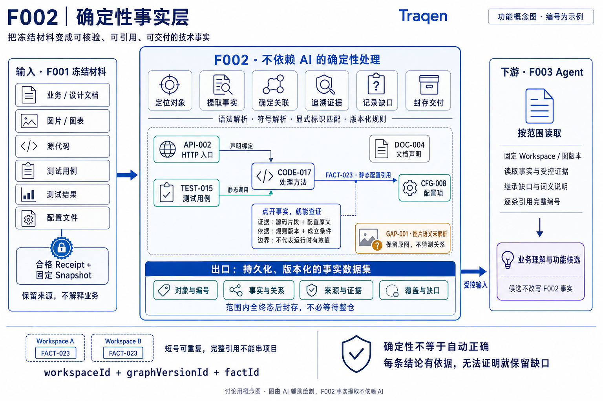
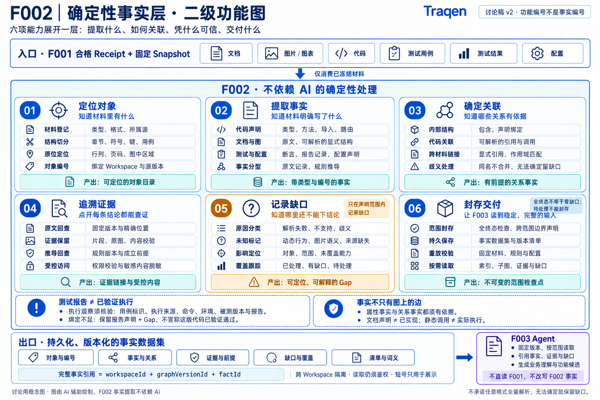

> 语言：**简体中文** · [English](README.md)

---
feature_ids: [F002]
related_features: [F001, F003, F004]
topics: [deterministic-facts, evidence, controlled-material-view, coverage, functional-design]
doc_kind: feature-discussion
created: 2026-09-09
updated: 2026-09-09
version: "discussion-2026-09-09"
status: discussion-draft
---

# F002 确定性事实层：功能与图稿讨论版

## 1. 本版是什么

本页根据 co-creator 于 2026-09-09 07:35 UTC 的要求，将现有 F002 功能、两张图和截至本次授权的讨论整理到一起，供继续确认。**这是讨论版，不是正式功能定稿、接口合同或实施授权。**

本次保留原图，不改 F002/F003 正式 Spec、ADR、生命周期、代码或其他 Feature 文档。图稿早于最后一轮讨论；第 3 节明确图后补充，第 9 节保留待对齐项，不以本次归档消除分歧。

## 2. 目标、入口与出口

**目标：让 Traqen 的后续知识图谱建立在可核验、可引用、可复现的技术证据上，而不是把 Agent 的解释当作原始事实。**

- **入口：** F001 已冻结且当前准入合格的来源版本、材料清单、Receipt 及继承 Gap。不是实时工作目录、可移动分支名或尚未发布的来源包。
- **处理：** 不依赖 Agent、大语言模型或视觉模型提取事实；使用版本化的语法解析、符号解析、显式结构与标识匹配、可检查前提的推导规则。
- **出口：** 持久化、版本化、可按范围读取的事实数据集，连同材料目录与受控材料视图、证据、缺口和词义说明。不是只交一棵 API 树、一次会话摘要或一大段无结构文本。
- **下游：** F003 主导业务调查，以固定来源材料为主分析材料，以 F002 事实和缺口作参考、核查和定位；F002 不能把自身已提取事实当作 F003 唯一可见的材料。

确定性只说明固定条件下可重放，不自动说明事实正确，也不说明没有遗漏。F002 对自己的技术记录及规则负责，不替代业务解释或真实运行验证。

## 3. 现有图稿与最新补充

### 3.1 功能总览原图

[打开总览原图](assets/f002-functional-overview-v1.zh-CN.png)。图内 API、代码、配置、文档和测试节点为说明关系的样例，不代表全部事实类型或已实现能力。

### 3.2 二级功能原图

[打开二级功能原图](assets/f002-functional-breakdown-v2.zh-CN.png)。01–06 是功能编号，不是事实编号；本页保存生成时的 v2 图片，不冒充已重绘的新版本。

### 3.3 读图时必须同时保留的后续讨论

| 图中表述或容易产生的理解 | 当前讨论中的补充与限定 |
|---|---|
| F003“读取事实与受控证据” | 还要能发现、读取授权范围内尚未被提取器理解的原始材料。受控材料视图不能只收录已有 Fact 的证据片段；否则提取遗漏也会变成下游视野的遗漏。 |
| F003“不直读 F001” | 现行 ADR-0003 限定来源准入与 provenance 通道，不等于禁止 F003 看原文。F003 V1.0 已确认原材料主分析、F002 参考；具体读取接口仍需联合对齐，不能凭此图新增绕过现行 ADR 的权限。 |
| “稳定、完整输入” | 指已声明交付范围内清单、记录和处置可对账，不表示业务理解完整或事实提取无遗漏。 |
| “无法确定就保留缺口” | 指检测到的限制应显式记录。算法没有发现的漏提不会自动生成 Gap；零 Gap 不能证明无遗漏。 |
| “全终态后封存” | 已声明工作均已完成处置，且边界可说明；允许有明确 Gap，不允许把待处理伪装成终态。不必等整仓所有 F002 提取工作完成。 |
| “受控访问与脱敏” | 遵守来源和访问策略，保留证据定位与变换说明；可保留的原文与脱敏视图区分，不为展示覆盖原始证据，也不承诺保存被策略禁止的敏感原文。 |

图由 AI 辅助绘制，和产品中 F002 的事实提取是否使用 AI 是两件事；本方案不以图像生成能力作为提取机制。

## 4. 六项功能、二十四项子功能

下表是现有二级功能的文字展开，不是实现完成清单。用户可按对象、事实、证据、缺口和版本浏览；API 目录或树只是其中一种投影。

| 功能 | 子功能 | 用户实际能看到或使用什么 | 直接价值 |
|---|---|---|---|
| 01 定位对象 | 材料登记 | 来源版本内的材料清单、类型、格式、组件与处理处置。 | 知道本次分析依据哪些材料，哪些受限或范围外。 |
| 01 定位对象 | 结构切分 | 可识别的章节、代码符号、配置键、测试用例及所属材料。 | 按有意义的块查找，不必只在文件名之间跳转。 |
| 01 定位对象 | 原位定位 | 固定材料中的行列、页码、结构位置或图片区域。 | 回到相同版本的具体位置。 |
| 01 定位对象 | 对象编号 | 对象标识、所属 Workspace、来源组件与版本；短号仅展示。 | 多项目并存时引用不串号。 |
| 02 提取事实 | 代码声明 | 已支持语法中的类型、方法、导入、路由等声明记录。 | 核对源码明确存在的技术结构。 |
| 02 提取事实 | 文档与图 | 原文记录、可解析的显式结构、原图及其定位。 | 保留文档怎么说和图片在哪里，不猜图片的业务含义。 |
| 02 提取事实 | 测试与配置 | 用例、断言、报告记录、配置声明及可验证的引用。 | 将测试资产、报告声明和配置值连接到证据，而不冒充运行结果。 |
| 02 提取事实 | 事实分型 | 区分材料中的原文/声明记录与有规则、前提的推导；属性事实和关系事实都可查。 | 看清每条记录究竟证明了什么。 |
| 03 确定关联 | 内部结构 | 文件/章节/符号间的包含、声明绑定等结构关系。 | 从局部返回其所属上下文。 |
| 03 确定关联 | 代码关联 | 能在声明能力内解析的引用、调用及适用前提。 | 跟踪可证明的技术联系，不把静态调用当作已执行。 |
| 03 确定关联 | 跨材料链接 | 显式 ID、引用、链接或有作用域约束的匹配，以及支持它们的依据。 | 代码、文档、配置与测试可交叉追溯。 |
| 03 确定关联 | 歧义处理 | 冲突候选、同名不同对象及无法唯一确定的链接原因。 | 不因名称相似就强行合并或连边。 |
| 04 追溯证据 | 原文回查 | 从对象或事实回查固定版本原文，也可从材料目录进入未提取原文。 | 既能核实结论，也能检查提取器遗漏的上下文。 |
| 04 追溯证据 | 证据保留 | 获准保存的片段、原图、内容校验与来源位置；受限内容明确处置。 | 不依赖实时源目录或一次 Agent 会话来复核。 |
| 04 追溯证据 | 推导回查 | 规则名称/版本、输入事实、参数与成立前提。 | 区分原材料、算法处理和算法可能的错误。 |
| 04 追溯证据 | 受控访问 | 当前权限检查、按范围取证、脱敏/受限提示和来源绑定。 | 能读所需材料，但不因持有编号就绕过授权。 |
| 05 记录缺口 | 原因分类 | 解析失败、不支持、歧义等已发现限制。 | 区分失败、未支持与“确实没有命中”。 |
| 05 记录缺口 | 未知标记 | 动态行为、图片语义、来源或执行绑定缺失。 | 避免把未知伪装成否定事实。 |
| 05 记录缺口 | 影响定位 | 缺口关联的材料、对象、范围与未覆盖能力。 | 明白限制影响哪些问题，而不是只得到一个全局告警数。 |
| 05 记录缺口 | 覆盖跟踪 | 材料处理处置、已声明能力的覆盖信息、待处理项与已知 Gap。 | 分清材料已处理、能力已验证和业务已调查这三件事。 |
| 06 封存交付 | 范围封存 | 范围内全终态核对、边界声明和不可变检查点。 | 已就绪的范围可以交付，不等整仓提取完。 |
| 06 封存交付 | 持久保存 | 可恢复读取的事实数据集、材料视图引用、版本清单与历史。 | 关会话或更换 Agent 后仍引用同一份依据。 |
| 06 封存交付 | 重放校验 | 固定材料、规则、配置下的结果比对与异常记录。 | 检查可复现性，但不拿它替代正确性测试。 |
| 06 封存交付 | 按需读取 | 对象索引、事实/子图、受控材料、证据和缺口，带版本与词义。 | F003 不必一次读入整个数据集，也不会只剩无来源的摘要。 |

## 5. 出口数据产品与编号

### 五部分逻辑交付物

这是出口内容边界，不是已经定稿的 JSON Schema、数据库表或 API 名称。

| 部分 | 至少要表达什么 |
|---|---|
| 对象与编号 | 来源材料目录、材料/结构对象身份、组件与版本、精确位置、处理处置；包含通往受控材料视图的引用，不要求先有提取成功的 Fact。 |
| 事实与关系 | 有类型的属性或关系记录、主体/客体或取值、声明/推导的含义与适用范围。不能把所有事实都压成无语义的图边。 |
| 证据与前提 | 来源引用、受控原文/图片内容或可解析的访问引用、位置与内容校验、提取规则版本、输入依据和前提。 |
| 缺口与覆盖 | F001 继承 Gap、F002 已检测限制、受影响对象/范围、能力声明、处理处置和待处理状态；没有记录不等于没有问题。 |
| 清单与词义 | Workspace、绑定来源版本、F002 数据集/检查点版本、范围边界、规则/配置/契约版本、记录清单与类型/关系词义。 |

“受控材料视图”不是所有原文的无权限复制，也不表示一定再存一份字节。它要让获授权消费者按稳定引用读到对应冻结材料，包括没有被提取成事实的内容；具体存储复用与读取接口见第 9 节。

### 编号原则

- 讨论中的完整事实引用为 `workspaceId + graphVersionId + factId`；其中 `graphVersionId` 指 F002 事实数据集版本，不与 F003 业务图谱版本混用。
- `FACT-023`、`CODE-017`、`CFG-008` 等短号服务于展示和交流，不是跨 Workspace 唯一身份，也不能拿对象编号代替事实编号。
- 对象定位保留来源组件命名空间。同名路径、符号或内容跨项目不自动合并；完整引用仍须结合项目/Workspace 归属及访问权限校验。
- 固定输入的确定性记录身份不包含本次运行时间；运行审计信息可以另行记录。具体 ID 算法、哈希字段、重命名和跨版本身份策略尚待定。
- 修复提取结果发布新版本，旧引用和推导仍可查。不由 F003 原地改写旧 F002 Fact；编号本身不授予任何读取权限。

API 树、关系图、对象列表和证据面板都从这份数据产品投影，不另建互相矛盾的事实真相源。物理保存到何种数据库/文件存储仍未定，不能把“以后选个图数据库”当作已经解决交付合同。

## 6. 用户旅程与 F003 协作

1. **确认材料：** 架构师选定 F001 合格冻结版本；F002 继承完整材料清单与已知限制，登记本次范围和能力。
2. **建立基础目录：** 得到与某次 Agent 假设无关的对象/材料目录及处理状态。登记不等于已完成语义提取，F001 未发布的材料不能混进来。
3. **交付就绪范围：** 基础材料视图和已完成事实按声明范围形成持久化、可引用交付物；未处理工作不冒充已封存成果。
4. **展开调查：** F003 以获授权冻结原材料为主，参考 F002 的事实、关系、规则与 Gap，提出业务假设、寻找反例。用户可查原文和证据，不局限于已有图边。
5. **定向取证与纠错：** F003 可以提出需要补查的范围/关系、疑似漏提及来源位置；F002 按支持的规则处理，不能处理则明确限制。Agent 的怀疑不能自动升级成事实，修复须独立验证并产生新版本。
6. **保留两类成果：** F002 保存可核验技术记录；F003 保存带状态、依据和不确定性的业务分析。新版本被后续调查明确选用，不静默替换正在引用的输入。

本轮保留的推进方向是：**基础普查 + F003 问题驱动的定向取证 + 独立正确性验证。** 不要求先提完全部事实再启动业务调查，也不将提取能力缩成“Agent 问到什么才登记什么”。

F003 是重要的应用验证渠道，但不是 F002 唯一的验收者。当前 [F003 功能全景 V1.0](../2026-09-09-F003-traceability-graph-design/README.zh-CN.md) 已采用“自动收录 Agent 分析态 + 例外人工审核”；本稿不恢复旧版“所有候选都必须先人工批准”的规定。

## 7. 事实成立与质量边界

### 不允许偷换的含义

- 文档声明了某业务规则，不等于代码已实现该规则。
- 代码里有静态调用，不等于该路径实际执行过；配置声明值不等于运行环境的有效值。
- 测试用例或报告存在，不等于特定版本在特定环境已验证通过。执行观察须核对用例标识、执行来源、命令、环境、被测版本与报告绑定；不足时保留报告声明和 Gap，不虚构通过记录。F002 不替代 F004 的运行验证职责。
- 文本、图片或扫描文档被登记，不等于其语义已解析。任意图片的业务含义、概率识别结果或视觉模型解释不能当作 F002 确定事实；无法证明时保留获准材料及已知限制。
- 名称相似不是实体同一性的充分依据；没有关系边，也不是“没有功能/没有影响”的证明。

### 分开验证四件事

以下是待落为具体验收用例的讨论要求，不是已通过的测试报告。

| 验证问题 | 所需证据 | 不能由它推出什么 |
|---|---|---|
| 是否可复现 | 同一冻结材料、同一规则和配置重复运行，对比规范化输出。 | 相同错误或遗漏也可以重复出现。 |
| 事实是否正确 | 逐条原文、规则与前提回查；正例、反例、歧义和作用域案例。 | 单条正确不说明已经提取全部事实。 |
| 声明能力内是否漏提 | 独立核对的参考材料/预期对象集合、限定语法范围检查、变化测试及抽查。 | 对一个测试范围的证据不能扩成任意材料的全局完备性证明。 |
| 对实际调查是否够用 | 代表性的 F003 查询与人工业务问题，记录缺材料、缺关系及误用。 | Agent 没有发现问题，不代表没有问题。 |

例如：参考材料经独立核对有 10 个函数，提取器只输出 9 个却将文件标记为“已解析”。文件清单对账、重放一致、Gap 为零都可能同时成立。必须用独立参考结果发现漏提，不能承诺“任何遗漏都一定被系统记账”。

材料处置对账只覆盖其声明集合；Gap 只描述已发现限制，不能用任意两对象未连线来制造 Gap，也不能用未知未知的存在取消已有事实的可核查价值。

## 8. 当前范围与明确不做

本版保存的是功能设计方向，不借归档重新冻结技术栈 MVP。此前 Java/Spring、Node.js/Express、OpenAPI 的讨论是首批样本与能力清单的参考；应同时结合实际材料清单和代表性调查需求确认。

- 覆盖对象包括文档文字/图片、代码、测试用例、测试报告和配置，但每类材料的具体格式、语法及能证明的关系须逐项声明，不能写成“所有格式全量理解”。
- 不在 F002 做 Agent/LLM 业务归类、业务意图解释、视觉模型推断或 Agent 候选入图裁决。
- 不承诺执行应用、还原所有动态行为、证明真实环境配置或代替测试执行验证。
- 不把完整数据库/外部依赖地图、跨版本影响比较、非 HTTP 全覆盖或全部语言支持作为本版隐含首期承诺。保留版本和来源不等于已经交付变化影响分析。
- 不因图稿或多猫讨论就升级功能状态、改变来源准入/访问权限，或启动实现。

## 9. 待确认、待对齐项

| 问题 | 当前边界 |
|---|---|
| F001 原文到 F003 的具体读取入口 | [ADR-0003 决策 8](../../docs/decisions/ADR-0003-source-truth-boundary.zh-CN.md) 仍要求 F002 为唯一直接来源包消费者；F003 V1.0 确认原材料主分析，但未定直接读取还是受控服务。本轮建议补齐 F002 受控材料视图，读取入口、完整清单交接、鉴权复验、版本绑定需要联合对齐，不在此擅改 ADR。 |
| 出口契约字段与词义 | 五部分内容和完整引用原则已有讨论；具体 schema、材料定位格式、类型词表、查询/分页与错误返回未定。 |
| 多项目身份 | Workspace 与事实版本隔离必须保留；项目与 Workspace 的具体关系、稳定对象键和跨版本对齐算法需随产品身份模型确认。 |
| 首期提取范围 | 以实际样本清单、声明能力和真实调查问题共同界定；一个 F003 查询不足以决定全部能力范围。 |
| 检查点交付 | 范围内全终态、允许显式缺口、跨范围边界清楚；范围粒度、增量发布和 F003 固定输入的读取协议未定。 |
| 持久保存与恢复 | 必须能持久引用、恢复、查历史；物理存储、原文字节复用、容量和备份机制尚未作为 F002 合同确认。 |
| 质量验收 | 正确性、声明能力内漏提、重放和应用可用性分开检查；参考数据集、覆盖分母与验收阈值未定。 |

下一轮可先细化出口契约，用代表性 F003 调查和独立参考材料两条线验证，再确定首批实现能力。两边是否并行开发属于实施计划选择，本稿不自动授权该计划。

## 10. 追溯与归档说明

| 项目 | 来源或记录 |
|---|---|
| F002 讨论线程 | `thread_mtgygk6ew4qqmz7b` |
| co-creator 明确非 AI 确定性提取目标 | `0001788746079741-000169-e50eb527` |
| 出口优先、编号和多 Workspace 讨论 | `0001788746987542-000179-190eb843`、`0001788751324627-000207-ed56ac2c`、`0001788752020107-000212-e846349c` |
| Kimi 对二级功能图的核对 | `0001788920209120-000047-1fde06b9`；为图稿复核，不是 co-creator 正式定稿。 |
| Opus 的补充建议 | `0001788937824683-000117-596bec20` |
| 砚砚核对后的保留与纠正 | `0001788938391946-000126-0d7c374c`：采纳契约先行、材料视图、真实场景；不采纳 F003 唯一验收、完全按需才提取的推论。 |
| 本次写入授权 | `0001788939317249-000000-39316dac`：“先把现有F002的功能与图，按当前讨论写一版”。 |
| F003 当前版本参照 | 本地提交 `e3716b6` 与该功能设计中的独立确认记录；不以旧 F003 Spec 代替当前 V1.0。 |

图片逐字节归档，未重绘或覆盖：

| 文件 | 原始生成文件名 | SHA-256 |
|---|---|---|
| `assets/f002-functional-overview-v1.zh-CN.png` | `exec-987b13fb-117f-493f-a15a-3fedd42cdbe9.png` | `7f78483b8f323bb544aca85f107da3fa1ead8a9f8b5392b56907e04d130a6e44` |
| `assets/f002-functional-breakdown-v2.zh-CN.png` | `exec-d946d2ab-61cc-44d9-8cb9-95da91de28ae.png` | `3d45e9c451e75ed7222d3b951f5bac164959f38484e432a575992f4ddb652ff1` |

相关入口：[现有 F002 Spec](../../docs/features/F002-feature-api-traceability.zh-CN.md)、[F003 当前功能设计](../2026-09-09-F003-traceability-graph-design/README.zh-CN.md)、[来源边界 ADR-0003](../../docs/decisions/ADR-0003-source-truth-boundary.zh-CN.md)。这些文档不因本次讨论归档自动同步或变更状态。
