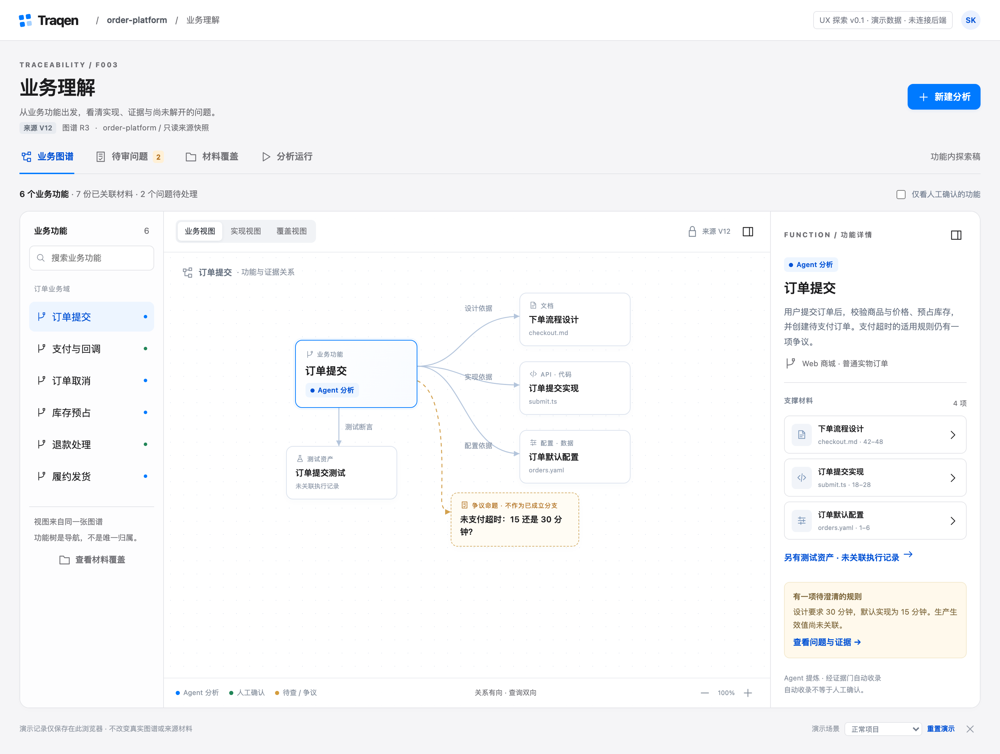
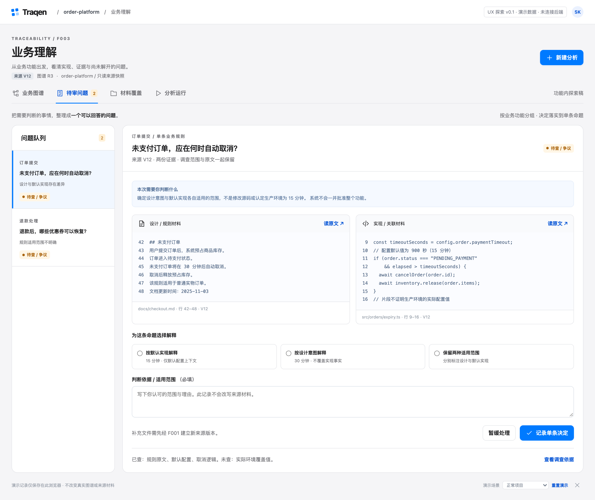
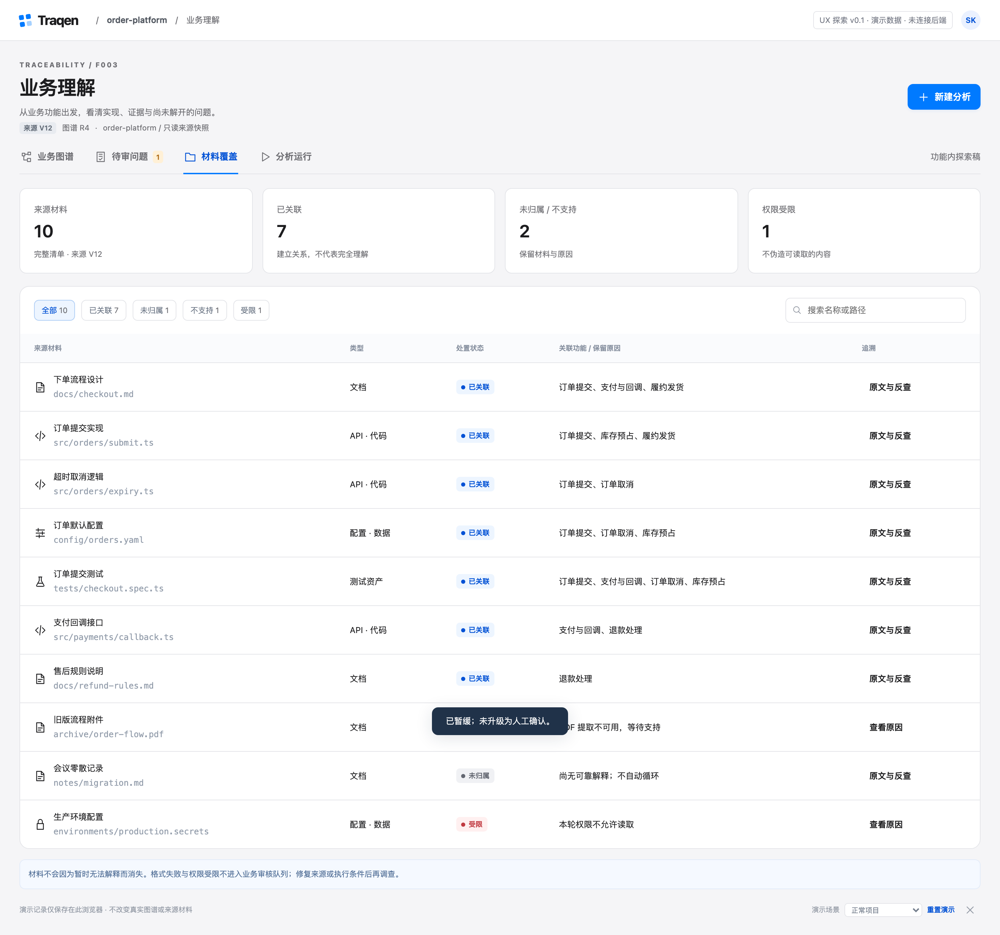
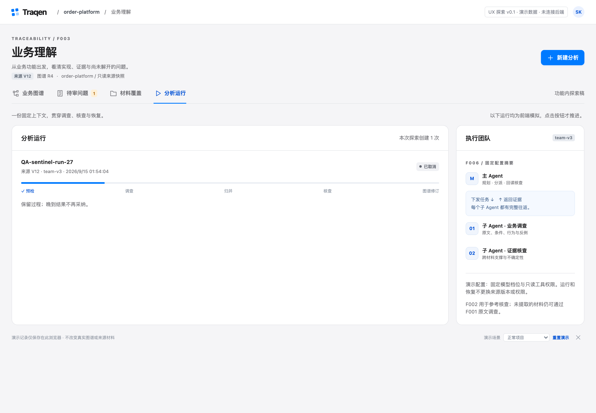

# F003 前端 UX 探索 v0.1 · 图文稿

[返回 F003 功能设计 V2.0](../../docs/design/F003-traceability-graph/README.md)

**这是同一版原型的不同页面，不是多份候选方案。** 四个主页面直接展示在本文中；截图已存入项目，不依赖临时服务、localhost 或另一台电脑的浏览器。

本版由砚砚独立探索，供讨论信息组织与交互，**尚未确认，可以推翻重做**。不绑定项目整体前端布局，不替换已确认的功能设计。所有订单、源码、审核记录与运行均为演示数据，未连接后端或真实 Agent。

## 1. 先看整体安排

| 工作面 | 用户主要回答的问题 | 对应功能设计 |
|---|---|---|
| 业务图谱 | 系统做什么？这项理解依据什么？ | 04 候选与归并、07 图谱追溯的浏览入口 |
| 待审问题 | 哪一条规则需要我判断？判断依据是什么？ | 05 例外分流、06 人工审核 |
| 材料覆盖 | 哪些材料已关联，哪些仍是缺口？ | 02 材料与覆盖、07 反向查询 |
| 分析运行 | 分析基于哪个版本？现在处于什么阶段？ | 01 准备、03 调查、08 运行维护的首轮演示 |

主线：**选择业务功能 → 查看关联材料 → 回查原文 → 处理具体争议 → 返回图谱查看单条决定。**

## 2. 业务图谱：左侧找功能，中间看关系，右侧读依据

[查看高清原图](assets/f003-ux-v0.1/01-graph-desktop.png)

- **左侧：** 按功能导航、搜索；提供仅人工确认的功能筛选。
- **中间：** 同一图谱切换业务、实现、覆盖视图；材料节点可以点开，争议命题区别于已成立分支。
- **右侧：** 显示当前功能的解释、来源、范围、支撑材料和未解问题；持续读原文时使用更大的阅读弹层。
- **状态：** Agent 分析、人工确认、待查 / 争议分开表达；自动收录不冒充人工确认。

辅助页面：[展开原文与材料反查](assets/f003-ux-v0.1/02-source-evidence.png) · [实现视图与共享材料的邻接功能](assets/f003-ux-v0.1/09-implementation-neighbor.png)

## 3. 待审问题：用具体问题与原文对照承载判断

[查看高清原图](assets/f003-ux-v0.1/03-review-workspace.png)

- **左侧：** 按功能组织问题，而不是要求逐个审核所有节点。
- **主体：** 先告诉人需要判断什么，再并排展示原文、来源位置与不同解释。
- **操作：** 选择解释、填写依据与适用范围，记录单条决定；也可以暂缓，问题继续保留。
- **范围：** 不一键批准整个功能或子图；人的决定不改写与其不一致的源码证据。新增文件仍需经过 F001 新版本。

示例中的“30 分钟设计 / 15 分钟默认实现”是待限定范围的规则，不是对生产环境实际生效值的认定。

## 4. 材料覆盖：材料没有解释，也不能消失

[查看高清原图](assets/f003-ux-v0.1/04-material-coverage.png)

- **清单：** 从来源版本继承材料，按名称、路径和处置状态检索。
- **处置：** 已关联、未归属、不支持与受限分别呈现，保留原因。
- **追溯：** 已有可读原文时，可反查哪些业务功能引用它；受限材料只能查看原因，不显示伪造内容。
- **边界：** 已读或已关联不等于完全理解，测试文件存在不等于测试通过。

## 5. 分析运行：固定上下文，进度与控制放在一起

[查看高清原图](assets/f003-ux-v0.1/06-analysis-runs.png)

- **创建前：** 命名分析，确认 F001 封存来源、F002 对应参考与 F006 固定配置。
- **预检：** 版本不一致时明确阻断；不提供跳过阻断强行启动的入口。
- **运行中：** 保留阶段、暂停、继续与取消；主子 Agent 以团队摘要呈现，每个子 Agent 都接收任务并返回证据。
- **演示方式：** 使用“推进演示一步”显式推进，不假装后台正在运行模型。

本图拍摄的是交互检查中的**已取消示例**，`QA-sentinel-run-27` 是验证输入，不是真实工程任务。取消记录会保留。

辅助页面：[新建分析与预检阻断](assets/f003-ux-v0.1/05-blocked-preflight.png) · [首次进入的空项目状态](assets/f003-ux-v0.1/07-empty-project.png)

## 6. 这一版先讨论什么，不代表什么

| 适合现在讨论 | 这版没有宣称完成 |
|---|---|
| 三栏浏览能否顺畅地找到功能与依据 | 全项目导航、工作台与统一布局定稿 |
| 原文弹层与独立审核页是否便于持续阅读 | 真实 Agent 调度、权限系统与后端接入 |
| 四个工作面的划分是否清楚 | 完整版本差异、局部重试和质量评估报表 |
| 状态与操作范围是否容易理解 | 所有审核操作、生产级大图布局或 F003 功能开发 |

原型中的决定与运行只保存在其浏览器的独立演示存储中。本文是**静态图文阅读版**：无需启动服务，但图片中的按钮不可点击；完整交互源码保留在下述原型提交中。

## 7. 来源与归档记录

| 项目 | 记录 |
|---|---|
| 原始探索授权 | `0001789460706075-000369-eea08c71`：独立做首版 F003 UX，允许之后推翻重做。 |
| 本次文档归档授权 | `0001789529980629-000418-be517eef`：远程无法打开，要求放入文档直接查看。 |
| 原型来源 | `design/f003-ux-v0.1`，提交 `1b41c61`，目录 `prototypes/f003-ux-v0.1/`。 |
| 截图来源 | 同一提交的 `evidence/` 中八张选定 PNG，原样复制，没有重新生成、改图或改文案。 |
| 原型检查 | 2026-09-15 作者记录：6 项状态测试、11 组浏览器检查通过；不是 UX 独立验收或确认。 |
| 本次检查 | 截图与源文件逐字节比对，核对文档相对链接、PNG 尺寸和 SHA-256；未重复执行交互验收。 |
| 校验清单 | [八张图的 SHA-256](assets/f003-ux-v0.1/SHA256SUMS) |
| 设计状态 | UX 探索 v0.1，未定稿；F003 功能设计 V2.0 及其图稿保持不变。 |

远程交付说明：上一轮 localhost 链接只指向访问者自己的设备，且预览服务有时限。此次将阅读产物放入项目主目录，以文档相对路径引用图片，不再把本机可达或导航排队当成用户已看到。
